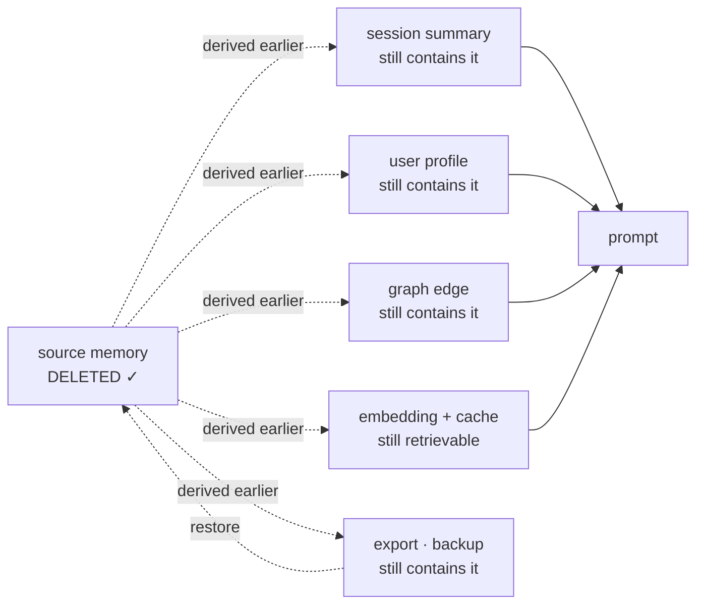

## 1. The Short Version

Six things are worth knowing before reading further.

1. **Almost every memory benchmark asks one question**: after a long
   conversation, can the system answer a question about something said earlier?
   That is recall. Most of what makes memory hard — correction, deletion,
   scope, trust, cost — is not on the scoreboard.
2. **A bad score on one benchmark is weak evidence.** These are end-to-end
   pipelines judged by a language model, and the memory layer is one of six
   things that determine the number.
3. **Stress testing is a different activity from benchmarking.** A benchmark
   ranks systems on a task. A stress test finds the input that breaks one. You
   need both, and the second is cheaper.
4. **Cost and latency are barely measured.** One system in this atlas records
   token volume in its harness. One measures retrieval latency. None reports
   bytes on disk per memory.
5. **The lag between writing a memory and being able to recall it is measured
   nowhere**, even though several systems here deliberately delay extraction by
   minutes or by a batch boundary.
6. **There is no forgetting benchmark.** Nothing in this atlas, and nothing in
   the published benchmarks it uses, tests whether a deleted memory stays
   deleted after the next background pass.

Everything below is evidence for those six claims, plus what a better
measurement set would look like — including a [contradiction test](#contradiction-test)
specified in enough detail to run, since supersession is the one part of
correction that existing benchmarks touch at all, and they touch only its
easiest half.

## 2. What Benchmarks Exist

### Found in the repositories reviewed here

These appear as committed harnesses in systems this atlas has read, so their
existence and use are verifiable from code.

| Benchmark | What it tests | Shipped as a harness by |
| --- | --- | --- |
| **LoCoMo** | Question answering over very long multi-session conversations, with single-hop, multi-hop, temporal, open-domain and adversarial question categories | [OpenViking](../systems/openviking/), [Honcho](../systems/honcho/), [Hindsight](../systems/hindsight/), [Basic Memory](../systems/basic-memory/) |
| **LongMemEval** | Long-conversation QA split by ability, including **knowledge updates** and **abstention** | [OpenViking](../systems/openviking/), [Honcho](../systems/honcho/), [Hindsight](../systems/hindsight/), [Swafra](../systems/swafra/), [agentmemory](../systems/agentmemory/), [Daimon](../systems/daimon/) |
| **BEAM** | Long-conversation QA at extreme length; Cognee's committed report covers 100K and 10M-token conversations | [Cognee](../systems/cognee/), [Honcho](../systems/honcho/) |
| **Oolong** | Present in Honcho's bench tree; not characterized here | [Honcho](../systems/honcho/) |
| **τ²-bench (tau2)** | Agentic tool use against a simulated user with policy compliance — a *downstream task*, not a memory test | [OpenViking](../systems/openviking/) |
| **SkillsBench** | Procedural/skill retrieval; a repository-local harness | [OpenViking](../systems/openviking/) |
| **Multi-hop QA** (MuSiQue, 2Wiki, HotpotQA) | Retrieval over a fixed corpus — RAG evaluation, with no writes accumulating over time | [HippoRAG](../systems/hipporag/) |
| **Minecraft tech tree** | Task completion by an agent with a skill library — measures whether procedural memory helps, not whether it is accurate | [Voyager](../systems/voyager/) |
| **Human believability ratings** | Whether simulated agents behave plausibly | [Generative Agents](../systems/generative-agents/) |
| **Repository-local eval harnesses** | Per-project cases with expected and forbidden hits, or replayed retrieval policies | [open-cowork](../systems/open-cowork/), [MetaClaw](../systems/metaclaw/), [MemPalace](../systems/mempalace/), [agentmemory](../systems/agentmemory/) |

Two entries in that table are doing something the others are not.

**LongMemEval's knowledge-update category** is the closest thing the field has
to a correction benchmark: the conversation contains a fact that is later
superseded, and the system is scored on whether it answers with the new value.
Its abstention category is the closest thing to a test for *not* answering.
Both are still question-answering — the system is never asked to prove the old
value is gone, only to prefer the new one at answer time.

**open-cowork's harness** is described below and is the most interesting
evaluation shape in the atlas, precisely because it is not a public benchmark.

### Named benchmarks outside these repositories

The atlas's convention is to separate what was read in code from what is known
otherwise, so these are listed with that caveat: they were **not** verified
against their own repositories in this review, and the descriptions come from
familiarity with the literature rather than inspection.

- **MSC (Multi-Session Chat)** — an early long-term dialogue dataset; largely
  superseded by LoCoMo and LongMemEval for this purpose.
- **Machine-unlearning benchmarks** (TOFU and similar) — these measure whether
  information can be removed from *model weights*. That is a genuinely
  different problem from removing a row from a memory store, and the two are
  often conflated in discussion. Relevant if you fine-tune on user data; not
  relevant to any system in this atlas.
- **Long-context benchmarks** — needle-in-a-haystack, RULER, ∞Bench and
  relatives measure what a model can do with a long prompt. They are not memory
  benchmarks, and the distinction matters for the argument in the next section.
- Several newer conversational-memory benchmarks have appeared that this review
  has not inspected. Treat any list of them, including this one, as incomplete.

### The boundary worth drawing

A long-context benchmark asks: given all of this text in the prompt, can you
answer? A memory benchmark should ask: given that this text is *not* in the
prompt and never will be, can the system decide what to retrieve, keep it
correct as it changes, and drop what it should not keep?

The blurring of that line is the field's central measurement problem, and it
leads directly to the next section.

## 3. Does a Bad Score Matter?

Usually less than it appears. Six reasons, in rough order of how often they
apply.

### The number measures a pipeline, not a memory layer

A LoCoMo or LongMemEval score is produced by: an extraction model, a chunking
and storage choice, a retrieval stack, a prompt-assembly step, an answering
model, and an LLM judge. The memory layer is one of six. Two systems with
identical retrieval quality can differ by tens of points because one formats
recalled memory more legibly for the answering model.

This atlas has a concrete instance. [OpenViking](../systems/openviking/) reports
LoCoMo accuracy of 82.08% for a host with its memory layer against 24.20% for
that host's native memory. The harness is committed and genuinely reproducible.
But each comparison runs through a different integration adapter, and that
report's open questions ask the obvious thing: *how much of the delta is the
memory layer, and how much is prompt-shape changes in the adapter?* Nothing in
the published artifacts separates the two.

### Vendor-run comparisons compare "them" with "them plus us"

The common shape is a memory product measuring a competitor's built-in memory
against the same competitor running the product. The baseline is configured by
the party with an interest in the result, and the judge is a language model.
This atlas flags three separate instances of published gains that could not be
traced to committed raw artifacts, and treats such figures as **claims**, not
measurements. A harness you can run and a result you can reproduce are
different things, and repositories routinely ship the first while the numbers
in the README came from the second.

### The benchmark may not be hard enough to separate systems

If a benchmark's conversations fit inside a modern context window, a system
with no memory design — just a long prompt — can score well, and one with
sophisticated memory can score worse by retrieving selectively. This criticism
has been made of LoCoMo specifically, on the grounds that its conversations are
short enough for long-context baselines to handle directly. BEAM's 10M-token
configuration exists because of this pressure. When a benchmark cannot separate
"good memory" from "big context", a bad score on it says little.

### Judge variance

Almost all of these score with an LLM judge. Judge model, judge prompt, and
answer formatting all move the number, and few published results state a judge
seed or report agreement with human labels. Two runs of the same system on the
same data are not guaranteed to produce the same score.

### The model may already know the answer

The trap that invalidates a memory benchmark outright: if a question can be
answered from pre-training, a correct answer proves nothing about the memory
layer. "Who founded the company the user works at" is answerable by the model
alone. The memory system can fail completely and the score stays high.

The usual fix is fictional data, and it is necessary but not sufficient, because
a model can also *guess*. Asked a user's favourite colour with no memory at all,
a model naming blue is right a fair fraction of the time; asked their dog's name,
a model naming Max or Luna is not guessing blindly either. Low-entropy facts
about people are exactly the facts these benchmarks like to test, and they are
the ones a plausibility prior can hit.

Three properties make a probe honest:

- **Fictional**, so pre-training cannot supply it.
- **High-entropy**, so a plausibility prior cannot hit it — a made-up compound
  token beats a common first name.
- **Checked against a no-memory baseline.** Run the same questions with
  retrieval disabled. Whatever the model scores is your floor, and any headline
  number should be reported against it rather than against zero.

That last one costs one extra run and is missing from every published memory
benchmark result this atlas has examined. Without it, a reported 82% could be an
82% model and an inert memory layer, and nothing in the artifact distinguishes
the two.

### The baseline is usually too weak

Almost every memory result compares a system against *no memory*, which flatters
every memory system ever built. The comparison that means something is against
the cheapest thing that also persists.

[NOOA Memory](../systems/nooa-memory/) is the one instance in this atlas that
runs it. Its paper reports ARC-AGI-3 fleet-mean RHAE of 50.2% for the world-model
skill with memory against **38.4% for the identical skill "with markdown files in
place of memory"** — stated as "+11.8 RHAE points over the identical agent with
file-based notes". A third arm, a different skill *with* memory, scores 41.7%,
which separates the contribution of the memory from that of the skill. Appendix D
names the reproduction runs, and the paper marks its per-run correlations as
associations given the sample size and right-censoring.

Design the ablation so a null result is possible. If the baseline cannot in
principle win, the experiment cannot tell you anything.

### The system may not be optimizing that axis at all

This is the important one. The systems in this atlas with the strongest
**correction** semantics — [Verel](../systems/verel/) with rejected-value
tombstones and explicit trust states, [RainBox](../systems/rainbox/) with
governed atomic correction — have no benchmark numbers at all, and would not
score better on LoCoMo if they did. Nothing in a conversational QA benchmark
rewards refusing to re-assert a value the user rejected. The same holds for
[Redis Agent Memory Server](../systems/redis-agent-memory-server/)'s retention
policy, [Magic Context](../systems/magic-context/)'s re-verification against
source files, and [Memora](../systems/memora/)'s dry-run correction pass.

The field measures recall because recall is measurable. The predictable result
is that recall gets optimized and correction does not.

### And the cases where a bad score does matter

- **The system claims retrieval quality is its point.** Then the benchmark is
  on the axis it chose, and a poor result is real.
- **The benchmark's failure category matches your workload.** A bad
  temporal-reasoning score matters if your users ask "what did I decide last
  month". A bad multi-hop score matters if answers require joining facts from
  different sessions.
- **The score is bad in a way that indicates a bug, not a tradeoff.** Near-zero
  on single-hop extraction means something is broken, not that the system has
  different priorities.
- **A drop against your own previous run.** The most useful benchmark score is
  the one you compare against yourself. Absolute cross-system numbers are
  confounded; a regression in your own harness, same models and same config, is
  a signal you can act on.

Reading a benchmark table well means asking *what would this system have to be
bad at to score badly here*, and checking whether that is a thing you care
about.

## 4. What Stress Testing Is For

Benchmarking and stress testing answer different questions, and conflating them
is why many memory systems have a score and no idea where they break.

> **A benchmark asks: how good is this on the normal case?**
> **A stress test asks: what input makes this fail, and how does it fail?**

A benchmark produces a number for comparison. A stress test produces a *failure
mode* — something you can fix. For memory specifically, stress testing is where
almost all of the value is, for three reasons.

**The failure modes are structural, not statistical.** A memory system does not
degrade smoothly as the store grows; it hits a point where retrieval starts
returning five near-duplicates of the same fact, or where a stale value
outranks its correction. That threshold is a property you can find by pushing,
and it will never show up as a percentage point on a benchmark.

**Memory is an injection channel.** Anything written into memory is later
placed in a prompt, so a poisoned memory is a persistent prompt injection with
a much longer lifetime than a single hostile message. Several systems here take
this seriously in opposite ways: [Verel](../systems/verel/) and
[RainBox](../systems/rainbox/) fence recalled memory as untrusted data at read
time; [Hermes Agent](../systems/hermes-agent/) scans content against threat
patterns at write time because its memory is frozen into the prompt for a whole
session; [Redis Agent Memory Server](../systems/redis-agent-memory-server/)
screens for instructions like "ignore previous instructions" before they are
stored. None of that is exercised by a QA benchmark. It is exercised by
deliberately writing hostile content into memory and seeing what comes out.

**The interesting cases are adversarial by construction.** "Does the right
memory come back" has a large natural test set. "Does the wrong memory stay
out" does not — you have to build it.

### A stress-test checklist for memory

Each of these has produced a real finding in one of the systems reviewed here.

- **Scale**: grow the store by 10× and 100× and re-measure retrieval quality,
  latency, and index size. Look for the point where near-duplicates crowd out
  diversity.
- **Contradiction density**: feed a stream where 20% of facts supersede an
  earlier one. Measure how long a stale value keeps being retrieved after its
  correction lands.
- **Re-ingestion**: delete a memory, then feed the source material again. Almost
  every system in this atlas will recreate it, because supersession without a
  value-level tombstone does not survive re-derivation.
- **Poisoned content**: write memories containing instructions, fake system
  prompts, and encoded payloads. Check what reaches the model and whether it is
  fenced.
- **Scope crossing**: write to project A, query from project B. This is a single
  assertion and it catches the most consequential class of leak.
- **Provider failure**: kill the embedding or LLM endpoint mid-write. Does the
  raw evidence survive for retry, or is the observation lost? Does a gate that
  is supposed to skip work fail open or fail silent?
- **Concurrency**: two writers, one correction, interleaved. Non-atomic JSON
  rewrites — which more than one system here uses — lose data under this.
- **The empty and the trivial**: a store with nothing relevant, and a question
  needing no memory. A system that always returns its top-k will return five
  weak matches for "what is 2+2", and that noise costs both tokens and accuracy.

Almost all of these are cheap. None of them requires a labelled dataset.

## 5. What Gets Measured, and What Does Not

The user-facing question — *do these benchmarks measure disk usage, LLM usage,
time to recall?* — has a short answer: barely, occasionally, and no.

| Metric | What it tells you | Measured anywhere in this atlas? |
| --- | --- | --- |
| Answer accuracy (LLM-judged) | Whether the agent got the question right | Yes — the standard metric, in every public harness |
| Recall@k / hit rate | Whether the right memory was returned at all | Rarely; [agentmemory](../systems/agentmemory/)'s figures are retrieval-only, which is honest but partial |
| Negative precision (forbidden hits) | Whether the *wrong* memory stayed out | [open-cowork](../systems/open-cowork/) and [Verel](../systems/verel/) — two of sixty-three |
| Prompt-prefix fidelity | Whether the retrieved memory survived truncation into the actual prompt | [open-cowork](../systems/open-cowork/) only |
| Ingest token cost | What it costs to remember | [OpenViking](../systems/openviking/)'s harness records token volume |
| Per-turn context cost | What memory costs on every single turn | Treated as a tunable by [MetaClaw](../systems/metaclaw/); reasoned about explicitly by [GenericAgent](../systems/genericagent/) |
| Retrieval latency | Whether recall is fast enough to be on the critical path | [llm-wiki-memory](../systems/llm-wiki-memory/)'s `PERFORMANCE.md` — latency and scaling, explicitly not relevance |
| Write-to-readable lag | How long after something is said before it can be recalled | **Nowhere** |
| Storage footprint | Bytes per memory; index growth over a year | **Nowhere** |
| Correction precision | How often an automated supersession pass is wrong | **Nowhere** — though [Memora](../systems/memora/)'s dry-run mode makes it directly measurable |
| Deletion durability | Whether a deleted memory stays deleted after the next background pass | **Nowhere** |
| Retrieval-gate accuracy | How often a system that decides *not* to retrieve is wrong | **Nowhere** — [Waku](../systems/waku-agent/) gates on every turn and does not measure it |
| Verification precision | Whether a staleness check correctly marks stale | **Nowhere** — it is [Magic Context](../systems/magic-context/)'s central claim |

### On LLM usage

Two costs, and they behave differently.

One system has published the figure that makes this concrete, and it is
unflattering to its own design. NOOA Memory's paper reports that "reflection
records are 22% of rows yet ~1% of both read channels" — a fifth of the store is
consolidated insight that retrieval essentially never surfaces — and that in
internal pilots reflection "hurt pinpoint lookup (abstraction blurs the exact
fact)". Consolidation is not free and is not obviously earning its cost, and that
is the first measurement of it in this atlas.

**Ingest cost** is one-off per unit of material: extraction, embedding,
consolidation, deduplication. It scales with volume written, and can be
amortized or batched — [Redis Agent Memory Server](../systems/redis-agent-memory-server/)
debounces so a burst produces one extraction,
[Waku](../systems/waku-agent/) batches consolidation because a summarizer needs
enough material to be worth invoking.

**Recall cost** is per turn, forever, and is the one that hurts. Injected
memory occupies context on every request for the lifetime of the deployment.
This is why gating matters — and OpenViking's decision to record token volume
alongside accuracy is the right shape: a memory layer that raises accuracy 10
points while tripling per-turn tokens has not obviously won.

The metric worth reporting is **accuracy per thousand tokens of injected
memory**, not accuracy alone. Nobody in this atlas reports it.

**And the token count understates it.** Providers cache prompt prefixes, and the
saving is large — a cached prefix costs a fraction of an uncached one. Injecting
freshly retrieved memory *near the top* of the prompt changes the prefix on every
turn and invalidates that cache, so a memory layer can raise the real per-turn
cost far more than its token count suggests, and add latency to first token while
doing it.

[Hermes Agent](../systems/hermes-agent/) is the system here that treats this as a
first-order constraint. Curated memory is rendered into the system prompt **once,
at session start, as a frozen snapshot**, and mid-session writes deliberately do
not update it, so the provider's prefix cache survives the whole session. That is
an economic decision with an epistemic price — the agent cannot act on something
it learned ten minutes ago until the next session — and it drives a safety
decision too, since a poisoned entry would persist for the entire session, which
is why Hermes scans content at write time rather than fencing it at read time.

The general shape: **stable memory belongs in the cacheable prefix, volatile
memory belongs after it.** A system that injects everything it retrieved at the
top of the prompt has chosen the worst position for cost without choosing it
deliberately. Nothing in this atlas measures the cache-hit rate its injection
strategy produces.

### On latency, and the lag nobody measures

"Time until memory has been recalled" splits into two very different numbers.

**Retrieval latency** is the obvious one: how long a query takes. It is on the
critical path of every turn — serial, before the first token, and additive with
the cache invalidation above — and it is measured in exactly one repository
here.
Reported as p50 alone it is misleading — a p99 of two seconds on a hybrid
search with a cross-encoder reranker is a user-visible stall.

**Write-to-readable lag** is the one that is never reported and matters more
than it sounds. Many systems here extract asynchronously: debounced, batched
after N conversations, scheduled nightly, or deferred to a background worker.
That means there is a window — seconds, minutes, or a whole day — in which
something the user just said is *not yet recallable*. Every benchmark ingests
the full history first and then asks questions, so this window is invisible to
all of them, while being one of the most noticeable properties in real use:
"I told you that ten minutes ago."

Anyone shipping asynchronous extraction should measure the distribution of that
lag and state it. It is the difference between memory that feels present and
memory that feels forgetful.

### On storage

Nothing in this atlas reports bytes per memory, index size, or growth rate,
which is odd given how predictable the dominant term is: for a system storing
embeddings, the vectors usually outweigh the text several times over. A
1,536-dimension float32 vector is about 6 KB, against a few hundred bytes for
the fact it indexes. Multiply by chunk count, add graph edges, add the
append-only audit log this atlas keeps recommending, and a year of a single
user's memory has a size worth knowing in advance.

The metrics worth reporting are bytes per stored memory, index bytes as a
multiple of source bytes, and growth per active day. All three are trivial to
collect and none of them appears anywhere.

## 6. Does Anything Benchmark Forgetting?

**No.** Not in this atlas, and not in the public benchmarks these repositories
use. This is the clearest gap in the field's measurement practice, and it is
worth being precise about what exists and what does not.

### What exists

- **LongMemEval's knowledge-update category** scores whether a system answers
  with an updated fact rather than a superseded one. That measures preference
  at answer time. It does not ask whether the old value is still retrievable,
  still in the store, or liable to come back.
- **LoCoMo's adversarial category** includes questions whose answers are not in
  the conversation, testing whether a system declines rather than confabulates.
  Adjacent to forgetting; not the same thing.
- **[open-cowork](../systems/open-cowork/)'s `forbiddenHits`** is the closest
  mechanism in this atlas to a negative retrieval assertion — an eval case
  declares material that a query must *not* surface, scored against the
  assembled prompt prefix rather than the retriever's raw output. That is
  exactly the shape a forgetting test needs. It is used for relevance, not for
  deletion, and no scored results were found committed.
- **[Redis Agent Memory Server](../systems/redis-agent-memory-server/)'s
  `test_forgetting.py`** exercises the most developed retention policy in the
  atlas — TTL, inactivity, pinning, type allowlists, budget pruning. These are
  unit tests of policy logic. They confirm the code does what it says; they do
  not measure whether forgetting *works* in the sense a user means.

That is the entire state of the art, and none of it tests the failure this
atlas keeps finding.

### The failure nobody measures

Deletion in these systems is usually a statement about the present that the
next background pass is free to undo. [CowAgent](../systems/cowagent/)
re-distils its memory file nightly from retained daily files.
[Atomic Agent](../systems/atomic-agent/) re-clusters. Magic Context and Redis
Agent Memory Server both extract on a schedule from retained history.
OpenClaw's auto-capture can restore content a user deleted. Only
[Verel](../systems/verel/) and [RainBox](../systems/rainbox/) carry a
value-level tombstone that blocks re-assertion — and, as noted in the
comparative report, the standard survey of this field lists neither of them.

So the question "does a deleted memory stay deleted?" has, for most systems
here, the answer "until the next scheduled job", and there is no benchmark that
would reveal it.

### What a forgetting benchmark would have to do

Not a QA benchmark. A state-machine test, run per system:

```text
1. write a distinctive fact
2. assert it is retrievable            → baseline
3. delete it / mark it rejected
4. assert it is not retrievable        → most systems pass here
5. re-feed the original source material
6. assert it is still not retrievable  → most systems fail here
7. run every background job: consolidation, re-extraction,
   nightly distillation, cloud sync
8. assert it is still not retrievable  → almost everything fails here
9. assert it is absent from derived artifacts too — summaries,
   profiles, graph edges, embeddings, caches, exports, backups
10. assert the deletion itself is auditable
```

Steps 7 and 9 are where the interesting failures live. Step 9 in particular:
deleting a source memory that has already been folded into a summary, a user
profile, or a graph edge leaves the value present in derived form, and every
system in this atlas that derives compact representations from raw evidence has
this exposure.



[NemoClaw](../systems/nemoclaw/) makes the backup arm of this concrete rather
than hypothetical. It sandboxes Hermes and OpenClaw and declares each agent's
durable state per directory, sanitizing credentials on backup **by field** and
excluding machine-local auth state from snapshots entirely because a restored
copy would be corrupt. Memory gets neither treatment: it is an ordinary state
directory, snapshotted whole and restored whole. At that layer a memory is a
file, so the contract cannot express *do not restore this one* — which means an
ordinary restore silently undoes the most carefully reasoned deletion the layer
above ever made.

The deletion succeeded and the value is still reachable through five other
paths. Worse, the backup path closes the loop: a restore can put the deleted row
back, and nothing marks it as previously deleted. This is why a deletion API is
not a deletion guarantee, and why the assertion in step 9 has to be made against
every derived store by name rather than against the one the API touched.

Two things would make such a benchmark practical to build. It needs no labelled
dataset and no judge model — every assertion is deterministic. And it would be
**scored as a pass/fail matrix rather than a percentage**, because "forgets
correctly 87% of the time" is not a meaningful thing to say about a deletion
request.

The reason to want one is not only correctness. Where a user has a legal right
to erasure, "we deleted the row and a nightly job re-derived it from retained
history" is a compliance failure with a benchmark-shaped hole where the
evidence should be.

### The harness

Small enough to paste into a CI job. The adapter is the only part you write —
six methods, all of which any memory system already has in some form.

```python
import pytest

# Fictional and high-entropy, for the reason in section 3: a probe a model
# could guess proves nothing. This one cannot be reached by a plausibility prior.
CANARY = "the user's dog is named Plumbus Vantablack-7"
TOKEN = "Vantablack-7"          # what to probe derived stores for
SCOPE = "test-user"


class MemoryAdapter:
    """Implement these against the system under test."""

    def write(self, text: str, *, scope: str) -> None: ...

    def settle(self, *, timeout_s: float = 120) -> None:
        """Block until every queued write, extraction and index update has been
        applied. Without this the test measures write-to-readable lag (section 5)
        and calls it a deletion success. If the system cannot expose a quiescence
        signal, that is a finding: record it and poll `prompt_prefix` to a
        timeout instead of sleeping a guessed interval."""

    def prompt_prefix(self, query: str, *, scope: str) -> str:
        """What actually reaches the model — after ranking, budget truncation,
        dedupe and formatting. Not the retriever's return value."""

    def forget(self, text: str, *, scope: str) -> None: ...

    def run_background_jobs(self) -> None:
        """Every one: consolidation, re-extraction, nightly distillation,
        profile rebuild, index compaction, cloud sync. Then settle() again."""

    def leak_probes(self, *, scope: str) -> dict[str, bool]:
        """One probe per derived store, each returning True if the value is
        still reachable there. Text stores can be searched directly; the rest
        cannot, and need a probe of their own:

            summaries / profiles / exports  → substring search
            graph edges                     → query by entity, not by text
            vector index                    → embed the canary, nearest-neighbour
                                              search, check the distance
            caches                          → look up by the key the system uses
            encrypted backups               → restore to a scratch instance and
                                              run this same probe set against it

        A store returning no probe is an untested path, which is a result.
        Refusing to model this as list[str] is the point: a deleted value living
        on as a vector nobody can grep for is the leak most likely to survive."""

    def audit_entries(self, *, scope: str) -> list[dict]:
        """Mutation events as records: {event, memory_id, actor, at}. Not text
        containing the memory — see below."""


def present(memory: MemoryAdapter, query="what is the dog called?") -> bool:
    return TOKEN in memory.prompt_prefix(query, scope=SCOPE)


def test_deletion_holds(memory: MemoryAdapter, source_material: str):
    memory.write(CANARY, scope=SCOPE); memory.settle()                   # 1
    assert present(memory), "setup failed: never retrievable to begin with"  # 2

    memory_id = memory.forget(CANARY, scope=SCOPE); memory.settle()      # 3
    assert not present(memory), "deletion did not take effect"           # 4

    memory.write(source_material, scope=SCOPE); memory.settle()          # 5
    assert not present(memory), "re-ingestion resurrected a deleted value"  # 6

    memory.run_background_jobs()                                         # 7
    assert not present(memory), "a background job re-derived a deleted value"  # 8

    leaks = {store: hit for store, hit                                   # 9
             in memory.leak_probes(scope=SCOPE).items() if hit}
    assert not leaks, f"deleted value still reachable in {sorted(leaks)}"

    events = memory.audit_entries(scope=SCOPE)                           # 10
    assert any(e["event"] in {"forget", "delete", "reject"}
               and e["memory_id"] == memory_id for e in events), "deletion not auditable"
    assert not any(TOKEN in str(e) for e in events), \
        "the audit trail retains the value that was supposed to be deleted"
```

Four notes on running it honestly.

**Step 5 must re-feed the original source**, the document or transcript the fact
was extracted from, not the fact itself. Re-ingesting the raw source is the
realistic path, and the easy version of the test skips it.

**`settle()` is not optional.** A system that extracts asynchronously will pass
step 4 for the wrong reason — the value is not retrievable yet because it was
never indexed, not because deletion worked. Without a quiescence contract the
test conflates write-to-readable lag with deletion success in one direction and
flags a slow system as broken in the other.

**Step 10 asserts the audit does *not* contain the value.** This is the
inversion that matters: an audit row quoting a deleted value has not deleted it,
as the [append-only memory audit](../patterns/append-only-memory-audit/) pattern
says directly. Audit the *event* — type, memory id, actor, timestamp — and if
you need to prove which value was removed, store a salted digest rather than the
plaintext. A deletion log that reproduces the deleted secret is a compliance
problem wearing a compliance mechanism's clothes.

**`run_background_jobs` has to be genuinely exhaustive.** A system whose nightly
distillation is not reachable from the harness has an untested path, which is
worth recording as a result rather than passing over.

The same adapter runs the [contradiction test](#contradiction-test) below —
`prompt_prefix` is the B measurement, `run_background_jobs` is the C
measurement, and only the assertions change.

<a id="contradiction-test"></a>

## 7. The Contradiction Test

Forgetting has no benchmark. **Supersession has half of one** — LongMemEval's
knowledge-update category — and that half measures the easy part. What follows
is a specification for the rest of it, small enough to run in an afternoon
against any system in this atlas.

### Why the obvious version is too easy

The natural test is: the user likes blue on day one, prefers red on day three,
ask on day five. Any system that returns the most recent matching memory passes,
including one with no correction machinery whatsoever. Recency alone gets you
through.

Four things make it discriminating instead.

**Vary the shape of the contradiction.** Systems fail differently depending on
how the old value is displaced:

| Case | Day 1 | Day 3 | What it probes |
| --- | --- | --- | --- |
| **Replacement** | "I live in Berlin" | "I moved to Lisbon" | Baseline. Recency alone passes this. |
| **Polarity flip** | "I love coriander" | "I can't stand coriander now" | Both statements are about the same subject and embed almost identically, so retrieval returns both and the *model* picks. That is not correction; it is delegation. |
| **Retraction** | "My sister is a doctor" | "I misspoke — I don't have a sister" | Nothing replaces the value. There is no newer fact for recency to prefer, so a system with no negative memory has nothing to work with. |
| **Partial supersession** | "I'm an engineer at Acme" | "I got promoted to manager" | Systems that supersede whole records lose the employer along with the role. |
| **Bounded validity** | "I was vegetarian for ten years" | "I stopped in 2024" | Both are true, of different periods. Only a system tracking validity separately from record time can answer "was I vegetarian in 2022?" |

**Score five things, not one.** The single question "what does it answer" hides
the interesting failures:

- **A — Answer.** Does the agent say Lisbon? This is what knowledge-update
  scoring already measures, and the weakest of the four.
- **B — Retrieval hygiene.** Does the assembled prompt still present *Berlin as
  where the user lives?* Note the wording: the test is not whether the string
  appears. A bi-temporal system may legitimately surface both, labelled — "Berlin
  until March 2026, Lisbon since" — and that is correct behaviour, not a failure.
  What fails is an **unqualified** stale assertion sitting beside the current
  one, leaving the model to guess which holds. A system that retrieves both
  unlabelled and gets the right answer anyway has not corrected anything; it has
  handed the contradiction to the model and got lucky. Measure this against the
  prompt prefix, the way [open-cowork](../systems/open-cowork/)'s harness does,
  not against the retriever's return value.

  This is the one criterion a plain string check cannot score, and pretending
  otherwise would penalise exactly the systems this atlas argues are doing it
  right. B needs a judge — or a machine-readable qualifier on each injected
  memory, which is a good reason to emit one.
- **C — Durability.** Run every background job — consolidation,
  re-extraction, nightly distillation, profile rebuild — and ask again. This is
  where systems that re-derive from retained history quietly restore the old
  value.
- **D — History.** Ask "where did I use to live?" A system that hard-deletes
  Berlin passes A, B and C and fails here. **Correction is not amnesia**, and a
  test that only rewards the current answer will push designs toward destructive
  overwrite.
- **E — Derived reach.** Do the summaries, profiles and graph edges agree with
  the correction? Same qualification as B: a derived artifact that records
  Berlin *as a former address* is correct; one asserting it as current has not
  received the correction. A raw string grep over derived stores answers the
  deletion question in §6, where the value should be gone entirely — it does not
  answer this one, where the value may legitimately remain in qualified form.

C and D pull in opposite directions, which is the point: passing both is what
[bi-temporal fact validity](../patterns/bi-temporal-fact-validity/) and the
[rejected-value tombstone](../patterns/rejected-value-tombstone/) exist to make
possible, and a design that satisfies one by sacrificing the other has not
solved it.

**Add the adversarial re-entry.** After the correction lands, feed the day-one
material again through a *different* write path — a document upload, a
synchronization pass, an imported transcript. This is the same step that breaks
most systems in the deletion sequence in §6, and it belongs here too.

**Vary the gap.** Contradictions minutes apart and contradictions months apart
are different problems: the first tests within-session handling, the second
tests whether the older memory has decayed, been consolidated into a summary, or
been folded into a profile — and a summary that still says Berlin is a
correction that only reached the surface layer.

### The procedure

```text
for each case in {replacement, polarity, retraction, partial, bounded}:
    day 1  write the original statement
           assert it is retrievable                        → setup
    day 3  write the contradicting statement
    A      ask the question                                 → is the answer current?
    B      inspect the assembled prompt                     → is the stale value
                                                              absent, or present
                                                              but qualified?
    D      ask the historical form of the question          → is the old value still knowable?
           drain every queue, then run every background job
    C      repeat A and B                                   → did the correction survive?
           re-feed the day-1 material by another write path
    C'     repeat A and B                                   → did re-entry undo it?
           inspect derived artifacts: summaries, profiles,
           graph edges, embeddings, exports
    E      check whether they assert the stale value        → did the correction reach them?
           as current
```

Ten to twenty cases is enough. **A, B, D and E need a judge or a human**,
because all four turn on whether a value is asserted as current rather than
whether a string is present. Only C is deterministic, and only because it is
"did the B verdict change after the background jobs ran".

If that judging cost is unwelcome, the cheap alternative is to make the system
under test emit a qualifier — a validity interval, a `superseded` marker, an
`as-of` label — on every injected memory. Then B and E become mechanical. A
memory layer that cannot tell the model which of two conflicting facts is
current is relying on the model to work it out, which is the failure the
criterion exists to catch.

### What this would show, and what it would not

Reporting it as a percentage would waste it. The useful output is a small
matrix — cases down the side, A/B/C/D/E across — because *which* column fails
tells you what is missing. Failing B but passing A means no correction, just a
model doing cleanup on every turn, and that cost recurs forever. Failing C means
correction is a statement about the present that the next scheduled job may
overturn. Failing D means the system forgets rather than corrects.

**This atlas cannot report results for it.** Every review here is static — code
read, not run — so what follows is a prediction from the code, not a
measurement, and it should be read as a hypothesis worth testing rather than a
finding:

- Nearly everything should pass **A** on the replacement case. Recency is
  enough, and this is why the obvious version of the test separates nothing.
- **B** should fail widely. Most systems here rank and return top *k* with no
  mechanism that suppresses a superseded value, so both statements land in the
  prompt.
- **C** should fail for every system that re-derives on a schedule — and that
  is now the common case, not the exception.
- **D** should fail for systems whose correction is an overwrite or a delete,
  and pass for those retaining history: [Graphiti](../systems/graphiti/) closes
  a validity interval rather than erasing,
  [MemPalace](../systems/mempalace/) keeps verbatim drawers authoritative.
- The **retraction** row should fail almost everywhere, because it needs
  negative memory, and [the capability index](../capabilities/) shows how
  few systems have it.

If those predictions are right, the test separates the field on the second
column rather than the first — which is exactly the property the existing
benchmarks lack. If they are wrong, that is worth knowing too, and the way to
find out is to run it.

## 8. A Scorecard Worth Publishing

If a memory system published one table, this is the shape that would be useful.
Every row is either already collectable from the systems reviewed here or
requires a small harness; none needs a new dataset.

| Axis | Metric | Why |
| --- | --- | --- |
| Recall | Accuracy on a public long-conversation benchmark, with judge and config stated | Comparability, with all the caveats above |
| Precision | Forbidden-hit rate: how often material that should not surface does | The half nobody reports |
| Fidelity | Fraction of retrieved memories that survive into the actual prompt | Truncation silently eats what retrieval found |
| Correction | The [contradiction test](#contradiction-test) matrix: cases against A/B/C/D/E | Turns "we support updates" into something that separates systems |
| Deletion | Pass/fail on the ten-step sequence above | The compliance-relevant one |
| Cost (write) | Tokens per unit of material ingested | Scales with volume |
| Cost (read) | Injected memory tokens per turn, and accuracy per thousand of them | The recurring cost, and the honest efficiency ratio |
| Latency | Retrieval p50 and p99 | p50 alone hides the stalls |
| Freshness | Write-to-readable lag distribution | The "I told you that ten minutes ago" metric |
| Storage | Bytes per memory; index bytes as a multiple of source bytes | Predictable and never stated |
| Abstention | False-negative rate of any retrieval gate | An invisible failure mode by construction |

Two rules make the difference between a harness and evidence, both learned from
failures found in this atlas:

**Assert the cutoff.** A benchmark reporting `@k` must score exactly the first
*k* results. One system here committed a `k=10` artifact that scored every
returned session — 35 on average — while truncating only the displayed list.
The published number was not measuring what it said.

**Commit the results, not just the harness.** A reproducible harness with no
committed results reads as measured and is not. This atlas has now found that
pattern in several repositories, including some of the most carefully
engineered ones.

[Daimon](../systems/daimon/) is the first system here to write the third rule
down as policy rather than leave it to the reader, and it is the one this page
has been implying throughout: **a recall number without its backend is not a
result.** Its benchmark README commits to publishing only self-measured figures
with the full config stamp — harness version, backend, model, prompt version,
seed, dataset checksum — labels third-party figures as their publishers' claims
rather than reproducing them as head-to-heads, and states that it will report
the *trade* rather than only the win, publishing `avg_injected_tokens` beside
recall so the efficiency story travels with the quality one. It also records the
measurement choice that flatters it: `min_messages` is lowered from the
product's default of 10 to 2 so short evidence sessions enter the index at all,
surfaced in the run config instead of omitted.

The counterweight is that policy is cheaper than sample size. The headline
committed run is five questions; the more meaningful file is a 52-question
interim baseline whose per-question rows average Recall@5 0.58, and it ships no
aggregate block because the paired arm it exists for is unfinished. A stricter
reporting policy than most vendors have, attached to numbers most vendors would
not publish, is still the right order to do these things in.

## 9. Limits of This Page

- Benchmark harnesses in these repositories were **inspected, not run**. No
  numbers here were reproduced, and the atlas's per-system reports say the same.
- The benchmarks in §2's first table are grounded in committed code. Those in
  the second are from familiarity with the literature and were not verified
  against their own repositories in this review.
- LoCoMo's and LongMemEval's category structures are described from published
  descriptions, not from re-reading their datasets here.
- "Measured nowhere" in §5 means *not found in the systems this atlas has
  reviewed*, at the pinned commits listed in the
  [comparative report](../compare/). It is a statement about 46 repositories,
  not about the whole field.
- The criticism of LoCoMo's difficulty in §3 is a summary of a known objection,
  not an independent finding.
- The predicted outcomes in §7 are inferences from reading code, not results.
  Nothing in this atlas has been run against the contradiction test, and the
  predictions are published so they can be falsified.
