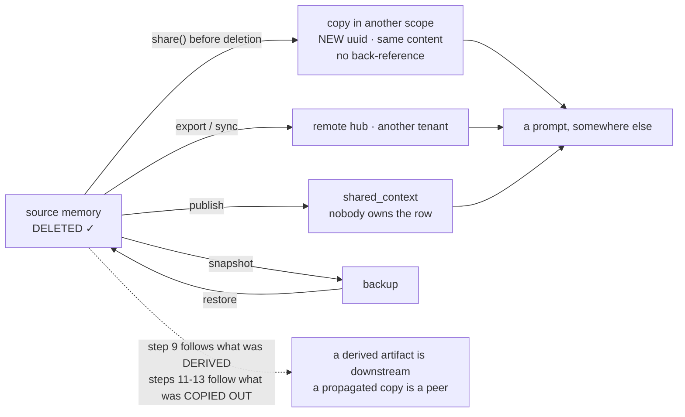
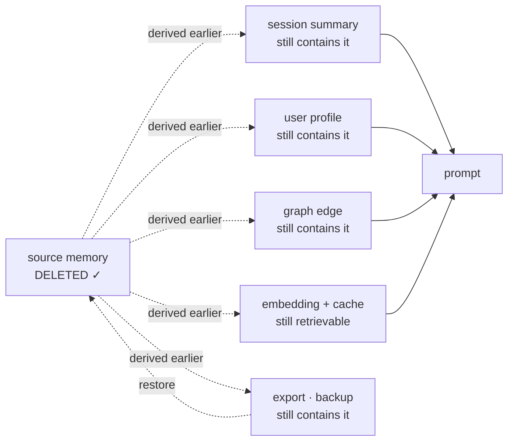

## 1. The Short Version

Six things are worth knowing before reading further.

1. **Almost every memory benchmark asks one question**: after a long
   conversation, can the system answer a question about something said earlier?
   That is recall. Most of what makes memory hard — correction, deletion,
   scope, trust, cost — is not on the scoreboard. The one published proposal
   that scores the rest is [AOEP-v0](#aoep), which replaces the task with a
   contract, checks five named invariants deterministically, and reports a pilot
   in which three storage designs with different retrieval quality score
   *identically* on governance. Its harness is not released. The other exception
   keeps the task and lengthens it instead:
   [MerchantBench](#the-compaction-boundary-measured-in-money-over-a-simulated-year)
   scores 365 simulated days of running a store on final net assets alone, so a
   memory failure is only ever visible as money — and its simulator is released.
2. **A bad score on one benchmark is weak evidence.** These are end-to-end
   pipelines judged by a language model, and the memory layer is one of six
   things that determine the number.
3. **Stress testing is a different activity from benchmarking.** A benchmark
   ranks systems on a task. A stress test finds the input that breaks one. You
   need both, and the second is cheaper.
4. **Cost and latency are barely measured, with one system doing it properly.**
   [Zep](../systems/zep/)'s committed LoCoMo runs report context tokens and
   retrieval latency together — median, p95 and p99, per run and pooled — beside
   accuracy, so the price of each retrieval budget is on the same page as what it
   bought: 347 median context tokens at the smallest setting against 1,997 at the
   largest, for 10.7 points of accuracy. Two other systems record one of the two
   in a harness; none reports bytes on disk per memory. The other exception is a
   *benchmark* rather than a system:
   [ForgetEval](#forgeteval--the-one-benchmark-that-scores-the-control-plane)
   puts both in its abstract — `$0.17` per 385-case run, and 2.3 s per case for
   the LLM mutation hook against 64–191 ms per case for the deterministic
   configurations — which is the shape of reporting this bullet is asking for,
   arriving from the measurement side rather than the implementation side.
5. **The lag between writing a memory and being able to recall it is measured
   nowhere**, even though several systems here deliberately delay extraction by
   minutes or by a batch boundary.
6. **One benchmark scores forgetting, and it stops short of the hard part.**
   [ForgetEval](#forgeteval--the-one-benchmark-that-scores-the-control-plane) scores
   `supersede`, `release` and `purge` across thirteen system configurations and
   is released under MIT. What it does not test is whether a deleted memory stays
   deleted **after the next background pass** — steps 5–8 of the test below.
   Everything named in the rest of this bullet remains uncovered.
   [PersistBench](#persistbench-asks-a-different-question-and-answers-it-well)
   is titled as though it were the exception and is not — it asks whether a
   model *applies* a memory it should not, which is a good question with real
   released artifacts, and involves no deletion at any point. The
   [GoodAI LTM Benchmark](#read-directly-at-a-pinned-commit) comes within one
   assertion — seven of its datasets instruct the agent to forget something and
   none of them checks. One paper —
   [FiFA](#fifa-the-one-proposal-that-scores-deletion-compliance) — proposes a
   metric that counts failing to honour a deletion as a violation, which is the
   right question; it releases no code, its number did not separate one
   retention policy from another, and its abstract contradicts its own results
   table.

Everything below is evidence for those six claims, plus what a better
measurement set would look like — including a [contradiction test](#contradiction-test)
specified in enough detail to run, since supersession is the one part of
correction that existing benchmarks touch at all, and they touch only its
easiest half.

## 2. What Benchmarks Exist

### Found in the repositories reviewed here

These appear as committed harnesses in systems this atlas has read, so their
existence and use are verifiable from code.

| Benchmark | What it tests | Shipped as a harness by |
| --- | --- | --- |
| **LoCoMo** | Question answering over very long multi-session conversations, with single-hop, multi-hop, temporal, open-domain and adversarial question categories | [OpenViking](../systems/openviking/), [Honcho](../systems/honcho/), [Hindsight](../systems/hindsight/), [Basic Memory](../systems/basic-memory/) |
| **LongMemEval** | Long-conversation QA split by ability, including **knowledge updates** and **abstention** | [OpenViking](../systems/openviking/), [Honcho](../systems/honcho/), [Hindsight](../systems/hindsight/), [Swafra](../systems/swafra/), [agentmemory](../systems/agentmemory/), [Daimon](../systems/daimon/), [Engram Alpha](../systems/engram-alpha/) (retrieval half only — see below) |
| **BEAM** | Long-conversation QA at extreme length; Cognee's committed report covers 100K and 10M-token conversations. Its category list includes **`contradiction_resolution`** and **`abstention`** — see the correction below | [Cognee](../systems/cognee/), [Honcho](../systems/honcho/), [ReMe](../systems/reme/) |
| **Oolong** | Long-context *reasoning and aggregation* — counting, classification and distributional questions that require analysing every chunk, not retrieving one. [arXiv:2511.02817](https://arxiv.org/abs/2511.02817) (Bertsch et al., 4 November 2025) reports GPT-5, Claude-Sonnet-4 and Gemini-2.5-Pro all below 50% at 128K on both splits. Not a memory test — it is the case retrieval cannot help, and the boundary below is drawn around it | [Honcho](../systems/honcho/) |
| **τ²-bench (tau2)** | Agentic tool use against a simulated user with policy compliance — a *downstream task*, not a memory test | [OpenViking](../systems/openviking/) |
| **SkillsBench** | Procedural/skill retrieval; a repository-local harness | [OpenViking](../systems/openviking/) |
| **Multi-hop QA** (MuSiQue, 2Wiki, HotpotQA) | Retrieval over a fixed corpus — RAG evaluation, with no writes accumulating over time | [HippoRAG](../systems/hipporag/) |
| **Minecraft tech tree** | Task completion by an agent with a skill library — measures whether procedural memory helps, not whether it is accurate | [Voyager](../systems/voyager/) |
| **Human believability ratings** | Whether simulated agents behave plausibly | [Generative Agents](../systems/generative-agents/) |
| **Repository-local eval harnesses** | Per-project cases with expected and forbidden hits, or replayed retrieval policies | [open-cowork](../systems/open-cowork/), [MetaClaw](../systems/metaclaw/), [MemPalace](../systems/mempalace/), [agentmemory](../systems/agentmemory/), [Waku Agent](../systems/waku-agent/) |

Three entries in that table are doing something the others are not.

**LongMemEval's knowledge-update category** is the closest thing the field has
to a correction benchmark: the conversation contains a fact that is later
superseded, and the system is scored on whether it answers with the new value.
Its abstention items are the closest thing to a test for *not* answering, and
[narrower than the name suggests](#longmemeval-publishes-three-accuracies-and-pins-none-of-the-data).
Both are still question-answering — the system is never asked to prove the old
value is gone, only to prefer the new one at answer time.

**BEAM's `contradiction_resolution` category** goes one step further, and it is
the only public benchmark in this atlas that scores correction at all. The
published numbers are the interesting part: [ReMe](../systems/reme/) commits
per-category BEAM results, and reports **0.100** on its prompted configuration
and 0.384 on its agentic one. So correction is measured, barely, in one place, and
what is measured is done badly.

It still measures only the easy half. `contradiction_resolution` asks the system
to answer with the right value; it never asks whether the rejected one is still
reachable, still in the store, or liable to return. That distinction runs through
the rest of this page.

**One of the vendors whose score sits on this row says the same thing.** Cognee's
own guide to agent memory publishes its BEAM figures — 79% at the 100K setting
against a prior 73.4%, 67% at 10M against 64.1% — and then states that scoring
well on retrieval "doesn't necessarily translate into a reliable production
memory system", recommending application-specific evaluation instead. It is a
concession against interest, in a post that is otherwise an argument for the
product, and it is worth recording because the rest of this page reaches the same
conclusion from the other direction: by reading what the benchmarks score and
finding correction and deletion mostly absent from it.

**open-cowork's harness** is described below and is the most interesting
evaluation shape in the atlas, precisely because it is not a public benchmark.

**Kitaru is the general-purpose version of the machinery these harnesses each
rebuild**, and it is worth naming here because [this page's twenty acceptance
tests ship as specifications with no adapter](../build/#4-verify-by-test-id).
[It records or imports a production run as a session and re-executes the real
code against a change](https://github.com/zenml-io/kitaru), and the detail that
matters for a memory test is that its tool policy is **per tool**: a call can be
answered from the recording, from a static case, or by live `passthrough`. That
is the shape a deletion or contradiction sequence needs — hold the conversation
and every unrelated tool constant from the recording, and let the memory tool run
live against the store under test, so a difference in the result can only have
come from the store. Nobody in this corpus has done that, and this page has not
run it either; what is recorded is that the harness half of the problem has a
general solution and the memory half of it is still an adapter somebody has to
write. Kitaru itself is not agent memory and carries no report — see the
[repositories examined](../compare/#known-limitations) list.

**Waku Agent's "memory arena"** is the repository-local harness worth singling
out, because it does the thing this page keeps asking for. It holds the model and
the probe set constant and varies only which store the facts live in — SQLite,
Supabase, mem0, Zep or LangMem — so a difference in the scoreboard can only have
come from the store. It seeds a *conversation* rather than a pre-extracted fact
list, so each backend's own extraction is exercised, and it scores four outcomes
rather than pass/fail: `PASS`, `MISS`, `STALE` (returns a superseded answer) and
`INVENTED` (answers a probe that should have been refused). The last two are the
correction-and-abstention signals the public benchmarks mostly skip. Its sharpest
idea is a **no-memory control contestant** — "told nothing, then asked
everything" — whose passes expose probes that were scoring the model's training
data rather than the store; running it caught three of seven probes on one track
doing exactly that. The one caveat is that no results are committed: the harness,
a dull example fixture and a methodology doc ship, and the scoreboard is written
to a gitignored directory, so the atlas can verify the *method* but not any
*number*.

### Read directly, at a pinned commit

Five benchmarks were checked out and read rather than described from their
papers, because the literature makes a specific claim about the first of them
that the code does not support, because the third turns out to hold the nearest
thing to a forgetting test anyone has written, because the fourth is titled
as though it were the benchmark this page says does not exist, and because the
fifth is cited throughout this atlas and had never been read at a commit.

| Benchmark | Commit read | What the code does |
| --- | --- | --- |
| **MemoryAgentBench** ([HUST-AI-HYZ/MemoryAgentBench](https://github.com/HUST-AI-HYZ/MemoryAgentBench)) | [`455306dcabc3842526eb83cd4e225e5d486c5c5d`](https://github.com/HUST-AI-HYZ/MemoryAgentBench/commit/455306dcabc3842526eb83cd4e225e5d486c5c5d), 21 May 2026 | Four competencies over incremental multi-turn interaction. The fourth is **not selective forgetting** — see below |
| **MemoryArena** ([ZexueHe/MemoryArena](https://github.com/ZexueHe/MemoryArena)) | [`6cd9de14b71915e39ac742a20dc33785e14b6aab`](https://github.com/ZexueHe/MemoryArena/commit/6cd9de14b71915e39ac742a20dc33785e14b6aab), 31 May 2026 | Memory-agent-environment loop over four task environments; adapters for MIRIX, Mem0, Letta, A-MEM, GraphRAG, MemoRAG and long context. No deletion or correction path anywhere in it |
| **GoodAI LTM Benchmark** ([GoodAI/goodai-ltm-benchmark](https://github.com/GoodAI/goodai-ltm-benchmark)) | [`188e7618413775f1ce783763d5ee0b5ccd4c31c9`](https://github.com/GoodAI/goodai-ltm-benchmark/commit/188e7618413775f1ce783763d5ee0b5ccd4c31c9), 17 Dec 2024 | Twenty datasets including prospective memory and theory of mind, with committed HTML result reports. Seven declare a "forget this" reset message that is sent and never scored |
| **PersistBench** ([ivaxi0s/PersistBench](https://github.com/ivaxi0s/PersistBench)) | [`302ea2ff2cfce97e9458a9897a10b67a2c1d479f`](https://github.com/ivaxi0s/PersistBench/commit/302ea2ff2cfce97e9458a9897a10b67a2c1d479f), 16 Feb 2026 | 500 committed items asking whether a model *applies* a memory it should not. Not a deletion test — see below |
| **LongMemEval** ([xiaowu0162/longmemeval](https://github.com/xiaowu0162/longmemeval)) | [`9e0b455f4ef0e2ab8f2e582289761153549043fc`](https://github.com/xiaowu0162/longmemeval/commit/9e0b455f4ef0e2ab8f2e582289761153549043fc), 11 May 2026 | 500 questions over timestamped chat histories, graded by an LLM judge. Six question types, three different accuracies, and a dataset the repository does not contain — see below |

MemoryArena is the more interesting *design* — it scores whether a later session
can be completed at all given what an earlier one stored, which is closer to
what memory is for than conversational QA is. It is orthogonal to this page's
concern: nothing in it deletes.

**GoodAI LTM Benchmark** ([GoodAI/goodai-ltm-benchmark](https://github.com/GoodAI/goodai-ltm-benchmark),
[`188e7618413775f1ce783763d5ee0b5ccd4c31c9`](https://github.com/GoodAI/goodai-ltm-benchmark/commit/188e7618413775f1ce783763d5ee0b5ccd4c31c9),
17 December 2024) is a third, and it deserves more attention than it gets. Its
twenty datasets are far more varied than the conversational-QA monoculture the
rest of this page describes: `prospective_memory`, `delayed_recall`,
`instruction_recall`, `sally_ann` (theory of mind), `spy_meeting`, `shopping`,
`chapterbreak`, `name_list`, `colours`, `kv`. Results are committed as HTML
comparative and detailed reports, so the numbers have artifacts behind them.

Two entries bear directly on this atlas.

**It tests prospective memory**, which the comparative report calls a category
almost nothing models: `ProspectiveMemoryDataset` gives the agent a quote and
asks it to append that quote to the *n*-th reply, then checks with
`cites_quote`. A deferred instruction, executed at a future turn, machine-checked.

**And it comes within one assertion of testing forgetting.** Seven of the twenty
datasets declare a `reset_message`, and they read exactly like the test this page
has been asking for:

```text
prospective_memory : "Forget my instruction to append a quote to one of your replies."
name_list          : "Forget, or otherwise disregard, all of the names I have given
                      you before this message. You do not currrently know my name."
delayed_recall     : "Forget all of the facts given to you about the fictional world…"
instruction_recall : "Forget all of the instructions for operating the technology…"
restaurant         : "Let's not pretend to be at a restaurant anymore. Please also
                      forget everything about it."
```

`runner/scheduler.py:423` sends them — **after** `example.finished`, after
`result` has been read out of `in_progress_results` and handed to the progress
dialog. The reset is housekeeping, so a standing instruction from one test does
not contaminate the next in a long-running session. **Nothing checks that it took
effect.**

That is the closest any benchmark in this survey comes to measuring forgetting,
and the gap is one assertion in a suite that already knows how to make it: after
sending "forget my instruction to append a quote", run a few more turns and call
the `cites_quote` predicate that the same file already defines. A pass means the
instruction was dropped; a failure means it was not. The harness has the probe,
the oracle and the reset, and never joins them.

MemoryAgentBench is the one worth being precise about. Two surveys describe its
fourth competency as **selective forgetting**, and at least one secondary source
calls it the gold standard for agent-level forgetting evaluation. In the
repository that competency is named `Conflict_Resolution`, and its dataset is
`FactConsolidation`. Reading what it actually asks:

- The context is a flat numbered list of facts — 455 of them in the 6K
  multi-hop split, of which 123 subjects carry a second, contradicting entry at
  a higher index. `0. Thomas Kyd was born in the city of London` is still there
  when `306. Thomas Kyd was born in the city of Leeds` arrives.
- The query prompt in `utils/templates.py` hands the resolution rule to the
  model: *"the newer fact has larger serial number ... solve the conflicts of
  facts in the knowledge pool by finding the newest fact with larger serial
  number."*
- Scoring is `substring_exact_match` against the newer value.

So nothing is deleted, both values remain in the store, the recency rule is
supplied rather than inferred, and the score is answer-time preference. That is
the same shape as LongMemEval's knowledge-update category, at greater length.
The competency is named accurately in the code and inaccurately in the
literature that cites it, and the difference matters exactly here: a reader
looking for a forgetting benchmark will be sent to this one and will not find
one.

#### LongMemEval publishes three accuracies and pins none of the data

LongMemEval is cited more often on this page than any other benchmark, and until
now from its paper. The harness is fifteen Python files, three of which produce
every number anyone quotes. Reading them changes four things a reader would
otherwise assume.

**The five abilities in the paper are six question types in the code, and
abstention is not one of them.** `src/evaluation/evaluate_qa.py` branches on
`single-session-user`, `single-session-assistant`, `single-session-preference`,
`multi-session`, `temporal-reasoning` and `knowledge-update`, and raises
`NotImplementedError` on anything else. Abstention is not a type — it is
`abstention='_abs' in entry['question_id']`, a substring test on the identifier
that swaps in a different judge prompt. An abstention item therefore also
carries one of the six types, and `print_qa_metrics.py` counts it twice: once
inside its type, once in the abstention figure.

**Three different headline numbers come out of one run.** `evaluate_qa.py`
prints a flat micro accuracy over everything it graded. `print_qa_metrics.py`
prints **Task-averaged Accuracy** (the mean of six per-type means), **Overall
Accuracy** (micro), and **Abstention Accuracy** separately. Macro and micro
diverge whenever the per-type counts are uneven. A citation reading "*X*% on
LongMemEval" without saying which of the three is not comparable with another
that does the same, and the published scores collected on this page inherit that
ambiguity from their sources.

**The grade is one model call and one substring test.** The judge is
`gpt-4o-2024-08-06` at `temperature: 0`, `max_tokens: 10`, and the verdict is
`label = 'yes' in eval_response.lower()`. There is no parse-failure path: a
refusal, an empty completion or a truncated reply scores as *wrong* rather than
as unscored, so judge unavailability is indistinguishable from system failure in
the total. `evaluate_qa.py` will run against `gpt-4o-mini` or a locally served
Llama-3.1-70B, but `print_qa_metrics.py` asserts the stored label came from
`gpt-4o-2024-08-06` — the harness permits three judges and the metric printer
accepts one. The prompts are per-category, and one grants an amnesty worth
knowing about: temporal reasoning is instructed to "not penalize off-by-one
errors for the number of days."

**Retrieval is never scored on the abstention items.**
`print_retrieval_metrics.py` filters `'_abs' not in x['question_id']` before it
computes anything. The questions whose correct behaviour is to find nothing are
exactly the ones dropped from the retrieval metrics. The one public benchmark
here with a negative control at answer time has none at retrieval time: a system
can abstain correctly in prose while its retriever returns the same confident
non-evidence on every unanswerable question, and the scoreboard cannot see it.
What is reported is `recall_all@k` — all-or-nothing, 1.0 only when *every* gold
document is inside the top *k* — and `ndcg_any@k`, at session and turn level.
`eval_utils.py` also computes `recall_any` and nothing prints it.

**And the dataset is not in the repository.** Setup `wget`s three JSON files
from Hugging Face into an empty `data/`, and no checksum, version field or
filename guard exists anywhere in the harness. That matters because the data
changed under the name: the September 2025 release "further cleaned up the
history sessions to prevent interference on answer correctness," shipping
`longmemeval_s_cleaned.json` and `longmemeval_m_cleaned.json` with a change log
beside them. Scores from before and after that release are not measurements of
the same benchmark. Nothing in the harness's output records which haystack was
read, so a result file can be complete in every other respect and still not say
— **a LongMemEval number is comparable with another only if both name their data
file, and the harness gives them no field in which to do it.**
[LongMemEval-V2](https://github.com/xiaowu0162/LongMemEval-V2), announced May
2026, is a separate repository and a separate benchmark.

#### The control that proves a metric can still fail

Every negative result on this page rests on a metric that could have come out
the other way, and this atlas has repeatedly caught cases where it could not: a
suite whose assertion passes because the result set was empty, a threshold no
code reads, a gate that scored the wrong artifact. Those are found one at a time,
by reading. [Silica](../systems/silica/) is the one project in the corpus that
turned the class into a harness.

`evals/negative_controls.py` states the problem in its first line — *"A metric
that cannot fail reports PASS regardless of the arm, and the gate reads as a
result"* — and pins every deterministic gate metric against fixtures it must
score exactly, with the rule that **at least two of them must disagree**:
*"a metric stuck at 1.0 and a metric stuck at 0.0 are both dead, and only a pair
of fixtures separates a live metric from either."* `assert_metrics_discriminate`
takes the names the runner is about to compute and refuses any it does not
recognise, so **adding a gate metric without a control fails the run** instead of
passing quietly. It runs before any model work, *"so a dead metric costs zero
tokens."*

Three properties make it worth copying rather than admiring. It **names its own
incidents with shas** — a gate that scored the recomposed floor and not the note
(`a333ce0`), a decompose cap that cut long notes mid-fact and never judged the
tail (`e8ddf63`), a kill gate vacuous because 3-hop reached 98% of the vault, and
the pure form: two metrics matching `\d+` against citation IDs guaranteed to
contain a letter, so both scored 1.0 on every input and *"two rows of its summary
table were decoration."* It **names the hole it cannot close** — a runner that
never mentions its new metric in the call at all, which *"stays on whoever adds
it."* And it **scopes itself out of LLM judges** on the correct ground that
*"a judge cannot be pinned to an expected value,"* whose failure mode is
saturation rather than a dead branch.

The same repository applies the discipline one level down.
`evals/golden/probe_supersede.py` measures resolution inversions over a 796-note
vault — 0 under the shipped `merge_rank` against 43 under the `len(body)` it
replaced — and then reports the margin by which its own gate works:
*"2.09pp against a 2pp tolerance. A partial revert would slip under it. Tighten
the tolerance for this key."* A probe that publishes how nearly it fails to catch
the regression it exists for is doing what this page asks of benchmark authors
and rarely gets.

**The transferable rule is one line**: a gate metric without a fixture pair that
separates it is not a measurement, and the check is cheap enough to run before
the model does.

### The 2026 crop reproduces the monoculture

A search for agent-memory repositories pushed in 2026, sorted by stars, returns
new benchmark harnesses at a steady rate. Three of the most active were checked
against the question this page asks:

| Repository | What it wraps | Forgetting |
| --- | --- | --- |
| [supermemoryai/memorybench](https://github.com/supermemoryai/memorybench) | LoCoMo, LongMemEval, MSC, behind a pluggable provider interface | No occurrence of *forget* anywhere in the repository |
| [zjunlp/MemBase](https://github.com/zjunlp/MemBase) | LoCoMo and LongMemEval, with adapters for Mem0, A-MEM, MemOS | One, incidental |
| [YuanchenBei/Mem-Gallery](https://github.com/YuanchenBei/Mem-Gallery) | A multimodal long-term conversational dataset of its own | Four, none a deletion test |

So the answer to "is anyone building the missing benchmark?" is that the new
harnesses are **better plumbing for the same two datasets**. memorybench and
MemBase both make it easy to run several memory layers over LoCoMo and
LongMemEval and compare them, which is a real contribution to reproducibility and
changes nothing about what is being measured. A system that scores well on all
three of these has demonstrated recall three times.

**MemEvoBench** ([arXiv:2604.15774](https://arxiv.org/abs/2604.15774), submitted 17 April 2026, revised 21 May)
is the crop's one genuine departure and could not be read, because no artifact
was found. It benchmarks *memory misevolution* — behavioural drift from
repeated exposure to misleading information — across "7 domains and 36 risk
types" plus workflow tasks adapted from 20 Agent-SafetyBench environments,
reporting "substantial safety degradation under biased memory updates" and that
static prompt-based defences are insufficient. That is a real gap and a
different one from this page's: contamination going *in* rather than deletion
failing to hold. No repository is linked from the paper and a search returns
none, so on this atlas's terms it is a research direction rather than a
measurement — the same "published numbers without committed artifacts" shape
recorded for FiFA above. [PersistBench](#persistbench-asks-a-different-question-and-answers-it-well)
is the counter-example that shows the artifacts are not hard to ship.

The one idea worth borrowing is MemBase's
`trace_memory_lifecycle_with_membase` example, which instruments construction,
search and evaluation as separate traced phases rather than reporting a single
end-to-end number. That is the shape [section 3](#3-does-a-bad-score-matter)
argues for — attributing a score to a stage instead of to a pipeline — and it is
independent of which dataset is underneath.

### Named benchmarks outside these repositories

The atlas's convention is to separate what was read in code from what is known
otherwise, so these are listed with that caveat: they were **not** verified
against their own repositories in this review, and the descriptions come from
familiarity with the literature rather than inspection.

- **MSC (Multi-Session Chat)** — an early long-term dialogue dataset; largely
  superseded by LoCoMo and LongMemEval for this purpose.
- **Machine-unlearning benchmarks** (TOFU and similar) — these measure whether
  information can be removed from *model weights*. That is a genuinely
  different problem from removing a row from a memory store, and the two are
  often conflated in discussion. **One system here makes them the same problem.**
  [Second Me](../systems/second-me/) fine-tunes a local model on the user's own
  documents, and its document deletion — one of the more complete cascades in this
  atlas, reaching the vector store as well as the rows — does not and cannot touch
  the trained weights. For that system the unlearning literature is the relevant
  literature. The general rule it illustrates: the moment you fine-tune on user
  data, "delete my data" acquires a second half that a database cascade cannot
  reach.
- **Long-context benchmarks** — needle-in-a-haystack, RULER, ∞Bench and
  relatives measure what a model can do with a long prompt. They are not memory
  benchmarks, and the distinction matters for the argument in the next section.
- Several newer conversational-memory benchmarks have appeared that this review
  has not inspected. Treat any list of them, including this one, as incomplete.

The most complete published list is Table 8 of *Memory in the Age of AI Agents*
([arXiv:2512.13564](https://arxiv.org/abs/2512.13564), v2, 13 January 2026) —
**40 benchmarks**, split into 26 designed for memory, lifelong learning or
self-evolving agents and 14 borrowed from adjacent evaluation. It is the right
place to start, and none of it was inspected here. The entries closest to this
page's concerns, by the survey's own one-line descriptions: **HaluMem** (memory
hallucinations), **MemoryAgentBench** and **Evo-Memory** (test-time and
multi-episode learning — MemoryAgentBench is read directly above),
**PersonaMem** and **PrefEval** (dynamic user profiles
and stated preferences), **LifelongAgentBench** and **StreamBench** (continual
and online learning), **MemoryBank** (user memory updating). What that table does
*not* contain is the subject of [section 6](#6-does-anything-benchmark-forgetting).

**One 2026 benchmark builds the grading this page keeps asking for, and it is
not a memory benchmark.** *Long-Horizon-Terminal-Bench: Testing the Limits of
Agents on Long-Horizon Terminal Tasks with Dense Reward-Based Grading*, Li et al.,
[arXiv:2607.08964](https://arxiv.org/abs/2607.08964), v2 13 July 2026, published
as a dataset at
[IntelligenceLab/Long-Horizon-Terminal-Bench](https://huggingface.co/datasets/IntelligenceLab/Long-Horizon-Terminal-Bench)
under Apache-2.0 — 46 tasks across nine categories, one `test` split, each task a
`task.toml`, an `instruction.md` and a Dockerfile, with `agent_timeout_min` and
`expert_time_estimate_min` recorded per task. The verifiers and reference
solutions are deliberately withheld from the card to limit contamination, so the
grading itself cannot be inspected from the dataset; the description below is the
card's and the paper's, not a reading of the grader.

Three properties are worth naming here.

**It grades partial progress.** The abstract's complaint is this page's
complaint: existing terminal benchmarks are *"evaluated only by their final
outcome"*, which *"overlooks intermediate progress and partial solutions,
yielding sparse reward signals and an incomplete picture of agent capability."*
Each task is decomposed into graded subtasks so an agent gets credit for how far
it got. That is the shape a memory benchmark needs and none of the memory
benchmarks have — the difference between "did the agent answer" and "did the
agent still know, at step 180, the thing it was told at step 12".

**The horizon is long enough for memory to matter.** The reported averages are
9.9M tokens, roughly 231 episodes and 85.3 minutes per task. Every conversational
memory benchmark this page discusses ingests a history and then asks questions;
this one runs an agent until it has produced a history, in a stateful container
it can break. Whatever a memory layer does about compaction, reacquisition and
its own staleness, this is the regime where it would show up — and it is the
regime in which the compression result [above](#on-what-compression-costs-which-completion-hides)
was measured, at a fraction of the length.

**The scores leave room to separate systems.** The strongest of fifteen frontier
models reaches 15.2% pass@1 at a 0.95 partial-reward threshold and 10.9% at 1.0,
with means of 4.3% and 1.7%. Set that against
[the benchmark may not be hard enough to separate systems](#the-benchmark-may-not-be-hard-enough-to-separate-systems):
the memory benchmarks in use here saturate at the top, and this one has the
opposite problem, which is the better one to have. A floor that low does mean a
memory layer's contribution would be hard to see against the noise of everything
else the agent gets wrong — the ceiling is not what limits the measurement here,
the number of tasks is.

No system in this atlas runs it, and nothing about it is memory-specific: the
tasks are chess and Sokoban and chip design and climate modelling, and an agent
with no memory layer at all is the default subject. It is listed because the
grading design is the one this page has been asking for, and because it exists
and is downloadable, which the hypothetical benchmark in
[section 6](#6-does-anything-benchmark-forgetting) is not.

### The boundary worth drawing

A long-context benchmark asks: given all of this text in the prompt, can you
answer? A memory benchmark should ask: given that this text is *not* in the
prompt and never will be, can the system decide what to retrieve, keep it
correct as it changes, and drop what it should not keep?

The blurring of that line is the field's central measurement problem, and it
leads directly to the next section.

**Two 2025 research artifacts measure the two halves of that boundary, and
neither is a memory system.** Chroma's *Context Rot* report
([trychroma.com/research/context-rot](https://www.trychroma.com/research/context-rot),
code at [chroma-core/context-rot](https://github.com/chroma-core/context-rot))
runs eighteen models and finds performance "grows increasingly unreliable as
input length grows" even on trivial tasks — and its LongMemEval experiment is
the one that matters here: **every model family scores significantly higher on a
focused ~300-token prompt than on the full ~113K-token conversation.** That is
the empirical case for retrieval stated as a measurement: a memory layer that
delivers the relevant 300 tokens beats handing the model the whole history, so
"decide what to retrieve" is not a convenience but a performance floor. It is
also, pointedly, made by the vendor of a vector database — the argument that
retrieval is necessary, from the company that sells retrieval. The other half is
[Oolong](https://arxiv.org/abs/2511.02817) above: the tasks that need the *whole*
context aggregated, which frontier models fail at 128K, and which no retrieval
policy fixes because there is nothing to narrow to. Between them they bound what
a memory system is for — retrieval answers the recall half and does nothing for
the aggregation half — and both say a larger context window is not the answer to
either.

**This is also where a fabricated baseline in the corpus traces back to.**
[MemCP](../systems/memcp/) ships a `tests/benchmark/test_context_rot.py` that
borrows this exact framing and then hardcodes the numbers the Chroma work
actually measures: `native_value=5.0  # Typical ~5% retention` and
`native_value=2.0  # ~0.05^3 ≈ near zero`, one assumed constant derived from
another, presented in a benchmark report as a head-to-head. The phenomenon is
real and measured; MemCP cites it and asserts a constant for it rather than
running the measurement, which is the difference between the report above and the
one in that repository.

## 3. Does a Bad Score Matter?

Usually less than it appears. Six reasons, in rough order of how often they
apply.

### The number measures a pipeline, not a memory layer

A LoCoMo or LongMemEval score is produced by: an extraction model, a chunking
and storage choice, a retrieval stack, a prompt-assembly step, an answering
model, and an LLM judge. The memory layer is one of six. Two systems with
identical retrieval quality can differ by tens of points because one formats
recalled memory more legibly for the answering model.

This atlas has a concrete instance. [OpenViking](../systems/openviking/) reports
LoCoMo accuracy of 82.08% for a host with its memory layer against 24.20% for
that host's native memory. The harness is committed and genuinely reproducible.
But each comparison runs through a different integration adapter, and that
report's open questions ask the obvious thing: *how much of the delta is the
memory layer, and how much is prompt-shape changes in the adapter?* Nothing in
the published artifacts separates the two.

**One system in this corpus cuts the pipeline in half rather than reporting
through it.** [Engram Alpha](../systems/engram-alpha/) runs LongMemEval-S at
full population with no model anywhere: the haystack is ingested as-is, one
verbatim note per chat turn, and a question counts as answered when a note from
a labelled evidence session lands in the delivered set. No extraction model, no
answering model, no judge — four of the six stages above are removed, and what
is left is the retrieval stack, graded deterministically. The trade is stated on
its own page: these numbers cannot be compared with published LongMemEval scores,
because nothing here measures what a model does with the delivery. Two second-
order costs come with it and are worth naming for anyone copying the design.
Grading at *session* level is generous to dumps — any turn from the right session
counts, so a blind 3,000-token selection that happens to keep one filler line
scores as a hit, which is visible in that run's `curated-file` arm beating the
graph on R@1. And the delivered-token column, which is where the comparison
actually lands, bills one arm for snippets and another for whole turns. The
lesson generalises past this repository: **an offline retrieval grade buys
determinism and full population at the price of the thing the benchmark was
built to measure**, and both halves of that trade have to be published for the
number to mean anything.

### Vendor-run comparisons compare "them" with "them plus us"

The common shape is a memory product measuring a competitor's built-in memory
against the same competitor running the product. The baseline is configured by
the party with an interest in the result, and the judge is a language model.
This atlas flags three separate instances of published gains that could not be
traced to committed raw artifacts, and treats such figures as **claims**, not
measurements. A harness you can run and a result you can reproduce are
different things, and repositories routinely ship the first while the numbers
in the README came from the second.

### The one that published a loss

[Palazzo](../systems/palazzo/) is the counter-example to the section above, and
it is worth naming precisely because it is a counter-example of one.

Its README cites [MemPalace](../systems/mempalace/) as prior art and quotes
MemPalace's claim of 96.6% R@5 on LongMemEval as the bar. It then committed
`inbox/longmemeval-bench-2026-04-27.md`, reporting its own pilot at **R@1 18.0%,
R@5 36.0%, R@30 92.0%** over 50 questions — an order of magnitude off the number
on its own landing page. The note carries a Wilson interval of [23.5%, 50.6%] at
R@5 and says the ±14-point band is *"too coarse for any decision smaller than
'is this an order-of-magnitude gap'"*. It records a stopping rule and the reason
for it: the second arm was halted at 16 questions once the signal was clear,
naming the compute it saved. It rules out its lead hypothesis — that the
embedding model wanted task prefixes — with a control confirming the library was
not applying them silently, so the two arms genuinely differed. It reads the
R@30 figure correctly: *"the bottleneck is ranking discrimination, not
coverage."* And it ends in a decision not to act, because both routes to closing
the gap would either invalidate every stored vector or add the LLM dependency
the project exists to avoid.

Set that against what this page usually finds. The standard artifact is a
harness you could run in principle and a README number you cannot trace. This is
the inverse: a number nobody would publish for marketing, with the uncertainty
attached and the decision it drove written down beside it.

It fails this page's reproducibility test all the same, and the note says so
itself. The harness lived at `/tmp/lme-direct.py` and is not committed — *"the
script is small enough to recreate in 30 minutes if needed"* — and the result
files sit on a machine the note calls ephemeral. The 50 questions are all one
type, because the dataset is ordered by type. So the finding is a self-reported
pilot, not a measurement anyone else can check.

Two things not to carry away from it. MemPalace's 96.6% is **MemPalace's claim
as relayed by palazzo**, unverified here and not measured by this note. And the
36.0% comes from a direct fastembed-plus-numpy harness that bypasses palazzo's
server, so it measures the shared embedding model at session granularity rather
than either product — which is what makes its conclusion interesting, since it
means the gap is not in the embedder.

### The benchmark may not be hard enough to separate systems

If a benchmark's conversations fit inside a modern context window, a system
with no memory design — just a long prompt — can score well, and one with
sophisticated memory can score worse by retrieving selectively. This criticism
has been made of LoCoMo specifically, on the grounds that its conversations are
short enough for long-context baselines to handle directly. BEAM's 10M-token
configuration exists because of this pressure. When a benchmark cannot separate
"good memory" from "big context", a bad score on it says little.

### Judge variance

Almost all of these score with an LLM judge. Judge model, judge prompt, and
answer formatting all move the number, and few published results state a judge
seed or report agreement with human labels. Two runs of the same system on the
same data are not guaranteed to produce the same score.

**One repository in this atlas measures that variance instead of asserting it.**
[Zep](../systems/zep/) commits five LoCoMo experiments of ten runs each — 1,540
questions per run, both answering and grading at `gpt-4o-mini` temperature 0 —
and publishes the per-run spread. The run-to-run standard deviation of accuracy
is 0.33 to 0.47 points. That is small, and it is exactly the number a reader
needs, because the top two configurations in that sweep differ by 0.26 points:
without the repeats the step reads as an improvement, and with them it does not.
A single run of a memory benchmark can support a claim about a five-point gap
and cannot support a claim about a one-point gap, and almost nobody publishes
enough to tell you which kind of gap you are looking at.

**A study published outside this corpus measured the judge swap directly, and
the swap moved a score further than the architectures did.**
[*The Shapes of Agent Memory*](https://www.pinglin.tw/blog/the-shapes-of-agent-memory/)
(Ping Lin, 12 August 2026) ran five retrieval stores through one reader and one
judge, then had a **frontier judge from a different vendor re-score the same
byte-identical published responses** on a frozen hundred-question sample. Every
arm fell: 0.790 → 0.750, 0.750 → 0.680, 0.680 → 0.620, 0.560 → 0.490,
0.610 → 0.540, with per-arm agreement of 0.91 to 0.96 and Cohen's kappa of 0.82
to 0.89. So the judges agree with each other about nine times in ten and still
disagree about the score by up to seven points — more than the gaps between the
stores that tie. Agreement is high and the level is not the same, which is the
distinction a single reported accuracy hides.

The evidence sits in [`a40-labs/memory`](https://github.com/a40-labs/memory) at
[`f53ad5f64f651e22cd45073ee3e32b546b469858`](https://github.com/a40-labs/memory/commit/f53ad5f64f651e22cd45073ee3e32b546b469858), and the shape of
that repository is the part worth copying. It publishes the **per-question rows**
behind every table, with one verification script per benchmark that recomputes
each figure from those rows against a `PUBLISHED` constant and fails on any
mismatch — and `verify_all.py` closes by printing what it *cannot* check:
*"Every check passed: all published numbers THAT HAVE ROWS IN THIS REPO
reproduce from them"*, followed by the three published scores with no rows and
the reason for each ("contexts never persisted at run time; fixed forward";
"different harness, rows unpublished"; "study log only"). A verifier that
enumerates its own blind spots is the artifact this page has been asking for
since it was written, and the README states the motive in the same terms: a
number published without its frame *"cannot be checked, only believed."*

Its opening example is the traceability failure this page documents elsewhere,
worked through in public: one system's LoCoMo result has been published as 84,
as 58.44 after a competitor's CTO filed an issue arguing the adversarial
category sat in the numerator but not the denominator, and as 75.14 after a
re-run with that error fixed — while the competitor's own figure has been cited
at both 67 and 92.5. One benchmark, one system, a 25-point spread, and the
memory architecture never changed.

The same study reports two agentic results that belong beside the ablation
section above. Using ALFWorld (134 unseen games, scored as a per-category macro
success rate) and WebShop (partial-credit score and strict success rate
reported separately), a retrieved experience bank moved a 35B actor from 0.603
to 0.645 on ALFWorld and a frontier actor from 0.959 to 0.973 — *"retrieved
memory paid only where the actor had headroom."* The scripts also record the
bar they are measured against: MemHarness's published 0.852 in-distribution on
ALFWorld and 87.4 on WebShop, against 0.645 and 66.0 measured here. Recording
the published figure you did not reach, in the verification script rather than
in a footnote, is the second thing worth copying.

Zep's harness makes a second move worth copying, described in that report:
it grades **whether the retrieved context contained the answer** as a separate
judgement from whether the answer was right. Accuracy conditioned on a complete
context is flat at 0.92 across a 5.8x swing in retrieved tokens — so in that
sweep every point of end-to-end gain came from retrieval completeness rising,
and none from the reader improving. That decomposition is what turns an
end-to-end score back into evidence about the memory layer, which is the
complaint this whole page is making.

### The model may already know the answer

The trap that invalidates a memory benchmark outright: if a question can be
answered from pre-training, a correct answer proves nothing about the memory
layer. "Who founded the company the user works at" is answerable by the model
alone. The memory system can fail completely and the score stays high.

The usual fix is fictional data, and it is necessary but not sufficient, because
a model can also *guess*. Asked a user's favourite colour with no memory at all,
a model naming blue is right a fair fraction of the time; asked their dog's name,
a model naming Max or Luna is not guessing blindly either. Low-entropy facts
about people are exactly the facts these benchmarks like to test, and they are
the ones a plausibility prior can hit.

Three properties make a probe honest:

- **Fictional**, so pre-training cannot supply it.
- **High-entropy**, so a plausibility prior cannot hit it — a made-up compound
  token beats a common first name.
- **Checked against a no-memory baseline.** Run the same questions with
  retrieval disabled. Whatever the model scores is your floor, and any headline
  number should be reported against it rather than against zero.

That last one costs one extra run and is missing from every published memory
benchmark result this atlas has examined. Without it, a reported 82% could be an
82% model and an inert memory layer, and nothing in the artifact distinguishes
the two.

**A 2026 result measures how much of that trap is real, and makes the no-memory
baseline harder to specify.** *Empty Shelves or Lost Keys? Recall
Is the Bottleneck for Parametric Factuality*, Nitay Calderon and Gal Yona, Google
Research, [published 12 August 2026](https://research.google/blog/empty-shelves-or-lost-keys-recall-is-the-bottleneck-for-parametric-factuality/),
paper at [arXiv:2602.14080](https://arxiv.org/abs/2602.14080), dataset at
[google/WikiProfile](https://huggingface.co/datasets/google/WikiProfile). The
method: 2,150 Wikipedia-derived facts, ten tasks per fact separating whether a
model *encoded* a fact (proposition completion) from whether it can *state* it
(varied phrasings and directions) and whether it can merely *recognise* it
(multiple choice), across 13 models and roughly 4.5 million graded responses.

The headline is that frontier models encode 95–98% of these facts and still fail
to recall 26–34% of them under direct questioning — *"Frontier LLMs encode nearly
all facts, yet struggle to recall many of them"* — with the failure rate falling
to 11–12% when thinking is enabled, and thinking recovering 40–65% of
encoded-but-inaccessible facts against only 5–15% of the non-encoded ones. The
post's own framing is *"the bottleneck is shifting from knowledge acquisition to
knowledge utilization."* None of it was verified here beyond reading the post
and the dataset card.

Two consequences for the section above.

**A no-memory baseline is not one number; it is a number with a decoding
setting attached.** If the same model answers a third of what it knows on a
direct question and most of it after thinking, then "run the same questions with
retrieval disabled" produces a floor that moves by tens of points depending on
how the baseline arm was prompted. A memory layer measured against the
non-thinking floor will look far better than the same layer measured against the
thinking floor, and no published result this page has examined says which it
used.

**The trap runs in both directions.** One is the familiar one above: a real-world
fact answerable from pre-training scores the model, not the memory layer. The
other is its mirror — a model that encoded a fact and failed to recall it makes
an inert memory layer look essential, because the benchmark is scoring a recall
failure that a different prompt would not have produced. High-entropy fictional
facts are the fix for both, which is why that rule is worth more than the
convenience of avoiding pre-training overlap.

The relevance beyond benchmarking is that the same distinction applies to the
memory layer itself. Everything in this atlas that decides *whether to retrieve*
is making a bet about what the model already knows, and this is the first
measurement of how bad that bet is: the material is on the shelf 95–98% of the
time, and a third of the time the model cannot find its own key.

### The baseline is usually too weak

Almost every memory result compares a system against *no memory*, which flatters
every memory system ever built. The comparison that means something is against
the cheapest thing that also persists.

[NOOA Memory](../systems/nooa-memory/) is the instance that runs it against a
stronger agent. Its paper reports ARC-AGI-3 fleet-mean RHAE of 50.2% for the world-model
skill with memory against **38.4% for the identical skill "with markdown files in
place of memory"** — stated as "+11.8 RHAE points over the identical agent with
file-based notes". A third arm, a different skill *with* memory, scores 41.7%,
which separates the contribution of the memory from that of the skill. Appendix D
names the reproduction runs, and the paper marks its per-run correlations as
associations given the sample size and right-censoring.

Design the ablation so a null result is possible. If the baseline cannot in
principle win, the experiment cannot tell you anything.

**[MemoryOps AI](../systems/memoryops-ai/) is the instance that got the null
result and published it as the headline.** `benchmark/COMPARISON.md` scores six
systems on the same deterministic probes: the governed path, an ungoverned
ablation twin of itself, a full-context baseline, a plain vector baseline, a
rolling-summary baseline, and Mem0 at a pinned `mem0ai==2.0.17`. Four of the six
tie at 4/4, and the document states the consequence in bold rather than in a
limitation — the plain vector baseline passes every case, so *"these probes
therefore do not, by themselves, demonstrate a governance advantage"*, and
*"nothing here distinguishes a governed memory layer from an ungoverned one."*
Three design choices are what make that finding load-bearing rather than
embarrassing: the cases were fixed before the external systems were added and not
changed afterwards, the embedder is held constant between the vector baseline and
Mem0 so the comparison is about memory semantics rather than embedding quality,
and the external system's chat model is a stub that raises if invoked, *"which is
what makes '0 provider calls' a checked property rather than an assertion."* A
project that builds the arm that can beat it, and then reports that it did, is
the practice this section is asking for; the result is the evidence that the
practice was real.

#### The stronger version: compare against doing it for no reason

A weak baseline flatters a system that adds something. It says nothing about a
change that *removes* something — a gate, a filter, a decay rule — because
removing rows improves precision on almost any corpus whether or not the rule
picking them is any good. The control that separates those is a **placebo arm**:
drop rows at the same rate, at random, and see whether the real rule beats it.

One system in this atlas ships one. [Daimon](../systems/daimon/)'s
`research/experiments/recall-replay-ab/` replays real historical prompts through
the shipped recall path (arm A) against a pluggable variant (arm B), judges the
disagreements side-blind, and carries a `placebo` builtin that suppresses rows
at random at a per-age-band rate — so a treatment can be matched against its own
drop rate rather than against nothing. The rig verifies itself: `verify.py`
asserts two runs are byte-identical and that the identity variant reproduces arm
A exactly.

It has been used three times to refute the project's own hypotheses, twice in
commit subjects that say `measured and refuted`, and once to remove a shipped
feature. That third file, `research/experiments/gate-491/measurements.json`, is
the artifact this page has been asking for:

- the result is a **loss** — the age gate's open-question exemption graded 10%
  relevant, Wilson 95% CI 3.5–25.6, n=30, inside the 6–10% band the gate already
  blocks;
- the judge was "blind to the hypothesis, to arm structure, and to any prior
  grading";
- the **pre-registered bar was discarded and the reason recorded** — the 40%
  threshold was not derivable from anything measured, and held exempt rows to a
  higher standard than the policy applies to rows it keeps;
- two rejected alternative explanations are kept, each with the verdict that it
  "separates the WRONG way";
- a `not_measured` block names the silence cost the instrument is structurally
  blind to;
- and the count is flagged as "conservative in the direction that weakens the
  finding".

That last line is the habit worth naming. Every publisher discussed on this page
makes choices that shape a number; almost none of them state which way their own
conservatism cuts, in the artifact, before anyone asks.

**The clearest published instance of the placebo arm is not in this corpus at
all, which is itself the point.**
[arXiv:2608.00017](https://arxiv.org/abs/2608.00017) evaluates a rule that
demotes memories it believes are wrong, and answers the objection above head on:
its Table 7 sets budget-matched random pruning beside it on the same bank, at
the rule's exact budget of 123 demotions. Random pruning **harms** the bank
(ΔCorr −0.16) because it hits 13 of the 15 genuinely correct memories, while the
rule demotes the same number with zero collateral and gains +0.59 — so the
result is attributable to *which* rows are demoted, not how many. It reports the
comparison at 25/50/75/100% of the budget so the choice of budget cannot be the
explanation, and it flags its own weakness in the direction that weakens the
finding: with only 15 correct memories in the bank, *"the '0 demoted' figure is a
low-count estimate, and we read it accordingly."* Two further cost-matched
baselines are reported as failures. This is the design this section asks for,
and the caveat that travels with it is the one recorded in the
[comparative report](../compare/#known-limitations):
the repository the paper twice names as holding its code, traces and result
files returns 404, so none of it can be re-run.

### The system may not be optimizing that axis at all

This is the important one. The systems in this atlas with the strongest
**correction** semantics — [Verel](../systems/verel/) with rejected-value
tombstones and explicit trust states, [RainBox](../systems/rainbox/) with
governed atomic correction — have no benchmark numbers at all, and would not
score better on LoCoMo if they did. Nothing in a conversational QA benchmark
rewards refusing to re-assert a value the user rejected. The same holds for
[Redis Agent Memory Server](../systems/redis-agent-memory-server/)'s retention
policy, [Magic Context](../systems/magic-context/)'s re-verification against
source files, and [Memora](../systems/memora/)'s dry-run correction pass.

The field measures recall because recall is measurable. The predictable result
is that recall gets optimized and correction does not.

### And the cases where a bad score does matter

- **The system claims retrieval quality is its point.** Then the benchmark is
  on the axis it chose, and a poor result is real.
- **The benchmark's failure category matches your workload.** A bad
  temporal-reasoning score matters if your users ask "what did I decide last
  month". A bad multi-hop score matters if answers require joining facts from
  different sessions.
- **The score is bad in a way that indicates a bug, not a tradeoff.** Near-zero
  on single-hop extraction means something is broken, not that the system has
  different priorities.
- **A drop against your own previous run.** The most useful benchmark score is
  the one you compare against yourself. Absolute cross-system numbers are
  confounded; a regression in your own harness, same models and same config, is
  a signal you can act on.

Reading a benchmark table well means asking *what would this system have to be
bad at to score badly here*, and checking whether that is a thing you care
about.

## 4. What Stress Testing Is For

Benchmarking and stress testing answer different questions, and conflating them
is why many memory systems have a score and no idea where they break.

> **A benchmark asks: how good is this on the normal case?**
> **A stress test asks: what input makes this fail, and how does it fail?**

A benchmark produces a number for comparison. A stress test produces a *failure
mode* — something you can fix. For memory specifically, stress testing is where
almost all of the value is, for three reasons.

**The failure modes are structural, not statistical.** A memory system does not
degrade smoothly as the store grows; it hits a point where retrieval starts
returning five near-duplicates of the same fact, or where a stale value
outranks its correction. That threshold is a property you can find by pushing,
and it will never show up as a percentage point on a benchmark.

**Memory is an injection channel.** Anything written into memory is later
placed in a prompt, so a poisoned memory is a persistent prompt injection with
a much longer lifetime than a single hostile message. Several systems here take
this seriously in opposite ways: [Verel](../systems/verel/) and
[RainBox](../systems/rainbox/) fence recalled memory as untrusted data at read
time; [Hermes Agent](../systems/hermes-agent/) scans content against threat
patterns at write time because its memory is frozen into the prompt for a whole
session; [Redis Agent Memory Server](../systems/redis-agent-memory-server/)
screens for instructions like "ignore previous instructions" before they are
stored. None of that is exercised by a QA benchmark. It is exercised by
deliberately writing hostile content into memory and seeing what comes out.

**The interesting cases are adversarial by construction.** "Does the right
memory come back" has a large natural test set. "Does the wrong memory stay
out" does not — you have to build it.

### A stress-test checklist for memory

Each of these has produced a real finding in one of the systems reviewed here.

- **Scale**: grow the store by 10× and 100× and re-measure retrieval quality,
  latency, and index size. Look for the point where near-duplicates crowd out
  diversity.
- **Contradiction density**: feed a stream where 20% of facts supersede an
  earlier one. Measure how long a stale value keeps being retrieved after its
  correction lands.
- **Re-ingestion**: delete a memory, then feed the source material again. Almost
  every system in this atlas will recreate it, because supersession without a
  value-level tombstone does not survive re-derivation.
- **Poisoned content**: write memories containing instructions, fake system
  prompts, and encoded payloads. Check what reaches the model and whether it is
  fenced — and then keep measuring after the first turn, for the reason
  [Weighted Memory Tree](#the-poisoning-protocol-that-measures-what-happens-after-the-first-turn)
  gives below.
- **Scope crossing**: write to project A, query from project B. This is a single
  assertion and it catches the most consequential class of leak.
- **Provider failure**: kill the embedding or LLM endpoint mid-write. Does the
  raw evidence survive for retry, or is the observation lost? Does a gate that
  is supposed to skip work fail open or fail silent?
- **Concurrency**: two writers, one correction, interleaved. Non-atomic JSON
  rewrites — which more than one system here uses — lose data under this.
- **The empty and the trivial**: a store with nothing relevant, and a question
  needing no memory. A system that always returns its top-k will return five
  weak matches for "what is 2+2", and that noise costs both tokens and accuracy.

Almost all of these are cheap. None of them requires a labelled dataset.

## 5. What Gets Measured, and What Does Not

The user-facing question — *do these benchmarks measure disk usage, LLM usage,
time to recall?* — has a short answer: barely, occasionally, and no.

| Metric | What it tells you | Measured anywhere in this atlas? |
| --- | --- | --- |
| Answer accuracy (LLM-judged) | Whether the agent got the question right | Yes — the standard metric, in every public harness |
| Recall@k / hit rate | Whether the right memory was returned at all | Rarely; [agentmemory](../systems/agentmemory/)'s figures are retrieval-only, which is honest but partial, and [Muninn](../systems/muninn/) ships the harness that computes hit@k, recall@k and MRR per query and persists every run — see below |
| Negative precision (forbidden hits) | Whether the *wrong* memory stayed out | One hundred and twenty-one of three hundred and fifty-two. [open-cowork](../systems/open-cowork/), [Verel](../systems/verel/), [Project N.E.K.O.](../systems/neko/), [Helm](../systems/helm/) and [Agno](../systems/agno/) assert it about *content*; [MIRIX](../systems/mirix/), [Aukora Kernel](../systems/aukora-kernel/) and [EverOS](../systems/everos/) assert it about a *scope boundary*, which is a different question |
| Prompt-prefix fidelity | Whether the retrieved memory survived truncation into the actual prompt | [open-cowork](../systems/open-cowork/) only |
| Ingest token cost | What it costs to remember | [OpenViking](../systems/openviking/)'s harness records token volume |
| Per-turn context cost | What memory costs on every single turn | Treated as a tunable by [MetaClaw](../systems/metaclaw/); reasoned about explicitly by [GenericAgent](../systems/genericagent/) |
| Retrieval latency | Whether recall is fast enough to be on the critical path | [llm-wiki-memory](../systems/llm-wiki-memory/)'s `PERFORMANCE.md` — latency and scaling, explicitly not relevance |
| Write-to-readable lag | How long after something is said before it can be recalled | **Nowhere** |
| Storage footprint | Bytes per memory; index growth over a year | **Nowhere** |
| Correction precision | How often an automated supersession pass is wrong | **Nowhere** — though [Memora](../systems/memora/)'s dry-run mode makes it directly measurable |
| Deletion durability | Whether a deleted memory stays deleted after the next background pass | **Nowhere.** The closest is [AgentDatabase](../systems/agentdatabase/)'s `forgetting` category, which checks that a retired record is not used at answer time — a different question from whether it survives a compaction |
| Retrieval-gate accuracy | How often a system that decides *not* to retrieve is wrong | **Nowhere** — [Waku](../systems/waku-agent/) gates on every turn and does not measure it |
| Verification precision | Whether a staleness check correctly marks stale | **Nowhere** — it is [Magic Context](../systems/magic-context/)'s central claim |
| Reacquisition cost after compression | How many extra tool calls the agent spends rebuilding state the compressor dropped | **Nowhere in this atlas** — measured externally, and the finding is below |

### On LLM usage

Two costs, and they behave differently.

One system has published the figure that makes this concrete, and it is
unflattering to its own design. NOOA Memory's paper reports that "reflection
records are 22% of rows yet ~1% of both read channels" — a fifth of the store is
consolidated insight that retrieval essentially never surfaces — and that in
internal pilots reflection "hurt pinpoint lookup (abstraction blurs the exact
fact)". Consolidation is not free and is not obviously earning its cost, and that
is the first measurement of it in this atlas.

**Ingest cost** is one-off per unit of material: extraction, embedding,
consolidation, deduplication. It scales with volume written, and can be
amortized or batched — [Redis Agent Memory Server](../systems/redis-agent-memory-server/)
debounces so a burst produces one extraction,
[Waku](../systems/waku-agent/) batches consolidation because a summarizer needs
enough material to be worth invoking.

**Recall cost** is per turn, forever, and is the one that hurts. Injected
memory occupies context on every request for the lifetime of the deployment.
This is why gating matters — and OpenViking's decision to record token volume
alongside accuracy is the right shape: a memory layer that raises accuracy 10
points while tripling per-turn tokens has not obviously won.

The metric worth reporting is **accuracy per thousand tokens of injected
memory**, not accuracy alone. Nobody in this atlas reports it.

**And the token count understates it.** Providers cache prompt prefixes, and the
saving is large — a cached prefix costs a fraction of an uncached one. Injecting
freshly retrieved memory *near the top* of the prompt changes the prefix on every
turn and invalidates that cache, so a memory layer can raise the real per-turn
cost far more than its token count suggests, and add latency to first token while
doing it.

[Hermes Agent](../systems/hermes-agent/) is the system here that treats this as a
first-order constraint. Curated memory is rendered into the system prompt **once,
at session start, as a frozen snapshot**, and mid-session writes deliberately do
not update it, so the provider's prefix cache survives the whole session. That is
an economic decision with an epistemic price — the agent cannot act on something
it learned ten minutes ago until the next session — and it drives a safety
decision too, since a poisoned entry would persist for the entire session, which
is why Hermes scans content at write time rather than fencing it at read time.

The general shape: **stable memory belongs in the cacheable prefix, volatile
memory belongs after it.** A system that injects everything it retrieved at the
top of the prompt has chosen the worst position for cost without choosing it
deliberately. Nothing in this atlas measures the cache-hit rate its injection
strategy produces.

### The one repository that scores its own retrieval

[Muninn](../systems/muninn/) is the exception to the row above, and it is worth
describing in full because the shape is transferable and the caveats are
instructive.

`src/benchmarks/retrieval.ts` computes `hitAtK`, `recallAtK = matched/expected`
and `reciprocalRank = 1/firstRank` per query, aggregates them to hit-rate,
recall@k and MRR, and runs three targets — a knowledge base, the memory store,
and research citations. A migration persists each run with started and finished
timestamps, a status enum, the target filter, the query count, the aggregate
metrics and the **per-query breakdown**, *"so a regression can be traced back to
the individual query that moved."* That last field is the difference between a
benchmark and a dashboard number: an aggregate tells you something changed and
nothing about what.

Three fixture decisions are the part to copy, and each closes a way a golden set
starts lying:

- **Fixed ids.** The save path mints random UUIDs, so the fixtures are inserted
  with hardcoded ones *"so the golden set can name them as `expected_doc_ids`"*.
- **A refusal to seed a live database.** Seeding declines any database whose name
  does not end in `_test` unless an explicit `--allow-live-seed` flag is passed.
- **Skip, do not score zero.** When the fixtures are absent the memory target is
  *skipped* rather than counted as a miss. Without that guard, an unseeded
  database reports a setup failure as a retrieval failure — the benchmark
  measuring its own harness, which is [the error this page documents
  elsewhere](#3-does-a-bad-score-matter) in several forms.

**And the limits, which are as instructive as the design.** The memory target is
three synthetic fixtures and three golden queries. The queries are written so
that every content word stem-matches the fixture text, because the lexical arm
uses `plainto_tsquery` AND-semantics — the fixture module says so directly, that
*"EVERY content word in a query must stem-match the fixture's summary/content/
tags text."* A golden set constructed to be answerable by the retriever it tests
measures that the pipeline is connected, which is a real and useful thing to
measure, and is not what "recall@k" implies. The other two targets point at
documents in the author's own running knowledge base, so they are not
reproducible elsewhere, and no run output is committed for any target.

The generalisable claim: **the scaffolding here is right and the corpus is the
hard part.** Any project in this atlas could add the metric functions and the
persistence in an afternoon. What none of them has is a set of queries written by
someone who was not looking at the retriever.

### On what compression costs, which completion hides

The argument this page makes about task completion — that it measures a
pipeline and separates systems badly — has now been made quantitatively about
context compression, by someone measuring the thing instead of asserting it.

*What Does Context Compression Cost an Agent? Interaction Costs Unrevealed by
Task-Completion Metrics*, Shuyu Liu, [arXiv:2608.16370](https://arxiv.org/abs/2608.16370),
submitted 17 August 2026, cs.AI, opens with the claim in one sentence:
*"Task completion is the standard metric for evaluating context compression, yet
it is incomplete: compression can increase an agent's interaction cost by forcing
it to reacquire dropped state while leaving completion statistically
unchanged."* No repository, dataset or harness URL is named on the abstract
page, so nothing here is a code-grounded claim and the protocol cannot be
inspected at a pin; what follows is the paper's reported result, recorded
because the shape of it matters to this page.

The protocol holds a tool-using agent to a 24-turn horizon and varies
compression. Retrieval calls rose in **all six model-regime comparisons**, five
of them significant. At 5x compression, completion did not move significantly.
The clean case is GPT-5.5: completion went from 80% to 85% at p = 1.0 while
retrieval calls went from 21.0 to 63.9 at p = .002. A tripling of the agent's
own tool traffic, invisible to the metric everyone reports. In ALFWorld the
effect was different, which the paper reads as reacquisition cost being
environment-dependent rather than intrinsic to compression.

Three things follow for anyone building memory here.

**The completion number can improve while the system gets worse.** Eighty to
eighty-five percent is the direction a release note quotes. Twenty-one to
sixty-four retrieval calls is the direction the bill and the latency budget
move. Both are the same experiment. This is the sharpest available version of
[the number measures a pipeline, not a memory layer](#the-number-measures-a-pipeline-not-a-memory-layer),
and it does not depend on judge variance or a weak baseline — the agent's own
call count is a hard integer.

**Compression relocates cost from the prefix to the loop.** The section above
argues that recall cost is per-turn and forever; this is the same argument one
level up. Dropping state from the context does not delete the need for it, it
converts a prompt-token cost into a tool-call cost — serial, latency-bearing,
and paid at whatever the retrieval path charges. A summarizer that halves
context and triples retrieval has not obviously won, by exactly the standard
this page already applies to memory layers.

**The metric is cheap and nobody collects it.** Retrieval calls per completed
task is a counter on the tool loop. Every system in this atlas that compacts,
summarizes or windows its context could report it against an uncompressed
control, in the same harness, on the same tasks — and none does. It belongs
beside accuracy per thousand tokens of injected memory as a number a memory
project should publish about itself.

### On latency, and the lag nobody measures

"Time until memory has been recalled" splits into two very different numbers.

**Retrieval latency** is the obvious one: how long a query takes. It is on the
critical path of every turn — serial, before the first token, and additive with
the cache invalidation above — and it is measured in exactly one repository
here.
Reported as p50 alone it is misleading — a p99 of two seconds on a hybrid
search with a cross-encoder reranker is a user-visible stall.

**Write-to-readable lag** is the one that is never reported and matters more
than it sounds. Many systems here extract asynchronously: debounced, batched
after N conversations, scheduled nightly, or deferred to a background worker.
That means there is a window — seconds, minutes, or a whole day — in which
something the user just said is *not yet recallable*. Every benchmark ingests
the full history first and then asks questions, so this window is invisible to
all of them, while being one of the most noticeable properties in real use:
"I told you that ten minutes ago."

Anyone shipping asynchronous extraction should measure the distribution of that
lag and state it. It is the difference between memory that feels present and
memory that feels forgetful.

### On storage

Nothing in this atlas reports bytes per memory, index size, or growth rate,
which is odd given how predictable the dominant term is: for a system storing
embeddings, the vectors usually outweigh the text several times over. A
1,536-dimension float32 vector is about 6 KB, against a few hundred bytes for
the fact it indexes. Multiply by chunk count, add graph edges, add the
append-only audit log this atlas keeps recommending, and a year of a single
user's memory has a size worth knowing in advance.

The metrics worth reporting are bytes per stored memory, index bytes as a
multiple of source bytes, and growth per active day. All three are trivial to
collect and none of them appears anywhere.

## 6. Does Anything Benchmark Forgetting?

**Nothing independent does.** No public benchmark tests whether a deleted memory
stays deleted: the field's own consolidated list — the 40 benchmarks in Table 8
of [arXiv:2512.13564](https://arxiv.org/abs/2512.13564) — contains nothing that
asks the question, with MemoryBank ("user memory updating") and HaluMem (memory
hallucinations) the nearest entries and neither one of them it. One repository in
this corpus grades a forgetting category, and it wrote the cases it is graded
against. That is the state of the practice, and the rest of this section is
precise about which part of it is a gap in measurement and which part is a gap in
independence.

**The one forgetting category, and what it does not settle.**
[AgentDatabase](../systems/agentdatabase/) commits a 160-case gold set generated
deterministically from a fixed seed — eight categories of twenty, including
`forgetting` and `abstention` — where every case names `expected_ids`,
`forbidden_ids`, `hard_negative_ids`, `should_abstain`, `abstain_conditions` and
`stale_or_retired_trap`, and the `as_of` object carries *both* a validity time
and a record time. A trap fires when a forbidden record is `retired` or its
validity closed before the as-of, which is the deletion-durability question this
section says nobody asks. It also ships hard gates rather than a headline score,
one of which is `critical_stale_use_count == 0` — a release contract on the
failure rather than an average over it.

That is the structure this section has been asking for, and it does not close the
gap, for a reason the repository half states itself. The cases are generated by
the same project that evaluates against them, from a table of twenty topics
where each target and its hard negative differ along scope, validity or status —
precisely the three axes the evaluated algorithm filters on. The committed
reports show **1.0 across all eight categories** for
`deterministic_eligible_scope_alias_ranker.v1`, with `llm_judge: null`, and the
gold provenance block records `human_approval_claimed: false`. A deterministic
filter scoring perfectly against distractors built to differ only on what it
filters has been asked whether it is connected, not whether it is right.

The transferable claim is that **the schema is the contribution and the corpus is
the hard part.** Any project on this page could adopt those case fields in an
afternoon. What no single author can easily produce is a set of cases adversarial
to their own design, which is why a forgetting benchmark worth the name probably
has to be written by someone who did not build the store.

**Three apparent counterexamples were checked. None closes the gap, and the
reasons all differ.**

*MemoryAgentBench* is named by two surveys as testing *selective forgetting* —
the strongest public claim that a forgetting benchmark exists.
[Section 2](#read-directly-at-a-pinned-commit) records what its code does
instead: superseded and current values coexist in the store, the recency rule is
given in the prompt, and the score is answer-time preference. It is a
supersession benchmark under another name, named accurately in its repository
and relabelled on the way into the citation graph.

*FiFA* is the harder case, and it moves this section's claim. It is described
below, because it is the only proposal found across three consolidated lists
that scores deletion compliance at all.

*The GoodAI LTM Benchmark* is the closest miss, and the most frustrating. Seven
of its twenty datasets end by sending the agent a message like *"Forget my
instruction to append a quote to one of your replies"* or *"Forget, or otherwise
disregard, all of the names I have given you before this message."*
[Section 2](#read-directly-at-a-pinned-commit) records what happens next:
`runner/scheduler.py` sends the reset **after** the result has been computed, as
hygiene between tests in a long-running session, and nothing checks compliance.
The suite already owns the probe (`cites_quote`), the oracle, and the reset
instruction. Joining them is one assertion.

### What exists

- **LongMemEval's knowledge-update category** scores whether a system answers
  with an updated fact rather than a superseded one. That measures preference
  at answer time. It does not ask whether the old value is still retrievable,
  still in the store, or liable to come back.
- **LoCoMo's adversarial category** includes questions whose answers are not in
  the conversation, testing whether a system declines rather than confabulates.
  Adjacent to forgetting; not the same thing.
- **[open-cowork](../systems/open-cowork/)'s `forbiddenHits`** is the closest
  mechanism in this atlas to a negative retrieval assertion — an eval case
  declares material that a query must *not* surface, scored against the
  assembled prompt prefix rather than the retriever's raw output. That is
  exactly the shape a forgetting test needs. It is used for relevance, not for
  deletion, and no scored results were found committed.
- **[Redis Agent Memory Server](../systems/redis-agent-memory-server/)'s
  `test_forgetting.py`** exercises the most developed retention policy in the
  atlas — TTL, inactivity, pinning, type allowlists, budget pruning. These are
  unit tests of policy logic. They confirm the code does what it says; they do
  not measure whether forgetting *works* in the sense a user means.

- **[PersistBench](https://github.com/ivaxi0s/PersistBench)** is the newest and,
  by title, the most promising: *"When Should Long-Term Memories Be Forgotten by
  LLMs?"* (ICML'26, [arXiv:2602.01146](https://arxiv.org/abs/2602.01146)). It is not a deletion test, and the gap
  between its title and its task is worth being precise about — see below.

That is the entire state of the art in code, and none of it tests the failure
this atlas keeps finding.

#### PersistBench asks a different question, and answers it well

Read at [`302ea2ff2cfce97e9458a9897a10b67a2c1d479f`](https://github.com/ivaxi0s/PersistBench/commit/302ea2ff2cfce97e9458a9897a10b67a2c1d479f)
(16 February 2026). The title reads like the benchmark this page says nobody has
built. The task is something else: **it evaluates a model, not a memory system.**

Each item is a query, a pool of injected memories, and a labelled failure type.
A `cross_domain` case pairs a health question with a memory pool about
someone's weekends and romantic life, and the model fails by dragging the
irrelevant material into its answer. A `sycophancy` case tests whether an
injected memory bends the model's judgement. And `beneficial_samples` is the
control — memories that the model *should* use, so a model that ignores
everything cannot score well by refusing.

| Split | Committed items |
| --- | --- |
| `cross_domain.jsonl` | 200 |
| `sycophancy.jsonl` | 200 |
| `beneficial_samples.jsonl` | 100 |

**The artifacts are real**, which distinguishes it from most of what this page
has had to assess from abstracts: 500 committed items, a runner with
OpenAI/Anthropic/Gemini/Vertex/OpenRouter adapters, judge prompts per split, and
four defensive system prompts — permissive, restrictive, rubric-informed, and a
GEPA-optimised variant — so "do defences help" is a runnable question rather
than a claim. There is also an Inspect-native implementation in
[UKGovernmentBEIS/inspect_evals](https://github.com/UKGovernmentBEIS/inspect_evals/tree/main/src/inspect_evals/persistbench),
which the paper's own repository recommends **over itself** — an unusually
honest pointer, and a checkable sign the benchmark has been adopted rather than
merely published.

What it does not do is any of steps 3 through 8 of the
[test below](#what-a-forgetting-benchmark-would-have-to-do). Nothing is
deleted. No source material is re-fed. No background pass runs. The memory pool
is handed to the model in the prompt, so there is no retrieval layer to fail and
no store to resurrect anything from. A system could pass PersistBench perfectly
and still restore every deleted memory on its next nightly distillation.

**ForgetEval** below scores deletion; against PersistBench specifically the narrowing holds: **PersistBench does
not measure whether a deleted memory stays deleted.** But the adjacent claim — that negative
retrieval assertions barely exist — now needs qualifying. PersistBench is a
negative-*use* benchmark with a positive control, released, and running inside a
standard harness. It is the shape [open-cowork](../systems/open-cowork/)'s
`forbiddenHits` has at repository scale, executed one layer up and published.
A forgetting benchmark could borrow its structure wholesale and change only what
sits between the memory and the model.

#### A harness paper publishes the harness and not the measurement

*Prime Agent: A Self-Improving RLM Harness*
([arXiv:2608.23552](https://arxiv.org/abs/2608.23552), 24 August 2026) reports
raising *"ARC-AGI-3 RHAE Best@1 from 30% to 95.5%"* and matching or exceeding
other harnesses across long-context coding, GPU-kernel generation, emulator
construction and autonomous nanoGPT speedruns. The memory design it wraps comes
from *Continual Harness*
([arXiv:2605.09998](https://arxiv.org/abs/2605.09998), 11 May 2026), which
reports that automated refinement *"substantially reduces button-press cost
relative to the minimalist baseline and recovers a majority of the gap to a
hand-engineered expert harness"* on Pokémon Red and Emerald.

The code is genuinely published, MIT, and read here as
[Prime Agent](../systems/prime-agent/) — 184,000 lines with 1,519 lines of tests
over the refinement mechanism alone. What is absent is the measurement: at
[`9bc00557489020e4dc981bef3111cb651c5955e7`](https://github.com/PrimeIntellect-ai/prime-agent/commit/9bc00557489020e4dc981bef3111cb651c5955e7)
there is no evaluation directory, no task definitions, no result files and no run
traces, and a search for any path containing *eval* returns nothing outside
`node_modules`.

Set that beside `vista-research.github.io`, recorded in the
[comparative report](../compare/): a harness with **no source at any commit** whose 320 MB
of published per-run traces let its headline claim be recomputed by a reader who
never sees the code. The two publish opposite halves of the same evidence, and
the pairing is the useful part. **A reader can check an implementation or a
result, and neither project lets them check both.** The version that does both
— source at a pinned commit beside the numbers the claims were computed from —
is [Knowledge Triage](#the-compaction-cliff-and-the-first-claim-on-this-page-that-recomputes),
below.

Two qualifications, because the distinction here is about verifiability rather
than conduct. Only the abstracts were read for both papers, so a fuller artifact
may be described inside either. And a paper's artifacts are under no obligation
to live in the product repository — this is recorded as what a reader of the
published code can verify, which is the question this page exists to ask.

### The Compaction Cliff, and the first claim on this page that recomputes

*The Compaction Cliff in Long-Running AI Agent Memory*
([arXiv:2608.22752](https://arxiv.org/abs/2608.22752),
[10.1145/3799682.3840567](https://doi.org/10.1145/3799682.3840567), CIKM '26),
Zerhoudi, Mitrović and Granitzer of the University of Passau, submitted 24
August 2026. Read at
[`a6ceb01a3368cee25ef7ebcf05ebdab8c9be24a4`](https://github.com/searchsim-org/knowledge-triage/commit/a6ceb01a3368cee25ef7ebcf05ebdab8c9be24a4),
Apache-2.0, 7,229 lines of Python.

**The finding is one sentence and it is about a mechanism most systems on this
site use.** *"A safety rule and an episodic log compete for the same tokens in
an AI agent's context. When the budget overflows, both are summarized at the
same rate; only the rule needs exact wording to remain enforceable."* Measured:
Claude Code's `/compact` on Sonnet 4.6 retains **53% of safety rules after one
compaction round and 10% after five**, over 20 production agent configurations.

**Every headline number checked here recomputes from a committed file**, which
is what earns this its place. `results/multiturn_stability.json` carries
`n_configs: 20`, `n_rounds: 5`, `ratio: 0.5`, and under
`vanilla__claude_code:claude-sonnet-4-6` the series `round_1_c_recall: 0.5283`
falling to `round_5_c_recall: 0.1011` — the 53% and the 10%, at the stated *n*.
The framework's own arm is in the same file at `0.9579` by round five, which is
the abstract's *"96% recall over five rounds."*
`results/typeretrieve_vs_vanilla.json` gives `recall@50` of `1.0` against
`0.7255` for Sonnet, the best of three baselines — the *"100% recall@50 against
73%."* Three claims, three files, three matches. Twenty `results/*.json` files
sit beside twenty-two experiment scripts.

**The artifact this page most wants to see is the one about their own
instrument.** `results/human_verification.json` reports two annotators, Cohen's
κ of 0.769 on the four-class label and 0.924 binary, agreement between the human
consensus and the automated metric of **79.2%** — and then the number nobody has
to publish:
`auto_preserved_cases_with_human_weakened_or_lost_pct: 27.6`. Of the cases the
automated preservation metric scored as *preserved*, humans judged **more than a
quarter** weakened or lost. That is the authors measuring the failure rate of
their own measuring instrument and shipping the result next to the wins. Set it
against the [metric that cannot fail](#the-control-that-proves-a-metric-can-still-fail):
this is the same discipline, applied by the people with the most to lose from
the answer.

Two limits belong with it. `AgentArtifactCorpus` — the 396,934 agent
configurations drawn from 54,628 public GitHub projects — is **gated behind a one-page Data Use
Agreement**, so the corpus underneath the classifier experiments is a pointer
rather than something a reader of this page can check; the operator results
above do not depend on it. And only the abstract and the released artifacts were
read here, not the full paper, so the method behind each number is taken as
stated.

**The practical reading for anyone building on this site's systems.** The atlas
has repeatedly recorded compaction as a place where memory quietly degrades —
[Hermes Agent](../systems/hermes-agent/)'s in-turn consolidation under a hard
character cap, [OpenExecutive](../systems/openexecutive/)'s injection block that
drops oldest advice first, [Fireweed MCP](../systems/fireweed-mcp/)'s read gate.
None of them distinguishes a constraint from an episode when the budget
overflows. This paper is the measurement of what that costs, and the operators
are a typed answer: classify each line, then let type decide fidelity.

### The compaction boundary, measured in money over a simulated year

*MerchantBench: Benchmarking LLM Agents for Long-Term Coherence in E-Commerce
Operations* ([arXiv:2607.28956](https://arxiv.org/abs/2607.28956), submitted 31
July 2026, revised 4 August 2026), Alibaba Group's 1688 with Zhejiang University.
Read at
[`f44ce969aeccfd65d1eef6afe50f69868e510946`](https://github.com/KhanCold/merchantbench/commit/f44ce969aeccfd65d1eef6afe50f69868e510946),
Apache-2.0 — see [MerchantBench](../systems/merchantbench/).

**It is the counterexample to this page's opening complaint.** No question is
asked about something said earlier. The agent runs a store for 365 simulated
days, is activated every twelve simulated hours, and is scored on one number:
final net assets, taken by `eval/scoring.py` as the last point of the
`net_assets` series. There is no recall term, no retention term, no memory
metric of any kind. A memory failure is only ever visible as money that did not
arrive.

That makes the two failures the paper reports the most concrete versions of the
compaction cost the section above measures in F1. One Claude Opus 4.8 run
concluded that removing weak listings would concentrate traffic, and its shelf
went from 47 active listings on Day 54 to three by Day 322 — the wrong belief,
having been written down, was re-presented at full weight for 268 days. One
Qwen3.7-Max run misremembered Day 285 as the endpoint on Day 282 and stopped
filling vacant slots with 83 days left, correcting only when simulated time
passed the imagined deadline.

**Where the design leaves the question open.** The reference baseline compacts at
160,000 estimated tokens to 30,000, and appends one advisory user message first —
*"Call write_memory_doc now if important details should be kept"* — then truncates
whether or not the model complied, records nothing about compliance, and never
re-injects the document afterwards. The browser client the human participants used
does the opposite: `read_memory_doc` sits in its `AUTO_TOOLS` bootstrap, so their
memory was on screen at every activation. The humans finished at 217.61 thousand
RMB against 59.46 for the best LLM configuration — the abstract's 27.3%,
recomputing exactly from the paper's own Table 1 — and nothing isolates how much
of that gap is the read path rather than the reasoning.

**And the ablation is two commented lines away.**
`env/scenarios/default.yaml` carries `# - read_memory_doc` and
`# - write_memory_doc` inside the scenario denylist. The simulator is seeded
(`master_seed: 42`, with the file stating that the same seed and scenario give an
identical trajectory), the score is one number, and the baseline already handles
the tools being absent by skipping the reminder and truncating immediately. Three
runs would price the memory mechanism this benchmark ships, and none is
committed. What is published instead is a confound: the Hermes arm, which
[denies both memory tools](https://github.com/KhanCold/merchantbench/blob/f44ce969aeccfd65d1eef6afe50f69868e510946/env/scenarios/agents/hermes.yaml)
because it brings its own, beat the ReAct arm for seven of the eight models while
also adding code execution, planning and skills. Meanwhile the deterministic
rule-based baseline — no model, no memory — finishes at 24.48 and beats six of the
sixteen LLM configurations, which bounds how much of the spread any memory
mechanism could be explaining.

**What cannot be reproduced.** No run output of any kind is committed. The 98,843
real product records become a deterministic synthetic catalog of 1,000 products
and 200 suppliers, and the 365 daily market reports are excluded as
non-redistributable — which the test suite says out loud rather than hiding, with
`pytest.skip("non-redistributable bundled daily reports are not in the artifact")`.
That absence also takes the rule-based baseline with it: it selects replacements
"using keywords from the daily market report".

### The tenure crossover: which memory wins depends on how long you measure

*Ground Truth First: A Longitudinal Evaluation Instrument for Agent Memory, and
the Tenure Crossover in Memory-Architecture Rankings*
([arXiv:2607.21962](https://arxiv.org/abs/2607.21962), Quentin Spencer, 24 July
2026), released with [Veracium](../systems/veracium/) and its corpus generator
and harness. It is the most consequential benchmark result this page carries for
everyone *else's* benchmark design.

**The ground truth is generated before the text.** The paper's complaint about
the field is that benchmarks *"generate conversations first and extract answer
keys afterwards — with documented label-error and contamination problems."* This
one inverts it: a seeded life-script sampler emits facts with validity intervals,
volatility classes and source channels; an LLM renders chat and email from
per-event fact manifests; a fidelity verifier confirms every planted fact; and
questions are instantiated mechanically from the script, so gold answers are
*"script-valid by construction"* and separately validated for answerability.
About 380 questions, 15 types, fictionalised.

**And then the rankings invert with history length.** Five memory architectures
against a no-memory control, fixed answerer, versioned judge, three replicates,
two horizons. At three weeks a budgeted curated-map memory leads at 96%; by nine
weeks it has fallen to **72%** as evicted content is lost, while a
provenance-typed graph rises to **90%**. The inversion is positive for all six
users under complete cross-family re-judging, exact p=0.031.

That is a finding about method, not about products. **Almost every evaluation on
this page is short-horizon**, and a short horizon systematically flatters designs
that evict — because nothing has yet been asked that the eviction destroyed. A
leaderboard measured at three weeks would have ranked these two architectures the
wrong way round for anyone deploying past two months.

Three more parts of the setup are worth copying.

**A full-history baseline that beats the memory systems, published.** The
full-rendered-history arm *"ties or exceeds the best memory system at the short
horizon but shows no judge-independent advantage at nine weeks, at about twice
the read cost."* An author reporting that pasting the transcript matches their
own memory system — at the horizon most benchmarks use — is the
[route-around test](#a-memory-the-system-can-route-around-is-one-nobody-ever-exercises)
run against themselves, and it is why the ranking is readable despite the system
and the instrument sharing an author.

**Write quality is measured, not assumed.** *"Weakly-written facts fail 24% vs
2%."* This page has repeatedly recorded capture treated as the cheap half of a
memory system while retrieval gets the attention; that is the number.

**Injection is tested as a structural property.** Resistance *"tracked whether
provenance boundaries survive representation"* — the same claim Veracium's
quarantine design makes, evaluated rather than asserted, with probes embedded in
a benign harness rather than as a separate adversarial suite.

What no artifact here recomputes is the published means: the generator and
harness ship, the run records do not.

### A memory the system can route around is one nobody ever exercises

*Short window attention enables long-term memorization*
([arXiv:2509.24552](https://arxiv.org/abs/2509.24552), Cabannes, Beck, Szilvasy,
Douze, Lomeli, Copet, Mazaré, Synnaeve and Jégou; Meta FAIR with ENS Paris
Saclay, Paris Cité and JKU Linz) is a pretraining paper about hybrid
architectures, not an agent memory system, and it is on this page for one
finding that generalises past its subject.

SWAX alternates sliding-window attention layers with xLSTM recurrent layers. The
counterintuitive result is that **widening the attention window makes long-context
recall worse**: on RULER needle-in-a-haystack at 131k tokens, a 128-token window
recalls around 30% and a 2048-token window recalls approximately nothing. The
authors' explanation is the part to keep:

> The most likely cause for this phenomenon is that during training, most of the
> dependencies to model fall inside the 2048 tokens window. Therefore, during
> pretraining, it was advantageous for the model with a window of 2048 to use the
> more precise softmax attention from the sliding window rather than having to
> rely on the less precise Linear Attention layers to model most dependencies.

and the consequence:

> once tested on longer sequence length where the dependencies are outside of the
> window length, the model does not extrapolate since it never learned to rely on
> the Linear Attention layers to do long-context modeling. […] This highlights the
> impact that the window size can have on how much supervision the linear
> attention layers receive.

**The memory pathway atrophied because a cheaper path was available whenever it
was being trained.** The recurrent layers were present the whole time, had
capacity the whole time, and were never obliged to carry anything, so they never
learned to. The fix the paper lands on is to remove the shortcut part of the
time — sampling the window between 128 and 2048 during training — which recovers
the long-context behaviour without giving up short-context quality.

The mechanism is a training-time claim about model internals and does not
transfer to an agent memory system directly. **The evaluation lesson does.** If
the answer is usually also in the recent turns, or in the system prompt, or in
whatever the retriever would have surfaced anyway, then the memory path is not
being exercised by your evaluation either — and its failures stay invisible until
the case where nothing else can answer. Three items already on this page are the
same observation from other directions: FP-AMB's TF-IDF baseline beating every
real memory architecture on its own corpus, which is what a bypassable memory
looks like from the scoreboard; Self-GC's no-impact rate, which is built to ask
whether a *future* dependency survived rather than whether the present answer
did; and [Tycho](../systems/tycho/)'s ablation, which prices its world model at
9.42 RHAE by running the arm without one.

A fourth arrives from a paper with no code. *WikiSkill*
([arXiv:2608.27454](https://arxiv.org/abs/2608.27454), 27 August 2026) co-evolves
agent skills with a persistent wiki, and reports that its ablations *"confirm
that persistent knowledge accumulation in the wiki is critical for effective
skill evolution."* The claim is only available because the arm without the wiki
was run.

The practical form is the same in all five: **measure the memory by removing it,
on the cases where nothing else can answer.** An evaluation whose questions the
recent context can satisfy is measuring the context.

One qualification the paper states itself: the effect is clearest on RULER, and
*"results on LongBench/Babilong show mixed outcomes where fixed long windows
sometimes outperform stochastic training."* No code repository is linked.

### The metric that asks whether the pruning broke anything later

*Self-GC: Self-Governing Context for Long-Horizon LLM Agents*
([arXiv:2607.00692](https://arxiv.org/abs/2607.00692), 1 July 2026), Hao, Meng,
Yin, Zhu and Cao of Xiaohongshu. No code is released, and the system itself is
context management rather than memory — the authors place it beside memory
stores rather than among them. **Its evaluation belongs on this page anyway**,
because it measures the thing the Compaction Cliff above says goes unmeasured,
and it does so against real future turns.

**No-impact rate is a counterfactual, not a proxy.** The definition:

> **No-impact Rate** measures whether the retained context still supports the
> real future continuation. Given the retained prefix, candidate plan, compact
> before/after patches, and ground-truth future turns, a GPT-5.5 judge checks
> whether exact URLs, paths, row values, task identifiers, editable bodies, and
> source-backed evidence remain available.

So the question is not *does the summary read well* but *did the removal destroy
something a later turn actually needed* — asked per session against the turns
that really followed. Four properties of the setup are worth copying.

**It is diff-grounded, and the agent view and the judge view differ on purpose.**
*"The tested agent view contains only the retained context; the removed-content
diff is judge-only counterfactual evidence."* The judge sees what was cut; the
system under test does not. That asymmetry is what makes the question answerable
without leaking the answer.

**It reports Wilson 95% confidence intervals on a binary judgment.** On the
33-session Hard Set the intervals are wide enough to overlap — Self-GC 84.85%
[69.08, 93.35] against the best heuristic's 69.70% [52.66, 82.62] — and the paper
prints them rather than the point estimates alone. Almost nothing else on this
page reports an interval at all.

**It calibrates its own judge on the cases where the judge disagrees with
itself.** Single-prompt judgments give 89.76% and 92.47%; an A/B judge over the
20 disagreement cases prefers Self-GC in 11, ties in seven, and prefers the
baseline in two, yielding *"calibrated estimates of 92.77% versus 87.46%."*
Measuring the judge is the step this page's
[judge-variance section](#judge-variance) asks for and rarely sees.

**It measures how often the model breaks the rule the prompt states, and then
stops trusting the prompt.** The planner is told never to compress the latest
visible user turn; the audit found it touching that turn in 25/330 parsed plans for
one backbone, 15/330 for another and 12/328 for a third, and the
conclusion is enforcement rather than better wording: *"The prompt usually
works, but the residual risk justifies mandatory last-turn protection."* That is
the atlas's most repeated finding — a rule stated to a model is not a rule —
arrived at by measurement and closed in the harness.

**And the headline is a trade the authors publish against themselves.** Self-GC
prunes **less** than every baseline it beats: 43.95% against 61.90–69.87% on the
Hard Set, 31.04–33.98% against 40.19–47.76% on the 332-session suite. A
compression paper whose own result is *we compress less* is reporting the axis
that matters instead of the one that flatters.

A neighbouring paper measures the other half of the same question.
*SKILL.state* ([arXiv:2608.26263](https://arxiv.org/abs/2608.26263), 26 August
2026) replaces an append-only history with a mutable execution state, and its
recovery experiment asks how long a wrong value keeps being acted on *after* it
has been corrected: a state that overwrites needs **zero recovery steps**, where
an append-only history leaves the correction sitting after the claim and the
model to reconcile them. Self-GC asks whether a removal broke a future
dependency; this asks how many turns a correction takes to take effect. Both are
counts over the real continuation rather than judgements about a summary, and
neither is a metric this page had before.

The limitations section names what reproduction would require, which is the
list this page would have written: *"reproducibility requires sanitized
fixtures, prompt templates, per-sample judge outputs, and scripts for recomputing
aggregate statistics."* It also refuses to over-read the production result — the
online account-level split is *"operational monitoring evidence rather than a
fully randomized quality experiment,"* the 10–15% daytime input-token reduction
*"does not by itself prove user-quality preservation or net billed-cost
reduction,"* and the side-channel planner's own cost is *"not a substitute for a
matched billed-cost audit."* None of those artifacts is released, so nothing
here recomputes; what transfers is the metric.

### A self-reported leaderboard whose artifacts are checkable anyway

The ARC Prize [community leaderboard](https://arcprize.org/leaderboard/community)
hosts three harnesses this atlas reports on, and the way it hosts them is the
interesting part. Its own note draws the line: results on the ARC-AGI-1 and
ARC-AGI-2 semi-private sets *"are run and verified by ARC Prize"*, and
*"everything else is scored on a public set and self-reported."* ARC-AGI-3 is in
the second category. The foundation adds that it *"won't independently verify
submissions except in extraordinary cases"* and asks readers to validate for
themselves — a publication venue saying plainly that listing is not
verification, which is more than most leaderboards do.

What makes the invitation actionable is that each entry links a scorecard
carrying a per-environment table: score, levels completed, terminal state,
actions and resets for every game. The headline is the unweighted mean of that
column, so it recomputes. Three checked for this page:

| Harness | Published | Recomputed | Environments | Levels | Actions | Cost |
| --- | ---: | ---: | ---: | ---: | ---: | ---: |
| [Tycho](../systems/tycho/) | 100.00 | 100.0000 | 25 / 25 won | 183 / 183 | 6,641 | $2,986 |
| [Retrodict](../systems/retrodict/) | 99.86 | 99.8564 | 25 / 25 won | 183 / 183 | 7,703 | $654 |
| [Polyphony ARC](../systems/polyphony-arc/) | 19.80 | 19.8029 | 2 / 21 won | 59 / 157 | 6,838 | $115 |

Three things that table teaches, none of which the leaderboard ordering shows.

**The metric is not a completion rate.** RHAE is relative human action
efficiency, so the top two entries differ by 0.14 points while solving *exactly
the same 183 levels*; the gap is action count on two games out of twenty-five.
Ranking them as "100.00 beats 99.86" is true and reads as a capability
difference that the scorecards do not support — particularly against a 4.6×
cost difference in the other direction.

**The denominators differ.** Polyphony's run covers 21 environments where the
other two cover 25. A mean over a subset is not comparable to a mean over the
superset unless the entrant is at a ceiling, and nothing in a leaderboard row
says which set an entry ran.

**One entrant shipped the ablation.** Tycho's `artifacts/` commits six scorecard
files, four of them holding the model fixed and varying only the world-model
policy, each recomputing to its published mean — pricing its own mechanism at
9.42 RHAE and publishing the arm where its cleverer variant lost. That is the
standard this page credits [Perseus Vault](../systems/perseus-vault/) for, met
by a benchmark entrant rather than a memory vendor, and it is what separates a
self-reported number a reader can audit from one they can only accept.

#### The same metric, in a venue where the top score is 5.99

The ARC Prize 2026 Kaggle competition scores ARC-AGI-3 on the **same measure**:
*"A score of 100% represents an agent matching human-level performance, meaning
it beat every game while matching the number of actions humans took… The final
score averages individual game scores across levels."* That is the RHAE the
community leaderboard reports. The
[public leaderboard](https://www.kaggle.com/competitions/arc-prize-2026-arc-agi-3/leaderboard)
carries 2,579 teams, and the top of it reads 5.99, 4.99, 4.67, 3.88, 3.37.

One hundred against six, on one metric, is the largest gap this page has had to
explain, and none of it is the metric's fault. Three rules separate the venues.
The Kaggle competition runs as a notebook with **internet access disabled** and
a nine-hour cap, so a harness built on paid frontier-model calls cannot enter —
which is what Tycho and Retrodict are, at $2,986 and $654 of API list price for
a single 25-game run. Its games are **hidden**, where the community entries run
the 25 public ones a developer can iterate a harness, a prompt set and a
world-model template against. And a Kaggle entry gets nine hours for everything.

So the two boards do not rank the same population, and the 100.00 does not sit
above the 5.99 on any axis a reader can use. The honest reading is narrower and
more interesting: **an executable world model plus a frontier API solves the
public 25 outright, and nobody has yet carried a comparable result into a
hidden, offline, nine-hour box.** Whether the memory design or the API is doing
that work is the question, and it is the one Tycho's own ablation answers in
part — at a fixed model, the world model is worth 9.42 RHAE, and swapping the
model is worth the remaining 11.51.

A caveat on the population claim: only the top 49 Kaggle teams were read for
this page, so this does not assert that no community entrant appears further
down — it asserts that the competition's rules exclude the design those entries
use.

### A benchmark whose baseline wins, and the category that cannot fail

`munch2u-a11y/FP-AMB` is a first-person agent-memory benchmark — 60 sessions,
679 turns, ~512,889 tokens, ten categories, a two-method provider interface —
read at
[`c7516f369a0ecee3ca0523fbc368651000ba83f2`](https://github.com/munch2u-a11y/FP-AMB/commit/c7516f369a0ecee3ca0523fbc368651000ba83f2),
MIT. It gets no report because it stores nothing, and it belongs on this page
for two reasons that point in opposite directions.

**The result it ships is the one this page keeps asking someone to check.** Four
scorecards are committed to `results/`, each with a per-question
`*_misses.txt` classifying every failure as a retrieval miss, a generation miss,
a distractor trap or a keyword-format mismatch. They rank like this:

| Provider | Accuracy | Avg retrieval latency |
| --- | ---: | ---: |
| TF-IDF baseline | 69.7% | 3.1 ms |
| real mRAG | 66.6% | 4,534 ms |
| Fractal Memory (the author's own) | 50.2% | 37,930 ms |
| MemPalace | 36.1% | 178 ms |

A lexical baseline that answers in three milliseconds beats every real memory
architecture on the list, including the benchmark author's own, which finishes
third at a twelve-thousandfold latency penalty. This page's [section on weak
baselines](#the-baseline-is-usually-too-weak) argues that a memory system
compared only against no-memory is not being measured; here is the same argument
run to its conclusion by someone with every incentive not to publish it.

**And the category the benchmark advertises as its differentiator cannot fail.**
*Unanswerable & Absent Memory Refusal* scores **35/35 for all four providers** —
identical, perfect, ~13% of a 262-item exam handed to everyone. `fp_amb/evaluator.py`
shows why, and the two evaluation modes fail differently.

In retrieval-only mode the predicate is a flag that starts false and can be set
by exactly three hardcoded string triples — `tokyo`, `electric car`, `dog` —
after which `match = not fetched_distractor`. Of the 35 refusal questions in
`data/fp_amb_cross_session_questions.json`, **8 contain any of those strings**,
so 27 of 35 are `match = not False` for any provider, including one that returns
nothing.

In generation mode — which is what all four committed scorecards used — the
predicate becomes `any(w in target_clean for w in ["unknown", "not mentioned",
"not stated", "no information", "never discussed"])`. That tests the *reader's*
refusal vocabulary, and all four arms are read by the same
`gemini-2.5-flash`, so the score is constant by construction rather than by
coincidence.

Excluding the dead category changes every number and no ordering: TF-IDF 65.0%,
mRAG 61.5%, Fractal 43.1%, MemPalace 26.2%. The inflation is uniform, which is
the mildest version of this bug — and it is still 35 free points on the one
category this atlas most wants measured, since refusal to answer from absent
memory is the behaviour almost nothing tests. Silica's rule applies exactly: *"A
metric that cannot fail reports PASS regardless of the arm, and the gate reads as
a result."*

**One comparability note, in fairness in both directions.** The Fractal run is
scored over 281 questions where the other three are scored over 262, with the
category composition shifted — *Adaptability & Fact Correction Overwrites* is 35
items against 18, *Source Credibility* 3 against 7 — so those four percentages
are not means over one exam. The README's comparison table lists only the three
that share the 262-item exam and says so twice; the run it leaves out is the
author's own. A `real_mem0_provider.py` adapter ships against local Ollama and
Chroma with no scorecard committed beside it.

The lesson to take is not that this benchmark is unusually flawed. It is that a
suite good enough to commit its own losing result, its per-question misses and
its latency profile still shipped a headline category that every arm passes
perfectly — and nothing in the repository would have told the author, because
there is no negative control asserting that some arm must fail some category.

### The reproduction protocol this page has been describing, written by a vendor

`memseekai/membukkit` claims 92.6% on LongMemEval-S, and
`docs/guide/benchmarks.md` is the closest thing in this corpus to the protocol
this page keeps asking for. Four parts of it are worth copying verbatim.

**Every number is a frozen recipe.** A registry entry pins the reader, the
distiller, the judge and the encoder — for the headline number, gpt-5.4 reading
and distilling, gpt-4o judging, `openai:text-embedding-3-large@1536` encoding —
and one command reruns it. The distiller is in the recipe on purpose, because
*"distillation quality materially affects the score."*

**The tolerance band is argued from the noise floor.** A rerun passes within
±0.03, and the document says what the band absorbs — reader nondeterminism,
judge nondeterminism, and drift in a hosted model a recipe pins by name, since
*"the model behind `gpt-4o-mini` keeps moving even though the string does not"* —
then gives the scale: *"the binomial standard error on a 500-question benchmark
is already ~1.8 points."* Almost nothing else on this page states a tolerance at
all, let alone derives one.

**A partial run cannot be graded against a full number.** *"`--check` grades
complete runs only. A `--lite` subset written to the same output directory is
rejected rather than scored against a full-run number."* That is the vacuity
guard for a benchmark harness — the equivalent of the negative control this page
asks of every metric.

**The competitor table separates the score from the judge.** It prints systems
scoring *higher* — OMEGA at 95.4, Mem0 Cloud at 94.4 — and names what
disqualifies the top one from comparison: GPT-4.1 used *"as **both** the
answering and the grading model."* The claim is then scoped to the condition
that makes it checkable rather than stated flat: *"Restricted to systems the
official judge scored, MemBukkit is the highest published result."*

**What it does not do is commit the runs.** The recipes carry an expected score
and an expected *n* of 500 — more than the vendor benchmark below, which
published a mean with no *n* at all — but no per-question output and no scored
artifact is in the tree, so the number recomputes only by paying for a rerun
against a hosted judge. [Perseus Vault](../systems/perseus-vault/) and
[Tycho](../systems/tycho/) commit per-run artifacts whose published means
recompute offline. Between "you can rerun this if you pay" and "here is the
table the mean came from" there is one file, and it is the file that turns a
protocol into evidence.

### A vendor head-to-head that ships the runs undercutting its own headline

`memstate-ai/memstate-mcp` publishes a benchmark against [Mem0](../systems/mem0/)
reporting **69.1 against 15.4** overall and 74.1 against 12.6 on fact recall,
*"tested under identical conditions using the same agent (Claude Sonnet 4.6,
temperature 0), the same scenarios, and the same scoring rubric."* Read at
[`eceac236c7bdca3be8da50c4fa35d3fa0f8b716e`](https://github.com/memstate-ai/memstate-mcp/commit/eceac236c7bdca3be8da50c4fa35d3fa0f8b716e).
The suite and every raw result are committed, which is why any of what follows
can be said at all.

**What holds up.** The judge is blinded — *"given ONLY the question, expected
answer, and actual answer. It does NOT know which memory system produced the
answer"* — which is the control most vendor comparisons skip. Both arms get
their own hand-written agent instructions of comparable quality: the Mem0 file
explains its tools in good faith, tells the agent to search before answering,
and covers the fact-change path. And the published pair is the **matched
timestamp**, both arms run together, rather than a best-of against a
worst-of.

**What the artifacts show that the headline does not.** The results directory
holds four Memstate runs and two Mem0 runs of the same suite:

| Memstate | 56.78 · 69.14 · 86.47 · 84.42 |
| --- | --- |
| **Mem0** | **15.39 · 20.35** |

The published 69.1 is the second-lowest of the four. **The spread across
Memstate's own runs — nearly thirty points — is larger than its entire
published margin over Mem0's better run.** The comparison artifact carries
`timestamp`, `results`, `comparisonTable` and `winner`, and no `n`, no
variance and no dispersion of any kind. A single sample is reported as the
score, from a distribution the same directory shows to be wide.

**And the metric is the vendor's thesis.** Memstate sells versioning and
conflict detection. Four of the five scenarios are `api-versioning-conflicts`,
`auth-system-migration`, `database-schema-evolution` and
`team-decision-reversal` — all about a fact changing. The judge rubric's single
capitalised rule is: *"CRITICAL: If the actual answer reports
OUTDATED/SUPERSEDED information as current, score it LOW (0.0-0.3) even if the
outdated info was once correct."*

That is a defensible position — this page has argued repeatedly that
[correction is the phase that goes unbuilt](../compare/), and grading for it is
closer to right than the recall-only benchmarks above. It is still the case
that the party defining the metric is the party that wins it, and a reader
seeing 4.5× should know the axis was chosen by one of the two systems on it.

**The transferable lesson is about run counts, not about this vendor.** They
committed four runs and published one, which is how anyone can see the
variance; a competitor publishing a single JSON would have been unfalsifiable.
**If your system's run-to-run spread exceeds your margin over the baseline,
the margin is not a result yet.** Report *n*, report the spread, or report a
paired test — the discipline
[Knowledge Triage](#the-compaction-cliff-and-the-first-claim-on-this-page-that-recomputes)
applies with Holm-corrected McNemar and pinned pre-run criteria.

### The poisoning protocol that measures what happens after the first turn

*Weighted Memory Tree: Remembering What Matters for Long-Horizon LLM Agents*
([arXiv:2608.20631](https://arxiv.org/abs/2608.20631), 21 August 2026), Dao,
Kathalkar and Eaton. **No code and no dataset are released**, so everything below
is a protocol to borrow and a set of numbers this page cannot check. It is here
because the protocol is the most developed treatment of memory poisoning the
atlas has found, and because one of its ablation arms answers a question the
proposed test above was too weak to ask.

**Nine metrics, and four of them are about persistence rather than exposure.**
Attack Success Rate and Task Success Rate are the familiar pair. The other four
are the contribution: **Poison Retrieval Rate**, **Infection Persistence**,
**Blast Radius** and **Amplification Factor**, beside a Context Compression
Ratio, prompt-token usage and latency. Poison is injected as misleading
observations written into memory during long-horizon execution, and the question
is not only whether the agent was fooled this turn but whether the bad record
stayed reachable, spread, and grew.

**The ablation is the finding.** One arm reduced immediate exposure and still
recorded *complete infection persistence*, which the paper reads as: *"reducing
immediate exposure alone is insufficient if malicious memories remain available
throughout long-horizon execution."* Another kept the hierarchical structure and
dropped retention scoring, on the observation that *"treating all retained
memories equally allows lower-value or misleading information to continue
affecting reasoning."*

**Why that matters to every system on this site.** A poisoning test that measures
only what entered *this* prompt cannot tell those arms apart from a working one.
It is the same distinction the [rejected-value
tombstone](../patterns/rejected-value-tombstone/) pattern turns on, reached from
the security side instead of the correction side: **suppressing a memory and
removing it look identical for one turn and diverge over a session.** Several
systems in this corpus withhold on the read path and retain the row —
[Fireweed MCP](../systems/fireweed-mcp/)'s read gate, [Hermes
Agent](../systems/hermes-agent/)'s `[BLOCKED:` placeholder, [OpenCode
Memory](../systems/opencode-mem/)'s scope predicate — which is correct for
correction and is exactly the arrangement this protocol would score as
*persistent*. Neither answer is wrong; the point is that only a
multi-turn measurement tells you which one you built.

The full-system figures, recorded as unverifiable: attack success rate 0.419,
poison retrieval rate 0.097, blast radius 0.315, amplification factor 0.965,
with the lowest infection persistence and the highest task success rate of the
arms compared. Against a linear-memory baseline the paper reports accuracy up
9.97 percentage points and prompt tokens down 32.8% on GAIA-Text across
Qwen3-8B, Gemma 4 E4B and Llama-3.1-8B. Its stated limitation is narrow and
honest: evaluation is confined to the GAIA family, whose two sets *"share the
same task construction and answer format."*

The mechanism the protocol was built to test — a four-value lifecycle over
`{ACTIVE, COMPLETED, FOLDED, OBSOLETE}` gating prompt eligibility, and a
retention score revised by execution outcome and by
[selection-based decay](../patterns/decay-and-reinforcement/) — is described in
the [comparative report](../compare/) and on the decay pattern page. It has no
report of its own because there is no repository to pin.

### ForgetEval — the one benchmark that scores the control plane

**Read 2026-07-30 at [`b6053b7bdacc78a91b9ea4bb25f32edad278c495`](https://github.com/deeplethe/lethe/commit/b6053b7bdacc78a91b9ea4bb25f32edad278c495), MIT.**
ForgetEval ships inside [Lethe](../systems/lethe/), as the artifact behind
*Control-Plane Placement Shapes Forgetting*
([arXiv:2606.15903](https://arxiv.org/abs/2606.15903), June 2026). It is the
first released benchmark this page has found that scores the **control plane** —
`supersede`, `release`, `purge` — rather than recall, and its framing is this
page's own argument in the paper's words: recall is *"extensively benchmarked"*
and the operations that mutate memory are *"largely untested"*.

**Shape.** An `Adapter` Protocol of six methods — `reset`, `inscribe`,
`recall_texts`, `supersede(old_query, new_text)`, `release(query)`,
`purge(query)` — with implementations for six systems, five of which this atlas
reviews: Lethe, [Mem0](../systems/mem0/), LangGraph, [Cognee](../systems/cognee/),
[A-MEM](../systems/a-mem/) and [MemPalace](../systems/mempalace/). The
adversarial layer is 385 cases — 132 hand-crafted, 253 LLM-drafted and
oracle-validated — across ten attack categories: substring traps, prefix
collisions, paraphrase supersession, negation, temporal qualifiers, shared
attributes, compound facts, identifier obfuscation, cross-lingual identifiers and
recursive supersession. The cases and their labels are committed; the scored
results are not, living in a README table.

**Three things live only in the paper.** The 385 adversarial cases are the
*second* layer of two — the abstract describes *"a 1000-case templated suite plus
a 385-case adversarial layer"*. Case admission is backed by labelling provenance
no other benchmark on this page reports: *"Admission is corroborated by
10-annotator IAA (Fleiss' kappa = 0.958)"*. And there is *"a 77-case
external-authored subset (four blind contributors) that replicates the
canonicalization asymmetry"* — an independent replication of the headline finding
by people who did not write the benchmark, which is the single strongest
construct-validity move any benchmark in this atlas makes. None of the three has
any representation in the harness: a repository cannot show you its own
inter-annotator agreement.

The comparison unit is thirteen **configurations**, not six systems. Six adapters
times three placement regimes is what the title means by *placement*; the
six-adapter framing above describes the surface rather than the experiment.

**Two things about how it reports.** The three deterministic systems land in a
63–68% band the README reads as *"mutually overlapping Wilson CIs — the bench
reads the trade-off, not a winner"* — and **the author's own system places third
of the three**, at 63.4% against Mem0's 68.3%. A benchmark whose author loses it,
reported with confidence intervals and an explicit refusal to declare a winner,
is the opposite of the vendor-run comparisons this atlas has had to discount.
Its headline finding is about *placement* rather than storage: moving an LLM to
the mutation hook lifts both Lethe and LangGraph by roughly 28 points, so the
gain travels across backends.

**And one row is wrong.** MemPalace scores 0/385, and the adapter's docstring
says *"MemPalace is verbatim-everything: it does NOT support delete, update, or
supersede"*, raising `NotImplementedError` for all three. At MemPalace's own
pinned commit its MCP server exposes `delete_drawer`, `delete_by_source` and
`delete_hallway`. The primitives exist; what does not exist is a
*content-addressed* one, because ForgetEval's contract is `purge(query)` and
MemPalace deletes by drawer id and by source file — so wiring it needs a
search-then-delete bridge. That is a real impedance mismatch and it is a
different claim from the one the docstring makes. Read the 0 as *not wired*,
not as *cannot delete*.

**What it does not cover.** Steps 5–8 of [the test below](#what-a-forgetting-benchmark-would-have-to-do)
— re-feeding the source material and running the background jobs — and steps
11–13, the propagated copies. ForgetEval measures whether a mutation *takes
effect against an adversarial query*, which is the half nobody had measured; it
does not measure whether the next consolidation pass undoes it.

### FiFA, the one proposal that scores deletion compliance

*Forgetful but Faithful: A Cognitive Memory Architecture and Benchmark for
Privacy-Aware Generative Agents*
([arXiv:2512.12856](https://arxiv.org/abs/2512.12856), 14 December 2025, single
author, 45 pages) is the closest thing in the literature to what
[the next subsection](#what-a-forgetting-benchmark-would-have-to-do) asks for,
and it was found in a bibliography rather than in any of the three benchmark
tables that ought to list it.

Its privacy-preservation metric is

```text
PP = 1 − |privacy violations| / |privacy opportunities|
```

where opportunities are turn-level events at which sensitive content is
requested or likely to surface — including **outputs after TTL expiry** — and
violations include disclosing sensitive tokens, **retaining data beyond declared
horizons**, and **failing to honour deletion preferences**.

That third clause is the question this page says nobody asks. Its vocabulary is
unlike the rest of the field's: 211 uses of *privacy*, 68 of *forget*, 61 of
*audit*, 7 each of *erasure* and *right to be forgotten*, against the 107-page
survey's 10, 52, 5, 0 and 0.

**It still does not settle the question, for four reasons, and the last two are
the serious ones.**

1. **The three violation classes share one denominator.** Disclosure,
   over-retention and failed deletion collapse into a single rate, so no
   published number isolates whether a deleted item stayed unreachable.
2. **It compares retention policies, not memory systems.** The subject is six
   eviction policies — FIFO, LRU, Priority Decay, Reflection-Summary,
   Random-Drop, Hybrid — inside one architecture (MaRS), in simulation. Forgetting
   here means capacity eviction, the framing [section 5](#5-what-gets-measured-and-what-does-not)
   describes; deletion compliance rides along as one violation class.
3. **The metric did not discriminate.** PP came out at 0.722–0.780 across all
   five reported policies, `p = 0.485`, η² = 0.047. The paper is candid about
   why: violations are driven by adversarial prompts and TTL expiry, whose
   frequency is held constant, so PP "becomes less sensitive to retention
   strategy alone". A metric that does not separate FIFO from a principled
   hybrid is not yet measuring the design choice.
4. **Nothing was released, and the abstract disagrees with the results table.**
   Forty-five pages discuss version-locked code, archived artifacts, seeds and
   audit trails; no repository is linked, and a public leaderboard with released
   prompts appears in future work. Meanwhile the abstract reports "the Hybrid
   policy delivers the best composite performance (≈0.911)", and Table 2, §6.5.1,
   §7.2 and §7.6 all report Hybrid **last** of the five at 0.589±0.009, with
   Random-Drop leading at 0.635±0.024 — §7.2 states outright that "Hybrid does
   not win the aggregate". The sixth policy's row is marked as pending. Goal
   completion is 0.058–0.078 for every policy, so on the study's own numbers
   nothing completed the task.

The honest summary: **one paper has proposed the right question and has not yet
answered it.** A reader building the deletion test below should start from FiFA's
violation taxonomy rather than from nothing. It does not
change the conclusion, because a metric with no released artifact, no
discriminating power, and an abstract at odds with its own table is a research
direction rather than a measurement.

It is also, for this atlas, a familiar shape. "Published benchmark numbers
without committed artifacts" is a named antipattern here with several instances
among the systems; this is the same antipattern in the evaluation literature,
and it was caught the same way — by reading past the abstract.

### The failure nobody measures

Deletion in these systems is usually a statement about the present that the
next background pass is free to undo. [CowAgent](../systems/cowagent/)
re-distils its memory file nightly from retained daily files.
[Atomic Agent](../systems/atomic-agent/) re-clusters. Magic Context and Redis
Agent Memory Server both extract on a schedule from retained history.
OpenClaw's auto-capture can restore content a user deleted. MIRIX's `auto_dream`
pass loads up to 500 items per memory type with an explicit `start_date=None,
end_date=None` and lets an agent merge and hard-delete them. Only
[Verel](../systems/verel/), [RainBox](../systems/rainbox/) and
[Daimon](../systems/daimon/) carry a value-level tombstone that blocks
re-assertion — and, as noted in the comparative report, neither the standard
reading list nor the field's 107-page survey lists any of the three, the latter
never using the word *tombstone* at all.

So the question "does a deleted memory stay deleted?" has, for most systems
here, the answer "until the next scheduled job", and there is no benchmark that
would reveal it.

**A forensics tool built for a different purpose supplies outside evidence for
the same point.** `perplexityai/numbat` reconstructs agent sessions from on-disk
artifacts without prior instrumentation, so its discovery layer is a survey of
what actually survives on a developer's laptop. Two of its entries land on this
section. It discovers OpenClaw sessions that were reset or deleted, because they
persist as plaintext `*.jsonl.reset.<timestamp>` and `*.jsonl.deleted.<timestamp>`
files beside the live journal — a regular expression in `internal/discover/discover.go`
with a test for each suffix. And its Gemini CLI extractor deliberately ignores
`$rewindTo` records, on the reasoning that *"a rewind changes resume context, not
what already happened"*, so a user-visible undo leaves the earlier actions intact
and readable. Neither claim was checked at the commits this atlas pinned for
those systems, so both belong to numbat's extractors rather than to those
reports. What they establish anyway is the shape of the gap: the question is not
only whether a background pass re-derives a deleted memory, but whether the
deletion ever reached the filesystem at all. A benchmark that asks a system's own
API whether a memory is gone would pass in both of these cases.

### What a forgetting benchmark would have to do

Not a QA benchmark. A state-machine test, run per system:

```text
1. write a distinctive fact
2. assert it is retrievable            → baseline
3. delete it / mark it rejected
4. assert it is not retrievable        → most systems pass here
5. re-feed the original source material
6. assert it is still not retrievable  → most systems fail here
7. run every background job: consolidation, re-extraction,
   nightly distillation, cloud sync
8. assert it is still not retrievable  → almost everything fails here
9. assert it is absent from derived artifacts too — summaries,
   profiles, graph edges, embeddings, caches, exports, backups
10. assert the deletion itself is auditable
11. share / export / sync the memory to a second scope, agent,
    tenant or hub BEFORE deleting it
12. delete the original
13. assert it is not retrievable from the second scope either
```

Steps 7 and 9 are where the interesting failures live. Step 9 in particular:
deleting a source memory that has already been folded into a summary, a user
profile, or a graph edge leaves the value present in derived form, and nearly
every system in this atlas that derives compact representations from raw
evidence has this exposure.

**Nearly**, because one system closes it, and it is worth naming precisely
because it shows how little the fix costs. [RisuAI](../systems/risuai/) stores
on every generated summary the set of chat-message ids it was derived from, and
drops the summary when any one of those messages no longer exists. One `Set`
per summary, checked on every turn. It is not step 9 in full — nothing records
that the deletion happened, and the next context overflow will summarize the
surviving messages again — but the derived-artifact substrate that step 9 exists
to probe is genuinely handled, and it has been since 2024-05-23, in the
generation after a summarizer that kept no link at all between a summary and its
sources.

The conclusion the step was written to support survives intact: nothing
*measures* this. RisuAI has no test asserting the behaviour, so the one system
that passes step 9 would not be able to prove it.

### Steps 11–13: the substrate this page used to miss

The [OWASP security survey](https://arxiv.org/abs/2604.16548)'s Verified
Forgetting enumerates four substrates a deletion has to reach — *"raw logs,
compressed summaries, vector indices, and propagated copies"* — and until now
this test covered three. Step 9 probes what a system **derives** from a memory
inside its own store. Propagation is a different surface: what a system
**copies out** of that store, to another scope, another agent, another tenant or
a remote hub. The two fail differently. A derived artifact is downstream of the
original and can be invalidated by tracking what it came from, the way RisuAI
does. A propagated copy is a *peer* — it has its own identity, its own lifecycle,
and frequently no back-reference at all, so there is nothing for a deletion to
follow.

The atlas has three grounded instances and they cover the range.

**A copy with a new identity and no link home.**
[SimpleMem](../systems/simplemem/)'s EvolveMem has a `share` operation that
reads a memory, mints a fresh `uuid4`, and writes the same content, summary,
entities, topics and embedding into a target scope at
`confidence = max(source.confidence - 0.05, 0.5)`. The copy inherits the
*session* provenance — `source_session_id`, `source_turn_start`,
`source_turn_end` — and **not the id of the memory it was copied from**, so on
inspection it is indistinguishable from a memory independently derived from the
same conversation. The link exists only in the append-only event log, as a
`share` row keyed on the *source's* id carrying `new_id=…` in a detail string.
Deleting or archiving the original touches nothing in the target scope, and the
only way to find the copy is to parse a log entry. Its `import_memories_json`
does the same thing in bulk.

**A shared store nobody owns.** [Cortex](../systems/cortex/)'s `shared_context`
is a namespaced, versioned key/value table written to by any agent. What an agent
puts there is not a copy of its memory so much as a *publication* of it, and
deleting the agent's own episodic or semantic row has no relationship to the
shared row at all.

**A copy that comes back.** [NemoClaw](../systems/nemoclaw/), covered below,
snapshots memory as an ordinary state directory and restores it verbatim — which
makes propagation bidirectional. The deleted value does not merely survive
elsewhere; it returns to the origin.

**One system now runs a protocol of this shape, and built it independently.**
[Daimon](../systems/daimon/) committed
`plugin/tests/test_deletion_durability_protocol.py` on 29 July 2026 — eleven
steps walking a forgotten value through re-feeding the original source
transcript, an index rebuild, a subsequent carry, **a team dual-write**, the
rendered brief string, the SQLite rows, the signed receipt, the audit trail and a
chunk-cache sink over the accumulated state. Every step is paired with a
never-forgotten twin that must stay retrievable, so no negative assertion can
pass vacuously; it runs deterministically on a canned model and a stubbed signer
at zero quota. Its step 6 covers the propagated-copy substrate this page added on
30 July, a day later. Nothing in the repository references this atlas, and the
steps are numbered against Daimon's own issues — so read it as convergent
arrival, not adoption.

Steps 11–13 are cheap to run and, with that one exception, nothing else here
would pass them. No system reviewed carries a deletion that follows a share, and
only one — SimpleMem — even records that a share happened, in a log its own write
path never consults.





[NemoClaw](../systems/nemoclaw/) makes the backup arm of this concrete rather
than hypothetical. It sandboxes Hermes and OpenClaw and declares each agent's
durable state per directory, sanitizing credentials on backup **by field** and
excluding machine-local auth state from snapshots entirely because a restored
copy would be corrupt. Memory gets neither treatment: it is an ordinary state
directory, snapshotted whole and restored whole. At that layer a memory is a
file, so the contract cannot express *do not restore this one* — which means an
ordinary restore silently undoes the most carefully reasoned deletion the layer
above ever made.

The deletion succeeded and the value is still reachable through five other
paths. Worse, the backup path closes the loop: a restore can put the deleted row
back, and nothing marks it as previously deleted. This is why a deletion API is
not a deletion guarantee, and why the assertion in step 9 has to be made against
every derived store by name rather than against the one the API touched.

Two things would make such a benchmark practical to build. It needs no labelled
dataset and no judge model — every assertion is deterministic. And it would be
**scored as a pass/fail matrix rather than a percentage**, because "forgets
correctly 87% of the time" is not a meaningful thing to say about a deletion
request.

The reason to want one is not only correctness. Where a user has a legal right
to erasure, "we deleted the row and a nightly job re-derived it from retained
history" is a compliance failure with a benchmark-shaped hole where the
evidence should be.

### The harness

Small enough to paste into a CI job. The adapter is the only part you write —
six methods, all of which any memory system already has in some form.

```python
import pytest

# Fictional and high-entropy, for the reason in section 3: a probe a model
# could guess proves nothing. This one cannot be reached by a plausibility prior.
CANARY = "the user's dog is named Plumbus Vantablack-7"
TOKEN = "Vantablack-7"          # what to probe derived stores for
SCOPE = "test-user"


class MemoryAdapter:
    """Implement these against the system under test."""

    def write(self, text: str, *, scope: str) -> None: ...

    def settle(self, *, timeout_s: float = 120) -> None:
        """Block until every queued write, extraction and index update has been
        applied. Without this the test measures write-to-readable lag (section 5)
        and calls it a deletion success. If the system cannot expose a quiescence
        signal, that is a finding: record it and poll `prompt_prefix` to a
        timeout instead of sleeping a guessed interval."""

    def prompt_prefix(self, query: str, *, scope: str) -> str:
        """What actually reaches the model — after ranking, budget truncation,
        dedupe and formatting. Not the retriever's return value."""

    def forget(self, text: str, *, scope: str) -> None: ...

    def run_background_jobs(self) -> None:
        """Every one: consolidation, re-extraction, nightly distillation,
        profile rebuild, index compaction, cloud sync. Then settle() again."""

    def leak_probes(self, *, scope: str) -> dict[str, bool]:
        """One probe per derived store, each returning True if the value is
        still reachable there. Text stores can be searched directly; the rest
        cannot, and need a probe of their own:

            summaries / profiles / exports  → substring search
            graph edges                     → query by entity, not by text
            vector index                    → embed the canary, nearest-neighbour
                                              search, check the distance
            caches                          → look up by the key the system uses
            encrypted backups               → restore to a scratch instance and
                                              run this same probe set against it

        A store returning no probe is an untested path, which is a result.
        Refusing to model this as list[str] is the point: a deleted value living
        on as a vector nobody can grep for is the leak most likely to survive."""

    def audit_entries(self, *, scope: str) -> list[dict]:
        """Mutation events as records: {event, memory_id, actor, at}. Not text
        containing the memory — see below."""


def present(memory: MemoryAdapter, query="what is the dog called?") -> bool:
    return TOKEN in memory.prompt_prefix(query, scope=SCOPE)


def test_deletion_holds(memory: MemoryAdapter, source_material: str):
    memory.write(CANARY, scope=SCOPE); memory.settle()                   # 1
    assert present(memory), "setup failed: never retrievable to begin with"  # 2

    memory_id = memory.forget(CANARY, scope=SCOPE); memory.settle()      # 3
    assert not present(memory), "deletion did not take effect"           # 4

    memory.write(source_material, scope=SCOPE); memory.settle()          # 5
    assert not present(memory), "re-ingestion resurrected a deleted value"  # 6

    memory.run_background_jobs()                                         # 7
    assert not present(memory), "a background job re-derived a deleted value"  # 8

    leaks = {store: hit for store, hit                                   # 9
             in memory.leak_probes(scope=SCOPE).items() if hit}
    assert not leaks, f"deleted value still reachable in {sorted(leaks)}"

    events = memory.audit_entries(scope=SCOPE)                           # 10
    assert any(e["event"] in {"forget", "delete", "reject"}
               and e["memory_id"] == memory_id for e in events), "deletion not auditable"
    assert not any(TOKEN in str(e) for e in events), \
        "the audit trail retains the value that was supposed to be deleted"
```

Four notes on running it honestly.

**Step 5 must re-feed the original source**, the document or transcript the fact
was extracted from, not the fact itself. Re-ingesting the raw source is the
realistic path, and the easy version of the test skips it.

**`settle()` is not optional.** A system that extracts asynchronously will pass
step 4 for the wrong reason — the value is not retrievable yet because it was
never indexed, not because deletion worked. Without a quiescence contract the
test conflates write-to-readable lag with deletion success in one direction and
flags a slow system as broken in the other.

**Step 10 asserts the audit does *not* contain the value.** This is the
inversion that matters: an audit row quoting a deleted value has not deleted it,
as the [append-only memory audit](../patterns/append-only-memory-audit/) pattern
says directly. Audit the *event* — type, memory id, actor, timestamp — and if
you need to prove which value was removed, store a salted digest rather than the
plaintext. A deletion log that reproduces the deleted secret is a compliance
problem wearing a compliance mechanism's clothes.

**`run_background_jobs` has to be genuinely exhaustive.** A system whose nightly
distillation is not reachable from the harness has an untested path, which is
worth recording as a result rather than passing over.

The same adapter runs the [contradiction test](#contradiction-test) below —
`prompt_prefix` is the B measurement, `run_background_jobs` is the C
measurement, and only the assertions change.

<a id="aoep"></a>

### AOEP-v0 — the closest thing to the test above, and it has been run

The demand two sections up — a state-machine test rather than a QA benchmark,
with a small adapter and deterministic assertions — is not hypothetical any
more. **Always-On Agents** ([arXiv:2606.30306](https://arxiv.org/abs/2606.30306),
submitted 29 June 2026) proposes the *Always-On Evaluation Protocol* and reports
a pilot run of it over seven systems. It is a 136-page survey and its evaluation
section is the part this page has been asking for, so it is treated here as a
benchmark proposal rather than as a reading list.

The protocol fixes a **data contract instead of a task**. An episode is a stream
of typed events replayed one at a time; at the end the harness poses neutral
probes — naming only target and actor identities, never expected values or
invariant names — and reconstructs a state snapshot from the answers. Each event
carries what a memory row usually omits: an idempotency key, causal links split
into parent, supersedes and conflicts-with, a **permission epoch** on its scope
that increments when authority changes, provenance with an explicit trust tier,
retention and privacy constraints, and exactly one operation from a closed set of
eleven (`read`, `write`, `update`, `delete`, `tombstone`, `share`, `unshare`,
`validate`, `quarantine`, `deny`, `rollback`). The snapshot exposes a deletion
ledger, a rollback ledger, pending conflicts, and the permission epochs in force.

Three design decisions are worth taking whatever you are measuring.

**The harness never trusts a system's self-report.** It recomputes every
invariant itself from the reconstructed snapshot. This page has spent several
sections on vendor-run comparisons and self-assessed scores; a protocol that
structurally cannot accept a system's word for its own behaviour is the answer to
that whole class of problem.

**Every check is deterministic — no LLM judge.** The stated reason is that the
position, verbosity and self-enhancement biases of model judging would be fatal
for a contract whose purpose is detecting *quiet* failures. That is the same
conclusion the [judge variance](#judge-variance) section reaches from the
opposite direction.

**The scorecard is two numbers, not one, and the reason is the sharpest idea in
it.** *Obligation pass* counts positive things a system must actively do —
record a deletion, report the current permission epoch after a revocation, block
a stale-permission or untrusted-instruction task, surface an owner-versus-
collaborator conflict, log a rollback after an external action. *Negative-invariant
pass* counts the no-leakage checks — a deleted value is not visible, an
out-of-scope value does not appear, an untrusted instruction was not promoted.
They are kept apart because their degenerate solutions are opposite: **a system
that stores nothing passes every negative invariant**, since it cannot leak what
it never kept. Pooled into one scalar, amnesia would score respectably. Split,
the no-memory floor is legible as what it is.

The pilot bears that out, and its result table is the most useful thing published
about governance in memory systems to date:

| System | Obligation | Negative-invariant |
| --- | --- | --- |
| Governed reducer (oracle upper bound) | 15/15 | 41/41 |
| No-memory floor | 0/15 | 41/41 |
| Naive append | 7/15 | 40/41 |
| Full context | 7/15 | 40/41 |
| Vector-RAG | 7/15 | 40/41 |
| Mem0-style reimplementation | 4/15 | 38/41 |
| [Mem0](../systems/mem0/), the actual `mem0ai` package | 3/15 | 36/41 |

Nine fault patterns, one frozen local reader, greedy decoding. **The three
raw-storage configurations score identically**, which is the finding: recency,
full context and dense retrieval pass exactly the obligations that reduce to
semantic recall and fail exactly the ones that require maintained governance
state. Retrieval quality is not the variable. And the two extracted-fact
configurations score *lower* than storing everything raw, because in this pilot
the extraction step drops the structured envelope — which is this atlas's
[evidence before belief](../patterns/evidence-before-belief/) argument arriving
as a number.

Read the Mem0 rows with the care the paper asks for. It is a local configuration
against a 7B reader, not a product evaluation, and the paper says so; the
authors included the real package specifically to answer the objection that their
reimplementation created the failure mode.

**What it does not do**, and the gap is the same one this page keeps recording:
no harness, schema or fault-pattern corpus is released with the paper. A protocol
whose entire value is being runnable is described in prose, which puts AOEP-v0 in
the same position as [FiFA](#fifa-the-one-proposal-that-scores-deletion-compliance)
— a good idea whose artifact is missing — with the important difference that its
pilot was actually run and its numbers are reported per check rather than pooled.
The pilot is also seven configurations, five of them built by the authors, so the
table is a demonstration that the protocol discriminates rather than a survey of
deployed systems.

**The failure the split scorecard exists to prevent is already in this corpus.**
[Hillock](../systems/hillock/) publishes a *Gate Accuracy* on its README,
described there as the rate of blocking unanswerable queries and hard negatives,
and in the harness as a *hallucination defense rate*. Its formula is
`(correct_blocks + correct_answers) / len(questions)` over thirty questions of
which twenty are answerable — so it pools a positive obligation with a negative
invariant in exactly the proportion that hides the negative one. A system that
answered everything and blocked nothing would score 66.7% on it; a system that
blocked everything would score 33.3%, which is *higher* than the 30.0% reported.
The two published numbers together recover what the label does not say: with
retrieval accuracy of 30.0% over twenty answerable questions, six answers were
right, so the pooled 30.0% leaves three correct blocks out of ten hard negatives.
The arithmetic is not wrong and the project is unusually forthcoming — the
fixtures and the scorer are both committed, and all four of its scores are under
31% on its own front page. The label is what fails, and it fails in the direction
that reads better.

**Against the thirteen-step sequence above**, AOEP is broader and shallower on
deletion specifically. It checks that a tombstoned value is absent from the
snapshot and that the deletion ledger matches, which is steps 3–4 plus a
derived-tier check; it does not re-feed the original source material, and it does
not run the system's background jobs and re-assert. Steps 5–8 — the ones that
separate *deleted now* from *stays deleted* — remain uncovered by anything
published. The two are complements: AOEP covers authority, scope, conflict and
rollback that the sequence below does not touch, and the sequence covers
re-derivation that AOEP does not.

<a id="contradiction-test"></a>

## 7. The Contradiction Test

Forgetting has no benchmark, only
[a proposal that scores it as one violation class among three](#fifa-the-one-proposal-that-scores-deletion-compliance).
**Supersession has half of one** — LongMemEval's
knowledge-update category — and that half measures the easy part. What follows
is a specification for the rest of it, small enough to run in an afternoon
against any system in this atlas.

### Why the obvious version is too easy

The natural test is: the user likes blue on day one, prefers red on day three,
ask on day five. Any system that returns the most recent matching memory passes,
including one with no correction machinery whatsoever. Recency alone gets you
through.

Four things make it discriminating instead.

**Vary the shape of the contradiction.** Systems fail differently depending on
how the old value is displaced:

| Case | Day 1 | Day 3 | What it probes |
| --- | --- | --- | --- |
| **Replacement** | "I live in Berlin" | "I moved to Lisbon" | Baseline. Recency alone passes this. |
| **Polarity flip** | "I love coriander" | "I can't stand coriander now" | Both statements are about the same subject and embed almost identically, so retrieval returns both and the *model* picks. That is not correction; it is delegation. |
| **Retraction** | "My sister is a doctor" | "I misspoke — I don't have a sister" | Nothing replaces the value. There is no newer fact for recency to prefer, so a system with no negative memory has nothing to work with. |
| **Partial supersession** | "I'm an engineer at Acme" | "I got promoted to manager" | Systems that supersede whole records lose the employer along with the role. |
| **Bounded validity** | "I was vegetarian for ten years" | "I stopped in 2024" | Both are true, of different periods. Only a system tracking validity separately from record time can answer "was I vegetarian in 2022?" |

**Score five things, not one.** The single question "what does it answer" hides
the interesting failures:

- **A — Answer.** Does the agent say Lisbon? This is what knowledge-update
  scoring already measures, and the weakest of the four.
- **B — Retrieval hygiene.** Does the assembled prompt still present *Berlin as
  where the user lives?* Note the wording: the test is not whether the string
  appears. A bi-temporal system may legitimately surface both, labelled — "Berlin
  until March 2026, Lisbon since" — and that is correct behaviour, not a failure.
  What fails is an **unqualified** stale assertion sitting beside the current
  one, leaving the model to guess which holds. A system that retrieves both
  unlabelled and gets the right answer anyway has not corrected anything; it has
  handed the contradiction to the model and got lucky. Measure this against the
  prompt prefix, the way [open-cowork](../systems/open-cowork/)'s harness does,
  not against the retriever's return value.

  This is the one criterion a plain string check cannot score, and pretending
  otherwise would penalise exactly the systems this atlas argues are doing it
  right. B needs a judge — or a machine-readable qualifier on each injected
  memory, which is a good reason to emit one.
- **C — Durability.** Run every background job — consolidation,
  re-extraction, nightly distillation, profile rebuild — and ask again. This is
  where systems that re-derive from retained history quietly restore the old
  value.
- **D — History.** Ask "where did I use to live?" A system that hard-deletes
  Berlin passes A, B and C and fails here. **Correction is not amnesia**, and a
  test that only rewards the current answer will push designs toward destructive
  overwrite.
- **E — Derived reach.** Do the summaries, profiles and graph edges agree with
  the correction? Same qualification as B: a derived artifact that records
  Berlin *as a former address* is correct; one asserting it as current has not
  received the correction. A raw string grep over derived stores answers the
  deletion question in §6, where the value should be gone entirely — it does not
  answer this one, where the value may legitimately remain in qualified form.

C and D pull in opposite directions, which is the point: passing both is what
[bi-temporal fact validity](../patterns/bi-temporal-fact-validity/) and the
[rejected-value tombstone](../patterns/rejected-value-tombstone/) exist to make
possible, and a design that satisfies one by sacrificing the other has not
solved it.

**Add the adversarial re-entry.** After the correction lands, feed the day-one
material again through a *different* write path — a document upload, a
synchronization pass, an imported transcript. This is the same step that breaks
most systems in the deletion sequence in §6, and it belongs here too.

**Vary the gap.** Contradictions minutes apart and contradictions months apart
are different problems: the first tests within-session handling, the second
tests whether the older memory has decayed, been consolidated into a summary, or
been folded into a profile — and a summary that still says Berlin is a
correction that only reached the surface layer.

### The procedure

```text
for each case in {replacement, polarity, retraction, partial, bounded}:
    day 1  write the original statement
           assert it is retrievable                        → setup
    day 3  write the contradicting statement
    A      ask the question                                 → is the answer current?
    B      inspect the assembled prompt                     → is the stale value
                                                              absent, or present
                                                              but qualified?
    D      ask the historical form of the question          → is the old value still knowable?
           drain every queue, then run every background job
    C      repeat A and B                                   → did the correction survive?
           re-feed the day-1 material by another write path
    C'     repeat A and B                                   → did re-entry undo it?
           inspect derived artifacts: summaries, profiles,
           graph edges, embeddings, exports
    E      check whether they assert the stale value        → did the correction reach them?
           as current
```

Ten to twenty cases is enough. **A, B, D and E need a judge or a human**,
because all four turn on whether a value is asserted as current rather than
whether a string is present. Only C is deterministic, and only because it is
"did the B verdict change after the background jobs ran".

If that judging cost is unwelcome, the cheap alternative is to make the system
under test emit a qualifier — a validity interval, a `superseded` marker, an
`as-of` label — on every injected memory. Then B and E become mechanical. A
memory layer that cannot tell the model which of two conflicting facts is
current is relying on the model to work it out, which is the failure the
criterion exists to catch.

### What this would show, and what it would not

Reporting it as a percentage would waste it. The useful output is a small
matrix — cases down the side, A/B/C/D/E across — because *which* column fails
tells you what is missing. Failing B but passing A means no correction, just a
model doing cleanup on every turn, and that cost recurs forever. Failing C means
correction is a statement about the present that the next scheduled job may
overturn. Failing D means the system forgets rather than corrects.

**This atlas cannot report results for it.** Every review here is static — code
read, not run — so what follows is a prediction from the code, not a
measurement, and it should be read as a hypothesis worth testing rather than a
finding:

- Nearly everything should pass **A** on the replacement case. Recency is
  enough, and this is why the obvious version of the test separates nothing.
- **B** should fail widely. Most systems here rank and return top *k* with no
  mechanism that suppresses a superseded value, so both statements land in the
  prompt.
- **C** should fail for every system that re-derives on a schedule — and that
  is now the common case, not the exception.
- **D** should fail for systems whose correction is an overwrite or a delete,
  and pass for those retaining history: [Graphiti](../systems/graphiti/) closes
  a validity interval rather than erasing,
  [MemPalace](../systems/mempalace/) keeps verbatim drawers authoritative.
- The **retraction** row should fail almost everywhere, because it needs
  negative memory, and [the capability index](../capabilities/) shows how
  few systems have it.

If those predictions are right, the test separates the field on the second
column rather than the first — which is exactly the property the existing
benchmarks lack. If they are wrong, that is worth knowing too, and the way to
find out is to run it.

## 8. A Scorecard Worth Publishing

If a memory system published one table, this is the shape that would be useful.
Every row is either already collectable from the systems reviewed here or
requires a small harness; none needs a new dataset.

| Axis | Metric | Why |
| --- | --- | --- |
| Recall | Accuracy on a public long-conversation benchmark, with judge and config stated | Comparability, with all the caveats above |
| Precision | Forbidden-hit rate: how often material that should not surface does | The half nobody reports |
| Fidelity | Fraction of retrieved memories that survive into the actual prompt | Truncation silently eats what retrieval found |
| Correction | The [contradiction test](#contradiction-test) matrix: cases against A/B/C/D/E | Turns "we support updates" into something that separates systems |
| Deletion | Pass/fail on the thirteen-step sequence above | The compliance-relevant one |
| Cost (write) | Tokens per unit of material ingested | Scales with volume |
| Cost (read) | Injected memory tokens per turn, and accuracy per thousand of them | The recurring cost, and the honest efficiency ratio |
| Latency | Retrieval p50 and p99 | p50 alone hides the stalls |
| Freshness | Write-to-readable lag distribution | The "I told you that ten minutes ago" metric |
| Storage | Bytes per memory; index bytes as a multiple of source bytes | Predictable and never stated |
| Abstention | False-negative rate of any retrieval gate | An invisible failure mode by construction |

Two rules make the difference between a harness and evidence, both learned from
failures found in this atlas:

**Assert the cutoff.** A benchmark reporting `@k` must score exactly the first
*k* results. One system here committed a `k=10` artifact that scored every
returned session — 35 on average — while truncating only the displayed list.
The published number was not measuring what it said.

**Commit the results, not just the harness.** A reproducible harness with no
committed results reads as measured and is not. The repositories that do it are
collected under [published benchmark numbers without committed
artifacts](../compare/#published-benchmark-numbers-without-committed-artifacts),
and they include some of the most carefully engineered ones.

**Match the budget before you compare the arms.** Two conditions that differ in
your mechanism *and* in how long each was allowed to run measure both at once.
[PRO-LONG](../systems/pro-long/) is the instance worth copying: its memory arm
ran to 1,000 actions and its no-memory arm to 500, and rather than publish the
50.2%-against-24.7% that gave, it committed a third scorecard re-scoring the
memory arm at the 500-action cutoff — 45.6%, still a large margin and 4.6 points
smaller. Nobody outside the project would have known the file was missing.

**And [memsem](../systems/memsem/) is the small counter-example that shows the
price of doing all three.** Its `DESIGN.md` publishes P@3 0.958 over 51 facts and
20 queries; `scripts/bench.mjs` is committed; `npm test` runs it; and from a
clean clone every cell of the published table reproduces — offline, deterministic,
no model, no service, in seconds. It also does the thing this page asks for and
rarely gets: it publishes an **ablation**, running four alternative constant
weightings beside the defaults on every test, so the chosen weighting has to keep
winning rather than merely having won once. And it writes its own limits down,
in a section headed *"honest reading"* — the set is the author's own rather than
a standard, the low P@5 is an artifact of most queries having one to three
relevant facts among five returned, and the single query that discriminates
between weightings is named.

The scale is small and the author says so. That is the point worth taking: the
gap between this and the untraceable figures elsewhere in the corpus is not
resources, it is fifty lines of harness and a paragraph of honesty. Nothing here
required a GPU, a dataset licence, or a research budget.

**[Perseus Vault](../systems/perseus-vault/) is the same discipline at full
scale, and it satisfies every rule on this page at once.** Its LongMemEval
headline is the mean of **three independent full 500-question runs**, not one, and
all three reports are committed with dataset, split, `n_instances`,
`mock_llm: false`, the pinned answerer and judge model snapshots, temperature,
retrieval mode and `k`, commit, binary version, platform, hardware, elapsed time
and a run signature. The published 73.8% recomputes from those three files
exactly. So does the 79.0% it does **not** lead with — the chain-of-thought
condition scores higher and the README quotes the plain-prompt number, with the
answer prompt folded into the run signature so *"a CoT number can never be
silently blended with a plain-prompt one"*. Its comparison table labels Zep's and
Mem0's figures as their publishers' claims and cites them to an issue rather than
reproducing them as head-to-heads, and its caveats section instructs a reader to
flag that Zep's publication does not state its prompt variant. It publishes the
per-question-type breakdown including the category it does badly on
(`single-session-preference`, 0.300 on 30 questions).

That category is worth watching across systems. [Engram
Alpha](../systems/engram-alpha/), grading the retrieval half of the same
benchmark under a wholly different protocol, reports those same 30 questions as
its own worst row — R@5 0.867 and MRR 0.757, against 0.98 and above on
`knowledge-update` and `single-session-assistant`. Two independent measurements
landing on the same category points at the questions rather than at either
system: preference questions are *oblique*, meaning the evidence never shares
the question's vocabulary, which is the failure mode embedding retrieval is
worst at and the one a per-category breakdown exists to expose.

**[Provem](../systems/provem/) goes one step past all of them: it makes the
reproduction a gate rather than an invitation.** Every other repository here, at
best, ships a harness a reader may run. Provem ships a script that re-derives its
published numbers and *asserts* them, so a README that drifts from its artifacts
fails a command. It also does the things this page has been asking for
individually: the dataset is hash-pinned and fetched rather than redistributed;
two of its four deployment tiers are published **losing**, one of them scoring
0.21 against a stated 0.24 no-memory baseline; a prompt confound gets its own
named replay step; the competitor was configured to that competitor's own
published evaluation checklist; third-party evaluations are quoted verbatim in a
separate ranking marked not comparable; and `docs/claim_register.md` carries rows
whose evidence column reads `Unsupported` and whose disposition reads *"Rejected
for now"*. Its author describes a nominal recall win over Mem0 as "roughly a tie".

The counterweight is the one it states itself: the governance suite producing the
240 → 0 and 100% → 0% figures is **self-authored**, so it measures the failure
modes its author modelled. A reproducible number is not the same as a
generalisable one, and this page's standard has always been the first.

That is the run-count rule, the config-stamp rule, the commit-the-results rule,
the don't-reproduce-others'-numbers rule and the report-the-trade rule, in one
repository. Set against the rest of this page it is the existence proof that the
standard is meetable by a project that is not a research lab.

The counterweight belongs here too, because it is the failure this page has not
previously named. The same repository ships a `CLAIMS-AUDIT.md` that retired its
own unbacked latency claim and downgraded "signed results" to "content-hashed" —
and its one claim without working verification is the one with a **documented
command attached**: it returns 76 against a tool count of 65 repeated in three
places, while the registry that command is meant to be counting parses to 88.
**Auditing your claims and maintaining them are different disciplines** — the
project's author puts it that way — and a documented check that nobody runs is
still only a comment. The fix is a count generated from the registry and asserted
in CI, which is where every guard on this page belongs.

[Daimon](../systems/daimon/) is the first system here to write the third rule
down as policy rather than leave it to the reader, and it is the one this page
has been implying throughout: **a recall number without its backend is not a
result.** Its benchmark README commits to publishing only self-measured figures
with the full config stamp — harness version, backend, model, prompt version,
seed, dataset checksum — labels third-party figures as their publishers' claims
rather than reproducing them as head-to-heads, and states that it will report
the *trade* rather than only the win, publishing `avg_injected_tokens` beside
recall so the efficiency story travels with the quality one. It also records the
measurement choice that flatters it: `min_messages` is lowered from the
product's default of 10 to 2 so short evidence sessions enter the index at all,
surfaced in the run config instead of omitted.

The counterweight is that policy is cheaper than sample size. The headline
committed run is five questions; the more meaningful file is a 52-question
interim baseline whose per-question rows average Recall@5 0.58, and it ships no
aggregate block because the paired arm it exists for is unfinished. A stricter
reporting policy than most vendors have, attached to numbers most vendors would
not publish, is still the right order to do these things in.

## 9. Limits of This Page

- **This page holds others to a standard it does not meet.** It faults
  [FiFA](#fifa-the-one-proposal-that-scores-deletion-compliance) for releasing no
  code and [AOEP-v0](#aoep) for describing a harness it does not ship, and then
  specifies a thirteen-step deletion sequence and a contradiction test in enough
  detail to implement and ships neither. The asymmetry is real and the excuse
  available — that a specification is a contribution and an unrun harness is a
  liability — is one FiFA and AOEP could make with equal force. What separates
  them, if anything separates them, is that the sequence below is written as an
  adapter contract with six named methods rather than as a claim about results,
  and that this page states it has produced no numbers rather than publishing
  some. That is a difference in kind, not a defence of the gap. Until the
  sequence exists as something a reader can run against their own store, the
  honest description of this page is a critique with a specification attached,
  and the criticism it makes of others applies to it.

- Benchmark harnesses in these repositories were **inspected, not run**, with
  three exceptions at different strengths, and the differences between them are
  worth keeping. The strongest is [Provem](../systems/provem/), because the
  checking is the repository's own: `scripts/verify_repro.sh` re-derives every
  published number from frozen artifacts and **asserts it verbatim**, exiting
  non-zero on any drift or missing input. Run here from a clean clone it reports
  `VERIFY OK (21 assertions)`, and 25 with `--full`, which adds the deterministic
  governance benchmark and the unit tests. Its one prerequisite is fetching the
  LoCoMo dataset, which is CC BY-NC and so pinned by sha256 rather than
  redistributed; without it the gate exits 1 with `MISSING INPUT` instead of
  quietly skipping. [memsem](../systems/memsem/)'s `scripts/bench.mjs` was **re-run** from
  a clean clone and reproduced every cell of its published table — offline,
  deterministic, no model, no service, seconds. [Perseus Vault](../systems/perseus-vault/)'s
  LongMemEval figures were **recomputed, not re-run**: its published 73.8% and
  79.0% are the exact means of three committed per-run reports each, which
  establishes that the headline is a function of artifacts in the repository
  rather than a number in a README, and does not establish that a fresh run would
  land there. Re-running it needs 500 questions × 3 runs × two `gpt-4o` calls,
  which is why nobody checks figures of that kind and why committing the per-run
  reports matters as much as it does.
- The benchmarks in §2's first table are grounded in committed code. Those in
  the second are from familiarity with the literature and were not verified
  against their own repositories in this review.
- LoCoMo's category structure is described from published descriptions, not from
  re-reading its dataset here. LongMemEval's is read from its harness at
  [`9e0b455f4ef0e2ab8f2e582289761153549043fc`](https://github.com/xiaowu0162/longmemeval/commit/9e0b455f4ef0e2ab8f2e582289761153549043fc);
  the dataset itself is not in that repository and was not downloaded, so its
  per-type item counts are not stated here.
- "Measured nowhere" in §5 means *not found in the systems this atlas has
  reviewed*, at the pinned commits listed in the
  [comparative report](../compare/). It is a statement about 351 repositories,
  not about the whole field. That number read **46** until 2026-08-07, having
  been written when the corpus was that size and never revised as it more than
  tripled — the same class of stale numerator this page's own counts are
  machine-checked against, in the one sentence that scopes them.
- The criticism of LoCoMo's difficulty in §3 is a summary of a known objection,
  not an independent finding.
- The predicted outcomes in §7 are inferences from reading code, not results.
  Nothing in this atlas has been run against the contradiction test, and the
  predictions are published so they can be falsified.
