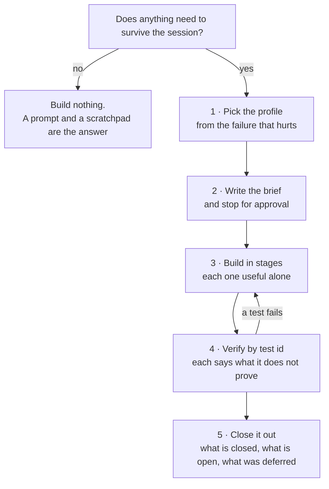

The rest of this site is a comparison. This page is the route through it.

It exists because the material a builder needs was spread across four documents
and two files that were never published, so the only way to get from *my agent
needs memory* to *here is what I should implement* was to read a comparative
report end to end and synthesise it yourself. Everything below already existed;
what is new is the order, and the fact that you can now reach it.

**Read [what this page does not give you](#what-this-page-does-not-give-you)
before you rely on it.** Nothing here has been run against a working system by
this project, and the page says so in the places where the omission matters.

## 1. Pick the profile from the failure, not the mechanism

**Start from the failure your product cannot tolerate.** Starting from the
mechanism that sounds most rigorous is how a single-user note-taker acquires a
tombstone it will never need, and the cost lands on whoever maintains it.

Two routers do this job, both on the pattern index:

- **[How to use the library](../patterns/#how-to-use-the-library)** — a list of
  symptoms, each pointing at the pattern that closes it. *Wrong facts return
  after correction. Memory cannot be audited. Memories leak across projects.
  Retrieval repeats one document.* Find yours and follow the link.
- **[Stacks, by what you are building](../patterns/#stacks-by-what-you-are-building)**
  — five product shapes, each naming the failure that actually hurts for that
  shape and the two or three patterns that close it. Single-user tool,
  multi-tenant, companion or roleplay, an autonomous agent that acts, and memory
  that must be correctable and defensible.

Patterns fail at their intersections rather than one at a time, which is why the
unit is a stack. A rejected-value tombstone is decorative if three ungoverned
write paths bypass the check. Hybrid retrieval is actively dangerous without
scope as a key, because better recall means a wider blast radius when the
boundary is missing.

**The correctable stack is not the default.** Scope, evidence, a governed
gateway and a tombstone are the answer for memory that must be defensible under
a correction. Most products are not that, and the pattern index says so in its
own words.

### The question before all of them

Does anything need to survive the session at all? If the answer is that the
model needs the right things *in this conversation*, that is context assembly
and not memory, and the smallest honest answer is a prompt and a scratchpad.
The atlas keeps a
[scope boundary](../compare/#not-in-scope-conversation-window-management) for
exactly this case, because the two get conflated constantly and the second one
costs an order of magnitude more to build.

## 2. Write the brief, then stop

Before any code: one page saying what is being built, which failure each part
closes, and **what is being deferred and why**. The deferral list is the part
worth more later than the code you write instead — it is the difference between
a system that lacks a tombstone and a system whose author decided it did not
need one.

The format is in
[`.agents/protocol/build-brief.md`](https://github.com/neoneye/agent-memory-atlas/blob/main/.agents/protocol/build-brief.md):
the brief, a closure report, and a lock file recording which atlas pages the
decisions came from. It is written for an agent and reads fine as a checklist.

Stop here for a human decision. A memory layer is a schema plus a set of
irreversible commitments about deletion and correction; those are cheap to
change on one page and expensive to change afterwards.

## 3. Build in an order where each stage stands alone

Taken from [§8 *What I Would Build*](../compare/#8-what-i-would-build), which
carries the table-level schema, the four-state status enum, the ten-step write
path, the seven-step retrieval path and the context-assembly rules. The staging
matters more than the schema: **vector search and model-based extraction come
last, deliberately**, because a system that stores raw evidence and searches it
lexically already works, and a system that starts with extraction has no floor
to fall back to when extraction is wrong.

| Stage | What it adds | What works at the end of it |
| --- | --- | --- |
| 1 | Raw evidence stored before any model call, deterministic chunking, scope applied as a read filter, lexical search | A memory that never loses material and never leaks across scopes |
| 2 | Derived claims with append-only provenance rows, a discrete status, supersession | Claims you can trace back to what they came from |
| 3 | Vector search fused with lexical, token-budgeted context assembly, recall fenced as data | Retrieval that finds paraphrases without displacing the evidence floor |
| 4 | Correction that survives a rebuild, a mutation audit, background jobs behind clear synchronous semantics | A correction you can prove held |
| 5 | Rejected-value tombstones, human review, bi-temporal validity, negative tests in CI | Memory that stays corrected through re-extraction |

**What is safe to defer, stated plainly**, from the pattern index: bi-temporal
validity, hybrid retrieval fusion, decay and reinforcement, and source-diverse
context are all improvements to memory that already works. None of them prevents
a silent failure. Stage 5 is where the deferrals stop being safe, and only for
the products whose profile put them there.

Operational rules that belong at the stage they apply to, from
[§10](../compare/#10-practical-checklist-for-your-own-system): keep local state
inspectable while developing, use transactional storage for primary state and
reserve flat JSON for exports, add background workers only once synchronous
semantics are settled, version schemas from the start, and provide a
repair/reindex path before you need one.

## 4. Verify by test id

Twenty acceptance tests are specified in
[`.agents/protocol/tests.yaml`](https://github.com/neoneye/agent-memory-atlas/blob/main/.agents/protocol/tests.yaml),
each with a stable id, a given/when/then specification against your own API, the
atlas page it was derived from, and — the field that matters most — **what a
pass does not prove**.

| Id | Asserts |
| --- | --- |
| `scope.cross_tenant_absent` | A memory written under one scope is never returned under another |
| `scope.caller_cannot_widen` | A caller cannot reach another scope by passing a different argument |
| `scope.background_respects_boundary` | Consolidation does not summarise across a boundary retrieval enforces |
| `evidence.claim_resolves_to_source` | Every derived claim resolves to the material it came from |
| `evidence.source_delete_reaches_derived` | Deleting a source reaches everything derived from it |
| `evidence.rebuild_from_retained` | The derived layer can be rebuilt from what was kept |
| `gateway.no_bypass_path` | No write path reaches the store around the gate |
| `gateway.model_cannot_claim_human_authority` | A model cannot write at the authority reserved for a person |
| `tombstone.laundering_sequence` | Reject, supersede, restate — the value does not come back |
| `tombstone.survives_ttl_and_prune` | The rejection outlives the pruning that deletes ordinary rows |
| `tombstone.key_normalization_attack` | A unicode look-alike does not slip past the check |
| `tombstone.reextraction_stays_inactive` | Re-extracting the same source does not re-assert a rejected value |
| `tombstone.no_second_memory_unit` | The rejection is not itself a memory that can be retrieved |
| `correction.survives_reindex` | A correction holds through a rebuild, across five case shapes |
| `correction.retraction_without_replacement` | A retraction with no replacement value still takes effect |
| `deletion.absent_after_reindex_and_restart` | Deleted content stays absent across every path that could restore it |
| `deletion.absent_from_shared_copies` | Deleting an original reaches copies made before the deletion |
| `retrieval.k_is_an_upper_bound` | A system reporting `@k` scores exactly the first *k* results |
| `prompt.recall_is_fenced_as_data` | Recalled text is fenced as data, not as instructions |
| `prompt.model_ignores_embedded_instructions` | An instruction stored in a memory does not execute on recall |

Two are worth singling out because they are the ones a bundled suite passes
without noticing. **`correction.retraction_without_replacement`** covers the
case where a user says *"I misspoke"* and supplies nothing in its place: there
is no newer fact for recency to prefer, so a system with no negative memory has
nothing to work with, and the
[contradiction test](../benchmarks/#7-the-contradiction-test) expects this row to
fail almost everywhere. **`deletion.absent_from_shared_copies`** covers deleting
an original after it was exported, synced or shared to a second scope — a
different failure from derived artifacts inside one scope, and one a system
routinely passes the first while failing the second.

For the full versions, [benchmarks §6](../benchmarks/#6-does-anything-benchmark-forgetting)
carries the thirteen-step deletion sequence with a six-method adapter contract,
and [§7](../benchmarks/#7-the-contradiction-test) the contradiction test with its
five case shapes.

## 5. Close it out

A closure report naming what is closed, what is open, and what was deferred with
the reason. Not a conformance statement: this project certifies nothing, and a
list of which failure modes you closed is more useful to the next maintainer
than a badge would be.

If you publish numbers, [benchmarks §8](../benchmarks/#8-a-scorecard-worth-publishing)
gives the eleven axes worth reporting — including the four nobody reports:
forbidden-hit rate, the fraction of retrieved memories that survive into the
actual prompt, write-to-readable lag, and index bytes as a multiple of source
bytes. Two rules go with them. Assert the cutoff, because a `@k` figure that
scores more than *k* results is not measuring what it says. And commit the
results, not just the harness — a reproducible harness with no committed output
reads as measured and is not.

## What this page does not give you

Stated here rather than discovered later, because the gaps are as load-bearing
as the content.

- **Nothing is runnable.** The twenty tests are language-independent
  specifications, not executable fixtures. There is no adapter you can install
  and no suite you can point at your system. Turning each `given/when/then` into
  a test in your own stack is an afternoon; the atlas has not done it for you.
- **The atlas has run none of them against anything.** Every specification here
  was derived from reading code, and no system in the corpus has been put
  through the deletion sequence by this project. A test's presence in the
  catalogue is an argument that it is worth running, not evidence that anything
  passed it.
- **There is no reference implementation.** §8 is a specification at the level of
  tables, states and path ordering. It does not carry API signatures,
  idempotency or concurrency rules, or index-rebuild semantics, and no worked
  end-to-end design exists for any of the five profiles.
- **There are no operating numbers.** The scorecard names the axes worth
  measuring — write cost, read cost, retrieval p50 and p99, write-to-readable
  lag, bytes per memory. It cannot tell you what to expect, because almost
  nothing in the corpus publishes them and this project has measured none of
  them itself. Inventing the figures would be worse than the gap.

## If you are an agent

The workflow above is packaged as a skill:
[`.agents/skills/use-the-atlas/`](https://github.com/neoneye/agent-memory-atlas/blob/main/.agents/skills/use-the-atlas/SKILL.md).
It runs in one of four modes — decide, design, review, build — and only the last
one writes code, after its own approval step. It also carries the instruction
this page opens with: **do not read the reports.** There are hundreds, and
reading widely is how an agent ends up recommending the most interesting
mechanism instead of the smallest sufficient one. Read a system report only when
a pattern page cites it for the exact mechanism you are borrowing.

`scripts/check_protocol.py` validates the test catalogue against the pages it
cites and runs in the site's own test suite, so a test whose source argument
changes goes stale visibly rather than quietly.
