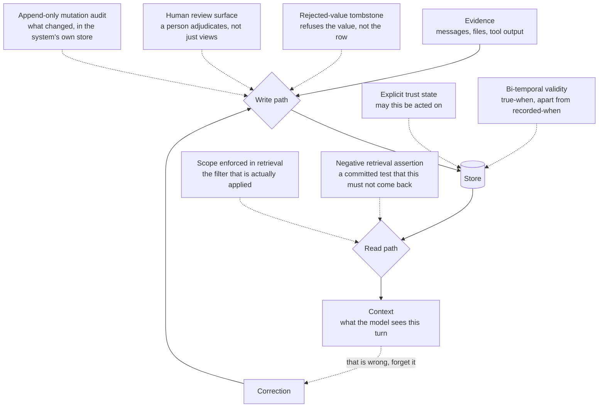

The [comparative report](../compare/) says what each system does. This page
answers the other question — **which systems actually have X** — for the seven
mechanisms whose absence causes a failure the system cannot detect.

Marks come from each report's frontmatter, so this table cannot drift from the
reviews. A tick means the mechanism was found in code at that report's pinned
commit; a dash means it was not found, which is different from impossible,
planned, or badly built. The definitions, the evidence threshold, and why these
seven rather than others are on [the atlas rubric](../methodology/atlas-rubric/).

**Read the `of 7` column as a shape, not a score.** Just over half of the systems
here carry none or one — the exact share is computed per report and printed in
the strip at the top of each one — so a low number is the ordinary case rather
than a poor one, and most of these columns are outside what most of these systems set out to
do. A local coding agent that never claimed to arbitrate truth is not failing by
carrying one mark. The column is worth sorting on only when you already know
which mechanism you need.

Filters combine with **and** — "tombstone *and* scope enforced" is the question
worth asking, and it is the one a per-column view cannot answer.

**Which one you need depends on where your memory breaks**, and the seven do not
intervene at the same place. Three of them guard the write, two describe what the
store is able to say, one guards the read, and one is the test that keeps the
other six honest. Read as a row of seven equal boxes they look like a scorecard;
read against the path a memory takes they are seven different answers to seven
different questions:

The loop is the part worth staring at. A correction re-enters through the same
write path that created the belief, which is why a mark on the write side is
worth more than it looks: it is the only place that sees both the original claim
and the attempt to reassert it after you thought it was gone.

  Has
  <button class="filter-chip cap-filter" type="button" aria-pressed="false" data-capability="tombstone">Tombstone</button>
  <button class="filter-chip cap-filter" type="button" aria-pressed="false" data-capability="trust_state">Trust state</button>
  <button class="filter-chip cap-filter" type="button" aria-pressed="false" data-capability="bitemporal">Bi-temporal</button>
  <button class="filter-chip cap-filter" type="button" aria-pressed="false" data-capability="scope_enforced">Scope enforced</button>
  <button class="filter-chip cap-filter" type="button" aria-pressed="false" data-capability="audit_log">Mutation audit</button>
  <button class="filter-chip cap-filter" type="button" aria-pressed="false" data-capability="human_review">Human review</button>
  <button class="filter-chip cap-filter" type="button" aria-pressed="false" data-capability="negative_eval">Negative evals</button>

<!-- BEGIN GENERATED CAPABILITY GRID -->
<table class="capability-grid"><thead><tr><th scope="col">System</th><th scope="col" title="A durable record of a *rejected value*, keyed on the value, so later extraction cannot silently re-assert it.">Tombstone</th><th scope="col" title="Discrete epistemic status as a field rather than a confidence score, including at least one state that withholds a memory from being treated as true.">Trust state</th><th scope="col" title="When a fact was true tracked separately from when the system recorded or expired it.">Bi-temporal</th><th scope="col" title="A stored scope key (user, project, agent, tenant) applied as a filter on the read path, not merely available as a tag. This certifies that the key reaches the query — not that the boundary is authenticated, nor that a caller cannot widen it by passing a different argument.">Scope</th><th scope="col" title="A named append-only event record of memory *mutations* in the system&#x27;s own store. Logs of retrieval or feedback are the other half of the pattern and do not count here, nor does git history.">Audit</th><th scope="col" title="A place where a person inspects, approves, or adjudicates memory content before or after it takes effect.">Review</th><th scope="col" title="Committed evaluation cases asserting that particular material must *not* be retrieved.">Neg. evals</th><th scope="col">of 7</th></tr></thead><tbody><tr data-capabilities="" data-name="7layermem"><th scope="row"><a href="../systems/7layermem/">7layermem</a></th><td class="cap-no" aria-label="no">&mdash;</td><td class="cap-no" aria-label="no">&mdash;</td><td class="cap-no" aria-label="no">&mdash;</td><td class="cap-no" aria-label="no">&mdash;</td><td class="cap-no" aria-label="no">&mdash;</td><td class="cap-no" aria-label="no">&mdash;</td><td class="cap-no" aria-label="no">&mdash;</td><td class="cap-count">0</td></tr><tr data-capabilities="" data-name="a-mem"><th scope="row"><a href="../systems/a-mem/">A-MEM</a></th><td class="cap-no" aria-label="no">&mdash;</td><td class="cap-no" aria-label="no">&mdash;</td><td class="cap-no" aria-label="no">&mdash;</td><td class="cap-no" aria-label="no">&mdash;</td><td class="cap-no" aria-label="no">&mdash;</td><td class="cap-no" aria-label="no">&mdash;</td><td class="cap-no" aria-label="no">&mdash;</td><td class="cap-count">0</td></tr><tr data-capabilities="human_review scope_enforced" data-name="acontext"><th scope="row"><a href="../systems/acontext/">Acontext</a></th><td class="cap-no" aria-label="no">&mdash;</td><td class="cap-no" aria-label="no">&mdash;</td><td class="cap-no" aria-label="no">&mdash;</td><td class="cap-yes" aria-label="yes">&#10003;</td><td class="cap-no" aria-label="no">&mdash;</td><td class="cap-yes" aria-label="yes">&#10003;</td><td class="cap-no" aria-label="no">&mdash;</td><td class="cap-count">2</td></tr><tr data-capabilities="scope_enforced" data-name="google adk"><th scope="row"><a href="../systems/adk-python/">Google ADK</a></th><td class="cap-no" aria-label="no">&mdash;</td><td class="cap-no" aria-label="no">&mdash;</td><td class="cap-no" aria-label="no">&mdash;</td><td class="cap-yes" aria-label="yes">&#10003;</td><td class="cap-no" aria-label="no">&mdash;</td><td class="cap-no" aria-label="no">&mdash;</td><td class="cap-no" aria-label="no">&mdash;</td><td class="cap-count">1</td></tr><tr data-capabilities="negative_eval scope_enforced trust_state" data-name="aeris"><th scope="row"><a href="../systems/aeris/">Aeris</a></th><td class="cap-no" aria-label="no">&mdash;</td><td class="cap-yes" aria-label="yes">&#10003;</td><td class="cap-no" aria-label="no">&mdash;</td><td class="cap-yes" aria-label="yes">&#10003;</td><td class="cap-no" aria-label="no">&mdash;</td><td class="cap-no" aria-label="no">&mdash;</td><td class="cap-yes" aria-label="yes">&#10003;</td><td class="cap-count">3</td></tr><tr data-capabilities="negative_eval" data-name="agent-afk"><th scope="row"><a href="../systems/agent-afk/">agent-afk</a></th><td class="cap-no" aria-label="no">&mdash;</td><td class="cap-no" aria-label="no">&mdash;</td><td class="cap-no" aria-label="no">&mdash;</td><td class="cap-no" aria-label="no">&mdash;</td><td class="cap-no" aria-label="no">&mdash;</td><td class="cap-no" aria-label="no">&mdash;</td><td class="cap-yes" aria-label="yes">&#10003;</td><td class="cap-count">1</td></tr><tr data-capabilities="scope_enforced" data-name="microsoft agent framework"><th scope="row"><a href="../systems/agent-framework/">Microsoft Agent Framework</a></th><td class="cap-no" aria-label="no">&mdash;</td><td class="cap-no" aria-label="no">&mdash;</td><td class="cap-no" aria-label="no">&mdash;</td><td class="cap-yes" aria-label="yes">&#10003;</td><td class="cap-no" aria-label="no">&mdash;</td><td class="cap-no" aria-label="no">&mdash;</td><td class="cap-no" aria-label="no">&mdash;</td><td class="cap-count">1</td></tr><tr data-capabilities="audit_log bitemporal human_review negative_eval scope_enforced tombstone" data-name="agent memory (mythologiq)"><th scope="row"><a href="../systems/agent-memory-doctrine/">Agent Memory (MythologIQ)</a></th><td class="cap-yes" aria-label="yes">&#10003;</td><td class="cap-no" aria-label="no">&mdash;</td><td class="cap-yes" aria-label="yes">&#10003;</td><td class="cap-yes" aria-label="yes">&#10003;</td><td class="cap-yes" aria-label="yes">&#10003;</td><td class="cap-yes" aria-label="yes">&#10003;</td><td class="cap-yes" aria-label="yes">&#10003;</td><td class="cap-count">6</td></tr><tr data-capabilities="bitemporal scope_enforced" data-name="agent memory on supabase"><th scope="row"><a href="../systems/agent-memory-supabase/">Agent Memory on Supabase</a></th><td class="cap-no" aria-label="no">&mdash;</td><td class="cap-no" aria-label="no">&mdash;</td><td class="cap-yes" aria-label="yes">&#10003;</td><td class="cap-yes" aria-label="yes">&#10003;</td><td class="cap-no" aria-label="no">&mdash;</td><td class="cap-no" aria-label="no">&mdash;</td><td class="cap-no" aria-label="no">&mdash;</td><td class="cap-count">2</td></tr><tr data-capabilities="audit_log scope_enforced" data-name="agent memory techniques"><th scope="row"><a href="../systems/agent-memory-techniques/">Agent Memory Techniques</a></th><td class="cap-no" aria-label="no">&mdash;</td><td class="cap-no" aria-label="no">&mdash;</td><td class="cap-no" aria-label="no">&mdash;</td><td class="cap-yes" aria-label="yes">&#10003;</td><td class="cap-yes" aria-label="yes">&#10003;</td><td class="cap-no" aria-label="no">&mdash;</td><td class="cap-no" aria-label="no">&mdash;</td><td class="cap-count">2</td></tr><tr data-capabilities="audit_log human_review trust_state" data-name="agent mesh"><th scope="row"><a href="../systems/agent-mesh/">Agent Mesh</a></th><td class="cap-no" aria-label="no">&mdash;</td><td class="cap-yes" aria-label="yes">&#10003;</td><td class="cap-no" aria-label="no">&mdash;</td><td class="cap-no" aria-label="no">&mdash;</td><td class="cap-yes" aria-label="yes">&#10003;</td><td class="cap-yes" aria-label="yes">&#10003;</td><td class="cap-no" aria-label="no">&mdash;</td><td class="cap-count">3</td></tr><tr data-capabilities="negative_eval scope_enforced trust_state" data-name="agentworkingmemory"><th scope="row"><a href="../systems/agent-working-memory/">AgentWorkingMemory</a></th><td class="cap-no" aria-label="no">&mdash;</td><td class="cap-yes" aria-label="yes">&#10003;</td><td class="cap-no" aria-label="no">&mdash;</td><td class="cap-yes" aria-label="yes">&#10003;</td><td class="cap-no" aria-label="no">&mdash;</td><td class="cap-no" aria-label="no">&mdash;</td><td class="cap-yes" aria-label="yes">&#10003;</td><td class="cap-count">3</td></tr><tr data-capabilities="trust_state" data-name="agentic context engine"><th scope="row"><a href="../systems/agentic-context-engine/">Agentic Context Engine</a></th><td class="cap-no" aria-label="no">&mdash;</td><td class="cap-yes" aria-label="yes">&#10003;</td><td class="cap-no" aria-label="no">&mdash;</td><td class="cap-no" aria-label="no">&mdash;</td><td class="cap-no" aria-label="no">&mdash;</td><td class="cap-no" aria-label="no">&mdash;</td><td class="cap-no" aria-label="no">&mdash;</td><td class="cap-count">1</td></tr><tr data-capabilities="" data-name="agentmemory v4"><th scope="row"><a href="../systems/agentmemory-v4/">agentmemory V4</a></th><td class="cap-no" aria-label="no">&mdash;</td><td class="cap-no" aria-label="no">&mdash;</td><td class="cap-no" aria-label="no">&mdash;</td><td class="cap-no" aria-label="no">&mdash;</td><td class="cap-no" aria-label="no">&mdash;</td><td class="cap-no" aria-label="no">&mdash;</td><td class="cap-no" aria-label="no">&mdash;</td><td class="cap-count">0</td></tr><tr data-capabilities="audit_log scope_enforced" data-name="agentmemory"><th scope="row"><a href="../systems/agentmemory/">agentmemory</a></th><td class="cap-no" aria-label="no">&mdash;</td><td class="cap-no" aria-label="no">&mdash;</td><td class="cap-no" aria-label="no">&mdash;</td><td class="cap-yes" aria-label="yes">&#10003;</td><td class="cap-yes" aria-label="yes">&#10003;</td><td class="cap-no" aria-label="no">&mdash;</td><td class="cap-no" aria-label="no">&mdash;</td><td class="cap-count">2</td></tr><tr data-capabilities="scope_enforced trust_state" data-name="agentrecall-x"><th scope="row"><a href="../systems/agentrecall-x/">AgentRecall-X</a></th><td class="cap-no" aria-label="no">&mdash;</td><td class="cap-yes" aria-label="yes">&#10003;</td><td class="cap-no" aria-label="no">&mdash;</td><td class="cap-yes" aria-label="yes">&#10003;</td><td class="cap-no" aria-label="no">&mdash;</td><td class="cap-no" aria-label="no">&mdash;</td><td class="cap-no" aria-label="no">&mdash;</td><td class="cap-count">2</td></tr><tr data-capabilities="human_review scope_enforced" data-name="agentswarms"><th scope="row"><a href="../systems/agentswarms/">AgentSwarms</a></th><td class="cap-no" aria-label="no">&mdash;</td><td class="cap-no" aria-label="no">&mdash;</td><td class="cap-no" aria-label="no">&mdash;</td><td class="cap-yes" aria-label="yes">&#10003;</td><td class="cap-no" aria-label="no">&mdash;</td><td class="cap-yes" aria-label="yes">&#10003;</td><td class="cap-no" aria-label="no">&mdash;</td><td class="cap-count">2</td></tr><tr data-capabilities="human_review negative_eval scope_enforced" data-name="agno"><th scope="row"><a href="../systems/agno/">Agno</a></th><td class="cap-no" aria-label="no">&mdash;</td><td class="cap-no" aria-label="no">&mdash;</td><td class="cap-no" aria-label="no">&mdash;</td><td class="cap-yes" aria-label="yes">&#10003;</td><td class="cap-no" aria-label="no">&mdash;</td><td class="cap-yes" aria-label="yes">&#10003;</td><td class="cap-yes" aria-label="yes">&#10003;</td><td class="cap-count">3</td></tr><tr data-capabilities="scope_enforced" data-name="ai-memory"><th scope="row"><a href="../systems/ai-memory/">ai-memory</a></th><td class="cap-no" aria-label="no">&mdash;</td><td class="cap-no" aria-label="no">&mdash;</td><td class="cap-no" aria-label="no">&mdash;</td><td class="cap-yes" aria-label="yes">&#10003;</td><td class="cap-no" aria-label="no">&mdash;</td><td class="cap-no" aria-label="no">&mdash;</td><td class="cap-no" aria-label="no">&mdash;</td><td class="cap-count">1</td></tr><tr data-capabilities="scope_enforced" data-name="aimaos"><th scope="row"><a href="../systems/aimaos/">AIMAOS</a></th><td class="cap-no" aria-label="no">&mdash;</td><td class="cap-no" aria-label="no">&mdash;</td><td class="cap-no" aria-label="no">&mdash;</td><td class="cap-yes" aria-label="yes">&#10003;</td><td class="cap-no" aria-label="no">&mdash;</td><td class="cap-no" aria-label="no">&mdash;</td><td class="cap-no" aria-label="no">&mdash;</td><td class="cap-count">1</td></tr><tr data-capabilities="scope_enforced" data-name="aipass"><th scope="row"><a href="../systems/aipass/">AIPass</a></th><td class="cap-no" aria-label="no">&mdash;</td><td class="cap-no" aria-label="no">&mdash;</td><td class="cap-no" aria-label="no">&mdash;</td><td class="cap-yes" aria-label="yes">&#10003;</td><td class="cap-no" aria-label="no">&mdash;</td><td class="cap-no" aria-label="no">&mdash;</td><td class="cap-no" aria-label="no">&mdash;</td><td class="cap-count">1</td></tr><tr data-capabilities="audit_log scope_enforced trust_state" data-name="alma"><th scope="row"><a href="../systems/alma-memory/">ALMA</a></th><td class="cap-no" aria-label="no">&mdash;</td><td class="cap-yes" aria-label="yes">&#10003;</td><td class="cap-no" aria-label="no">&mdash;</td><td class="cap-yes" aria-label="yes">&#10003;</td><td class="cap-yes" aria-label="yes">&#10003;</td><td class="cap-no" aria-label="no">&mdash;</td><td class="cap-no" aria-label="no">&mdash;</td><td class="cap-count">3</td></tr><tr data-capabilities="" data-name="always-on memory agent"><th scope="row"><a href="../systems/always-on-memory-agent/">Always-On Memory Agent</a></th><td class="cap-no" aria-label="no">&mdash;</td><td class="cap-no" aria-label="no">&mdash;</td><td class="cap-no" aria-label="no">&mdash;</td><td class="cap-no" aria-label="no">&mdash;</td><td class="cap-no" aria-label="no">&mdash;</td><td class="cap-no" aria-label="no">&mdash;</td><td class="cap-no" aria-label="no">&mdash;</td><td class="cap-count">0</td></tr><tr data-capabilities="" data-name="arc-code"><th scope="row"><a href="../systems/arc-code/">arc-code</a></th><td class="cap-no" aria-label="no">&mdash;</td><td class="cap-no" aria-label="no">&mdash;</td><td class="cap-no" aria-label="no">&mdash;</td><td class="cap-no" aria-label="no">&mdash;</td><td class="cap-no" aria-label="no">&mdash;</td><td class="cap-no" aria-label="no">&mdash;</td><td class="cap-no" aria-label="no">&mdash;</td><td class="cap-count">0</td></tr><tr data-capabilities="negative_eval scope_enforced" data-name="arcrift"><th scope="row"><a href="../systems/arcrift/">ArcRift</a></th><td class="cap-no" aria-label="no">&mdash;</td><td class="cap-no" aria-label="no">&mdash;</td><td class="cap-no" aria-label="no">&mdash;</td><td class="cap-yes" aria-label="yes">&#10003;</td><td class="cap-no" aria-label="no">&mdash;</td><td class="cap-no" aria-label="no">&mdash;</td><td class="cap-yes" aria-label="yes">&#10003;</td><td class="cap-count">2</td></tr><tr data-capabilities="negative_eval scope_enforced" data-name="argo"><th scope="row"><a href="../systems/argo/">ARGO</a></th><td class="cap-no" aria-label="no">&mdash;</td><td class="cap-no" aria-label="no">&mdash;</td><td class="cap-no" aria-label="no">&mdash;</td><td class="cap-yes" aria-label="yes">&#10003;</td><td class="cap-no" aria-label="no">&mdash;</td><td class="cap-no" aria-label="no">&mdash;</td><td class="cap-yes" aria-label="yes">&#10003;</td><td class="cap-count">2</td></tr><tr data-capabilities="audit_log" data-name="project athena"><th scope="row"><a href="../systems/athena/">Project Athena</a></th><td class="cap-no" aria-label="no">&mdash;</td><td class="cap-no" aria-label="no">&mdash;</td><td class="cap-no" aria-label="no">&mdash;</td><td class="cap-no" aria-label="no">&mdash;</td><td class="cap-yes" aria-label="yes">&#10003;</td><td class="cap-no" aria-label="no">&mdash;</td><td class="cap-no" aria-label="no">&mdash;</td><td class="cap-count">1</td></tr><tr data-capabilities="bitemporal" data-name="atomic agent"><th scope="row"><a href="../systems/atomic-agent/">Atomic Agent</a></th><td class="cap-no" aria-label="no">&mdash;</td><td class="cap-no" aria-label="no">&mdash;</td><td class="cap-yes" aria-label="yes">&#10003;</td><td class="cap-no" aria-label="no">&mdash;</td><td class="cap-no" aria-label="no">&mdash;</td><td class="cap-no" aria-label="no">&mdash;</td><td class="cap-no" aria-label="no">&mdash;</td><td class="cap-count">1</td></tr><tr data-capabilities="audit_log negative_eval scope_enforced" data-name="aukora kernel"><th scope="row"><a href="../systems/aukora-kernel/">Aukora Kernel</a></th><td class="cap-no" aria-label="no">&mdash;</td><td class="cap-no" aria-label="no">&mdash;</td><td class="cap-no" aria-label="no">&mdash;</td><td class="cap-yes" aria-label="yes">&#10003;</td><td class="cap-yes" aria-label="yes">&#10003;</td><td class="cap-no" aria-label="no">&mdash;</td><td class="cap-yes" aria-label="yes">&#10003;</td><td class="cap-count">3</td></tr><tr data-capabilities="audit_log trust_state" data-name="aura"><th scope="row"><a href="../systems/aura/">Aura</a></th><td class="cap-no" aria-label="no">&mdash;</td><td class="cap-yes" aria-label="yes">&#10003;</td><td class="cap-no" aria-label="no">&mdash;</td><td class="cap-no" aria-label="no">&mdash;</td><td class="cap-yes" aria-label="yes">&#10003;</td><td class="cap-no" aria-label="no">&mdash;</td><td class="cap-no" aria-label="no">&mdash;</td><td class="cap-count">2</td></tr><tr data-capabilities="" data-name="aurora"><th scope="row"><a href="../systems/aurora/">AURORA</a></th><td class="cap-no" aria-label="no">&mdash;</td><td class="cap-no" aria-label="no">&mdash;</td><td class="cap-no" aria-label="no">&mdash;</td><td class="cap-no" aria-label="no">&mdash;</td><td class="cap-no" aria-label="no">&mdash;</td><td class="cap-no" aria-label="no">&mdash;</td><td class="cap-no" aria-label="no">&mdash;</td><td class="cap-count">0</td></tr><tr data-capabilities="" data-name="autogen"><th scope="row"><a href="../systems/autogen/">AutoGen</a></th><td class="cap-no" aria-label="no">&mdash;</td><td class="cap-no" aria-label="no">&mdash;</td><td class="cap-no" aria-label="no">&mdash;</td><td class="cap-no" aria-label="no">&mdash;</td><td class="cap-no" aria-label="no">&mdash;</td><td class="cap-no" aria-label="no">&mdash;</td><td class="cap-no" aria-label="no">&mdash;</td><td class="cap-count">0</td></tr><tr data-capabilities="scope_enforced" data-name="basic memory"><th scope="row"><a href="../systems/basic-memory/">Basic Memory</a></th><td class="cap-no" aria-label="no">&mdash;</td><td class="cap-no" aria-label="no">&mdash;</td><td class="cap-no" aria-label="no">&mdash;</td><td class="cap-yes" aria-label="yes">&#10003;</td><td class="cap-no" aria-label="no">&mdash;</td><td class="cap-no" aria-label="no">&mdash;</td><td class="cap-no" aria-label="no">&mdash;</td><td class="cap-count">1</td></tr><tr data-capabilities="audit_log negative_eval scope_enforced" data-name="brain.md"><th scope="row"><a href="../systems/brain-md/">brain.md</a></th><td class="cap-no" aria-label="no">&mdash;</td><td class="cap-no" aria-label="no">&mdash;</td><td class="cap-no" aria-label="no">&mdash;</td><td class="cap-yes" aria-label="yes">&#10003;</td><td class="cap-yes" aria-label="yes">&#10003;</td><td class="cap-no" aria-label="no">&mdash;</td><td class="cap-yes" aria-label="yes">&#10003;</td><td class="cap-count">3</td></tr><tr data-capabilities="audit_log human_review negative_eval tombstone trust_state" data-name="breadcrumbs"><th scope="row"><a href="../systems/breadcrumbs/">breadcrumbs</a></th><td class="cap-yes" aria-label="yes">&#10003;</td><td class="cap-yes" aria-label="yes">&#10003;</td><td class="cap-no" aria-label="no">&mdash;</td><td class="cap-no" aria-label="no">&mdash;</td><td class="cap-yes" aria-label="yes">&#10003;</td><td class="cap-yes" aria-label="yes">&#10003;</td><td class="cap-yes" aria-label="yes">&#10003;</td><td class="cap-count">5</td></tr><tr data-capabilities="scope_enforced" data-name="buzz"><th scope="row"><a href="../systems/buzz/">Buzz</a></th><td class="cap-no" aria-label="no">&mdash;</td><td class="cap-no" aria-label="no">&mdash;</td><td class="cap-no" aria-label="no">&mdash;</td><td class="cap-yes" aria-label="yes">&#10003;</td><td class="cap-no" aria-label="no">&mdash;</td><td class="cap-no" aria-label="no">&mdash;</td><td class="cap-no" aria-label="no">&mdash;</td><td class="cap-count">1</td></tr><tr data-capabilities="" data-name="byterover"><th scope="row"><a href="../systems/byterover/">ByteRover</a></th><td class="cap-no" aria-label="no">&mdash;</td><td class="cap-no" aria-label="no">&mdash;</td><td class="cap-no" aria-label="no">&mdash;</td><td class="cap-no" aria-label="no">&mdash;</td><td class="cap-no" aria-label="no">&mdash;</td><td class="cap-no" aria-label="no">&mdash;</td><td class="cap-no" aria-label="no">&mdash;</td><td class="cap-count">0</td></tr><tr data-capabilities="human_review trust_state" data-name="cambium"><th scope="row"><a href="../systems/cambium/">Cambium</a></th><td class="cap-no" aria-label="no">&mdash;</td><td class="cap-yes" aria-label="yes">&#10003;</td><td class="cap-no" aria-label="no">&mdash;</td><td class="cap-no" aria-label="no">&mdash;</td><td class="cap-no" aria-label="no">&mdash;</td><td class="cap-yes" aria-label="yes">&#10003;</td><td class="cap-no" aria-label="no">&mdash;</td><td class="cap-count">2</td></tr><tr data-capabilities="" data-name="camel"><th scope="row"><a href="../systems/camel/">CAMEL</a></th><td class="cap-no" aria-label="no">&mdash;</td><td class="cap-no" aria-label="no">&mdash;</td><td class="cap-no" aria-label="no">&mdash;</td><td class="cap-no" aria-label="no">&mdash;</td><td class="cap-no" aria-label="no">&mdash;</td><td class="cap-no" aria-label="no">&mdash;</td><td class="cap-no" aria-label="no">&mdash;</td><td class="cap-count">0</td></tr><tr data-capabilities="" data-name="claude-code-memory-setup"><th scope="row"><a href="../systems/claude-code-memory-setup/">claude-code-memory-setup</a></th><td class="cap-no" aria-label="no">&mdash;</td><td class="cap-no" aria-label="no">&mdash;</td><td class="cap-no" aria-label="no">&mdash;</td><td class="cap-no" aria-label="no">&mdash;</td><td class="cap-no" aria-label="no">&mdash;</td><td class="cap-no" aria-label="no">&mdash;</td><td class="cap-no" aria-label="no">&mdash;</td><td class="cap-count">0</td></tr><tr data-capabilities="scope_enforced" data-name="claude-mem"><th scope="row"><a href="../systems/claude-mem/">Claude-Mem</a></th><td class="cap-no" aria-label="no">&mdash;</td><td class="cap-no" aria-label="no">&mdash;</td><td class="cap-no" aria-label="no">&mdash;</td><td class="cap-yes" aria-label="yes">&#10003;</td><td class="cap-no" aria-label="no">&mdash;</td><td class="cap-no" aria-label="no">&mdash;</td><td class="cap-no" aria-label="no">&mdash;</td><td class="cap-count">1</td></tr><tr data-capabilities="bitemporal negative_eval scope_enforced" data-name="total-agent-memory"><th scope="row"><a href="../systems/claude-total-memory/">total-agent-memory</a></th><td class="cap-no" aria-label="no">&mdash;</td><td class="cap-no" aria-label="no">&mdash;</td><td class="cap-yes" aria-label="yes">&#10003;</td><td class="cap-yes" aria-label="yes">&#10003;</td><td class="cap-no" aria-label="no">&mdash;</td><td class="cap-no" aria-label="no">&mdash;</td><td class="cap-yes" aria-label="yes">&#10003;</td><td class="cap-count">3</td></tr><tr data-capabilities="human_review" data-name="claudest (claude-memory)"><th scope="row"><a href="../systems/claudest/">Claudest (claude-memory)</a></th><td class="cap-no" aria-label="no">&mdash;</td><td class="cap-no" aria-label="no">&mdash;</td><td class="cap-no" aria-label="no">&mdash;</td><td class="cap-no" aria-label="no">&mdash;</td><td class="cap-no" aria-label="no">&mdash;</td><td class="cap-yes" aria-label="yes">&#10003;</td><td class="cap-no" aria-label="no">&mdash;</td><td class="cap-count">1</td></tr><tr data-capabilities="audit_log bitemporal scope_enforced" data-name="clawmem"><th scope="row"><a href="../systems/clawmem/">ClawMem</a></th><td class="cap-no" aria-label="no">&mdash;</td><td class="cap-no" aria-label="no">&mdash;</td><td class="cap-yes" aria-label="yes">&#10003;</td><td class="cap-yes" aria-label="yes">&#10003;</td><td class="cap-yes" aria-label="yes">&#10003;</td><td class="cap-no" aria-label="no">&mdash;</td><td class="cap-no" aria-label="no">&mdash;</td><td class="cap-count">3</td></tr><tr data-capabilities="human_review trust_state" data-name="clio"><th scope="row"><a href="../systems/clio/">CLIO</a></th><td class="cap-no" aria-label="no">&mdash;</td><td class="cap-yes" aria-label="yes">&#10003;</td><td class="cap-no" aria-label="no">&mdash;</td><td class="cap-no" aria-label="no">&mdash;</td><td class="cap-no" aria-label="no">&mdash;</td><td class="cap-yes" aria-label="yes">&#10003;</td><td class="cap-no" aria-label="no">&mdash;</td><td class="cap-count">2</td></tr><tr data-capabilities="scope_enforced" data-name="cognee"><th scope="row"><a href="../systems/cognee/">Cognee</a></th><td class="cap-no" aria-label="no">&mdash;</td><td class="cap-no" aria-label="no">&mdash;</td><td class="cap-no" aria-label="no">&mdash;</td><td class="cap-yes" aria-label="yes">&#10003;</td><td class="cap-no" aria-label="no">&mdash;</td><td class="cap-no" aria-label="no">&mdash;</td><td class="cap-no" aria-label="no">&mdash;</td><td class="cap-count">1</td></tr><tr data-capabilities="scope_enforced trust_state" data-name="cognicore"><th scope="row"><a href="../systems/cognicore/">CogniCore</a></th><td class="cap-no" aria-label="no">&mdash;</td><td class="cap-yes" aria-label="yes">&#10003;</td><td class="cap-no" aria-label="no">&mdash;</td><td class="cap-yes" aria-label="yes">&#10003;</td><td class="cap-no" aria-label="no">&mdash;</td><td class="cap-no" aria-label="no">&mdash;</td><td class="cap-no" aria-label="no">&mdash;</td><td class="cap-count">2</td></tr><tr data-capabilities="negative_eval scope_enforced" data-name="cognis"><th scope="row"><a href="../systems/cognis/">Cognis</a></th><td class="cap-no" aria-label="no">&mdash;</td><td class="cap-no" aria-label="no">&mdash;</td><td class="cap-no" aria-label="no">&mdash;</td><td class="cap-yes" aria-label="yes">&#10003;</td><td class="cap-no" aria-label="no">&mdash;</td><td class="cap-no" aria-label="no">&mdash;</td><td class="cap-yes" aria-label="yes">&#10003;</td><td class="cap-count">2</td></tr><tr data-capabilities="" data-name="cognitive spatial memory"><th scope="row"><a href="../systems/cognitive-spatial-memory/">Cognitive Spatial Memory</a></th><td class="cap-no" aria-label="no">&mdash;</td><td class="cap-no" aria-label="no">&mdash;</td><td class="cap-no" aria-label="no">&mdash;</td><td class="cap-no" aria-label="no">&mdash;</td><td class="cap-no" aria-label="no">&mdash;</td><td class="cap-no" aria-label="no">&mdash;</td><td class="cap-no" aria-label="no">&mdash;</td><td class="cap-count">0</td></tr><tr data-capabilities="" data-name="context mem"><th scope="row"><a href="../systems/context-mem/">Context Mem</a></th><td class="cap-no" aria-label="no">&mdash;</td><td class="cap-no" aria-label="no">&mdash;</td><td class="cap-no" aria-label="no">&mdash;</td><td class="cap-no" aria-label="no">&mdash;</td><td class="cap-no" aria-label="no">&mdash;</td><td class="cap-no" aria-label="no">&mdash;</td><td class="cap-no" aria-label="no">&mdash;</td><td class="cap-count">0</td></tr><tr data-capabilities="negative_eval scope_enforced" data-name="context mode"><th scope="row"><a href="../systems/context-mode/">Context Mode</a></th><td class="cap-no" aria-label="no">&mdash;</td><td class="cap-no" aria-label="no">&mdash;</td><td class="cap-no" aria-label="no">&mdash;</td><td class="cap-yes" aria-label="yes">&#10003;</td><td class="cap-no" aria-label="no">&mdash;</td><td class="cap-no" aria-label="no">&mdash;</td><td class="cap-yes" aria-label="yes">&#10003;</td><td class="cap-count">2</td></tr><tr data-capabilities="" data-name="continuous claude"><th scope="row"><a href="../systems/continuous-claude/">Continuous Claude</a></th><td class="cap-no" aria-label="no">&mdash;</td><td class="cap-no" aria-label="no">&mdash;</td><td class="cap-no" aria-label="no">&mdash;</td><td class="cap-no" aria-label="no">&mdash;</td><td class="cap-no" aria-label="no">&mdash;</td><td class="cap-no" aria-label="no">&mdash;</td><td class="cap-no" aria-label="no">&mdash;</td><td class="cap-count">0</td></tr><tr data-capabilities="audit_log bitemporal human_review negative_eval scope_enforced trust_state" data-name="core memory"><th scope="row"><a href="../systems/core-memory/">Core Memory</a></th><td class="cap-no" aria-label="no">&mdash;</td><td class="cap-yes" aria-label="yes">&#10003;</td><td class="cap-yes" aria-label="yes">&#10003;</td><td class="cap-yes" aria-label="yes">&#10003;</td><td class="cap-yes" aria-label="yes">&#10003;</td><td class="cap-yes" aria-label="yes">&#10003;</td><td class="cap-yes" aria-label="yes">&#10003;</td><td class="cap-count">6</td></tr><tr data-capabilities="bitemporal scope_enforced" data-name="core"><th scope="row"><a href="../systems/core-redplanet/">CORE</a></th><td class="cap-no" aria-label="no">&mdash;</td><td class="cap-no" aria-label="no">&mdash;</td><td class="cap-yes" aria-label="yes">&#10003;</td><td class="cap-yes" aria-label="yes">&#10003;</td><td class="cap-no" aria-label="no">&mdash;</td><td class="cap-no" aria-label="no">&mdash;</td><td class="cap-no" aria-label="no">&mdash;</td><td class="cap-count">2</td></tr><tr data-capabilities="audit_log" data-name="cortex-engine"><th scope="row"><a href="../systems/cortex-engine/">cortex-engine</a></th><td class="cap-no" aria-label="no">&mdash;</td><td class="cap-no" aria-label="no">&mdash;</td><td class="cap-no" aria-label="no">&mdash;</td><td class="cap-no" aria-label="no">&mdash;</td><td class="cap-yes" aria-label="yes">&#10003;</td><td class="cap-no" aria-label="no">&mdash;</td><td class="cap-no" aria-label="no">&mdash;</td><td class="cap-count">1</td></tr><tr data-capabilities="human_review scope_enforced" data-name="cortex"><th scope="row"><a href="../systems/cortex/">Cortex</a></th><td class="cap-no" aria-label="no">&mdash;</td><td class="cap-no" aria-label="no">&mdash;</td><td class="cap-no" aria-label="no">&mdash;</td><td class="cap-yes" aria-label="yes">&#10003;</td><td class="cap-no" aria-label="no">&mdash;</td><td class="cap-yes" aria-label="yes">&#10003;</td><td class="cap-no" aria-label="no">&mdash;</td><td class="cap-count">2</td></tr><tr data-capabilities="scope_enforced" data-name="cortexgraph"><th scope="row"><a href="../systems/cortexgraph/">CortexGraph</a></th><td class="cap-no" aria-label="no">&mdash;</td><td class="cap-no" aria-label="no">&mdash;</td><td class="cap-no" aria-label="no">&mdash;</td><td class="cap-yes" aria-label="yes">&#10003;</td><td class="cap-no" aria-label="no">&mdash;</td><td class="cap-no" aria-label="no">&mdash;</td><td class="cap-no" aria-label="no">&mdash;</td><td class="cap-count">1</td></tr><tr data-capabilities="" data-name="cosmonapse"><th scope="row"><a href="../systems/cosmonapse/">Cosmonapse</a></th><td class="cap-no" aria-label="no">&mdash;</td><td class="cap-no" aria-label="no">&mdash;</td><td class="cap-no" aria-label="no">&mdash;</td><td class="cap-no" aria-label="no">&mdash;</td><td class="cap-no" aria-label="no">&mdash;</td><td class="cap-no" aria-label="no">&mdash;</td><td class="cap-no" aria-label="no">&mdash;</td><td class="cap-count">0</td></tr><tr data-capabilities="scope_enforced" data-name="cowagent"><th scope="row"><a href="../systems/cowagent/">CowAgent</a></th><td class="cap-no" aria-label="no">&mdash;</td><td class="cap-no" aria-label="no">&mdash;</td><td class="cap-no" aria-label="no">&mdash;</td><td class="cap-yes" aria-label="yes">&#10003;</td><td class="cap-no" aria-label="no">&mdash;</td><td class="cap-no" aria-label="no">&mdash;</td><td class="cap-no" aria-label="no">&mdash;</td><td class="cap-count">1</td></tr><tr data-capabilities="negative_eval scope_enforced" data-name="crewai"><th scope="row"><a href="../systems/crewai/">CrewAI</a></th><td class="cap-no" aria-label="no">&mdash;</td><td class="cap-no" aria-label="no">&mdash;</td><td class="cap-no" aria-label="no">&mdash;</td><td class="cap-yes" aria-label="yes">&#10003;</td><td class="cap-no" aria-label="no">&mdash;</td><td class="cap-no" aria-label="no">&mdash;</td><td class="cap-yes" aria-label="yes">&#10003;</td><td class="cap-count">2</td></tr><tr data-capabilities="audit_log negative_eval scope_enforced" data-name="csm"><th scope="row"><a href="../systems/csm/">CSM</a></th><td class="cap-no" aria-label="no">&mdash;</td><td class="cap-no" aria-label="no">&mdash;</td><td class="cap-no" aria-label="no">&mdash;</td><td class="cap-yes" aria-label="yes">&#10003;</td><td class="cap-yes" aria-label="yes">&#10003;</td><td class="cap-no" aria-label="no">&mdash;</td><td class="cap-yes" aria-label="yes">&#10003;</td><td class="cap-count">3</td></tr><tr data-capabilities="audit_log scope_enforced" data-name="ctx"><th scope="row"><a href="../systems/ctx/">ctx</a></th><td class="cap-no" aria-label="no">&mdash;</td><td class="cap-no" aria-label="no">&mdash;</td><td class="cap-no" aria-label="no">&mdash;</td><td class="cap-yes" aria-label="yes">&#10003;</td><td class="cap-yes" aria-label="yes">&#10003;</td><td class="cap-no" aria-label="no">&mdash;</td><td class="cap-no" aria-label="no">&mdash;</td><td class="cap-count">2</td></tr><tr data-capabilities="audit_log bitemporal" data-name="daem0nmcp"><th scope="row"><a href="../systems/daem0n-mcp/">Daem0nMCP</a></th><td class="cap-no" aria-label="no">&mdash;</td><td class="cap-no" aria-label="no">&mdash;</td><td class="cap-yes" aria-label="yes">&#10003;</td><td class="cap-no" aria-label="no">&mdash;</td><td class="cap-yes" aria-label="yes">&#10003;</td><td class="cap-no" aria-label="no">&mdash;</td><td class="cap-no" aria-label="no">&mdash;</td><td class="cap-count">2</td></tr><tr data-capabilities="audit_log human_review negative_eval scope_enforced tombstone trust_state" data-name="daimon"><th scope="row"><a href="../systems/daimon/">Daimon</a></th><td class="cap-yes" aria-label="yes">&#10003;</td><td class="cap-yes" aria-label="yes">&#10003;</td><td class="cap-no" aria-label="no">&mdash;</td><td class="cap-yes" aria-label="yes">&#10003;</td><td class="cap-yes" aria-label="yes">&#10003;</td><td class="cap-yes" aria-label="yes">&#10003;</td><td class="cap-yes" aria-label="yes">&#10003;</td><td class="cap-count">6</td></tr><tr data-capabilities="audit_log negative_eval scope_enforced" data-name="deepcode"><th scope="row"><a href="../systems/deepcode/">DeepCode</a></th><td class="cap-no" aria-label="no">&mdash;</td><td class="cap-no" aria-label="no">&mdash;</td><td class="cap-no" aria-label="no">&mdash;</td><td class="cap-yes" aria-label="yes">&#10003;</td><td class="cap-yes" aria-label="yes">&#10003;</td><td class="cap-no" aria-label="no">&mdash;</td><td class="cap-yes" aria-label="yes">&#10003;</td><td class="cap-count">3</td></tr><tr data-capabilities="negative_eval scope_enforced" data-name="deepseek harness"><th scope="row"><a href="../systems/deepseek-harness/">DeepSeek Harness</a></th><td class="cap-no" aria-label="no">&mdash;</td><td class="cap-no" aria-label="no">&mdash;</td><td class="cap-no" aria-label="no">&mdash;</td><td class="cap-yes" aria-label="yes">&#10003;</td><td class="cap-no" aria-label="no">&mdash;</td><td class="cap-no" aria-label="no">&mdash;</td><td class="cap-yes" aria-label="yes">&#10003;</td><td class="cap-count">2</td></tr><tr data-capabilities="human_review scope_enforced" data-name="deerflow"><th scope="row"><a href="../systems/deer-flow/">DeerFlow</a></th><td class="cap-no" aria-label="no">&mdash;</td><td class="cap-no" aria-label="no">&mdash;</td><td class="cap-no" aria-label="no">&mdash;</td><td class="cap-yes" aria-label="yes">&#10003;</td><td class="cap-no" aria-label="no">&mdash;</td><td class="cap-yes" aria-label="yes">&#10003;</td><td class="cap-no" aria-label="no">&mdash;</td><td class="cap-count">2</td></tr><tr data-capabilities="human_review" data-name="dexto"><th scope="row"><a href="../systems/dexto/">Dexto</a></th><td class="cap-no" aria-label="no">&mdash;</td><td class="cap-no" aria-label="no">&mdash;</td><td class="cap-no" aria-label="no">&mdash;</td><td class="cap-no" aria-label="no">&mdash;</td><td class="cap-no" aria-label="no">&mdash;</td><td class="cap-yes" aria-label="yes">&#10003;</td><td class="cap-no" aria-label="no">&mdash;</td><td class="cap-count">1</td></tr><tr data-capabilities="" data-name="diffmem"><th scope="row"><a href="../systems/diffmem/">DiffMem</a></th><td class="cap-no" aria-label="no">&mdash;</td><td class="cap-no" aria-label="no">&mdash;</td><td class="cap-no" aria-label="no">&mdash;</td><td class="cap-no" aria-label="no">&mdash;</td><td class="cap-no" aria-label="no">&mdash;</td><td class="cap-no" aria-label="no">&mdash;</td><td class="cap-no" aria-label="no">&mdash;</td><td class="cap-count">0</td></tr><tr data-capabilities="scope_enforced" data-name="ean agentos"><th scope="row"><a href="../systems/ean-agentos/">EAN AgentOS</a></th><td class="cap-no" aria-label="no">&mdash;</td><td class="cap-no" aria-label="no">&mdash;</td><td class="cap-no" aria-label="no">&mdash;</td><td class="cap-yes" aria-label="yes">&#10003;</td><td class="cap-no" aria-label="no">&mdash;</td><td class="cap-no" aria-label="no">&mdash;</td><td class="cap-no" aria-label="no">&mdash;</td><td class="cap-count">1</td></tr><tr data-capabilities="scope_enforced" data-name="ecc"><th scope="row"><a href="../systems/ecc/">ECC</a></th><td class="cap-no" aria-label="no">&mdash;</td><td class="cap-no" aria-label="no">&mdash;</td><td class="cap-no" aria-label="no">&mdash;</td><td class="cap-yes" aria-label="yes">&#10003;</td><td class="cap-no" aria-label="no">&mdash;</td><td class="cap-no" aria-label="no">&mdash;</td><td class="cap-no" aria-label="no">&mdash;</td><td class="cap-count">1</td></tr><tr data-capabilities="audit_log scope_enforced" data-name="echo agent"><th scope="row"><a href="../systems/echo-agent/">Echo Agent</a></th><td class="cap-no" aria-label="no">&mdash;</td><td class="cap-no" aria-label="no">&mdash;</td><td class="cap-no" aria-label="no">&mdash;</td><td class="cap-yes" aria-label="yes">&#10003;</td><td class="cap-yes" aria-label="yes">&#10003;</td><td class="cap-no" aria-label="no">&mdash;</td><td class="cap-no" aria-label="no">&mdash;</td><td class="cap-count">2</td></tr><tr data-capabilities="scope_enforced" data-name="elastic atlas"><th scope="row"><a href="../systems/elastic-atlas/">Elastic Atlas</a></th><td class="cap-no" aria-label="no">&mdash;</td><td class="cap-no" aria-label="no">&mdash;</td><td class="cap-no" aria-label="no">&mdash;</td><td class="cap-yes" aria-label="yes">&#10003;</td><td class="cap-no" aria-label="no">&mdash;</td><td class="cap-no" aria-label="no">&mdash;</td><td class="cap-no" aria-label="no">&mdash;</td><td class="cap-count">1</td></tr><tr data-capabilities="audit_log scope_enforced trust_state" data-name="empirica"><th scope="row"><a href="../systems/empirica/">Empirica</a></th><td class="cap-no" aria-label="no">&mdash;</td><td class="cap-yes" aria-label="yes">&#10003;</td><td class="cap-no" aria-label="no">&mdash;</td><td class="cap-yes" aria-label="yes">&#10003;</td><td class="cap-yes" aria-label="yes">&#10003;</td><td class="cap-no" aria-label="no">&mdash;</td><td class="cap-no" aria-label="no">&mdash;</td><td class="cap-count">3</td></tr><tr data-capabilities="human_review scope_enforced" data-name="empryo"><th scope="row"><a href="../systems/empryo/">Empryo</a></th><td class="cap-no" aria-label="no">&mdash;</td><td class="cap-no" aria-label="no">&mdash;</td><td class="cap-no" aria-label="no">&mdash;</td><td class="cap-yes" aria-label="yes">&#10003;</td><td class="cap-no" aria-label="no">&mdash;</td><td class="cap-yes" aria-label="yes">&#10003;</td><td class="cap-no" aria-label="no">&mdash;</td><td class="cap-count">2</td></tr><tr data-capabilities="audit_log bitemporal human_review negative_eval trust_state" data-name="engram alpha"><th scope="row"><a href="../systems/engram-alpha/">Engram Alpha</a></th><td class="cap-no" aria-label="no">&mdash;</td><td class="cap-yes" aria-label="yes">&#10003;</td><td class="cap-yes" aria-label="yes">&#10003;</td><td class="cap-no" aria-label="no">&mdash;</td><td class="cap-yes" aria-label="yes">&#10003;</td><td class="cap-yes" aria-label="yes">&#10003;</td><td class="cap-yes" aria-label="yes">&#10003;</td><td class="cap-count">5</td></tr><tr data-capabilities="audit_log bitemporal human_review scope_enforced trust_state" data-name="engram provable"><th scope="row"><a href="../systems/engram-provable/">Engram Provable</a></th><td class="cap-no" aria-label="no">&mdash;</td><td class="cap-yes" aria-label="yes">&#10003;</td><td class="cap-yes" aria-label="yes">&#10003;</td><td class="cap-yes" aria-label="yes">&#10003;</td><td class="cap-yes" aria-label="yes">&#10003;</td><td class="cap-yes" aria-label="yes">&#10003;</td><td class="cap-no" aria-label="no">&mdash;</td><td class="cap-count">5</td></tr><tr data-capabilities="human_review scope_enforced" data-name="engram"><th scope="row"><a href="../systems/engram/">Engram</a></th><td class="cap-no" aria-label="no">&mdash;</td><td class="cap-no" aria-label="no">&mdash;</td><td class="cap-no" aria-label="no">&mdash;</td><td class="cap-yes" aria-label="yes">&#10003;</td><td class="cap-no" aria-label="no">&mdash;</td><td class="cap-yes" aria-label="yes">&#10003;</td><td class="cap-no" aria-label="no">&mdash;</td><td class="cap-count">2</td></tr><tr data-capabilities="negative_eval scope_enforced" data-name="everos"><th scope="row"><a href="../systems/everos/">EverOS</a></th><td class="cap-no" aria-label="no">&mdash;</td><td class="cap-no" aria-label="no">&mdash;</td><td class="cap-no" aria-label="no">&mdash;</td><td class="cap-yes" aria-label="yes">&#10003;</td><td class="cap-no" aria-label="no">&mdash;</td><td class="cap-no" aria-label="no">&mdash;</td><td class="cap-yes" aria-label="yes">&#10003;</td><td class="cap-count">2</td></tr><tr data-capabilities="audit_log bitemporal human_review negative_eval trust_state" data-name="feltstate"><th scope="row"><a href="../systems/feltstate/">feltstate</a></th><td class="cap-no" aria-label="no">&mdash;</td><td class="cap-yes" aria-label="yes">&#10003;</td><td class="cap-yes" aria-label="yes">&#10003;</td><td class="cap-no" aria-label="no">&mdash;</td><td class="cap-yes" aria-label="yes">&#10003;</td><td class="cap-yes" aria-label="yes">&#10003;</td><td class="cap-yes" aria-label="yes">&#10003;</td><td class="cap-count">5</td></tr><tr data-capabilities="" data-name="fidelis memory"><th scope="row"><a href="../systems/fidelis/">Fidelis Memory</a></th><td class="cap-no" aria-label="no">&mdash;</td><td class="cap-no" aria-label="no">&mdash;</td><td class="cap-no" aria-label="no">&mdash;</td><td class="cap-no" aria-label="no">&mdash;</td><td class="cap-no" aria-label="no">&mdash;</td><td class="cap-no" aria-label="no">&mdash;</td><td class="cap-no" aria-label="no">&mdash;</td><td class="cap-count">0</td></tr><tr data-capabilities="negative_eval scope_enforced" data-name="gbrain"><th scope="row"><a href="../systems/gbrain/">GBrain</a></th><td class="cap-no" aria-label="no">&mdash;</td><td class="cap-no" aria-label="no">&mdash;</td><td class="cap-no" aria-label="no">&mdash;</td><td class="cap-yes" aria-label="yes">&#10003;</td><td class="cap-no" aria-label="no">&mdash;</td><td class="cap-no" aria-label="no">&mdash;</td><td class="cap-yes" aria-label="yes">&#10003;</td><td class="cap-count">2</td></tr><tr data-capabilities="" data-name="generative agents"><th scope="row"><a href="../systems/generative-agents/">Generative Agents</a></th><td class="cap-no" aria-label="no">&mdash;</td><td class="cap-no" aria-label="no">&mdash;</td><td class="cap-no" aria-label="no">&mdash;</td><td class="cap-no" aria-label="no">&mdash;</td><td class="cap-no" aria-label="no">&mdash;</td><td class="cap-no" aria-label="no">&mdash;</td><td class="cap-no" aria-label="no">&mdash;</td><td class="cap-count">0</td></tr><tr data-capabilities="" data-name="genericagent"><th scope="row"><a href="../systems/genericagent/">GenericAgent</a></th><td class="cap-no" aria-label="no">&mdash;</td><td class="cap-no" aria-label="no">&mdash;</td><td class="cap-no" aria-label="no">&mdash;</td><td class="cap-no" aria-label="no">&mdash;</td><td class="cap-no" aria-label="no">&mdash;</td><td class="cap-no" aria-label="no">&mdash;</td><td class="cap-no" aria-label="no">&mdash;</td><td class="cap-count">0</td></tr><tr data-capabilities="scope_enforced" data-name="gh-aw"><th scope="row"><a href="../systems/gh-aw/">gh-aw</a></th><td class="cap-no" aria-label="no">&mdash;</td><td class="cap-no" aria-label="no">&mdash;</td><td class="cap-no" aria-label="no">&mdash;</td><td class="cap-yes" aria-label="yes">&#10003;</td><td class="cap-no" aria-label="no">&mdash;</td><td class="cap-no" aria-label="no">&mdash;</td><td class="cap-no" aria-label="no">&mdash;</td><td class="cap-count">1</td></tr><tr data-capabilities="bitemporal scope_enforced trust_state" data-name="gini agent"><th scope="row"><a href="../systems/gini-agent/">Gini Agent</a></th><td class="cap-no" aria-label="no">&mdash;</td><td class="cap-yes" aria-label="yes">&#10003;</td><td class="cap-yes" aria-label="yes">&#10003;</td><td class="cap-yes" aria-label="yes">&#10003;</td><td class="cap-no" aria-label="no">&mdash;</td><td class="cap-no" aria-label="no">&mdash;</td><td class="cap-no" aria-label="no">&mdash;</td><td class="cap-count">3</td></tr><tr data-capabilities="" data-name="gitlord"><th scope="row"><a href="../systems/gitlord/">GitLord</a></th><td class="cap-no" aria-label="no">&mdash;</td><td class="cap-no" aria-label="no">&mdash;</td><td class="cap-no" aria-label="no">&mdash;</td><td class="cap-no" aria-label="no">&mdash;</td><td class="cap-no" aria-label="no">&mdash;</td><td class="cap-no" aria-label="no">&mdash;</td><td class="cap-no" aria-label="no">&mdash;</td><td class="cap-count">0</td></tr><tr data-capabilities="human_review scope_enforced" data-name="gitmem"><th scope="row"><a href="../systems/gitmem/">GitMem</a></th><td class="cap-no" aria-label="no">&mdash;</td><td class="cap-no" aria-label="no">&mdash;</td><td class="cap-no" aria-label="no">&mdash;</td><td class="cap-yes" aria-label="yes">&#10003;</td><td class="cap-no" aria-label="no">&mdash;</td><td class="cap-yes" aria-label="yes">&#10003;</td><td class="cap-no" aria-label="no">&mdash;</td><td class="cap-count">2</td></tr><tr data-capabilities="audit_log negative_eval trust_state" data-name="gmr"><th scope="row"><a href="../systems/gmr/">GMR</a></th><td class="cap-no" aria-label="no">&mdash;</td><td class="cap-yes" aria-label="yes">&#10003;</td><td class="cap-no" aria-label="no">&mdash;</td><td class="cap-no" aria-label="no">&mdash;</td><td class="cap-yes" aria-label="yes">&#10003;</td><td class="cap-no" aria-label="no">&mdash;</td><td class="cap-yes" aria-label="yes">&#10003;</td><td class="cap-count">3</td></tr><tr data-capabilities="scope_enforced" data-name="gobii"><th scope="row"><a href="../systems/gobii/">Gobii</a></th><td class="cap-no" aria-label="no">&mdash;</td><td class="cap-no" aria-label="no">&mdash;</td><td class="cap-no" aria-label="no">&mdash;</td><td class="cap-yes" aria-label="yes">&#10003;</td><td class="cap-no" aria-label="no">&mdash;</td><td class="cap-no" aria-label="no">&mdash;</td><td class="cap-no" aria-label="no">&mdash;</td><td class="cap-count">1</td></tr><tr data-capabilities="" data-name="goodai ltm"><th scope="row"><a href="../systems/goodai-ltm/">GoodAI LTM</a></th><td class="cap-no" aria-label="no">&mdash;</td><td class="cap-no" aria-label="no">&mdash;</td><td class="cap-no" aria-label="no">&mdash;</td><td class="cap-no" aria-label="no">&mdash;</td><td class="cap-no" aria-label="no">&mdash;</td><td class="cap-no" aria-label="no">&mdash;</td><td class="cap-no" aria-label="no">&mdash;</td><td class="cap-count">0</td></tr><tr data-capabilities="negative_eval trust_state" data-name="graphify"><th scope="row"><a href="../systems/graphify/">Graphify</a></th><td class="cap-no" aria-label="no">&mdash;</td><td class="cap-yes" aria-label="yes">&#10003;</td><td class="cap-no" aria-label="no">&mdash;</td><td class="cap-no" aria-label="no">&mdash;</td><td class="cap-no" aria-label="no">&mdash;</td><td class="cap-no" aria-label="no">&mdash;</td><td class="cap-yes" aria-label="yes">&#10003;</td><td class="cap-count">2</td></tr><tr data-capabilities="bitemporal scope_enforced" data-name="graphiti"><th scope="row"><a href="../systems/graphiti/">Graphiti</a></th><td class="cap-no" aria-label="no">&mdash;</td><td class="cap-no" aria-label="no">&mdash;</td><td class="cap-yes" aria-label="yes">&#10003;</td><td class="cap-yes" aria-label="yes">&#10003;</td><td class="cap-no" aria-label="no">&mdash;</td><td class="cap-no" aria-label="no">&mdash;</td><td class="cap-no" aria-label="no">&mdash;</td><td class="cap-count">2</td></tr><tr data-capabilities="negative_eval scope_enforced" data-name="grok build"><th scope="row"><a href="../systems/grok-build/">Grok Build</a></th><td class="cap-no" aria-label="no">&mdash;</td><td class="cap-no" aria-label="no">&mdash;</td><td class="cap-no" aria-label="no">&mdash;</td><td class="cap-yes" aria-label="yes">&#10003;</td><td class="cap-no" aria-label="no">&mdash;</td><td class="cap-no" aria-label="no">&mdash;</td><td class="cap-yes" aria-label="yes">&#10003;</td><td class="cap-count">2</td></tr><tr data-capabilities="negative_eval" data-name="helix agi"><th scope="row"><a href="../systems/helix-agi/">Helix AGI</a></th><td class="cap-no" aria-label="no">&mdash;</td><td class="cap-no" aria-label="no">&mdash;</td><td class="cap-no" aria-label="no">&mdash;</td><td class="cap-no" aria-label="no">&mdash;</td><td class="cap-no" aria-label="no">&mdash;</td><td class="cap-no" aria-label="no">&mdash;</td><td class="cap-yes" aria-label="yes">&#10003;</td><td class="cap-count">1</td></tr><tr data-capabilities="negative_eval" data-name="helm"><th scope="row"><a href="../systems/helm/">Helm</a></th><td class="cap-no" aria-label="no">&mdash;</td><td class="cap-no" aria-label="no">&mdash;</td><td class="cap-no" aria-label="no">&mdash;</td><td class="cap-no" aria-label="no">&mdash;</td><td class="cap-no" aria-label="no">&mdash;</td><td class="cap-no" aria-label="no">&mdash;</td><td class="cap-yes" aria-label="yes">&#10003;</td><td class="cap-count">1</td></tr><tr data-capabilities="human_review" data-name="hermes agent"><th scope="row"><a href="../systems/hermes-agent/">Hermes Agent</a></th><td class="cap-no" aria-label="no">&mdash;</td><td class="cap-no" aria-label="no">&mdash;</td><td class="cap-no" aria-label="no">&mdash;</td><td class="cap-no" aria-label="no">&mdash;</td><td class="cap-no" aria-label="no">&mdash;</td><td class="cap-yes" aria-label="yes">&#10003;</td><td class="cap-no" aria-label="no">&mdash;</td><td class="cap-count">1</td></tr><tr data-capabilities="audit_log human_review trust_state" data-name="hexis"><th scope="row"><a href="../systems/hexis/">Hexis</a></th><td class="cap-no" aria-label="no">&mdash;</td><td class="cap-yes" aria-label="yes">&#10003;</td><td class="cap-no" aria-label="no">&mdash;</td><td class="cap-no" aria-label="no">&mdash;</td><td class="cap-yes" aria-label="yes">&#10003;</td><td class="cap-yes" aria-label="yes">&#10003;</td><td class="cap-no" aria-label="no">&mdash;</td><td class="cap-count">3</td></tr><tr data-capabilities="negative_eval" data-name="hillock"><th scope="row"><a href="../systems/hillock/">Hillock</a></th><td class="cap-no" aria-label="no">&mdash;</td><td class="cap-no" aria-label="no">&mdash;</td><td class="cap-no" aria-label="no">&mdash;</td><td class="cap-no" aria-label="no">&mdash;</td><td class="cap-no" aria-label="no">&mdash;</td><td class="cap-no" aria-label="no">&mdash;</td><td class="cap-yes" aria-label="yes">&#10003;</td><td class="cap-count">1</td></tr><tr data-capabilities="audit_log scope_enforced" data-name="hindsight"><th scope="row"><a href="../systems/hindsight/">Hindsight</a></th><td class="cap-no" aria-label="no">&mdash;</td><td class="cap-no" aria-label="no">&mdash;</td><td class="cap-no" aria-label="no">&mdash;</td><td class="cap-yes" aria-label="yes">&#10003;</td><td class="cap-yes" aria-label="yes">&#10003;</td><td class="cap-no" aria-label="no">&mdash;</td><td class="cap-no" aria-label="no">&mdash;</td><td class="cap-count">2</td></tr><tr data-capabilities="audit_log bitemporal scope_enforced tombstone trust_state" data-name="hippo"><th scope="row"><a href="../systems/hippo-memory/">Hippo</a></th><td class="cap-yes" aria-label="yes">&#10003;</td><td class="cap-yes" aria-label="yes">&#10003;</td><td class="cap-yes" aria-label="yes">&#10003;</td><td class="cap-yes" aria-label="yes">&#10003;</td><td class="cap-yes" aria-label="yes">&#10003;</td><td class="cap-no" aria-label="no">&mdash;</td><td class="cap-no" aria-label="no">&mdash;</td><td class="cap-count">5</td></tr><tr data-capabilities="" data-name="hipporag"><th scope="row"><a href="../systems/hipporag/">HippoRAG</a></th><td class="cap-no" aria-label="no">&mdash;</td><td class="cap-no" aria-label="no">&mdash;</td><td class="cap-no" aria-label="no">&mdash;</td><td class="cap-no" aria-label="no">&mdash;</td><td class="cap-no" aria-label="no">&mdash;</td><td class="cap-no" aria-label="no">&mdash;</td><td class="cap-no" aria-label="no">&mdash;</td><td class="cap-count">0</td></tr><tr data-capabilities="" data-name="holographic"><th scope="row"><a href="../systems/holographic/">Holographic</a></th><td class="cap-no" aria-label="no">&mdash;</td><td class="cap-no" aria-label="no">&mdash;</td><td class="cap-no" aria-label="no">&mdash;</td><td class="cap-no" aria-label="no">&mdash;</td><td class="cap-no" aria-label="no">&mdash;</td><td class="cap-no" aria-label="no">&mdash;</td><td class="cap-no" aria-label="no">&mdash;</td><td class="cap-count">0</td></tr><tr data-capabilities="scope_enforced" data-name="honcho"><th scope="row"><a href="../systems/honcho/">Honcho</a></th><td class="cap-no" aria-label="no">&mdash;</td><td class="cap-no" aria-label="no">&mdash;</td><td class="cap-no" aria-label="no">&mdash;</td><td class="cap-yes" aria-label="yes">&#10003;</td><td class="cap-no" aria-label="no">&mdash;</td><td class="cap-no" aria-label="no">&mdash;</td><td class="cap-no" aria-label="no">&mdash;</td><td class="cap-count">1</td></tr><tr data-capabilities="human_review negative_eval" data-name="iai-pme"><th scope="row"><a href="../systems/iai-pme/">iai-pme</a></th><td class="cap-no" aria-label="no">&mdash;</td><td class="cap-no" aria-label="no">&mdash;</td><td class="cap-no" aria-label="no">&mdash;</td><td class="cap-no" aria-label="no">&mdash;</td><td class="cap-no" aria-label="no">&mdash;</td><td class="cap-yes" aria-label="yes">&#10003;</td><td class="cap-yes" aria-label="yes">&#10003;</td><td class="cap-count">2</td></tr><tr data-capabilities="audit_log negative_eval trust_state" data-name="icarus"><th scope="row"><a href="../systems/icarus/">Icarus</a></th><td class="cap-no" aria-label="no">&mdash;</td><td class="cap-yes" aria-label="yes">&#10003;</td><td class="cap-no" aria-label="no">&mdash;</td><td class="cap-no" aria-label="no">&mdash;</td><td class="cap-yes" aria-label="yes">&#10003;</td><td class="cap-no" aria-label="no">&mdash;</td><td class="cap-yes" aria-label="yes">&#10003;</td><td class="cap-count">3</td></tr><tr data-capabilities="human_review scope_enforced" data-name="intaris"><th scope="row"><a href="../systems/intaris/">Intaris</a></th><td class="cap-no" aria-label="no">&mdash;</td><td class="cap-no" aria-label="no">&mdash;</td><td class="cap-no" aria-label="no">&mdash;</td><td class="cap-yes" aria-label="yes">&#10003;</td><td class="cap-no" aria-label="no">&mdash;</td><td class="cap-yes" aria-label="yes">&#10003;</td><td class="cap-no" aria-label="no">&mdash;</td><td class="cap-count">2</td></tr><tr data-capabilities="human_review" data-name="juggler"><th scope="row"><a href="../systems/juggler/">Juggler</a></th><td class="cap-no" aria-label="no">&mdash;</td><td class="cap-no" aria-label="no">&mdash;</td><td class="cap-no" aria-label="no">&mdash;</td><td class="cap-no" aria-label="no">&mdash;</td><td class="cap-no" aria-label="no">&mdash;</td><td class="cap-yes" aria-label="yes">&#10003;</td><td class="cap-no" aria-label="no">&mdash;</td><td class="cap-count">1</td></tr><tr data-capabilities="audit_log human_review" data-name="jumbo context"><th scope="row"><a href="../systems/jumbo/">Jumbo Context</a></th><td class="cap-no" aria-label="no">&mdash;</td><td class="cap-no" aria-label="no">&mdash;</td><td class="cap-no" aria-label="no">&mdash;</td><td class="cap-no" aria-label="no">&mdash;</td><td class="cap-yes" aria-label="yes">&#10003;</td><td class="cap-yes" aria-label="yes">&#10003;</td><td class="cap-no" aria-label="no">&mdash;</td><td class="cap-count">2</td></tr><tr data-capabilities="human_review negative_eval trust_state" data-name="kage"><th scope="row"><a href="../systems/kage/">Kage</a></th><td class="cap-no" aria-label="no">&mdash;</td><td class="cap-yes" aria-label="yes">&#10003;</td><td class="cap-no" aria-label="no">&mdash;</td><td class="cap-no" aria-label="no">&mdash;</td><td class="cap-no" aria-label="no">&mdash;</td><td class="cap-yes" aria-label="yes">&#10003;</td><td class="cap-yes" aria-label="yes">&#10003;</td><td class="cap-count">3</td></tr><tr data-capabilities="audit_log human_review negative_eval" data-name="kiro crew"><th scope="row"><a href="../systems/kirocrew/">Kiro Crew</a></th><td class="cap-no" aria-label="no">&mdash;</td><td class="cap-no" aria-label="no">&mdash;</td><td class="cap-no" aria-label="no">&mdash;</td><td class="cap-no" aria-label="no">&mdash;</td><td class="cap-yes" aria-label="yes">&#10003;</td><td class="cap-yes" aria-label="yes">&#10003;</td><td class="cap-yes" aria-label="yes">&#10003;</td><td class="cap-count">3</td></tr><tr data-capabilities="audit_log human_review negative_eval trust_state" data-name="klypix mcp"><th scope="row"><a href="../systems/klypix-mcp/">Klypix MCP</a></th><td class="cap-no" aria-label="no">&mdash;</td><td class="cap-yes" aria-label="yes">&#10003;</td><td class="cap-no" aria-label="no">&mdash;</td><td class="cap-no" aria-label="no">&mdash;</td><td class="cap-yes" aria-label="yes">&#10003;</td><td class="cap-yes" aria-label="yes">&#10003;</td><td class="cap-yes" aria-label="yes">&#10003;</td><td class="cap-count">4</td></tr><tr data-capabilities="trust_state" data-name="knowledge-worker"><th scope="row"><a href="../systems/knowledge-worker/">knowledge-worker</a></th><td class="cap-no" aria-label="no">&mdash;</td><td class="cap-yes" aria-label="yes">&#10003;</td><td class="cap-no" aria-label="no">&mdash;</td><td class="cap-no" aria-label="no">&mdash;</td><td class="cap-no" aria-label="no">&mdash;</td><td class="cap-no" aria-label="no">&mdash;</td><td class="cap-no" aria-label="no">&mdash;</td><td class="cap-count">1</td></tr><tr data-capabilities="audit_log human_review negative_eval scope_enforced" data-name="kube-coder"><th scope="row"><a href="../systems/kube-coder/">kube-coder</a></th><td class="cap-no" aria-label="no">&mdash;</td><td class="cap-no" aria-label="no">&mdash;</td><td class="cap-no" aria-label="no">&mdash;</td><td class="cap-yes" aria-label="yes">&#10003;</td><td class="cap-yes" aria-label="yes">&#10003;</td><td class="cap-yes" aria-label="yes">&#10003;</td><td class="cap-yes" aria-label="yes">&#10003;</td><td class="cap-count">4</td></tr><tr data-capabilities="" data-name="langchain"><th scope="row"><a href="../systems/langchain/">LangChain</a></th><td class="cap-no" aria-label="no">&mdash;</td><td class="cap-no" aria-label="no">&mdash;</td><td class="cap-no" aria-label="no">&mdash;</td><td class="cap-no" aria-label="no">&mdash;</td><td class="cap-no" aria-label="no">&mdash;</td><td class="cap-no" aria-label="no">&mdash;</td><td class="cap-no" aria-label="no">&mdash;</td><td class="cap-count">0</td></tr><tr data-capabilities="scope_enforced" data-name="langgraph"><th scope="row"><a href="../systems/langgraph/">LangGraph</a></th><td class="cap-no" aria-label="no">&mdash;</td><td class="cap-no" aria-label="no">&mdash;</td><td class="cap-no" aria-label="no">&mdash;</td><td class="cap-yes" aria-label="yes">&#10003;</td><td class="cap-no" aria-label="no">&mdash;</td><td class="cap-no" aria-label="no">&mdash;</td><td class="cap-no" aria-label="no">&mdash;</td><td class="cap-count">1</td></tr><tr data-capabilities="scope_enforced" data-name="langmem"><th scope="row"><a href="../systems/langmem/">LangMem</a></th><td class="cap-no" aria-label="no">&mdash;</td><td class="cap-no" aria-label="no">&mdash;</td><td class="cap-no" aria-label="no">&mdash;</td><td class="cap-yes" aria-label="yes">&#10003;</td><td class="cap-no" aria-label="no">&mdash;</td><td class="cap-no" aria-label="no">&mdash;</td><td class="cap-no" aria-label="no">&mdash;</td><td class="cap-count">1</td></tr><tr data-capabilities="audit_log negative_eval" data-name="lethe"><th scope="row"><a href="../systems/lethe/">Lethe</a></th><td class="cap-no" aria-label="no">&mdash;</td><td class="cap-no" aria-label="no">&mdash;</td><td class="cap-no" aria-label="no">&mdash;</td><td class="cap-no" aria-label="no">&mdash;</td><td class="cap-yes" aria-label="yes">&#10003;</td><td class="cap-no" aria-label="no">&mdash;</td><td class="cap-yes" aria-label="yes">&#10003;</td><td class="cap-count">2</td></tr><tr data-capabilities="scope_enforced" data-name="letta"><th scope="row"><a href="../systems/letta/">Letta</a></th><td class="cap-no" aria-label="no">&mdash;</td><td class="cap-no" aria-label="no">&mdash;</td><td class="cap-no" aria-label="no">&mdash;</td><td class="cap-yes" aria-label="yes">&#10003;</td><td class="cap-no" aria-label="no">&mdash;</td><td class="cap-no" aria-label="no">&mdash;</td><td class="cap-no" aria-label="no">&mdash;</td><td class="cap-count">1</td></tr><tr data-capabilities="scope_enforced" data-name="livingfeed"><th scope="row"><a href="../systems/livingfeed/">LivingFeed</a></th><td class="cap-no" aria-label="no">&mdash;</td><td class="cap-no" aria-label="no">&mdash;</td><td class="cap-no" aria-label="no">&mdash;</td><td class="cap-yes" aria-label="yes">&#10003;</td><td class="cap-no" aria-label="no">&mdash;</td><td class="cap-no" aria-label="no">&mdash;</td><td class="cap-no" aria-label="no">&mdash;</td><td class="cap-count">1</td></tr><tr data-capabilities="" data-name="llamaindex"><th scope="row"><a href="../systems/llamaindex/">LlamaIndex</a></th><td class="cap-no" aria-label="no">&mdash;</td><td class="cap-no" aria-label="no">&mdash;</td><td class="cap-no" aria-label="no">&mdash;</td><td class="cap-no" aria-label="no">&mdash;</td><td class="cap-no" aria-label="no">&mdash;</td><td class="cap-no" aria-label="no">&mdash;</td><td class="cap-no" aria-label="no">&mdash;</td><td class="cap-count">0</td></tr><tr data-capabilities="human_review scope_enforced" data-name="llm-wiki-memory"><th scope="row"><a href="../systems/llm-wiki-memory/">llm-wiki-memory</a></th><td class="cap-no" aria-label="no">&mdash;</td><td class="cap-no" aria-label="no">&mdash;</td><td class="cap-no" aria-label="no">&mdash;</td><td class="cap-yes" aria-label="yes">&#10003;</td><td class="cap-no" aria-label="no">&mdash;</td><td class="cap-yes" aria-label="yes">&#10003;</td><td class="cap-no" aria-label="no">&mdash;</td><td class="cap-count">2</td></tr><tr data-capabilities="" data-name="logseq"><th scope="row"><a href="../systems/logseq/">Logseq</a></th><td class="cap-no" aria-label="no">&mdash;</td><td class="cap-no" aria-label="no">&mdash;</td><td class="cap-no" aria-label="no">&mdash;</td><td class="cap-no" aria-label="no">&mdash;</td><td class="cap-no" aria-label="no">&mdash;</td><td class="cap-no" aria-label="no">&mdash;</td><td class="cap-no" aria-label="no">&mdash;</td><td class="cap-count">0</td></tr><tr data-capabilities="" data-name="loongflow"><th scope="row"><a href="../systems/loongflow/">LoongFlow</a></th><td class="cap-no" aria-label="no">&mdash;</td><td class="cap-no" aria-label="no">&mdash;</td><td class="cap-no" aria-label="no">&mdash;</td><td class="cap-no" aria-label="no">&mdash;</td><td class="cap-no" aria-label="no">&mdash;</td><td class="cap-no" aria-label="no">&mdash;</td><td class="cap-no" aria-label="no">&mdash;</td><td class="cap-count">0</td></tr><tr data-capabilities="audit_log human_review scope_enforced" data-name="lorekit"><th scope="row"><a href="../systems/lorekit/">LoreKit</a></th><td class="cap-no" aria-label="no">&mdash;</td><td class="cap-no" aria-label="no">&mdash;</td><td class="cap-no" aria-label="no">&mdash;</td><td class="cap-yes" aria-label="yes">&#10003;</td><td class="cap-yes" aria-label="yes">&#10003;</td><td class="cap-yes" aria-label="yes">&#10003;</td><td class="cap-no" aria-label="no">&mdash;</td><td class="cap-count">3</td></tr><tr data-capabilities="" data-name="m-flow"><th scope="row"><a href="../systems/m-flow/">M-flow</a></th><td class="cap-no" aria-label="no">&mdash;</td><td class="cap-no" aria-label="no">&mdash;</td><td class="cap-no" aria-label="no">&mdash;</td><td class="cap-no" aria-label="no">&mdash;</td><td class="cap-no" aria-label="no">&mdash;</td><td class="cap-no" aria-label="no">&mdash;</td><td class="cap-no" aria-label="no">&mdash;</td><td class="cap-count">0</td></tr><tr data-capabilities="audit_log scope_enforced trust_state" data-name="magic context"><th scope="row"><a href="../systems/magic-context/">Magic Context</a></th><td class="cap-no" aria-label="no">&mdash;</td><td class="cap-yes" aria-label="yes">&#10003;</td><td class="cap-no" aria-label="no">&mdash;</td><td class="cap-yes" aria-label="yes">&#10003;</td><td class="cap-yes" aria-label="yes">&#10003;</td><td class="cap-no" aria-label="no">&mdash;</td><td class="cap-no" aria-label="no">&mdash;</td><td class="cap-count">3</td></tr><tr data-capabilities="" data-name="marsnme"><th scope="row"><a href="../systems/marsnme/">MarsNMe</a></th><td class="cap-no" aria-label="no">&mdash;</td><td class="cap-no" aria-label="no">&mdash;</td><td class="cap-no" aria-label="no">&mdash;</td><td class="cap-no" aria-label="no">&mdash;</td><td class="cap-no" aria-label="no">&mdash;</td><td class="cap-no" aria-label="no">&mdash;</td><td class="cap-no" aria-label="no">&mdash;</td><td class="cap-count">0</td></tr><tr data-capabilities="scope_enforced" data-name="mastra observational memory"><th scope="row"><a href="../systems/mastra-observational-memory/">Mastra Observational Memory</a></th><td class="cap-no" aria-label="no">&mdash;</td><td class="cap-no" aria-label="no">&mdash;</td><td class="cap-no" aria-label="no">&mdash;</td><td class="cap-yes" aria-label="yes">&#10003;</td><td class="cap-no" aria-label="no">&mdash;</td><td class="cap-no" aria-label="no">&mdash;</td><td class="cap-no" aria-label="no">&mdash;</td><td class="cap-count">1</td></tr><tr data-capabilities="scope_enforced" data-name="mateclaw"><th scope="row"><a href="../systems/mateclaw/">MateClaw</a></th><td class="cap-no" aria-label="no">&mdash;</td><td class="cap-no" aria-label="no">&mdash;</td><td class="cap-no" aria-label="no">&mdash;</td><td class="cap-yes" aria-label="yes">&#10003;</td><td class="cap-no" aria-label="no">&mdash;</td><td class="cap-no" aria-label="no">&mdash;</td><td class="cap-no" aria-label="no">&mdash;</td><td class="cap-count">1</td></tr><tr data-capabilities="scope_enforced" data-name="mcp-memory"><th scope="row"><a href="../systems/mcp-memory/">MCP-Memory</a></th><td class="cap-no" aria-label="no">&mdash;</td><td class="cap-no" aria-label="no">&mdash;</td><td class="cap-no" aria-label="no">&mdash;</td><td class="cap-yes" aria-label="yes">&#10003;</td><td class="cap-no" aria-label="no">&mdash;</td><td class="cap-no" aria-label="no">&mdash;</td><td class="cap-no" aria-label="no">&mdash;</td><td class="cap-count">1</td></tr><tr data-capabilities="audit_log scope_enforced" data-name="mem0"><th scope="row"><a href="../systems/mem0/">Mem0</a></th><td class="cap-no" aria-label="no">&mdash;</td><td class="cap-no" aria-label="no">&mdash;</td><td class="cap-no" aria-label="no">&mdash;</td><td class="cap-yes" aria-label="yes">&#10003;</td><td class="cap-yes" aria-label="yes">&#10003;</td><td class="cap-no" aria-label="no">&mdash;</td><td class="cap-no" aria-label="no">&mdash;</td><td class="cap-count">2</td></tr><tr data-capabilities="audit_log scope_enforced" data-name="mem0sharp"><th scope="row"><a href="../systems/mem0sharp/">Mem0Sharp</a></th><td class="cap-no" aria-label="no">&mdash;</td><td class="cap-no" aria-label="no">&mdash;</td><td class="cap-no" aria-label="no">&mdash;</td><td class="cap-yes" aria-label="yes">&#10003;</td><td class="cap-yes" aria-label="yes">&#10003;</td><td class="cap-no" aria-label="no">&mdash;</td><td class="cap-no" aria-label="no">&mdash;</td><td class="cap-count">2</td></tr><tr data-capabilities="scope_enforced" data-name="mem9"><th scope="row"><a href="../systems/mem9/">mem9</a></th><td class="cap-no" aria-label="no">&mdash;</td><td class="cap-no" aria-label="no">&mdash;</td><td class="cap-no" aria-label="no">&mdash;</td><td class="cap-yes" aria-label="yes">&#10003;</td><td class="cap-no" aria-label="no">&mdash;</td><td class="cap-no" aria-label="no">&mdash;</td><td class="cap-no" aria-label="no">&mdash;</td><td class="cap-count">1</td></tr><tr data-capabilities="human_review scope_enforced" data-name="memanto"><th scope="row"><a href="../systems/memanto/">Memanto</a></th><td class="cap-no" aria-label="no">&mdash;</td><td class="cap-no" aria-label="no">&mdash;</td><td class="cap-no" aria-label="no">&mdash;</td><td class="cap-yes" aria-label="yes">&#10003;</td><td class="cap-no" aria-label="no">&mdash;</td><td class="cap-yes" aria-label="yes">&#10003;</td><td class="cap-no" aria-label="no">&mdash;</td><td class="cap-count">2</td></tr><tr data-capabilities="" data-name="memary"><th scope="row"><a href="../systems/memary/">Memary</a></th><td class="cap-no" aria-label="no">&mdash;</td><td class="cap-no" aria-label="no">&mdash;</td><td class="cap-no" aria-label="no">&mdash;</td><td class="cap-no" aria-label="no">&mdash;</td><td class="cap-no" aria-label="no">&mdash;</td><td class="cap-no" aria-label="no">&mdash;</td><td class="cap-no" aria-label="no">&mdash;</td><td class="cap-count">0</td></tr><tr data-capabilities="scope_enforced" data-name="membase"><th scope="row"><a href="../systems/membase/">Membase</a></th><td class="cap-no" aria-label="no">&mdash;</td><td class="cap-no" aria-label="no">&mdash;</td><td class="cap-no" aria-label="no">&mdash;</td><td class="cap-yes" aria-label="yes">&#10003;</td><td class="cap-no" aria-label="no">&mdash;</td><td class="cap-no" aria-label="no">&mdash;</td><td class="cap-no" aria-label="no">&mdash;</td><td class="cap-count">1</td></tr><tr data-capabilities="human_review" data-name="memcp"><th scope="row"><a href="../systems/memcp/">MemCP</a></th><td class="cap-no" aria-label="no">&mdash;</td><td class="cap-no" aria-label="no">&mdash;</td><td class="cap-no" aria-label="no">&mdash;</td><td class="cap-no" aria-label="no">&mdash;</td><td class="cap-no" aria-label="no">&mdash;</td><td class="cap-yes" aria-label="yes">&#10003;</td><td class="cap-no" aria-label="no">&mdash;</td><td class="cap-count">1</td></tr><tr data-capabilities="scope_enforced" data-name="memento"><th scope="row"><a href="../systems/memento/">Memento</a></th><td class="cap-no" aria-label="no">&mdash;</td><td class="cap-no" aria-label="no">&mdash;</td><td class="cap-no" aria-label="no">&mdash;</td><td class="cap-yes" aria-label="yes">&#10003;</td><td class="cap-no" aria-label="no">&mdash;</td><td class="cap-no" aria-label="no">&mdash;</td><td class="cap-no" aria-label="no">&mdash;</td><td class="cap-count">1</td></tr><tr data-capabilities="" data-name="memex zero-rag"><th scope="row"><a href="../systems/memex-zero-rag/">MeMex Zero-RAG</a></th><td class="cap-no" aria-label="no">&mdash;</td><td class="cap-no" aria-label="no">&mdash;</td><td class="cap-no" aria-label="no">&mdash;</td><td class="cap-no" aria-label="no">&mdash;</td><td class="cap-no" aria-label="no">&mdash;</td><td class="cap-no" aria-label="no">&mdash;</td><td class="cap-no" aria-label="no">&mdash;</td><td class="cap-count">0</td></tr><tr data-capabilities="" data-name="memlayer"><th scope="row"><a href="../systems/memlayer/">Memlayer</a></th><td class="cap-no" aria-label="no">&mdash;</td><td class="cap-no" aria-label="no">&mdash;</td><td class="cap-no" aria-label="no">&mdash;</td><td class="cap-no" aria-label="no">&mdash;</td><td class="cap-no" aria-label="no">&mdash;</td><td class="cap-no" aria-label="no">&mdash;</td><td class="cap-no" aria-label="no">&mdash;</td><td class="cap-count">0</td></tr><tr data-capabilities="audit_log trust_state" data-name="memledger"><th scope="row"><a href="../systems/memledger/">MemLedger</a></th><td class="cap-no" aria-label="no">&mdash;</td><td class="cap-yes" aria-label="yes">&#10003;</td><td class="cap-no" aria-label="no">&mdash;</td><td class="cap-no" aria-label="no">&mdash;</td><td class="cap-yes" aria-label="yes">&#10003;</td><td class="cap-no" aria-label="no">&mdash;</td><td class="cap-no" aria-label="no">&mdash;</td><td class="cap-count">2</td></tr><tr data-capabilities="scope_enforced" data-name="memmachine"><th scope="row"><a href="../systems/memmachine/">MemMachine</a></th><td class="cap-no" aria-label="no">&mdash;</td><td class="cap-no" aria-label="no">&mdash;</td><td class="cap-no" aria-label="no">&mdash;</td><td class="cap-yes" aria-label="yes">&#10003;</td><td class="cap-no" aria-label="no">&mdash;</td><td class="cap-no" aria-label="no">&mdash;</td><td class="cap-no" aria-label="no">&mdash;</td><td class="cap-count">1</td></tr><tr data-capabilities="audit_log negative_eval tombstone trust_state" data-name="memmy"><th scope="row"><a href="../systems/memmy-agent/">Memmy</a></th><td class="cap-yes" aria-label="yes">&#10003;</td><td class="cap-yes" aria-label="yes">&#10003;</td><td class="cap-no" aria-label="no">&mdash;</td><td class="cap-no" aria-label="no">&mdash;</td><td class="cap-yes" aria-label="yes">&#10003;</td><td class="cap-no" aria-label="no">&mdash;</td><td class="cap-yes" aria-label="yes">&#10003;</td><td class="cap-count">4</td></tr><tr data-capabilities="scope_enforced" data-name="memobase"><th scope="row"><a href="../systems/memobase/">Memobase</a></th><td class="cap-no" aria-label="no">&mdash;</td><td class="cap-no" aria-label="no">&mdash;</td><td class="cap-no" aria-label="no">&mdash;</td><td class="cap-yes" aria-label="yes">&#10003;</td><td class="cap-no" aria-label="no">&mdash;</td><td class="cap-no" aria-label="no">&mdash;</td><td class="cap-no" aria-label="no">&mdash;</td><td class="cap-count">1</td></tr><tr data-capabilities="audit_log human_review negative_eval" data-name="memoir-cli"><th scope="row"><a href="../systems/memoir-cli/">memoir-cli</a></th><td class="cap-no" aria-label="no">&mdash;</td><td class="cap-no" aria-label="no">&mdash;</td><td class="cap-no" aria-label="no">&mdash;</td><td class="cap-no" aria-label="no">&mdash;</td><td class="cap-yes" aria-label="yes">&#10003;</td><td class="cap-yes" aria-label="yes">&#10003;</td><td class="cap-yes" aria-label="yes">&#10003;</td><td class="cap-count">3</td></tr><tr data-capabilities="audit_log human_review scope_enforced" data-name="memoir"><th scope="row"><a href="../systems/memoir/">Memoir</a></th><td class="cap-no" aria-label="no">&mdash;</td><td class="cap-no" aria-label="no">&mdash;</td><td class="cap-no" aria-label="no">&mdash;</td><td class="cap-yes" aria-label="yes">&#10003;</td><td class="cap-yes" aria-label="yes">&#10003;</td><td class="cap-yes" aria-label="yes">&#10003;</td><td class="cap-no" aria-label="no">&mdash;</td><td class="cap-count">3</td></tr><tr data-capabilities="" data-name="memomind"><th scope="row"><a href="../systems/memomind/">MemoMind</a></th><td class="cap-no" aria-label="no">&mdash;</td><td class="cap-no" aria-label="no">&mdash;</td><td class="cap-no" aria-label="no">&mdash;</td><td class="cap-no" aria-label="no">&mdash;</td><td class="cap-no" aria-label="no">&mdash;</td><td class="cap-no" aria-label="no">&mdash;</td><td class="cap-no" aria-label="no">&mdash;</td><td class="cap-count">0</td></tr><tr data-capabilities="audit_log human_review negative_eval" data-name="memora"><th scope="row"><a href="../systems/memora/">Memora</a></th><td class="cap-no" aria-label="no">&mdash;</td><td class="cap-no" aria-label="no">&mdash;</td><td class="cap-no" aria-label="no">&mdash;</td><td class="cap-no" aria-label="no">&mdash;</td><td class="cap-yes" aria-label="yes">&#10003;</td><td class="cap-yes" aria-label="yes">&#10003;</td><td class="cap-yes" aria-label="yes">&#10003;</td><td class="cap-count">3</td></tr><tr data-capabilities="scope_enforced" data-name="memori"><th scope="row"><a href="../systems/memori/">Memori</a></th><td class="cap-no" aria-label="no">&mdash;</td><td class="cap-no" aria-label="no">&mdash;</td><td class="cap-no" aria-label="no">&mdash;</td><td class="cap-yes" aria-label="yes">&#10003;</td><td class="cap-no" aria-label="no">&mdash;</td><td class="cap-no" aria-label="no">&mdash;</td><td class="cap-no" aria-label="no">&mdash;</td><td class="cap-count">1</td></tr><tr data-capabilities="human_review negative_eval tombstone" data-name="memory compiler"><th scope="row"><a href="../systems/memory-compiler/">Memory Compiler</a></th><td class="cap-yes" aria-label="yes">&#10003;</td><td class="cap-no" aria-label="no">&mdash;</td><td class="cap-no" aria-label="no">&mdash;</td><td class="cap-no" aria-label="no">&mdash;</td><td class="cap-no" aria-label="no">&mdash;</td><td class="cap-yes" aria-label="yes">&#10003;</td><td class="cap-yes" aria-label="yes">&#10003;</td><td class="cap-count">3</td></tr><tr data-capabilities="bitemporal scope_enforced" data-name="memory engine"><th scope="row"><a href="../systems/memory-engine/">Memory Engine</a></th><td class="cap-no" aria-label="no">&mdash;</td><td class="cap-no" aria-label="no">&mdash;</td><td class="cap-yes" aria-label="yes">&#10003;</td><td class="cap-yes" aria-label="yes">&#10003;</td><td class="cap-no" aria-label="no">&mdash;</td><td class="cap-no" aria-label="no">&mdash;</td><td class="cap-no" aria-label="no">&mdash;</td><td class="cap-count">2</td></tr><tr data-capabilities="bitemporal scope_enforced" data-name="memory-lancedb-pro"><th scope="row"><a href="../systems/memory-lancedb-pro/">memory-lancedb-pro</a></th><td class="cap-no" aria-label="no">&mdash;</td><td class="cap-no" aria-label="no">&mdash;</td><td class="cap-yes" aria-label="yes">&#10003;</td><td class="cap-yes" aria-label="yes">&#10003;</td><td class="cap-no" aria-label="no">&mdash;</td><td class="cap-no" aria-label="no">&mdash;</td><td class="cap-no" aria-label="no">&mdash;</td><td class="cap-count">2</td></tr><tr data-capabilities="human_review trust_state" data-name="memory palace"><th scope="row"><a href="../systems/memory-palace/">Memory Palace</a></th><td class="cap-no" aria-label="no">&mdash;</td><td class="cap-yes" aria-label="yes">&#10003;</td><td class="cap-no" aria-label="no">&mdash;</td><td class="cap-no" aria-label="no">&mdash;</td><td class="cap-no" aria-label="no">&mdash;</td><td class="cap-yes" aria-label="yes">&#10003;</td><td class="cap-no" aria-label="no">&mdash;</td><td class="cap-count">2</td></tr><tr data-capabilities="audit_log human_review" data-name="memory-project"><th scope="row"><a href="../systems/memory-project/">memory-project</a></th><td class="cap-no" aria-label="no">&mdash;</td><td class="cap-no" aria-label="no">&mdash;</td><td class="cap-no" aria-label="no">&mdash;</td><td class="cap-no" aria-label="no">&mdash;</td><td class="cap-yes" aria-label="yes">&#10003;</td><td class="cap-yes" aria-label="yes">&#10003;</td><td class="cap-no" aria-label="no">&mdash;</td><td class="cap-count">2</td></tr><tr data-capabilities="trust_state" data-name="memory-ts"><th scope="row"><a href="../systems/memory-ts/">memory-ts</a></th><td class="cap-no" aria-label="no">&mdash;</td><td class="cap-yes" aria-label="yes">&#10003;</td><td class="cap-no" aria-label="no">&mdash;</td><td class="cap-no" aria-label="no">&mdash;</td><td class="cap-no" aria-label="no">&mdash;</td><td class="cap-no" aria-label="no">&mdash;</td><td class="cap-no" aria-label="no">&mdash;</td><td class="cap-count">1</td></tr><tr data-capabilities="" data-name="memorybank"><th scope="row"><a href="../systems/memorybank/">MemoryBank</a></th><td class="cap-no" aria-label="no">&mdash;</td><td class="cap-no" aria-label="no">&mdash;</td><td class="cap-no" aria-label="no">&mdash;</td><td class="cap-no" aria-label="no">&mdash;</td><td class="cap-no" aria-label="no">&mdash;</td><td class="cap-no" aria-label="no">&mdash;</td><td class="cap-no" aria-label="no">&mdash;</td><td class="cap-count">0</td></tr><tr data-capabilities="audit_log scope_enforced" data-name="memorybear"><th scope="row"><a href="../systems/memorybear/">MemoryBear</a></th><td class="cap-no" aria-label="no">&mdash;</td><td class="cap-no" aria-label="no">&mdash;</td><td class="cap-no" aria-label="no">&mdash;</td><td class="cap-yes" aria-label="yes">&#10003;</td><td class="cap-yes" aria-label="yes">&#10003;</td><td class="cap-no" aria-label="no">&mdash;</td><td class="cap-no" aria-label="no">&mdash;</td><td class="cap-count">2</td></tr><tr data-capabilities="audit_log human_review negative_eval scope_enforced trust_state" data-name="memoryops ai"><th scope="row"><a href="../systems/memoryops-ai/">MemoryOps AI</a></th><td class="cap-no" aria-label="no">&mdash;</td><td class="cap-yes" aria-label="yes">&#10003;</td><td class="cap-no" aria-label="no">&mdash;</td><td class="cap-yes" aria-label="yes">&#10003;</td><td class="cap-yes" aria-label="yes">&#10003;</td><td class="cap-yes" aria-label="yes">&#10003;</td><td class="cap-yes" aria-label="yes">&#10003;</td><td class="cap-count">5</td></tr><tr data-capabilities="" data-name="memoryos"><th scope="row"><a href="../systems/memoryos/">MemoryOS</a></th><td class="cap-no" aria-label="no">&mdash;</td><td class="cap-no" aria-label="no">&mdash;</td><td class="cap-no" aria-label="no">&mdash;</td><td class="cap-no" aria-label="no">&mdash;</td><td class="cap-no" aria-label="no">&mdash;</td><td class="cap-no" aria-label="no">&mdash;</td><td class="cap-no" aria-label="no">&mdash;</td><td class="cap-count">0</td></tr><tr data-capabilities="scope_enforced" data-name="memos"><th scope="row"><a href="../systems/memos/">MemOS</a></th><td class="cap-no" aria-label="no">&mdash;</td><td class="cap-no" aria-label="no">&mdash;</td><td class="cap-no" aria-label="no">&mdash;</td><td class="cap-yes" aria-label="yes">&#10003;</td><td class="cap-no" aria-label="no">&mdash;</td><td class="cap-no" aria-label="no">&mdash;</td><td class="cap-no" aria-label="no">&mdash;</td><td class="cap-count">1</td></tr><tr data-capabilities="scope_enforced" data-name="mempalace"><th scope="row"><a href="../systems/mempalace/">MemPalace</a></th><td class="cap-no" aria-label="no">&mdash;</td><td class="cap-no" aria-label="no">&mdash;</td><td class="cap-no" aria-label="no">&mdash;</td><td class="cap-yes" aria-label="yes">&#10003;</td><td class="cap-no" aria-label="no">&mdash;</td><td class="cap-no" aria-label="no">&mdash;</td><td class="cap-no" aria-label="no">&mdash;</td><td class="cap-count">1</td></tr><tr data-capabilities="human_review" data-name="memsearch"><th scope="row"><a href="../systems/memsearch/">MemSearch</a></th><td class="cap-no" aria-label="no">&mdash;</td><td class="cap-no" aria-label="no">&mdash;</td><td class="cap-no" aria-label="no">&mdash;</td><td class="cap-no" aria-label="no">&mdash;</td><td class="cap-no" aria-label="no">&mdash;</td><td class="cap-yes" aria-label="yes">&#10003;</td><td class="cap-no" aria-label="no">&mdash;</td><td class="cap-count">1</td></tr><tr data-capabilities="audit_log bitemporal human_review negative_eval scope_enforced tombstone trust_state" data-name="memsem"><th scope="row"><a href="../systems/memsem/">memsem</a></th><td class="cap-yes" aria-label="yes">&#10003;</td><td class="cap-yes" aria-label="yes">&#10003;</td><td class="cap-yes" aria-label="yes">&#10003;</td><td class="cap-yes" aria-label="yes">&#10003;</td><td class="cap-yes" aria-label="yes">&#10003;</td><td class="cap-yes" aria-label="yes">&#10003;</td><td class="cap-yes" aria-label="yes">&#10003;</td><td class="cap-count">7</td></tr><tr data-capabilities="" data-name="memu"><th scope="row"><a href="../systems/memu/">memU</a></th><td class="cap-no" aria-label="no">&mdash;</td><td class="cap-no" aria-label="no">&mdash;</td><td class="cap-no" aria-label="no">&mdash;</td><td class="cap-no" aria-label="no">&mdash;</td><td class="cap-no" aria-label="no">&mdash;</td><td class="cap-no" aria-label="no">&mdash;</td><td class="cap-no" aria-label="no">&mdash;</td><td class="cap-count">0</td></tr><tr data-capabilities="bitemporal scope_enforced" data-name="memv"><th scope="row"><a href="../systems/memv/">memv</a></th><td class="cap-no" aria-label="no">&mdash;</td><td class="cap-no" aria-label="no">&mdash;</td><td class="cap-yes" aria-label="yes">&#10003;</td><td class="cap-yes" aria-label="yes">&#10003;</td><td class="cap-no" aria-label="no">&mdash;</td><td class="cap-no" aria-label="no">&mdash;</td><td class="cap-no" aria-label="no">&mdash;</td><td class="cap-count">2</td></tr><tr data-capabilities="audit_log bitemporal" data-name="memvid"><th scope="row"><a href="../systems/memvid/">Memvid</a></th><td class="cap-no" aria-label="no">&mdash;</td><td class="cap-no" aria-label="no">&mdash;</td><td class="cap-yes" aria-label="yes">&#10003;</td><td class="cap-no" aria-label="no">&mdash;</td><td class="cap-yes" aria-label="yes">&#10003;</td><td class="cap-no" aria-label="no">&mdash;</td><td class="cap-no" aria-label="no">&mdash;</td><td class="cap-count">2</td></tr><tr data-capabilities="scope_enforced trust_state" data-name="mengram"><th scope="row"><a href="../systems/mengram/">Mengram</a></th><td class="cap-no" aria-label="no">&mdash;</td><td class="cap-yes" aria-label="yes">&#10003;</td><td class="cap-no" aria-label="no">&mdash;</td><td class="cap-yes" aria-label="yes">&#10003;</td><td class="cap-no" aria-label="no">&mdash;</td><td class="cap-no" aria-label="no">&mdash;</td><td class="cap-no" aria-label="no">&mdash;</td><td class="cap-count">2</td></tr><tr data-capabilities="audit_log bitemporal negative_eval" data-name="mentisdb"><th scope="row"><a href="../systems/mentisdb/">MentisDB</a></th><td class="cap-no" aria-label="no">&mdash;</td><td class="cap-no" aria-label="no">&mdash;</td><td class="cap-yes" aria-label="yes">&#10003;</td><td class="cap-no" aria-label="no">&mdash;</td><td class="cap-yes" aria-label="yes">&#10003;</td><td class="cap-no" aria-label="no">&mdash;</td><td class="cap-yes" aria-label="yes">&#10003;</td><td class="cap-count">3</td></tr><tr data-capabilities="human_review" data-name="mercury agent"><th scope="row"><a href="../systems/mercury-agent/">Mercury Agent</a></th><td class="cap-no" aria-label="no">&mdash;</td><td class="cap-no" aria-label="no">&mdash;</td><td class="cap-no" aria-label="no">&mdash;</td><td class="cap-no" aria-label="no">&mdash;</td><td class="cap-no" aria-label="no">&mdash;</td><td class="cap-yes" aria-label="yes">&#10003;</td><td class="cap-no" aria-label="no">&mdash;</td><td class="cap-count">1</td></tr><tr data-capabilities="scope_enforced" data-name="metaclaw"><th scope="row"><a href="../systems/metaclaw/">MetaClaw</a></th><td class="cap-no" aria-label="no">&mdash;</td><td class="cap-no" aria-label="no">&mdash;</td><td class="cap-no" aria-label="no">&mdash;</td><td class="cap-yes" aria-label="yes">&#10003;</td><td class="cap-no" aria-label="no">&mdash;</td><td class="cap-no" aria-label="no">&mdash;</td><td class="cap-no" aria-label="no">&mdash;</td><td class="cap-count">1</td></tr><tr data-capabilities="audit_log bitemporal negative_eval scope_enforced" data-name="midas"><th scope="row"><a href="../systems/midas/">Midas</a></th><td class="cap-no" aria-label="no">&mdash;</td><td class="cap-no" aria-label="no">&mdash;</td><td class="cap-yes" aria-label="yes">&#10003;</td><td class="cap-yes" aria-label="yes">&#10003;</td><td class="cap-yes" aria-label="yes">&#10003;</td><td class="cap-no" aria-label="no">&mdash;</td><td class="cap-yes" aria-label="yes">&#10003;</td><td class="cap-count">4</td></tr><tr data-capabilities="negative_eval scope_enforced" data-name="mimir"><th scope="row"><a href="../systems/mimir/">Mimir</a></th><td class="cap-no" aria-label="no">&mdash;</td><td class="cap-no" aria-label="no">&mdash;</td><td class="cap-no" aria-label="no">&mdash;</td><td class="cap-yes" aria-label="yes">&#10003;</td><td class="cap-no" aria-label="no">&mdash;</td><td class="cap-no" aria-label="no">&mdash;</td><td class="cap-yes" aria-label="yes">&#10003;</td><td class="cap-count">2</td></tr><tr data-capabilities="scope_enforced trust_state" data-name="mindcache"><th scope="row"><a href="../systems/mindcache/">MindCache</a></th><td class="cap-no" aria-label="no">&mdash;</td><td class="cap-yes" aria-label="yes">&#10003;</td><td class="cap-no" aria-label="no">&mdash;</td><td class="cap-yes" aria-label="yes">&#10003;</td><td class="cap-no" aria-label="no">&mdash;</td><td class="cap-no" aria-label="no">&mdash;</td><td class="cap-no" aria-label="no">&mdash;</td><td class="cap-count">2</td></tr><tr data-capabilities="" data-name="minecontext"><th scope="row"><a href="../systems/minecontext/">MineContext</a></th><td class="cap-no" aria-label="no">&mdash;</td><td class="cap-no" aria-label="no">&mdash;</td><td class="cap-no" aria-label="no">&mdash;</td><td class="cap-no" aria-label="no">&mdash;</td><td class="cap-no" aria-label="no">&mdash;</td><td class="cap-no" aria-label="no">&mdash;</td><td class="cap-no" aria-label="no">&mdash;</td><td class="cap-count">0</td></tr><tr data-capabilities="negative_eval scope_enforced" data-name="mirix"><th scope="row"><a href="../systems/mirix/">MIRIX</a></th><td class="cap-no" aria-label="no">&mdash;</td><td class="cap-no" aria-label="no">&mdash;</td><td class="cap-no" aria-label="no">&mdash;</td><td class="cap-yes" aria-label="yes">&#10003;</td><td class="cap-no" aria-label="no">&mdash;</td><td class="cap-no" aria-label="no">&mdash;</td><td class="cap-yes" aria-label="yes">&#10003;</td><td class="cap-count">2</td></tr><tr data-capabilities="negative_eval" data-name="mnemopi"><th scope="row"><a href="../systems/mnemopi/">Mnemopi</a></th><td class="cap-no" aria-label="no">&mdash;</td><td class="cap-no" aria-label="no">&mdash;</td><td class="cap-no" aria-label="no">&mdash;</td><td class="cap-no" aria-label="no">&mdash;</td><td class="cap-no" aria-label="no">&mdash;</td><td class="cap-no" aria-label="no">&mdash;</td><td class="cap-yes" aria-label="yes">&#10003;</td><td class="cap-count">1</td></tr><tr data-capabilities="human_review scope_enforced" data-name="mnemory"><th scope="row"><a href="../systems/mnemory/">mnemory</a></th><td class="cap-no" aria-label="no">&mdash;</td><td class="cap-no" aria-label="no">&mdash;</td><td class="cap-no" aria-label="no">&mdash;</td><td class="cap-yes" aria-label="yes">&#10003;</td><td class="cap-no" aria-label="no">&mdash;</td><td class="cap-yes" aria-label="yes">&#10003;</td><td class="cap-no" aria-label="no">&mdash;</td><td class="cap-count">2</td></tr><tr data-capabilities="scope_enforced" data-name="mnemos"><th scope="row"><a href="../systems/mnemos/">mnemos</a></th><td class="cap-no" aria-label="no">&mdash;</td><td class="cap-no" aria-label="no">&mdash;</td><td class="cap-no" aria-label="no">&mdash;</td><td class="cap-yes" aria-label="yes">&#10003;</td><td class="cap-no" aria-label="no">&mdash;</td><td class="cap-no" aria-label="no">&mdash;</td><td class="cap-no" aria-label="no">&mdash;</td><td class="cap-count">1</td></tr><tr data-capabilities="audit_log bitemporal negative_eval scope_enforced tombstone" data-name="mnemosyne"><th scope="row"><a href="../systems/mnemosyne/">Mnemosyne</a></th><td class="cap-yes" aria-label="yes">&#10003;</td><td class="cap-no" aria-label="no">&mdash;</td><td class="cap-yes" aria-label="yes">&#10003;</td><td class="cap-yes" aria-label="yes">&#10003;</td><td class="cap-yes" aria-label="yes">&#10003;</td><td class="cap-no" aria-label="no">&mdash;</td><td class="cap-yes" aria-label="yes">&#10003;</td><td class="cap-count">5</td></tr><tr data-capabilities="human_review scope_enforced" data-name="mobius"><th scope="row"><a href="../systems/mobius/">Mobius</a></th><td class="cap-no" aria-label="no">&mdash;</td><td class="cap-no" aria-label="no">&mdash;</td><td class="cap-no" aria-label="no">&mdash;</td><td class="cap-yes" aria-label="yes">&#10003;</td><td class="cap-no" aria-label="no">&mdash;</td><td class="cap-yes" aria-label="yes">&#10003;</td><td class="cap-no" aria-label="no">&mdash;</td><td class="cap-count">2</td></tr><tr data-capabilities="scope_enforced" data-name="moltbrain"><th scope="row"><a href="../systems/moltbrain/">MoltBrain</a></th><td class="cap-no" aria-label="no">&mdash;</td><td class="cap-no" aria-label="no">&mdash;</td><td class="cap-no" aria-label="no">&mdash;</td><td class="cap-yes" aria-label="yes">&#10003;</td><td class="cap-no" aria-label="no">&mdash;</td><td class="cap-no" aria-label="no">&mdash;</td><td class="cap-no" aria-label="no">&mdash;</td><td class="cap-count">1</td></tr><tr data-capabilities="" data-name="moltis"><th scope="row"><a href="../systems/moltis/">Moltis</a></th><td class="cap-no" aria-label="no">&mdash;</td><td class="cap-no" aria-label="no">&mdash;</td><td class="cap-no" aria-label="no">&mdash;</td><td class="cap-no" aria-label="no">&mdash;</td><td class="cap-no" aria-label="no">&mdash;</td><td class="cap-no" aria-label="no">&mdash;</td><td class="cap-no" aria-label="no">&mdash;</td><td class="cap-count">0</td></tr><tr data-capabilities="audit_log human_review negative_eval scope_enforced trust_state" data-name="monet"><th scope="row"><a href="../systems/monet/">Monet</a></th><td class="cap-no" aria-label="no">&mdash;</td><td class="cap-yes" aria-label="yes">&#10003;</td><td class="cap-no" aria-label="no">&mdash;</td><td class="cap-yes" aria-label="yes">&#10003;</td><td class="cap-yes" aria-label="yes">&#10003;</td><td class="cap-yes" aria-label="yes">&#10003;</td><td class="cap-yes" aria-label="yes">&#10003;</td><td class="cap-count">5</td></tr><tr data-capabilities="audit_log bitemporal negative_eval scope_enforced trust_state" data-name="muninndb"><th scope="row"><a href="../systems/muninndb/">MuninnDB</a></th><td class="cap-no" aria-label="no">&mdash;</td><td class="cap-yes" aria-label="yes">&#10003;</td><td class="cap-yes" aria-label="yes">&#10003;</td><td class="cap-yes" aria-label="yes">&#10003;</td><td class="cap-yes" aria-label="yes">&#10003;</td><td class="cap-no" aria-label="no">&mdash;</td><td class="cap-yes" aria-label="yes">&#10003;</td><td class="cap-count">5</td></tr><tr data-capabilities="" data-name="nanobot"><th scope="row"><a href="../systems/nanobot/">nanobot</a></th><td class="cap-no" aria-label="no">&mdash;</td><td class="cap-no" aria-label="no">&mdash;</td><td class="cap-no" aria-label="no">&mdash;</td><td class="cap-no" aria-label="no">&mdash;</td><td class="cap-no" aria-label="no">&mdash;</td><td class="cap-no" aria-label="no">&mdash;</td><td class="cap-no" aria-label="no">&mdash;</td><td class="cap-count">0</td></tr><tr data-capabilities="audit_log negative_eval scope_enforced" data-name="project n.e.k.o."><th scope="row"><a href="../systems/neko/">Project N.E.K.O.</a></th><td class="cap-no" aria-label="no">&mdash;</td><td class="cap-no" aria-label="no">&mdash;</td><td class="cap-no" aria-label="no">&mdash;</td><td class="cap-yes" aria-label="yes">&#10003;</td><td class="cap-yes" aria-label="yes">&#10003;</td><td class="cap-no" aria-label="no">&mdash;</td><td class="cap-yes" aria-label="yes">&#10003;</td><td class="cap-count">3</td></tr><tr data-capabilities="" data-name="nemoclaw"><th scope="row"><a href="../systems/nemoclaw/">NemoClaw</a></th><td class="cap-no" aria-label="no">&mdash;</td><td class="cap-no" aria-label="no">&mdash;</td><td class="cap-no" aria-label="no">&mdash;</td><td class="cap-no" aria-label="no">&mdash;</td><td class="cap-no" aria-label="no">&mdash;</td><td class="cap-no" aria-label="no">&mdash;</td><td class="cap-no" aria-label="no">&mdash;</td><td class="cap-count">0</td></tr><tr data-capabilities="bitemporal scope_enforced" data-name="neo4j agent memory"><th scope="row"><a href="../systems/neo4j-agent-memory/">Neo4j Agent Memory</a></th><td class="cap-no" aria-label="no">&mdash;</td><td class="cap-no" aria-label="no">&mdash;</td><td class="cap-yes" aria-label="yes">&#10003;</td><td class="cap-yes" aria-label="yes">&#10003;</td><td class="cap-no" aria-label="no">&mdash;</td><td class="cap-no" aria-label="no">&mdash;</td><td class="cap-no" aria-label="no">&mdash;</td><td class="cap-count">2</td></tr><tr data-capabilities="audit_log bitemporal human_review negative_eval scope_enforced" data-name="neurakeep"><th scope="row"><a href="../systems/neurakeep/">NeuraKeep</a></th><td class="cap-no" aria-label="no">&mdash;</td><td class="cap-no" aria-label="no">&mdash;</td><td class="cap-yes" aria-label="yes">&#10003;</td><td class="cap-yes" aria-label="yes">&#10003;</td><td class="cap-yes" aria-label="yes">&#10003;</td><td class="cap-yes" aria-label="yes">&#10003;</td><td class="cap-yes" aria-label="yes">&#10003;</td><td class="cap-count">5</td></tr><tr data-capabilities="" data-name="neuroca"><th scope="row"><a href="../systems/neuroca/">NeuroCA</a></th><td class="cap-no" aria-label="no">&mdash;</td><td class="cap-no" aria-label="no">&mdash;</td><td class="cap-no" aria-label="no">&mdash;</td><td class="cap-no" aria-label="no">&mdash;</td><td class="cap-no" aria-label="no">&mdash;</td><td class="cap-no" aria-label="no">&mdash;</td><td class="cap-no" aria-label="no">&mdash;</td><td class="cap-count">0</td></tr><tr data-capabilities="negative_eval scope_enforced" data-name="neuron"><th scope="row"><a href="../systems/neuron/">Neuron</a></th><td class="cap-no" aria-label="no">&mdash;</td><td class="cap-no" aria-label="no">&mdash;</td><td class="cap-no" aria-label="no">&mdash;</td><td class="cap-yes" aria-label="yes">&#10003;</td><td class="cap-no" aria-label="no">&mdash;</td><td class="cap-no" aria-label="no">&mdash;</td><td class="cap-yes" aria-label="yes">&#10003;</td><td class="cap-count">2</td></tr><tr data-capabilities="scope_enforced" data-name="nexusmem"><th scope="row"><a href="../systems/nexusmem/">NexusMem</a></th><td class="cap-no" aria-label="no">&mdash;</td><td class="cap-no" aria-label="no">&mdash;</td><td class="cap-no" aria-label="no">&mdash;</td><td class="cap-yes" aria-label="yes">&#10003;</td><td class="cap-no" aria-label="no">&mdash;</td><td class="cap-no" aria-label="no">&mdash;</td><td class="cap-no" aria-label="no">&mdash;</td><td class="cap-count">1</td></tr><tr data-capabilities="scope_enforced" data-name="nocturne memory"><th scope="row"><a href="../systems/nocturne-memory/">Nocturne Memory</a></th><td class="cap-no" aria-label="no">&mdash;</td><td class="cap-no" aria-label="no">&mdash;</td><td class="cap-no" aria-label="no">&mdash;</td><td class="cap-yes" aria-label="yes">&#10003;</td><td class="cap-no" aria-label="no">&mdash;</td><td class="cap-no" aria-label="no">&mdash;</td><td class="cap-no" aria-label="no">&mdash;</td><td class="cap-count">1</td></tr><tr data-capabilities="negative_eval scope_enforced" data-name="nooa memory"><th scope="row"><a href="../systems/nooa-memory/">NOOA Memory</a></th><td class="cap-no" aria-label="no">&mdash;</td><td class="cap-no" aria-label="no">&mdash;</td><td class="cap-no" aria-label="no">&mdash;</td><td class="cap-yes" aria-label="yes">&#10003;</td><td class="cap-no" aria-label="no">&mdash;</td><td class="cap-no" aria-label="no">&mdash;</td><td class="cap-yes" aria-label="yes">&#10003;</td><td class="cap-count">2</td></tr><tr data-capabilities="audit_log human_review scope_enforced tombstone" data-name="noosphere"><th scope="row"><a href="../systems/noosphere/">Noosphere</a></th><td class="cap-yes" aria-label="yes">&#10003;</td><td class="cap-no" aria-label="no">&mdash;</td><td class="cap-no" aria-label="no">&mdash;</td><td class="cap-yes" aria-label="yes">&#10003;</td><td class="cap-yes" aria-label="yes">&#10003;</td><td class="cap-yes" aria-label="yes">&#10003;</td><td class="cap-no" aria-label="no">&mdash;</td><td class="cap-count">4</td></tr><tr data-capabilities="audit_log scope_enforced" data-name="nornicdb"><th scope="row"><a href="../systems/nornicdb/">NornicDB</a></th><td class="cap-no" aria-label="no">&mdash;</td><td class="cap-no" aria-label="no">&mdash;</td><td class="cap-no" aria-label="no">&mdash;</td><td class="cap-yes" aria-label="yes">&#10003;</td><td class="cap-yes" aria-label="yes">&#10003;</td><td class="cap-no" aria-label="no">&mdash;</td><td class="cap-no" aria-label="no">&mdash;</td><td class="cap-count">2</td></tr><tr data-capabilities="audit_log human_review negative_eval tombstone trust_state" data-name="nova ai"><th scope="row"><a href="../systems/nova-ai/">Nova AI</a></th><td class="cap-yes" aria-label="yes">&#10003;</td><td class="cap-yes" aria-label="yes">&#10003;</td><td class="cap-no" aria-label="no">&mdash;</td><td class="cap-no" aria-label="no">&mdash;</td><td class="cap-yes" aria-label="yes">&#10003;</td><td class="cap-yes" aria-label="yes">&#10003;</td><td class="cap-yes" aria-label="yes">&#10003;</td><td class="cap-count">5</td></tr><tr data-capabilities="human_review trust_state" data-name="npcpy"><th scope="row"><a href="../systems/npcpy/">npcpy</a></th><td class="cap-no" aria-label="no">&mdash;</td><td class="cap-yes" aria-label="yes">&#10003;</td><td class="cap-no" aria-label="no">&mdash;</td><td class="cap-no" aria-label="no">&mdash;</td><td class="cap-no" aria-label="no">&mdash;</td><td class="cap-yes" aria-label="yes">&#10003;</td><td class="cap-no" aria-label="no">&mdash;</td><td class="cap-count">2</td></tr><tr data-capabilities="" data-name="obsidian-mind"><th scope="row"><a href="../systems/obsidian-mind/">obsidian-mind</a></th><td class="cap-no" aria-label="no">&mdash;</td><td class="cap-no" aria-label="no">&mdash;</td><td class="cap-no" aria-label="no">&mdash;</td><td class="cap-no" aria-label="no">&mdash;</td><td class="cap-no" aria-label="no">&mdash;</td><td class="cap-no" aria-label="no">&mdash;</td><td class="cap-no" aria-label="no">&mdash;</td><td class="cap-count">0</td></tr><tr data-capabilities="audit_log scope_enforced" data-name="octopoda"><th scope="row"><a href="../systems/octopoda-os/">Octopoda</a></th><td class="cap-no" aria-label="no">&mdash;</td><td class="cap-no" aria-label="no">&mdash;</td><td class="cap-no" aria-label="no">&mdash;</td><td class="cap-yes" aria-label="yes">&#10003;</td><td class="cap-yes" aria-label="yes">&#10003;</td><td class="cap-no" aria-label="no">&mdash;</td><td class="cap-no" aria-label="no">&mdash;</td><td class="cap-count">2</td></tr><tr data-capabilities="" data-name="ods"><th scope="row"><a href="../systems/ods/">ODS</a></th><td class="cap-no" aria-label="no">&mdash;</td><td class="cap-no" aria-label="no">&mdash;</td><td class="cap-no" aria-label="no">&mdash;</td><td class="cap-no" aria-label="no">&mdash;</td><td class="cap-no" aria-label="no">&mdash;</td><td class="cap-no" aria-label="no">&mdash;</td><td class="cap-no" aria-label="no">&mdash;</td><td class="cap-count">0</td></tr><tr data-capabilities="" data-name="ollama"><th scope="row"><a href="../systems/ollama/">Ollama</a></th><td class="cap-no" aria-label="no">&mdash;</td><td class="cap-no" aria-label="no">&mdash;</td><td class="cap-no" aria-label="no">&mdash;</td><td class="cap-no" aria-label="no">&mdash;</td><td class="cap-no" aria-label="no">&mdash;</td><td class="cap-no" aria-label="no">&mdash;</td><td class="cap-no" aria-label="no">&mdash;</td><td class="cap-count">0</td></tr><tr data-capabilities="audit_log bitemporal scope_enforced" data-name="omega"><th scope="row"><a href="../systems/omega-memory/">OMEGA</a></th><td class="cap-no" aria-label="no">&mdash;</td><td class="cap-no" aria-label="no">&mdash;</td><td class="cap-yes" aria-label="yes">&#10003;</td><td class="cap-yes" aria-label="yes">&#10003;</td><td class="cap-yes" aria-label="yes">&#10003;</td><td class="cap-no" aria-label="no">&mdash;</td><td class="cap-no" aria-label="no">&mdash;</td><td class="cap-count">3</td></tr><tr data-capabilities="audit_log bitemporal human_review negative_eval scope_enforced trust_state" data-name="omi"><th scope="row"><a href="../systems/omi/">Omi</a></th><td class="cap-no" aria-label="no">&mdash;</td><td class="cap-yes" aria-label="yes">&#10003;</td><td class="cap-yes" aria-label="yes">&#10003;</td><td class="cap-yes" aria-label="yes">&#10003;</td><td class="cap-yes" aria-label="yes">&#10003;</td><td class="cap-yes" aria-label="yes">&#10003;</td><td class="cap-yes" aria-label="yes">&#10003;</td><td class="cap-count">6</td></tr><tr data-capabilities="" data-name="omniclaude"><th scope="row"><a href="../systems/omniclaude/">OmniClaude</a></th><td class="cap-no" aria-label="no">&mdash;</td><td class="cap-no" aria-label="no">&mdash;</td><td class="cap-no" aria-label="no">&mdash;</td><td class="cap-no" aria-label="no">&mdash;</td><td class="cap-no" aria-label="no">&mdash;</td><td class="cap-no" aria-label="no">&mdash;</td><td class="cap-no" aria-label="no">&mdash;</td><td class="cap-count">0</td></tr><tr data-capabilities="audit_log human_review negative_eval trust_state" data-name="omniintelligence"><th scope="row"><a href="../systems/omniintelligence/">OmniIntelligence</a></th><td class="cap-no" aria-label="no">&mdash;</td><td class="cap-yes" aria-label="yes">&#10003;</td><td class="cap-no" aria-label="no">&mdash;</td><td class="cap-no" aria-label="no">&mdash;</td><td class="cap-yes" aria-label="yes">&#10003;</td><td class="cap-yes" aria-label="yes">&#10003;</td><td class="cap-yes" aria-label="yes">&#10003;</td><td class="cap-count">4</td></tr><tr data-capabilities="" data-name="omnimemory"><th scope="row"><a href="../systems/omnimemory/">OmniMemory</a></th><td class="cap-no" aria-label="no">&mdash;</td><td class="cap-no" aria-label="no">&mdash;</td><td class="cap-no" aria-label="no">&mdash;</td><td class="cap-no" aria-label="no">&mdash;</td><td class="cap-no" aria-label="no">&mdash;</td><td class="cap-no" aria-label="no">&mdash;</td><td class="cap-no" aria-label="no">&mdash;</td><td class="cap-count">0</td></tr><tr data-capabilities="trust_state" data-name="omninode knowledge base"><th scope="row"><a href="../systems/omninode-knowledge-base/">OmniNode Knowledge Base</a></th><td class="cap-no" aria-label="no">&mdash;</td><td class="cap-yes" aria-label="yes">&#10003;</td><td class="cap-no" aria-label="no">&mdash;</td><td class="cap-no" aria-label="no">&mdash;</td><td class="cap-no" aria-label="no">&mdash;</td><td class="cap-no" aria-label="no">&mdash;</td><td class="cap-no" aria-label="no">&mdash;</td><td class="cap-count">1</td></tr><tr data-capabilities="negative_eval" data-name="open-cowork"><th scope="row"><a href="../systems/open-cowork/">open-cowork</a></th><td class="cap-no" aria-label="no">&mdash;</td><td class="cap-no" aria-label="no">&mdash;</td><td class="cap-no" aria-label="no">&mdash;</td><td class="cap-no" aria-label="no">&mdash;</td><td class="cap-no" aria-label="no">&mdash;</td><td class="cap-no" aria-label="no">&mdash;</td><td class="cap-yes" aria-label="yes">&#10003;</td><td class="cap-count">1</td></tr><tr data-capabilities="audit_log human_review scope_enforced tombstone trust_state" data-name="open second brain"><th scope="row"><a href="../systems/open-second-brain/">Open Second Brain</a></th><td class="cap-yes" aria-label="yes">&#10003;</td><td class="cap-yes" aria-label="yes">&#10003;</td><td class="cap-no" aria-label="no">&mdash;</td><td class="cap-yes" aria-label="yes">&#10003;</td><td class="cap-yes" aria-label="yes">&#10003;</td><td class="cap-yes" aria-label="yes">&#10003;</td><td class="cap-no" aria-label="no">&mdash;</td><td class="cap-count">5</td></tr><tr data-capabilities="negative_eval trust_state" data-name="openakashic"><th scope="row"><a href="../systems/openakashic/">OpenAkashic</a></th><td class="cap-no" aria-label="no">&mdash;</td><td class="cap-yes" aria-label="yes">&#10003;</td><td class="cap-no" aria-label="no">&mdash;</td><td class="cap-no" aria-label="no">&mdash;</td><td class="cap-no" aria-label="no">&mdash;</td><td class="cap-no" aria-label="no">&mdash;</td><td class="cap-yes" aria-label="yes">&#10003;</td><td class="cap-count">2</td></tr><tr data-capabilities="scope_enforced" data-name="openclaw"><th scope="row"><a href="../systems/openclaw/">OpenClaw</a></th><td class="cap-no" aria-label="no">&mdash;</td><td class="cap-no" aria-label="no">&mdash;</td><td class="cap-no" aria-label="no">&mdash;</td><td class="cap-yes" aria-label="yes">&#10003;</td><td class="cap-no" aria-label="no">&mdash;</td><td class="cap-no" aria-label="no">&mdash;</td><td class="cap-no" aria-label="no">&mdash;</td><td class="cap-count">1</td></tr><tr data-capabilities="scope_enforced" data-name="opencode memory"><th scope="row"><a href="../systems/opencode-mem/">OpenCode Memory</a></th><td class="cap-no" aria-label="no">&mdash;</td><td class="cap-no" aria-label="no">&mdash;</td><td class="cap-no" aria-label="no">&mdash;</td><td class="cap-yes" aria-label="yes">&#10003;</td><td class="cap-no" aria-label="no">&mdash;</td><td class="cap-no" aria-label="no">&mdash;</td><td class="cap-no" aria-label="no">&mdash;</td><td class="cap-count">1</td></tr><tr data-capabilities="" data-name="opencode"><th scope="row"><a href="../systems/opencode/">OpenCode</a></th><td class="cap-no" aria-label="no">&mdash;</td><td class="cap-no" aria-label="no">&mdash;</td><td class="cap-no" aria-label="no">&mdash;</td><td class="cap-no" aria-label="no">&mdash;</td><td class="cap-no" aria-label="no">&mdash;</td><td class="cap-no" aria-label="no">&mdash;</td><td class="cap-no" aria-label="no">&mdash;</td><td class="cap-count">0</td></tr><tr data-capabilities="scope_enforced" data-name="openhuman"><th scope="row"><a href="../systems/openhuman/">OpenHuman</a></th><td class="cap-no" aria-label="no">&mdash;</td><td class="cap-no" aria-label="no">&mdash;</td><td class="cap-no" aria-label="no">&mdash;</td><td class="cap-yes" aria-label="yes">&#10003;</td><td class="cap-no" aria-label="no">&mdash;</td><td class="cap-no" aria-label="no">&mdash;</td><td class="cap-no" aria-label="no">&mdash;</td><td class="cap-count">1</td></tr><tr data-capabilities="negative_eval scope_enforced" data-name="openmemory"><th scope="row"><a href="../systems/openmemory/">OpenMemory</a></th><td class="cap-no" aria-label="no">&mdash;</td><td class="cap-no" aria-label="no">&mdash;</td><td class="cap-no" aria-label="no">&mdash;</td><td class="cap-yes" aria-label="yes">&#10003;</td><td class="cap-no" aria-label="no">&mdash;</td><td class="cap-no" aria-label="no">&mdash;</td><td class="cap-yes" aria-label="yes">&#10003;</td><td class="cap-count">2</td></tr><tr data-capabilities="human_review negative_eval scope_enforced" data-name="opensre"><th scope="row"><a href="../systems/opensre/">OpenSRE</a></th><td class="cap-no" aria-label="no">&mdash;</td><td class="cap-no" aria-label="no">&mdash;</td><td class="cap-no" aria-label="no">&mdash;</td><td class="cap-yes" aria-label="yes">&#10003;</td><td class="cap-no" aria-label="no">&mdash;</td><td class="cap-yes" aria-label="yes">&#10003;</td><td class="cap-yes" aria-label="yes">&#10003;</td><td class="cap-count">3</td></tr><tr data-capabilities="scope_enforced" data-name="openviking"><th scope="row"><a href="../systems/openviking/">OpenViking</a></th><td class="cap-no" aria-label="no">&mdash;</td><td class="cap-no" aria-label="no">&mdash;</td><td class="cap-no" aria-label="no">&mdash;</td><td class="cap-yes" aria-label="yes">&#10003;</td><td class="cap-no" aria-label="no">&mdash;</td><td class="cap-no" aria-label="no">&mdash;</td><td class="cap-no" aria-label="no">&mdash;</td><td class="cap-count">1</td></tr><tr data-capabilities="scope_enforced" data-name="openworker"><th scope="row"><a href="../systems/openworker/">OpenWorker</a></th><td class="cap-no" aria-label="no">&mdash;</td><td class="cap-no" aria-label="no">&mdash;</td><td class="cap-no" aria-label="no">&mdash;</td><td class="cap-yes" aria-label="yes">&#10003;</td><td class="cap-no" aria-label="no">&mdash;</td><td class="cap-no" aria-label="no">&mdash;</td><td class="cap-no" aria-label="no">&mdash;</td><td class="cap-count">1</td></tr><tr data-capabilities="human_review scope_enforced" data-name="openyak"><th scope="row"><a href="../systems/openyak/">OpenYak</a></th><td class="cap-no" aria-label="no">&mdash;</td><td class="cap-no" aria-label="no">&mdash;</td><td class="cap-no" aria-label="no">&mdash;</td><td class="cap-yes" aria-label="yes">&#10003;</td><td class="cap-no" aria-label="no">&mdash;</td><td class="cap-yes" aria-label="yes">&#10003;</td><td class="cap-no" aria-label="no">&mdash;</td><td class="cap-count">2</td></tr><tr data-capabilities="audit_log" data-name="optmem"><th scope="row"><a href="../systems/optmem/">OptMem</a></th><td class="cap-no" aria-label="no">&mdash;</td><td class="cap-no" aria-label="no">&mdash;</td><td class="cap-no" aria-label="no">&mdash;</td><td class="cap-no" aria-label="no">&mdash;</td><td class="cap-yes" aria-label="yes">&#10003;</td><td class="cap-no" aria-label="no">&mdash;</td><td class="cap-no" aria-label="no">&mdash;</td><td class="cap-count">1</td></tr><tr data-capabilities="" data-name="ori mnemos"><th scope="row"><a href="../systems/ori-mnemos/">Ori Mnemos</a></th><td class="cap-no" aria-label="no">&mdash;</td><td class="cap-no" aria-label="no">&mdash;</td><td class="cap-no" aria-label="no">&mdash;</td><td class="cap-no" aria-label="no">&mdash;</td><td class="cap-no" aria-label="no">&mdash;</td><td class="cap-no" aria-label="no">&mdash;</td><td class="cap-no" aria-label="no">&mdash;</td><td class="cap-count">0</td></tr><tr data-capabilities="audit_log bitemporal human_review scope_enforced trust_state" data-name="ostk-recall"><th scope="row"><a href="../systems/ostk-recall/">ostk-recall</a></th><td class="cap-no" aria-label="no">&mdash;</td><td class="cap-yes" aria-label="yes">&#10003;</td><td class="cap-yes" aria-label="yes">&#10003;</td><td class="cap-yes" aria-label="yes">&#10003;</td><td class="cap-yes" aria-label="yes">&#10003;</td><td class="cap-yes" aria-label="yes">&#10003;</td><td class="cap-no" aria-label="no">&mdash;</td><td class="cap-count">5</td></tr><tr data-capabilities="" data-name="otis"><th scope="row"><a href="../systems/otis/">Otis</a></th><td class="cap-no" aria-label="no">&mdash;</td><td class="cap-no" aria-label="no">&mdash;</td><td class="cap-no" aria-label="no">&mdash;</td><td class="cap-no" aria-label="no">&mdash;</td><td class="cap-no" aria-label="no">&mdash;</td><td class="cap-no" aria-label="no">&mdash;</td><td class="cap-no" aria-label="no">&mdash;</td><td class="cap-count">0</td></tr><tr data-capabilities="audit_log human_review negative_eval scope_enforced trust_state" data-name="ouroboros"><th scope="row"><a href="../systems/ouroboros-agent-os/">Ouroboros</a></th><td class="cap-no" aria-label="no">&mdash;</td><td class="cap-yes" aria-label="yes">&#10003;</td><td class="cap-no" aria-label="no">&mdash;</td><td class="cap-yes" aria-label="yes">&#10003;</td><td class="cap-yes" aria-label="yes">&#10003;</td><td class="cap-yes" aria-label="yes">&#10003;</td><td class="cap-yes" aria-label="yes">&#10003;</td><td class="cap-count">5</td></tr><tr data-capabilities="audit_log" data-name="palazzo"><th scope="row"><a href="../systems/palazzo/">Palazzo</a></th><td class="cap-no" aria-label="no">&mdash;</td><td class="cap-no" aria-label="no">&mdash;</td><td class="cap-no" aria-label="no">&mdash;</td><td class="cap-no" aria-label="no">&mdash;</td><td class="cap-yes" aria-label="yes">&#10003;</td><td class="cap-no" aria-label="no">&mdash;</td><td class="cap-no" aria-label="no">&mdash;</td><td class="cap-count">1</td></tr><tr data-capabilities="audit_log bitemporal human_review negative_eval scope_enforced tombstone trust_state" data-name="perseus vault"><th scope="row"><a href="../systems/perseus-vault/">Perseus Vault</a></th><td class="cap-yes" aria-label="yes">&#10003;</td><td class="cap-yes" aria-label="yes">&#10003;</td><td class="cap-yes" aria-label="yes">&#10003;</td><td class="cap-yes" aria-label="yes">&#10003;</td><td class="cap-yes" aria-label="yes">&#10003;</td><td class="cap-yes" aria-label="yes">&#10003;</td><td class="cap-yes" aria-label="yes">&#10003;</td><td class="cap-count">7</td></tr><tr data-capabilities="" data-name="pi"><th scope="row"><a href="../systems/pi/">Pi</a></th><td class="cap-no" aria-label="no">&mdash;</td><td class="cap-no" aria-label="no">&mdash;</td><td class="cap-no" aria-label="no">&mdash;</td><td class="cap-no" aria-label="no">&mdash;</td><td class="cap-no" aria-label="no">&mdash;</td><td class="cap-no" aria-label="no">&mdash;</td><td class="cap-no" aria-label="no">&mdash;</td><td class="cap-count">0</td></tr><tr data-capabilities="scope_enforced" data-name="pltm"><th scope="row"><a href="../systems/pltm-claude/">PLTM</a></th><td class="cap-no" aria-label="no">&mdash;</td><td class="cap-no" aria-label="no">&mdash;</td><td class="cap-no" aria-label="no">&mdash;</td><td class="cap-yes" aria-label="yes">&#10003;</td><td class="cap-no" aria-label="no">&mdash;</td><td class="cap-no" aria-label="no">&mdash;</td><td class="cap-no" aria-label="no">&mdash;</td><td class="cap-count">1</td></tr><tr data-capabilities="audit_log bitemporal human_review negative_eval scope_enforced tombstone trust_state" data-name="plur1bus"><th scope="row"><a href="../systems/plur1bus/">PLUR1BUS</a></th><td class="cap-yes" aria-label="yes">&#10003;</td><td class="cap-yes" aria-label="yes">&#10003;</td><td class="cap-yes" aria-label="yes">&#10003;</td><td class="cap-yes" aria-label="yes">&#10003;</td><td class="cap-yes" aria-label="yes">&#10003;</td><td class="cap-yes" aria-label="yes">&#10003;</td><td class="cap-yes" aria-label="yes">&#10003;</td><td class="cap-count">7</td></tr><tr data-capabilities="scope_enforced" data-name="powermem"><th scope="row"><a href="../systems/powermem/">PowerMem</a></th><td class="cap-no" aria-label="no">&mdash;</td><td class="cap-no" aria-label="no">&mdash;</td><td class="cap-no" aria-label="no">&mdash;</td><td class="cap-yes" aria-label="yes">&#10003;</td><td class="cap-no" aria-label="no">&mdash;</td><td class="cap-no" aria-label="no">&mdash;</td><td class="cap-no" aria-label="no">&mdash;</td><td class="cap-count">1</td></tr><tr data-capabilities="audit_log negative_eval scope_enforced" data-name="prime agent"><th scope="row"><a href="../systems/prime-agent/">Prime Agent</a></th><td class="cap-no" aria-label="no">&mdash;</td><td class="cap-no" aria-label="no">&mdash;</td><td class="cap-no" aria-label="no">&mdash;</td><td class="cap-yes" aria-label="yes">&#10003;</td><td class="cap-yes" aria-label="yes">&#10003;</td><td class="cap-no" aria-label="no">&mdash;</td><td class="cap-yes" aria-label="yes">&#10003;</td><td class="cap-count">3</td></tr><tr data-capabilities="" data-name="pro-long"><th scope="row"><a href="../systems/pro-long/">PRO-LONG</a></th><td class="cap-no" aria-label="no">&mdash;</td><td class="cap-no" aria-label="no">&mdash;</td><td class="cap-no" aria-label="no">&mdash;</td><td class="cap-no" aria-label="no">&mdash;</td><td class="cap-no" aria-label="no">&mdash;</td><td class="cap-no" aria-label="no">&mdash;</td><td class="cap-no" aria-label="no">&mdash;</td><td class="cap-count">0</td></tr><tr data-capabilities="" data-name="project golem"><th scope="row"><a href="../systems/project-golem/">Project Golem</a></th><td class="cap-no" aria-label="no">&mdash;</td><td class="cap-no" aria-label="no">&mdash;</td><td class="cap-no" aria-label="no">&mdash;</td><td class="cap-no" aria-label="no">&mdash;</td><td class="cap-no" aria-label="no">&mdash;</td><td class="cap-no" aria-label="no">&mdash;</td><td class="cap-no" aria-label="no">&mdash;</td><td class="cap-count">0</td></tr><tr data-capabilities="scope_enforced" data-name="promptx"><th scope="row"><a href="../systems/promptx/">PromptX</a></th><td class="cap-no" aria-label="no">&mdash;</td><td class="cap-no" aria-label="no">&mdash;</td><td class="cap-no" aria-label="no">&mdash;</td><td class="cap-yes" aria-label="yes">&#10003;</td><td class="cap-no" aria-label="no">&mdash;</td><td class="cap-no" aria-label="no">&mdash;</td><td class="cap-no" aria-label="no">&mdash;</td><td class="cap-count">1</td></tr><tr data-capabilities="audit_log bitemporal human_review negative_eval scope_enforced tombstone trust_state" data-name="provem"><th scope="row"><a href="../systems/provem/">Provem</a></th><td class="cap-yes" aria-label="yes">&#10003;</td><td class="cap-yes" aria-label="yes">&#10003;</td><td class="cap-yes" aria-label="yes">&#10003;</td><td class="cap-yes" aria-label="yes">&#10003;</td><td class="cap-yes" aria-label="yes">&#10003;</td><td class="cap-yes" aria-label="yes">&#10003;</td><td class="cap-yes" aria-label="yes">&#10003;</td><td class="cap-count">7</td></tr><tr data-capabilities="negative_eval scope_enforced" data-name="pydantic ai harness"><th scope="row"><a href="../systems/pydantic-ai-harness/">Pydantic AI Harness</a></th><td class="cap-no" aria-label="no">&mdash;</td><td class="cap-no" aria-label="no">&mdash;</td><td class="cap-no" aria-label="no">&mdash;</td><td class="cap-yes" aria-label="yes">&#10003;</td><td class="cap-no" aria-label="no">&mdash;</td><td class="cap-no" aria-label="no">&mdash;</td><td class="cap-yes" aria-label="yes">&#10003;</td><td class="cap-count">2</td></tr><tr data-capabilities="human_review scope_enforced" data-name="qwen code"><th scope="row"><a href="../systems/qwen-code/">Qwen Code</a></th><td class="cap-no" aria-label="no">&mdash;</td><td class="cap-no" aria-label="no">&mdash;</td><td class="cap-no" aria-label="no">&mdash;</td><td class="cap-yes" aria-label="yes">&#10003;</td><td class="cap-no" aria-label="no">&mdash;</td><td class="cap-yes" aria-label="yes">&#10003;</td><td class="cap-no" aria-label="no">&mdash;</td><td class="cap-count">2</td></tr><tr data-capabilities="" data-name="qwen mm plugins"><th scope="row"><a href="../systems/qwen-mm-plugins/">Qwen MM Plugins</a></th><td class="cap-no" aria-label="no">&mdash;</td><td class="cap-no" aria-label="no">&mdash;</td><td class="cap-no" aria-label="no">&mdash;</td><td class="cap-no" aria-label="no">&mdash;</td><td class="cap-no" aria-label="no">&mdash;</td><td class="cap-no" aria-label="no">&mdash;</td><td class="cap-no" aria-label="no">&mdash;</td><td class="cap-count">0</td></tr><tr data-capabilities="human_review scope_enforced tombstone trust_state" data-name="rainbox"><th scope="row"><a href="../systems/rainbox/">RainBox</a></th><td class="cap-yes" aria-label="yes">&#10003;</td><td class="cap-yes" aria-label="yes">&#10003;</td><td class="cap-no" aria-label="no">&mdash;</td><td class="cap-yes" aria-label="yes">&#10003;</td><td class="cap-no" aria-label="no">&mdash;</td><td class="cap-yes" aria-label="yes">&#10003;</td><td class="cap-no" aria-label="no">&mdash;</td><td class="cap-count">4</td></tr><tr data-capabilities="human_review negative_eval scope_enforced" data-name="reasonix"><th scope="row"><a href="../systems/reasonix/">Reasonix</a></th><td class="cap-no" aria-label="no">&mdash;</td><td class="cap-no" aria-label="no">&mdash;</td><td class="cap-no" aria-label="no">&mdash;</td><td class="cap-yes" aria-label="yes">&#10003;</td><td class="cap-no" aria-label="no">&mdash;</td><td class="cap-yes" aria-label="yes">&#10003;</td><td class="cap-yes" aria-label="yes">&#10003;</td><td class="cap-count">3</td></tr><tr data-capabilities="trust_state" data-name="recall"><th scope="row"><a href="../systems/recall-substrate/">Recall</a></th><td class="cap-no" aria-label="no">&mdash;</td><td class="cap-yes" aria-label="yes">&#10003;</td><td class="cap-no" aria-label="no">&mdash;</td><td class="cap-no" aria-label="no">&mdash;</td><td class="cap-no" aria-label="no">&mdash;</td><td class="cap-no" aria-label="no">&mdash;</td><td class="cap-no" aria-label="no">&mdash;</td><td class="cap-count">1</td></tr><tr data-capabilities="human_review scope_enforced trust_state" data-name="redcell"><th scope="row"><a href="../systems/redcell/">REDCELL</a></th><td class="cap-no" aria-label="no">&mdash;</td><td class="cap-yes" aria-label="yes">&#10003;</td><td class="cap-no" aria-label="no">&mdash;</td><td class="cap-yes" aria-label="yes">&#10003;</td><td class="cap-no" aria-label="no">&mdash;</td><td class="cap-yes" aria-label="yes">&#10003;</td><td class="cap-no" aria-label="no">&mdash;</td><td class="cap-count">3</td></tr><tr data-capabilities="scope_enforced" data-name="redis agent memory server"><th scope="row"><a href="../systems/redis-agent-memory-server/">Redis Agent Memory Server</a></th><td class="cap-no" aria-label="no">&mdash;</td><td class="cap-no" aria-label="no">&mdash;</td><td class="cap-no" aria-label="no">&mdash;</td><td class="cap-yes" aria-label="yes">&#10003;</td><td class="cap-no" aria-label="no">&mdash;</td><td class="cap-no" aria-label="no">&mdash;</td><td class="cap-no" aria-label="no">&mdash;</td><td class="cap-count">1</td></tr><tr data-capabilities="" data-name="reflexion"><th scope="row"><a href="../systems/reflexion/">Reflexion</a></th><td class="cap-no" aria-label="no">&mdash;</td><td class="cap-no" aria-label="no">&mdash;</td><td class="cap-no" aria-label="no">&mdash;</td><td class="cap-no" aria-label="no">&mdash;</td><td class="cap-no" aria-label="no">&mdash;</td><td class="cap-no" aria-label="no">&mdash;</td><td class="cap-no" aria-label="no">&mdash;</td><td class="cap-count">0</td></tr><tr data-capabilities="" data-name="reme"><th scope="row"><a href="../systems/reme/">ReMe</a></th><td class="cap-no" aria-label="no">&mdash;</td><td class="cap-no" aria-label="no">&mdash;</td><td class="cap-no" aria-label="no">&mdash;</td><td class="cap-no" aria-label="no">&mdash;</td><td class="cap-no" aria-label="no">&mdash;</td><td class="cap-no" aria-label="no">&mdash;</td><td class="cap-no" aria-label="no">&mdash;</td><td class="cap-count">0</td></tr><tr data-capabilities="human_review" data-name="risuai"><th scope="row"><a href="../systems/risuai/">RisuAI</a></th><td class="cap-no" aria-label="no">&mdash;</td><td class="cap-no" aria-label="no">&mdash;</td><td class="cap-no" aria-label="no">&mdash;</td><td class="cap-no" aria-label="no">&mdash;</td><td class="cap-no" aria-label="no">&mdash;</td><td class="cap-yes" aria-label="yes">&#10003;</td><td class="cap-no" aria-label="no">&mdash;</td><td class="cap-count">1</td></tr><tr data-capabilities="" data-name="ruflo"><th scope="row"><a href="../systems/ruflo/">ruflo</a></th><td class="cap-no" aria-label="no">&mdash;</td><td class="cap-no" aria-label="no">&mdash;</td><td class="cap-no" aria-label="no">&mdash;</td><td class="cap-no" aria-label="no">&mdash;</td><td class="cap-no" aria-label="no">&mdash;</td><td class="cap-no" aria-label="no">&mdash;</td><td class="cap-no" aria-label="no">&mdash;</td><td class="cap-count">0</td></tr><tr data-capabilities="human_review scope_enforced" data-name="runarforge"><th scope="row"><a href="../systems/runar-forge/">RunarForge</a></th><td class="cap-no" aria-label="no">&mdash;</td><td class="cap-no" aria-label="no">&mdash;</td><td class="cap-no" aria-label="no">&mdash;</td><td class="cap-yes" aria-label="yes">&#10003;</td><td class="cap-no" aria-label="no">&mdash;</td><td class="cap-yes" aria-label="yes">&#10003;</td><td class="cap-no" aria-label="no">&mdash;</td><td class="cap-count">2</td></tr><tr data-capabilities="negative_eval trust_state" data-name="second brain"><th scope="row"><a href="../systems/second-brain-cloudflare/">Second Brain</a></th><td class="cap-no" aria-label="no">&mdash;</td><td class="cap-yes" aria-label="yes">&#10003;</td><td class="cap-no" aria-label="no">&mdash;</td><td class="cap-no" aria-label="no">&mdash;</td><td class="cap-no" aria-label="no">&mdash;</td><td class="cap-no" aria-label="no">&mdash;</td><td class="cap-yes" aria-label="yes">&#10003;</td><td class="cap-count">2</td></tr><tr data-capabilities="human_review" data-name="second me"><th scope="row"><a href="../systems/second-me/">Second Me</a></th><td class="cap-no" aria-label="no">&mdash;</td><td class="cap-no" aria-label="no">&mdash;</td><td class="cap-no" aria-label="no">&mdash;</td><td class="cap-no" aria-label="no">&mdash;</td><td class="cap-no" aria-label="no">&mdash;</td><td class="cap-yes" aria-label="yes">&#10003;</td><td class="cap-no" aria-label="no">&mdash;</td><td class="cap-count">1</td></tr><tr data-capabilities="scope_enforced" data-name="serena"><th scope="row"><a href="../systems/serena/">Serena</a></th><td class="cap-no" aria-label="no">&mdash;</td><td class="cap-no" aria-label="no">&mdash;</td><td class="cap-no" aria-label="no">&mdash;</td><td class="cap-yes" aria-label="yes">&#10003;</td><td class="cap-no" aria-label="no">&mdash;</td><td class="cap-no" aria-label="no">&mdash;</td><td class="cap-no" aria-label="no">&mdash;</td><td class="cap-count">1</td></tr><tr data-capabilities="" data-name="sesa"><th scope="row"><a href="../systems/sesa/">SESA</a></th><td class="cap-no" aria-label="no">&mdash;</td><td class="cap-no" aria-label="no">&mdash;</td><td class="cap-no" aria-label="no">&mdash;</td><td class="cap-no" aria-label="no">&mdash;</td><td class="cap-no" aria-label="no">&mdash;</td><td class="cap-no" aria-label="no">&mdash;</td><td class="cap-no" aria-label="no">&mdash;</td><td class="cap-count">0</td></tr><tr data-capabilities="audit_log" data-name="shodh-memory"><th scope="row"><a href="../systems/shodh-memory/">Shodh-Memory</a></th><td class="cap-no" aria-label="no">&mdash;</td><td class="cap-no" aria-label="no">&mdash;</td><td class="cap-no" aria-label="no">&mdash;</td><td class="cap-no" aria-label="no">&mdash;</td><td class="cap-yes" aria-label="yes">&#10003;</td><td class="cap-no" aria-label="no">&mdash;</td><td class="cap-no" aria-label="no">&mdash;</td><td class="cap-count">1</td></tr><tr data-capabilities="" data-name="sillytavern"><th scope="row"><a href="../systems/sillytavern/">SillyTavern</a></th><td class="cap-no" aria-label="no">&mdash;</td><td class="cap-no" aria-label="no">&mdash;</td><td class="cap-no" aria-label="no">&mdash;</td><td class="cap-no" aria-label="no">&mdash;</td><td class="cap-no" aria-label="no">&mdash;</td><td class="cap-no" aria-label="no">&mdash;</td><td class="cap-no" aria-label="no">&mdash;</td><td class="cap-count">0</td></tr><tr data-capabilities="audit_log scope_enforced" data-name="simplemem"><th scope="row"><a href="../systems/simplemem/">SimpleMem</a></th><td class="cap-no" aria-label="no">&mdash;</td><td class="cap-no" aria-label="no">&mdash;</td><td class="cap-no" aria-label="no">&mdash;</td><td class="cap-yes" aria-label="yes">&#10003;</td><td class="cap-yes" aria-label="yes">&#10003;</td><td class="cap-no" aria-label="no">&mdash;</td><td class="cap-no" aria-label="no">&mdash;</td><td class="cap-count">2</td></tr><tr data-capabilities="" data-name="skales"><th scope="row"><a href="../systems/skales/">Skales</a></th><td class="cap-no" aria-label="no">&mdash;</td><td class="cap-no" aria-label="no">&mdash;</td><td class="cap-no" aria-label="no">&mdash;</td><td class="cap-no" aria-label="no">&mdash;</td><td class="cap-no" aria-label="no">&mdash;</td><td class="cap-no" aria-label="no">&mdash;</td><td class="cap-no" aria-label="no">&mdash;</td><td class="cap-count">0</td></tr><tr data-capabilities="negative_eval scope_enforced" data-name="smythos sre"><th scope="row"><a href="../systems/smythos-sre/">SmythOS SRE</a></th><td class="cap-no" aria-label="no">&mdash;</td><td class="cap-no" aria-label="no">&mdash;</td><td class="cap-no" aria-label="no">&mdash;</td><td class="cap-yes" aria-label="yes">&#10003;</td><td class="cap-no" aria-label="no">&mdash;</td><td class="cap-no" aria-label="no">&mdash;</td><td class="cap-yes" aria-label="yes">&#10003;</td><td class="cap-count">2</td></tr><tr data-capabilities="audit_log negative_eval scope_enforced tombstone trust_state" data-name="sonder runtime"><th scope="row"><a href="../systems/sonder-runtime/">Sonder Runtime</a></th><td class="cap-yes" aria-label="yes">&#10003;</td><td class="cap-yes" aria-label="yes">&#10003;</td><td class="cap-no" aria-label="no">&mdash;</td><td class="cap-yes" aria-label="yes">&#10003;</td><td class="cap-yes" aria-label="yes">&#10003;</td><td class="cap-no" aria-label="no">&mdash;</td><td class="cap-yes" aria-label="yes">&#10003;</td><td class="cap-count">5</td></tr><tr data-capabilities="audit_log" data-name="soul of waifu"><th scope="row"><a href="../systems/soul-of-waifu/">Soul of Waifu</a></th><td class="cap-no" aria-label="no">&mdash;</td><td class="cap-no" aria-label="no">&mdash;</td><td class="cap-no" aria-label="no">&mdash;</td><td class="cap-no" aria-label="no">&mdash;</td><td class="cap-yes" aria-label="yes">&#10003;</td><td class="cap-no" aria-label="no">&mdash;</td><td class="cap-no" aria-label="no">&mdash;</td><td class="cap-count">1</td></tr><tr data-capabilities="" data-name="amity / archangel-8"><th scope="row"><a href="../systems/sovereign/">AMITY / Archangel-8</a></th><td class="cap-no" aria-label="no">&mdash;</td><td class="cap-no" aria-label="no">&mdash;</td><td class="cap-no" aria-label="no">&mdash;</td><td class="cap-no" aria-label="no">&mdash;</td><td class="cap-no" aria-label="no">&mdash;</td><td class="cap-no" aria-label="no">&mdash;</td><td class="cap-no" aria-label="no">&mdash;</td><td class="cap-count">0</td></tr><tr data-capabilities="scope_enforced trust_state" data-name="stash"><th scope="row"><a href="../systems/stash/">Stash</a></th><td class="cap-no" aria-label="no">&mdash;</td><td class="cap-yes" aria-label="yes">&#10003;</td><td class="cap-no" aria-label="no">&mdash;</td><td class="cap-yes" aria-label="yes">&#10003;</td><td class="cap-no" aria-label="no">&mdash;</td><td class="cap-no" aria-label="no">&mdash;</td><td class="cap-no" aria-label="no">&mdash;</td><td class="cap-count">2</td></tr><tr data-capabilities="audit_log scope_enforced" data-name="superlocalmemory"><th scope="row"><a href="../systems/superlocalmemory/">SuperLocalMemory</a></th><td class="cap-no" aria-label="no">&mdash;</td><td class="cap-no" aria-label="no">&mdash;</td><td class="cap-no" aria-label="no">&mdash;</td><td class="cap-yes" aria-label="yes">&#10003;</td><td class="cap-yes" aria-label="yes">&#10003;</td><td class="cap-no" aria-label="no">&mdash;</td><td class="cap-no" aria-label="no">&mdash;</td><td class="cap-count">2</td></tr><tr data-capabilities="scope_enforced" data-name="supermemory"><th scope="row"><a href="../systems/supermemory/">Supermemory</a></th><td class="cap-no" aria-label="no">&mdash;</td><td class="cap-no" aria-label="no">&mdash;</td><td class="cap-no" aria-label="no">&mdash;</td><td class="cap-yes" aria-label="yes">&#10003;</td><td class="cap-no" aria-label="no">&mdash;</td><td class="cap-no" aria-label="no">&mdash;</td><td class="cap-no" aria-label="no">&mdash;</td><td class="cap-count">1</td></tr><tr data-capabilities="" data-name="swafra"><th scope="row"><a href="../systems/swafra/">Swafra</a></th><td class="cap-no" aria-label="no">&mdash;</td><td class="cap-no" aria-label="no">&mdash;</td><td class="cap-no" aria-label="no">&mdash;</td><td class="cap-no" aria-label="no">&mdash;</td><td class="cap-no" aria-label="no">&mdash;</td><td class="cap-no" aria-label="no">&mdash;</td><td class="cap-no" aria-label="no">&mdash;</td><td class="cap-count">0</td></tr><tr data-capabilities="negative_eval" data-name="tdai-memory-mcp"><th scope="row"><a href="../systems/tdai-memory-mcp/">tdai-memory-mcp</a></th><td class="cap-no" aria-label="no">&mdash;</td><td class="cap-no" aria-label="no">&mdash;</td><td class="cap-no" aria-label="no">&mdash;</td><td class="cap-no" aria-label="no">&mdash;</td><td class="cap-no" aria-label="no">&mdash;</td><td class="cap-no" aria-label="no">&mdash;</td><td class="cap-yes" aria-label="yes">&#10003;</td><td class="cap-count">1</td></tr><tr data-capabilities="scope_enforced" data-name="telemem"><th scope="row"><a href="../systems/telemem/">TeleMem</a></th><td class="cap-no" aria-label="no">&mdash;</td><td class="cap-no" aria-label="no">&mdash;</td><td class="cap-no" aria-label="no">&mdash;</td><td class="cap-yes" aria-label="yes">&#10003;</td><td class="cap-no" aria-label="no">&mdash;</td><td class="cap-no" aria-label="no">&mdash;</td><td class="cap-no" aria-label="no">&mdash;</td><td class="cap-count">1</td></tr><tr data-capabilities="" data-name="tencentdb agent memory"><th scope="row"><a href="../systems/tencentdb-agent-memory/">TencentDB Agent Memory</a></th><td class="cap-no" aria-label="no">&mdash;</td><td class="cap-no" aria-label="no">&mdash;</td><td class="cap-no" aria-label="no">&mdash;</td><td class="cap-no" aria-label="no">&mdash;</td><td class="cap-no" aria-label="no">&mdash;</td><td class="cap-no" aria-label="no">&mdash;</td><td class="cap-no" aria-label="no">&mdash;</td><td class="cap-count">0</td></tr><tr data-capabilities="trust_state" data-name="terse memory"><th scope="row"><a href="../systems/terse-memory/">TERSE Memory</a></th><td class="cap-no" aria-label="no">&mdash;</td><td class="cap-yes" aria-label="yes">&#10003;</td><td class="cap-no" aria-label="no">&mdash;</td><td class="cap-no" aria-label="no">&mdash;</td><td class="cap-no" aria-label="no">&mdash;</td><td class="cap-no" aria-label="no">&mdash;</td><td class="cap-no" aria-label="no">&mdash;</td><td class="cap-count">1</td></tr><tr data-capabilities="human_review scope_enforced trust_state" data-name="tigrimosr"><th scope="row"><a href="../systems/tigrimosr/">TigrimOSR</a></th><td class="cap-no" aria-label="no">&mdash;</td><td class="cap-yes" aria-label="yes">&#10003;</td><td class="cap-no" aria-label="no">&mdash;</td><td class="cap-yes" aria-label="yes">&#10003;</td><td class="cap-no" aria-label="no">&mdash;</td><td class="cap-yes" aria-label="yes">&#10003;</td><td class="cap-no" aria-label="no">&mdash;</td><td class="cap-count">3</td></tr><tr data-capabilities="negative_eval scope_enforced" data-name="token-optimizer"><th scope="row"><a href="../systems/token-optimizer/">token-optimizer</a></th><td class="cap-no" aria-label="no">&mdash;</td><td class="cap-no" aria-label="no">&mdash;</td><td class="cap-no" aria-label="no">&mdash;</td><td class="cap-yes" aria-label="yes">&#10003;</td><td class="cap-no" aria-label="no">&mdash;</td><td class="cap-no" aria-label="no">&mdash;</td><td class="cap-yes" aria-label="yes">&#10003;</td><td class="cap-count">2</td></tr><tr data-capabilities="audit_log scope_enforced" data-name="token savior"><th scope="row"><a href="../systems/token-savior/">Token Savior</a></th><td class="cap-no" aria-label="no">&mdash;</td><td class="cap-no" aria-label="no">&mdash;</td><td class="cap-no" aria-label="no">&mdash;</td><td class="cap-yes" aria-label="yes">&#10003;</td><td class="cap-yes" aria-label="yes">&#10003;</td><td class="cap-no" aria-label="no">&mdash;</td><td class="cap-no" aria-label="no">&mdash;</td><td class="cap-count">2</td></tr><tr data-capabilities="audit_log trust_state" data-name="tokenmizer"><th scope="row"><a href="../systems/tokenmizer/">TokenMizer</a></th><td class="cap-no" aria-label="no">&mdash;</td><td class="cap-yes" aria-label="yes">&#10003;</td><td class="cap-no" aria-label="no">&mdash;</td><td class="cap-no" aria-label="no">&mdash;</td><td class="cap-yes" aria-label="yes">&#10003;</td><td class="cap-no" aria-label="no">&mdash;</td><td class="cap-no" aria-label="no">&mdash;</td><td class="cap-count">2</td></tr><tr data-capabilities="negative_eval trust_state" data-name="truememory"><th scope="row"><a href="../systems/truememory/">TrueMemory</a></th><td class="cap-no" aria-label="no">&mdash;</td><td class="cap-yes" aria-label="yes">&#10003;</td><td class="cap-no" aria-label="no">&mdash;</td><td class="cap-no" aria-label="no">&mdash;</td><td class="cap-no" aria-label="no">&mdash;</td><td class="cap-no" aria-label="no">&mdash;</td><td class="cap-yes" aria-label="yes">&#10003;</td><td class="cap-count">2</td></tr><tr data-capabilities="audit_log human_review negative_eval scope_enforced tombstone trust_state" data-name="universal memory engine"><th scope="row"><a href="../systems/universal-memory-engine/">Universal Memory Engine</a></th><td class="cap-yes" aria-label="yes">&#10003;</td><td class="cap-yes" aria-label="yes">&#10003;</td><td class="cap-no" aria-label="no">&mdash;</td><td class="cap-yes" aria-label="yes">&#10003;</td><td class="cap-yes" aria-label="yes">&#10003;</td><td class="cap-yes" aria-label="yes">&#10003;</td><td class="cap-yes" aria-label="yes">&#10003;</td><td class="cap-count">6</td></tr><tr data-capabilities="audit_log bitemporal human_review negative_eval scope_enforced tombstone trust_state" data-name="verel"><th scope="row"><a href="../systems/verel/">Verel</a></th><td class="cap-yes" aria-label="yes">&#10003;</td><td class="cap-yes" aria-label="yes">&#10003;</td><td class="cap-yes" aria-label="yes">&#10003;</td><td class="cap-yes" aria-label="yes">&#10003;</td><td class="cap-yes" aria-label="yes">&#10003;</td><td class="cap-yes" aria-label="yes">&#10003;</td><td class="cap-yes" aria-label="yes">&#10003;</td><td class="cap-count">7</td></tr><tr data-capabilities="audit_log bitemporal human_review" data-name="vestige"><th scope="row"><a href="../systems/vestige/">Vestige</a></th><td class="cap-no" aria-label="no">&mdash;</td><td class="cap-no" aria-label="no">&mdash;</td><td class="cap-yes" aria-label="yes">&#10003;</td><td class="cap-no" aria-label="no">&mdash;</td><td class="cap-yes" aria-label="yes">&#10003;</td><td class="cap-yes" aria-label="yes">&#10003;</td><td class="cap-no" aria-label="no">&mdash;</td><td class="cap-count">3</td></tr><tr data-capabilities="audit_log" data-name="vibe cognition"><th scope="row"><a href="../systems/vibe-cognition/">Vibe Cognition</a></th><td class="cap-no" aria-label="no">&mdash;</td><td class="cap-no" aria-label="no">&mdash;</td><td class="cap-no" aria-label="no">&mdash;</td><td class="cap-no" aria-label="no">&mdash;</td><td class="cap-yes" aria-label="yes">&#10003;</td><td class="cap-no" aria-label="no">&mdash;</td><td class="cap-no" aria-label="no">&mdash;</td><td class="cap-count">1</td></tr><tr data-capabilities="human_review" data-name="vir"><th scope="row"><a href="../systems/vir/">vir</a></th><td class="cap-no" aria-label="no">&mdash;</td><td class="cap-no" aria-label="no">&mdash;</td><td class="cap-no" aria-label="no">&mdash;</td><td class="cap-no" aria-label="no">&mdash;</td><td class="cap-no" aria-label="no">&mdash;</td><td class="cap-yes" aria-label="yes">&#10003;</td><td class="cap-no" aria-label="no">&mdash;</td><td class="cap-count">1</td></tr><tr data-capabilities="audit_log scope_enforced" data-name="virtual-context"><th scope="row"><a href="../systems/virtual-context/">virtual-context</a></th><td class="cap-no" aria-label="no">&mdash;</td><td class="cap-no" aria-label="no">&mdash;</td><td class="cap-no" aria-label="no">&mdash;</td><td class="cap-yes" aria-label="yes">&#10003;</td><td class="cap-yes" aria-label="yes">&#10003;</td><td class="cap-no" aria-label="no">&mdash;</td><td class="cap-no" aria-label="no">&mdash;</td><td class="cap-count">2</td></tr><tr data-capabilities="" data-name="virtualwife"><th scope="row"><a href="../systems/virtualwife/">VirtualWife</a></th><td class="cap-no" aria-label="no">&mdash;</td><td class="cap-no" aria-label="no">&mdash;</td><td class="cap-no" aria-label="no">&mdash;</td><td class="cap-no" aria-label="no">&mdash;</td><td class="cap-no" aria-label="no">&mdash;</td><td class="cap-no" aria-label="no">&mdash;</td><td class="cap-no" aria-label="no">&mdash;</td><td class="cap-count">0</td></tr><tr data-capabilities="negative_eval scope_enforced" data-name="vllm semantic router"><th scope="row"><a href="../systems/vllm-semantic-router/">vLLM Semantic Router</a></th><td class="cap-no" aria-label="no">&mdash;</td><td class="cap-no" aria-label="no">&mdash;</td><td class="cap-no" aria-label="no">&mdash;</td><td class="cap-yes" aria-label="yes">&#10003;</td><td class="cap-no" aria-label="no">&mdash;</td><td class="cap-no" aria-label="no">&mdash;</td><td class="cap-yes" aria-label="yes">&#10003;</td><td class="cap-count">2</td></tr><tr data-capabilities="" data-name="voyager"><th scope="row"><a href="../systems/voyager/">Voyager</a></th><td class="cap-no" aria-label="no">&mdash;</td><td class="cap-no" aria-label="no">&mdash;</td><td class="cap-no" aria-label="no">&mdash;</td><td class="cap-no" aria-label="no">&mdash;</td><td class="cap-no" aria-label="no">&mdash;</td><td class="cap-no" aria-label="no">&mdash;</td><td class="cap-no" aria-label="no">&mdash;</td><td class="cap-count">0</td></tr><tr data-capabilities="human_review" data-name="waku agent"><th scope="row"><a href="../systems/waku-agent/">Waku Agent</a></th><td class="cap-no" aria-label="no">&mdash;</td><td class="cap-no" aria-label="no">&mdash;</td><td class="cap-no" aria-label="no">&mdash;</td><td class="cap-no" aria-label="no">&mdash;</td><td class="cap-no" aria-label="no">&mdash;</td><td class="cap-yes" aria-label="yes">&#10003;</td><td class="cap-no" aria-label="no">&mdash;</td><td class="cap-count">1</td></tr><tr data-capabilities="audit_log human_review negative_eval" data-name="wax"><th scope="row"><a href="../systems/wax/">Wax</a></th><td class="cap-no" aria-label="no">&mdash;</td><td class="cap-no" aria-label="no">&mdash;</td><td class="cap-no" aria-label="no">&mdash;</td><td class="cap-no" aria-label="no">&mdash;</td><td class="cap-yes" aria-label="yes">&#10003;</td><td class="cap-yes" aria-label="yes">&#10003;</td><td class="cap-yes" aria-label="yes">&#10003;</td><td class="cap-count">3</td></tr><tr data-capabilities="human_review scope_enforced tombstone" data-name="wenlan"><th scope="row"><a href="../systems/wenlan/">Wenlan</a></th><td class="cap-yes" aria-label="yes">&#10003;</td><td class="cap-no" aria-label="no">&mdash;</td><td class="cap-no" aria-label="no">&mdash;</td><td class="cap-yes" aria-label="yes">&#10003;</td><td class="cap-no" aria-label="no">&mdash;</td><td class="cap-yes" aria-label="yes">&#10003;</td><td class="cap-no" aria-label="no">&mdash;</td><td class="cap-count">3</td></tr><tr data-capabilities="human_review negative_eval" data-name="windie sandbox"><th scope="row"><a href="../systems/windie-sandbox/">Windie Sandbox</a></th><td class="cap-no" aria-label="no">&mdash;</td><td class="cap-no" aria-label="no">&mdash;</td><td class="cap-no" aria-label="no">&mdash;</td><td class="cap-no" aria-label="no">&mdash;</td><td class="cap-no" aria-label="no">&mdash;</td><td class="cap-yes" aria-label="yes">&#10003;</td><td class="cap-yes" aria-label="yes">&#10003;</td><td class="cap-count">2</td></tr><tr data-capabilities="scope_enforced" data-name="windieos"><th scope="row"><a href="../systems/windieos/">WindieOS</a></th><td class="cap-no" aria-label="no">&mdash;</td><td class="cap-no" aria-label="no">&mdash;</td><td class="cap-no" aria-label="no">&mdash;</td><td class="cap-yes" aria-label="yes">&#10003;</td><td class="cap-no" aria-label="no">&mdash;</td><td class="cap-no" aria-label="no">&mdash;</td><td class="cap-no" aria-label="no">&mdash;</td><td class="cap-count">1</td></tr><tr data-capabilities="audit_log scope_enforced" data-name="yantrikdb"><th scope="row"><a href="../systems/yantrikdb/">YantrikDB</a></th><td class="cap-no" aria-label="no">&mdash;</td><td class="cap-no" aria-label="no">&mdash;</td><td class="cap-no" aria-label="no">&mdash;</td><td class="cap-yes" aria-label="yes">&#10003;</td><td class="cap-yes" aria-label="yes">&#10003;</td><td class="cap-no" aria-label="no">&mdash;</td><td class="cap-no" aria-label="no">&mdash;</td><td class="cap-count">2</td></tr><tr data-capabilities="scope_enforced" data-name="yesmem"><th scope="row"><a href="../systems/yesmem/">YesMem</a></th><td class="cap-no" aria-label="no">&mdash;</td><td class="cap-no" aria-label="no">&mdash;</td><td class="cap-no" aria-label="no">&mdash;</td><td class="cap-yes" aria-label="yes">&#10003;</td><td class="cap-no" aria-label="no">&mdash;</td><td class="cap-no" aria-label="no">&mdash;</td><td class="cap-no" aria-label="no">&mdash;</td><td class="cap-count">1</td></tr><tr data-capabilities="audit_log scope_enforced" data-name="yourmemory"><th scope="row"><a href="../systems/yourmemory/">YourMemory</a></th><td class="cap-no" aria-label="no">&mdash;</td><td class="cap-no" aria-label="no">&mdash;</td><td class="cap-no" aria-label="no">&mdash;</td><td class="cap-yes" aria-label="yes">&#10003;</td><td class="cap-yes" aria-label="yes">&#10003;</td><td class="cap-no" aria-label="no">&mdash;</td><td class="cap-no" aria-label="no">&mdash;</td><td class="cap-count">2</td></tr><tr data-capabilities="" data-name="z-waif"><th scope="row"><a href="../systems/z-waif/">Z-Waif</a></th><td class="cap-no" aria-label="no">&mdash;</td><td class="cap-no" aria-label="no">&mdash;</td><td class="cap-no" aria-label="no">&mdash;</td><td class="cap-no" aria-label="no">&mdash;</td><td class="cap-no" aria-label="no">&mdash;</td><td class="cap-no" aria-label="no">&mdash;</td><td class="cap-no" aria-label="no">&mdash;</td><td class="cap-count">0</td></tr><tr data-capabilities="bitemporal scope_enforced" data-name="zep"><th scope="row"><a href="../systems/zep/">Zep</a></th><td class="cap-no" aria-label="no">&mdash;</td><td class="cap-no" aria-label="no">&mdash;</td><td class="cap-yes" aria-label="yes">&#10003;</td><td class="cap-yes" aria-label="yes">&#10003;</td><td class="cap-no" aria-label="no">&mdash;</td><td class="cap-no" aria-label="no">&mdash;</td><td class="cap-no" aria-label="no">&mdash;</td><td class="cap-count">2</td></tr><tr data-capabilities="" data-name="zerostack"><th scope="row"><a href="../systems/zerostack/">ZeroStack</a></th><td class="cap-no" aria-label="no">&mdash;</td><td class="cap-no" aria-label="no">&mdash;</td><td class="cap-no" aria-label="no">&mdash;</td><td class="cap-no" aria-label="no">&mdash;</td><td class="cap-no" aria-label="no">&mdash;</td><td class="cap-no" aria-label="no">&mdash;</td><td class="cap-no" aria-label="no">&mdash;</td><td class="cap-count">0</td></tr></tbody></table>
<!-- END GENERATED CAPABILITY GRID -->

## Reading the counts

A system with six ticks is not better than one with two. It is *differently
shaped*. [Memory Engine](../systems/memory-engine/) governs access more
thoroughly than anything else here and knows nothing about whether a memory is
true; [OptMem](../systems/optmem/) carries one mark and is among the most
carefully reasoned designs in the corpus. Several systems carry a dash on a
capability their design deliberately does not need.

Three things the counts show that the reports individually do not:

**Read-path scoping is common; correction is not.** Over half the atlas applies a
scope key when retrieving. Nineteen systems of 295 carry a value-level tombstone. That gap
is the atlas's central finding, and it is visible here in one column pair.

**Trust is usually a number, not a state.** Most systems collapse "how sure am I"
into "how findable is this" — see
[decay and reinforcement](../patterns/decay-and-reinforcement/).

**Negative evidence is almost never tested.** Seventy-nine repositories of two hundred and ninety-five
assert that particular material must *not* appear — the assertion every
scope, deletion and correction claim in this atlas ultimately rests on. Read together
rather than one at a time, they split cleanly, and the split says more
than the count. A [full re-score](https://github.com/neoneye/agent-memory-atlas/blob/main/notes/2026-08-08-what-the-negative-eval-mark-actually-counts.md)
on 2026-08-08 found 27 of the 37 assert about a **read path** — 20 about a
particular value, 7 about a scope boundary — while ten assert about a
projection, a preamble, a summarization, a file or a write. All ten are real
committed tests. Only the 27 are negative *retrieval* assertions.

**Seven asserted a boundary** at that reading: that a principal cannot retrieve
another principal's material. Five are worth describing.
[MIRIX](../systems/mirix/)'s `test_filter_tags_db.py`
creates a memory under one scope, searches under another, and asserts the id is
absent. [Aukora Kernel](../systems/aukora-kernel/) does it better — an unrelated
principal reads `ok: false`, a subject whose delegation manifest was revoked
reads `ok: false`, and the owner reads `"the secret"` in the same block, so the
denial is proved *targeted* rather than a blanket failure.
[EverOS](../systems/everos/) does it at the endpoint: two owners, the same query
string, `assert c_ids.isdisjoint(m_ids)` plus a positive control on each side,
repeated for two agent owners sharing a keyword. [CrewAI](../systems/crewai/)
does it over a path hierarchy: three records under `/other/scope`,
`/crew/crew-a/inner` and `/crew/crew-b/inner`, a `Memory` opened with
`root_scope="/crew/crew-a"`, and an assertion that recall returns exactly one
result and it is the rooted one. [CSM](../systems/csm/) asserts the degenerate
case the other four leave implicit: `searchMemories` called in project mode with
*no* project id must return `[]`, with the assertion message spelling out the
intent — *"project mode without a project ID must fail closed"*.

All five also hold `scope_enforced`. Their negative suites are
therefore tests **of a capability the same system already claims** — which is
worth having, and is not evidence about deletion or correction.

**Twenty asserted about content** at that reading: that particular material must
not surface to anyone entitled to search, regardless of who is asking. Eight
show the range.
[open-cowork](../systems/open-cowork/)'s `forbiddenHits` is an eval-harness field
naming what a query must not return, scored as a penalty.
[Verel](../systems/verel/)'s `tests/test_memory_negative_eval.py` asserts a
REJECTED fact is invisible to every recall path — a suite built from the
red-team finding that produced its tombstone. [Project N.E.K.O.](../systems/neko/)'s
`test_hard_filter_drops_negative_score` asserts that an entry the user
*disputed* is dropped before the rerank, the docstring giving the reason:
*"Stage-2 would either reinforce the dispute or, worse, cancel it."*
[Helm](../systems/helm/) is the weakest of them: its supersede
case asserts `recall` returns exactly one active row and fails with "recall
returned old value" if the replaced one appears. The value is still in the table
and still readable through `history`, so this is a genuine read-path exclusion —
but it covers *replacement* only. Helm's other two exits, `forget` and the
confidence-floor prune, are hard deletes with nothing asserted about them,
which is the case where a re-derivation would actually reinstate the value.
[agent-afk](../systems/agent-afk/)'s
`it('excludes superseded facts from search')` asserts the same about its FTS
path, and [Agno](../systems/agno/) is the same shape against a judged verdict — a
retired fact absent from `live_facts()` while both rows remain in the record. The
[Pydantic AI Harness](../systems/pydantic-ai-harness/) asserts
it about the *prompt* rather than the store:
`test_delete_existing_is_content_free` requires a deleted body to be absent from
the tool result, a search test requires `all('secret' not in repr(match))` under
a character budget, and two injection tests require a superseded line and a
stale fact not to appear in the captured model context.
[Graphify](../systems/graphify/) adds the cheapest version of the shape and one
nobody else has: `test_negative_only_node_absent_from_sources` asserts that a
source cited only by answers marked `dead_end` appears in none of the three
lesson lists — a *source* that failed rather than a *value* that was rejected.

**Only the content kind probes the question the atlas is actually asking.** A
boundary test proves the filter works; a content test proves a value that was
rejected, disputed or forbidden stays gone. Within that kind the sharpest cases
raise a distinction the rest
do not: a test that a *superseded* value stays hidden is cheap, because the row is
still there to be filtered on. The expensive assertion is that a value the system
*destroyed* does not come back — which requires something durable to check
against, and is why the tombstone column and this one keep appearing together.

Two further things the joint reading shows. The **positive control** — asserting
that the denial is targeted rather than an empty result — appears in Aukora and
EverOS and is absent from the rest, and a negative test without one passes just
as well when retrieval is broken. And the assertion shape is **reachable from
ordinary engineering practice**: every boundary case above is an access-control
test that happens to assert about recall rather than a result of memory
research, and N.E.K.O. reached the content form from a companion app, where
re-raising something the user asked you to drop is a product failure rather than
a data-quality one.

## Near-misses

Strictness is what makes the counts mean anything, and it hides the interesting
cases. The ones worth knowing:

- [claude-mem](../systems/claude-mem/) has "tombstones" that synchronize row
  deletion across stores — not a rejected-value tombstone.
- [Mercury](../systems/mercury-agent/) grades confidence three ways and has no
  discrete state.
- Most trust-state systems stop short of the state that matters.
  [Verel](../systems/verel/), [RainBox](../systems/rainbox/),
  [Gini](../systems/gini-agent/) and [memsem](../systems/memsem/) carry an
  explicitly *rejected* state; [Magic Context](../systems/magic-context/)
  qualifies on `stale` and `flagged`.
- [RainBox](../systems/rainbox/)'s `RetrievalEvent` and
  [Atomic Agent](../systems/atomic-agent/)'s `vote_events` are append-only logs of
  *use and feedback*, not of mutation.
- [ai-memory](../systems/ai-memory/), [nanobot](../systems/nanobot/) and
  [Basic Memory](../systems/basic-memory/) get an audit trail from git, which is a
  real mechanism and a different one.
- [Memanto](../systems/memanto/) resolves conflicts with a human and then deletes
  without a tombstone — the most carefully reasoned correction in the atlas, and
  the next extraction pass may undo it.
- [Daimon](../systems/daimon/) is the weakest of the tombstones, and the
  flag is granted on mechanism rather than on hardening: it suppresses on the
  read path rather than refusing the write, and its key is a hash of the item's
  exact text, so a paraphrase defeats it where Verel's normalized key would not.
  It is also the only holder with no test that re-asserts a forgotten value.
- [memsem](../systems/memsem/) is the near-miss in the other direction: its
  suppression table refuses the write and is keyed on the normalised value, and
  nothing but a human rejecting a candidate ever writes a row into it, so its own
  automatic supersession path reaches the store ungated.

## What these systems are built on

The seven marks above are about mechanisms. This is the other question: what
these systems store memory in, and which retrieval channels they run. Both come
from each report's frontmatter, so the table cannot drift from the reviews.

**It is a census, not a recommendation.** It says what the corpus contains and
nothing about what works: the largest row is a plurality of under half, and no
row here has been shown to retrieve better than another. Choosing an engine
from a distribution is the mistake this table is most likely to cause.

Two rows need reading before the big ones. **Delegated to the adopter** is a
system whose storage is an adapter its user binds — a framework's `BaseStore`,
an ORM, "application-chosen" — so it has no engine of its own to count. **No
arm named** is a review whose retrieval summary named neither a lexical, vector
nor graph channel; that is a gap in the review, not a system without retrieval.

<!-- BEGIN GENERATED STACK -->

| Stored in | Systems | Read off code | | Retrieval arm | Systems | Read off code |
| --- | ---: | ---: | --- | --- | ---: | ---: |
| SQLite | 137 | 33 | | Vector | 170 | 29 |
| Files on disk | 124 | 38 | | Lexical | 143 | 37 |
| Postgres | 56 | 10 | | Graph | 50 | 5 |
| Delegated to the adopter | 30 | 5 | | No arm named in the review | 79 | 18 |
| In-process only | 22 | 3 | |  |  |  |
| Chroma | 19 | 2 | |  |  |  |
| Qdrant | 15 | 1 | |  |  |  |
| Graph database | 13 | 1 | |  |  |  |
| Redis | 11 | 2 | |  |  |  |
| LanceDB | 8 | 1 | |  |  |  |
| Embedded key-value | 5 | 0 | |  |  |  |
| Milvus | 5 | 1 | |  |  |  |
| FAISS | 5 | 2 | |  |  |  |
| MongoDB | 2 | 0 | |  |  |  |
| Elasticsearch | 1 | 0 | |  |  |  |
| Pinecone | 1 | 0 | |  |  |  |
| DuckDB | 1 | 0 | |  |  |  |

Counted across 295 reports, each of which may name more than one store. The **Read off code** column is the part of each row confirmed against the tree at the pinned commit: 62 of 295 reports have been read that way, and the other 233 were derived from the review's own summary lines and are labelled `seeded` rather than `reviewed`. Read the first number as what the corpus says about itself and the second as what has been checked.

<!-- END GENERATED STACK -->
