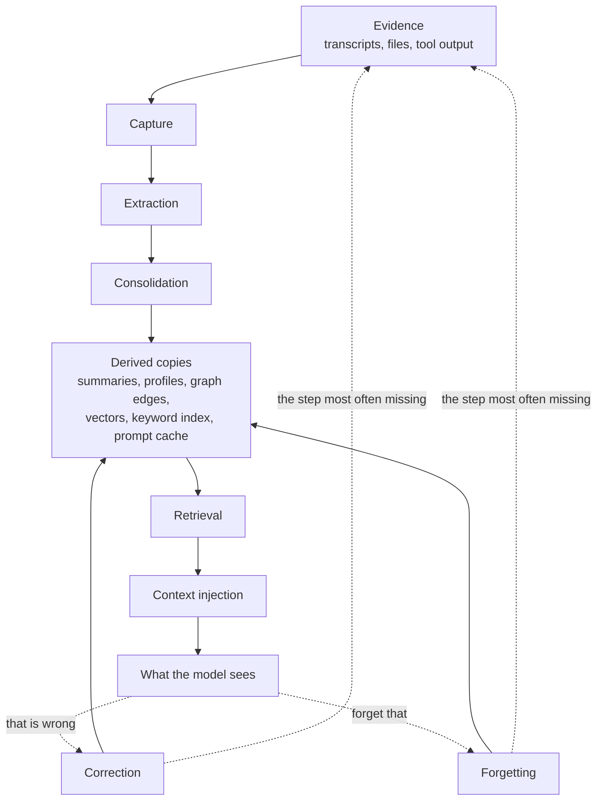
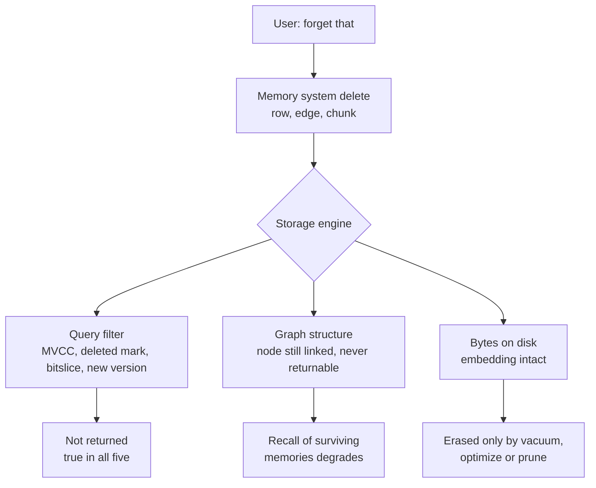

## In Short

PLACEHOLDER_TOTAL_COUNT memory systems with publicly readable source, each read at a pinned commit
and judged against seven mechanisms with strict definitions. "Readable" is not
"open source" — seventeen carry a non-open-source licence, listed in the
[appendix](../appendix/#what-the-licences-actually-say).

**What counts as one.** A system is in scope when it keeps something across
sessions that could later turn out to be *false* — a claim about a person, a
project, a codebase, a world — and gives that thing an identity a correction can
name. Persistence alone decides nothing: a conversation window, a KV cache, a
document index and a task queue all survive the session, and none of them holds
anything a later reading could contradict. The cases that sit closest to the line
are worked through in [what is not in scope](../families/#not-in-scope-the-kv-cache) and the
sections after it.

Five findings, with the counts they rest on:

1. **Correction is the phase that goes unbuilt.** PLACEHOLDER_PATTERN_TOMBSTONE_COUNT systems of PLACEHOLDER_TOTAL_COUNT carry a rejected-value tombstone — a record keyed on the *value*, so a later
   extraction cannot silently re-assert something already judged wrong. Almost
   everything else corrects by hiding a row, which stops a reader seeing it and
   does not stop a writer recreating it.
2. **Deletion claims stop at the storage engine.** Every `update/delete` entry
   in the [matrix](../compare/) describes what a system's own code does. On four of the five vector
   engines this corpus depends on, the embedding survives the delete until a
   background pass no memory system here controls — and on the one that compacts
   on a ten-second timer, that pass moves delete markers without removing a
   single vector. See
   [the layer below delete](#the-layer-below-delete-what-the-storage-engine-does-with-the-vector).
3. **Scope is the most implemented mechanism and the shallowest.**
   PLACEHOLDER_PATTERN_SCOPE_ENFORCED_COUNT of PLACEHOLDER_TOTAL_COUNT apply a scope key as a filter on the read path. It is also
   the mark most often satisfied by a single predicate that a background job
   then ignores.
4. **Negative evidence is almost never tested.** PLACEHOLDER_PATTERN_NEGATIVE_EVAL_COUNT of PLACEHOLDER_TOTAL_COUNT commit a case
   asserting that particular material must *not* appear — the assertion every
   scope, deletion and correction claim ultimately rests on. The mark spans two
   strengths and does not distinguish them: some suites assert the exclusion on a
   **read path**, and the rest keep material out of a projection, a preamble, a
   summarization or a write, which is a different and weaker thing. Read the
   count as a ceiling on the strict reading rather than as its total.
5. **Trust is usually a number, not a state.** PLACEHOLDER_PATTERN_TRUST_STATE_COUNT of PLACEHOLDER_TOTAL_COUNT record a discrete
   epistemic status. The rest store a confidence float, which cannot express
   *rejected* and so cannot survive being wrong.

**A survey of the literature reached the same shape independently.**
*Always-On Agents* ([arXiv:2606.30306](https://arxiv.org/abs/2606.30306),
29 June 2026) codes 435 works against a ten-stage lifecycle and finds the field
concentrated on the accumulating end: retrieve appears in 269 of 441 and write in
200, while audit falls to 88, forget to 66 and rollback to 27 — and it reports
inter-coder agreement (0.82 on lifecycle stages, 0.74 on state axes over a blind
236-work sample), which is a number this atlas does not have for its own marks.
Two research programmes with different methods, one reading code and one coding
papers, put the gap in the same place. That is corroboration rather than
originality on either side, and it is worth stating plainly here rather than
leaving a reader to find it. Where the two differ is more useful than where they
agree: its six state axes include **authority** (who licenses this record to
influence an action) and **recoverability**, and this atlas has no mark for
either — see [the rubric's open work](../methodology/atlas-rubric/#open-work-on-this-rubric).
Its evaluation protocol, and the pilot in which the actual `mem0ai` package
satisfies 3 of 15 governance obligations, is read against this atlas's own
demands on the [benchmarks page](../benchmarks/#aoep).

**A second survey names the axis this rubric is missing.** *The Architecture of
Multi-Agent Systems* ([Code Pointer](https://codepointer.dev/p/the-architecture-of-multi-agent-systems),
Yongkyun, 19 August 2026) decomposes multi-agent coordination into four planes —
control, communication, state, and verification — and reads implementations
rather than papers, which makes it checkable against this corpus in a way a
literature survey is not: nine of the fifteen systems it works through
([Letta](../systems/letta/), [Buzz](../systems/buzz/),
[Prime Agent](../systems/prime-agent/), [OpenCode](../systems/opencode/),
[CrewAI](../systems/crewai/), [AutoGen](../systems/autogen/),
[LangGraph](../systems/langgraph/), [Agent Framework](../systems/agent-framework/),
[Hermes Agent](../systems/hermes-agent/)) carry reports here. It is a blog
survey and not a coded corpus, so it is weaker evidence than the study above;
the overlap is what makes it worth citing.

Where it agrees, it agrees on ground this report argues at length:
that a verifier has to be able to disagree on grounds the workers cannot
manufacture by agreeing with each other, which is the same objection as
[retrieval certifying its own outputs](#retrieval-certifying-its-own-outputs)
and the reason finding 4 above treats a negative assertion as the load-bearing
one.

Where it goes past this rubric is its **state plane**, and the gap is real. Its
question is not what a memory holds or who may read it, but **who currently holds
the right to change it** — claims, leases, atomic transitions, conditional
updates that refuse a second claimant. None of the seven marks measures that.
`scope_enforced` certifies a key on the read path and says nothing about
concurrent writers, and the atlas has walked past the question repeatedly while
recording its answers: [TrueForge](../systems/trueforge/) fences every
turn-scoped write on the turn still being `running` and takes `BEGIN IMMEDIATE`;
[lossless-context-mcp](../systems/lossless-context-mcp/) has no locking anywhere
and does not need it, because content-addressed idempotent blobs and one
append-only event file per writer remove the contention rather than guarding it;
and [fx](../systems/fx/) contains both answers at once — lock files with a
two-second deadline and a two-phase commit for its session log, and
read-modify-write over a whole file with no lock for the memories a user asked
it to keep, until that tool was removed on 31 August 2026. Three designs, three different theories of who owns a write, and no
column in the matrix that would let a reader find them. That belongs in
[the rubric's open work](../methodology/atlas-rubric/#open-work-on-this-rubric)
beside authority and recoverability.

**Start here:** [find a system](../compare/) in the matrix ·
[filter by mechanism](../capabilities/) on the capability index ·
[read one verdict](../verdicts/) per system ·
[how this was researched](../methodology/atlas-rubric/), including what a mark
means and what "not found" does not mean.

## Reading This Report

**Looking for the table?** It is the [comparative
matrix](../compare/), on a page of its own — every system as a row, with eleven columns
covering memory unit, storage, retrieval, write, update/delete, scoping,
integration, background work and trust model. The
[capability index](../capabilities/) is the same corpus filtered by mechanism,
and the [A–Z](../a-z/) is every report by slug. The [system
families](../families/) group the corpus by architectural commitment and draw
the boundaries of what counts as memory, and the [appendix](../appendix/) holds
every pinned commit, the licences and the known limitations. This page is the
argument that sits behind them; the tables are generated from the same
frontmatter the reports carry, so they cannot drift from what the atlas holds.

**What is in the atlas.** A system qualifies if something it stores **survives
the session with an identity that can later be corrected**. That single test
does the work: it admits a 300-line Markdown file with stable entry IDs and
excludes a sophisticated chat-buffer compactor, however good the compaction is.
Systems reviewed and excluded on this basis, or on licence grounds, are named in
the [known limitations](../appendix/#known-limitations) rather than quietly dropped — the exclusions are part
of the evidence.

**And one deliberate exception, where the corpus breaks its own rule.** A
handful of systems here store something durable with
*no* identity at all — [AutoGen](../systems/autogen/)'s `MemoryContent` has no
id field, so `clear()` is the only removal the protocol can express, and
[Sovereign](../systems/sovereign/)'s episodes carry none either. Under the test
as written they do not qualify. They are in because **a memory interface an
ecosystem builds against is evidence about the field even when — especially
when — its contract cannot express a correction**, and the same argument admits
[Google ADK](../systems/adk-python/), whose contract has no delete, no update
and no expiry. Excluding them would remove the clearest cases of the gap this
atlas exists to describe. The rule is therefore: *durable with a correctable
identity*, **or** *a memory contract widely built against, admitted precisely
because it lacks one*. That is an editorial judgement and it is stated here
rather than left to be discovered by reading four reports against the rule.

**Why the two counts differ.** The atlas holds **PLACEHOLDER_TOTAL_COUNT reports across PLACEHOLDER_REPOSITORY_COUNT repositories**: `NousResearch/hermes-agent` carries two distinct memory systems
and is reviewed twice, as [Hermes Agent](../systems/hermes-agent/) and
[Holographic](../systems/holographic/). It is the only repository reviewed twice,
so the gap between a count of *systems* and a count of *repositories* is one, and
it is that one.

**How systems were selected.** Opportunistically: repositories encountered,
suggested, or found while looking for the ones already here. This is not a
sample of a population and no sampling frame is claimed. It skews toward
actively developed public repositories, toward things adjacent to coding
agents, and toward whatever was visible in mid-2026. Absence from this atlas is
not evidence of anything.

**What an absence claim means.** "There is no trust state", "no tombstone was
found", "no benchmark exists" all mean the same thing: *not found in the
inspected code at the pinned commit*. The default method is static
review: code read at a pinned commit, not run. Where a suite *was* executed the
report says so in the first person and names what passed — CLIO's
`test_ltm_corroboration.pl` (92 assertions) and Aura's `tests/test_audit_chain.py`
(16 tests) are the current cases — and where it was not, the report says that
too rather than leaving the reader to guess. **A report that does not claim a run
did not do one.** The reports are opinionated by design. Where the code is
partly closed, or a capability is documented but managed-platform-only, the
reports say so at that point rather than hedging every sentence.

**What this method structurally cannot reach, and what that costs.** Every claim
here rests on reading code at a commit, so a system with no inspectable code is
not merely absent from this atlas — it is *unreachable by it*. That excludes the
memory features most users have actually met: OpenAI's memory, Claude's memory and
project knowledge, Zep's hosted service, Google's Vertex Memory Bank as a service,
and every enterprise offering whose multi-tenancy, retention and audit behaviour
lives on someone else's servers.

This is a real limitation and not a small one, because those are the systems
operating under compliance, scale and tenancy constraints that the local-first
projects here never face. Where a hosted product has an open component, the open
component is what gets reviewed and the report says so: Zep is here as
[Graphiti](../systems/graphiti/), and Vertex Memory Bank appears inside
[adk-python](../systems/adk-python/) as a client whose contract has no delete.
That is genuinely less than reviewing the service, and the difference should be
read as a gap in the atlas rather than a finding about the products.

Two consequences worth stating plainly. The atlas's headline counts — PLACEHOLDER_PATTERN_TOMBSTONE_COUNT tombstones, PLACEHOLDER_PATTERN_NEGATIVE_EVAL_COUNT negative-eval suites — are counts *over inspectable code*, and a
closed system could hold any of these mechanisms without this method ever
knowing. And a mechanism's absence here is weaker evidence about the field than
its presence: finding a tombstone proves someone built one, while not finding one
proves only that nobody built one *in public*.

**The divergences that actually separate these systems.** If you read nothing
else:

1. **Whether correction is possible at all.** Almost everything can overwrite
   or supersede. PLACEHOLDER_PATTERN_TOMBSTONE_COUNT of PLACEHOLDER_TOTAL_COUNT systems carry a rejected-value tombstone — a record that extraction cannot bring back what was
   refused. This is the widest
   gap this atlas has found, and it is invisible on every benchmark. *Widest
   gap found*, not widest gap in the field: the corpus is opportunistic, so a
   ratio over it describes what has been read and cannot be quoted as
   prevalence — and four of the five strongest implementations
   [arrived through this atlas's own orbit](https://github.com/neoneye/agent-memory-atlas/blob/main/notes/2026-08-07-the-strong-form-tombstone-subset.md),
   which is the opposite of an independent measurement.
2. **Whether evidence outlives its derivations.** Systems that keep the raw
   event and treat summaries, profiles, and graphs as rebuildable projections
   can repair a bad extraction. Systems that discard the source cannot.
3. **Whether scope is identity or decoration.** Three levels, and the atlas's
   `scope_enforced` mark only certifies the middle one. A scope *tag* stored
   beside the memory is a hope. A scope *key applied as a filter on the read
   path* is what PLACEHOLDER_PATTERN_SCOPE_ENFORCED_COUNT of PLACEHOLDER_TOTAL_COUNT systems here have, and is what the mark means. A scope
   *boundary* — authenticated identity, grants, and a filter that a caller cannot
   widen by passing a different argument — is rarer than the count suggests, and
   in a single-user desktop deployment is not even the right goal. Read the
   column as "the key reaches the query", not as "this is multi-tenant safe".
4. **Whether retrieval can decline.** Most systems always return their top *k*.
   Very few can decide that this turn needs no memory, and irrelevant memory in
   a prompt is not inert — it bends the answer.
5. **Who decides.** Fully automatic memory, memory a person can review before it
   takes effect, and memory a person authors are three different products with
   three different failure modes.

Everything below is evidence for those five, in more detail than most readers
need. The [capability index](../capabilities/) — every system against all seven
marks, filterable — is the fastest way in.

## 3. End-to-End Memory Lifecycle Comparison

The eight subsections below are one path walked twice. The first six stages run
in one direction and are where almost every system in this atlas spends its
design effort; the last two run backwards through everything the first six
produced, and are where the same systems get thin. The reason is structural
rather than a matter of care: capture creates one row, while consolidation and
indexing create copies of it that no longer look like it, and a correction is
only finished when it has reached every one of them.

The dotted edge back to evidence is the one worth checking in your own system.
If the transcript that produced a belief is retained and the extractor is ever
re-run over it, a correction that stopped at the belief row is a correction with
an expiry date — the next background pass rediscovers the original claim and
writes it as new. Deleting the row does not help, because the new write is a
different row saying the same wrong thing. That is the failure the
[rejected-value tombstone](../patterns/rejected-value-tombstone/) pattern exists
for, and the reason the *Correction* and *Forgetting* subsections below are
longer and more negative than the six above them.

### Capture

`mem0`, `letta`, `langmem`, and `supermemory` expose direct tool/SDK surfaces for adding memory. `cognee` supports both explicit permanent writes and a session-hot capture path through `remember`. `claude-mem` writes hook events to a durable queue before invoking its observer. `a-mem` accepts direct Python note writes but runs LLM evolution before the new note is durable. `hindsight` retains documents/chunks before extracting facts. `graphiti` stores episodes before deriving entities and temporal relationships. `mastra-observational-memory` persists messages before compressing covered ranges. `memos` routes items into configured memory cubes. `basic-memory` accepts Markdown writes from MCP/API or human file edits and reconciles indexes. `rainbox` captures through explicit memory commands, assistant memory actions, and review UI mutations. `engram` captures via MCP tools and can also store prompt/session metadata. `mempalace` captures by mining files/conversations and by MCP drawer writes, preserving verbatim text. `swafra` captures titled text via one MCP tool, then stores chunks in local JSON — or in SQLite once a corpus passes five thousand chunks. `llm-wiki-memory` combines explicit MCP/CLI writes with lifecycle hooks. `honcho` captures messages as the primary event stream, then derives observations. `verel` routes captured percepts through a trust gate. `agentmemory` combines cheap hook capture with explicit `mem::remember`; compression is optional. `tencentdb-agent-memory` records raw conversation evidence, then extracts higher layers from successful turns. `redis-agent-memory-server` writes messages into TTL-scoped working memory first and defers extraction behind a debounce. `hermes-agent` captures curated memory only through explicit tool calls, because a hard character budget makes automatic capture self-defeating. `openclaw` and `holographic` both capture without a model — OpenClaw after sanitizing its own message envelope, Holographic by regex over user turns when auto-extraction is enabled. OpenClaw keeps the model out of consolidation too: no dreaming file calls one, so what graduates into durable memory is decided by a keyword scorer.

Two systems in the Hermes/OpenClaw ecosystem independently guard against the same subtle failure: **the harness's own scaffolding becoming memory.** OpenClaw devotes 567 lines to stripping media notes, context markers, reply headers, and sender prefixes before capture, with a `looksLikeEnvelopeSludge` gate rejecting what remains. Holographic had to exclude its host's compaction handoff summaries, which were being injected as `role="user"` messages, matched its decision-extraction patterns, and were stored as durable facts on every context rollover. Any system with automatic capture should test explicitly that its own generated text cannot re-enter as evidence.

`helm` is the third instance, and the only one where the scaffolding entering memory was the *memory layer's own audit trail*. Every supersession writes a `fact superseded: <kind>/<key>` row into the same episode table that its word-frequency distiller reads from, so the distiller began minting `learned` facts about supersession, ticks and smoke tests. The fix is visible in three places at once and worth reading together: a twenty-word extension to the distiller's stop list containing `supersed`, `episode`, `tick`, `think`, `memory` and `smoke`; two smoke tests asserting that a `__smoke`-keyed supersede emits zero episodes and that four rapid supersedes of one key collapse to one row; and a changelog entry naming the cleanup — 42 smoke episodes, 85 duplicate supersedes and 24 polluted `learned` rows deleted. The general rule: if you log mutations into the store you consolidate from, tag them at the source, because a stop list is how you find out you did not.

`daimon` captures nothing during a session and everything at the end of one: a `SessionEnd` hook spawns a **detached** child that serializes the whole transcript into a single checkpoint, so the agent never blocks on capture and there is no incremental write path at all. It is also the clearest instance of *referencing* evidence rather than storing it — the checkpoint carries a `transcript_hash` and per-item source message ids pointing into the host's own transcript file, which daimon never copies. That keeps the store tiny and the provenance real, at the cost of a provenance chain that breaks the moment the host rotates its transcripts.

The important split is whether the captured item is itself memory or evidence for memory. Cognee, Claude-Mem, Honcho, Verel, MemPalace, Graphiti, Hindsight, Basic Memory, Mastra, Swafra, RainBox, agentmemory, and TencentDB Agent Memory are evidence-aware in different ways: Cognee retains source data below graph/vector projections; Claude-Mem queues hook material before generated observations; Graphiti keeps episodes behind edges; Hindsight links observations to source facts; Basic Memory keeps canonical notes behind projections; Mastra records exact message ranges behind summaries; agentmemory links memories to observations; and TencentDB preserves L0 messages and offloaded raw tool output. `mirix` belongs on the evidence-aware side by an unusually cheap route: a `raw_memory` table holding the unprocessed context string, embedded and searchable in its own right, sitting beside six typed derived tables. One table is the whole mechanism, which makes it the easiest instance in the atlas to copy.

`memobase` is the deliberate counterexample, and it is worth stating without disapproval. Its `persistent_chat_blobs` config defaults to `False`, so the source transcript is hard-deleted from Postgres once the buffer flushes and the profile is written. For a service holding other people's conversations that is a *good* privacy default and several systems here would be better for it — but it also means the profile is a lossy derivation whose source no longer exists, so a bad extraction is permanent. Evidence retention and data minimization pull in opposite directions, and Memobase is the clearest place in the atlas to see the price of each.

These designs still differ sharply in trust: provenance supports correction, but only Verel and RainBox model rejection/promotion explicitly.

### Extraction

`mem0` has the clearest open implementation of LLM extraction: retrieve nearby existing memories, ask the model for additive facts, parse JSON, dedupe, embed, insert, and link entities.

`langmem` delegates extraction to Trustcall and schemas. This is elegant if the application already knows what shape memory should have.

`honcho` formats timestamped session messages and derives representations/observations asynchronously.

`verel` extracts candidate memories but restricts promotion. It is deliberately suspicious of raw extracted claims.

`supermemory` exposes document/chunk/memory schemas, but the extraction engine behind hosted endpoints is not present in this checkout.

`mempalace` mostly avoids extraction for primary memory. It may build closets, entities, halls, and KG triples, but the authoritative memory remains verbatim drawer text.

`swafra` also avoids LLM extraction. Regexes annotate entities, date strings, and preference phrases; conversations get a synthetic facts chunk that acts as a retrieval index while exchange text remains stored. Its Leiden partition uses embedding similarity plus positional weight, despite docs also claiming entity-weighted partitioning.

`rainbox` does not center on automatic extraction in the inspected paths. Explicit user commands and assistant actions create/update claims; evidence rows record whether a claim was user-confirmed, model-inferred, imported, or observed.

`llm-wiki-memory` automatically distills coding transcripts into schema-constrained atoms with chunked map/reduce, stores them in dated daily leaves, then compiles them into durable knowledge or lessons. Compile retrieves same-type/facet candidates and asks an LLM for create/update/skip, except same-error-pattern lessons are force-updated deterministically. This path is recoverable and well tested, but promoted atoms become active without a verification gate.

`hindsight` extracts world/experience facts, entities, temporal spans, and causal links from durable source material. `graphiti` extracts entities and typed relationships from an episode, then resolves them against existing graph identity. `memos` ranges from simple key/value/tag extraction to tree-memory readers. `basic-memory` usually avoids LLM extraction: observations and relations are explicit Markdown syntax. `mastra-observational-memory` extracts chronological summaries rather than atomic facts.

`agentmemory` defaults to synthetic compression on the hot path and makes LLM
compression/consolidation optional. `tencentdb-agent-memory` uses an LLM to
extract L1 records, then another judgment step chooses store, update, merge, or
skip; failures store all candidates rather than losing them.

`redis-agent-memory-server` is the clearest example of extraction policy as a
plugin point: `BaseMemoryStrategy` has discrete-fact, summary, user-preference,
and fully custom implementations, so what counts as a memory is configuration.
Because the custom strategy accepts an operator-supplied prompt, it also ships a
`PromptValidator` that screens those prompts for injection — an unusual threat
model in which the deployment's own configuration is the attack surface.
`openviking` extracts into typed memory files whose `stage` field separates
long-term user memory from execution-derived agent memory. `holographic` and
`openclaw` both keep a model out of the write path, by different means.
Holographic stores lightly-processed user text, which fills the store with prose
rather than normalized claims. OpenClaw does select and summarize — but with a
hand-tuned additive scorer over twenty-one English keyword regexes in
`rem-evidence.ts`, so durability is decided by vocabulary rather than by a
model or a person.

`cognee` runs typed task pipelines that chunk documents, extract graph
structures, embed several views, and optionally ground nodes in an ontology.
`claude-mem` asks an observer model for XML observations and summaries, but
replaces its modified-file list with paths deterministically derived from tool
calls. `a-mem` asks an LLM to organize a new note and rewrite nearby metadata;
its `analyze_content()` method has no call site, so ordinary note metadata is
not extracted as the public mental model suggests.

`magic-context` promotes eligible session facts synchronously and defers embedding to a best-effort async pass, so a memory is durable before it is enriched. `pi` captures nothing as memory — its JSONL session tree is conversation history, and every memory plugin builds its own index over it.

`genericagent` states the strictest capture rule in the atlas, as prose rather
than code: its *Action-Verified Only* axiom permits a durable write only when the
information came from a **successful tool call** — a shell command that
succeeded, a read that confirmed content, code that passed — and explicitly
forbids writing the model's inherent knowledge, guesses, unexecuted plans, or
unverified assumptions. Its slogan is "No Execution, No Memory". This is
`voyager`'s environment-verified gate generalized from procedures to facts; the
difference is that Voyager enforces it in the rollout loop while GenericAgent
asks the model to enforce it against itself, and keeps no record of the
justifying call.

`daimon` does the opposite of GenericAgent's self-enforcement: it lets the model
claim whatever it likes and then **checks the claim in code**. The extraction
prompt demands `trust: "verbatim"` plus a copy-pasted quote and the id of the
message it came from; afterwards `verify_quotes` greps the quote against the
rendered transcript and demotes any item that misses, `sanitize_source_ids`
deletes citations the transcript cannot vouch for, and `ground_outcomes`
demotes a verbatim claim that asserts an outcome — merged, deployed, tests green —
without citing a tool result that shows it. Three of the atlas's harder
extraction problems get deterministic answers here, and the module comments are
unusually clear about what is left: *"verbatim matching certifies TRANSCRIPTION,
not truth"*. A related backstop is worth stealing on its own. Because trust
assignment is model-chosen, a "never do X" that the model paraphrases into prose
leaves no quote to verify and can soften undetectably later — so
`pin_imperatives` scans user turns for hard imperatives (must, never, don't,
always, forbidden) with a regex and force-pins any the model skipped, through the
same verification gauntlet. Soft modals are deliberately left to the model. It is
the only place in this atlas where a system defends specifically against
*constraint inversion*.

The research lineage adds two capture disciplines the practical systems mostly lost. `voyager` writes memory **only** when a critic verifies the environment reached the intended state, so a failed attempt produces reasoning input and no durable record — the strongest write gate in the atlas, available because the memory is a procedure. `generative-agents` scores every incoming memory for importance at write time and uses that score to schedule consolidation, rather than capturing indiscriminately and compacting on a timer.

### Consolidation

`honcho`, `hindsight`, `mastra-observational-memory`, and `verel` have the strongest visible consolidation stories. Honcho derives working representations from event streams. Hindsight creates/updates observations with source IDs and proof counts. Mastra reflects growing observation logs and can prepare the result asynchronously before activation. Verel clusters failures, induces candidate design rules and schemas, then requires promotion gates for verification. `agentmemory` separately consolidates important observations into versioned memories and optional semantic/procedural layers. `tencentdb-agent-memory` compiles L1 records into scene files and changed scenes into a persona.

`mem0` V3 is intentionally more append-oriented; consolidation is mostly dedupe and entity linking in the OSS path. `mempalace` consolidates operationally through dedup, closets, halls, tunnels, graph layers, and repair paths rather than by rewriting memories into summaries. `swafra` has no real consolidation worker or correction policy: ingestion adds cross-source edges, and a `superseded_by` loop exists, but old same-source chunks are removed before that loop can see them. `llm-wiki-memory` has a substantial opt-in, brain-only pipeline: per-leaf similarity clusters, hash/lesson-key/cosine dedup, optional LLM merge, deterministic staleness flags, optional LLM refresh, orphan archive, archived-body compression, cache pruning, and index rebuild. `rainbox` consolidates through claim supersession, rejection, expiry, profile selection, and eval/feedback loops rather than through background summarization. `letta` separates core and archival memory but does not make consolidation the central visible mechanism in the inspected files. `langmem` provides reflection hooks rather than a fixed consolidation policy. `engram` keeps a pragmatic local model: update topic keys, count duplicates, surface conflicts. `helm` splits the job in two and only one half is real: a weekly LLM pass is *instructed* to turn themes appearing in two or more episodes into durable facts, with no schema and no validator, while a deterministic pass counts word stems and writes any stem seen in three episodes as a fact whose value is literally `mentioned in 3 episodes (last: "…")`. That is term frequency in the vocabulary of learning — no subject, no predicate, no claim — stored at up to 0.9 confidence and injectable like anything else. A distiller that cannot produce a proposition should not be writing into the store the model reads.

**[AuraOS](../systems/auraos/) states the opposite objective from everything
above, in a component nothing calls.** Its distiller instructs the model to
*"Preserve chronology. Preserve evolution of ideas. Preserve contradictions.
Preserve uncertainty. Preserve emotional context. Preserve philosophical
development. Preserve identity continuity."* and then, in capitals, *"Do NOT
flatten the conversation into sterile summaries."* Read against this section, it
is a direct objection: Honcho's working representations, Hindsight's observations,
Mastra's reflections and Verel's induced rules all move toward a compact
present-tense statement of what is true, and each of them discards the disagreement
that produced it. Whether that is a loss depends on what the memory is for — a
scheduling assistant does not need to know that the user changed their mind twice
about a meeting, and a long-running collaborator arguably does. No system here has
made the choice explicitly; this one has, and its output is written to a directory
no read path loads, so the argument is the whole contribution.

`generative-agents` is the origin of the reflection loop that several systems
here descend from, and its trigger is still the most elegant: a countdown seeded
with `importance_trigger_max` is decremented by each new memory's poignancy, so
reflection fires on accumulated significance rather than on elapsed time, token
count, or message count. Compare `mastra-observational-memory`, which triggers on
token thresholds, and `claude-mem`, which triggers on lifecycle hooks — both are
proxies for "enough has happened" that the original measured directly. Its
weakness is that the budget is denominated in one-shot LLM importance judgments,
and its reflections are stored in the same undifferentiated pool as observations,
so reflections of reflections can drift with no visible boundary.

`moltis` adds a fifth instance of a guard that is now unmistakably a general
requirement: it exports session transcripts into its corpus only after
**sanitizing** them, joining `openclaw`'s envelope stripping, `holographic`'s
compaction-summary exclusion, `nanobot`'s internal-session filter, and
`cowagent`'s distillation rules. Any system that both generates text and
captures text will eventually capture its own.

Five systems in the atlas call consolidation **dreaming**, arrived at
independently: `magic-context`'s dreamer subagent, `nanobot`'s Dream pass,
`cowagent`'s Deep Dream, `deepcode`'s `autodream`, and — under a different name
for the same idea — `metaclaw`'s replay. The convergence is not only nominal. All
five run offline
on a schedule, read accumulated raw material, and write back a smaller, more
coherent durable layer; three of them also emit a written record of what the
pass decided (a dream diary, a replay report, a delta-grounded commit). The
metaphor appears to be tracking a real architectural category: consolidation as a
separate, slower, auditable process rather than a step in the write path.

`deepcode`'s is the one that tests the word *auditable*, and it is the most
candid about it. `autodream` is a single agent turn holding the same
`list`/`read`/`write`/`append`/`delete` tool the agent writes notes with, told to
merge duplicates and delete what is stale — over a flat directory of markdown
files with no history, no protected note and no record that a note existed. Its
module docstring states the problem rather than papering over it: *"memory
tidiness has no test oracle, so there is nothing to backpressure on; a
before/after note-count check is the only mechanical signal we keep."* That is
the honest version of a gap the other four share to varying degrees, and it
sharpens what the written record in three of them is actually buying — not a
check, but a description a person could later read. A count is not a check: the
same repository's scheduler treats `notes_after == notes_before` as a clean,
terminal run, which is equally true of a pass that did nothing and a pass that
deleted three notes and wrote three others.

`magic-context` adds a consolidation trigger no other system here uses: its
dreamer subagent fires at threshold pressure **or at git commit boundaries**, on
the reasoning that a commit is the moment a coding agent's work becomes durable
and therefore the right moment to reconcile memory against the repository. The
same run verifies, maps, classifies, promotes primers, and sweeps orphans, under
a lease so two runs cannot overlap.

`redis-agent-memory-server` has the most careful consolidation guard in the
atlas: hash, ID, and semantic dedupe are separate passes, and the semantic path
runs `_semantic_merge_group_is_cohesive` before an LLM is allowed to collapse a
cluster — an explicit test that "similar" really is "same" before merging.
`byterover` approaches the same risk from the document side, diffing existing
against proposed content and counting only what a rewrite would delete.
`hermes-agent` is the outlier: consolidation is neither background nor
automatic, but a synchronous obligation handed to the model when a write would
exceed the character budget.

`daimon` is the one system here that ran the experiment everybody else assumes
the answer to. Its cross-session carry — folding the previous checkpoint's
unresolved items into the new one — was tried as an LLM re-emission and as an
exact copy in code, and the logbook records that re-emission **lost whole items
even from lossless input** while exact copy held perfect fidelity. Carry is
therefore code: copy the item, keep its birth stamp, expire by weight, dedup by
salient-term overlap. The rule it derives from that is sharper than the
measurement: a verbatim item's frozen text and quote *overwrite* a reworded
twin, because a pinned quote that consolidation is allowed to rephrase was never
pinned. Any system whose background pass regenerates existing memories through a
model should run the same A/B before trusting it.

Cognee's `memify`/`improve` pipelines enrich an existing graph, while its
session path bridges hot entries into permanent memory asynchronously.
Claude-Mem compresses batches into observations and session summaries but does
not merge them into a verified long-term belief model. A-MEM's
`consolidate_memories()` is only a reindex pass, not semantic consolidation.

### Retrieval

The repeated successful pattern is hybrid retrieval:

- semantic/vector search where embeddings exist;
- lexical/BM25/FTS for exact terms and identifiers;
- metadata filters for scope;
- reranking or rank fusion when quality matters.

`mem0` combines semantic, keyword, entity boost, and optional rerank. `hindsight` runs semantic, BM25, graph, and temporal arms, then uses task-specific fusion and cross-encoder reranking. `graphiti` searches edges, nodes, episodes, and communities with BM25, cosine, and BFS plus configurable RRF/MMR/cross-encoder recipes. `cognee` exposes lexical chunks, vectors, graph, triplet, summary, temporal, and hybrid modes, but the result contracts differ enough that each route needs separate evaluation. `basic-memory` fuses FTS5/tsvector with optional semantic chunks. `memos` can run vector or graph/BM25/reranker/reasoner pipelines depending on the mounted cube. `honcho` blends semantic, recent, and most-derived observations. `engram` uses FTS5 and topic keys. `mempalace` combines direct drawer vector search, BM25, metadata, closet boosts, neighbor expansion, and fallback paths. `swafra` uses compact but uncalibrated hybrid/graph fusion. `llm-wiki-memory` combines frontmatter prefilters, embeddings or lexical hashes, priority, and locality. `rainbox` hard-filters then blends vector, full-text, and entity signals. `verel` adds trust and confidence into ranking. `agentmemory` fuses BM25, vector, and graph arms with weighted RRF and per-session diversity. `tencentdb-agent-memory` fuses FTS and vector results with RRF or uses native Tencent VectorDB hybrid search. `claude-mem` selects Chroma semantic search for ordinary text queries and reserves metadata/semantic intersection for file lookup. `metaclaw` is the only system that treats its own ranking parameters as
learnable: retrieval mode, injected-unit cap, token budget, and weights live in a
`MemoryPolicyState` that is replayed against past turns and replaced only on
non-regression. `genericagent` has no ranker at all — a ≤30-line index of
"existence pointers" lets the model recognize that knowledge exists and open the
file itself, which is the cheapest retrieval architecture here and fails silently
when a trigger word is missing. `nanobot` likewise has no retrieval: its durable
files are small enough to always inject. `cowagent` pairs vector and FTS5 search
over chunked files while injecting `MEMORY.md` wholesale.

`waku-agent` inverts the question everyone else asks. Rather than ranking
better, it decides per turn whether to retrieve at all, and its stated reason is
not cost but quality: irrelevant memory in the prompt bends the answer. Almost
nothing else in the atlas can abstain. `daimon`'s proactive path is the one
comparable case and it arrives from the opposite direction — not a judgment
about relevance but three cheap lexical gates, each defaulting to silence: an
unknown project, a prompt with fewer than two salient terms, or a candidate
session sharing fewer than two *distinct* terms all return nothing. The comment
explains why the shared-term count is per session rather than per item: a
multi-topic prompt splits its terms across items, and a per-item count silenced
exactly the sessions the feature existed to surface. Abstention by budgeted
noise gates is weaker than abstention by judgment, and it is far cheaper than
either ranking or asking a model.

`loongflow` breaks a different assumption: every other system here ranks
deterministically and takes the top *k*. Its evolutionary memory selects a
remembered solution by **Boltzmann sampling over scores**, at a temperature set
by `_adaptive_temperature_by_diversity` from a sampled measure of how varied the
stored population currently is — blending in 20% of the previous temperature so
the control signal does not oscillate. A converged population gets a higher
temperature and flatter selection, which readmits weaker solutions and restores
variety. This is only defensible because recall there feeds exploration rather
than belief; asked the same question twice it may answer differently, which is
the correct trade for a search loop and the wrong one for facts about a user.

`hipporag` does not rank at all in the usual sense: it seeds a personalization vector from query-linked entities plus a weak dense prior, then reads relevance off a Personalized PageRank diffusion across the whole graph. `generative-agents` established the multi-signal shape everything else refines — normalized recency, relevance, and importance combined in a weighted sum — though the specific weights (`gw = [0.5, 3, 2]`, with two earlier settings left commented out) are hand-tuned with no ablation in the repository, and its recency decays by chronological *position* rather than elapsed time — over a list sorted oldest-first, so the term scores the least recently accessed node highest, bounded by being the smallest of the three weights. `voyager` retrieves top-5 by vector similarity over generated descriptions and returns executable code, with scores computed and then discarded so there is no relevance threshold. `openviking` runs directory-recursive dense plus sparse retrieval with level filters, per-type quotas, optional reranking, and a hotness blend. `redis-agent-memory-server` pairs vector search with a recency reranker using separate half-lives for last access and creation. `holographic` fuses FTS5, Jaccard, and HRR cosine, then multiplies by trust — and silently reweights to lexical-only when NumPy is absent while still reporting itself as available. `openclaw` runs a genuine hybrid — a `sqlite-vec` vector arm and an FTS keyword arm merged with a candidate multiplier and temporal decay — and degrades in both directions, to keyword-only when no embedding provider is available and to vector-only when FTS is not, logging each fall back rather than reporting itself healthy. `a-mem` is vector-only despite hybrid wording. `mastra-observational-memory` is the deliberate exception: its primary path is sequential observations plus a recent raw tail, with semantic observation retrieval optional. `daimon` is the deliberate exception in the other direction: **no embeddings exist anywhere in the codebase**, and its index is disposable by contract — any doubt about the SQLite file resolves to a full rebuild from the JSON, with no incremental upsert path, on the stated principle of "correctness over cleverness". The cost lands exactly where you would expect, and the project measures it rather than asserting it away — see [Evals/Tests](#evalstests).

### Context Injection

`letta` and `mastra-observational-memory` have the deepest runtime prompt integration. Mastra removes observed raw messages, injects active observations as system context, retains a recent tail, and adds a continuation reminder. `claude-mem` automatically renders a project-scoped chronological timeline, showing only a bounded subset of observations in full. `rainbox` injects an operator profile block and hybrid memory context and records what was injected. `verel` has the safest visible recall renderer: recalled memory is token-budgeted and fenced as untrusted data. `mempalace` has a four-layer stack. `basic-memory` builds graph context through MCP while leaving final prompt placement to the client. `agentmemory` assembles pinned items, profiles, lessons, summaries, and observations within a token budget; its smart search separately supports compact-first expansion. `tencentdb-agent-memory` separates dynamic L1 recall from stable scene/persona context and adds navigable short-term offload maps. `cognee`, `graphiti`, `hindsight`, and `memos` return structured recall/context to integrations. `swafra` exposes unbounded `get_context`; `llm-wiki-memory` injects session work context; `supermemory` emits profile text; `engram` has MCP context tools; `honcho` exposes working representations. A-MEM leaves injection entirely to its caller.

`hermes-agent` takes the most distinctive position in this set: curated memory is rendered into the system prompt **once, at session start, as a frozen snapshot**, and mid-session writes deliberately do not update it, so the provider's prefix cache survives the whole session. That choice is economic rather than epistemic, but it drives a real safety decision — because a poisoned entry would persist for the entire session and beyond, Hermes scans memory content against its broadest threat-pattern set at *write* time. This is the mirror image of Verel's and RainBox's read-time fencing, and the trade is instructive: write-time filtering is cheaper and cache-friendly but is a denylist, while read-time fencing costs tokens every turn and does not depend on pattern coverage. `holographic` does neither, injecting its top five stored facts into the prompt unfenced. `helm` is worse than unfenced: its eight recalled facts are prefixed *"MEMORY — use these, never contradict them"*, and the format is `- (kind) key: value` with the confidence, evidence count and source all dropped — so a preference the background loop guessed once from a transcript at 0.7 and a fact the owner stated outright arrive as the same kind of sentence, under an instruction not to argue with either. It also runs both injection channels at once: a generated `INDEX.md` imported through `CLAUDE.md` (stable between background ticks, and the only place a confidence figure survives) plus a per-turn recall block appended to the system prompt, which means the system-prompt prefix differs on every turn and the prefix cache is invalidated by construction. Hermes pays tokens to keep the prefix frozen; Helm gives the prefix up for free, and the cheaper arrangement — stable index in the prefix, query-specific hits in the user turn — is one line away.

`daimon` shares Hermes's session-start-snapshot shape but makes the artifact the
product: a "while you were away" briefing ordered by *what to verify first*,
each line tagged `✓ verbatim` or `~ inferred`, capped at 3,000 estimated tokens.
Two details generalize past the format. First, budget pressure is spent in the
right order — long *inferred* items are truncated in place before anything is
dropped, and verbatim text is never rewritten to fit, only dropped whole and
announced, because a guarantee that survives until the context gets tight is not
a guarantee. Second, the optional LLM re-render is **post-validated**: every
verbatim quote must survive the generated prose intact (whitespace-normalized),
and any loss falls back to the deterministic render. That is the
[structural-loss guard](#structural-loss-guard-on-generated-rewrites) applied to
context assembly rather than to consolidation, and it is the cheapest way to let
a model prettify memory without letting it edit it.

`csm` is the one that instruments the assembly itself. Its re-entry block is
eight named layers under a **2,100-character** ceiling with per-layer budgets
and two layers marked never-trim, which is already stricter than most; the
contribution is that every candidate item is written to
`context_injection_items` with its position, selection score, a disposition of
`injected | trimmed | omitted`, and a reason code — `budget_trim`,
`layer_budget_exhausted`, `filter_rejection`, `empty_source` — beside an event
row carrying a `builder_version` and a `config_hash`. When a reader asks why the
agent did not know something, every other system in this section can offer the
block that was injected; this one can name the item that lost, the layer whose
budget it lost to, and the builder version that made the call. Set against that,
CSM sits at the Helm end of the cache question and further: **twelve** injection
stages run inside the host's system-prompt transform on every request, so the
prefix differs each turn by construction. The block is small enough that the
tokens do not matter; the cache miss it forces every turn is the cost, and
nothing in the repository measures it.

### Correction

This is where systems diverge sharply.

`verel` and `rainbox` have the strongest visible epistemic correction semantics in this set. `verel` has explicit trust states and rejected tombstones. `rainbox` has governed atomic correction, conflict detection, and tombstones that prevent model-write laundering. `engram` has conflict candidates and judgment tools. `mempalace`, `llm-wiki-memory`, `letta`, `mem0`, `honcho`, `supermemory`, and `langmem` expose increasingly operational forms of update/supersession without the same trust model.

`helm` has the shape of temporal correction and none of the temporality: a rewrite of an existing `(kind, key)` stamps `expired_at` on the old row, inserts the new one, and `history <key>` returns the chain — but `valid_from` is only ever written as the insert timestamp, so validity time is record time under a different name, and no caller can say "this became true in March". The instructive part is what the soft delete costs. Active rows are defined by the predicate `expired_at IS NULL`, enforced by a *partial* unique index that constrains writes and leaves every `SELECT` to remember the filter itself — and three readers do not. The agent's own autonomy setting is read back without it and therefore returns the stale pre-supersession value; the distiller's lookup can write onto a dead row; the dedupe pass can delete superseded history and sum retracted evidence onto the survivor. Any system that expresses correction as a nullable column needs a view or an accessor, because "remember the predicate" is not an invariant.

`csm` is the cleanest demonstration of that sentence in the atlas, because it
fails the test on the main path rather than in three stragglers. Its correction
machinery is careful — an exact-content merge that sets `superseded_by` and
appends a row to a `memory_merges` audit table, and an archive pass that stamps
`archived_at`, a reason, a batch id and a note, with a documented un-archive
that sets them all back to NULL. Then the retrieval WHERE-clause builder that
serves vector, full-text and entity search composes project, type, tag and
importance predicates and mentions **neither column**, and neither do the two
fallback paths. The re-entry compiler does filter `archived_at IS NULL`, so the
same store answers differently depending on which door you knock on, and the
governance report — which does read both columns — will describe a store as
cleanly deduplicated while `csm_memory_search` keeps returning the duplicates.
Two predicates at three query sites separate the design from its behaviour, and
no test asserts the difference.

**`breadcrumbs` is the system that ships that test**, and it is the one that
treats the *injection lane* — the ranked, capped packet a session receives
before it asks anything — as the place a correction has to arrive. Verel and
Lethe assert a corrected value stays out of a query result; this asserts it
stays out of the boot packet, where an entry can be missed by losing a tie-break
rather than by failing a filter.
Its `obsoleted_by` supersession is ordinary — a newer JSONL line names the older
one, and the schema doc tells adopters their boot matcher *should* exclude a
superseded entry from current knowledge. What is not ordinary is
`run_forbidden_check()` in `templates/ledger-tools/retrieval_exam.py`, which
replays the matcher against simulated session-start conditions and names any
superseded entry that still wins an injection slot, probe and all, with
`--fail-on-forbidden` turning a hit into a red exit. The docstring is the
argument: *"Correction that stops at the ledger row and never reaches the
retrieval lane is not correction; the descent has to complete."* Two details
make it more than a slogan. When every superseded entry is unreachable the check
reports `unexercised` rather than clean, because a lane that never had the
chance to make the mistake proves nothing — which is more than Helm's and CSM's
suites attempt on that path at all. And it keys on the supersession *marker* rather than the
value, pinned by a committed revert-chain case where a value flips A → B → A and
the final entry restating A must win retrieval legitimately. That reasoning is
right for a hand-authored ledger and is exactly why it is not a rejected-value
tombstone: a re-mining pass writing a fresh line for a fact somebody already
retired walks past every `obsoleted_by` in the file, and the same repository's
schema doc records one backfill that *"swamped the session-verified entries and
wrecked lookup precision"*.

Graphiti closes a fact's validity interval and retains history, which is the strongest temporal correction model here, but it does not mark claims verified/rejected. Hindsight rewrites or merges observations while retaining source/history fields. Basic Memory makes correction a human-readable file edit followed by transactional reindexing. Mastra replaces only the observation range covered by a reflection. MemOS correction varies by module and therefore lacks one consistent semantic contract.

`agno` is the corpus's one *judged* supersession. Where `agentmemory` compares
strings and `helm` compares keys, Agno asks a model whether a new fact and an
existing one can both be true, and acts only on a verdict above a configurable
threshold — keeping both facts when the answer is weak, so the default failure
is a contradictory store rather than a destroyed value. `retire_fact` stamps
`superseded_at` and `superseded_by`, where the latter holds the replacement's
id, or the literal `"forgotten"`, or `"superseded"` when several new facts
jointly displaced one, and `live_facts()` filters retired rows out of everything
that renders. It is record-keyed like every supersession here, so re-extraction
walks past it, and it is undermined from an unexpected direction: the older of
Agno's two memory subsystems exposes `optimize_memories`, which summarises every
memory a user has into one paragraph and then calls `clear_user_memories`
before writing it back, with `apply=True` as the default. One subsystem takes
care to keep a replaced value; the other has an HTTP route that discards all of
them and reports the token saving.

`omi` shows the gap at its most consequential. Its correction vocabulary is the
richest here — nine typed ledger mutations including `supersede_fact` with a
validity interval, `retract_fact` with a reason, and `tombstone_evidence` that
withdraws one supporting source without discarding the claim — and every one of
them is keyed on an id. The product retains the transcript by design, so a fact a
user rejected in review can be re-derived by the next extraction pass over the
same audio and re-enter as a fresh candidate. A capture device is the setting
where record-keyed correction fails fastest, because the source material does not
go away and the same sentence gets said again.

`mnemosyne` is the corpus's one *unintentional* refusal, and it is worth reading
beside `agno` because the mechanism is the same shape with one clause missing.
Both mark a loser with `superseded_by` and filter it out of reads. Agno's is
record-keyed, so re-extraction walks past it. Mnemosyne's `consolidated_facts`
row is keyed on a SHA-256 of the subject, predicate and object, and the dedup
lookup that runs before every fact write matches on those three columns *without*
excluding superseded rows — so a re-extracted rejected value lands on the dead
row, raises its confidence, and stays dead. Nothing clears the column. The
distance between supersession and a tombstone here is an absent
`AND superseded_by IS NULL`, no comment claims it, and no test holds it in
place.

`agentmemory` versions similar memories, but the Jaccard threshold can silently
supersede a conflict without an explicit judgment. `tencentdb-agent-memory`
offers internal merge/delete paths and editable generated files, but no
first-class agent/user correction or forget operation.

`magic-context` introduces a correction mechanism the atlas has not seen before:
memories are **re-verified against the artifacts they describe**. Each memory is
mapped to backing files and carries its own `verified_at`; when git reports a
committed change, an uncommitted edit, or a deletion touching a mapped file since
that memory's last verification, the memory re-enters verify scope. Lifecycle
state (`active|permanent|archived`) and verification state
(`unverified|verified|stale|flagged`) are separate columns, which is the split
Verel argues for and most systems collapse. The design is also explicit about its
own limits: file-independent memories are excluded from verification entirely and
handed to curation and age decay, because they "describe external behavior and
cannot be checked against local code". Its remaining gap is the familiar one —
supersession without a rejected-value tombstone, so an archived memory can be
re-derived from retained history.

`daimon` is the second implementation of that re-verification idea and extends
it in two directions. Downward, into code: `daimon anchor <file> <symbol>` pins
an item to a Python symbol, fingerprinted as a SHA-256 of `ast.dump` of the
definition node, so the anchor is stable under reformatting and comment edits
and moves only on a structural change — and drift is reported in the next
briefing. Outward, into the world: an opt-in `worldcheck` pass spot-checks a carried claim
against whatever it names — a ticket state, a source path, a branch, a pinned
dependency — under one sub-second aggregate budget and one probe cap, skipping
silently on any failure so a briefing can never block on a slow check. Only the
ticket class leaves the machine; the other three are answered from disk, which
is what lets the pass work in a project with no remote at all.

Two refusals define its edges, and both are the same rule: **when a probe might
answer about a different subject, skip rather than answer.** A reference that
could name another repository is not probed, and a path resolving outside the
project root is not probed, because in each case the reply would describe someone
else's checkout. A verification that can be wrong about *which thing it checked*
is worse than no verification, and this is the only system here that says so in
code.

Three of its correction decisions generalize. A machine-detected supersession is
written as `supersede-candidate:<new-id>` and is **live by construction** — a
guess may annotate a briefing with a confirm/reject command but may never
suppress anything, and the liveness rule enforces that rather than trusting
callers to remember it. Re-opening a resolved item requires *evidence*: either
the item's code anchor still checks out live, or an explicit `--evidence`
string, on the reasoning that re-stamping without one would mark an unchecked
claim verified. And staleness is measured honestly — a carried item restated by
a fresh checkpoint is not corroborated, because both statements descend from the
same original extraction, so effective age runs from the last time code or a
human actually checked it.

The six systems added from the Hermes/OpenClaw ecosystem are uniformly weak
here, and usefully so: none of `holographic`, `hermes-agent`, `openviking`,
`redis-agent-memory-server`, `byterover`, or `openclaw` has a rejected-value
tombstone, so in every one of them a corrected or deleted memory can be
re-derived from retained material with nothing to stop it. `openclaw` is the
closest miss and shows exactly what the mark asks for: its
`memory_session_tombstones` table is durable and carries a written `reason`, and
the consolidation sweep consults it so a forgotten session is never re-ingested
— but it is keyed on `session_id`, so the same claim arriving in a different
conversation is new information again. `byterover` is the
partial exception in an unexpected place — its `detectStructuralLoss` /
`resolveStructuralLoss` pair is the only mechanism in the atlas that guards a
*rewrite* rather than a claim, counting exactly what an LLM curation pass would
delete and merging the loss back in. `holographic` inverts the usual failure:
its `contradict` action surfaces contradictions as an ordinary query, but only
reports them, with no supersession or review workflow attached, and its docstring
claim that "no other memory system does this" is not accurate within this atlas.

A specification for measuring any of this — the shapes a contradiction can take, and the four things worth scoring separately — is in [the contradiction test](../benchmarks/#contradiction-test).

**Memanto closes the loop the rest of this section leaves open.** Every other
contradiction mechanism here detects and stops — Gini's `conflicted` status,
MateClaw's `ContradictionDetector`, Holographic's `contradict` query, all of them
produce a flag and no disposition. Memanto's scheduled pass writes a dated JSON
report typed as `contradiction | update | duplicate | conflict`, and a human
resolves each entry through the CLI or web UI with one of five actions. Two are
absent everywhere else: **`keep_both`**, which says the disagreement is not a
contradiction — the right answer whenever two memories differ because they cover
different times or scopes — and **`manual`**, where a person writes the
reconciling content, enforced by a validator that refuses the action without it.
The model's `recommendation` vocabulary is deliberately narrower than the
operator's action set, so the proposal does not bound the decision. What it still
lacks is the tombstone: `remove_both` deletes, and the next night's extraction is
free to bring the content back.

`memora` contributes the one procedural idea this section has been missing. Its
supersession pass runs in three phases — candidate pairs by embedding
similarity, LLM classification, then edge creation — and the mutating phase is
governed by `dry_run: bool = True`. **Reporting is the default; changing memory
is opt-in.** Every other correction mechanism here acts immediately, so an
operator learns the blast radius of a sweep only afterwards. Memora also
classifies each pair against a defined vocabulary — `a_supersedes_b`,
`b_supersedes_a`, `duplicate`, `related`, `contradicts`, `neither` — rather than
thresholding similarity, presents the pair neutrally as A and B so the model
chooses the direction rather than confirming an assumed one, and writes
`contradicts` as an **edge between two named memories** instead of a flag on one
row, which makes it queryable in a way Gini's `conflicted` status is not. The
gap is the usual one: supersession hides a memory from retrieval without
recording the rejected value, and this is a system that ingests documents and
images, so re-ingestion is a realistic path back.

`mirix` is the sharpest illustration of why a policy has to be a mechanism. Its
`auto_dream` agent runs against the whole store under a prompt that says: "Resolve
conflicts conservatively, preferring the more recent or more detailed item. If
uncertain, keep both and record the discrepancy." That is close to Memanto's
`keep_both` — the best correction rule in this atlas — except Memanto's is an enum
a validator enforces and MIRIX's is a sentence a model may skip. The tool the
sentence governs is `episodic_memory_replace`, which hard-deletes. So the atlas
now has the same idea implemented twice, once as a constraint and once as a
suggestion, and the difference is whether a user's correction survives the night.

`memobase` shows the failure without the good intention: an LLM is handed the
current memo and the new information and returns `APPEND`, `ABORT`, or
`UPDATE\t[UPDATED_MEMO]` — the last of which overwrites the string. Both ends
lose information silently. `ABORT` discards the incoming fact with no record it
was considered, and `UPDATE` discards the outgoing one, under a prompt that
explicitly invites the model to decide "whether there are other parts of the
current memo that can be simplified or removed".

Cognee can forget and rebuild derived projections from retained source, but its
ontology-valid, source-attributed graph facts still lack candidate/rejected
epistemic state. Claude-Mem offers exact deletion and feedback but no durable
rejection mechanism preventing an observation from being regenerated. A-MEM
mutates neighboring note metadata directly and has no correction chain.

The gap is visible from outside this atlas too. TeleAI's
[Awesome-Agent-Memory](https://github.com/TeleAI-UAGI/Awesome-Agent-Memory)
survey runs to about 1,500 lines across seventy sections and covers mem0, Letta,
Zep, Graphiti, Cognee, MemOS, and HippoRAG — every widely-cited system, and all
of them reviewed here. It does not list `verel`, `rainbox` or `daimon`, three of
the systems in this atlas that carry a rejected-value tombstone. That is not a
criticism of the survey; all three are small and obscure. It does mean
correction-focused memory is under-surveyed as well as under-built: a reader
working from the standard reading list would not encounter the mechanism at all.

The stronger version of that observation is not about which repositories get
listed. It is about vocabulary. *Memory in the Age of AI Agents*
([arXiv:2512.13564](https://arxiv.org/abs/2512.13564), v2, 13 January 2026) is
107 pages by 47 authors and is the most comprehensive description the field has
written of itself. Its §5.2.2 traces external memory update as a clear
progression — destructive replace and delete in MemGPT, D-SMART and Mem0ᵍ; then
Zep annotating conflicting facts with invalid timestamps instead of deleting
them; then dual-phase online/offline reconciliation; then reinforcement learning
over *whether* to update at all. Every step improves the decision. None of them
records the value that lost, and re-assertion by the next extraction pass is not
named in the section.

The term counts make the point without interpretation. Over a text extraction of
the full paper, `memory` appears 1,570 times, `forget*` 52, `conflict` 28,
`audit*` 5, `provenance` 3, `deletion` 2, `bi-temporal` 1. `tombstone`,
`rejected`, `tenant` and `negative` each appear **zero** times — the last of
those an ordinary English word that a 107-page technical survey manages never to
use, which is what an absent concept looks like from the outside. Meanwhile its
own trustworthy-memory frontier (§7.7) calls for "access control, verifiable
forgetting, and auditable updates", and for memory that is "version-controlled,
auditable, and jointly managed by agent and user": four of this atlas's seven
capability columns, stated as open research directions. The field is asking for
the property and has not yet named the mechanism.

Read that as corroboration rather than as a scoop. The comparison in full,
including where the survey covers ground the atlas does not — parametric and
latent memory, RL-learned memory management, multimodal — is in
[the working note](https://github.com/neoneye/agent-memory-atlas/blob/main/notes/2026-07-29-memory-survey-forms-functions-dynamics.md).

**The clearest external statement of the gap comes from security research rather
than from memory research.** *A Survey on Long-Term Memory Security in LLM
Agents* ([arXiv:2604.16548](https://arxiv.org/abs/2604.16548), v2, 11 June 2026,
by the MemOS group at MemTensor with SJTU) reaches this atlas's conclusions from
an entirely different starting point: what an attacker can do to a writable
store. Its §5 proposes **Verifiable Memory Governance**, five primitives it
argues a long-term-memory system must provide. Four of them are this atlas's
capability columns under other names:

| VMG primitive | The atlas's name for it |
| --- | --- |
| Write Authorization — every entry attributable to an authenticated source, passing an explicit check before consolidation | the [governed write gateway](../patterns/governed-write-gateway/) pattern |
| Provenance Visibility — every entry carrying queryable, lineage-complete provenance through summarization and merging | `audit_log`, and the provenance chain the [evidence-before-belief](../patterns/evidence-before-belief/) pattern needs |
| Principal-Scoped Retrieval — retrieval returns only entries whose scope includes the querying principal | `scope_enforced`, almost word for word |
| Rollbackability — versioned snapshots sufficient to restore a known-safe prior state | no column; the [append-only memory audit](../patterns/append-only-memory-audit/) pattern is the nearest |
| **Verified Forgetting** — after a deletion, the system can demonstrate by post-deletion membership tests that the content is unrecoverable "from any substrate — including raw logs, compressed summaries, vector indices, and propagated copies" | the question this atlas asks of every system, and the one property here with a committed benchmark: [ForgetEval](../systems/lethe/), 385 adversarial cases scoring `supersede`, `release` and `purge` across six systems, read on the [benchmarks page](../benchmarks/). The survey marked Verified Forgetting "no existing literature"; Lethe implements it with signed receipts and ships the benchmark |

Verified Forgetting is given a formal definition — a bound ε on the probability
that any adversarial probing query re-exposes deleted content — and the paper's
own dependency diagram marks its deployment status as **"no existing
literature"**, the only one of the five so marked. Rollbackability is "largely
absent"; Principal-Scoped Retrieval "early-stage".

That is the sharpest form the atlas's central finding has taken. A survey
written by the authors of a system reviewed here, working from threat models
rather than from repositories, independently derives the capability the atlas
counts, defines it more precisely than this atlas does, and reports that nobody
has published it. The repositories disagree, and one of them disagrees in the
literature's own currency: [Veracium](../systems/veracium/) carries a
value-level tombstone — the mechanism Verified Forgetting requires — and was
released alongside [arXiv:2607.21962](https://arxiv.org/abs/2607.21962). The
rest carry the mechanism and, so far as their own repositories record, no paper
at all. That is the asymmetry worth naming: the literature and the code have
each found half of it, and the code's half is mostly unpublished.

The "propagated copies" clause has a partial answer too, from further outside the
literature than the tombstones are. [RisuAI](../systems/risuai/) stores on every
generated summary the set of chat-message ids it was derived from, and drops the
summary when any one of those messages no longer exists — deletion propagating
from a source into the artifacts computed from it, which is the substrate
Verified Forgetting names and the one summarization systems usually leave
standing. It arrived in that codebase on 2024-05-23, in the generation after a
summarizer that kept no link at all between a summary and its sources. It is not
Verified Forgetting: nothing records that the deletion happened, and the next
overflow will summarize the surviving messages again. But it is the mechanism the
definition asks for, implemented, in a roleplay client, with no test asserting it
holds.

And the vocabulary gap survives even here: over this survey's text, `provenance`
appears 25 times, `rollback` 24, `forget*` 25, `audit*` 13, `unlearn` 9 — and
`tombstone`, `rejected`, `negative` and `tenant` **zero** times each, exactly as
in the 107-page survey. The property is now named. The mechanism still is not.

**The security side has now built the mechanism twice and made it durable
neither time.** Both artifacts capture the rejected value and then fail to keep
it, in ways that only reading the callers reveals:

- **[A-MemGuard](https://github.com/TangciuYueng/AMemGuard)** (at
  [`dd92f7ff21b9a904a703141be3d5b80170e57228`](https://github.com/TangciuYueng/AMemGuard/commit/dd92f7ff21b9a904a703141be3d5b80170e57228),
  paper [arXiv:2510.02373](https://arxiv.org/abs/2510.02373)) names this atlas's
  failure mode more precisely than the memory literature does: a poisoned record
  triggers an error whose "corrupted outcome is stored as precedent", which
  "amplifies the initial error and progressively lowers the threshold for
  similar attacks". Its defence is exactly the right shape. Consensus validation
  splits retrieved memories into consistent and inconsistent; each inconsistent
  one gets its reasoning chain written back onto the memory entry as a `lesson`;
  and later retrievals inject those lessons under a header instructing the model
  to "AVOID the operations that previously led to failure". That is a
  rejected-value record consulted on the read path. It is **never written
  back**: `main.py` loads the memory pool read-only with `json.load`, the only
  `json.dump` is the results file, and the one call to `update_memory` is
  commented out. Every lesson lives in a Python dict for one run and dies with
  the process, so the next run meets the same poisoned record with no memory of
  having been fooled by it. The defence against a self-reinforcing error cycle
  does not itself survive the cycle.
- **OWASP Agent Memory Guard** quarantines each blocked value into a dict that
  nothing ever reads back — described in [System families](../families/#not-in-scope-conversation-window-management).

Neither is a defect in its own terms: one is a research harness for scoring an
attack, the other a layer expecting you to bring the store. Together they make
the point that the missing piece is not the idea. Both projects independently
reached "keep a record of what was wrong and check it before acting", and in
both the record is in-process. The gap between that and a tombstone is
persistence, and persistence is the part nobody has treated as the interesting
half.

### Forgetting

Visible deletion varies from hard API deletion to lifecycle state:

- `mem0`: delete APIs and expiration metadata.
- `langmem`: delete tool operation.
- `honcho`: soft-delete style document handling.
- `engram`: deleted timestamps/sync mutation semantics.
- `mempalace`: delete drawer, delete by source, dedup, repair, backend delete; deletion must account for drawers, closets, KG, backups, sync, and remote backends.
- `swafra`: exact source deletion from chunks/sources and source-owned edges; global cross-session edges survive and become dangling records.
- `llm-wiki-memory`: exact archive/re-enable and hard working-tree delete; embedding/index cleanup follows, but private git history can retain deleted or truncated content.
- `rainbox`: reject claim (tombstones the value in `MemoryRejectedValue`), supersede claim (also tombstones), expire claim, prune embeddings; rejected/superseded evidence remains inspectable; tombstoned values block future model re-assertion (anti-laundering).
- `letta`: block/file/passage update paths, archival insert/search visible; deletion depends on manager APIs outside the key path.
- `supermemory`: forget API in MCP/client; semantic fallback delete is powerful but risky.
- `verel`: rejected tombstones, TTL/volatile/stale pruning, and protection for verified/rejected/pinned records.
- `helm`: two hard deletes and one soft. `forget <id>` removes the fact and its cached vector; the nightly consolidation prunes any active row below 0.05 confidence that was never corroborated; supersession is the only exit that keeps the row. Deletion is therefore genuinely irreversible — good for a private local store, and the reason nothing stops the same reflection loop re-deriving a pruned fact from the same episodes tomorrow. The exposure is specific: the hot-path regex that captures an explicit "remember that …" mints a fresh timestamped key each time, so those rows never corroborate, never supersede, and sit on the fastest path to a silent prune.
- `daimon`: `forget` deletes the item from the live checkpoint, appends a `forgotten:<content-hash>` event carrying a hash and never the text, re-mints the checkpoint's signed receipt, and — because item ids are a hash of the item's own text — deletes every row with that id from the search index across *all* historical checkpoints on the next rebuild. Weight-based expiry from carry is the softer path: an item below the floor simply stops being carried forward.
- `hindsight`: bank/document/memory operations plus cascading schema relations; derived observations must remain consistent with source changes.
- `graphiti`: episode removal and edge invalidation preserve temporal history and source support.
- `mastra-observational-memory`: clear/clone observational records and covered-range replacement.
- `memos`: module-specific hard/soft deletion across graph, vector, cache, dump, and model artifacts.
- `basic-memory`: canonical note deletion followed by entity, graph, full-text, semantic, and materialization cleanup.
- `agentmemory`: explicit forget, TTL/retention, and search-index cleanup.
- `tencentdb-agent-memory`: internal cleanup and record deletion, but no
  first-class user-facing forget tool.
- `cognee`: exact item, dataset, all-user, or memory-only deletion across source
  and projection stores.
- `claude-mem`: exact canonical-row deletion coupled to cloud tombstone
  enqueue; synchronized deletes fail closed when replication identity is
  unavailable.
- `a-mem`: exact local delete, but incoming links are not cleaned and the
  dictionary/Chroma mutation is not atomic.
- `holographic`: exact `remove`, but the practical forgetting mechanism is
  feedback — three unhelpful ratings drop a fact below the default `min_trust`
  floor of 0.3, making it permanently unreachable with no tombstone and no
  record that suppression occurred.
- `hermes-agent`: substring-addressed `remove` plus budget-driven eviction the
  model performs under pressure; nothing logs what was dropped.
- `second-me`: the most thorough deletion cascade here — the memory row, the
  document embedding, every chunk embedding, every chunk row, the document row and
  the file — and it stops there. The versioned biography derived from that document
  stays, and the model fine-tuned on data synthesized from it keeps what it
  learned. This is the atlas's one case where "delete" reaches the retrieval layer
  and cannot reach the belief.
- `mirix`: `episodic_memory_replace` is a loop of `hard_delete` followed by a
  loop of `insert`, so a correction destroys the row rather than superseding it —
  and the periodic `auto_dream` pass loads up to 500 items per memory type and
  can do the same thing unprompted. The base class has a soft-delete flag; the
  memory path does not use it.
- `memobase`: profile correction is an LLM rewriting the memo string in place
  (`UPDATE\t[UPDATED_MEMO]`), with no prior value kept and no check that the
  rewrite preserved what the old memo held.
- `openviking`: hotness decays reachability on a single seven-day half-life for
  every memory kind.
- `redis-agent-memory-server`: the most developed policy in the atlas —
  `select_ids_for_forgetting` combines TTL and inactivity so a recently-used
  memory survives its nominal age unless it passes a hard-age multiple, honours
  pinning and per-type allowlists, and prunes to a budget by a recency composite
  with separate half-lives for last access and creation.
- `byterover`: `maxMemories` cap with no eviction policy visible in the
  inspected modules.
- `openclaw`: `forgetMemoryEntries` with a dry-run preview whose report shape
  matches the real run, a workspace lock, and explicit `refusals` rather than a
  partial delete; a session tombstone stops consolidation re-ingesting what was
  forgotten. Keyed on the source session, not on the value.
- `magic-context`: archive plus `supersededByMemoryId` and `mergedFrom` lineage,
  with age decay owning memories that cannot be verified; no tombstone.
- `pi`: no memory to forget; deleting a session removes its JSONL file.
- `metaclaw`: `superseded_by` lineage plus `expires_at` TTL; `archived` status,
  no rejected state.
- `nanobot`: Dream edits durable files surgically under git; history is bounded
  at 1,000 entries, dropping oldest processed entries without discarding pending
  Dream input.
- `cowagent`: distillation prunes on a stated rule set, with recency winning
  conflicts and no tombstone.
- `7layermem`: deletion exists on one table of seven — `delete_conversation` and `delete_thread_conversations` — and deleting a thread leaves the summary derived from it in place, which is the derived-artifact survival failure in its simplest possible form: two tables and one nullable foreign key.
- `cognicore`: state moves to `archived` rather than deleting, and `supersedes` points at the entry being replaced — stored as searchable metadata in the Chroma backend, so "what replaced this" is a query rather than a scan. Record-keyed, so the value itself can return through extraction.
- `alma-memory`: a `ForgettingEngine` prunes by age and by confidence, writing an insert-only `alma_forget_audit` row — id, reason, and the pruned heuristic's *strategy* — before three of its eight deletes; the bulk outcome purge and four per-row deletes are silent. `alma_anti_patterns` durably stores a pattern with `why_bad` and `better_alternative`, more than any tombstone here records, and `check_write_guard` refuses a matching write on the `learn()` path. It is withheld the mark on reach: the heuristic extractor, the conversation miner and the consolidation pass reach the store without the check, which are the automatic writers the definition is about. The audit row already holds the removed value, so consulting it from the same guard would bind a deletion against re-derivation — the shortest distance to a tombstone in the corpus.
- `promptx`: no correction path at all — the cognition package has no tombstone, supersede or forget vocabulary, and `decay` on an engram's strength is the only lever, so a wrong memory and an unused one fade at the same rate. What it does get right is referential: `ON DELETE CASCADE` from `cue_index` to `engrams`, so the index cannot outlive what it points at.
- `echo-agent`: a forgetting curve with two thresholds — `should_archive` then `should_forget` — so decay has a reversible stage before removal, and pinned memories are exempt from the curve entirely. Correction is separate: an adjudicating contradiction pass sets `superseded_by` on the loser by provenance rank, and `prune_lineage` bounds the chain.
- `hippo-memory`: `forget` is a hard `DELETE FROM memories`, and a second deletion path runs unattended — `sleep` phase 3 loads host-wide and hard-deletes every entry its quality audit grades `error`, fenced only by `/v1/sleep` being loopback-only and admin-gated. Supersession is record-keyed and hides rows on read; nothing keys the rejected value.
- `memory-project`: **the clearest two-speed split in the atlas.** `prune()` is routine cleanup and archives — `archived: True` in metadata, dropped from `recall()` entirely, embedding and content kept — and the docstring says it models cold storage "rather than true forgetting". `recall_cold()` ignores strength and ranks by raw similarity above 0.6, so a specific enough cue reaches an archived memory that everyday recall cannot, and `revive_from_cold()` restores it. `purge()` is the separate deliberate delete, documented for "something that should never have been recorded in the first place (e.g. accidentally jotted sensitive content)" — and it is a Chroma `col.delete`, so the embedding survives it.
- `genericagent`: forgetting is constrained by policy — verified configs,
  pitfall guides, and critical paths must never be dropped during garbage
  collection, only compressed or migrated to a deeper layer.

Semantic forgetting is an antipattern unless there is explicit user review or exact ID targeting.

Deletion is also where pluggable memory breaks down. `hermes-agent` defines a memory-provider contract with **no deletion hook and no scope parameter**, so a user's "forget that" has no defined path into whatever backend is mounted. `openclaw` answers this inside its own core rather than at the contract — `forgetMemoryEntries` and the session tombstone are `memory-core` machinery, so a third-party backend mounted beside it inherits neither. `holographic` shows the resulting hazard concretely: it mirrors the host's built-in memory additions into its own store but implements only the `add` action, so removing an entry from `MEMORY.md` leaves the mirrored copy behind indefinitely.

#### The layer below delete: what the storage engine does with the vector

Every entry above describes what a memory system's **own code** does when asked
to forget. None of them describes what the vector index underneath does, and the
two are not the same claim. This section is the exception to the atlas's rule
that a finding is about one repository: it is about a dependency most of this
corpus shares.

Five engines were read for it — pgvector at
`4f3d17f6f74fe98adf54df4d016de241eeaae9af`, Chroma at
`19e1bf8a8610ab2b660a75e90a2f9e487ffe638c` with its hnswlib fork at
`6868102bde454dc761136e1994490133a6a026bb`, Qdrant at
`db8fa43fcb6aedec1e739487e17a99731b74590a`, LanceDB at
`9e26bf3fba7b77bb32434c0f6af9dcb43248f90a`, and Milvus at
[`c2ae9e8b08bf2dc8311126e1a2cad960f19d6d67`](https://github.com/milvus-io/milvus/commit/c2ae9e8b08bf2dc8311126e1a2cad960f19d6d67).
Between them they back most of the retrieval in this atlas. Counted as the engine
named in a report's `matrix.storage` — the reproducible definition, since a
passing mention in prose is not a dependency — pgvector backs 30 systems, Chroma
24, Qdrant 17, LanceDB 9 and Milvus 7; counting any mention anywhere in a report
gives 37, 27, 21, 10 and 10.

**The vector is not returned by search.** This is worth stating first because it
is the failure most often assumed. It does not happen in any of the five.
pgvector hands a heap TID to the executor and lets ordinary MVCC visibility
apply, refusing to run at all without an MVCC snapshot (`src/hnswscan.c`).
Chroma's fork guards candidate acceptance on `isMarkedDeleted` in both search
paths (`hnswlib/hnswalg.h`). Qdrant carries a deleted bitslice per vector storage
and excludes it when building. LanceDB never mutates — a delete produces a new
dataset version without the row. Milvus writes the delete as a record in a
*deltalog* and excludes the primary key at query time. **No mark in the matrix
below is wrong about what a subsequent query returns.**

**The index degrades, and the surviving memories are what suffers.** A
soft-deleted node stays in the graph and keeps being traversed while never being
returnable, so recall drops for everything else. Chroma states the problem in a
comment and handles it in the read path, but only below a hundred live elements:
`local_hnsw.rs` brute-forces the search when the delete percentage exceeds 0.2
*and* fewer than 100 elements survive. Above that, a heavily-corrected collection
degrades and nothing compensates — which makes this a cost paid specifically by
the systems that correct most, the behaviour this atlas argues for everywhere
else. Qdrant repairs: a `GraphLayersHealer` re-links neighbours around removed
points, invoked from index construction rather than from the delete. pgvector
repairs neighbour links in `VACUUM`. In both, the interval between the delete and
the repair belongs to a background process no memory system here controls or
mentions.

**The embedding survives the delete.** hnswlib says so in the comment on the
function itself — `markDelete` "does NOT really change the current graph". It
sets one bit in the level-0 link-list header; `saveIndex` then writes the whole
level-0 memory for every element, so **the deleted embedding is persisted to the
index file verbatim**, and `unmarkDelete` restores it. Only a later `addPoint`
reusing the slot overwrites the vector, and only when replacement is enabled.
LanceDB documents the same property as a feature: every change is additive and
the old version, which still contains the removed data, is left in place for time
travel; `OptimizeAction::Prune` is the only thing that removes it, and it keeps
files newer than **seven days** unless `delete_unverified` is set — an option
whose own comment warns it can corrupt the dataset. Qdrant holds the bytes until
a segment optimizer rebuilds.

pgvector is the exception, and it is the reason to treat the other four as a
choice rather than a law. `VACUUM` does not merely flag the element; it zeroes
it — `etup->deleted = 1;` followed by `memset(&etup->data, 0, …)` — invalidates
the neighbour pointers and offers the page for reuse. Still not synchronous with
the `DELETE`, but it terminates.

**Milvus is the one whose schedule looks like an answer and is not.** It is the
only engine here that compacts on a short, fixed timer — `levelzero.triggerInterval`
is **10 seconds** by default, with `enableAutoCompaction: true` — and a reader
who finds that number will reasonably conclude the deleted vector is gone within
seconds. It is not, because the frequent compaction is the one that does not
remove anything. Milvus separates the two jobs:

- **L0 compaction**, every 10 seconds, or forced at 10 deltalog files or 8 MB.
  Its own code describes the work as *"spilt all delete data to segments"* —
  collect the delete records and write them into each target segment's deltalog.
  Delete markers move; not one vector is removed.
- **Mix, single or clustering compaction**, which rewrites a segment's binlogs
  and drops rows through `compaction.EntityFilter.Filtered()` — the function that
  decides an entity is deleted or TTL-expired and leaves it out of the new files.
  This is where the embedding actually disappears, and it fires when a segment
  crosses `single.ratio.threshold: 0.2` — **one row in five deleted** — or
  accumulates 16 MB or 200 deltalog files, or when an operator calls
  `ManualCompaction`.

A segment holding one deleted memory among a thousand live ones therefore keeps
that embedding on disk indefinitely under default settings, while a delete-heavy
segment is rewritten quickly. That is the opposite of the intuition, and it is
the same shape as the LanceDB and Qdrant cases with a more convincing decoy in
front of it.

There is a second stage, and Milvus is the only one of the five that states its
duration in the shipped config. Compaction writes new files; the old segment's
binlogs — still containing the deleted vector — are cleared by the data
coordinator's garbage collector, which runs on `gc.interval: 3600` and holds a
dropped segment's files for `gc.dropTolerance: 10800`, three hours. So the
default-path answer to *when is the embedding gone* is: after the segment crosses
a 20% deletion threshold, plus up to three hours, plus a GC pass. Every one of
those numbers is an operator's to change, which is the point — they are policy,
and none of the memory systems in this atlas that name Milvus as their store
mentions any of them.

**What this means for a reader using the matrix.** "Exact delete" in the
Update/delete column is a true statement about the system and an incomplete
answer to *is it gone*. Two reports already do this reasoning one layer higher —
`membase` records that deletion by `memory_index` leaves the Chroma document and
the uploaded hub blob behind, and `voyager` that old versions stay on disk but
unreachable — and step 9 of the deletion sequence on the
[benchmarks page](../benchmarks/) names embeddings among the derived
artifacts a forgetting test would have to check. The method anticipated this
layer. No per-system review has entered it, because entering it means leaving
the repository under review.

**One system in this corpus lands on this directly, and it is the case that matters most.** [memory-project](../systems/memory-project/) separates routine archival from deletion and documents `purge()` for "something that should never have been recorded in the first place (e.g. accidentally jotted sensitive content)". `purge()` is `col.delete(ids=[doc_id])` on Chroma — so the document text goes and the embedding is written to the index file verbatim, recoverable by `unmarkDelete` until an insert reuses the slot. The function built for secrets is the one whose erasure is least complete, and nothing about the memory system is at fault: it issued the correct call to its store.

The counter-example is worth naming because it is not a coincidence. [daimon](../systems/daimon/) carries the most complete deletion test in this atlas — eleven steps, each paired with a never-forgotten twin — and step 8 asserts absence from *the whole index*, because the whole index is a disposable SQLite FTS5 database rebuilt from the checkpoints and there is no embedding anywhere in the source. It has nothing to prove about compaction because it has no graph to compact. The system with the least retrieval machinery has the strongest deletion guarantee, and the trade is explicit: it also has no semantic retrieval at all.

### Cross-Session and Cross-Agent Persistence

`memory-engine` has the most developed access model in the atlas, and it is the only one where an **agent is a principal** rather than a process acting with someone else's authority. Grants are `(space, principal, ltree path, level)` over read/write/owner; `core.build_tree_access` materializes the caller's grants into a jsonb passed *into* the search SQL, so visibility and ranking are one query rather than a post-filter that would make `LIMIT` mean different things for different callers. Delegation is safe because `agent_tree_access` clamps an agent to `least(agent, owner)` at every path — a member may grant their own agents freely, and an over-grant clamps down instead of escalating. Row-level security was tried and rejected for performance, with the reason recorded beside the replacement and a benchmark query retained to keep watching it. `honcho` has the richest multi-actor model: workspace, peer, session, collections, and derived representations. Cognee authorizes datasets per user and can isolate supported backend stores per user/dataset. Claude-Mem scopes local reads by project/worktree, session, and platform source, while its newer server model adds teams and API keys. Hindsight isolates memory banks and database schemas. Graphiti uses `group_id`. Mastra scopes observations to a thread or resource. MemOS registers cubes to users. Basic Memory uses project/workspace/tenant boundaries with per-project local/cloud routing. `agentmemory` supports project/session keys and an opt-in isolated agent mode, but defaults to shared agent scope. TencentDB records session identity but does not turn it into a general tenant boundary; one persona per data directory is especially important operationally. `supermemory`, `mem0`, `rainbox`, `engram`, `mempalace`, `llm-wiki-memory`, `verel`, `letta`, and `langmem` each expose explicit boundaries. `openviking` carries tenant and permission filtering into every retrieval call and physically separates memory about the user from memory about a peer under `peers/<peer_id>`. `redis-agent-memory-server` scopes by namespace, user, and session behind auth. `openclaw` has a single `agentId` axis but defends it unusually well, composing scope and user filter into one predicate "so scope cannot be lost" and scoping deletes the same way; in `memory-core` the same key is a physical boundary rather than a syntactic one, since `openOpenClawAgentDatabase({ agentId })` gives each agent its own SQLite file. `hermes-agent` isolates by profile but has no project or room boundary within one. `magic-context` has a three-level lattice — `project`, `ecosystem`, `universe` — plus a `shareable` flag governing what may cross a boundary, with project identity resolved to the git root and a rekey map for when a repository moves. `pi` has no scope because it has no memory. `byterover` scopes only by storage directory, and `holographic` has no scope at all — it describes itself as a single-user store, with `category` serving as partitioning rather than access control. A-MEM, Swafra, and Holographic remain the outliers with effectively global local corpora. `daimon` scopes by a slug munged from the project's working directory, and the rule it derives is worth copying: callers that *display* what they read may fall back to another bucket, callers that *persist* what they read may not — carry always reads with `fallback=False`, so a cross-project pointer can never enter durable state. When the display fallback does fire, the foreign body is suppressed and only a header appears, on the stated reasoning that one warning line above a hundred foreign lines does not read as a warning. Its team mode is the atlas's cleanest answer to conflict-free sharing: only immutable per-author files sync through a private git sidecar, no mutable pointer ever lands there, teammates' items stay attributed and are never merged into yours, and a non-fast-forward is surfaced as a warning that repairs nothing.

**Every system above scopes memory so agents cannot see each other's. A 2026
Anthropic experiment measures what that costs when nothing is shared.**
[Multi-agent systems](https://www.anthropic.com/research/multiagent-systems),
Anthropic's Frontier Red Team, ran swarms of 10 to 80 model instances across
several generations, each on its own virtual machine with a shared forum,
self-hosted repositories and public listing boards — coordination surfaces, not a
memory layer. Nothing here was verified against code; there is no repository to
pin, and this is recorded as a measurement rather than an implementation.

The finding that belongs on this page is the **hidden-profile** result: on tasks
where the information needed to decide is dispersed across the group, models
scored 17–36% as a group against roughly 100% individually (n=400), improving
with newer generations but not saturating. A group of agents each holding one
piece failed at assembling the pieces, which is the failure mode a shared memory
exists to prevent, measured for the first time at that scale.

The essay's own diagnosis is about persistence rather than bandwidth: the agents
*"enter the market with no reputation to lose, no court to appeal to, and no
colleague who remembers them."* That is the cross-agent case for durable memory
stated as an absence — not "an agent should recall facts" but "an agent should be
recallable *by* others", which no scoping model in this atlas expresses. Every
boundary above answers who may read what; none of them records who was reliable.

Two of the other failures are cheap to guard against and worth naming for anyone
running more than one agent against a shared store. **Conformity**: identical
agents make identical decisions, with 18 of 30 independently creating a branch
called `mvp-game-loop` — a store keyed on a name an agent chooses will collide,
because the choice is not independent. **Resource collapse**: agents spawned
30-per-second polling daemons, producing 2.4 million requests against 117
accepted jobs — a retrieval endpoint with no per-agent rate limit is exposed to
the same shape, and nothing in this corpus has one.

## 4. Implementation Hotspots by Repo

### Memory Schema

- `mem0`: `mem0/mem0/configs/base.py`, payload construction in `mem0/mem0/memory/main.py`.
- `langmem`: store item shape is application-defined; see `langmem/src/langmem/knowledge/tools.py` and schema extraction in `langmem/src/langmem/knowledge/extraction.py`.
- `honcho`: `honcho/src/models.py`.
- `engram`: SQLite schema in `engram/internal/store/store.go`.
- `mempalace`: drawer metadata in `mempalace/mempalace/miner.py` and `mcp_server.py`; backend contract in `mempalace/mempalace/backends/base.py`; KG schema in `mempalace/mempalace/knowledge_graph.py`.
- `swafra`: implicit source/chunk/edge dictionaries and JSON files in `swafra/swafra/engine.py`.
- `llm-wiki-memory`: leaf and metadata types in `llm-wiki-memory/scripts/lib/types-metadata.mjs`; rendering in `wiki-render.mjs`; layout contracts in `examples/layouts/*/layout.yaml`.
- `rainbox`: `MemoryClaim`, `MemoryEvidence`, `MemoryEmbedding`, `RetrievalEvent` in `rainbox/source/db/models.py`.
- `letta`: `letta/letta/schemas/memory.py`, `letta/letta/orm/block.py`, `letta/letta/orm/passage.py`.
- `supermemory`: `supermemory/packages/validation/schemas.ts`, `supermemory/packages/validation/api.ts`.
- `verel`: `verel/src/verel/memory/view.py`.
- `hindsight`: `hindsight-api-slim/hindsight_api/engine/memory_engine.py` and Alembic `memory_units`/document/link migrations.
- `graphiti`: `graphiti_core/nodes.py` and `graphiti_core/edges.py`.
- `mastra-observational-memory`: core `ObservationalMemoryRecord` plus `packages/memory/src/processors/observational-memory/types.ts`.
- `memos`: `src/memos/memories/textual/item.py`, activation/parametric item modules, and `mem_cube/general.py`.
- `basic-memory`: `src/basic_memory/models/knowledge.py` and `markdown/schemas.py`.
- `agentmemory`: `src/types.ts` and state scopes in `src/state/schema.ts`.
- `tencentdb-agent-memory`: `src/core/record/l1-writer.ts`, `src/core/store/types.ts`, and `src/core/store/sqlite.ts`.
- `cognee`: `cognee/infrastructure/engine/models/DataPoint.py`, graph edge/triplet models, and relational dataset/data/session models.
- `claude-mem`: canonical tables and migrations in `src/services/sqlite/SessionStore.ts`; future server model in `src/storage/sqlite/schema.ts`.
- `a-mem`: `MemoryNote` in `agentic_memory/memory_system.py`.
- `hipporag`: graph and node construction in `src/hipporag/HippoRAG.py`; config defaults in `utils/config_utils.py`.
- `magic-context`: `packages/plugin/src/features/magic-context/memory/types.ts`; schema in `migrations.ts`.
- `metaclaw`: `metaclaw/memory/models.py` (`MemoryUnit`, `MemoryType`, `MemoryStatus`); policy in `policy_store.py`.
- `nanobot`: no schema; durable files plus `history.jsonl` lines in `nanobot/agent/memory.py`.
- `cowagent`: `chunks` table in `agent/memory/storage.py`.
- `genericagent`: no schema; layer contract in `memory/memory_management_sop.md`.
- `pi`: session entry types in `packages/agent/src/harness/types.ts`; no memory record exists.
- `voyager`: `skills[name] = {code, description}` in `voyager/agents/skill.py`.
- `generative-agents`: `ConceptNode` in `persona/memory_structures/associative_memory.py`; weights in `scratch.py`.
- `holographic`: `_SCHEMA` in `plugins/memory/holographic/store.py`; HRR encoding in `holographic.py`.
- `hermes-agent`: `MemoryStore` in `tools/memory_tool_store.py`; provider contract in `agent/memory_provider.py`.
- `openviking`: `MemoryData` / `MemoryTypeSchema` in `openviking/session/memory/dataclass.py`; level field in `openviking/storage/collection_schemas.py`.
- `redis-agent-memory-server`: `V0/agent_memory_server/models.py`.
- `byterover`: `src/agent/core/domain/memory/types.ts`; `ContextData` in `src/server/core/domain/knowledge/markdown-writer.ts`.
- `openclaw`: markdown files of record indexed into a per-agent SQLite database (`extensions/memory-core/src/memory/manager.ts`, `manager-db.ts`); `MemoryEntry` and categories in the optional LanceDB backend (`extensions/memory-lancedb/lancedb-store.ts`, `config.ts`).
- `daimon`: the item-field table in `plugin/daimon_briefing/schema.py`; checkpoint shape in the `SERIALIZE_SYS` prompt in `serializer.py`; on-disk layout and id stamping in `store.py`.
- `helm`: `facts`, `episodes` and an unused `links` table in `workspace/memory/memory.mjs:13-64`, where five later columns arrive as guarded `ALTER`s re-run on every process start and the active-row invariant is a partial unique index over `(kind, key) WHERE expired_at IS NULL`; vector side tables created lazily in `workspace/memory/embed.mjs`.
- `csm`: `memories` in `src/schema/memory-table-schema.ts`; the other forty-five tables across `src/schema/` plus `belief-knowledge-schema.ts`, `candidate-schema.ts`, `experience-packet-schema.ts`, `self-model-schema.ts` and `work-ledger-schema.ts`.
- `graphify`: Markdown frontmatter written by `save_query_result` in `graphify/ingest.py`; the derived sidecar shape in `build_learning_overlay` (`graphify/reflect.py:758`).
- `lorekit`: `supabase/migrations/00001_memories.sql` (table, RLS, generated FTS), `00003_archive.sql`, `00010_audit_log.sql`, `00030_memory_ttl.sql`.
- `clio`: `.clio/ltm.json` written by `lib/CLIO/Memory/LongTerm.pm` — five typed arrays with `confidence`, `tier` and `corroboration_sources` per entry; no schema, no database.

### Add/Write Path

- `mem0`: `Memory.add()` and `_add_to_vector_store()` in `mem0/mem0/memory/main.py`.
- `langmem`: `create_manage_memory_tool()` in `langmem/src/langmem/knowledge/tools.py`; extraction in `MemoryManager`.
- `honcho`: `honcho/src/crud/message.py`, `honcho/src/deriver/deriver.py`, `honcho/src/crud/representation.py`.
- `engram`: `AddObservation()` in `engram/internal/store/store.go`; MCP `handleSave()` in `engram/internal/mcp/mcp.go`.
- `mempalace`: `process_file()` and `mine()` in `mempalace/mempalace/miner.py`; `tool_add_drawer()` in `mempalace/mempalace/mcp_server.py`; collection access in `mempalace/mempalace/palace.py`.
- `swafra`: `add_knowledge()`, `leiden_chunk()`, and `chunk_conversation()` in `swafra/swafra/engine.py`.
- `llm-wiki-memory`: MCP dispatch in `llm-wiki-memory/mcp-server/mcp-write-dispatch.mjs`; `writeMemory()` / `saveDocument()` in `scripts/lib/wiki-mutate.mjs`; transcript capture in `scripts/hooks/flush-worker.mjs`; promotion in `scripts/compile-promote.mjs`.
- `rainbox`: explicit commands in `rainbox/source/memory/ops.py`; assistant actions in `rainbox/source/agents/assistant.py`; review UI actions in `rainbox/source/webapp/memory_api.py`; DB helpers in `rainbox/source/db/memory.py`.
- `letta`: `letta/letta/services/tool_executor/core_tool_executor.py`; `letta/letta/services/block_manager.py`; `letta/letta/services/passage_manager.py`.
- `supermemory`: `supermemory/packages/ai-sdk/src/tools.ts`, `supermemory/apps/mcp/src/server.ts`, `supermemory/apps/mcp/src/client.ts`.
- `verel`: `verel/src/verel/memory/local.py`, `verel/src/verel/memory/remember.py`.
- `hindsight`: `MemoryEngine.retain_async()` and `engine/retain/orchestrator.py`.
- `graphiti`: `Graphiti.add_episode()` and `utils/maintenance/node_operations.py` / `edge_operations.py`.
- `mastra-observational-memory`: `ObservationalMemoryProcessor` plus observation strategies and observer/reflector runners.
- `memos`: `MOSCore`, `GeneralMemCube`, `GeneralTextMemory.add()`, and `TreeTextMemory.add()`.
- `basic-memory`: MCP `write_note` through typed client/API to accepted-note services and indexing workflows.
- `agentmemory`: `src/functions/observe.ts` and `src/functions/remember.ts`.
- `tencentdb-agent-memory`: `src/core/hooks/auto-capture.ts`, `src/core/record/l1-extractor.ts`, `l1-dedup.ts`, and `l1-writer.ts`.
- `cognee`: `cognee/api/v1/remember/remember.py`, `add/add.py`, and `cognify/cognify.py`.
- `claude-mem`: hook adapters, `SessionMessageBuffer.ts`, and `worker/agents/ResponseProcessor.ts`.
- `a-mem`: `AgenticMemorySystem.add_note()` and `process_memory()` in `agentic_memory/memory_system.py`.
- `hipporag`: `index()`, `add_fact_edges()`, `add_passage_edges()`, `add_synonymy_edges()` in `src/hipporag/HippoRAG.py`.
- `magic-context`: `memory/promotion.ts` (`promoteSessionFactsDurable`, `embedPromotedFacts`).
- `metaclaw`: `metaclaw/memory/manager.py` and `consolidator.py`.
- `nanobot`: Consolidator append plus Dream's surgical edits in `nanobot/agent/memory.py`.
- `cowagent`: `agent/memory/summarizer.py` (daily summary and Deep Dream distillation).
- `genericagent`: policy-gated writes per `memory/memory_management_sop.md`.
- `pi`: append to the session tree; `harness/compaction/compaction.ts` for range replacement.
- `voyager`: `SkillManager.add_new_skill()` in `voyager/agents/skill.py`, gated by `if info["success"]` in `voyager/voyager.py`.
- `generative-agents`: `add_event()`, `add_thought()`, `add_chat()` in `associative_memory.py`.
- `holographic`: `add_fact()` and `_rebuild_bank()` in `plugins/memory/holographic/store.py`; `_auto_extract_facts()` in `__init__.py`.
- `hermes-agent`: `MemoryStore.add/replace/remove` in `tools/memory_tool_store.py`, gated by `_apply_write_gate()` in `tools/memory_tool.py`.
- `openviking`: `openviking/session/memory/extract_loop.py`, `memory_updater.py`, and `memory_isolation_handler.py`.
- `redis-agent-memory-server`: `promote_working_memory_to_long_term()` and the dedupe chain in `V0/agent_memory_server/long_term_memory.py`.
- `byterover`: `MemoryDeduplicator.deduplicate()` in `src/agent/infra/memory/memory-deduplicator.ts`; `resolveStructuralLoss()` in `knowledge/conflict-resolver.ts`.
- `openclaw`: `session-ingestion.ts` and `short-term-promotion-apply.ts` in `extensions/memory-core/src/`; `sanitizeForMemoryCapture()` in `extensions/memory-lancedb/memory-capture-sanitization.ts`.
- `daimon`: `serialize_strict()` in `plugin/daimon_briefing/serializer.py` with its gate chain (`sanitize_source_ids`, `pin_imperatives`, `verify_quotes`, `ground_outcomes`); `merge()` in `carry.py`; `write_checkpoint()` in `store.py`.
- `helm`: the `remember` verb in `workspace/memory/memory.mjs:87-162` — provisional cap, evidence ratchet, supersession, gated supersede episode; hot-path capture in `index.js:572-583`; the tool wrapper `workspace/tools/impl/memory.remember.mjs`, which omits `--source` and so never trips the cap.
- `csm`: `MemoryManager.saveMemory()` in `src/memory-manager.ts:185` — provenance defaults, project-ownership check, transcript dedup, redaction, type quota, embedding, insert, chunk dual-write; deterministic extraction in `src/memory-extractor.ts`.
- `graphify`: `save_query_result()` in `graphify/ingest.py:274` — one append-only Markdown file per answered question, outcome written to both frontmatter and body.
- `lorekit`: `packages/mcp-core/src/tools/write.ts` into the `memory_write` RPC — an upsert on the partial unique index, with `xmax` deciding create versus update.
- `clio`: `lib/CLIO/Tools/MemoryOperations.pm` dispatching into `LongTerm.pm:117`–`:440`; corroboration and tier promotion at `:471` and `:537`.

### Search/Retrieve Path

- `mem0`: `Memory.search()` and `_search_vector_store()`; scoring in `mem0/mem0/utils/scoring.py`.
- `langmem`: `create_search_memory_tool()` delegates to `BaseStore.search/asearch`.
- `honcho`: `honcho/src/crud/representation.py`, `honcho/src/crud/document.py`, `honcho/src/dialectic/`.
- `engram`: `Search()` and context helpers in `engram/internal/store/store.go`; MCP search/context handlers.
- `mempalace`: `search_memories()`, `_hybrid_rank()`, `_bm25_only_via_sqlite()` in `mempalace/mempalace/searcher.py`.
- `swafra`: `BM25Index`, `search_knowledge()`, and `graph_walk()` in `swafra/swafra/engine.py`.
- `llm-wiki-memory`: `searchOneTree()` in `llm-wiki-memory/scripts/lib/wiki-search.mjs`; federated merge in `wiki-search-fanout.mjs`; `searchMemory()` and `recallLessons()` in `recall-search.mjs` / `recall.mjs`.
- `rainbox`: `retrieve_memories_hybrid()`, `hard_filtered_claims()`, `build_chat_memory_block()` in `rainbox/source/memory/retrieval.py`; profile retrieval in `rainbox/source/user_profile/retrieval.py`.
- `letta`: `archival_memory_search()`, `conversation_search()`, `message_manager.search_messages_async`.
- `supermemory`: `client.search.execute`, `client.search.memories`, `/v4/profile` context helper.
- `verel`: `recall()` in `local.py`, `recall_budgeted()` in `recall.py`, rank logic in `view.py`.
- `hindsight`: `engine/search/retrieval.py`, `fusion.py`, `link_expansion_retrieval.py`, and `reranking.py`.
- `graphiti`: `graphiti_core/search/search.py` and `search_config_recipes.py`.
- `mastra-observational-memory`: `Memory.getContext()`, observation-context builders, and optional observation indexing in `packages/memory/src/index.ts`.
- `memos`: `TreeTextMemory.search()`, `memories/textual/searcher/`, and `get_relevant_subgraph()`.
- `basic-memory`: `services/search_service.py` and backend repositories inheriting `search_repository_base.py`.
- `agentmemory`: `src/functions/search.ts`, `src/state/hybrid-search.ts`, and `src/functions/smart-search.ts`.
- `tencentdb-agent-memory`: `src/core/tools/memory-search.ts`, `conversation-search.ts`, and store search methods.
- `cognee`: `cognee/api/v1/recall/recall.py`, `modules/search/methods/search.py`, and retrievers under `modules/retrieval/`.
- `claude-mem`: `worker/search/SearchOrchestrator.ts`, Chroma/SQLite strategies, and `services/sqlite/SessionSearch.ts`.
- `a-mem`: `search_agentic()` and Chroma wrappers in `agentic_memory/retrievers.py`.
- `hipporag`: `graph_search_with_fact_entities()` and `run_ppr()` in `src/hipporag/HippoRAG.py`.
- `magic-context`: `search.ts` with `matchType` semantic/fts/hybrid, plus `message-index.ts`.
- `metaclaw`: `metaclaw/memory/retriever.py` under the live `MemoryPolicyState`.
- `nanobot`: none; durable files are always in context.
- `cowagent`: vector and FTS5 search in `agent/memory/storage.py`.
- `genericagent`: L1 index lookup then file open; no ranker.
- `pi`: none; context is the session tree walked to root.
- `voyager`: `retrieve_skills()` in `voyager/agents/skill.py`.
- `generative-agents`: `new_retrieve()` and the extractors in `persona/cognitive_modules/retrieve.py`.
- `holographic`: `FactRetriever.search/probe/related/reason/contradict` in `plugins/memory/holographic/retrieval.py`.
- `hermes-agent`: FTS5 session search in `hermes_state_search.py`; curated memory needs no retrieval.
- `openviking`: `openviking/retrieve/hierarchical_retriever.py`, `type_quota_recall.py`, `memory_lifecycle.py`.
- `redis-agent-memory-server`: `search_long_term_memories()` and `rerank_with_recency` in `V0/agent_memory_server/long_term_memory.py`.
- `byterover`: `ListMemoriesOptions` filtering in `src/agent/infra/memory/memory-manager.ts`.
- `openclaw`: `searchVector()`, `searchKeyword()` and `searchPathKeyword()` in `extensions/memory-core/src/memory/manager-search.ts`, merged in `manager-search-orchestration.ts`; `scopedPredicate()` in `extensions/memory-lancedb/lancedb-store.ts`.
- `daimon`: `search()` and `suggest()` in `plugin/daimon_briefing/recall.py`; ranking in `scoring.py`.
- `helm`: one function, `workspace/memory/memory.mjs:164-326` — a 500-row recency-ordered candidate window, hand-written BM25, a semantic arm that is MiniLM if cached and TF-IDF cosine otherwise, RRF at k=60, a confidence weight and a key-match boost, and a separate episode scorer with a 30-day recency term.
- `csm`: `hybridSearch()` in `src/hybrid-search.ts:26` over `src/hybrid-search-sources.ts` and `src/hybrid-search-ranking.ts`; the three fallback tiers and the fail-closed scope branch in `src/memory-manager.ts:512`.
- `graphify`: `aggregate_lessons()` and `_finalize_sources()` in `graphify/reflect.py`; the read-side annotation and preferred-first reordering in `graphify/serve.py:927` and `:1128`.
- `lorekit`: `packages/mcp-core/src/tools/read.ts`, `list.ts` and `search.ts` — exact scope equality plus `websearch_to_tsquery`, each applying the archive and expiry filters.
- `clio`: no query on the injection path — `score_entry` (`LongTerm.pm:852`) ranks everything and `render_budgeted_section` (`:945`) takes the top slice; substring matching in `search_entries` (`:755`).

### Context Assembly

- `mem0`: mostly application-owned after search.
- `langmem`: application-owned; tools return store/search results.
- `honcho`: working representation in `honcho/src/crud/representation.py`.
- `engram`: MCP context/session summary in `engram/internal/mcp/mcp.go`.
- `mempalace`: four-layer stack in `mempalace/mempalace/layers.py`; MCP search/status/list tools in `mempalace/mempalace/mcp_server.py`.
- `swafra`: `get_context()` source-diverse search/walk composition in `swafra/swafra/engine.py`.
- `llm-wiki-memory`: bounded MCP responses in `llm-wiki-memory/mcp-server/tools-search.mjs` and `scripts/lib/search-clamp.mjs`; automatic session context in `scripts/hooks/session-start.mjs` and `scripts/lib/work-context.mjs`.
- `rainbox`: `rainbox/source/agents/chat_context.py`, `rainbox/source/memory/retrieval.py`, `rainbox/source/user_profile/retrieval.py`.
- `letta`: `Memory.compile()` in `letta/letta/schemas/memory.py`.
- `supermemory`: `supermemory/packages/tools/src/shared/context.ts`.
- `verel`: `verel/src/verel/memory/recall.py`.
- `hindsight`: `MemoryEngine.recall_async()` and `reflect_async()` with `engine/search/think_utils.py`.
- `graphiti`: application-owned assembly from structured `SearchResults`.
- `mastra-observational-memory`: `Memory.getContext()` and `processor.ts` system-message injection.
- `memos`: `MOS.chat()` and context helpers in `mem_chat/`.
- `basic-memory`: `mcp/tools/build_context.py` and graph/context response schemas.
- `agentmemory`: token budgeting in `src/functions/context.ts`; compact expansion in `src/functions/smart-search.ts`.
- `tencentdb-agent-memory`: `src/core/hooks/auto-recall.ts` and symbolic offload assembly in `src/offload/index.ts`.
- `cognee`: structured output from `recall`; final prompt placement remains integration-owned.
- `claude-mem`: `src/services/context/ContextBuilder.ts` and `ObservationCompiler.ts`.
- `a-mem`: caller-owned; no bounded context assembler.
- `hipporag`: ranked passages returned to the caller; QA assembly in `rag_qa()`.
- `magic-context`: `<session-history>` and primer injection via the Pi context handler; `primer-clustering.ts`.
- `metaclaw`: injection bounded by policy `max_injected_units` and `max_injected_tokens`.
- `nanobot`: `SOUL.md`, `USER.md`, `memory/MEMORY.md` injected; Dream prompt capped at 8,000 chars per file.
- `cowagent`: `MEMORY.md` injected into every conversation.
- `genericagent`: L1 `global_mem_insight.txt`, hard-capped at 30 lines.
- `pi`: `buildSessionContext()` plus `core/resource-loader.ts` for AGENTS.md/SYSTEM.md.
- `voyager`: retrieved code plus the unbounded `programs` property injected into the action prompt.
- `generative-agents`: top-30 node descriptions, no token budget.
- `holographic`: `prefetch()` in `plugins/memory/holographic/__init__.py` — top-5, unfenced.
- `hermes-agent`: `format_for_system_prompt()` / `_render_block()` in `tools/memory_tool_store.py`, rendered once per session.
- `openviking`: `QueryResult` from the hierarchical retriever; final placement is integration-owned.
- `redis-agent-memory-server`: `V0/agent_memory_server/summary_views.py` and API response shaping.
- `byterover`: caller-owned after listing.
- `openclaw`: auto-recall assembly in `extensions/memory-lancedb/index.ts`.
- `daimon`: `build()`, `withhold()`, `stale_carried()` and `render_plain()` in `plugin/daimon_briefing/briefing.py`; terminal output in `render.py`.
- `helm`: `recallMemories()` in `index.js:490-510` for the per-turn block, prompt assembly at `index.js:595-607`, and the static channel — `workspace/memory/refresh-index.mjs` writing `INDEX.md`, imported by the `@memory/INDEX.md` line at `workspace/CLAUDE.md:15`.
- `csm`: `runSystemTransform()` in `src/hooks/system-transform.ts:31` — twelve stages per request; layer construction in `src/reentry-layer-builder.ts` under the budgets in `src/reentry-contract.ts`; per-item provenance in `src/context-injection-logger.ts`.
- `graphify`: `render_lessons_md()` (`graphify/reflect.py:489`) into `reflections/LESSONS.md`, read whole at session start per the skill in `graphify/skills/*/references/query.md`.
- `lorekit`: none server-side — the plugins' lifecycle hooks call `memory.list`, and the narrow-to-broad ladder lives in `packages/cli/skill/lorekit-memory/references/scope-resolution.md`.
- `clio`: `PromptManager.pm:1566` renders the LTM section into the system prompt at session start under a 12,000-character budget, gated by `PromptBuilder.pm:119` for `--no-ltm` and `--incognito`.

### Background Workers

- `mem0`: no central open worker in the inspected OSS core; extraction happens in write path.
- `langmem`: `langmem/src/langmem/reflection.py`.
- `honcho`: `honcho/src/deriver/`, `honcho/src/reconciler/`, queue models.
- `engram`: sync queue in `engram/internal/sync/` and store mutation queue fields.
- `mempalace`: mining/convo/format miners, hallway/tunnel computation, daemon jobs, repair/sync/backups.
- `swafra`: none; chunking, embedding, graph construction, and JSON rewrites happen synchronously in `add_knowledge()`.
- `llm-wiki-memory`: detached capture in `llm-wiki-memory/scripts/hooks/flush-worker.mjs`; compile in `scripts/compile*.mjs`; consolidation in `scripts/consolidate*.mjs`; self-healing scheduler in `scripts/cron*.mjs`.
- `rainbox`: embedding sync/prune in `rainbox/source/memory/embeddings.py`; feedback/eval loop in `rainbox/source/db/feedback.py` and `rainbox/source/evals/`.
- `letta`: manager services and prompt rebuilds; not primarily worker-centric in inspected paths.
- `supermemory`: hosted processing not visible; graph UI and MCP/client visible.
- `verel`: consolidation, promotion, replication modules.
- `hindsight`: queued consolidation and maintenance workers with per-bank retries.
- `graphiti`: ingestion maintenance and optional saga summarization; no separate mandatory queue.
- `mastra-observational-memory`: early async observation/reflection buffers plus idle/provider-change activation.
- `memos`: `mem_scheduler/` and periodic activation-memory refresh.
- `basic-memory`: file watcher, startup reconciliation, and portable indexing workflows.
- `agentmemory`: consolidation, graph extraction, decay, and index maintenance.
- `tencentdb-agent-memory`: deferred embeddings, scene/persona generation, task draining, and `src/offload/reclaimer.ts`.
- `cognee`: pipeline executor, `memify`, session improvement, cognify rollback, and stale-run recovery.
- `claude-mem`: durable pending queue, observer providers, Chroma/cloud sync, and backfill/repair.
- `a-mem`: no worker; “consolidation” is synchronous reindexing.
- `hipporag`: none; OpenIE is cacheable and resumable but runs inline.
- `magic-context`: the dreamer — `task-scheduler.ts`, `cron.ts`, `lease.ts`, `verify.ts`, `map-memories.ts`.
- `metaclaw`: `self_upgrade.py`, `upgrade_worker.py`, `replay.py`, `policy_optimizer.py`.
- `nanobot`: Dream on cron, gated by `DreamRunProgress`.
- `cowagent`: 23:55 daily summary then Deep Dream distillation.
- `genericagent`: 12-hour L4 archive cron in `reflect/scheduler.py`.
- `pi`: compaction and branch summarization only.
- `voyager`: none; the rollout loop is synchronous.
- `generative-agents`: reflection fires inline when the poignancy countdown crosses zero.
- `holographic`: none; `_rebuild_bank()` runs synchronously on every write.
- `hermes-agent`: none for curated memory; a mounted provider may run its own.
- `openviking`: extraction loop, streaming updater, reindex executor, hotness maintenance.
- `redis-agent-memory-server`: debounced trailing extraction, compaction, dedupe, and forgetting sweeps via `docket_tasks.py`.
- `byterover`: bounded-concurrency LLM deduplication.
- `openclaw`: a dreaming cron in three phases — light, deep and REM — in `extensions/memory-core/src/dreaming-phases.ts`, plus the auto-capture cursor.
- `daimon`: no worker — a detached `daimon serialize` child spawned by `hook/daimon-session-end.py`, tracked through `ledger.py` (`_session_ledger`, `_heal_plan`) and re-driven by `daimon heal`.
- `helm`: `workspace/think/think.mjs` under launchd/systemd — a ~15-minute reflection tick with a stale-PID lock, a quiet window, a tick and wall-clock guard that exits for the service manager to restart, and a weekly deep review whose completion mark is stamped only on a clean exit; then `workspace/memory/consolidate.mjs` (distil, decay, prune, dedupe) and an index rewrite after every tick.
- `csm`: no worker — in-process timers only: a 2-second debounced doc flush in `src/hooks/tool-execute-memory.ts`, a 120-second belief consolidation, and self-model replay in `src/self-model-updater.ts`.
- `graphify`: no worker — git post-commit and post-checkout hooks (`graphify/hooks.py:142`, `:191`) refresh the lessons doc best-effort, gated by `lessons_fresh()`.
- `lorekit`: none committed — `purge_archived_memories` and `purge_expired_memories` are RPCs the migration suggests running under pg_cron.
- `clio`: no worker — `maybe_consolidate` (`LongTerm.pm:1372`) runs inline on prompt build behind a 24-hour and 20-entry gate.

### MCP/API/SDK Surfaces

- `mem0`: Python SDK and service/API paths.
- `langmem`: LangChain/LangGraph tools.
- `honcho`: service endpoints and SDK-facing models.
- `engram`: `engram/internal/mcp/mcp.go`.
- `mempalace`: `mempalace/mempalace/mcp_server.py`, CLI modules, hooks under `mempalace/hooks/`, skills/commands.
- `swafra`: Python FastMCP in `swafra/swafra/server.py`; Node MCP in `swafra/src/index.ts`; subprocess bridge in `swafra/src/engine.ts`.
- `llm-wiki-memory`: `llm-wiki-memory/mcp-server/index.mjs` and `tools-*.mjs`; `scripts/cli.mjs`; Claude Code hooks under `scripts/hooks/`; canonical agent policy in `templates/agents-memory-instructions.md`.
- `rainbox`: web API/UI in `rainbox/source/webapp/memory_api.py` and `memory_views.py`; assistant capabilities in `rainbox/source/agents/assistant.py`.
- `letta`: tool definitions in `letta/letta/functions/function_sets/base.py`, runtime in core tool executor.
- `supermemory`: `supermemory/apps/mcp/src/server.ts`, `supermemory/packages/ai-sdk/src/tools.ts`.
- `verel`: `verel/src/verel/mcp_server.py`, hosted/replicated adapters.
- `hindsight`: FastAPI REST, MCP, generated SDK clients, CLI, and framework integrations.
- `graphiti`: Python library, `mcp_server/`, and `server/`.
- `mastra-observational-memory`: Mastra `Memory`, agent processors, and direct context APIs.
- `memos`: MOS runtime/chat, API, and CLI layers.
- `basic-memory`: MCP tools, typed API clients, FastAPI, CLI, and per-project local/cloud routing.
- `agentmemory`: MCP, HTTP, CLI, lifecycle hooks, and the iii function registry.
- `tencentdb-agent-memory`: OpenClaw hooks and two search tools plus the Hermes gateway; no MCP surface was found.
- `cognee`: Python SDK, REST server, CLI, MCP server, and migration/export APIs.
- `claude-mem`: coding-agent hooks, worker HTTP API, local/server MCP, and UI.
- `a-mem`: direct Python API only.
- `hipporag`: Python library, `main.py`, and `examples/`; no MCP or service.
- `magic-context`: Pi `ExtensionAPI` adapter, an OpenCode adapter, a CLI, and a dashboard.
- `metaclaw`: OpenClaw plugin (`openclaw-metaclaw-memory/OPENCLAW_PLUGIN_SPEC.md`) with a sidecar manager.
- `nanobot`: internal, with WebUI and cron.
- `cowagent`: `agent/tools/memory/` plus `service.py`.
- `genericagent`: internal; `reflect/` drives autonomy.
- `pi`: CLI, TUI, SDK, server, and 20+ extension events — none memory-shaped.
- `voyager`: none; research rollout loop.
- `generative-agents`: none; simulation with a Django frontend.
- `holographic`: `fact_store` and `fact_feedback` tools through the Hermes `MemoryProvider` ABC.
- `hermes-agent`: the `memory` tool, `agent/memory_provider.py` for third-party backends, and `hermes mcp serve`.
- `openviking`: Python SDK, REST server, CLI, web studio, npm package, and Hermes/OpenClaw provider adapters.
- `redis-agent-memory-server`: REST (`api.py`), MCP (`mcp.py`), CLI, and generated SDK clients.
- `byterover`: `brv` CLI and MCP; Hermes provider adapter.
- `openclaw`: `extensions/memory-core/` plugin contract, memory tools, CLI, and doctor contracts.
- `daimon`: host hooks in `hook/` and `plugin/daimon_briefing/_hooks/`; read-only stdio MCP in `mcp_server.py` and `mcp_tools.py`; commands in `cli.py`.
- `helm`: no MCP or SDK for memory — a JSON-on-stdout CLI (`memory.mjs`), two shell-out entries in `workspace/tools/registry.json`, and Discord, iMessage and terminal front doors converging on one Claude Code session keyed `'owner'` in `workspace/sessions.mjs`.
- `csm`: OpenCode hooks in `src/hooks-registration.ts:35` and about fifty tools in `src/hooks/tool-registry.ts`; a stdio Codex MCP server in `src/codex-mcp-server.ts` with `src/codex-bridge-extra-ops.ts`.
- `graphify`: no MCP or SDK — a CLI plus the same skill compiled into fourteen harness formats under `graphify/skills/`.
- `lorekit`: MCP over a Supabase edge function (`supabase/functions/mcp/`) with logic shared from `packages/mcp-core`, plus a CLI and Claude/Cursor/Codex plugins.
- `clio`: the agent is the host — one `memory_operations` tool with thirteen operations, plus a `/memory` slash command carrying the human-only `promote`.

### Evals/Tests

What these harnesses do and do not measure — and why a bad benchmark score is
often weak evidence — is covered separately in
[benchmarking agent memory](../benchmarks/).

- `mem0`: tests are present but the report focused on core implementation.
- `langmem`: tests/examples around tools and extraction should be consulted before reuse.
- `honcho`: rich tests under `honcho/tests`.
- `engram`: Go package tests and MCP flows should be inspected for command behavior.
- `mempalace`: broad tests under `mempalace/tests`; benchmarks under `mempalace/benchmarks`.
- `swafra`: no unit/integration tests; LongMemEval harness and artifacts under `swafra/bench` and `swafra/packages/mcp/bench`, with a result-count validity problem.
- `llm-wiki-memory`: broad unit tests under `llm-wiki-memory/test`; lifecycle and federation coverage under `test/e2e`; latency evidence in `PERFORMANCE.md`; no retrieval-relevance benchmark.
- `rainbox`: memory/retrieval/assistant/UI tests under `rainbox/source/memory`, `rainbox/source/db`, `rainbox/source/agents`, and `rainbox/source/webapp`.
- `letta`: `letta/tests/test_memory.py`, manager tests, passage/message/block tests.
- `supermemory`: visible integration/e2e wrappers and memory graph tests; backend tests not present.
- `verel`: strong memory-focused tests under `verel/tests/test_memory*.py`, plus consolidation, promotion, lattice, replicated, hosted, MCP tests.
- `hindsight`: broad retain/recall/reflect, temporal, consolidation, migration, defense, audit, and benchmark coverage.
- `graphiti`: graph-backend, extraction, dedupe, temporal invalidation, search recipe, saga, and removal tests.
- `mastra-observational-memory`: dense threshold, buffering, marker, retry, resource-scope, and storage integration tests.
- `memos`: unit/integration/benchmark coverage varies by configured cube and backend.
- `basic-memory`: SQLite/PostgreSQL unit/integration coverage plus a provenance-rich standalone benchmark harness.
- `agentmemory`: broad function/state/hook tests; documented retrieval-only LongMemEval-S and small synthetic coding-agent-life benchmarks.
- `tencentdb-agent-memory`: six visible TypeScript/Python test files, none covering the central L1/L2/L3 lifecycle; README benchmark claims lack committed harness/results here.
- `cognee`: broad unit/integration/backend/permission/recovery tests; committed preliminary BEAM report with a held-out 100K result and exploratory in-sample-routed 10M result.
- `claude-mem`: 237 TypeScript test files spanning hooks, queues, privacy, migrations, Chroma/cloud sync, and server paths; no committed memory-quality benchmark found.
- `a-mem`: small CRUD/retriever test suite; paper reproduction and benchmark artifacts live in a separate repository.
- `hipporag`: thin unit tests (`tests/test_bedrock_mantle.py`, `tests/integration/`) beside a well-developed `reproduce/` benchmark tree; no committed result artifacts.
- `magic-context`: 473 test files and roughly 131,000 lines of tests, including per-version migration suites and named CAS-race tests; no retrieval or verification-precision benchmark.
- `atomic-agent`: the most developed evaluation *process* in the atlas — a design plan with §14 acceptance criteria (`MEMORY_FABRIC_V2.md`), an implementation ledger recording which phases landed (`MEMORY_FABRIC_V2.5.md`), and a campaign whose stated purpose is "is memory actually useful" with numbered experiments E9–E12 behind `npm run eval:memory:v25`. All three v2.5 features ship `default: false` pending its verdict. No scored artifacts were found committed.
- `mateclaw`: tests under `src/test/java/vip/mate/memory/`; no memory benchmark. Its decorator chain already instruments every provider, so per-backend comparison would be straightforward and does not appear to have been done.
- `open-cowork`: `memory-eval-harness.ts` defines eval cases as a session plus queries carrying `expectedHits` and optional `forbiddenHits`, scores the assembled prompt prefix rather than raw retrieval output, combines a deterministic containment score with an LLM judge, and writes reports with a run id and artifact directory. The harness and its prompt optimizer run only in tests, no committed case populates `forbiddenHits`, and no scored results are committed; the memory's negative assertions are service tests on workspace-scoped search and deletion during queued ingestion.
- `gini-agent`: per-module and integration tests, including an assertion that a follow-up task records recalled units; no memory-quality benchmark, despite a recall implementation that cites specific published equations.
- `moltis`: contract tests compiled under `#[cfg(test)]`; no memory benchmark.
- `mercury-agent`: `user-memory.test.ts`; no memory benchmark.
- `metaclaw`: committed `benchmark/data/metaclaw-bench*` harnesses with eval fixtures, plus dedicated `run_memory_ablation*.py` scripts — rare in this atlas; no numbers reproduced here.
- `nanobot`: no memory tests located, which is notable given the cursor and failure-gate logic carry most of the correctness.
- `cowagent`: no memory tests or benchmark located.
- `genericagent`: no memory tests or benchmark located; an arXiv report is cited but was not assessed.
- `pi`: an `evals` package and session-harness test utilities; no memory benchmark, because there is no memory.
- `voyager`: no tests for `SkillManager`; evaluation is the paper's Minecraft tech-tree benchmark, which measures task completion rather than memory quality.
- `generative-agents`: no memory tests; evaluation is human believability ratings, and the `gw` retrieval weights have no committed ablation.
- `holographic`: 599 lines across four plugin test files plus 1,662 lines exercising the provider ABC; no retrieval-quality benchmark, and the measured contribution of the HRR arm is unknown.
- `hermes-agent`: memory-tool, write-approval, provider, and backup suites, with several guards citing the issues that produced them; no committed memory-quality benchmark.
- `openviking`: 688 test files, plus committed LoCoMo, LongMemEval, tau2, SkillsBench, and vector-DB harnesses with runners for six systems and token accounting — but the published headline numbers live off-repo and no raw result artifacts are committed.
- `redis-agent-memory-server`: roughly 27,000 lines of tests, with dedicated forgetting, extraction, strategy, and contextual-grounding suites; benchmark scaffolding but no published numbers.
- `byterover`: no tests located for the memory or knowledge domain modules, including none for the structural-loss guard that is its best idea.
- `openclaw`: test lines far exceed implementation — 4,256 for the LanceDB extension and 2,814 for the memory-core doctor contract; no committed retrieval benchmark.
- `daimon`: 6,500 tests across roughly 106,700 lines against 47,300 lines of source, with dedicated quote-verification, carry, withhold, redaction-leak, receipt, and host-isolation suites. Its `benchmark/` runs LongMemEval-S through the real serializer and answers only from `daimon recall`, under a written reporting policy — publish only self-measured numbers with the full config stamp, label third-party figures as their publishers' claims, never report a figure without its backend, and report the trade rather than the win. Two result files are committed; the honest one is a 52-question interim baseline at **Recall@5 0.58 / Hit@5 0.67 / MRR 0.59** (my arithmetic over its per-question rows — the file ships no aggregate block). The other is a five-question run, which the config stamp makes obvious. Since 1 August 2026 it also ships `research/experiments/recall-replay-ab/`, a deterministic replay harness whose arm A is the shipped `recall.suggest()` and whose arm B is a pluggable variant, judged side-blind on the rows where the arms disagree — with a **placebo arm** that suppresses rows at random at a per-age-band rate, a `verify.py` that asserts the rig's own determinism against a synthetic store built through the real write path, and three committed refutations. One, `research/experiments/gate-491/measurements.json`, killed a shipped feature: the age gate's open-question exemption graded 10% relevant (Wilson 95% CI 3.5–25.6, n=30), inside the band the gate already blocks. That file declines to use its own pre-registered 40% bar and says why, names two rejected alternative explanations that "separate the WRONG way", carries a `not_measured` block for the silence cost it is blind to, and flags that its own count is "conservative in the direction that weakens the finding". It is the only null control in this atlas.
- `helm`: `workspace/tests/smoke.mjs`, 88 labelled cases against the live SQLite file, of which about nineteen touch memory. Two assert *ranking* rather than round-trips — confidence weighting placing a high-confidence fact above a low-confidence lexical match, and BM25 term-frequency ordering — which is rare at this scale. Others cover the provisional cap and its evidence ratchet, supersession end to end, the unique index rejecting a raw duplicate `INSERT`, the `access_count` bump on read, and two gates on the system's own episode noise. There is no eval harness, no retrieval benchmark, and no committed benchmark artefact; nothing tests the 500-row recall boundary that caps the whole design, and the second brain is covered by a case that explicitly asserts "no Claude run". Separately, `workspace/repo-scan-report.md` is a committed 25-issue self-audit — severity, `file:line`, "reproduced empirically", and a fix pointing at a correct pattern already in the repo — and every issue I checked is closed at the pinned commit, including the shared engine-resolution module the report itself recommended.
- `csm`: 1,686 `test(`/`it(` call sites across 189 files; the committed `full-test-output.txt` records 808 passing across 172 suites. Retrieval ground truth is `test/benchmark-hybrid.ts` — eight seeded memories, five labelled queries, hybrid against vector-only.
- `graphify`: 3,308 test functions across 177 files and 59,500 lines against 15,959 of source; `tests/test_reflect.py` carries 58 of them for the ~900-line memory layer, including the self-ingestion regression guard.
- `lorekit`: 1,184 cases across 90 files, concentrated on scope, TTL, tokens, org permissions and the archive lifecycle; `edge-parity.spec.ts` guards the two MCP implementations against drift.
- `clio`: 3,434 assertions across 213 files, including `test_ltm_budget.pl` on scoring and budgeted rendering — and nothing at all on the tier or corroboration system.

## 5. Design Patterns That Recur

These recurring moves are also documented as standalone implementation guides in the [memory design pattern library](../patterns/). The library covers correction, provenance, trust, retrieval, scope, write governance, federation, context assembly, recoverable background work, lifecycle decay, zero-LLM capture, audit history, pluggable memory providers, procedural skills, and gating expensive work.

### Explicit memory mutation surfaces

Repos: strongest in `mem0`, `langmem`, `engram`, `mempalace`, `llm-wiki-memory`, `rainbox`, `letta`, `supermemory`, `verel`, `hindsight`, `graphiti`, `basic-memory`, and `agentmemory`.

The agent, application, or operator explicitly calls a memory operation. This works because it gives the system a narrow interface for durable state changes. It fails when the model forgets to call the tool, calls it with low-quality facts, or treats tool descriptions as policy enforcement. It is not the only capture model in the atlas: Mastra observes automatically at context thresholds, Basic Memory also reconciles direct filesystem edits, and event-driven systems such as Honcho derive memory from ordinary message ingestion.

### Separate hot memory from archival memory

Repos: `letta`, `rainbox`, `honcho`, `supermemory`, `mempalace`, `llm-wiki-memory`, `hindsight`, `mastra-observational-memory`, `memos`, `tencentdb-agent-memory`, partly `mem0` and `agentmemory`.

Hot memory is small and prompt-ready. Archival/document memory is large and retrieved on demand. This works because prompt space is scarce and long-term stores are noisy. It fails when there is no promotion/demotion policy between the layers.

Promotion is the part most systems leave unstated; it is now a pattern in its
own right — see [promotion between tiers](../patterns/promotion-between-tiers/).

### Evidence first, derived memory second

Pattern guide: [Evidence before belief](../patterns/evidence-before-belief/).

Repos: strongest in `cognee`, `honcho`, `verel`, `mempalace`, `rainbox`, `graphiti`, `hindsight`, `basic-memory`, and `tencentdb-agent-memory`; partly in `claude-mem`, `engram`, `swafra`, `llm-wiki-memory`, `mastra-observational-memory`, and `agentmemory`.

Raw messages, observations, files, drawers, or evidence rows are retained, and derived facts/representations/indexes are computed from them. This works because wrong memories can be audited and recomputed. It fails if the derived layer does not preserve source IDs, if raw stores become too noisy, if evidence excerpts are too thin, or if background derivation makes read consistency surprising.

`helm` is the cheapest version of the idea in the atlas and shows how much of it
survives at that price. A write tagged as an agent observation is capped at 0.7
confidence no matter what the caller asked for, and rises by 0.05 only per
independent repeat of the *same value* — so a first sighting is structurally
incapable of being stored as certain, in about fifteen lines. What it does not
buy is auditability: the fact carries no link back to the episodes that produced
it, the table that could express one is created and never used, and a distilled
row reading "mentioned in 5 episodes" cannot name a single one. Corroboration
without provenance is the affordable half of the pattern, and it can raise
belief in a value it can no longer explain.

### Hybrid retrieval

Pattern guide: [Hybrid retrieval fusion](../patterns/hybrid-retrieval-fusion/).

Repos with visible fused lexical/semantic or multi-arm ranking: `mem0`, `honcho`, `mempalace`, `swafra`, `rainbox`, `verel`, `hindsight`, `graphiti`, `basic-memory`, `agentmemory`, `helm`, `tencentdb-agent-memory`, and configured `memos` pipelines. Supermemory exposes hybrid settings, but the hosted implementation is not visible. Engram's FTS/topic-key retrieval and Letta's separate archival/conversation searches are useful multi-mode retrieval surfaces, not evidence of fused hybrid ranking.

Vector search alone is not enough. Identifiers, names, exact phrases, dates, file paths, and project keys often need lexical search. Hybrid retrieval works because it handles both fuzzy semantic recall and exact lookup. MemPalace adds a useful variant: extracted/indexed "closets" boost drawer ranking but never gate direct evidence retrieval. Swafra is a useful compact example of BM25 + vector + cheap heuristic fusion, but also a warning: ad hoc component normalization and unbounded bonuses make scores hard to interpret. Hybrid retrieval fails when rank fusion is opaque or not evaluated.

Cognee has genuine multi-view hybrid retrievers but also many non-fused modes
with different result contracts. Claude-Mem and A-MEM are naming
counterexamples: ordinary Claude-Mem text search selects semantic rather than
fusing it with FTS, and A-MEM's “hybrid” path is vector-only.

`helm` answers the "opaque fusion" objection the cheap way and is worth copying
for it. Both arms are computed in JavaScript over the same candidate rows, and
they are combined by reciprocal rank at the conventional k=60 rather than by
normalizing two incomparable score scales — the right call precisely because the
project has no relevance data to calibrate against. The belief weight is applied
as a multiplier (`0.7 + 0.3·confidence`) rather than as a filter, so a
low-confidence row is penalized rather than excluded. The cost of arriving here
so cheaply shows up in two places: the semantic arm silently degrades through
three quality tiers — cached MiniLM, then TF-IDF cosine, then nothing — with one
output shape and no signal to the caller, and every arm runs over a hard
500-row window ordered by *recency*, so past a few hundred active facts the
oldest and best-corroborated memories stop being candidates at all. Fusion
quality is bounded by candidate generation, and this is the clearest place in the
atlas to see it.

### Scope as a first-class key

Pattern guide: [Scope as a first-class key](../patterns/scope-as-a-first-class-key/).

Repos: most systems; weakest or absent in `a-mem`, `swafra`, and
`tencentdb-agent-memory`, while `agentmemory` requires opt-in isolated agent
mode for its strictest boundary.

Good systems make memory boundaries explicit: user, agent, run, project, workspace, peer, session, space, palace, wing, room, source file, claim scope, sensitivity, scope lattice, namespace. This works because many memory bugs are scope bugs. Swafra's one global corpus shows why a source title is not a scope: two clients or projects can silently retrieve each other's memory. Scope fails when absent or when it is only metadata with no migration, inheritance, access, or conflict policy.

### MCP as a universal adapter

Repos: `engram`, `mempalace`, `swafra`, `llm-wiki-memory`, `supermemory`, `verel`, `hindsight`, `graphiti`, `cognee`, `claude-mem`, `basic-memory`, `agentmemory`, and conceptually similar tool surfaces elsewhere.

MCP is useful because it lets different coding agents and desktop tools use the same memory backend. It fails if the MCP tool descriptions become the only guardrail against bad writes.

### Local SQLite for inspectable memory

Repos: `engram`, `mempalace`, `verel`, `claude-mem`, `basic-memory`, `agentmemory`, `helm`, and the local backends of `cognee` and `tencentdb-agent-memory`; SQLite also supports history/messages in `mem0`.

SQLite works well for local agent memory: durable, fast, easy to inspect, transaction-friendly, and good enough with FTS5. MemPalace also shows the complementary local pattern: SQLite metadata/KG/FTS plus a local vector store. It fails if a product needs multi-tenant scale, remote sharing, or vector-heavy retrieval without extensions/adapters.

`helm` is the minimum viable instance: Node 22's built-in `node:sqlite`, so the
store has *no dependency at all*, and no FTS5 either — BM25 is computed in
JavaScript over the candidate rows. That buys a memory layer with nothing to
install and nothing to run, and it costs two things worth knowing before copying
it. Concurrency is a `busy_timeout` of five seconds against four unsynchronized
writer classes, each `remember` being a read-then-write across separate
statements with no transaction, where the partial unique index is what turns a
lost race into an error rather than a duplicate. And schema evolution is a stack
of `try { ALTER TABLE … } catch {}` re-executed by every entry point on every
start — idempotent, effective, and the reason the real schema is the union of
five files rather than a declaration in one.

### Flat JSON as a prototype store

Repo: `swafra`.

Three JSON files make the complete state inspectable and keep installation trivial. This is reasonable for a single-process prototype and terrible as implicit production durability: full-file rewrites, no transactions or locks, no indexed access, and cross-file consistency hazards. Treat flat JSON as a demo format or export, not a concurrent memory database.

### Filesystem wiki plus git history

Repo: `llm-wiki-memory`.

Markdown leaves plus generated folder indexes make local memory directly readable, diffable, and recoverable. Git commits can group one logical mutation into an auditable change, while repository-owned mounts provide a simple team-sharing path. This works for small coding-agent corpora where inspectability matters more than query throughput. It fails at large scale, under concurrent collaborative writes, or when deletion must erase prior content rather than leave it in history.

### Recoverable background capture

Repos: strongest in `claude-mem`, `llm-wiki-memory`, and `cognee`; related
checkpoint, deferred-work, and evidence-retention ideas appear in `honcho`,
`mempalace`, `agentmemory`, and `tencentdb-agent-memory`.

Decouple transcript capture from the interactive hook, chunk long inputs, retain failed chunks, write fenced raw fallbacks, and support redistillation. This turns provider failure into delayed processing instead of silent data loss. It fails if the recovery stores themselves leak secrets or if no operator ever reviews/retries accumulated stashes.

`daimon` adds the part this pattern usually lacks: a *classifier* over the
capture log, and a UI for it. Every spawn and every result line is appended to
`serialize.log`, and `ledger.py` folds them per session into outstanding
failures, hung children (a liveness heartbeat, not wall-clock, decides), and
retry-exhausted cases — which `daimon status` prints honestly and `daimon heal`
re-drives, one retry per session by default with `--force` as the operator
override. Its chunk cache is what makes the retry cheap: extractions are cached
by chunk content under an explicit version key, so a heal, a merge death, or a
grown transcript re-pays only for the chunks that changed. The cache key is
deliberately *separate* from the prompt version, so wording edits keep the cache
warm while semantic changes rotate it.

### Zero-LLM capture

Pattern guide: [Zero-LLM capture](../patterns/zero-llm-capture/).

Repos: strongest in `agentmemory`, `claude-mem`, `llm-wiki-memory`,
`tencentdb-agent-memory`, and message-first `honcho`; `engram` demonstrates the
small no-extraction baseline; `csm` is the largest instance by an order of
magnitude; `daimon` applies it *beside* an LLM path rather than instead of one.

Persist a scoped event before any model call, make it searchable through exact
keys or lexical metadata, then enrich it asynchronously only when useful. This
keeps provider latency and outages out of the capture path. It fails when raw
capture has no privacy, size, retention, or retrieval policy.

`daimon` is the useful hybrid. Its main extraction is an LLM call, but every
mechanism guarding that call is stdlib code: quote verification, outcome
grounding, imperative pinning, carry, dedup, redaction, code anchors, the
world-check probes, and the scar harvester that drafts negative-knowledge
candidates from a session by regex and drops any hit with no file path in its
own span. The lesson is not "avoid the model" but "never let the model be the
only thing between a transcript and a durable claim".

`helm` is the smallest instance and a clean demonstration of the pattern's real
failure mode, which is not privacy but *keying*. One regex on the reply path —
`remember that`, `note that`, `for the record`, `fyi` — captures the following
span as a fact, with no model in the path and no latency on the turn. The key is
`'note-' + Date.now().toString(36)`. Because every capture mints a new key, the
uniqueness index never applies, supersession can never fire, and telling the
agent "remember that I prefer X" twice with different values leaves both facts
live and contradictory at equal confidence. Those rows also arrive
uncorroborated, so the one thing the owner said *explicitly* is the row most
exposed to the confidence-floor prune. A zero-LLM capture path still has to
decide what a memory is *about*, and a timestamp is not an answer.

`csm` shows the pattern held at scale and the *other* thing it still has to
decide. Forty-six tables, 55,000 lines, and the only outbound call in the entire
runtime is an embedding request — extraction is a deterministic distiller that
stamps `extractionMethod: 'deterministic'` on what it writes, classification is
regexes, promotion is five numeric thresholds. Keying is handled properly, which
is where Helm failed: a partial unique index on pending candidates, a
`messageId` index on transcripts with a unique-violation handler that returns
the existing row rather than failing the capture, and an `md5` index on distilled
summaries. What it did not decide is what a memory should be *called*. Its
operational ledger declares twenty-six event types and its one writer — a
`classifyToolEvent` switch on the tool name — can emit seven, so `decision`,
`blocker_identified`, `verification_evidence` and `goal_achieved` are schema
that no code path ever produces. The repository's own committed front page is
the evidence: 5,111 events across 49 sessions, and it reports no goal, no phase,
no blockers, and a recent-work list in which seven of nine entries are truncated
dumps of CSM's own memory tools. Determinism removes the hallucination; it does
not supply the judgement about what was worth writing down, and a classifier
that falls through to `note` will happily record thousands of events that say
nothing.

### Decay and reinforcement

Pattern guide: [Decay and reinforcement](../patterns/decay-and-reinforcement/).

Repos: strongest in `verel`; supporting behavior in `agentmemory`, `honcho`,
`helm`, `daimon` and `graphify`; `swafra` is a counterexample for unconditional
age decay.

Let retrieval strength fade or grow without changing epistemic confidence.
This keeps stale operational memory from dominating while protecting durable
truths and correction history. It fails when retrieval itself creates a
self-reinforcing popularity loop or one half-life is applied to every memory
kind.

`daimon` supplies the missing inversion. Its per-type decay rates are ordinary —
beliefs fade slowest, the active topic fastest — but open questions carry
`auto_escalation`, and past a fourteen-day expected lifespan their weight
*grows* by `age**1.5 / 100`, capped so a fresh item still outranks an escalated
one. For that one type, staleness means unresolved rather than irrelevant. The
same file also treats a stamp further in the future than clock skew explains as
neutral rather than maximally fresh, so a teammate's mis-stamped item cannot
outrank genuine local work — a small guard that only appears once memory is
shared across machines.

`helm` shows the pattern's failure mode being *narrowly avoided* and then
reintroduced two lines later. Retrieval does not raise belief — it slows loss:
`log1p(access_count)` is subtracted from the count of stale weeks, so a fact the
agent keeps reaching for holds its confidence without ever gaining any, which is
exactly the separation this pattern asks for. Only never-corroborated rows decay
at all, and rows sourced from the persona document are exempt entirely. Then the
same pass advances `last_seen` by the stale weeks it just consumed, purely so the
next nightly run does not re-apply the same step — an effective idempotence trick
that destroys the column's stated meaning for every other reader, including the
one that orders the weakly-evidenced list by it. If a batch job needs to remember
what it already did, give it its own column.

### Profiles and working representations

Repos: `honcho`, `supermemory`, `letta`, `hindsight`, `mastra-observational-memory`, `agentmemory`, and `tencentdb-agent-memory`.

A low-latency synthesized representation is often more useful than raw top-k memories. This works because agents need compact operating context. It fails when summaries drift, hide uncertainty, or cannot be traced back to evidence.

### Memory governance loop

Repos: strongest in `rainbox`; partly in `verel`.

Memory quality improves when memory use is observable and connected to review, feedback, and evals. RainBox's `RetrievalEvent`, `FeedbackEvent`, `/memory` review page, and eval loop show a practical product pattern. This fails if telemetry is mistaken for truth: a downvote is a review signal, not proof that a memory is false.

### Bi-temporal fact validity

Pattern guide: [Bi-temporal fact validity](../patterns/bi-temporal-fact-validity/).

Repos: strongest in `graphiti`; supporting temporal/event-time ideas in `hindsight`.

Record both when a fact was valid in the represented world and when the system learned or expired it. This preserves historical truth during correction and backfill. It fails when LLM-extracted dates or invalidation decisions are treated as certain.

`helm` is the instructive near-miss, and the reason the mark is withheld rather
than the columns counted. It has `valid_from` and `expired_at`, a `history` verb
that orders by `valid_from DESC`, and supersession that keeps the row it
replaced — the whole shape. But `valid_from` is only ever written as the insert
timestamp or backfilled to `created`, so validity time is record time under a
second name, and no writer can express that something became true before it was
recorded. Two columns and a history verb are not bi-temporality until some caller
can set them apart; the test to ask of any candidate is whether a backfill can
land a fact whose validity precedes its own row.

### Pluggable memory provider

Pattern guide: [Pluggable memory provider](../patterns/pluggable-memory-provider/).

Repos: `hermes-agent` and `openclaw` define the contracts; `holographic`,
`openviking`, `byterover`, `redis-agent-memory-server`, `tencentdb-agent-memory`,
`honcho`, `mem0`, `hindsight`, and `supermemory` are mounted through them.

A host runtime exposes one memory interface and lets users mount a backend by
configuration. This works because no single memory model suits a laptop and a
multi-tenant product at once, and because providers reach many hosts by
implementing one contract. It fails at the boundary: neither contract inspected
here carries a scope parameter or a deletion hook, so host-level erasure cannot
reach a mounted store, trust state cannot cross, and mirroring host writes into a
provider creates duplicates with independent lifecycles.

### Skills as procedural memory

Pattern guide: [Skills as procedural memory](../patterns/skills-as-procedural-memory/).

Repos: strongest in `voyager`; present without a verification gate in
`hermes-agent`, `openviking`, `memos`, `skillcorpus`, and `agentmemory`; the
failure-side counterpart is `verel`.

Store the executable procedure rather than a description of it, index it by a
generated summary, and gate the write on verified execution. This works because
procedural truth is cheap to establish where actions have observable effects —
"did it run and produce the intended state?" is checkable in a way "is this fact
true?" is not, which is why Voyager's gate is stronger than any judgment-based
gate in the atlas. It fails when success in one context is generalized from a
single run, when retrieval has no score threshold (an irrelevant callable is
worse than an irrelevant fact), when the library has no utility signal to prune
by, and — outside a sandbox — because a skill library is agent-authored code
retrieved by similarity and then executed.

### Promotion gates for the policy, not just the memory

Repo: `metaclaw`; the memory-level analogue is `verel`.

Treat the retrieval configuration as a versioned object that must earn its place.
Generate a bounded set of candidate policies, replay them offline against real
past turns, and promote one only when it fails to regress on several independent
measures over a minimum sample. MetaClaw gates on eight deltas with at least ten
samples and an explicit cap on additional zero-retrieval cases — a guard on the
distribution rather than the mean.

This works because it is the only answer in the atlas to "are our fusion weights
right?", and because it resolves the telemetry-versus-truth tension by tuning
*reachability* and never touching confidence. It fails when the replay metrics
are proxies for usefulness rather than measures of it, and when the gate's own
thresholds are unmeasured constants — both of which are true here.

### Memory policy as a written artifact

Repo: `genericagent`; related operator surfaces in `nanobot` (`prompts/dream.md`)
and `cowagent` (documented distillation rules); the enforcement gap partially
instrumented in `facets-flow`.

Write the memory rules down where a human can read and edit them, next to the
memory they govern. GenericAgent's axioms — action-verified writes, sanctity of
verified data, no volatile state, minimum sufficient pointer — plus its ROI test
for what earns permanent context, are more legible than most systems' code. It
also supplies the missing justification behind every hard budget in this atlas:
`ROI = (error probability x cost) / per-turn word cost`, with the sharp corollary
that an entry the model would act on unprompted is a permanent tax with zero
return.

It fails on enforcement. Prose rules bind only as far as the model follows them,
nothing audits compliance, and the action-verified axiom leaves no record of the
tool call that justified a write.

[flow](../systems/facets-flow/) answers half of that. Its policy is one of the
better ones here — five buckets with trigger phrases, an exact entry format, six
numbered guardrails, and a close-out sweep whose three bars come with the
expected answer attached (*"The expected answer for most files on most tasks is
'no'"*) — and the binary enforces none of it. What it adds is a *compliance
instrument on the read side*: `flow stats` parses the harness's own session
transcripts and counts every `Read` whose path falls under the memory directory,
reported beside the other retrieval kinds. It says nothing about whether the
write rules were followed, and it turns "is anyone reading this?" from a hope
into a number.

[NanoClaw](../systems/nanoclaw/) ships the same kind of artifact with one
difference worth copying and one worth avoiding.
`memory/system/definition.md` is a Markdown file copied in at container boot and
re-injected into the model's context at startup, after `clear` and after
compaction — so unlike a policy that lives in a repository the agent never reads,
this one is *the* memory instruction on every fresh context window. It is also
handed to the agent outright: *"This file defines how your persistent memory
works, and it is yours to improve"*, with only two paths fixed. Its best lines
are the ones about what to store — *"Remember the approach, not the instance…
If the user disliked the wording of one post, the durable fact is probably a
style preference, not that post"* — and about not trusting recall over the file:
*"re-read specific facts (dates, numbers, identifiers) even when you think you
remember."*

The thing worth avoiding is what happens next. Because the file is agent-owned
and the injector caps every file at 16,000 characters, a doctrine the agent
expands past the cap is delivered truncated with a notice at the end, and a
NanoClaw update that ships a better template will never overwrite the drifted
copy — the scaffold only writes what is missing. A policy artifact that the
subject may rewrite needs a way to tell an operator that it has drifted, and this
one has none.

**The largest artifact of this kind in the field is not in any repository this
atlas reports on, and it is measurable.**
[Piebald-AI/claude-code-system-prompts](https://github.com/Piebald-AI/claude-code-system-prompts),
read on 2026-08-09 at
[`61e5bb8a47fcb657c1258c29516e262fd1468820`](https://github.com/Piebald-AI/claude-code-system-prompts/commit/61e5bb8a47fcb657c1258c29516e262fd1468820),
extracts one shipping harness's compiled prompt payload per release and prices
each string in tokens. It stores nothing and gets no report; what it provides is
the first place a memory *policy* can be read as a versioned artifact rather than
inferred.

The memory-related entries alone describe a lifecycle this atlas would otherwise
have to reconstruct: an agent for deciding **which memory files to attach** (357
tokens), a multi-phase **consolidation pass** that orients on existing memories,
gathers recent signal from logs and transcripts, merges updates into topic files
and prunes the index (1,573), a **reconciliation** step that deletes stale
memories or flags drift against the instructions file (436), **team-memory
handling** with deduplication, conservative pruning and a rule against
accidentally promoting a personal memory (279), an index-pointer rule requiring a
one-line pointer and *never* memory content in the index (120), a durable-lesson
instruction telling the auto-memory system to save only what the user taught and
validate each turn (1,016), and a feedback-memory body structure of rule, why and
how to apply (79).

Three things follow that are hard to get any other way. The policy has a
**price**: the consolidation pass is 1,573 tokens of instruction every time it
runs, which is the number every system in this atlas that ships a `dream.md` or a
distillation rule set has and does not report. It has a **history**: the
repository carries a changelog across 252 versions, so how a memory policy
changed release to release is publicly traceable, which no project here can say
of its own. And it confirms the shape rather than the exception — a mature
first-party memory system's correction path is *also* prose handed to a model,
with the same enforcement gap GenericAgent has, at a much larger scale.

The caveats are the ordinary ones for an extracted corpus: it is a third party's
reading of a compiled artifact, its own README notes that interpolated variables
make a live session's counts differ, and the token figures are its measurements
rather than the vendor's.

### Gate the expensive path

Pattern guide: [Gate the expensive path](../patterns/gate-the-expensive-path/).

Repos: strongest in `waku-agent`; also `atomic-agent`, `gini-agent`,
`hermes-agent`, `redis-agent-memory-server`, `metaclaw`, `genericagent`,
`daimon`.

Put a cheap decision in front of an expensive one. `waku-agent` asks a small
model, per turn, whether the store should be touched at all — because default-on
retrieval is not merely slow, it is worse: irrelevant memory in the prompt bends
the answer. The same call returns the search query, so gating costs one call and
buys two. `gini-agent` shows the cheapest version, letting its temporal channel
participate only when the query contains a temporal expression, and
`atomic-agent` heuristic-gates its query rewriter.

This works because it gives a memory layer the ability to return nothing, which
an unconditional pipeline does not have. It fails in one specific direction: a
wrongly skipped retrieval produces a confident answer missing context nobody
knows is missing, while a wrongly permitted one merely costs a search. Gates must
fail open — `waku-agent` states it in the code, "a stale memory beats a lost one"
— and they must be measured. Nothing in the atlas measures its gate.

`daimon` shows the zero-cost end of the same idea. Its proactive-recall gate is
three lexical tests and no model call at all, and its world-check gate is a hard
0.8-second aggregate budget with a five-probe cap where anything unfinished is
killed and skipped. Both fail toward silence rather than toward a stale answer,
which is the opposite of Waku's fail-open posture and correct for what they
guard: a missing *suggestion* costs a reminder, a missing *memory* costs the
answer.

One sub-lesson generalizes past memory: when several classes of work share one
budget, decide up front how the cap is divided rather than letting the first
caller consume it. Daimon allocates in item order, so an expensive class cannot
starve a cheap one — which is the difference between a shared budget and a race.

### Verify memory against its subject

Repos: `magic-context`, `daimon`, `csm`, `graphify`, `breadcrumbs`,
`klypix-mcp` and `gmr`; the procedural analogue is `voyager`; contrast the
judgment-based gates in `verel` and `rainbox`.

Where a memory describes something inspectable, do not adjudicate it — check it.
Map each memory to the artifacts it is about, record a per-memory verification
timestamp, and let a change in those artifacts put the memory back in scope.
Magic Context does this against files in a git repository; Voyager does the
procedural version by re-running a skill. This works because it replaces "do I
believe this claim?" with "does reality still agree?", which is enormously
cheaper. It fails for memories with no inspectable subject — Magic Context
excludes them explicitly rather than marking them verified — and it degrades if
the verdict itself is a model call, which it currently is.

The reusable sub-lesson is about watermarks: Magic Context's comments record that
an earlier version used a global commit watermark with all-or-nothing coverage,
and that it was reworked to per-memory timestamps so a timed-out run banks what
it checked. Global watermarks make partial progress worthless.

`daimon` is the second instance and answers the "degrades if the verdict is a
model call" objection directly: none of its verifications involve a model. A
quote is checked by string match against the transcript, a code anchor by a
SHA-256 of `ast.dump` of the symbol's definition node — stable under
reformatting, sensitive to structure — and a carried claim by probing whatever it
names, under a sub-second budget.

It also settles a question Magic Context leaves open: **what counts as an
inspectable subject.** Magic Context maps a memory to files. Daimon shows the set
is wider and mostly still local — a path, a branch, a pinned dependency version
are all referents you can read off disk, and only a ticket state has to leave the
machine. So the pattern's reach is not "memories about code"; it is *memories
that name something*, and the naming is what makes them checkable. The design
question that remains is latency and blast radius for the minority of referents
that are remote, rather than adjudication for any of them. Its own stated
measurement goal is the right one and still unanswered — how often a carried
repo-state claim is already false by the next read.

`csm` is the third instance and moves the subject again: not a document the
agent read, but **the edit the agent made**. Its work ledger stores each file
change as a before hash, an after hash, and a lineage manifest of per-line
SHA-256 counts, then re-reads the file under a per-file capture lease and
classifies the change `active`, `partially_superseded`, `superseded` or
`reverted` by comparing surviving line multiplicities against the manifest —
`superseded` when nothing survives, `active` when everything does, partial in
between, with a terminal state that will not be reopened. There is no model in
it and no diff library either; it is line hashes and set arithmetic.

That extends the pattern's reach in a direction the other two do not cover. Magic
Context and Daimon verify claims *about* an artifact; CSM verifies a claim about
its own *authorship* of one. The distinction matters because the failure it
catches is specific and common: an agent that says "I fixed the retry logic" in
session three, when session five rewrote the file and the fix is gone. Every
system in this atlas that stores a session summary carries that risk, and this
is the only one that can answer it. The obvious gap is that the ledger tracks
what survived in the file and not whether it was ever *right* — survival is a
weaker claim than correctness, and CSM's own self-model shows what happens when
that distinction is dropped elsewhere in the same codebase.

`graphify` is the fourth, and the cheapest by a wide margin: a SHA-256 of the
cited node's source file, stored with the lesson and **recomputed on every read**
to stamp `stale`. Two details are worth taking. The hash is over content only
with no path mixed in, stated so a sidecar committed to git *"stays valid across
machines/checkouts"* — verification designed for a shared store rather than a
local one, which none of the other three attempts. And the granularity is
deliberately wrong in the safe direction: file-level hashing *"over-flags (any
edit to the file marks every node in it stale) rather than under-flags, which is
the safe direction for a re-verify hint."* Magic Context's lesson was that global
watermarks make partial progress worthless; Graphify's is the adjacent one, that
choosing your false-positive direction on purpose is most of the design. Three
of its tests exist only to prove the check does not fire *spuriously*, which is
the failure mode an over-flagging bias creates and the reason the bias is
affordable.

`breadcrumbs` is the fifth and the floor of the pattern, worth recording because
it shows how little the mechanism costs. Its subject check is
`os.path.exists(os.path.join(root, path))` — an entry keyed to a repo path is
`STALE` the moment that path leaves the tree — and its only other clock is a
`verified` date that must fall inside 180 days or the entry reads `AGING`, meaning
re-verify before relying on it. No hash, no model, no AST, no watermark. What it
adds to the four above is the *refresh* half: `verified` is the single sanctioned
in-place edit on an otherwise append-only ledger, so a re-check has somewhere to
land that is not a rewrite of history, and the auditor is report-only by
construction — it classifies and prints, and `--file-tasks` is an explicit stub
seam rather than a write path.

**Klypix MCP is the sixth, and it names its own ceiling.** An `ev:` marker on a
card records a `file:line` plus the git blob OID of that path at capture time,
and a later read recomputes the OID to flag drift — `computeFreshness`,
`evidenceGitPath` and `gitBlobOid` in `src/global-brain-hook.mjs`, with a
committed test that builds a real git fixture and asserts the *failure*
directions: a deleted, renamed or unresolvable path must go visibly stale rather
than "inherit its old OID as a green check", and an absolute path outside the
repository is rejected. What it adds is the honest scoping sentence the other
five leave implicit — *"It detects that the code changed — never that the claim
became false."* The cost is reach rather than mechanism: the anchor is opt-in per
card and has to be written by the card's author, and the freshness computation
is called from one adapter, so the same card read through the MCP tools carries
no freshness at all.

**GMR is the seventh, and the only one that is the whole system rather than a
check bolted to one.** The other six add a verification field to a memory store
they already are; GMR *is* the grounding layer and owns no memory content at all.
A memory is stored as a binding to one or more anchors, each anchor a versioned
probe plus content-hashed transition rules, and the read path surfaces the
memories bound to an anchor when its probe's observed facts hash to a new value
and a rule fires — `Outcome::address()` over `{derivation, found, facts}` in
`gmr-core/src/probe.rs`, not a model judging similarity. Two things it does that
none of the six do. It separates *could not observe* from *observed a change* at
the type level: a failed probe is journalled as an `Entry::Attempt` carrying a
`ReasonClass` (`Unreachable`/`Unusable`/`Unevaluable`) and a specific
`FailureCode`, never as a transition, so an outage never surfaces every memory as
drifted — the failure the over-flagging instances above accept as a cost, refused
outright, and pinned by a test named `does_not_blame_the_anchors_it_never_reached`.
And it audits the grounding *policy*, not just the data: every change to an
anchor's own probe, rules or terminal set is an append-only `Entry::Revise` with
a rationale hash, so "why is this memory still considered current" is answerable
including "the probe was swapped on this date because …". Its stated non-goal is
the same ceiling Klypix names — it detects that the fact moved, not that the
memory became false — and its unanswered measurement question is Magic Context's,
made general: over a corpus of memories and real changes, how often a genuine
drift surfaces and how often a surfaced one is spurious. See [GMR](../systems/gmr/).

**There is also an argument that this pattern's model-free-ness is load-bearing
rather than merely cheap**, and it comes from outside the corpus.
[arXiv:2608.00017](https://arxiv.org/abs/2608.00017) formalises the condition a
de-inflation signal must meet — it must track truth *and* have its error
decorrelated from the bias of the grader that wrote the memory — and proves that
where the checker's error echoes the original grader's, correction makes things
worse at every step size. Every instance above satisfies that by accident of
implementation: a blob OID, an `os.path.exists`, an AST hash and a
line-multiplicity comparison all fail in ways a language model does not. The
framing above treats "the verdict is a model call" as a cost and a degradation
risk. The stronger reading is that a model checking a model's memory is the
specific case where the check is worthless, and that reframes the pattern's
model-free instances from frugal to correct.

### Diffusion instead of traversal

Repo: `hipporag`; contrast with BFS traversal in `graphiti` and the graph arm in
`agentmemory`.

Rather than deciding how many hops to walk and in which direction, seed a
personalization vector with query-relevant graph nodes and run Personalized
PageRank over the whole graph. Multi-hop association becomes a property of the
diffusion rather than of a traversal policy, and a weak dense-retrieval prior can
be mixed into the same vector. HippoRAG adds two refinements worth copying: seed
weights divided by the entity's chunk count so hubs do not dominate, and low
damping (0.5) to keep relevance near the query's entities. It fails on cost —
PPR runs over the entire graph per query — and on attribution, since no single
signal explains a ranking.

### Non-destructive entity resolution

Repo: `hipporag`; contrast with `graphiti`.

Link similar entities with weighted edges instead of merging them. Graphiti's own
stated biggest risk is that entity-resolution mistakes reshape a large portion of
the graph; adding a synonymy edge instead means a wrong decision creates a weak
spurious path rather than destroying two identities irreversibly. It fails when
the graph becomes dense enough that diffusion blurs everything together, and it
does not give you a canonical entity to display or key on.

### Bounded prompt memory with in-turn consolidation

Repo: `hermes-agent`; contrast with the unbounded-plus-background-summarization
approach in most of the atlas.

Cap curated memory in characters, inject it as a frozen snapshot at session
start, and refuse any write that would exceed the cap — returning the current
entries and requiring the model to consolidate and retry in the same turn. This
works because prompt cost becomes a static, known quantity and the prefix cache
survives the session. It fails because the model chooses what to discard under
time pressure, with no review and no record of what was dropped.

### Structural-loss guard on generated rewrites

Repos: `byterover` and `daimon`; related range-tracking in
`mastra-observational-memory` and verbatim retention in `mempalace`.

Before an LLM rewrite replaces stored content, parse both versions and count
only what would be **deleted** — ignoring additions so enrichment does not
trigger false positives. Treat any loss as high impact and merge the lost
material back automatically. This is the cheapest countermeasure in the atlas to
summarization silently discarding evidence. It fails if the parse is lossy, or if
the same guard is not applied to every rewrite path — ByteRover itself protects
document curation but not its own LLM memory merge.

`daimon` applies the guard on the *read* side, which is cheaper still because it
needs no diff. Its optional LLM briefing render must reproduce every verbatim
quote intact — whitespace-normalized, since models re-wrap lines — and any loss
discards the whole render and falls back to the deterministic one. The check is
possible only because the system already knows which spans are load-bearing;
that is the real prerequisite, and it is why most systems cannot copy this.
The same reasoning governs its token budget: inferred items are truncated first
and verbatim ones are dropped whole rather than shortened, because a guarantee
that lapses under budget pressure was never a guarantee.

### Buffered observation-reflection

Repos: strongest in `mastra-observational-memory`; related consolidation in `hindsight` and `honcho`.

Prepare derived context before the hard prompt threshold, persist the exact source range it covers, and activate it atomically when needed. This removes LLM compression from the critical path. It fails without durable markers, range-aware replacement, recovery, and distributed coordination.

### Resolve, do not just detect

Repos: `memanto` and `daimon`; governance half in `core-memory`; the absence in
`gini-agent`, `mateclaw`, `magic-context`, `openviking`, `holographic`.

Every contradiction a system detects must end in a named disposition, chosen by
someone, recorded where the write path can consult it. Five systems here detect
and stop, which leaves a flagged memory both retrievable and ambiguous — the cost
of detection paid and none of the benefit collected. The disposition set must be
non-binary, because most detected contradictions are two true statements about
different times or scopes, and it must include a human-authored replacement.
Pending findings should stay retrievable, since a blocking queue degrades memory
whenever nobody is looking. It fails when the resolution leaves no trace the next
extraction pass can consult, which is exactly where Memanto's `remove_both`
stops.

`daimon` is the second implementation and the one that puts the disposition in
front of the user rather than in a review queue: a detected supersession renders
*inside the briefing* as a flagged item with the confirm and reject commands
inline, so the resolution happens at the moment the stale claim is read. Two
rules make that safe. A machine suggestion is live by construction — the
liveness fold refuses to let a `supersede-candidate` suppress anything, so a
wrong guess costs a line of noise and never a lost memory. And rejecting a
suggestion needs no evidence, while re-opening a genuinely resolved item does:
the system distinguishes "I am overruling your guess" from "I am vouching for
this claim", which is a distinction every other governance surface here
collapses.

### Rehearse the correction before committing it

Repos: `memora`; related staging in `hermes-agent`.

Any pass that can hide or delete memory in bulk should default to reporting what
it would do. Memora's supersession pipeline takes `dry_run: bool = True`, so a
sweep produces a reviewable list of proposed edges and changes nothing until
mutation is explicitly requested. This costs a keyword argument and turns an
operation with an unknowable blast radius into one an operator can read first.
It also makes the classifier measurable: the dry-run output is exactly the
artifact needed to count how often the pass would have been wrong. It fails if
the preview and the mutating path diverge, or if nobody actually reads the
report — a default that is always overridden is not a safeguard.

### Sample instead of rank, when recall feeds exploration

Repos: `loongflow`; adjacent in `voyager` and `verel`.

Deterministic top-*k* recall has a failure mode nobody else here names: if the
ranking function is slightly wrong, the same wrong memories surface every time
and the alternatives are never seen. LoongFlow's evolutionary memory samples a
remembered solution from a Boltzmann distribution over scores, with the
temperature driven by measured population diversity and bounded on both sides,
so a store that has collapsed toward sameness loosens selection until variety
returns. This is right only where remembered items inform *what to try next*
rather than *what is true* — the same mechanism applied to facts about a user
means the same question can get different answers. It also gives up
reproducibility, and nothing in LoongFlow provides a seed or replay path for
debugging a selection.

## 6. Antipatterns and Failure Modes

### An audit log that renders what it caught

[Kiro Crew](../systems/kirocrew/) treats its own security log as an attack
surface. It screens both stores for prompt-injection patterns, logs a blocked
write with a snippet of the offending text — and scrubs that snippet *before
persisting it* (*"Scrub untrusted rejected content before persisting its audit
snippet"*), then redacts every memory event again before the dashboard receives
it.

The generalisation is worth naming because the corpus is full of the first half
without the second. A refusal log is a place where hostile input is stored by
design and later displayed to a human — which makes it an injection channel and
an exfiltration channel at once, aimed at the one surface an operator is most
likely to trust. Anyone building a review queue over rejected content inherits
this and mostly does not know it.

### Treating LLM-extracted facts as truth

Most systems extract with an LLM. Without trust state, provenance, and correction semantics, hallucinations become durable. [Verel](../systems/verel/) addresses this directly; [Honcho](../systems/honcho/) preserves source events; [Mem0](../systems/mem0/), [LangMem](../systems/langmem/), [Cognee](../systems/cognee/), [Claude-Mem](../systems/claude-mem/), [A-MEM](../systems/a-mem/), and [llm-wiki-memory](../systems/llm-wiki-memory/) need stronger promotion guardrails.

[Mnemosyne](../systems/mnemosyne/) shows the failure one step past extraction, in what a system does
with the label afterwards. Every row carries two independent provenance fields.
`veracity` multiplies the recall score through a weight table where `unknown` is
0.8, above `tool` at 0.5 and `inferred` at 0.7 — the same inverted ordering the
atlas found in its Bun port — so labelling a memory's origin honestly lowers its
standing. `trust_tier`, documented as prompt-injection defense, resolves an
unrecognized source to `STATED`, the highest tier, under a map entry commented
*"Unknown source, conservative default"* — and appears in no `WHERE` clause, no
score and no filter anywhere in the tree. A provenance field written on every
path and read on none is worse than an absent one, because it reads to a
reviewer like the defense exists.

[MemPalace](../systems/mempalace/) is the clearest counterexample in this workspace: it makes verbatim evidence the primary store and treats derived structures as indexes. That does not solve truth, but it avoids losing the original context during extraction.

[Daimon](../systems/daimon/) is the sharpest counterexample, because it names the failure precisely
rather than routing around it. Verifying a quote proves the sentence was *said*;
it says nothing about whether the sentence was *right*, and the code comments
say so — the model concludes X, X is false, and the transcript faithfully
records the model saying X. The narrow fix it ships is the transferable part: for
claims that assert an *outcome*, demand a pointer to a tool result and downgrade
the claim when there is none. That covers exactly the class where a false memory
does the most damage — believing work is finished when it is not — and leaves
the general case openly unsolved rather than papered over with a confidence
score.

### Vector-only memory

Vector search misses exact constraints and can retrieve plausible but wrong memories. Every serious design should include lexical search or structured filters. [Engram](../systems/engram/) demonstrates the value of boring FTS. [MemPalace](../systems/mempalace/) demonstrates vector plus BM25 plus metadata plus fallback paths. [Mem0](../systems/mem0/) and [Honcho](../systems/honcho/) show hybrid approaches. [llm-wiki-memory](../systems/llm-wiki-memory/) has strong metadata filters and deterministic topology lookup, but its lexical-hash mode is a fallback backend rather than a fused exact-search channel. [Claude-Mem](../systems/claude-mem/) and [A-MEM](../systems/a-mem/) additionally show why having both lexical and vector code—or simply using Chroma—does not make an ordinary query path hybrid. [Forgetful](../systems/forgetful/) is the case where the lexical arm is in the README and not in the code: the documented *dense → sparse → RRF* pipeline is a dense top-20 and a cross-encoder, and the recall skill's advice to put exact identifiers in the query is written for an arm that does not exist.

### Ranking positions used as identities

Retrieval order is ephemeral, not object identity. [A-MEM](../systems/a-mem/) shows the failure
directly: it returns vector rank positions and later applies them to insertion
order, so an LLM can rewrite a different neighbor than the one it saw. Carry
stable memory IDs through prompts, responses, validation, mutation, and audit.

### Recall@k without enforcing k

A retrieval benchmark is invalid at a stated cutoff if the system scores more than `k` returned items. [Swafra](../systems/swafra/)'s committed `k=10` artifact evaluated all returned sessions while returning 28–46 sessions per question (35.4 on average); it only truncated the displayed `retrieved_sessions` list. Benchmark harnesses should assert the result count, score exactly the first `k`, record token volume, and bind artifacts to a code/config/embedder manifest.

### Weak correction semantics

Pattern guide: [Rejected-value tombstone](../patterns/rejected-value-tombstone/).

Update/delete APIs are not enough. A system needs to model contradiction, supersession, source, timestamp, and rejected values. Otherwise a wrong fact can be reintroduced by later extraction. [Verel](../systems/verel/)'s rejected tombstones are the clearest research-grade countermeasure; [RainBox](../systems/rainbox/) has adopted equivalent machinery in a product context: `MemoryRejectedValue` tombstones block future model re-assertion of rejected or superseded values, `correct_belief` is an atomic governed correction path, and write-time conflict detection is lattice-aware across the scope hierarchy. [llm-wiki-memory](../systems/llm-wiki-memory/) shows the limit of operational supersession without epistemic state: it can archive a selected predecessor, but cannot prevent the rejected value from being distilled again. [LoreKit](../systems/lorekit/) shows the same limit with the mechanism made
explicit in a migration comment: archiving a lesson drops the unique constraint
and recreates it as a partial index `where archived_at is null`, *"so the same
(user_id, scope, key) can be re-created after an archive."* Freeing the address
is a defensible ergonomic choice, and it is the exact inverse of a tombstone —
the one operation a user reaches for when a lesson is *wrong* is the one that
makes re-asserting it easiest.

### Semantic deletion

Deleting by "similar memory" is dangerous. It is useful as a discovery aid, but the actual forget operation should target exact IDs or require review. [Supermemory](../systems/supermemory/)'s MCP client fallback semantic deletion is a risk pattern to treat carefully.

### Treating git deletion as privacy deletion

[llm-wiki-memory](../systems/llm-wiki-memory/) removes exact leaves and embedding entries, but private wiki commits retain prior bodies. Git history is excellent for recovery and audit, but it is not an erasure guarantee. Any git-backed memory needs an explicit procedure for history rewriting, clones, backups, stashes, and derived caches.

### Core memory as a junk drawer

Editable prompt memory is powerful and dangerous. [Letta](../systems/letta/)'s core memory tools are useful, but any system with long-lived core blocks needs provenance, review, and compaction policy. Otherwise it accumulates stale identity and preference claims.

### Tool descriptions as policy

Several systems rely on tool docs telling the agent when to save memory. This is necessary but insufficient. The backend still needs dedupe, conflict detection, trust gates, and review.

### Telemetry mistaken for truth

[RainBox](../systems/rainbox/) explicitly avoids this: retrieval events and downvotes are signals for inspection/evals, not automatic confidence changes or deletion. This matters because "memory was used in a bad answer" does not prove the memory was false.

[Holographic](../systems/holographic/) is the atlas's clearest counterexample, and it is worth studying precisely because the mechanism looks reasonable in isolation. A `fact_feedback` tool lets the model or user rate a fact helpful or unhelpful, adjusting a single `trust_score` by +0.05 or −0.10. That same score is multiplied directly into relevance during ranking *and* gates retrieval through a `min_trust` floor defaulting to 0.3. From the default trust of 0.5, three unhelpful ratings put a fact at 0.2 — below every default retrieval path, permanently, with no tombstone, no review queue, and no record that a suppression occurred. Feedback has quietly become deletion, and "unhelpful" has quietly become "false".

[Atomic Agent](../systems/atomic-agent/) sits at the disciplined end of the same range. Votes are written
to an append-only `vote_events` table (`kind`, `target_id`, `direction`,
`session_id`, `turn_index`, `created_at`) and `vote_score` is a derived, indexed
column on memories, lessons, and profile facts. Because the raw events are
retained, a scoring rule can be recomputed, a suspicious pattern can be audited,
and no single vote is destructive — the atlas's own "keep retrieval events
append-only; derive counters from events" recommendation, implemented. Ranged
against Holographic's in-place mutation, RainBox's human gate, and [MetaClaw](../systems/metaclaw/)'s
replay-gated policy tuning, it is the option that preserves the most future
choices.

[CSM](../systems/csm/) shows the failure one level further down, where the telemetry is not even
about the memory. Its self-model maintains a confidence and an uncertainty per
capability, updated from experience packets, with two thoughtful guards: a hard
ceiling of 0.9 because *"raw tool-call success cannot prove 100% capability"*,
and a diminishing-returns rate after twenty observations. Both guard the
*number*. Neither guards the *observable*, which `determineOutcome` defines as
the absence of an error field and a zero exit code — so what is being counted is
that the edit tool returned, not that the edit was right. The repository's own
committed state reports `code_editing confidence=0.900 successes=3849
failures=0`. A capability estimate that has never once observed a failure across
3,849 attempts is not a calibrated belief; it is a tautology with a decimal
place. Careful arithmetic on the wrong signal is still the wrong signal.

### The harness's own output captured as evidence

A system that generates text and also captures text will eventually capture its own output. [OpenClaw](../systems/openclaw/) strips media notes, context markers, reply headers, sender prefixes, and timestamps from every message before capture, then rejects whatever still `looksLikeEnvelopeSludge`. [Holographic](../systems/holographic/) had to exclude its host's compaction handoff summaries, which arrive as `role="user"` messages and reliably matched its own decision-extraction regexes, so the compactor's output was being stored as durable facts on every context rollover.

[CSM](../systems/csm/) is the third case and the unfixed one, in the store whose whole purpose is
to answer "what is happening in this project". Its AgentBook journal appends an
event for tool executions, summarised as the first 200 characters of the tool's
output — and the `csm_*` tools are not excluded, so `csm_memory_list`,
`csm_continuity_report`, `csm_agentbook_events` and `csm_self_model` all land in
the project's operational history as project activity. The committed
`AGENTBOOK_STATE.md` at the pinned commit is the proof, because it is generated:
of the nine entries under "Recent Work", seven are truncated dumps of CSM
reading its own memory, and none describes work on the repository. The store did
not fail; it faithfully recorded the wrong thing.

[Graphify](../systems/graphify/) is the one that did it first, and it is the reason this entry can
stop being a recommendation and start being a citation. Its generated
`LESSONS.md` deliberately carries no YAML frontmatter, so `parse_memory_doc`
rejects it and `load_memory_docs` skips it **even if the file lands inside
`memory/`** — and `test_lessons_artifact_cannot_be_globbed_back_into_memory` is a
committed regression guard named for the bug it prevents. Five lines of test
against a failure two other systems here shipped and fixed afterwards.

Three fixes arrived after the bug or have not arrived; one arrived before it. Any system with automatic capture should have a test asserting that its own generated scaffolding — summaries, envelopes, tool wrappers, injected memory blocks, and its own tool surface — cannot re-enter as evidence.

### Retrieval certifying its own outputs

[Engram Alpha](../systems/engram-alpha/) names this failure and refuses it, in
two sentences its trust module states as principles: *"Time doesn't validate"*
and *"Exposure doesn't validate."* Retrieval stamps a `last_seen` for
observability only, because otherwise *"a broad recurring query would keep an
attractive but wrong note alive forever — retrieval certifying its own outputs."*
Trust anchors instead on `confirmed_at`, which only a deliberate act refreshes.

That is the exact criticism this atlas records against
[Core Memory](../systems/core-memory/) — recall raises the confidence class —
against [NOOA](../systems/nooa-memory/)'s myelination, and against the
reinforcement terms in [Mnemopi](../systems/mnemopi/) and
[PowerMem](../systems/powermem/). A use signal feeding a trust field means the
memories that get retrieved most become the memories that are trusted most,
which is a popularity contest wearing an epistemics costume. [Engram](../systems/engram/) also refuses
to let its own drift scan demote anything, on the ground that a bad scan would
mass-bury the graph — knowing which of your signals are too noisy to act on is
the same discipline applied twice.

### One score for truth and reachability

**[Omi](../systems/omi/) splits it a third way and the third way is the useful
one.** `capture_confidence` is *"Fixed confidence that the source was captured
correctly"* and `veracity` is *"Current belief that the fact is true"* — two
fields because ambient audio produces a failure the chat systems here never see:
a perfectly true statement heard wrong, and a perfectly clear statement that is a
lie. A single score cannot represent either. It then keeps a discrete
`epistemic_status` beside both, so certainty and decidedness are not the same
column.

**[breadcrumbs](../systems/breadcrumbs/) splits it a fourth way, into two instruments rather than two
fields**, and the split is the whole design: `conclusions_audit.py` asks whether
an entry is still *true*, `retrieval_exam.py` asks whether it can ever be
*seen*, and the repo insists they are different failures with different
symptoms. A stale entry is wrong and gets caught the moment somebody reads it.
An unreachable entry is *"correct, well written, and silently absent from every
session that needed it"*, so nothing ever prompts anyone to look. Running one
sweep and skipping the other gives a healthy-looking score over a broken lane.
The uncomfortable corollary, stated plainly in `docs/memory-measurement.md`, is
that this is structural in every system built the way that repo describes —
*"writing is instrumented and retrieval is not"* — and that the natural response
to doubt, writing more signage, crowds the boot lane and makes it worse.

Separating epistemic confidence from retrieval strength is one of the atlas's recurring recommendations, and the new systems split cleanly on it. [OpenViking](../systems/openviking/)'s `hotness_score` is explicitly a reachability signal blended into ranking and never touches correctness; [Redis Agent Memory Server](../systems/redis-agent-memory-server/) keeps recency weights entirely inside ranking and retention. [Holographic](../systems/holographic/) collapses both into `trust_score`, so there is no way to ask for the most relevant memory independent of how it has been rated, and no way to record that a rarely-retrieved fact is nonetheless certainly true.

### Platform-only claims hidden behind OSS APIs

[Mem0](../systems/mem0/) and [Supermemory](../systems/supermemory/) both have product surfaces where advanced behavior may live outside the inspected source. For build decisions, separate what is visible in code from what is promised by hosted APIs.

[ByteRover](../systems/byterover/) adds a licensing variant of the same problem: it is widely described as an open-source memory engine, but the repository inspected here carries the Elastic License 2.0, which prohibits offering the software as a hosted service. Check the `LICENSE` file rather than the positioning before planning to reuse anything.

### Published benchmark numbers without committed artifacts

It takes three shapes here. [Swafra](../systems/swafra/) committed a `k=10` artifact that scored every returned session. TencentDB published gains with no harness in the repository at all. [OpenViking](../systems/openviking/) is the most advanced case and the most nearly right: it commits a genuinely reproducible harness — ingest, QA, LLM judge, statistics, runners for six competing systems, and token accounting alongside accuracy, which is exactly what this atlas asks for — yet the headline figures in its README (LoCoMo accuracy of 82.08% versus 24.20% native for [OpenClaw](../systems/openclaw/), and comparable deltas for Hermes and Claude Code) point to an off-repo blog post, and no raw result files are committed.

A reproducible harness and a reproducible result are different claims. See [benchmarking agent memory](../benchmarks/) for what the published numbers are and are not measuring. These are also vendor-run comparisons of "competitor's native memory" against "competitor plus our product", judged by an LLM, so the native baselines deserve independent scrutiny before the deltas are quoted.

### Throwing away raw evidence too early

Extraction-first systems can look elegant while deleting the only material needed to debug a wrong memory. [MemPalace](../systems/mempalace/) is the strongest evidence that raw text plus retrieval deserves to be the baseline before adding lossy summarization or fact extraction.

### Treating local JSON rewrites as durable storage

[Swafra](../systems/swafra/) loads and rewrites chunks, edges, and sources as three independent JSON files. Without locks, atomic replace, transactions, repair, or cascading deletion, concurrent agents can lose writes and partial failure can split graph state. Human-readable export is valuable; it is not a substitute for transactional primary storage.

## 7. What Seems to Work

### Storage and retrieval

SQLite plus FTS works for local coding-agent memory. It gives inspectable state, transactional writes, simple backup/sync, and exact search. [Engram](../systems/engram/), [Verel](../systems/verel/), and [Claude-Mem](../systems/claude-mem/) are good references. [MemPalace](../systems/mempalace/) shows how to combine local SQLite-style operational machinery with a vector backend and fallback BM25/FTS paths.

Hybrid retrieval is the default serious choice. Pair semantic search with lexical matching and metadata filters. Add reranking only after basic retrieval metrics exist. MemPalace's "closets boost but never gate drawers" rule is a particularly reusable retrieval principle.

Source diversity is useful when the context should cover sessions or documents rather than repeat adjacent chunks from one source. [Swafra](../systems/swafra/) makes this explicit with best-chunk-per-source selection. The production version needs a hard result/token cap, stable source identity, and an escape hatch for questions requiring multiple chunks from one source.

Record embedder identity. MemPalace's explicit model/dimension checks are a useful operational guardrail: a vector index searched with the wrong embedding model can silently degrade.

Treat semantic indexes as projections. Claude-Mem commits SQLite before
best-effort Chroma sync, and [Cognee](../systems/cognee/) can retain sources while deleting and
rebuilding derived memory. The authoritative store and repair direction should
be obvious.

Name the physical memory form. [MemOS](../systems/memos/) usefully expands memory beyond text, but KV cache, graph text, and LoRA memory need different compatibility, deletion, and evaluation guarantees.

### Scope and write destination

Scope must be part of the primary design, not a later filter. User/agent/project/session/workspace boundaries determine whether recall is useful or harmful.

Make write destinations explicit in layered memory. [llm-wiki-memory](../systems/llm-wiki-memory/) lets reads fan out across private and repository scopes while requiring every mutation to name a concrete target. This prevents a shared scope from silently becoming a shared write.

Make scope structurally inseparable from the query. [OpenClaw](../systems/openclaw/) composes agent scope and user filter into a single predicate so an unscoped read is not expressible, and scopes deletes the same way. This is stronger than applying a scope filter somewhere in the read path, and it is the kind of guarantee that survives refactoring.

Put scope on the provider contract. [MateClaw](../systems/mateclaw/)'s SPI carries an `ownerKey` on
`prefetch` and `syncTurn`, and its decorators give every backend retry and
metrics without per-plugin code — the two things the other host runtimes leave
to each plugin to solve, or not.

### Evidence, truth, and correction

Keep raw evidence. Messages, source IDs, documents, drawers, and provenance make correction possible. [Honcho](../systems/honcho/), [Verel](../systems/verel/), and [MemPalace](../systems/mempalace/) benefit from this; systems that only store extracted facts lose auditability.

Separate truth from usefulness. Retrieval strength should not mean the memory is true. Verel's split between `epistemic_confidence` and `retrieval_strength` is one of the strongest ideas in the workspace.

Decay reachability, not truth. Verel keeps retrieval strength separate from
confidence and protects important lifecycle states. Reinforcement should record
usefulness or corroboration, never silently upgrade factual authority.

Separate durability from importance. [Mercury Agent](../systems/mercury-agent/) grades confidence,
importance, and durability independently, which is the schema-level answer to
this atlas's warning against applying one half-life to every memory kind.

Separate event time from ingestion time when facts change. [Graphiti](../systems/graphiti/)'s bi-temporal edges preserve historical truth and backfilled events without destructive overwrite.

Specify retention as a policy, not a TTL. [Redis Agent Memory Server](../systems/redis-agent-memory-server/)'s `select_ids_for_forgetting` combines age and inactivity so recent use buys a memory time but not immunity, honours pinning and per-type allowlists, and prunes to a budget using separate half-lives for last access and creation. Most systems here either never forget or forget on one crude axis.

### Capture and background work

Keep capture model-independent. [Agentmemory](../systems/agentmemory/)'s synthetic observation path and
[Claude-Mem](../systems/claude-mem/)'s durable hook queue preserve the event before model compression.
Zero-LLM capture is the reliable floor; enrichment can be added later.

Make automatic capture recoverable. [llm-wiki-memory](../systems/llm-wiki-memory/) preserves failed chunk inputs, raw fenced fallbacks, retry state, and provider provenance, which is a stronger failure posture than treating a failed summarization call as a lost session.

Make background derivation reversible by provenance. [Cognee](../systems/cognee/)'s pipeline-run
rollback is the strongest cross-store example in the atlas, even though it
cannot make every backend combination atomic.

Prepare compaction before the context cliff. [Mastra Observational Memory](../systems/mastra-observational-memory/)'s inactive buffers and exact coverage ranges make expensive observation/reflection recoverable and mostly non-blocking.

Sanitize your own scaffolding out of captured text, and test that it stays out. Two systems in the Hermes/OpenClaw ecosystem shipped fixes for their own generated text being stored as user memory.

Guard generated rewrites against deletion. [ByteRover](../systems/byterover/)'s structural-loss detection parses before and after, counts only what would be removed, and merges it back. It is a few hundred lines, requires no model, and directly addresses the reason this atlas warns against premature summarization.

### What reaches the model, and what a person can change

Render recalled memory defensively. [Verel](../systems/verel/)'s untrusted-memory fence is a practical prompt-injection mitigation. Context should be quoted as data, not instructions.

Score the prompt prefix, not the retriever. Between retrieval and the model sit
truncation, deduplication, ordering, and formatting — any of which can drop a
memory that retrieval correctly found. [open-cowork](../systems/open-cowork/) scores what reached the
model.

Use small, explicit mutation APIs. [Letta](../systems/letta/)'s append/replace/patch operations are easier to reason about than free-form "update my memory" text.

Make memory use inspectable. [RainBox](../systems/rainbox/)'s debug rows, retrieval events, and review UI are the best reference here. Users need to know which memories entered a prompt and need a way to correct or reject them.

Keep human-owned source canonical when that is the product promise. [Basic Memory](../systems/basic-memory/)'s Markdown/projection boundary makes memory portable and repairable, provided every derived index has a reconciliation path.

### Testing, rollout, and the decision record

Test what memory must **not** surface. [open-cowork](../systems/open-cowork/)'s eval harness has a
`forbiddenHits` field beside `expectedHits`, and a leak floors the case score
regardless of how much correct material was also retrieved — but no committed
case uses the field, which is the other half of the lesson: a negative field is a
test only once a case names what must not appear. Every "tests to
require" list in the pattern library asks for scope-leakage, rejected-value, and
sensitivity assertions; this is what they look like as an executable fixture.

Ship new memory behaviour off by default until an evaluation says otherwise.
[Atomic Agent](../systems/atomic-agent/)'s v2.5 features are all `default: false` while its campaign runs.

Number your invariants and cite them from the code. Atomic Agent's schema
comments reference "cross-phase invariant 7 in `MEMORY_FABRIC_V2.md` §13.7",
invariant 20 on never auto-executing procedures, and invariant 21 bounding
distillation to one LLM call per cluster. It costs almost nothing and turns an
implicit constraint into a reviewable one — and across the atlas, nothing else
does it.

Write your memory decisions down. [Gini Agent](../systems/gini-agent/) keeps ADRs recording the
decision, its context, and the failure that motivated it — its per-agent
isolation ADR states plainly that a coding agent's pinned memories were
polluting a research agent's recall. Across PLACEHOLDER_TOTAL_COUNT systems, almost none can
explain why they are shaped the way they are.

## 8. What I Would Build

### Ship First

Build a local-first core even if a hosted version is planned later.

Data model:

- `event`: raw messages, tool calls, documents, user assertions, timestamps, actor IDs.
- `evidence_chunk`: verbatim text chunk with source path/session, line/span, authored/filed time, deterministic ID, embedding ID, and scope.
- `memory`: extracted or manually saved claim with `kind`, `subject`, `predicate`, `text`, `scope`, `status`, `confidence`, `retrieval_strength`, `source_event_ids`, `created_at`, `updated_at`.
- `memory_evidence`: append-only provenance rows, not a mutable field on `memory`.
- `memory_relation`: `supersedes`, `contradicts`, `supports`, `derived_from`, `same_as`.
- `rejected_value`: tombstone for values that should not be silently reintroduced.
- `embedding`: optional vector table or external vector ID.
- `retrieval_event`: append-only events for retrieved, used/injected, rejected, downvoted, considered.

Status should start simple:

- `candidate`
- `verified`
- `rejected`
- `stale`

Write path:

1. Store raw evidence first without requiring an LLM call.
2. Chunk deterministically and record embedder identity.
3. Index raw evidence with lexical and vector paths.
4. Extract candidate facts with schema-constrained LLM output only after evidence is durable.
5. Search for same subject/predicate and near duplicates.
6. If same key plus same value, corroborate.
7. If same key plus different value, create a conflict or supersession.
8. Do not auto-promote to verified unless the source is trusted or corroborated.
9. Preserve failed extraction inputs and make background work safely retryable.
10. Store enrichment state so raw memory remains searchable while derivation is pending.

Retrieval path:

1. Apply hard scope filters.
2. Run lexical search and vector search.
3. Retrieve raw evidence directly as the floor.
4. Let derived indexes/summaries/entities boost rank, not gate evidence.
5. Blend with recency, confidence, retrieval strength, and trust status.
6. Suppress rejected records from normal recall but use rejected tombstones during write conflict checks.
7. Return compact, source-linked results.

Context assembly:

- Token-budgeted.
- Verified first, then high-confidence candidates if needed.
- Group by subject or task.
- Fence as recalled data, not instructions.
- Include source or confidence markers when possible.
- Record which memories entered context.

Agent integration:

- MCP tools for `remember`, `recall`, `judge`, `forget`, and `context`.
- SDK methods with the same semantics.
- Tool calls should be small and boring; policy belongs in the backend.
- Review UI or API for activate/reject/correct/sensitivity/expiry.
- Confirm-tier write intents for high-impact assistant-proposed memory changes.
- Let reads span allowed scopes, but require an explicit destination for every write.

Testing:

- Extraction golden tests.
- Conflict/supersession tests.
- Retrieval recall/precision fixtures.
- Hard assertions that a benchmark labeled `@k` scores exactly the first `k` results and records token volume.
- Prompt-injection tests for recalled content.
- Deletion/privacy tests.
- Scope leakage tests.
- Telemetry and feedback-to-eval tests.
- Regression corpus of wrong memories that must not reappear.

### Add Later

- Background consolidation from failures into candidate rules.
- Promotion gates using held-out task suites.
- Entity graph linking with indexed, intentional edge direction and cascading deletion.
- Closet-style source indexes and neighbor expansion.
- Hosted multi-tenant API.
- Cross-device sync.
- UI for memory review and conflict resolution.
- Retrieval telemetry dashboards and feedback/eval promotion.
- Temporal reasoning and decay.
- A corpus-tuned adapter for schema and house style, under the condition below and not otherwise.

Do not add background summarization before raw-evidence retrieval and correction semantics exist. Summaries are compressed belief; if the system cannot explain and repair a belief, summarization hides the problem.

Do not train an adapter on the corpus your memory system stores. The prior is real — retrieval returns the right record and a model that has never seen your data shape still writes the next one back malformed, which is a gap no reranker closes. But the natural implementation trains on the memory corpus, and at that moment the adapter has memorised part of it and become a second store whose corrections can only be made a whole adapter at a time — the granularity problem set out under [weights as memory](../appendix/#weights-as-memory-at-adapter-granularity). Three conditions, of which only the last is both cheap and sufficient. **Keep the training corpus disjoint from the memory corpus and have the build enforce it** — necessary, and weaker than it sounds, because disjointness by record identity says nothing about two records that carry the same fact. **Probe the adapter for verbatim recall of memory records before it ships** — this is a negative check only: failing it is disqualifying, passing it establishes very little, since a model can paraphrase a memory, expose its substance, or act on it while reproducing nothing verbatim. A sufficient gate would have to evaluate semantic extraction and behavioural influence, and this atlas has neither a method for that nor a system that attempts one. **State in advance what a deletion request will not reach** — cheap, sufficient for its own purpose, and the one worth doing today. Nothing in this atlas does any of the three, so this recommends something nobody here has built correctly.

## 9. Repo-by-Repo Verdicts

Moved to its own page: **[repo-by-repo verdicts](../verdicts/)** — one entry per
system with its best idea, biggest risk, most reusable component and maturity
impression.

It was split out on 4 August 2026 because it is a different product from the
comparison around it. This page argues about mechanisms across the corpus; that
one argues about whether a particular system is worth your time, and a reader
doing the second thing was scrolling through the first.

## 10. Practical Checklist for Your Own System

Schema and scoping:

- Define the memory unit before choosing vector storage.
- Store raw evidence separately from derived memory.
- Give raw evidence stable IDs and source/span metadata.
- Make scope mandatory: user, agent, project/session, and sharing boundary.
- Include provenance/source IDs on every derived memory.
- Store provenance/evidence as append-only rows when a claim can have multiple origins.
- Represent status/trust explicitly.

Write path:

- Store evidence first.
- Record embedder identity and index version.
- Extract structured candidates.
- Dedupe by exact hash and semantic similarity.
- Detect same subject/predicate conflicts.
- Preserve correction chains.
- Keep rejected tombstones.
- Use stale-write guards for review UI mutations.

Retrieval:

- Use lexical plus vector retrieval.
- Filter by scope before ranking.
- Let summaries/entities/indexes boost raw evidence, not hide it.
- Rank with relevance, recency, confidence, trust, and retrieval strength.
- Enforce both result-count and token budgets; never let `k` silently become a lower bound.
- Evaluate retrieval on realistic tasks.

Context assembly:

- Budget tokens.
- Prefer verified memories.
- Mark uncertainty.
- Fence recalled memory as data.
- Include enough source metadata for debugging.

Trust/provenance:

- Do not let model extraction imply truth.
- Separate "often retrieved" from "known true".
- Require attestation or corroboration for important claims.
- Track who said what and when.
- Treat feedback/downvotes as review signals, not automatic truth updates.

Agent UX:

- Provide small MCP/SDK tools.
- Make `remember`, `recall`, `judge`, and `forget` distinct.
- Return conflicts for review instead of silently overwriting.
- Avoid broad semantic deletion without ID confirmation.
- Expose "which memories did you use?" as a first-class audit command.
- Require an explicit write target when private and shared scopes coexist.

Testing/evals:

- Golden extraction cases.
- Contradiction and supersession cases.
- Scope leakage cases.
- Prompt-injection recall cases.
- Delete/forget compliance cases.
- Long-running compaction/summarization regression cases.

Operations:

- Keep local state inspectable during early development.
- Use atomic transactional storage for primary state; reserve flat JSON for export or single-process prototypes.
- Add background workers only after synchronous semantics are clear.
- Log memory mutations as audit events.
- Version schemas.
- Provide repair/reindex paths for vector-store corruption or embedding-model swaps.
- Keep retrieval events append-only; derive counters from events.
- Preserve failed background-extraction inputs and provide a bounded retry/redistill path.
- Separate private auto-commit behavior from shared repository writes.

Privacy/deletion:

- Design deletion before shipping.
- Know whether delete means hide, tombstone, hard delete, or forget from embeddings.
- Propagate deletion to raw chunks, derived memories, summaries/indexes, graph facts, backups, sync, and remote backends.
- Test that cross-source graph edges cannot survive as dangling references after source deletion.

## History

Dated changes to this atlas's own method and reading. Per-system reading
history lives in each report's own History section; what is recorded here is
what a reading taught the *method*, which is the part that does not belong to
any one system.

**2026-09-25** — **The comparative report is four pages.** It was one page at `/compare/`, 428,000 words, with *What I Would Build* behind about 340,000 of them, most of which were a table generated from frontmatter and two registers that grow with every report. The argument stays here at `/overview/` with its section numbers; the [families](../families/) are §1, the [matrix](../compare/) is §2 and keeps the old URL, and the [appendix](../appendix/) is §11. Every id that left `/compare/` is redirected to where it went, and `check_moved_anchors.py` holds each target.

**2026-09-17** — **A test that cannot fail is worse than no test, because the count goes up and the question stops being asked.** Seven reports were re-read at pins that were still their upstream's current head, so nothing found could be blamed on drift, and six shared one defect: the mechanism has a test whose assertion the code cannot violate. [A-MEM](../systems/a-mem/)'s `test_memory_evolution` asserts `assertIsNotNone` on three fields the constructor fills, so it passes on a note that never evolved — while the defect beneath it rewrites the *oldest* notes in the store rather than the neighbours the model was shown. [Memvid](../systems/memvid/)'s deletion test asserts `frame_count == 0 || frame_count == 1` after deleting one frame of one, under a comment saying *"Both are valid - the key is no panic occurred"*. [MetaClaw](../systems/metaclaw/)'s garbage-collection case never calls the collector: it re-implements the routine inline under *"Simulate GC"* and hand-builds the row carrying the forward reference no production path except the merge writes. [Gini Agent](../systems/gini-agent/)'s five-value trust vocabulary has producers for one value. And two systems carried an inverted ranking term in the function that decides what the model sees — [Generative Agents](../systems/generative-agents/)'s recency, computed over an ascending sort so the least recently accessed node scores 1.0, and [Memary](../systems/memary/)'s `_select_top_entities`, which `argsort`s ascending and injects the least-mentioned — both surviving because the term is a minority of the score, the output is judged by plausibility, and nothing asserts a direction. The same pass produced three assertions that *can* fail and are the transferable half: Gini Agent's scope test makes its two fixtures identical apart from the key, GoodAI LTM ships the redundancy control twelve lines below the redundancy assertion, and Memvid's as-of test is keyed on the identity of a value that was corrected. The practice this changes: read the assertion rather than the test name, ask what a wrong implementation would return, and grep the distinctive mechanism by name — in six of seven systems the untested part was the part the report had singled out as interesting. The note is [the test that cannot fail](https://github.com/neoneye/agent-memory-atlas/blob/main/notes/2026-09-17-the-test-that-cannot-fail.md).

**2026-09-17** — **A count is a fact about the surface it was enumerated from, and the surface can be narrower than the thing.** Three of four re-reads in one pass had published a number or an absence the repository did not support, none of them carelessly. [Ori Mnemos](../systems/ori-mnemos/) was counted at 35 test files through `git ls-files`, which is the right command against a `.gitignore` that held `tests/*` plus a 36-entry allowlist and hid 21 of the 57 files on disk — the project's own fix states the mechanism, *"deny-by-default on a test directory fails silently and in the worst direction"*. [Claudest](../systems/claudest/) carried "two test files" in four places against twenty files and 470 test functions, and the criticism it supported came back stronger once recomputed against the mechanism rather than the repository: one test file mentions consolidation and it tests config writing. [AgenticTrading](../systems/agentictrading/)'s `negative_eval` search entered two directories and missed a third holding 1,796 lines inside the memory package. The practice this changes: state the enumeration beside the result, put the searched paths in the appendix so the next reader can widen them, and re-verify every line anchor a re-pin carries forward — five of [SillyTavern](../systems/sillytavern/)'s twenty-one had moved under a mechanism that was byte-identical. The same pass produced two false negatives from its own tooling, which is the general case rather than an aside: a positive control that never fired because its text landed after `## History` and was stripped, and a blob comparison that reported three files identical because a `for path in …` loop had emptied `$PATH` under zsh and both sides captured the empty string. Two failed commands always compare equal. The note is [the instrument that narrowed the thing it measured](https://github.com/neoneye/agent-memory-atlas/blob/main/notes/2026-09-17-the-instrument-that-narrowed-the-thing-it-measured.md).

**2026-09-13** — **Two time columns are not two axes until something writes them different values.** [Atomic Agent](../systems/atomic-agent/)'s `bitemporal` mark was withdrawn on a re-read. Its `profile_facts` table carries `valid_from`, `created_at` and `updated_at` beside a supersession chain, which reads as bi-temporality at a glance and was published as such. All three are assigned the same `now` on every insert, and the source comments say so plainly at both pins — `updated_at` is *"identical to `validFrom` because every write creates a fresh row"* and `created_at` is *"copied from `valid_from`"* — with the columns kept so a later phase would not need a migration. The test that would have caught it at the first reading is the one the producer test already prescribes for every other mark: find the writer, and check what value it puts there. For a temporal axis the question sharpens to whether *any* path can record a fact whose validity began before the system learned it, and whether *any* read takes a time argument; here neither exists, and a grep for `asOf`, `as_of`, `pointInTime` and `validAt` across the tree returns nothing at either commit. A supersession chain is real valid-time history and worth describing — it is simply not the mark.

**2026-09-12** — **A criticism written as a mechanism description converts into a mark when the mechanism changes; one written as a verdict has to be re-derived.** SAGE's first reading withheld `tombstone` in a paragraph that named the lookup, quoted its predicate, explained the bug that narrowed it and said what the narrowing cost — *"a memory the node rejected does not stop the identical bytes being submitted again."* Four days later the upstream widened the predicate to every other non-proposed row, and that paragraph was the evidence line with two words changed. The same re-read found the opposite failure: *"both records carry"* an expansion parameter was a positive claim generalised from one committed file to two, one of them did not, and the appendix convention — record the command behind every *no X* — had nothing that would re-run a sentence of the shape *both files have X*. Absence claims get a search because they are the residue of one; a positive claim about the contents of more than one artifact needs the same treatment, since it is an absence claim about the difference between them.

**2026-09-10** — **A first reading can credit a mark the code documents itself as not having, and only a re-read of the mark's own evidence finds it.** Two withdrawals in one round, both positive claims rather than the absence claims this atlas usually gets wrong. GitMem's `scope_enforced` rested on `project` being passed into `localScarSearch(query, fetchCount, project)`; the parameter is declared `_project` and the body calls `instance.search(query, k)`, over a singleton the file describes as *"all scars loaded into single instance regardless of project… Project params kept in signatures for backward compat but ignored for cache lookup."* Nothing had moved: that file was unchanged between the pins and its last commits predate both. The failure was reading a call site and not the callee. memory-project's `negative_eval` was withheld on *"no committed case asserts that anything must not be retrieved"* over a file that already held seventy-five `check()` calls, three of them the exact paired shape the same paragraph described as the one that would prove the system's headline claim — and the report also put the file's assertion count at sixteen. **The habit that would have caught both is the same one:** for a mark whose evidence is a call, open the function that receives the argument; for an absence claim about a suite, count the file rather than the section you read.

**2026-09-10** — **Repository drift is a poor proxy for subject drift, and the appendix file index is the better diff target.** Five reports were re-read from the drift register in one pass. Cosmonapse moved 222 files and 26 commits, and `cosmonapse/engram/` — the only package the report is about — was byte-identical, six files at the same 2,322 lines; every finding held and the re-read's whole yield was a paragraph about a visualization that arrived beside it. Memory Engine moved 339 files and changed the mechanism its eyebrow named: agent principals were deleted outright and the delegation clamp reappeared as a scoped-key ceiling. The scheduler ranks on commits-since-pin because that is what a register can measure cheaply, and the two systems it ranked adjacently differed by everything. The cheap discriminator is the one the re-analysis skill already prescribes and this round confirms: `git diff --stat <pin>..HEAD` restricted to the paths the report's own appendix names, run before reading anything, separates a re-pin from a rewrite in one command.

**A mark moved in two of the five, and in both the mechanism was new rather than newly noticed.** vir gained `trust_state` because a review verb and a skipped directory arrived together; Memory Engine gained `audit_log` because a trigger and an event table did. Neither was a first reading being wrong — which is the failure direction a re-read is usually assumed to be for, and was not the one that paid here. What did go stale in the other three was criticism: gmr's *no committed measurement*, mnemos's *a reader cannot see what it scores*. Both were true when written, both were the kind of gap a project closes, and neither would have been caught by anything except re-running the claim.

**2026-09-08** — **A `flowchart LR` with long edge labels renders unreadably, and the build cannot see it.** The teamai-cli diagram measured 3,091 by 347 pixels — an aspect ratio of 8.9 — so at the report column's width the renderer scaled it to about eighty pixels tall and every label with it. `scripts/check_mermaid.py` passed it, correctly: it checks for label syntax that breaks the renderer, not for a diagram that renders and cannot be read. The measurement is three lines in a browser against the pinned mermaid version — read the rendered `svg`'s `viewBox` and divide — and the fix is direction plus label placement: `flowchart TB`, edge labels of a few words, and the detail moved into node labels broken with ` ` so the widest rank stays near the column width. Redrawn, the same content measured 783 by 2,080. The rule: a diagram with more than about eight edge labels is drawn top-to-bottom, and any diagram whose rendered ratio exceeds about two to one is measured before it ships. A scratch page under `docs/_*` is gitignored for exactly this, and rendering two candidates side by side costs one page load.

**2026-09-07** — Line anchors can be wrong at the first pin, and the diff will not say so. The ThoughtDAG re-read ran the skill's re-verify loop over every cited line, not only those in files the twenty new commits touched, and found the first reading had cited `buildContext` at `:74-221` when the function starts at 183, three archived skips a hundred lines off, and a 240-line count for a file of 181 — none of it moved by the diff, all of it wrong when published. A diff-scoped check would have passed every one. The rule: re-verify every line number the report keeps, whether or not its file changed, and treat a mismatch in an untouched file as a first-reading defect to correct in the body and name in the History entry.

**2026-09-06** — A rewritten upstream history can be verified, not only recorded. The 5 September entry for PLUR1BUS could say only that its previous pin no longer resolved from the default branch and that the commit count between pins could not be stated. The maintainer then wrote on the issue what had happened — a `filter-branch` over every branch and tag to strip session-link trailers — and the claim that matters to a report, *the trees are identical*, turned out to be checkable in three commands: `git fetch origin <full old sha>` retrieves a dangling commit GitHub still serves, `git rev-parse <old>^{tree}` and `<new>^{tree}` compare the snapshots, and `git log -1 --format=%B` on both shows what the rewrite changed. The rule: when a pin stops resolving, fetch it by hash and compare trees before writing that the history is opaque; an orphaned pin whose tree survives under a new hash is a bookkeeping fact, not a gap in the evidence, and the report can say which.

**2026-09-06** — A report's findings can be answered upstream within hours of publication, and the re-read is where the reading gets graded. OpenMake LLM shipped five commits on 6 September 2026 that named the atlas's reading of `ed74251e` as their source and fixed every defect it listed — the client-read toggle, the missing tombstone, the inverted `source` labels, the absent audit rows — with 36 tests. Reading the fixes against the earlier pin showed what the first reading had got wrong in its own right: a claim about where the block sat in the prompt, made from the builder rather than the assembler; a toggle defect described as one handler's when two more paths never consulted the flag, which following `buildUserMemoryBlock` to each caller would have shown; and a data export that names a dropped table's columns, reachable by grepping the table's name past the memory's own files. Three rules follow. A claim about position cites the concatenation, not the value. An absence claim about a flag lists every caller of the function it gates. And the table name is searched across the whole tree, not the memory directory, because the consumer most likely to be broken is the one nobody thought of as memory code. The upstream commits also carry a coding-agent session trailer and co-author line; that is a fact about their repository and is recorded as one, without inference about who did what.

**2026-09-05** — A repository that renamed itself defeats the duplicate check by name. The `add-memory-system` precondition — `rg -l '^source_url:.*<owner>/<repo>'` — returned nothing for `jihadkhawaja/magicore`, and a fresh report was one scaffold away from covering the atlas's Mem0Sharp at a second slug. What stopped it was a generated capability list that named `mem0sharp` beside the candidate's marks, and a changelog whose newest entry read *"Renamed to MagiCore"*. Before scaffolding, grep the candidate's README and CHANGELOG for `renamed|formerly|previously known as` and search the atlas for whatever old name that turns up; the pinned-revision search the skill already asks for does not help either, because a rename lands on a commit the atlas has never seen.

**2026-09-04** — **A pin can be deleted upstream, not only orphaned, and the report has to say which.** [ALMA](../systems/alma-memory/)'s two previous pins were not merely unreachable from a branch, which is the case `scripts/check_freshness.py` learned to name on 28 July; GitHub refused them by SHA — *"not our ref"* — because the project rewrote its history to purge a company adapter, and every `revision_url` the atlas had published for that system now resolves to nothing. The report's History keeps the hashes, because the atlas's own record of what it read is the only place they survive, and states in one sentence why they no longer resolve. The reading also confirmed the direction the freshness check cannot see: a rewritten history can leave the *mechanism* untouched — every absence search returned what it had returned before — while removing from the past a file the report had described, so a re-read after a rewrite has to check the report's claims about files as well as its claims about code.

**2026-09-04** — **When a report says an actor cannot do something, list the actor's tools and grep for the verb.** The [Engram Alpha](../systems/engram-alpha/) re-read found *"approval and pinning are human acts the assistant cannot perform"* published through four pins, over an MCP crate that had exposed `approve_node` at every one of them. The claim was half right — no tool writes the pin — and the half that was wrong was never checked, because the reading took the boundary from the documentation's drawer metaphor and the tool description's *"ONLY on explicit user demand"*, both of which describe a request rather than a gate. The check is mechanical and cheap: enumerate the tool surface (`rg -n '#\[tool\(' -A3` on an MCP crate, the route table on an HTTP one), and for every sentence of the form *the agent cannot X*, search that list for X and read whether the engine call beneath it asks who is calling. A boundary that exists only in prose addressed to the model is a fact about the prompt, and the report has to say so in those words. The same reading produced the cheaper lesson twice more: the storage default and the backend-parity test were both wrong when published, and both had a one-line search behind them that was never run — `resolve_db_path` names the birth format of a new store, and `rg 'conformance' tests.rs` finds the battery. Every absence in section 12 is an absence claim too, and the appendix's search list has to cover the open questions as well as the criticisms.

**2026-09-03** — **When a project ships two benchmark documents, read both,
and let the harness decide between them.** The [iai-pme](../systems/iai-pme/)
re-read found the README describing a head-to-head *"validated in a single
harness"* against a named competitor, and `BENCHMARKS.md` — in the tree at the
same commit — describing the same table as a comparison against *"published
and config-matched (not re-run on this host)"* numbers. The first reading
quoted the README and built its praise on it; a grep of `bench/` for the
competitor's name settles which document is right in one line. The same
reading found four absence claims wrong at the pin they were published for,
every one of them a sentence the report's appendix carried no search for.
Two rules follow. A README's benchmark prose is a claim like any other and is
checked against the benchmarks page and the harness before it is quoted. And
a report whose absence claims have no recorded search is not a report that
can be re-read — it is one that has to be read again from the schema.

**2026-09-02** — **The tombstone mark assumes a retained hash is free, and one
project has now said why it is not.** The rubric treats a rejected-value
tombstone as one lookup away wherever a store already computes a content hash,
and the [Areev](../systems/areev/) report said so in as many words. Areev's
guarantees document declines the mechanism on a ground the rubric had not
considered: a content address is a pseudonymous identifier, so a ledger that
remembers the hash of a value in order to refuse it retains a derivative of
content someone may have asked to erase, and whether a refusal may outlive an
erasure is a compliance decision rather than an engineering one. The mark stays
withheld and the reason is better than "not built". What the method takes from
it is that two things this atlas asks for — a durable record of a rejected
value, and an erasure that leaves nothing findable — can pull against each
other, and a report that praises a system's erasure standard should say what a
tombstone would cost it.

**2026-09-02** — **An open question that asks for an experiment may be a
reading the report did not finish.** The [Daimon](../systems/daimon/) report
carried, through three pins, an open question asking for an ungated arm — a
replay with the trust gate's downgrades reverted — to size the recall the gate
costs. The project ran it, with a prediction registered before the run that was
derived from the code the report had already cited: identical rankings, because
the gate rewrites a label and the index indexes only `text` and `quote`, and
`search` orders by supersession, bm25 and recency with no trust term. The
answer was in the `ORDER BY` clause, and the question worth asking was the
adjacent one, about `suggest`, where the trust ceiling *is* a rank input.
Before publishing an open question that asks for a measurement, check whether
the tree already fixes the answer; the atlas's job is to read, and a question
whose answer is a reading is a reading left undone.

The same re-read found the absence-claim grep from the entry below has a hole
the shape of its own vocabulary. *"No test asserts it"* was published for two
pins over a test that existed at both, and the pattern — built around `exists`,
`found`, `committed`, `implemented` — did not match it. The pattern in the
`reanalyze-memory-system` skill gained `asserts?|tests?|covers?`, and the note
beside it says what the grep still cannot see: a sentence of the shape *"there
are tests that X, and none that Y"*, which is an absence claim in the second
clause and reads as a positive one in the first.

**2026-08-31** — **A claim that something is absent is the weakest kind this
atlas publishes, and it is the kind the rubric is built from.** A sweep that
re-read twenty-six of them against their pinned commits found the positive
claims almost exact — quoted comments, constants, per-file line counts, a
fifty-run benchmark table recomputed from its raw run files — and the claims of
*absence* wrong repeatedly. [Zep](../systems/zep/) said an MCP server was
documented in the tree and not implemented in it, through four sections and an
open question asking where the implementation was, over a complete Go server in
`mcp/zep-mcp-server/`. [Memobase](../systems/memobase/) said no LoCoMo harness or
result was committed, and used that to downgrade the project's own number from
artifact to claim, over a committed harness and four result files.
[yourmemory](../systems/yourmemory/) said there was no supersession record, over
a `memory_history` table that two of its update paths populate and two bypass —
the criticism was real and belonged to the two, not to the system.
[aimee](../systems/aimee/) said no `CREATE POLICY` named a memory table, over two
of them. [citra](../systems/citra/) said `$slice` appeared nowhere in the
service, over six occurrences — none on the array the argument was about, so the
conclusion survived and the evidence for it did not.

The asymmetry has a cause worth stating. A positive claim is grounded by
construction: it is written after finding the thing, and the finding is what
produced the sentence. A negative claim is the residue of a search that failed,
and nothing in the report records which search that was — so it cannot be
re-run, cannot be reviewed, and does not decay visibly when the tree changes
underneath it. Every mark this atlas withholds rests on one.

The defence is the same shape as the one below it and equally mechanical:
**write the search beside the claim, and re-run it before the claim is
republished.** A sentence that says something is not there should be able to
name the pattern and the scope that establish it, and a re-pin should re-execute
every one of them before the report ships against a commit nobody checked them
at.

**2026-08-31** — **A re-score edits the frontmatter and leaves the argument
standing.** Four reports were published asserting a mark in `capabilities:` and
denying it in their own prose — aimee on `tombstone`, [nexusmem](../systems/nexusmem/)
on `human_review`, [remem-mcp](../systems/remem-mcp/) on `scope_enforced`,
[tokenmizer](../systems/tokenmizer/) on `negative_eval`. Aimee published three
answers rather than two: the frontmatter awarded the mark with an evidence
record, section 12 explained why it was not awarded, and the matrix `risks`
field — rendered verbatim on the compare page — described the gap the mark
refutes. Every count on this site derives from that one frontmatter line, so
none of the machinery could see the disagreement; the marks agreed with
themselves all the way up. `scripts/check_mark_agreement.py` fails the build
when a report's body withholds a mark its frontmatter awards, which is the
narrow half of the problem that can be checked without guessing. The wider half
— a body that quietly stops describing what the frontmatter claims — still needs
a reader.

**2026-08-25** — **A memory subsystem is not a directory.** The
[OpenWorker](../systems/openworker/) report was written from `coworker/memory/`,
found four files there, and described that as the system. Re-read at a later
pin, two marks turned out to have been available at the first one and missed,
both for the same reason. `tests/test_memory.py` was 189 lines at the pin the
first reading covered, with a paired scope-isolation assertion in it, and the
report said *"no memory-specific test or benchmark was located."* `coworker/audit.py`
was 174 lines with eighteen `_audit(` call sites in the engine, one of them in
the common loop over every tool call, and the report listed as a gap that
*"`memory_forget` is a silent hard delete in an application that audits other
operations."*

Neither miss required judgement. Both required one grep outside the directory
whose name matched. The cheap defence is mechanical and goes before the writing:
**grep the tool names, the store class and the table name across the whole tree,
not just the package that carries the word memory.** In a repository organised
by layer rather than by feature — a `tests/` tree at the root, an audit module
beside the engine — the mechanism is never all in one place, and a directory
listing is the least reliable map available. It is the same failure the NexusMem
entry above records with a different shape: reasoning from a partial picture that
was coherent enough to stop the search.

**2026-08-25** — **A check that keys on the repository assumes one pin per
repository, and that assumption expires.** `check_inspected_pins.py` built its
index of the repositories-inspected list as a dict keyed on the repository name,
so a second entry for the same repository silently replaced the first. That held
for as long as `NousResearch/hermes-agent` — the one repository this atlas
covers with two reports, [Hermes Agent](../systems/hermes-agent/) and
[Holographic](../systems/holographic/) — was pinned at one commit for both. The
first time one of the two was re-read on its own, the list could satisfy either
report and not both, and the check failed on whichever report it was not
describing.

The wrong repair was available and tempting: re-pin the second report to the
same commit so the single entry fits again. That would have published a reading
date for a report nobody had re-read. **A constraint that can only be satisfied
by claiming to have done work is a bug in the constraint.** The check now
collects every entry per repository and passes a report that matches any of
them, and the list carries one line per report rather than one per repository.
The general form is worth keeping: when a validator's data model is narrower
than the corpus it validates, the corpus is right.

**2026-08-20** — **The second miss in the same report is a fact about the
method, not the reader.** The [NexusMem](../systems/nexusmem/) report was
corrected on 2026-08-17 for withholding `negative_eval` from a suite that
asserts exactly what the rubric names. Re-read at a later pin, it turned out to
have missed more: a `deny_list` table keyed on the value, consulted at every
node-write seam, with hash-only tombstones and a `mutation_audit` row per
operation — two further marks, all of it present at the pin the first reading
covered, and `schema.ts` byte-identical between the two. The report's own open
questions had asked *"where would a value-keyed refusal live?"* and answered
*"a consulted deny-list at the collector seam"*, which is the file that was
already there.

The common cause in both misses is the same and it is not carelessness: the
report reasoned from the *prose* it had built — an append-only design, a
load-bearing hook log — to what the code could not do, and the reasoning was good
enough to stop the search. The cheap defence is mechanical and belongs before the
argument, not after it: **read the schema file end to end before writing any
absence claim about storage.** Every table this report missed is declared in one
150-line file, in a migration block with a comment explaining itself. Three
minutes of reading would have replaced two rounds of correction.

**2026-08-20** — **An optional scope argument is a scope that is off by default,
and the tests say which.** The [AIPass](../systems/aipass/) report described
branch scoping as *"applied consistently"* across files, limits, lint, search and
templates. Four of those five are structural — the branch is a directory
component. The fifth is a keyword argument: `search_vectors_subprocess` takes
`branch: str | None = None`, and the suite's own baseline case asserts the CLI
passes `branch=None` when no `--branch` is given, so the default archive search
crosses branches. The mark survives on the file tier and the report now says
which tier it covers. The method rule: when a scope key reaches a read path as a
*parameter* rather than as a path component or a session-bound value, the
question is not whether the filter exists but what every caller passes — and the
fastest place to find that out is the test that asserts the default call, which
in this case states it in one line.

**2026-08-17** — **A near-miss is a claim about the whole suite, so it has to be
checked against the whole suite.** The [NexusMem](../systems/nexusmem/) report
withheld `negative_eval`, argued the withholding at length against the file it
had read most closely — a prune-scope suite that asserts about deletion rather
than retrieval — and called the near-miss *"worth more than several awarded
marks elsewhere."* Two ordinary cases in `store.test.ts` and `vector.test.ts`,
both present at that pin, assert that a node belonging to another project is
absent from a result set, which is the rubric's wording exactly. Writing an
eloquent paragraph about the closest miss is what stopped the search: the more
interesting the near-miss, the less likely anyone greps for the plain case. The
cheap check is to grep the suite for the assertion shape the rubric names —
`toHaveLength(0)`, `not.toContain`, `toEqual([])` on a read call — *before*
writing why a system does not have it.

**2026-08-17** — **A correction that appends contradicts; the sections nobody
edited are where the old position survives.** The [Agent Mesh](../systems/agent-mesh/)
report was re-pinned across a release that closed three findings, and the
executive summary was rewritten to say so. Four later sections still described
the previous release — `Tests. None.` in the path list, "decision stop lines are
not checked here" against a validator that now checks them, a code block listing
two fields among the unwritable that had become writable, and a retrieval note
saying the Workbench could not create the globs it passes. Each was true when
written and none was in the paragraph being edited. The rule that follows is
mechanical: after correcting a claim, grep the report for every *other* mention
of the same symbol and read those paragraphs too. A report's summary is what a
reader quotes; its sections are what a reader checks.

**2026-08-11** — **A filter's default argument is part of the mechanism, and
reading the function that implements filtering does not tell you whether it
runs.** The [Memora](../systems/memora/) report claimed superseded rows were
hidden from retrieval. `apply_follow` did exclude them, and two internal callers
passed `follow="active"` — but the three public MCP tools passed the caller's
argument straight through, and an omitted argument meant no filtering at all. The
sentence was wrong at the commit it was published under, and the reading that
produced it was a reading of the correct file. Two things follow for the method.
When a report credits a system with excluding, resolving, scoping or redacting
something, the check is the *call site and its default*, not the implementation —
and for a tool-shaped system the call site that matters is the tool signature the
model sees. And the failure is silent in the direction that flatters: a filter
that exists but is not reached reads exactly like a filter that works, from the
code, from the docstring, and from the commit that added it.

**2026-08-10** — **A line-number citation is the one claim in a report that
nothing checks and every re-read carries forward.** The
[Daimon](../systems/daimon/) report shipped fourteen `file.py:NNN` citations that
pointed at unrelated lines — one at a bare `try:`, one at a blank line, one at a
call to an unrelated helper — and they were wrong at the pin they were published
under, not overtaken by it. They had survived four re-readings, because a
re-reading checks whether the *claim* still holds and reads the sentence rather
than the number beside it. `npm test` cannot catch this: it validates that a link
resolves, that a pin matches, that a count agrees with the frontmatter, and a
line number is none of those. The re-analysis skill already prescribes a
re-verification loop over every retained citation; the lesson is that it is the
step most easily skipped and the one with no failing test behind it, so it
belongs in the checklist rather than in the prose. A cheaper habit also follows:
cite the symbol, which is stable, and use the line number only where the claim is
about a specific statement rather than about a function.

**2026-08-09** — Two shipped subsystems went unreported in
[Engram Alpha](../systems/engram-alpha/) — a per-graph configurable ontology and
a two-dial threshold auto-tuner — and both were fully present in the tree at the
commit the report pinned. Neither absence was a search that failed; there was no
search, because the reading answered "what are the node types" from the README's
list and never asked whether the list was a constant. **The seven-mechanism
rubric asks what a system does, and a report can answer all seven without ever
asking what a system lets its user change.** Configurability is a mechanism —
where it lives, what it may not violate, and which surface may write it are
design decisions as load-bearing as a trust curve, and this atlas's own
categories give an agent no prompt to go looking for them. The file index is
where it showed: `config.rs` was listed under *Safety* beside `error.rs`, which
is what a file gets called when nobody opened it. A concrete check for the next
reading, cheap enough to run every time: for each of the report's stated
vocabularies — node types, edge verbs, statuses, thresholds — grep for the
literal names and see whether the engine compares against them or against
something it loaded. A second, smaller lesson: **a product's name is not a
maturity claim.** *Alpha* here is part of the name the project ships under, and
the report read it as a stability disclaimer and repeated it in the verdict, the
matrix and the fit paragraph. What a repository says about its own maturity is a
sentence somewhere in it, and it can be quoted; the title bar cannot.

**2026-08-09** — A dash is a negative claim and needs the tree-wide grep this
project already demands of a negative sentence. A reading of
[breadcrumbs](../systems/breadcrumbs/) withheld `human_review` and wrote a
paragraph defending the absence as a design choice, having searched the memory
tooling — the auditor, the engine, the exam, the templates. The mechanism was a
fail-closed approval label in `.github/workflows/`, present at both pins the
atlas published, and a merge gate is where a repository-native memory system
would naturally put one. Two lessons, and the second is the general one.
*Search by mechanism, not by directory*: "where would this system put a review
surface" is a question about the system's own shape, and a file-native memory in
git answers it differently from a service with a database. And a **defended**
absence is more dangerous than a bare one, because the argument for why a gap is
reasonable reads as evidence that the gap was looked for. `capability_evidence:`
records a file and a symbol behind every mark it covers; a dash carries no such
record, so nothing in the build can distinguish a searched absence from an
unsearched one, and the prose is the only place that distinction lives.

**2026-08-09** — A re-read of [breadcrumbs](../systems/breadcrumbs/) two commits
past its pin caught three errors that had shipped, and all three share a shape
the method has no check for. A directory was described as holding 27 command
definitions when it held 29; a decisions ledger was described as running to D-5
when it ran to D-10; and a feature was placed "six days before this reading"
when it had landed the same morning. None is a narration failure, so neither
grep in the re-analysis skill would ever see one, and each was a single shell
command away from being right. **A number in a report is a command that was run,
or it is an impression.** Relative time expressions are the worse half of that,
because a date can be checked against the tree and "six days before" cannot be
checked against anything — write the date. The second lesson came from the fix
rather than from the report: when an upstream closes a gap named here, its new
comment is the thing to read hardest. That commit's docstring claimed *"a
verified fact cannot vanish without a trace"* while the guard it documents runs
only when the value changes, so restating a value verbatim still erased the
oracle. A fix's own prose states the property its author believes they achieved,
which makes it the cheapest specification available to test the code against.

**2026-08-08** — An outside review of the whole atlas produced four method
changes and one retraction, and the day's lesson is that every one of them was
already visible in this project's own prose. **The headline said "164
open-source memory systems" and fifteen of them were not** — each named
correctly in its own report, aggregated into a word none of them qualifies for.
Disclosing a limitation is not the same as not committing it. **A mark names a
capability but not the subsystem it protects**, so three correct marks can add up
to a profile no memory path in the system has; `capability_evidence` now records
subsystem, file, symbol and covering test per mark, ratcheted, and where a report
named no test the record says `unknown` rather than a plausible filename.
**Re-scoring all 37 `negative_eval` marks put 27 on a read path** and found one
that cites no case at all. **The admission rule now states its exception** rather
than leaving it to be found by reading four reports against it. Three tooling
failures fell out: a headline verb changed and its claim silently left the count
checker's reach; `npm test` validated the committed `docs/` build, so a broken
fragment link passed a full run and failed the next; and one list item holding
blank-separated paragraphs made 93 siblings loose, valid markdown and valid HTML
at both ends. The last is the shape worth keeping — **a green suite over stale or
reflowed output is the lying operation this atlas names in other people's code.**
Reading a paper's LaTeX source rather than a rendering of it also corrected a
claim made here and found a contradiction in the paper's own flagship number that
no rendering would have shown.

**2026-08-07** — A maintainer's correction on [mnemory](../systems/mnemory/),
and it is the third instance of one hazard and the second time a maintainer, not
this project, was the one to notice.

The report said no scored LoCoMo result existed in the tree. `README.md` at the
pinned commit carries a `## Benchmark` section with a six-system comparison
table, the model configuration used, and mnemory's overall 73.2 placed second
behind Memobase's 75.8. The claim was wrong when published, not stale: the pin
was and remains the repository's head.

**The search was scoped to `benchmarks/locomo/`.** That is the directory a scored
result ought to live in, the harness there is genuinely complete, and no result
file is genuinely committed under it — so every observation behind the sentence
was true and the sentence was false, because the numbers were published one
directory up in the file every reader opens first.

Two things follow. The rule already recorded here — *before publishing any
sentence of the form "nothing does X", grep the entire repository for X* — needs
its most obvious instance spelled out, because three failures in, the file that
keeps being skipped is the **README**. A benchmark claim in particular is a claim
about a *project*, and projects publish results in prose long before they commit
artifacts. And the correction improved the finding rather than only fixing it:
the accurate statement distinguishes published numbers from committed artifacts,
which is a distinction this report already makes elsewhere and the original
sentence collapsed. The table also turned out to place the project second of six,
which is the kind of evidence about a benchmark's honesty that only exists when
somebody publishes a comparison they do not win.

**2026-08-06** — Re-reading the ten oldest pins in one pass produced two
findings that only a batch could produce.

**The first day of reading under-claimed marks.** Two of the ten —
[agentmemory](../systems/agentmemory/) and [Hindsight](../systems/hindsight/) —
had an `audit_log` at the commit they were originally pinned to and were not
credited with it. agentmemory's `src/functions/audit.ts` carries a written
coverage policy ending *"silent deletes are not acceptable"*; Hindsight's
`engine/audit.py` logs *"all mutating and core operations… across HTTP, MCP, and
system transports"* with an insert-only `INSERT INTO {schema}.audit_log`. Neither
was missed for lack of evidence: agentmemory's report names the audit module in
three separate places and then says structural deletion *"is designed to"* emit
records. That phrasing is the failure. **"Is designed to" describes an intention
and stands in for a decision the report never made**, and a rubric mark is a
decision. Every capability in the rubric now gets an explicit yes or no in
section 9, including the ones that are absent; hedged description is not an
answer. That these were the atlas's first-day readings, when the rubric was
newest, is the likeliest explanation and is not an excuse — it is a reason to
expect more of them in the 2026-07-26 and 2026-07-27 cohorts.

**The second finding is about the systems, and it is a class this atlas had not
named.** Three of the ten shipped a fix, in the same four-week window, for an
operation that *reported success without acting*:

- agentmemory `#1132` — `mem::forget` called with a lesson id deleted a
  nonexistent key from the memories keyspace, counted it, and returned success.
- Hindsight `#3161` — `observation_history` appended a row on an observation
  `UPDATE` that changed zero rows, so the trail recorded a mutation that never
  happened.
- Mastra `#17910` — a memory list read returned an empty list when its backend
  failed, which is indistinguishable to every caller from a memory that is
  genuinely empty.

Call it a **lying operation**: the call returns, the counter increments, the log
appends, and nothing happened. It is worth naming because of what it does to
every other claim here. This atlas asks whether a deleted value stays deleted;
that question presupposes the delete occurred. It credits audit logs; an audit
row for a mutation that did not happen is worse than no row. And the failure is
invisible to the test shape most projects write, which asserts that a call
returned without asserting that the store changed. **The test that catches it
reads the store back and compares**, and it is rare. Three independent teams
finding one each in a month suggests the base rate is not low.

**2026-08-06** — Two readings on the same day produced the same lesson from
different directions, which is what turns an incident into a rule.

**A negative claim is the one kind a bounded search gets wrong silently.** The
[waku-agent](../systems/waku-agent/) report asserted no correction path existed;
it existed, in `waku/tools/`, at the commit the report was pinned to. The
[Core Memory](../systems/core-memory/) report asserted that the system's
distinctive claim — grounding prevents a speculative memory from becoming
canonical — had no evidence of having been measured; the assertion was in
`tests/test_external_versioning_and_confidence.py` at the pinned commit, at two
levels, including across an index rebuild. Neither was stale. Both were wrong
when published.

The shape is identical and it is not a reading-comprehension failure. In each
case the search was scoped by a plausible name — the directory called `memory`,
the ten test files whose names tracked the risky logic — and a plausible name is
not a boundary. **"None found" is a claim about a search, and it is only as good
as the search's scope**, so a report may write it only after searching the whole
tree for the thing itself: the verbs, for a correction path; the asserted
property, for a test. Grepping `tests/` for `confidence_class` would have taken
one command and returned the file the ten-name list did not contain.

The rule that follows: **before publishing any sentence of the form "nothing
does X", grep the entire repository for X, not the part of it that ought to
contain X.** Positive claims fail loudly, because the code contradicts them.
Negative ones fail silently, because absence of evidence in the wrong place
looks exactly like absence.

**2026-08-06** — A maintainer's correction on [waku-agent](../systems/waku-agent/)
produced one method lesson, and it is about where a reading stops.

**A directory named `memory` is not the boundary of the memory system.** The
waku-agent report asserted that no correction or deletion path existed. Both
existed at the commit it was pinned to: `waku/tools/memory_admin.py` registers a
`manage_memory` tool giving the agent search, update and delete over its own
facts and episodes, `waku/tools/__init__.py` registers it unconditionally, and
`waku/ops/dashboard.py` carries human CRUD over the same store — enough to earn
`human_review`, which was also missed. The reading had scoped itself to
`waku/memory/` and counted its lines (801) as the size of the mechanism, and
that package genuinely contains no mutation surface: the error was not
misreading a file but never opening one.

What generalises is the search, not the apology. The atlas's own report format
asks for a "update/delete/forget/conflict path", and answering it by grepping
the memory package answers a narrower question than the one asked. **Correction
verbs live where the agent's tools are defined, not where its stores are** —
`tools/`, `mcp_tools.py`, `tool_schemas.py`, a dashboard route table — because
correcting a memory is something an agent or a person *does*, and the store only
holds the row. Every future reading greps the whole tree for the verbs
(`delete`, `forget`, `update`, `supersede`, `invalidate`) before writing "none
found", and the phrase "none found" now carries the obligation to have searched
outside the obvious package.

The second-order lesson is about which claims to distrust. This atlas already
records that *criticisms are the claims most likely to go stale*. This one was
not stale — it was wrong when published — and it was a criticism, which is the
same category. A criticism asserts a negative, and a negative is the one kind of
claim that a bounded search can get wrong without any evidence appearing.

**2026-08-05** — Re-reading [memsem](../systems/memsem/) produced two method
lessons, both about how a re-read establishes that something *changed*.

**Run the demonstration at the old commit too, not only the new one.** The
milk/lactose measurement was re-run at the new pin and three of its cells
disagreed with what this atlas had published. Checking out the previous pin into
a worktree and running the identical script there produced output identical to
the new commit, line for line — which settled that the correction path had not
moved and the earlier reading's numbers came from a different setup. Without that
second run the only available conclusions were "upstream regressed" and "upstream
improved", and both would have been wrong. The cost is one `git worktree add` and
a rebuild; the alternative is publishing a change that did not happen. This is
the cheap version of the artifact the [demonstration
note](https://github.com/neoneye/agent-memory-atlas/blob/main/notes/2026-08-04-automating-re-analysis.md)
argues for: a saved script would have made the reconciliation exact instead of
merely decisive, and this re-read is the second time in two days that its absence
cost something.

**"The top result" is not a property of a system, only of a surface.** A pinned
correction in memsem is first in the CLI listing, which sorts on the pin, and
sixth-place-losing in `memory_search`, which ranks on a formula with no pin term —
and the divergence appears only once the rejected value has been repeated enough
times. A ranking claim in any report has to name the call that produced it,
because a system with two read surfaces can be honestly described two
contradictory ways.

**2026-08-04** — Re-reading [Provem](../systems/provem/) after its author acted on
the report cost one command, and the reason is worth generalising: **the price of
re-verifying a system is set by whether it ships an assertion gate.** Confirming
that a licence had appeared and that nothing else had regressed meant running
`verify_repro.sh --full` at the new pin — `VERIFY OK, 25 assertions` — instead of
re-deriving six benchmark means by hand as the first reading did. Every other
re-read today required re-executing a bespoke demonstration.

The corollary is about which findings move. Two of this report's three
criticisms were accepted; the one that closed in a single commit was the missing
licence, which needed no design work, and the one still open is write-path
refusal for erasure, which does. That is not a criticism of the project — it is
the expected order — but it means a report's *cheapest* finding is the one most
likely to be actioned, and the atlas should be careful that the cheap findings
are not the ones it leads with.

**2026-08-04** — A [Perseus Vault](../systems/perseus-vault/) finding was stated
more strongly than it was established, and the correction is a rule about
counting. The report said a tool count was "stale by eleven" — a phrasing that
asserts the grep's 76 is the true figure. Parsing the embedded registry instead
of grepping it returns 88, so the claim, its designated command and the registry
disagree three ways, and the canonical/legacy split turns out not to exist in the
source literal at all: it is synthesized at advertise time by prefix rewriting.
**No static count could have settled it, and the original phrasing implied one
had.**

The rule: when a check and a claim disagree, what is established is *the
disagreement*. Naming one side as correct requires separately establishing it,
and "stale by N" quietly does that. This is the counting sibling of the
truncated-listing hazard below — there, a partial result was read as a survey;
here, one measurement of a disputed quantity was read as the answer.

Two things about the correction path are worth keeping. It came from the
project's author, and it made the finding *stronger* rather than weaker — the
drift is worse than an off-by-eleven, because the command cannot answer the
question it is designated to answer. And the author's own framing of the general
lesson is better than the report's: **claims auditing and claims maintenance are
different disciplines**, and a documented check nobody runs is still only a
comment. That distinction now leads the benchmarks-page counterweight.

**2026-08-04** — A wrong claim about [Cambium](../systems/cambium/) was caused by
a **truncated listing**, which is a new form of the oldest hazard here. The
repository was surveyed with `find . -type f | head -40`; the listing stopped
inside `docs/`, and `profiles/` contributed exactly one line — its `README.md`.
That is byte-for-byte what an empty `profiles/` directory would have produced, so
"the repository has no worked instance" was written from evidence that could not
distinguish absence from truncation. A complete 603-line reference profile was
sitting in the untruncated remainder.

**The hazard already had two recorded forms** — a grep scoped to the wrong files,
and a search whose pattern was wrong — and both were about a query returning
nothing. This one returned *something*, which is worse, because a partial result
reads as a survey rather than as a sample. The rule that follows is narrow and
mechanical: **a listing used to establish that something is absent must not be
truncated.** Count the files first, or drop the `head`.

Second, on how it surfaced. The correction came from the project's author, and
was verified here against the atlas's own pinned commit rather than against their
`main` — which mattered, because the claim under dispute was about what existed
at the pin, and the answer would have been unfalsifiable if only the current tree
had been checked. That ordering is already written into the re-analysis workflow
and this is the first time it decided a disagreement.

**2026-08-04** — [memsem](../systems/memsem/) is the first system in this atlas to
change in response to something a report said, and re-reading it produced a
method lesson about how to read that response. The upstream commit subject is
*"valeur rejetée non réinstaurable d'un coup"* — a rejected value is not
reinstatable in one go. That is **exactly true**, and a reader who stopped there
would have recorded the finding as closed. Re-running the original demonstration
against the built module instead: a pinned correction is now genuinely untouchable
(fifteen re-assertions, zero fades), an ordinary one is archived at the third
re-assertion rather than the first, and a committed regression test now asserts
that a re-assertion *should* fade the live correction.

**The accurate commit message and the unchanged outcome are both real.** "Not in
one go" was a precise description of a fix that moved the threshold from one
repetition to three, and the atlas's finding survived in narrowed form only
because the demonstration was re-run rather than re-read. The rule this suggests
for the re-analysis workflow: when an upstream responds to a report, the artifact
to re-execute is the *demonstration*, not the diff — a maintainer describing what
they changed is not making a claim about what remains.

Second, and separable: what the fix left in place is now backed by a test, which
converts a defect into a design position. The report had to change register from
"this is a bug" to "this is a decision with a measured cost", and that is the
better outcome for a reader either way.

**2026-08-04** — The repository count was wrong by four, and adding
[Nova AI](../systems/nova-ai/) is what surfaced it. The scope section claimed
"140 reports across 135 repositories" and then, in the next sentence, "systems
are 133 and repositories are 132" — three vintages in two sentences, while the
homepage claimed 139 repositories. The true figure is derivable in one command
from report frontmatter, and `NousResearch/hermes-agent` is the only repository
reviewed twice, so the gap between the two counts is exactly one and always was.
**The report count is guarded because it is a file count; the repository count is
not derived by anything, so every addition bumped the first and left the second
to a hand edit that stopped happening.** This is the shape
`scripts/check_inspected_pins.py` was written for, one number over.

The contrast inside the same change is the useful half. Nova carries `audit_log`
and `human_review`, and the two capability numerators moved from 24 to 25 and 28
to 29 without anyone touching them, because those tables are generated from
frontmatter. The counts that go stale are exactly the ones a human types.

**2026-08-04** — [memU](../systems/memu/)'s re-read is the case where diffing the
appendix returns nothing and the answer is not "nothing moved". The three files
carrying the mechanism — the models, the retrieval mixin, the backend protocol —
were byte-identical across eight commits, so the appendix-first diff the re-read
procedure recommends came back empty. What had arrived was an entire subsystem
*beside* the mechanism: opt-out telemetry, its own decision record, and 1,000
lines of tests, none of it in a file any report would have listed. **An empty
diff over the files a report names is evidence about the mechanism and no
evidence at all about the system.** The commit subjects are the only thing that
distinguishes the two, and reading them is not optional work after the diff.

A second, narrower lesson from the same reading: the atlas's strongest evidence
was a docstring asserting that two backends "stay byte-for-byte the same", and
the project itself later found they had drifted three ways on a neighbouring
method. A stated invariant is evidence that someone intended it, and this report
had let it stand as evidence that it held. The distinction now appears in the
strengths list rather than being implied.

**2026-08-03** — Three entries in the repositories-inspected list above were
stale, found while re-pinning [Daimon](../systems/daimon/): Daimon, Verel and
Swafra each carried a commit older than the one their own report was pinned to.
Every one was a **re-reviewed** system, which is the only population where this
project's own process is the cause — a first review writes the report and the
list entry together, a re-review updates frontmatter in one file and leaves the
list a hand edit in another. `npm test` validated revision metadata inside a
report and never against this list, so both halves were internally consistent
while the site made two disagreeing claims about the same commit.
`scripts/check_inspected_pins.py` now closes it.

**2026-08-03** — Daimon's re-read was the third in a row where the stale claim
was found by *reading* rather than by any signal a pin comparison could produce.
The claim was a 6-hex item id the atlas had published while praising the
tombstone that resolves against it, and the project had already widened it after
computing its own collision rate.

**2026-08-03** — Deletion claims were found to stop at each system's own
boundary. Four vector engines were read and the finding recorded under
[the layer below delete](#the-layer-below-delete-what-the-storage-engine-does-with-the-vector);
the [rubric](../methodology/atlas-rubric/) now names it as a limit of the unit of
review rather than of the definitions.

**2026-07-31** — [TigrimOSR](../systems/tigrimosr/) produced the opposite
outcome from Daimon's July re-review, and the more common one: a pin drifts, the
mechanism does not move, and what changed is elsewhere. A freshness check
comparing commit ids would have flagged the repository; only reading it says
which of the two outcomes it was. This is the case against a commits-behind
badge, stated once so it need not be re-derived.

**2026-07-30** — Two of the three claims that had gone stale on
[Daimon](../systems/daimon/) were *criticisms* — the report faulted the system
for gaps it had since closed. That is the failure direction a drifting pin
produces most often and the one least likely to be reported by a reader, since
nobody writes in to say a project is better than described.

**2026-07-28** — [Verel](../systems/verel/)'s previous pin was not merely old
but **unreachable from any branch**: GitHub served it by SHA while a full clone
did not contain it, so that reading described a state absent from the project's
history. `scripts/check_freshness.py` now distinguishes an orphaned pin from a
stale one. Its first run, the same day, found 30 stale pins across the 62
repositories the atlas then held — a dated measurement rather than a live
figure, and one that moves between runs, so read it as magnitude.
