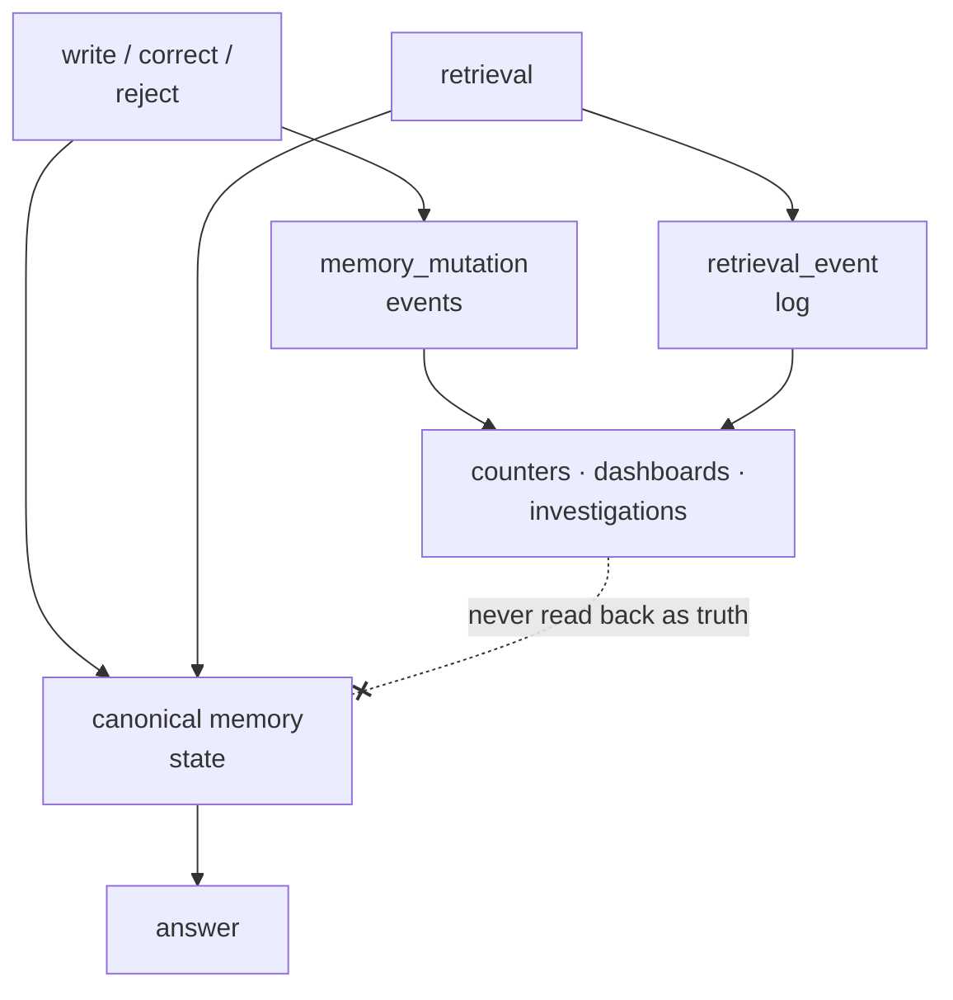

## Intent

Make it possible to reconstruct how memory changed, which memories entered context, and what feedback followed—without overwriting the evidence needed for investigation.

## The problem

Current rows answer what the system believes now, not how it arrived there. A counter such as `times_used = 12` cannot explain which conversations used a memory, whether it was actually injected, or which model and query selected it. Mutable history also makes concurrency and audits ambiguous.

## The pattern

Keep canonical memory state for efficient reads and append immutable events for changes and use:

```text
memory_mutation:
  created | corroborated | corrected | superseded | rejected | expired

retrieval_event:
  considered | retrieved | injected | cited | downvoted
```

Each event records memory ID, scope, actor, timestamp, request or conversation ID, reason, and relevant version identifiers. Derive counters and dashboards from events. Retention and privacy policies still apply; append-only means application code does not casually rewrite history, not that data can never be erased.



The dashed edge is the whole discipline: events flow outward into
observability and never back into belief.

## Why it works

Events support debugging, eval generation, attribution, concurrency analysis, and product review. They reveal the difference between a memory matching a query and actually influencing a prompt.

## The critical boundary

Telemetry is not truth. A frequently retrieved memory is reachable, not necessarily correct. A downvote says the resulting interaction was unsatisfactory, not that the memory was false. Feed events into review and evaluation; do not silently promote, reject, or delete beliefs from weak behavioral signals.

## Tradeoffs

Event volume grows quickly. Schema evolution and privacy deletion become harder. Causal attribution remains limited: injection does not prove that a model used a memory. Audit events also need transactional coupling to state changes or they can describe mutations that never committed.

## Cost to adopt

**Build:** an event table, a writer on every mutation path, and a retention
policy for the log itself.

**Forces elsewhere:** the log is often the largest table in the system, and it
inherits the same deletion obligations as the memory it describes — an audit row
quoting a deleted value has not deleted it.

**Ongoing:** logs that nobody queries rot. The pattern pays off only if
something reads it: a review surface, an investigation path, or a test.

**Skip it if** you already have durable evidence records and git history. Two
audit trails that disagree are worse than one.

## Seen in the atlas

[Atomic Agent](../../systems/atomic-agent/) is now the clearest implementation,
and its shape is the one to copy:

```sql
vote_events (id, kind, target_id, direction, session_id, turn_index, created_at)
-- and, derived from it:
memories.vote_score, lessons.vote_score, profile_facts.vote_score  (indexed)
```

The events are the record; the scores are a projection. A scoring rule can be
changed and recomputed, a suspicious voting pattern can be audited, and no single
vote is destructive. Set against the alternatives the atlas has collected —
[Holographic](../../systems/holographic/) mutating a trust score in place until a
fact falls below the retrieval floor, [RainBox](../../systems/rainbox/) holding
feedback behind a human gate, [MetaClaw](../../systems/metaclaw/) letting
telemetry tune retrieval policy through a promotion gate — the append-only log is
the option that preserves every one of those choices for later.

[Magic Context](../../systems/magic-context/) keeps dedicated mutation logs
(`storage-memory-mutation-log.ts`, `storage-m0-mutation-log.ts`) alongside
per-run dream records, so both what changed and what decided it are retained.

[Daimon](../../systems/daimon/) makes the log **load-bearing rather than
observational**, which is the strongest form this pattern takes: `events.jsonl`
is not a record of what happened to memory, it *is* where liveness lives, folded
at read time on every briefing. That forces two properties most audit logs never
need. The fold keys on the latest event by timestamp rather than by line order,
with same-second ties broken on event *content*, so a reordered or concurrently
written log folds identically. And unknown statuses resolve rather than vanish,
because a writer who bothered to record a lifecycle fact meant something by it.

It also demonstrates when **not** to use one log. Rejections from the
verification gates go to a separate `verification.jsonl`, and the source explains
why in a sentence worth copying: the resolutions fold keys on the item reference
alone and treats anything unrecognized as resolved, so a rejection written there
would hide the very item it describes — from the briefing, from carry, and from
search. A demoted memory must stay visible and merely read as less trusted. Any
system tempted to add a `kind` column to one event stream should check what its
own fold does with the new kind first.

[nanobot](../../systems/nanobot/) shows that the audit's *scope* is itself a
design decision. Its git commits are grounded in the real working-tree delta over
an explicit allowlist of durable files — and deliberately exclude
`memory/.dream_cursor` "so progress bookkeeping never appears as a durable-memory
edit in the audit record." The log reads as a history of what the agent came to
believe, not of its counters.

One failure is worth naming because a project fixed it in public.
[ouroboros](https://github.com/razzant/ouroboros) journals every mutation of its
scratchpad and identity files, and a comment records what went wrong first:

> "An honest journal (P1): a failed write must be journaled as a failure and
> surfaced to the caller — the old path logged `block_appended` success for a
> block that was never persisted."

**An audit log that records only successes is not an audit log.** It is a record
of intentions, and it is worse than no log, because it is trusted. The fix is
two-part: journal the failure with its own event type, and re-raise so the
caller cannot proceed believing the write landed. Any append-only memory audit
needs a test that a failed write produces a failure event and an error, not
silence.

[RainBox](../../systems/rainbox/) combines claim/evidence state with
`RetrievalEvent`, feedback, review UI, and eval flows, while explicitly treating
telemetry as a review signal rather than truth. [Mem0](../../systems/mem0/) keeps
SQLite history around memory changes. [llm-wiki-memory](../../systems/llm-wiki-memory/)
uses git history for inspectable mutation groups — and demonstrates why audit
history is not privacy erasure.

[NOOA Memory](../../systems/nooa-memory/) takes the opposite arrangement to
everything else here and states why: the access log "lives ON the record (capped
ring in `Memory.access_log`): copy or export one row and its usage story travels
with it." Each entry carries the score components that produced the retrieval —
`{rel, rec, imp, spread}` — plus the rank, the truncated query, the reader's
owner, and a trace span id. That answers "why was this surfaced" in a way a
separate event stream makes harder, since the interesting question is almost
always about one memory. The price is written into the design: a ring buffer
drops the earliest accesses, which are the ones explaining how a memory became
established. Both arrangements are defensible; only one of them is usually
chosen deliberately.

## Tests to require

- Mutation and audit event commit or roll back together.
- Distinguish considered, returned, and injected memories.
- Rebuild derived counters from the event stream.
- Deduplicate retried event writes.
- Apply scope authorization to audit queries.
- Exercise retention and true-erasure procedures across events and backups.

## Related patterns

- [Governed write gateway](../governed-write-gateway/)
- [Evidence before belief](../evidence-before-belief/)
- [Rejected-value tombstone](../rejected-value-tombstone/)
