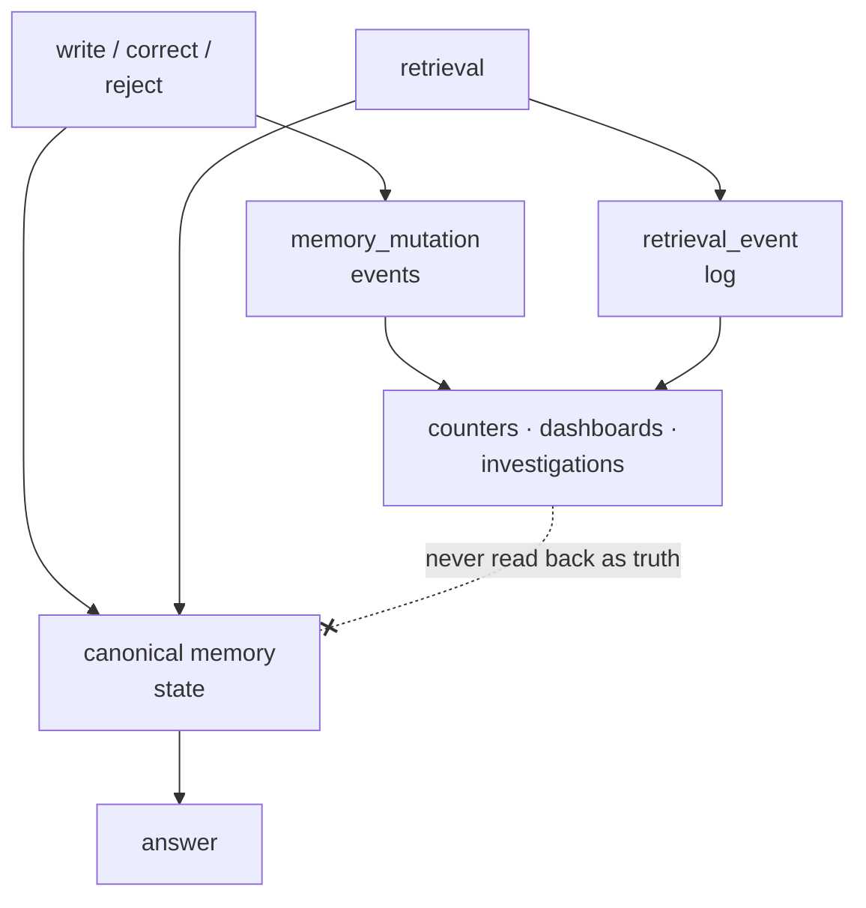

## Intent

Make it possible to reconstruct how memory changed, which memories entered context, and what feedback followed—without overwriting the evidence needed for investigation.

## The problem

Current rows answer what the system believes now, not how it arrived there. A counter such as `times_used = 12` cannot explain which conversations used a memory, whether it was actually injected, or which model and query selected it. Mutable history also makes concurrency and audits ambiguous.

## The pattern

Keep canonical memory state for efficient reads and append immutable events for changes and use:

```text
memory_mutation:
  created | corroborated | corrected | superseded | rejected | expired

retrieval_event:
  considered | retrieved | injected | cited | downvoted
```

Each event records memory ID, scope, actor, timestamp, request or conversation ID, reason, and relevant version identifiers. Derive counters and dashboards from events. Retention and privacy policies still apply; append-only means application code does not casually rewrite history, not that data can never be erased.



The dashed edge is the whole discipline: events flow outward into
observability and never back into belief.

## Why it works

Events support debugging, eval generation, attribution, concurrency analysis, and product review. They reveal the difference between a memory matching a query and actually influencing a prompt.

## The critical boundary

Telemetry is not truth. A frequently retrieved memory is reachable, not necessarily correct. A downvote says the resulting interaction was unsatisfactory, not that the memory was false. Feed events into review and evaluation; do not silently promote, reject, or delete beliefs from weak behavioral signals.

## Tradeoffs

Event volume grows quickly. Schema evolution and privacy deletion become harder. Causal attribution remains limited: injection does not prove that a model used a memory. Audit events also need transactional coupling to state changes or they can describe mutations that never committed.

## Cost to adopt

**Build:** an event table, a writer on every mutation path, and a retention
policy for the log itself.

**Forces elsewhere:** the log is often the largest table in the system, and it
inherits the same deletion obligations as the memory it describes — an audit row
quoting a deleted value has not deleted it.

**Ongoing:** logs that nobody queries rot. The pattern pays off only if
something reads it: a review surface, an investigation path, or a test.

**Skip it if** you already have durable evidence records and git history. Two
audit trails that disagree are worse than one.

## Seen in the atlas

### Read these first

- [Midas](../../systems/midas/) — a hash-chained log of every SQLite mutation, with committed tests on the chain itself and no memory content in the entries.
- [aimee](../../systems/aimee/) — append-only enforced twice by independent means, triggers and a `SELECT`-only runtime role, with a statement of which one an attacker can remove.
- [Palazzo](../../systems/palazzo/) — the log entry is a precondition of the mutation rather than a consequence of it.
- [CSM](../../systems/csm/) — distinguishes considered, returned and injected memories in what it records.
- [Helix AGI](../../systems/helix-agi/) — the counterexample that shows why coverage comes before tamper-evidence.

### Every instance

**[Aura](../../systems/aura/) and [aimee](../../systems/aimee/) are tamper-evident,
and between them they mark the upper bound of this pattern.** So is
[Midas](../../systems/midas/), below, whose rows carry their own chain. Most other
audits on this page are append-only by file handle, by grant or by trigger: never
rewritten by the code that owns them, and unable to show an edit made by anything
with enough access to bypass that. Aura keeps a SHA-256 hash
chain beside its receipt store, one JSONL line per receipt:

```text
seq:           monotonically increasing per-store
content_hash:  SHA-256 of the canonical JSON of the receipt body
prev_hash:     entry_hash of the previous entry (genesis is all zeros)
entry_hash:    SHA-256 over the canonical concatenation of the above
```

Verification walks from genesis, recomputes the entry hashes *and* re-hashes the
receipt bodies on disk. The module states what that buys: deletion shows up as a
sequence gap, insertion as a broken link, because `entry_hash` covers
`prev_hash`. A modified body fails because the recomputed `content_hash` no
longer matches. `tests/test_audit_chain.py` asserts each of those cases
separately and passes — 16 tests, run at the pinned commit.

Two design choices go with it and both are worth copying. The chain is a
**sidecar**: only `emit` is extended, and existing callers see nothing, so
tamper-evidence can be added to an audit log that already exists. And when the
receipt body is durable but the chain append fails, the runtime records a
degradation reading *"receipt body persisted but audit-chain append failed;
verify_chain will fail"* — it does not roll back. For a sidecar that is correct:
the discrepancy stays detectable instead of being papered over, which is the
opposite of the right answer for Palazzo's inline WAL below.

The pattern's ceiling is worth stating plainly. A hash chain proves the log has
not been edited; it does not prove the log is complete, because a writer that
never emitted a receipt leaves nothing to break. Aura closes that on its
strictest path — the memory write gateway rolls the write back when the receipt
cannot be emitted — and not on the others.

**[aimee](../../systems/aimee/) enforces the same property twice by independent
means, and says which of the two an attacker can remove.** Its `audit_event`
table has `BEFORE UPDATE` and `BEFORE DELETE` triggers raising `'WORM:
audit_event is append-only'`, and its Postgres twin puts the runtime role on
`SELECT` alone at provisioning, with writes reaching the queue only through a
`SECURITY DEFINER` submit function. Neither is presented as the
guarantee. The comment in `audit_worm.c` is explicit that the triggers *"are NOT
the adversarial guarantee (a process with file write access can drop them) —
that is the hash-chain…"* Naming the threat model is the part to copy: a trigger
stops a bug and a hash chain stops an editor, and a page that lists both without
distinguishing them has told a reader less than it appears to.

Two construction details go with it, both addressing gaps the Aura entry above
leaves open. The chain is guarded by a **single-writer mutex**, so `seq` is
gap-free by construction rather than by convention — which matters because the
sequence gap is what a deletion is supposed to show up as. And `row_hash` is an
HMAC-SHA256 over a **length-prefixed injective encoding** of the fields, which
closes the concatenation ambiguity that lets two different records hash alike;
`ts` is deliberately excluded from the hashed material, so a clock correction
does not break the chain.

**[Palazzo](../../systems/palazzo/) makes the log entry a precondition of deletion
rather than a consequence of it, and writes the rule into the method's contract.**
Most audits on this page are written because a mutation happened;
[breadcrumbs](../../systems/breadcrumbs/), below, also writes its row before the
overwrite, and aimee's append aborts the mutation it fails to record. Palazzo's
write-ahead log has two methods, and the destructive paths call the second one:

```rust
/// Like `log`, but errors when the entry cannot be durably appended —
/// including when no WAL path is configured at all. Destructive operations
/// (palace_delete, palace_delete_by_filter) call this and abort before
/// touching Qdrant: the WAL is their only audit trail, so a delete that
/// can't be logged must not happen.
pub fn log_strict<T: Serialize>(&self, operation: &str, params: &T) -> anyhow::Result<()>
```

The split is the design. Ordinary writes use best-effort `log`, which warns and
continues; deletion uses `log_strict`, which fails the operation. A lost store
line is an inconvenience; a lost delete line is the erasure of the record that
the erasure happened, and that is the one case where continuing is worse than
stopping. `delete_aborts_before_qdrant_when_wal_unconfigured` pins the refusal:
with no WAL path the delete errors, and no delete request reaches Qdrant.

The second detail is what goes in the entry. Palazzo writes a text preview of
every point before deleting it, so the log says what was removed. Compare
[LoreKit](../../systems/lorekit/), whose audit rows carry `{scope, key}` and can
therefore prove a change occurred without being able to show what it was. An
audit that records only that something happened answers the compliance question
and not the operational one.

Both limits are worth stating with it, because they bound what this buys. The
file is append-only by file handle, not by storage — nothing signs or chains it,
so it defends against accident rather than against an adversary with disk access.
And the log path defaults to `$HOME`, so a process without one has no log at all:
deletes then fail loudly, which is correct, while stores go silently unlogged,
which is not.

**[Fireweed MCP](../../systems/fireweed-mcp/) ships the guard that catches the
defect this whole section keeps finding, and leaves it off.** Its `ledger.py` is
a complete append-only log — gap-free `seq`, `prev_hash` chain, canonical byte
serialization, a closed event vocabulary, and a `resolver_version` stamped into
every payload so the offline question *"would today's resolver have decided this
differently?"* is answerable. `attach_ledger` and `seal()` have no caller
anywhere in the repository, so this runs on every mutation:

```python
if self._ledger is None:
    if self._sealed:
        raise RuntimeError(f"sealed graph: {kind} write without an attached ledger — "
                           "every mutation must be a captured event")
    return
```

The `return` is the corpus's most common defect and the `raise` is its fix, four
lines apart. **If you build an audit log, build the sealed mode with it**: a
chokepoint that fails loudly on an unlogged write converts "we forgot to wire it"
from a silent condition into a startup error. Fireweed's is one call away from
being on, which is the difference between this and a log that was never
finished.

**[Helix AGI](../../systems/helix-agi/) is the counterexample that shows why the
*coverage* question comes before the tamper-evidence question.** Its
`CognitiveJournal` is append-only JSONL, one SHA-256 per line, and its module
docstring calls it *"the single source of truth for all Helix memories, beliefs,
and thought snapshots"*. Every belief write appends a full snapshot to it, and
so does `archive_belief`, which pins mass at `0.01` and tags the belief through
the same sync path. `remove_belief`, which rewrites the category file and clears
the runtime indexes, appends nothing. So the log is a complete record of everything the system has
believed **except what it was asked to forget**, which is the one entry an audit
exists for.

Two details make it worth studying rather than merely citing. The checksum is
recomputed on read and a line that fails it is *silently skipped* — integrity is
detected and the result discarded, so a truncated log reads as a shorter log. And
the nightly `compact()` named in the same docstring has no caller anywhere in the
tree, so the file grows one embedding-bearing snapshot per belief update, which
is the failure mode on the opposite side of the retention question from
[Palazzo](../../systems/palazzo/)'s. **Check what your log does on delete before
you check whether anyone could forge it.**

[Atomic Agent](../../systems/atomic-agent/) has the table this page asks for and
not the property that makes it worth having:

```sql
vote_events (id, kind, target_id, direction, session_id, turn_index, created_at)
-- and, on each votable row:
memories.vote_score, lessons.vote_score, profile_facts.vote_score  (indexed)
```

`applyVote` updates the score and inserts the event in one transaction, so an
applied vote is never unrecorded. The score is not a projection of the events,
though. It is incremented and clamped in place, a vote against a score already at
the clamp writes no event, each consolidator tick multiplies every score by a
decay factor in bulk `UPDATE`s that write no event, and `evictOldestEvents` deletes
the oldest events once the table passes `memory.voting.eventLogMaxRows`, 50,000
by default. A changed scoring rule cannot be replayed over that history. And
the score is read back into belief, and every use is on by default:
utility-weighted eviction deletes memories ordered by `vote_score ASC` ahead of
recall count, a lesson with a negative score and no recorded success is
deprecated at the next consolidator tick, the profile renderer hides a fact
whose score falls to −3, and past 500 active unpinned profile facts the lowest
score is deleted first. Set against the alternatives the
atlas has collected — [Holographic](../../systems/holographic/) mutating a trust
score in place until a fact falls below the retrieval floor,
[RainBox](../../systems/rainbox/) holding feedback behind a human gate,
[MetaClaw](../../systems/metaclaw/) letting telemetry tune retrieval policy
through a promotion gate — a complete vote log with the score derived from it is
the option that preserves every one of those choices for later. Atomic Agent's
schema has that shape; its store keeps a capped log beside a score that behaves
like Holographic's, which is the crossing of the dashed edge above that this
page warns against.

[Magic Context](../../systems/magic-context/) keeps dedicated mutation logs
(`storage-memory-mutation-log.ts`, `storage-m0-mutation-log.ts`) alongside
per-run dream records, so both what changed and what decided it are retained.

[Daimon](../../systems/daimon/) makes the log **load-bearing rather than
observational**, which is the strongest form this pattern takes: `events.jsonl`
is not a record of what happened to memory, it *is* where liveness lives, folded
at read time on every briefing. That forces two properties most audit logs never
need. The fold keys on the latest event by timestamp rather than by line order,
with same-second ties broken on event *content*, so a reordered or concurrently
written log folds identically. And unknown statuses resolve rather than vanish,
because a writer who bothered to record a lifecycle fact meant something by it.

It also demonstrates when **not** to use one log. Rejections from the
verification gates go to a separate `verification.jsonl`, and the source explains
why in a sentence worth copying: the resolutions fold keys on the item reference
alone and treats anything unrecognized as resolved, so a rejection written there
would hide the very item it describes — from the briefing, from carry, and from
search. A demoted memory must stay visible and merely read as less trusted. Any
system tempted to add a `kind` column to one event stream should check what its
own fold does with the new kind first.

[nanobot](../../systems/nanobot/) shows that the audit's *scope* is itself a
design decision. Its git commits are grounded in the real working-tree delta over
an explicit allowlist of durable files — and deliberately exclude
`memory/.dream_cursor` "so progress bookkeeping never appears as a durable-memory
edit in the audit record." The log reads as a history of what the agent came to
believe, not of its counters.

One failure is worth naming because a project fixed it in public.
[ouroboros](https://github.com/razzant/ouroboros) journals every mutation of its
scratchpad and identity files, and a comment records what went wrong first:

> "An honest journal (P1): a failed write must be journaled as a failure and
> surfaced to the caller — the old path logged `block_appended` success for a
> block that was never persisted."

**An audit log that records only successes is not an audit log.** It is a record
of intentions, and it is worse than no log, because it is trusted. The fix is
two-part: journal the failure with its own event type, and re-raise so the
caller cannot proceed believing the write landed. Any append-only memory audit
needs a test that a failed write produces a failure event and an error, not
silence.

[RainBox](../../systems/rainbox/) combines claim/evidence state with
`RetrievalEvent`, feedback, review UI, and eval flows, while explicitly treating
telemetry as a review signal rather than truth. [Mem0](../../systems/mem0/) keeps
SQLite history around memory changes. [llm-wiki-memory](../../systems/llm-wiki-memory/)
uses git history for inspectable mutation groups — and demonstrates why audit
history is not privacy erasure.

[Nova AI](../../systems/nova-ai/) puts the log on the record and pays the
scaling cost for it. `ensure_concept` seeds an `audit_log` array on every
concept, and creation, sense upgrade, confidence change and relation add each
append an entry carrying `old_value`, `new_value`, the source and a timestamp,
mirrored to an external `logs/concepts.jsonl`. Exporting one concept exports its
whole history, which is the placement NOOA argues for. The cost is visible in the
same file: the store is one JSON document rewritten in full on every save, so the
history that makes a concept auditable is also what a single confidence bump
rewrites — and non-atomically. It is also the atlas's sharpest demonstration that
an audit log is not a correction mechanism: Nova can say exactly when and from
whom it learned something wrong, and has no code anywhere that removes it.

[memU](../../systems/memu/) is the clean separation of the two halves, one of
which is missing. Its event spool is careful about everything telemetry is
usually careless about — an allowlist per event type, no query text, bounded
payloads — and it records that a retrieval happened and how many results came
back. It records nothing about what changed in the store, it is deleted once
delivered, and it is addressed to a vendor analytics endpoint rather than to the
memory. A system can have a considered account of its own operation and no
account of its own contents, and this is what that looks like.

[NOOA Memory](../../systems/nooa-memory/) takes the opposite arrangement to
everything else here and states why: the access log "lives ON the record (capped
ring in `Memory.access_log`): copy or export one row and its usage story travels
with it." Each entry carries the score components that produced the retrieval —
`{rel, rec, imp, spread}` — plus the rank, the truncated query, the reader's
owner, and a trace span id. That answers "why was this surfaced" in a way a
separate event stream makes harder, since the interesting question is almost
always about one memory. The price is written into the design: a ring buffer
drops the earliest accesses, which are the ones explaining how a memory became
established. Both arrangements are defensible; only one of them is usually
chosen deliberately.

[CSM](../../systems/csm/) implements the third bullet below — *distinguish
considered, returned, and injected memories* — with a recorded reason for every
candidate, and it is worth copying whole. Alongside a conventional mutation stream (`memory_events`
for created/deleted/retention-cleanup, `memory_merges` for each merge with its
normalized hash) it writes a second pair of tables for **assembly**:
`context_injection_events` holds one row per injected block with an idempotency
key, a `block_hash`, a `builder_version` and a `config_hash`, and
`context_injection_items` holds one row per *candidate*, carrying its layer,
position, selection rank and score, a `disposition` of
`injected | trimmed | omitted`, and a `selection_reason_code` drawn from a
closed set — `importance_rank`, `recent_session`, `explicit_preference`,
`active_goal`, `budget_trim`, `layer_budget_exhausted`, `filter_rejection`,
`empty_source`.

The distinction that makes it useful is between the last three. A mutation log
tells you the memory exists; a recall log tells you it was found; this tells you
it was found, ranked fourth, and lost to a layer budget — which is the actual
answer to "why didn't the agent know that?". [RainBox](../../systems/rainbox/)
records the same fact without the reason: `build_profile_block` writes a
`considered` row for every selected profile fact and an `injected` row only for
those that fit the character budget, so the trimmed set is recoverable as the
difference between the two stages, without a per-item reason code. The `builder_version` and `config_hash` matter
for the same reason: without them, an old row cannot be read against the
selection rules that produced it. The cost is one row per considered item per
turn, which is the highest write volume of any audit design here, and CSM
attaches no retention policy to it.

[LoreKit](../../systems/lorekit/) contributes the cheapest correct
implementation of the invariant and the sharpest warning about what it buys.
The implementation: `audit_log` carries a SELECT policy and an INSERT policy and
**deliberately no UPDATE and no DELETE policy**, so immutability is enforced by
row-level security rather than by everyone remembering not to write the
statement. The migration numbers the choice (Decision D5) and says why app-layer
capture beats a trigger on the data tables — application code can see the
resolved actor and shape a human-readable target — then names the single table
where no call site exists and a trigger is therefore the right answer. Eleven
actions are pinned in a CHECK constraint.

The warning is what the log then cannot answer. Every mutation is recorded with
`{scope, key}` as its metadata, and the write path is an in-place upsert with no
version chain — so the log proves that a memory changed, by whom and when, and
**cannot show what it replaced**. That is a complete answer to "who touched
this?" and no answer at all to "what did it used to say?", which in a memory
system is usually the question being asked. The two properties look like one
feature and are not: an audit trail is about *actors*, and memory history is
about *values*. If you want both, put the old value in the log or keep the
version — deciding you have history because you have an audit log is the failure
this entry exists to name.

[Midas](../../systems/midas/) is the strong form: `audit_log` rows carry
`prev_hash` and their own `hash`, `verify_audit_log` walks the chain, and the rows
store a `content_sha` rather than content — so the log proves a mutation happened
without retaining what was mutated, which is what makes it compatible with
erasure rather than in tension with it. Beside it, `forgetting_receipt` produces
an erasure certificate keyed on `sha256(id\x00content)`, "enough to later prove a
specific item was erased, not enough to reconstruct it". The receipt is returned
to the caller and never persisted or consulted, which is why it proves forgetting
and cannot prevent the value returning.

[ClawMem](../../systems/clawmem/) shows the motivation stated plainly: `judge_runs`
and `judge_events` exist because "interactive hosts do not persist hook stderr, so
these rows are the only durable evidence erosion calibration can read". A provider
failure that falls back to a heuristic writes two rows linked by
`fallback_from_run_id`, committed atomically before the heuristic verdict is used;
there is no `UPDATE` against either table anywhere in the tree, and the only
`DELETE` is retention pruning that cascades the pair as a unit.

[breadcrumbs](../../systems/breadcrumbs/) answers the value question and skips
the actor one, which is the mirror image of the warning above. Its
`store_fact()` writes a `SUPERSEDED` row to `episodes.jsonl` before overwriting
a semantic fact, carrying `prior_value`, `prior_status` and `new_value`, and
`reject_fact()` and `lift_tombstone()` add `REJECTED` and `TOMBSTONE_LIFTED`
rows with their required reasons, so the log shows what an entry used to say and
what it was forbidden to say again. It records no actor — a single-operator kit
does not need one — and, more consequentially, it records nothing on the trust
axis: promoting a fact to `verified` mutates the row in place and writes no
event.

**What that costs is visible in the same repository, one function away.**
`build_context(as_of=…)` replays the store as of a past moment by filtering
facts on a `recorded_at` stamp. With no promotion event to replay, it reads the
trust axis from a second stamp on the row: `verify_fact` writes `verified_at`,
and a fact whose `verified_at` is missing or later than `as_of` renders as
`asserted`, so the replay never shows an oracle that did not exist at the
replayed moment. What the row cannot hold is a sequence — a second `verify_fact`
overwrites the stamp, the verifier and the evidence, and no event keeps the
first. The timeline query is only as deep as what is stamped or logged
underneath it. Decide which transitions the log covers by asking which ones you
would need to reconstruct, not by asking which ones happen to pass through the
function you instrumented.

[PLUR1BUS](../../systems/plur1bus/) records the *decision* alongside the change.
A reconsolidation event carries the action, the update source, the quoted
evidence, the caller's confidence and the measured semantic drift between the old
and new embedding, so the log answers not only what changed but how far it moved
and on whose word. The mechanism worth stealing is beside it. The store is
append-only JSONL with an id index, and a status transition returns the record
with the *same id*, so an id-keyed dedupe would have silently swallowed every
promotion — the append key is therefore computed as `status:<id>:<status>:<updatedAt>`
for a transition and as content for a candidate, and a record carrying `updatedAt`
is never deduplicated at all. Making a log append-only is the easy half; choosing
a key under which a mutation cannot be mistaken for a duplicate is the half that
decides whether the log is complete.

[OmniIntelligence](../../systems/omniintelligence/) stores the *evidence* beside
the decision. `pattern_lifecycle_transitions` carries the usual from/to, trigger,
actor, reason and correlation id — and a `gate_snapshot JSONB` holding the gate
conditions as they stood at the moment of the transition. "Why was this promoted"
is then answerable from one row, rather than requiring a reconstruction of what
the metrics were that afternoon. Its foreign key is `ON DELETE RESTRICT` with the
reason written beside it: *"Audit records must never be silently deleted when
parent patterns are removed."* An audit that holds only verdicts tells you what
happened; one that holds the inputs tells you whether it should have.

[Memory Palace](../../systems/memory-palace/) is the counterexample and worth
knowing about before trusting a schema. Migration 0004 creates `access_log` as
"the L0 layer" persisting read, write, search-hit and compact events "used by the
forgetting engine, reflection workflow, and observability dashboards", with two
indexes, a paired rollback, an ORM class and a dashboard counter. Nothing inserts
into it. Every artifact of an audit trail is present except the write, and the
forgetting engine named as its consumer works from denormalised counters on the
memory row instead.

**[Hats](../../systems/one-agent-many-hats/) is the near-miss that fails in the
opposite direction: the log is built, hash-chained and written to, and memory is
not among the things it records.** `src/core/audit.ts` is one of the more careful
implementations of this page in the corpus — a single stream rather than one per
run, because *"the question is 'everything done to this workspace', which cannot
be answered by a store partitioned by the thing you are searching for"*; mode
`0600`; serialised writes so *"two appends must not interleave or the chain
forks"*; a per-record SHA-256 over the previous hash and this body;
`verifyAuditChain` to recompute it; and `auditForSubject` for the query it is
shaped around. Its docstring then names what belongs in it, including *"data
export, deletion, admin or tool access to workspace data"*. Nine of the twenty
actions in its closed vocabulary have no producer, `data.written` and
`data.deleted` among them, and **no memory mutation reaches it at all** —
distilling a lesson, rejecting a takeaway, forgetting a persona fact, disabling a
lesson and pruning the memory folder are all invisible to it. Two further
details are worth carrying into your own review. The module argues that
completeness is the property the stream exists for, so writes are *"awaited
rather than fire-and-forget, and a failure is surfaced to the caller instead of
being counted and dropped"*, and exports `audit()` to do exactly that — while all
thirteen call sites use the non-throwing `auditQuietly`, two of them prefixed
`void`. And the retention policy exempts the audit stream on the correct ground
that trimming the front of the file would break the chain. A log this careful,
with this vocabulary, that a memory system does not write to, is the shape to
check for: the schema is not the evidence, the call sites are.

[Forgetful](../../systems/forgetful/) has the schema — `activity_log` with entity type and id, action, a full JSON snapshot, a per-field `{old, new}` diff on updates, actor and metadata — and two properties that keep it near the bottom of the reliable bracket. The bus that writes it exists only when `ACTIVITY_ENABLED=true`, which defaults to false; and `emit` dispatches the writer with `asyncio.create_task` and returns, the handler's exception logged and swallowed, so the mutation commits whether or not its row does. The one-shot CLI drains the pending tasks before exit precisely because a process that did not would lose them. A retention setting deletes old rows lazily on read; nothing rewrites one. The declared `system` and `llm-maintenance` actors have no writer, so every row says `user`.

[Utopia](../../systems/utopia/) defends its ledger at three levels and is candid about what each buys. The application only inserts; two triggers raise on UPDATE, DELETE and TRUNCATE, the second present because a statement-level TRUNCATE does not fire row triggers; and the compose file can provision a restricted role with those privileges revoked on that one table while migrations run under the owner on a separate connection. The migration's own comment states the ceiling — a superuser can still `DROP TRIGGER`, so the mechanism raises tampering from *trivial* to *requires DDL*, and DDL lands in the database's log — and names the hash chain that would close the gap and does not exist at this commit. `kb_id` and `actor_id` deliberately carry no foreign key, so deleting a knowledge base does not delete the record of deleting it, and an actor's email is snapshotted into the row so a retired account does not turn its history into bare UUIDs. The unusual part is the consumer: an optional governance agent reads past human verdicts out of the ledger as *precedent* before adjudicating a duplicate pair and cites the events it relied on.

**[GrayMatter](../../systems/graymatter/) writes the trail and never reads it.** Every reflect action — add, update, forget, link, pin, unpin — appends one entry carrying timestamp, action, agent, old and new text and source to an audit bucket inside the store's own database, keyed by a fixed-width RFC3339 timestamp so the byte order is time order and pruning walks oldest-first. The producer is reachable and the format is shared between the direct and daemon paths. No reader exists: the package exports only a write and a failure counter, and a tree-wide search for the bucket name finds the writer, its test and a changelog line. The package added error returns specifically so an audit write could not fail invisibly, and its one caller discards the result while nothing reads the failure counter. The CLI correction commands write no entry at all, so a person's correction leaves less trace than an agent's.

**[Membrane](../../systems/membrane/) is the cascade version of this failure.** Its audit table is genuinely insert-only with a closed action vocabulary — create, revise, fork, merge, delete, reinforce, decay — and, unusually, every value in it has a producer on a reachable path. The defeat is one clause in the schema: `record_id … ON DELETE CASCADE`. The prune pass writes its own audit entry and deletes the record in the same transaction, so the entry documenting the deletion is removed by the deletion it documents, along with the record's entire history. An audit meant to outlive what it describes cannot be keyed to it by a foreign key that cascades.

**[Memorizer](../../systems/memorizer/) writes its events on the right path and
too few of them.** Each edit and revert inserts a `memory_events` row inside the
same transaction as the snapshot and the UPDATE, which is the placement this
pattern asks for. The vocabulary declares six event types and two have
producers; store, archive, move and delete write nothing, a purge tool deletes
events by age, and `ON DELETE CASCADE` removes a memory's events with it — so
the log explains edits to memories that still exist and nothing else.

## Tests to require

- Mutation and audit event commit or roll back together.
- Distinguish considered, returned, and injected memories.
- Rebuild derived counters from the event stream.
- Deduplicate retried event writes.
- Apply scope authorization to audit queries.
- Exercise retention and true-erasure procedures across events and backups.

## Related patterns

- [Governed write gateway](../governed-write-gateway/)
- [Evidence before belief](../evidence-before-belief/)
- [Rejected-value tombstone](../rejected-value-tombstone/)
