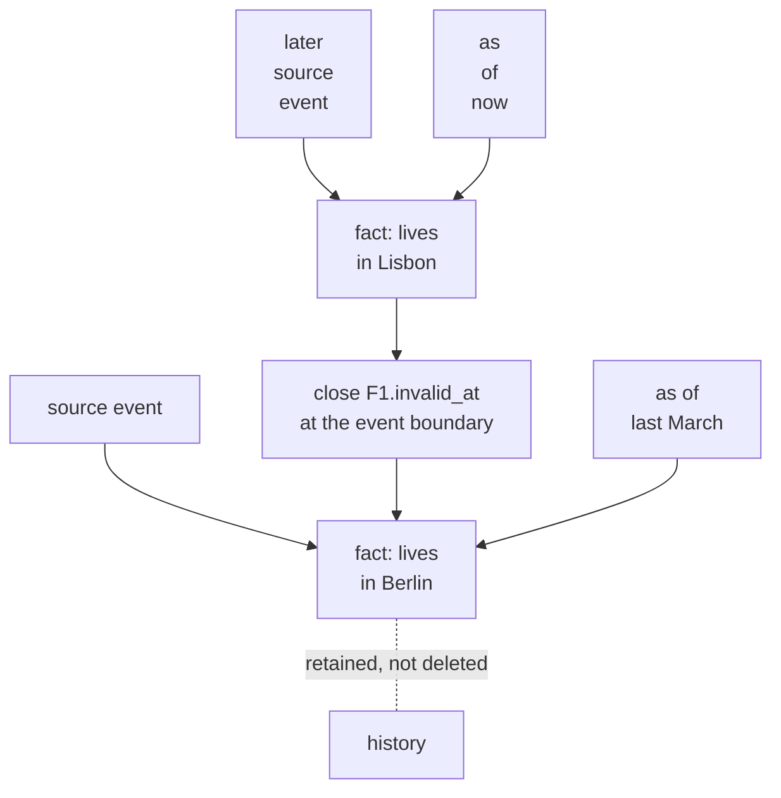

## Intent

Represent changing facts and backfilled history without overwriting the past or confusing event time with ingestion time.

## The problem

A memory system usually has at least two clocks:

- the time an event happened or a fact was true;
- the time the system received, stored, corrected, or deleted that information.

Collapsing them into one timestamp breaks questions such as “Where did Alice work last year?” A backfilled event appears new, and a corrected fact may erase the state that was valid earlier.

## The pattern

Give facts an application-time interval and a system-time lifecycle:

```text
fact
  valid_at    ───────────── invalid_at
  created_at  ───────────── expired_at
```

When a new fact supersedes an old one:

1. Keep the source event for both facts.
2. Set the new fact's real-world `valid_at`.
3. Close the old fact's `invalid_at` at the appropriate event boundary.
4. Record when the system made that change through `created_at`/`expired_at`.
5. Query against the clock appropriate to the question.

Do not silently hard-delete the older edge merely because it is no longer current.



Two clocks, two questions. *What was true then* reads application time;
*what did we believe then* reads system time.

## Why it works

The graph can answer current-state and historical questions from the same records. Backfilled information stays ordered by event time even though it was ingested later. Corrections become inspectable state transitions rather than destructive rewrites.

## Tradeoffs

- Date extraction may be uncertain or absent.
- Overlapping intervals need explicit policy.
- Entity resolution mistakes can invalidate the wrong fact.
- Queries and indexes become more complex.
- “Unknown end date” must remain different from “still true”.
- System-time retention may conflict with privacy deletion requirements.

Temporal precision is not truth. Store the evidence and confidence behind inferred dates.

## Cost to adopt

**Build:** two time dimensions on the record, interval-closing instead of
overwriting, and an as-of parameter on the read path.

**Forces elsewhere:** every query must now say *when*, and defaults become
load-bearing. Extraction has to produce validity times, which usually means
asking a model for a date and inheriting its mistakes.

**Ongoing:** interval arithmetic accumulates edge cases — open intervals,
overlapping updates, corrections to the validity time itself.

**Skip it if** your facts do not change on a timeline anyone will ask about.
Most personal preferences do not need as-of queries.

## Seen in the atlas

[Graphiti](../../systems/graphiti/) remains the fullest treatment — edges carry
both transaction time and real-world validity, and a fact is invalidated by
closing an interval rather than erasing history.

The useful new finding is that **you do not need a graph database for this.**

[Gini](../../systems/gini-agent/) gets most of the value from three columns on an
ordinary SQLite row:

```sql
occurred_start TEXT, occurred_end TEXT,   -- when it was true
mentioned_at   TEXT NOT NULL             -- when it was said
```

Its temporal recall channel parses a query for an absolute or relative range and
matches units whose occurred window overlaps it — and only participates when the
query actually contains a temporal expression, so it does not dilute fusion
elsewhere. A memory recorded on Friday about Tuesday's deploy answers a question
about Tuesday.

[GENOME](../../systems/genome/) is the instance that writes the interval
arithmetic down, which is the part everyone else leaves implicit and gets wrong
once. `facts_valid_at(entity, T)` returns facts where
`valid_from <= T < valid_until`, and the docstring names the convention — SQL:2011
application-time periods, `valid_from` inclusive, `valid_until` exclusive — then
states the consequence a caller would otherwise have to discover: *"Querying at
exactly valid_until returns the SUCCESSOR fact, not this one."* Supersession
closes the predecessor's interval rather than overwriting the row, so the period
during which the wrong value was in force stays answerable. It also stores facts
as ordinary memory records tagged by operator rather than in a dedicated table,
and says what that buys: scope isolation, cascade delete, embedding and search,
and parent-filtered retrieval, all inherited rather than re-implemented beside a
second schema. A `believed_by` field on each fact makes two agents'
contradictory beliefs about one entity representable instead of a
last-writer-wins collision — the axis this page does not otherwise cover.

[Atomic Agent](../../systems/atomic-agent/) is the near miss, and it is a useful
one because the columns are all present. `profile_facts` carries `valid_from`,
`created_at` and `updated_at` beside a `supersedes`/`superseded_by` chain under a
partial unique index, and the legacy retrofit is documented
(`valid_from = legacy.updated_at`). All three are written with the same `now` on
every insert, and the code says so — `updatedAt` is *"identical to `validFrom`
because every write creates a fresh row"*, and `created_at` is *"copied from
`valid_from` on a fresh row"*, kept so a later phase has somewhere to hang vote
scores. No read in `src/` takes a time argument. That is version history on one
clock: it answers *what did this key hold before*, and not *what did this store
believe on a given date*, which is what makes the pair of columns a plan rather
than a second axis.

[MagiCore](../../systems/magicore/) puts the instant form in a .NET library: `reference_time`
in a memory's metadata beside `CreatedAt` and `UpdatedAt`, a range filter applied before
ranking, a dedup key that includes the instant so one sentence at two dates is two rows,
and a deterministic interpreter that turns an ISO date, a year or *last month* into a
range with a confidence and gives up below a threshold —
`TemporalSearchFailsOpenWhenInterpretationConfidenceIsLow` asserts a vague question
returns both memories rather than the wrong one. Its record axis is queryable too:
`GetAllAtAsync` replays the history to a timestamp. What it lacks is the end of the
interval, so the period a fact held is recoverable only from the record-time history of
its supersession — Gini's `occurred_end` and GENOME's `valid_until` are the missing
column.

[Hindsight](../../systems/hindsight/) extracts temporal spans alongside facts.
[MetaClaw](../../systems/metaclaw/) and
[Redis Agent Memory Server](../../systems/redis-agent-memory-server/) carry
`expires_at` and TTL, which is validity's poorer relative: an expiry says when to
stop believing something but not when it was true.

[Helm](../../systems/helm/) is the near-miss worth checking your own schema
against. It has `valid_from` and `expired_at` on the fact row, a `history <key>`
verb that orders by `valid_from DESC`, and correction that stamps the old row
rather than erasing it — every structural piece of this pattern. And it is not
bi-temporal, because `valid_from` is only ever written as the insert timestamp or
backfilled to `created`. No writer anywhere in the repository can set it to
anything else, so validity time is record time under a second name, and the
history the verb returns is a list of *when the system changed its mind*, never
of when anything was true.

The diagnostic generalizes past this one repository, because the columns are the
easy part and are usually the part that gets built: ask whether any caller can
land a fact whose validity **precedes its own row**. If a backfill cannot express
"this was true from March, and I am only learning it now", the second time
dimension is decorative no matter what the column is called.

[Midas](../../systems/midas/) implements the smallest version that still answers
the question. A retired belief keeps `superseded_at` in its metadata, `created_at`
is caller-supplied so importers set it from the source turn, and `recall(as_of=)`
walks the supersession chain to the version whose window contains the timestamp.
`tests/test_bitemporal.py` pins it with three sequential launch dates and asserts
that each `as_of` returns the belief that was current then. Two lines of state and
a chain walk, with no graph database.

[ClawMem](../../systems/clawmem/) carries the axis on its triple store rather than
its documents: `entity_triples` holds `valid_from`, `valid_to` and `created_at`, a
new assertion closes the old interval with `UPDATE ... SET valid_to` rather than
overwriting, and the read path filters on the pair — surfaced as an MCP tool whose
description is "what was true about X on date Y?". The uneven coverage is the
sentence worth carrying: validity is tracked for the triples extracted from
documents and not for the documents themselves.

[memory-lancedb-pro](../../systems/memory-lancedb-pro/) separates two things most
systems merge — `invalidated_at`, set when another fact supersedes this one, and
`valid_until`, an expiry the fact carried from the start — with
`isMemoryExpired` documented as "separate from `isMemoryActiveAt` (which checks
`invalidated_at` from superseding)". It also refuses to store an incoherent
interval: an `invalidated_at` earlier than `valid_from` is dropped rather than
written.

[MemBukkit](../../systems/membukkit/) is the counterexample worth keeping beside
those, because it has everything this pattern needs except the second axis and
reads as though it has both. A fact carries `timestamp` for when it was true and
`valid_to` for when it stopped being true; `is_active_as_of` filters the evidence
pool by them; `ask(as_of=...)` is a first-class argument on every surface. And
`link_supersessions` sets `valid_to` to **the replacement fact's own timestamp**,
so both ends of the interval sit on the validity axis and no fact row records
when the store learned anything. The store can answer *what was true in May* and
cannot answer *what I believed in May* — which is the question you have when an
agent said something wrong and you are trying to find out whether the memory was
wrong then or the retrieval was. The single-axis version is genuinely useful and
much cheaper; the distinction is worth drawing explicitly, because a reader
comparing feature lists will see `as_of` and `valid_to` and assume the pair.

[Uteke](../../systems/uteke/) ships `valid_from`, `valid_until` and `recall --at`, and all three are record time. `valid_from` equals `created_at` on every path, and `valid_until` is set only by a deprecation, to the moment it happened. Point-in-time recall draws candidates from a vector index that drops a row when it is deprecated, and `list --at` filters `deprecated = 0` in SQL, so a memory retired after the requested time is missing from the answer about that time. The predicate that would keep it is correct and never receives such a row.

[Janus-Graph](../../systems/janus-graph/) is Graphiti seen from a caller, and both of its temporal defects live in the wrapper rather than the engine. It dates every episode by the sweep that processed it — the worker's `reference_time` falls back to now because it reads a `created_at` the queue's claim never sets — so relative dates in a delayed or dead-letter-replayed episode resolve against the wrong day, and no caller can supply the time. And its recall filter is `invalid_at IS NULL`, which keeps closed facts out but also hides a fact whose extracted end date lies in the future; comparing against the query instant is the correct predicate. It still earns the mark, because the engine's edges carry a model-extracted validity that can precede their row, and the wrapper reads that axis on every search.

[Utopia](../../systems/utopia/) is the fullest version of this pattern here, and its discipline is on the read side. `valid_from`/`valid_to` carry a precision column *per endpoint*, replacing a single default that made a fact with no date at all look measured to the day, and the end precision admits `unknown`, so *"former CEO"* — an ending stated without a date — is distinguishable from *still holding*. Every read predicate for both axes is assembled in two modules, `world_axis.rs` and `record_axis.rs`, on the stated argument that a defence spread across fifty read sites fails silently when one is missed; both take an instant, and the record axis is reversed for chunks, documents and entity merges as well, so a replay at a past date sees the graph as it stood, merges undone and deleted documents back. The textbook indeterminate-instant trick is explicitly refused: filling `valid_to` with the document's date would put a confident-looking timestamp in a column every reader would have to check the precision of first.

## A third clock

Two clocks answer *what was true* and *what did we believe*. The temporal
database literature names a third, decision time: when an assertion was made in
the world, apart from when it held and when it was recorded. In agent memory the
useful form is *when the source said it*. A Friday conversation about Tuesday's
deploy, ingested by Sunday's batch, has three answers to "when", and the middle
one is what you need when two sources disagree and the question is which spoke
later.

The third clocks in the atlas do not mean the same thing, which is the first
thing to settle when a system claims one:

- **Said.** [Gini](../../systems/gini-agent/) has all three columns —
  `occurred_start`/`occurred_end`, `mentioned_at` (*"when it was said"*) and
  `created_at` — and its temporal recall channel filters on the occurred window.
- **Last seen.** [Veracium](../../systems/veracium/) keeps `observed_at` beside a
  `valid_from` that is *"first-known and immutable"*; `confirm_edge` advances the
  one and never the other. [ELAI](../../systems/elai/)'s `last_observed_at`
  starts equal to `ingested_at` and `valid_from`, is bumped by `update_trust`
  during recall, and recall sorts by it. That is recency, not assertion.
- **Three columns, two axes.** [memv](../../systems/memv/) carries `valid_at`,
  `invalid_at` and `expired_at`: an interval on one clock and an end on the other.
- **Claimed, not built.** [NornicDB](../../systems/nornicdb/)'s README advertises
  "tritemporal facts". Its temporal procedures take one interval, named by two
  property names the caller chooses, and an MVCC version: two axes per call. The
  third is an `asserted_at` property in a user guide's example schema, written by
  the user's own Cypher and read by no engine code, and the guide's examples set
  it to the same `datetime()` as `valid_from` in the same committing statement.
- **Said, but not queryable.** [Utopia](../../systems/utopia/) carries
  `attested_from` and `attested_to`: the date of the *document* that attested the
  fact, set at insert, moved only earlier when the same assertion is observed
  again, with separate anchors at each end so a bare open fact closed by a later
  *"no longer serving"* takes its start from the first evidence and its end from
  the document that said so. Helm's diagnostic half-passes: a writer sets it
  independently of both other clocks, and a read path does query it —
  `facts_holds_from` reads a fact's lower bound as `COALESCE(valid_from,
  attested_from)`. But it is consumed as a *bound on the world axis*, never as an
  axis of its own: there is no as-said parameter anywhere. A third column doing
  real work, and still two clocks.

The diagnostic is Helm's, applied once more: **can a writer set the third time
independently of the other two, and does any read path query it?** A third clock
always stamped with the insert time, or one nothing filters on, is metadata. That
does not make it wrong to keep — a said-at column costs one field and makes a
later disagreement tractable — but it does not make the store tritemporal.

## Tests to require

- Backfilled old events ingested today.
- A current fact replacing a formerly true fact.
- Overlapping, missing, and timezone-naive intervals.
- Contradictions whose source events arrive out of order.
- Historical queries versus current-state queries.
- Entity deduplication followed by temporal correction.
- Exact deletion of source evidence and all unsupported derived facts.

Run these as a matrix rather than a checklist — see [the contradiction test](../../benchmarks/#contradiction-test) for the case shapes and the four outcomes worth scoring separately.

## Related patterns

- [Evidence before belief](../evidence-before-belief/)
- [Append-only memory audit](../append-only-memory-audit/)
- [Trust-state machine](../trust-state-machine/)
- [Hybrid retrieval fusion](../hybrid-retrieval-fusion/)
