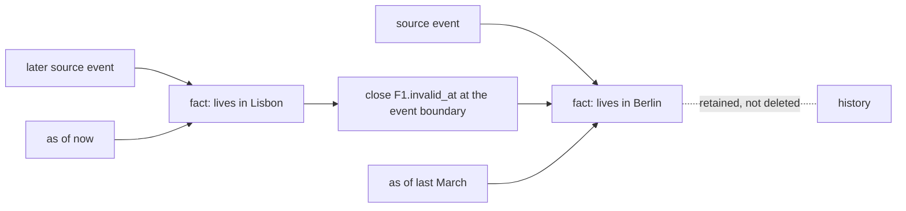

## Intent

Represent changing facts and backfilled history without overwriting the past or confusing event time with ingestion time.

## The problem

A memory system usually has at least two clocks:

- the time an event happened or a fact was true;
- the time the system received, stored, corrected, or deleted that information.

Collapsing them into one timestamp breaks questions such as “Where did Alice work last year?” A backfilled event appears new, and a corrected fact may erase the state that was valid earlier.

## The pattern

Give facts an application-time interval and a system-time lifecycle:

```text
fact
  valid_at    ───────────── invalid_at
  created_at  ───────────── expired_at
```

When a new fact supersedes an old one:

1. Keep the source event for both facts.
2. Set the new fact's real-world `valid_at`.
3. Close the old fact's `invalid_at` at the appropriate event boundary.
4. Record when the system made that change through `created_at`/`expired_at`.
5. Query against the clock appropriate to the question.

Do not silently hard-delete the older edge merely because it is no longer current.



Two clocks, two questions. *What was true then* reads application time;
*what did we believe then* reads system time.

## Why it works

The graph can answer current-state and historical questions from the same records. Backfilled information stays ordered by event time even though it was ingested later. Corrections become inspectable state transitions rather than destructive rewrites.

## Tradeoffs

- Date extraction may be uncertain or absent.
- Overlapping intervals need explicit policy.
- Entity resolution mistakes can invalidate the wrong fact.
- Queries and indexes become more complex.
- “Unknown end date” must remain different from “still true”.
- System-time retention may conflict with privacy deletion requirements.

Temporal precision is not truth. Store the evidence and confidence behind inferred dates.

## Cost to adopt

**Build:** two time dimensions on the record, interval-closing instead of
overwriting, and an as-of parameter on the read path.

**Forces elsewhere:** every query must now say *when*, and defaults become
load-bearing. Extraction has to produce validity times, which usually means
asking a model for a date and inheriting its mistakes.

**Ongoing:** interval arithmetic accumulates edge cases — open intervals,
overlapping updates, corrections to the validity time itself.

**Skip it if** your facts do not change on a timeline anyone will ask about.
Most personal preferences do not need as-of queries.

## Seen in the atlas

[Graphiti](../../systems/graphiti/) remains the fullest treatment — edges carry
both transaction time and real-world validity, and a fact is invalidated by
closing an interval rather than erasing history.

The useful new finding is that **you do not need a graph database for this.**

[Gini](../../systems/gini-agent/) gets most of the value from three columns on an
ordinary SQLite row:

```sql
occurred_start TEXT, occurred_end TEXT,   -- when it was true
mentioned_at   TEXT NOT NULL             -- when it was said
```

Its temporal recall channel parses a query for an absolute or relative range and
matches units whose occurred window overlaps it — and only participates when the
query actually contains a temporal expression, so it does not dilute fusion
elsewhere. A memory recorded on Friday about Tuesday's deploy answers a question
about Tuesday.

[Atomic Agent](../../systems/atomic-agent/) applies the same split to profile
facts — `valid_from` for when a row started being authoritative, `created_at` as
the audit timestamp, with `supersedes`/`superseded_by` chaining — and documents
the retrofit explicitly (`valid_from = legacy.updated_at`), so the point at which
bi-temporality was added stays recoverable rather than silently assumed.

[Hindsight](../../systems/hindsight/) extracts temporal spans alongside facts.
[MetaClaw](../../systems/metaclaw/) and
[Redis Agent Memory Server](../../systems/redis-agent-memory-server/) carry
`expires_at` and TTL, which is validity's poorer relative: an expiry says when to
stop believing something but not when it was true.

## Tests to require

- Backfilled old events ingested today.
- A current fact replacing a formerly true fact.
- Overlapping, missing, and timezone-naive intervals.
- Contradictions whose source events arrive out of order.
- Historical queries versus current-state queries.
- Entity deduplication followed by temporal correction.
- Exact deletion of source evidence and all unsupported derived facts.

Run these as a matrix rather than a checklist — see [the contradiction test](../../benchmarks/#contradiction-test) for the case shapes and the four outcomes worth scoring separately.

## Related patterns

- [Evidence before belief](../evidence-before-belief/)
- [Append-only memory audit](../append-only-memory-audit/)
- [Trust-state machine](../trust-state-machine/)
- [Hybrid retrieval fusion](../hybrid-retrieval-fusion/)
