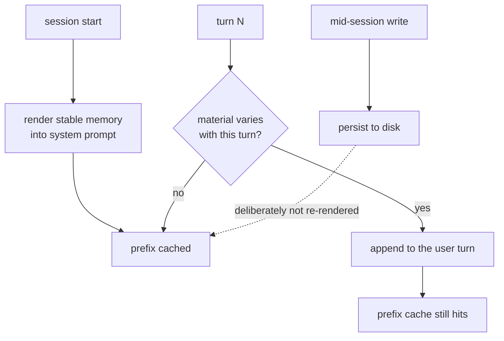

> **This is a cost pattern, and it is here on a narrow argument.** The
> [patterns index](./) declines context-window pruning as a prompt-assembly
> concern rather than a memory one, and that decision stands. This page is the
> part of that territory which is not about token budgets: **where you inject
> memory constrains what your memory system is allowed to be**, and one system
> in the atlas redesigned its entire write path around that constraint rather
> than around anything about recall.

## Intent

Place injected memory according to how often it changes, so that the stable part
of the prompt stays byte-identical between turns and the provider's prefix cache
survives the session.

## The problem

The obvious place to put memory is the system prompt, near the top, where the
model is most likely to attend to it. Every provider that offers prompt caching
keys that cache on an **exact prefix match**. The two facts collide.

A retrieval block is a function of the current message. Put it in the system
prompt and the system prompt differs every turn, so the cached prefix misses on
every request — and the miss is not partial. Everything from the first differing
byte onward is re-processed, which for a memory-augmented agent is usually the
whole prompt.

This is invisible in exactly the way that matters. Retrieval quality is
unaffected, tests pass, and the only signal is the bill. Five reports in this
atlas record a system in this state, and none of the five projects appears to
have noticed:

- [Helm](../../systems/helm/) — *"Prompt-prefix caching is invalidated on every
  turn, by construction."* `INDEX.md` is stable and arrives through an import,
  but `--append-system-prompt` carries `buildPersona(mode) +
  recallMemories(prompt)`, and the recall block is a function of the current
  message.
- [CSM](../../systems/csm/) — the per-turn injection invalidates the prefix cache
  every turn, and the report notes that nothing measures the cost.
- [RisuAI](../../systems/risuai/) — the injected block varies per turn,
  *including randomly*, which defeats caching by construction.
- [SillyTavern](../../systems/sillytavern/) — memory is injected at an unstable
  position rather than in a stable prefix.
- [OpenCode](../../systems/opencode/) — no memory of its own, but everything a
  plugin injects goes through `experimental.chat.system.transform` into the
  system prompt, so the *contract* hands every plugin author this failure.

The cost is not a rounding error, and it compounds with the thing memory systems
are for. The more memory you inject, the larger the prefix you are invalidating.

## The pattern

Sort injected material by volatility and give each class a position that matches:

```text
system prompt (cached prefix)
  ├─ persona, policy, instructions        — changes ~never
  └─ memory INDEX / stable working set    — changes between sessions
─────────────────────────────────── cache boundary
user turn (never cached)
  └─ query-specific recall results        — changes every turn
```

Two shapes implement this, and they differ in what they give up:

**Split by position.** Stable memory stays in the prefix; query-specific recall
moves into the user turn. Nothing is lost — the model sees the same tokens, in a
different envelope. Helm's report notes this arrangement is "one line away" and
that the system's own static channel already demonstrates it.

**Freeze the snapshot.** Render memory into the system prompt once, at session
start, and refuse to update it mid-session. Writes still land on disk
immediately and durably; they simply do not reach the model until the next
session begins.



## Why it works

Caching is a prefix property, so the only thing that matters is *where the first
difference falls*. Moving the volatile block after every stable byte converts a
guaranteed miss into a guaranteed hit without changing what the model reads.

The second-order effect is the interesting one. Once prompt cost is a static,
known quantity, a memory budget becomes enforceable — which is what lets
[Hermes Agent](../../systems/hermes-agent/) take the position almost nothing
else in this atlas takes: memory is **hard-bounded and frozen, because the
prompt cache matters more than completeness.** `MEMORY.md` is capped at 2,200
characters and `USER.md` at 1,375. When an `add` would exceed the cap the write
is *refused*, and the tool returns the current entries with an instruction to
consolidate and retry within the same turn. Compaction is not a background
worker; it is a synchronous obligation handed to the model at the moment of
overflow.

That is a write path, a correction path and a capacity policy all derived from a
caching constraint. It is why this belongs in a memory pattern library rather
than in a prompt-engineering note.

## Tradeoffs

- **Freshness is the price of freezing.** Under the frozen-snapshot shape, a
  memory written at turn 3 is invisible to the model until the next session.
  Hermes accepts this explicitly. If your agent must act on what it just learned,
  take the split-by-position shape instead, which costs nothing in freshness.
- **The bounded variant hands editorial control to the model.** Hermes's refusal
  loop makes the model choose what to discard under time pressure, with no review
  and no record of what was dropped — which is the failure
  [append-only memory audit](../append-only-memory-audit/) exists to prevent.
- **Attention position is not free.** Material moved out of the system prompt and
  into the user turn is in a different position, and whether that changes how the
  model weighs it is not something this atlas has measured.
- **It only pays where caching does.** A local model, a provider without prefix
  caching, or sessions of one or two turns will not repay the restructuring.
- **Splitting has a floor.** If the "stable" block is itself regenerated by a
  nightly consolidation pass, the cache dies once a day rather than once a turn —
  better, but the boundary should be drawn where the regeneration happens, not
  where the taxonomy suggests.

## Seen in the atlas

- **[Hermes Agent](../../systems/hermes-agent/)** — the frozen snapshot, and the
  only system here whose memory *design* follows from the cache constraint.
- **[Memobase](../../systems/memobase/)** — the profile is injected at the front,
  which the report notes is friendlier to prefix caching than the alternative.
- **[Graphify](../../systems/graphify/)** — assembles context in a way the report
  contrasts explicitly with "invalidating a prefix cache on every request".
- **[Helm](../../systems/helm/)**, **[CSM](../../systems/csm/)**,
  **[RisuAI](../../systems/risuai/)**, **[SillyTavern](../../systems/sillytavern/)**
  — the counter-examples, each invalidating on every turn.
- **[OpenCode](../../systems/opencode/)** — the contract-level version: a host
  whose only injection seam is the cache-sensitive one.

Note that [MemOS](../../systems/memos/)'s "activation memory: KV/prefix cache" is
a *different* mechanism — reusing model state rather than positioning text — and
falls under the KV-cache scope boundary in the
[comparative report](../../compare/).

## Tests before relying on it

- Capture the exact bytes of two consecutive requests and diff them. The first
  differing byte is the cache boundary; assert it falls after the stable block.
- Assert a mid-session memory write does not change the system prompt, under the
  frozen shape — and that it *does* reach disk.
- Assert the stable block is byte-identical across turns, including ordering of
  anything assembled from a set or a dict.
- Under the bounded variant, assert a write that exceeds the cap is refused and
  returns the current entries, rather than silently truncating.
- Measure it. Every claim on this page is about a mechanism read in code; no
  system in this atlas publishes a cache hit rate, and the reports say so.
