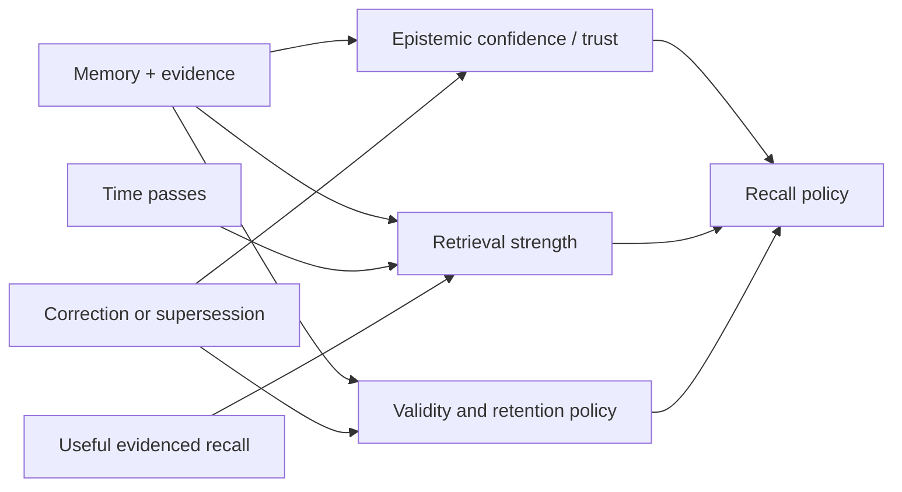

## Intent

Keep stale or low-value memory from dominating recall while allowing useful
memory to remain reachable through repeated, evidenced use.

## The problem

An append-only memory corpus grows without bound. Pure recency ranking buries
durable facts; pure similarity keeps obsolete facts permanently competitive;
hard TTL deletes knowledge on an arbitrary date. Naive reinforcement creates a
different failure: frequently retrieved errors become stronger merely because
the system keeps seeing them.

## The pattern

Separate lifecycle strength from truth and relevance:

Decay only the dimension it is meant to control:

- **Retrieval-strength decay** lowers default reachability.
- **Validity expiry** marks a fact stale or out of date.
- **Retention expiry** authorizes deletion after policy checks.
- **Epistemic confidence** changes only when evidence changes.

Reinforcement should require a meaningful signal: successful task use,
independent corroboration, explicit pinning, or operator feedback. Mere
retrieval is at most a usefulness signal.

Protect verified, pinned, legally retained, and correction/tombstone records
from ordinary pruning. Keep a reactivation path and enough audit history to
explain why strength changed.

## Why it works

The corpus can forget operationally without pretending old means false.
Durable truths remain recoverable, temporary details fade, and popularity
cannot silently promote a claim into verified knowledge. The separate
dimensions also make ranking and deletion policies testable.

## Tradeoffs

Decay rates are domain policy, not universal constants. A short half-life is
useful for transient tool state and harmful for stable preferences or safety
constraints. Reinforcement creates feedback loops if the same ranker controls
both exposure and strength. Soft decay still consumes storage; hard pruning
loses reversibility and may violate audit or correction requirements.

For small bounded corpora, explicit archive and review may be simpler and safer
than continuous scoring.

## Cost to adopt

**Build:** a strength field separate from confidence, a decay function, and
bounded reinforcement with a recorded reason.

**Forces elsewhere:** ranking becomes time-dependent, so results are no longer
reproducible across runs and any benchmark must pin a clock. Reinforcement
driven by retrieval creates a feedback loop that needs an explicit damper.

**Ongoing:** decay rates are per memory kind, and getting them wrong is
invisible — memory that faded too fast produces no error, just a worse answer.

**Skip it if** your store is small. Decay solves a crowding problem you may not
have.

## Seen in the atlas

**[Mnemopi](../../systems/mnemopi/) has the most considered forgetting model
here, and the reason is a second parameter.** Every other decaying system on this
page picks a rate: an exponential half-life, an Ebbinghaus curve, a decay
constant. Mnemopi gives each of fourteen memory types a Weibull `k` (shape) and
`eta` (scale, in hours) — `profile` at k=0.3/eta=8760, `relationship` at
0.35/8760, `preference` at 0.4/4380, `fact` at 0.8/720, `context` at 0.85/360,
`observation` at 0.9/480 — with a comment stating the intent: higher eta is
slower decay, lower k is more long-term retention.

The shape is what a single rate cannot express. A `k` below 1 gives a heavy tail:
a profile fact fades slowly *and keeps fading slowly*, so it never quite leaves,
while `observation` at k=0.9 approaches memoryless and is gone on schedule. That
is the difference between "how fast" and "how stubbornly", and it is the
instrument the [Helm](../../systems/helm/) report is asking for when it says a
preference should not fall down the ranking for being old while an event should,
and that one ranking function for both is usually an unexamined decision.

The cost is twenty-eight hand-set parameters with no committed derivation, and
one of them is wrong in a way the model itself reveals: `commitment` is given
k=1.0, exactly exponential, so an outstanding obligation decays memorylessly
rather than persisting until it is discharged.

Three systems added since this page was written show what the pattern looks like
done carefully, and one shows the failure it warns about.

[Redis Agent Memory Server](../../systems/redis-agent-memory-server/) has the
most developed retention policy in the atlas. `select_ids_for_forgetting`
combines TTL and inactivity so a recently-used memory survives its nominal age
**unless** it exceeds a hard-age multiple (default 12×), honours pinning and
per-type allowlists, and prunes to a budget using a recency composite with **two
half-lives** — 7 days on last access, 30 on creation. Separating "recently used"
decay from "recently learned" decay is the refinement most systems miss.

[Mercury](../../systems/mercury-agent/) makes the same distinction in the schema
rather than the policy: `confidence`, `importance`, and `durability` are three
independent fields. How much a memory matters and how long it should last are
different questions, and one column cannot answer both. Mercury also keeps a
`subconscious` tier — retained but below active recall — so demotion is available
where most systems only have deletion.

[Daimon](../../systems/daimon/) contributes the inversion this page has been
missing. Its weight is `importance/10 × tiered recency × per-type linear decay`,
and one type is exempt from the usual conclusion: an open question past a
fourteen-day expected lifespan gets an **escalating** boost, `age**1.5 / 100`,
capped so a fresh item still outranks an escalated one. For an open loop,
staleness means *unresolved*, not *irrelevant*, and burying it is exactly wrong.
Any system with a per-type decay table should ask which of its types this
applies to; most have at least one.

Two smaller guards in the same file generalize. A `first_seen` stamp further in
the future than ordinary clock skew explains is treated as *neutral* rather than
maximally fresh, so a teammate's mis-stamped item cannot outrank genuine local
work — a bug that only exists once memory crosses machines. And decay is floored
rather than allowed to reach zero, so ordering may bury an item but arithmetic
never erases it.

[OpenViking](../../systems/openviking/) computes hotness as
`sigmoid(log1p(active_count)) * exp(-ln2 · age / half_life)` and states plainly
that it blends into *search ranking*. It never touches correctness — the right
side of the line. Its remaining risk is the one this pattern names: `active_count`
increments on retrieval, so frequency is self-reinforcing, and a uniform 7-day
half-life applies to every memory kind.

[Holographic](../../systems/holographic/) is the counterexample, and it is worth
studying because each piece looks reasonable alone. `fact_feedback` moves a single
`trust_score` by +0.05 or −0.10; that same score is multiplied into relevance
*and* gates retrieval at a `min_trust` floor of 0.3. From a default of 0.5, three
unhelpful ratings put a fact below every default retrieval path — permanently,
with no tombstone and no record that suppression occurred. Reinforcement became
deletion because reachability and belief were the same number.

[Helix AGI](../../systems/helix-agi/) is the only system here that documents
finding this loop in its own running store and cutting it. A belief's mass
originally included its relation count; related beliefs get co-injected, and
co-injection creates more relations, so the comment in `memory/belief_store.py`
records the cycle it produced — *"relations → mass ↑ → gravity ↑ → co-injection →
more relations"* — and the fix, which is to leave cluster gravity to emerge from
spatial density instead of inflating an individual score. The general lesson is
narrow and reusable: **a reinforcement signal that is itself caused by
reachability is a feedback loop, not a measurement**, and the way to find one is
to ask which of your inputs the previous ranking already decided.

[Verel](../../systems/verel/) remains the reference for the separation itself.
[Atomic Agent](../../systems/atomic-agent/) suggests the safest implementation
shape: keep votes as append-only events and derive the score, so a reinforcement
rule can be changed or recomputed rather than baked irreversibly into a column.

[Memora](../../systems/memora/) sits on the correct side of the line and still
shows the hazard: `calculate_importance(created_at, base_importance,
access_count)` is a ranking signal rather than a confidence, but retrieval
increments `access_count`, which raises the score, which makes future retrieval
more likely — the self-amplifying loop with no counterweight visible.

[LoongFlow](../../systems/loongflow/) is the one system here that answers
reinforcement collapse structurally rather than by tuning a rate. Its
evolutionary memory samples from a Boltzmann distribution over scores at a
temperature raised when the population's measured diversity falls, so a store
converging on the same few items automatically loosens selection until variety
returns. It is a narrow instance — recall there feeds a search loop, not belief —
but it is worth noting that the usual fix for reinforcement runaway is a decay
constant, and this one is a feedback controller.

[NOOA Memory](../../systems/nooa-memory/) is the only system here that closes the
reinforcement loop rather than noting it. Retrieval bumps a `strength` counter
that slows Ebbinghaus decay and leaves `confidence` untouched — rehearsal is not
belief — and its paper adds the part that matters: "**injected memories are not
reinforced, so what the harness surfaces does not distort the usage signal**".
Spontaneous injection runs at a fixed cadence of about one per turn and does not
count as use. A system whose ranker reinforces whatever the ranker chose to show
is measuring its own decisions and calling it usage; separating deliberate reads
from injections is the cheap fix, and it is a one-line distinction at the call
site.

[Helm](../../systems/helm/) keeps the two signals apart correctly and then
damages a third. Retrieval cannot raise confidence — it only slows loss:
`log1p(access_count)` is subtracted from the count of stale weeks before the
`0.9^weeks` multiplier applies, so a fact the agent keeps reaching for holds what
it has and gains nothing. Only never-corroborated rows decay at all, and rows
sourced from the persona document are exempt outright. That is the separation
this page asks for, at the cost of one logarithm.

The flaw is in the bookkeeping. The same pass advances `last_seen` by the stale
weeks it just consumed, purely so the next nightly run does not re-apply an
identical step. It works, and it means `last_seen` no longer records when the
fact was last seen — including for the `unsure` query that orders the
weakly-evidenced list by exactly that column. If a decay pass needs to remember
what it has already done, give it `last_decayed` and leave the observation
timestamp alone.

Helm also shows the reinforcement signal being collected where nobody would look
for it: `access_count` is incremented inside the recall verb, so the background
loop that calls recall to score whether its own thought is worth interrupting the
owner about reinforces every fact it touches on the way past. A read that writes
should be documented as one — Helm's tool registry declares
`"side_effects": "none"` for it.

[Graphify](../../systems/graphify/) uses decay for something most instances here
do not: **deciding a contradiction.** Each outcome contributes `sign × weight`
where the sign is `+1` for `useful` and `−1` for `dead_end` or `corrected`, and
the weight halves every 30 days. A source carrying both signs is classified
`contested` by the presence of both — the classification is not a vote — and only
then does the accumulated score decide whether it reads as "useful", "dead end"
or "even". So a fresh dead end outweighs a months-old success without any
conflict-resolution logic existing at all: the half-life *is* the resolution
rule.

The reason it stays honest is that decay here never touches epistemic standing.
A decayed score cannot demote `preferred` to `tentative`, because that
classification comes from a count of distinct results, not from the score. Age
changes which contested source sorts first; it cannot make a corroborated source
uncorroborated. That is the separation this pattern keeps asking for, achieved by
computing the two things from different columns rather than by discipline.

One implementation detail worth stealing outright: the score is rounded to nine
digits before comparison, with a comment explaining that C's `pow` can differ in
the last ULP across platforms and that the rounding is what keeps sort order and
the contested verdict stable. A decay function whose output feeds a *classification*
needs to be deterministic across machines in a way one that only feeds a ranking
does not.

[memory-lancedb-pro](../../systems/memory-lancedb-pro/) adds the signal this
pattern usually lacks: a *negative* one that is not just the absence of a
positive. `computeTier1Patch` counts injections that were never confirmed as
used; three of them suppress the memory from auto-recall for thirty minutes, and
twenty-four hours without an injection resets the counter on the stated reasoning
that "this memory is being needed again". The threshold is deliberately not
configurable and the comment explains the distinction — three strikes is "a
behavioral design choice that should hold across deployments" while the windows
around it are operational tuning. Only the automatic injection path feeds the
counters, so a memory the user fetches deliberately never accrues strikes.

[ClawMem](../../systems/clawmem/) is the cautionary instance, and the measurement
is committed. Its composite score blended recency decay, content-type half-lives,
co-activation reinforcement, confidence, quality and revision count — and an
offline eval against hand-labelled gold found raw cosine ranking 16 of 19 judged
targets first (MRR 0.912) where the composite managed 1 of 19 (0.307), with the
composite's own `minScore` filtering 14 of 19 out. The project's response was to
demote every metadata signal to an exact-tie-break on the direct routes. The
generalisable argument is in the file header: a decay-and-reinforcement blend is
only safe where its terms are smaller than the margin separating a right answer
from a wrong one.

## Implementation checklist

- Store retrieval strength separately from confidence and trust.
- Assign decay policy by memory kind, scope, and validity, not one global rate.
- Record the reason and actor for every reinforcement.
- Do not reinforce a memory the system itself chose to inject.
- Bound reinforcement and prevent one retrieval loop from self-amplifying.
- Protect rejected-value tombstones and correction history from decay.
- Mark stale before deleting when reversibility matters.
- Expose last-evaluated time and effective strength to operators.

## Tests to require

- Stable facts remain reachable after long simulated time.
- Expired transient state stops entering normal context.
- Repeated retrieval cannot increase epistemic confidence.
- Reinforcement saturates and cannot form an unbounded feedback loop.
- Pinned, verified, rejected, and audit records survive ordinary pruning.
- Clock jumps, backfills, and timestamp errors fail safely.
- Rebuilds reproduce effective strength from durable state or audit events.

## Related patterns

- [Trust-state machine](../trust-state-machine/)
- [Bi-temporal fact validity](../bi-temporal-fact-validity/)
- [Rejected-value tombstone](../rejected-value-tombstone/)
- [Append-only memory audit](../append-only-memory-audit/)
