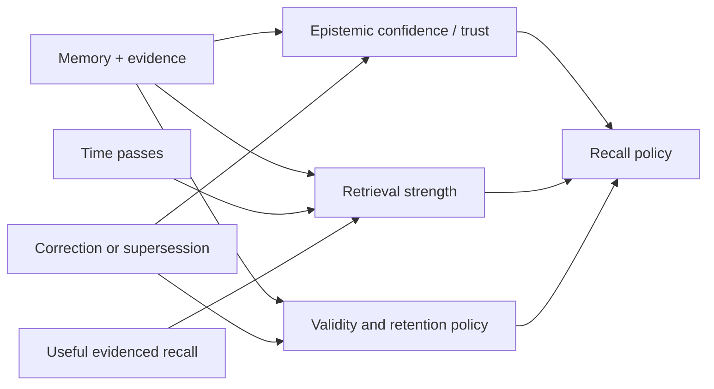

## Intent

Keep stale or low-value memory from dominating recall while allowing useful
memory to remain reachable through repeated, evidenced use.

## The problem

An append-only memory corpus grows without bound. Pure recency ranking buries
durable facts; pure similarity keeps obsolete facts permanently competitive;
hard TTL deletes knowledge on an arbitrary date. Naive reinforcement creates a
different failure: frequently retrieved errors become stronger merely because
the system keeps seeing them.

## The pattern

Separate lifecycle strength from truth and relevance:

Decay only the dimension it is meant to control:

- **Retrieval-strength decay** lowers default reachability.
- **Validity expiry** marks a fact stale or out of date.
- **Retention expiry** authorizes deletion after policy checks.
- **Epistemic confidence** changes only when evidence changes.

Reinforcement should require a meaningful signal: successful task use,
independent corroboration, explicit pinning, or operator feedback. Mere
retrieval is at most a usefulness signal.

Protect verified, pinned, legally retained, and correction/tombstone records
from ordinary pruning. Keep a reactivation path and enough audit history to
explain why strength changed.

## Why it works

The corpus can forget operationally without pretending old means false.
Durable truths remain recoverable, temporary details fade, and popularity
cannot silently promote a claim into verified knowledge. The separate
dimensions also make ranking and deletion policies testable.

## Tradeoffs

Decay rates are domain policy, not universal constants. A short half-life is
useful for transient tool state and harmful for stable preferences or safety
constraints. Reinforcement creates feedback loops if the same ranker controls
both exposure and strength. Soft decay still consumes storage; hard pruning
loses reversibility and may violate audit or correction requirements.

For small bounded corpora, explicit archive and review may be simpler and safer
than continuous scoring.

## Seen in the atlas

[Verel](../../systems/verel/) is the clearest implementation: recall can
reinforce `retrieval_strength` while confidence and trust remain separate;
decay affects reachability, and verified, rejected, or pinned records receive
special lifecycle treatment. [agentmemory](../../systems/agentmemory/) includes
TTL, retention, strength, and an optional decay pipeline, though its broad
policy surface requires careful configuration. [Honcho](../../systems/honcho/)
tracks repeated derivation and blends recent with reinforced observations.
[Swafra](../../systems/swafra/) is the useful counterexample: unconditional age
decay can penalize durable facts even when they are still current.
[Mem0](../../systems/mem0/) documents temporal/decay behavior whose OSS paths
remain platform-only, illustrating why lifecycle claims must be checked against
the actual deployment.

## Implementation checklist

- Store retrieval strength separately from confidence and trust.
- Assign decay policy by memory kind, scope, and validity, not one global rate.
- Record the reason and actor for every reinforcement.
- Bound reinforcement and prevent one retrieval loop from self-amplifying.
- Protect rejected-value tombstones and correction history from decay.
- Mark stale before deleting when reversibility matters.
- Expose last-evaluated time and effective strength to operators.

## Tests to require

- Stable facts remain reachable after long simulated time.
- Expired transient state stops entering normal context.
- Repeated retrieval cannot increase epistemic confidence.
- Reinforcement saturates and cannot form an unbounded feedback loop.
- Pinned, verified, rejected, and audit records survive ordinary pruning.
- Clock jumps, backfills, and timestamp errors fail safely.
- Rebuilds reproduce effective strength from durable state or audit events.

## Related patterns

- [Trust-state machine](../trust-state-machine/)
- [Bi-temporal fact validity](../bi-temporal-fact-validity/)
- [Rejected-value tombstone](../rejected-value-tombstone/)
- [Append-only memory audit](../append-only-memory-audit/)
