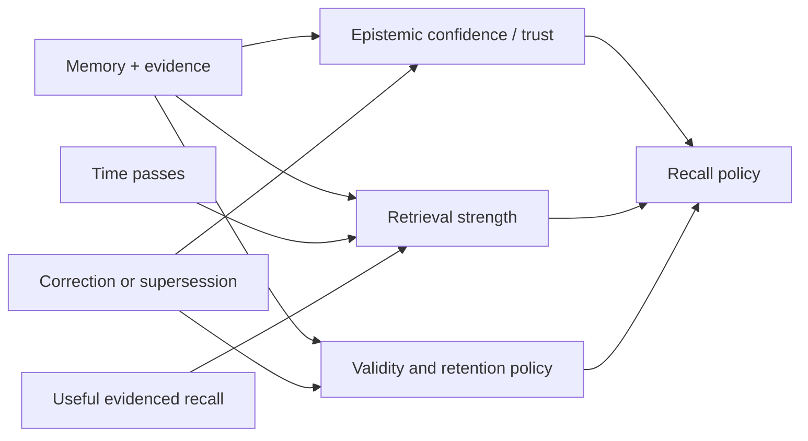

## Intent

Keep stale or low-value memory from dominating recall while allowing useful
memory to remain reachable through repeated, evidenced use.

## The problem

An append-only memory corpus grows without bound. Pure recency ranking buries
durable facts; pure similarity keeps obsolete facts permanently competitive;
hard TTL deletes knowledge on an arbitrary date. Naive reinforcement creates a
different failure: frequently retrieved errors become stronger merely because
the system keeps seeing them.

## The pattern

Separate lifecycle strength from truth and relevance:

Decay only the dimension it is meant to control:

- **Retrieval-strength decay** lowers default reachability.
- **Validity expiry** marks a fact stale or out of date.
- **Retention expiry** authorizes deletion after policy checks.
- **Epistemic confidence** changes only when evidence changes.

Reinforcement should require a meaningful signal: successful task use,
independent corroboration, explicit pinning, or operator feedback. Mere
retrieval is at most a usefulness signal.

Protect verified, pinned, legally retained, and correction/tombstone records
from ordinary pruning. Keep a reactivation path and enough audit history to
explain why strength changed.

## Why it works

The corpus can forget operationally without pretending old means false.
Durable truths remain recoverable, temporary details fade, and popularity
cannot silently promote a claim into verified knowledge. The separate
dimensions also make ranking and deletion policies testable.

## Tradeoffs

Decay rates are domain policy, not universal constants. A short half-life is
useful for transient tool state and harmful for stable preferences or safety
constraints. Reinforcement creates feedback loops if the same ranker controls
both exposure and strength. Soft decay still consumes storage; hard pruning
loses reversibility and may violate audit or correction requirements.

For small bounded corpora, explicit archive and review may be simpler and safer
than continuous scoring.

## Seen in the atlas

Three systems added since this page was written show what the pattern looks like
done carefully, and one shows the failure it warns about.

[Redis Agent Memory Server](../../systems/redis-agent-memory-server/) has the
most developed retention policy in the atlas. `select_ids_for_forgetting`
combines TTL and inactivity so a recently-used memory survives its nominal age
**unless** it exceeds a hard-age multiple (default 12×), honours pinning and
per-type allowlists, and prunes to a budget using a recency composite with **two
half-lives** — 7 days on last access, 30 on creation. Separating "recently used"
decay from "recently learned" decay is the refinement most systems miss.

[Mercury](../../systems/mercury-agent/) makes the same distinction in the schema
rather than the policy: `confidence`, `importance`, and `durability` are three
independent fields. How much a memory matters and how long it should last are
different questions, and one column cannot answer both. Mercury also keeps a
`subconscious` tier — retained but below active recall — so demotion is available
where most systems only have deletion.

[OpenViking](../../systems/openviking/) computes hotness as
`sigmoid(log1p(active_count)) * exp(-ln2 · age / half_life)` and states plainly
that it blends into *search ranking*. It never touches correctness — the right
side of the line. Its remaining risk is the one this pattern names: `active_count`
increments on retrieval, so frequency is self-reinforcing, and a uniform 7-day
half-life applies to every memory kind.

[Holographic](../../systems/holographic/) is the counterexample, and it is worth
studying because each piece looks reasonable alone. `fact_feedback` moves a single
`trust_score` by +0.05 or −0.10; that same score is multiplied into relevance
*and* gates retrieval at a `min_trust` floor of 0.3. From a default of 0.5, three
unhelpful ratings put a fact below every default retrieval path — permanently,
with no tombstone and no record that suppression occurred. Reinforcement became
deletion because reachability and belief were the same number.

[Verel](../../systems/verel/) remains the reference for the separation itself.
[Atomic Agent](../../systems/atomic-agent/) suggests the safest implementation
shape: keep votes as append-only events and derive the score, so a reinforcement
rule can be changed or recomputed rather than baked irreversibly into a column.

[Memora](../../systems/memora/) sits on the correct side of the line and still
shows the hazard: `calculate_importance(created_at, base_importance,
access_count)` is a ranking signal rather than a confidence, but retrieval
increments `access_count`, which raises the score, which makes future retrieval
more likely — the self-amplifying loop with no counterweight visible.

[LoongFlow](../../systems/loongflow/) is the one system here that answers
reinforcement collapse structurally rather than by tuning a rate. Its
evolutionary memory samples from a Boltzmann distribution over scores at a
temperature raised when the population's measured diversity falls, so a store
converging on the same few items automatically loosens selection until variety
returns. It is a narrow instance — recall there feeds a search loop, not belief —
but it is worth noting that the usual fix for reinforcement runaway is a decay
constant, and this one is a feedback controller.

## Implementation checklist

- Store retrieval strength separately from confidence and trust.
- Assign decay policy by memory kind, scope, and validity, not one global rate.
- Record the reason and actor for every reinforcement.
- Bound reinforcement and prevent one retrieval loop from self-amplifying.
- Protect rejected-value tombstones and correction history from decay.
- Mark stale before deleting when reversibility matters.
- Expose last-evaluated time and effective strength to operators.

## Tests to require

- Stable facts remain reachable after long simulated time.
- Expired transient state stops entering normal context.
- Repeated retrieval cannot increase epistemic confidence.
- Reinforcement saturates and cannot form an unbounded feedback loop.
- Pinned, verified, rejected, and audit records survive ordinary pruning.
- Clock jumps, backfills, and timestamp errors fail safely.
- Rebuilds reproduce effective strength from durable state or audit events.

## Related patterns

- [Trust-state machine](../trust-state-machine/)
- [Bi-temporal fact validity](../bi-temporal-fact-validity/)
- [Rejected-value tombstone](../rejected-value-tombstone/)
- [Append-only memory audit](../append-only-memory-audit/)
