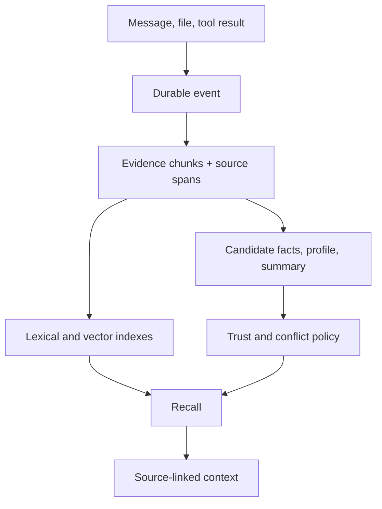

## Intent

Keep the material from which a memory was derived. Treat compact facts, profiles, summaries, and graph relations as interpretations that can be inspected and recomputed.

## The problem

Extraction is lossy. A short claim can omit qualifiers, invert who said what, flatten uncertainty, or preserve a model hallucination. If the source event is discarded, correction becomes guesswork and a new extractor cannot repair old state.

## The pattern

Write evidence first, then derive memory:

Evidence needs stable identity, scope, actor, timestamp, source location, and content hash. Derived records reference evidence IDs rather than copying an unattributed excerpt into a mutable field.

Retrieval should retain a direct path to evidence. Derived structures may boost or organize evidence, but should not make the original unreachable.

## Why it works

- Wrong memories can be explained and corrected.
- Extractors and embedding models can be upgraded without losing the corpus.
- Multiple interpretations can coexist over one source event.
- Users can distinguish “the source said this” from “the system inferred this.”
- Deletion can enumerate raw and derived artifacts explicitly.

## Tradeoffs

Raw evidence increases storage, privacy exposure, and retrieval noise. Evidence retention needs access control, retention windows, source-aware deletion, and bounded context assembly. Keeping a source is not the same as proving it is true; provenance answers “where did this come from?”, not “should I believe it?”

## Cost to adopt

**Build:** an append-only evidence store, stable references from derived records
back to it, and a rebuild path that can regenerate derivations from evidence.

**Forces elsewhere:** storage grows with raw volume rather than with distilled
volume, and the evidence store inherits the strictest retention and privacy
requirements in the system — deleting a user now means deleting from evidence
*and* everything derived from it.

**Ongoing:** the rebuild path decays unless exercised, so it needs to be run
regularly rather than kept for emergencies.

**Skip it if** the raw material is already durable somewhere you control (a
transcript store, a git history) and you can reference it rather than copying
it.

## Seen in the atlas

[sift-kg](../../systems/sift-kg/) is the pattern implemented without being
named, and the case that shows what it does not cover. Extraction output is kept
per document under `extractions/`, every entity node carries `source_documents`,
every relation carries an `evidence` quote, and `sift build` reconstructs the
graph from that layer rather than mutating it — so a bad extraction is
traceable and the derived store is honestly disposable. The gap is that the
*corrections* are not part of the retained layer: merges and rejected relations
are applied to the rebuilt artifact, and the rebuild reads only the extractions,
so every human judgement is undone by the command that grows the corpus.
[Corbell](../../systems/corbell/) has the same shape one level up — a `Decision`
lifted from a team's ADRs keeps its `source_file`, and the flag recording which
documents a person approved is overwritten by the next scan.

**The rule both of them establish: retaining evidence makes a projection safe to
rebuild, and it makes nothing else safe.** A decision about the projection has to
live in the rebuild's input or it is a scheduled undo — which is a test worth
requiring: apply a correction, run the regeneration, assert the correction held.

[nanobot](../../systems/nanobot/) states the principle more plainly than this
page does. Its documentation says of the append-only summary archive:
*"It is not the final memory. It is the material from which final memory is
shaped."* The layout enforces it — `memory/history.jsonl` holds evidence,
`SOUL.md`/`USER.md`/`memory/MEMORY.md` hold belief, and only the Dream pass moves
material from one to the other.

[CowAgent](../../systems/cowagent/) gets the same separation from the calendar:
conversations become dated `memory/YYYY-MM-DD.md` files, and only distillation
turns those into `MEMORY.md`. The daily files remain. Bucketing by day is cruder
than a cursor and considerably easier for a human to inspect — "what did it learn
on the 14th?" is answerable by opening a file.

[GenericAgent](../../systems/genericagent/) keeps raw sessions beneath three
distilled layers in `L4_raw_sessions/`, archived on a 12-hour cron. Beside the
retention it states an admission rule as an axiom: *"No Execution, No Memory"* —
nothing enters durable memory unless it came from a successful tool call, with
model guesses, unexecuted plans, and unverified assumptions explicitly forbidden.

[AIMAOS](../../systems/aimaos/) makes the same separation structural in the
cheapest way available: raw conversation chunks are their own storage category,
and that category is listed in `DECAY_EXEMPT_CATEGORIES` so every pruning and
confidence rule skips it by construction. The comment states the invariant —
raw chunks are *"the raw source material that nightly review forms beliefs FROM —
pruning one silently deletes history no later pass can recover"*. **A decay pass
cannot forget to exempt a category it was never given**, which is a stronger
guarantee than a `is_evidence` flag every future query has to remember to check.

[Helix AGI](../../systems/helix-agi/) has the separation and shows what it costs
when only half of it is wired. Memories live in an append-only journal and
beliefs are derived from them nightly, with `memory_refs` on every belief and a
`get_justification_chain` that walks back to the material — real provenance, of
the kind this page asks for. But **the evidence layer never learns about a
deletion**: removing a belief rewrites its category file and clears the runtime
indexes while the journal keeps the content, and `preconscious._resolve_memory_content`
falls back to the journal when the belief store misses. Keeping the evidence is
what makes a wrong belief repairable; it is also what makes a *deleted* belief
recoverable, and those are the same property viewed from two sides. **A system
that retains evidence owes a deletion path that reaches it** — otherwise the
pattern's benefit and its worst failure are the same mechanism.

[MemPalace](../../systems/mempalace/) is a verbatim-first design
— extracted structures are navigation aids, drawers are authoritative.
[Cognee](../../systems/cognee/) retains source data below its projections and can
rebuild them; [Graphiti](../../systems/graphiti/) keeps episodes behind edges;
[Hindsight](../../systems/hindsight/) links observations to source facts;
[Honcho](../../systems/honcho/) derives representations from a retained message
stream; [Basic Memory](../../systems/basic-memory/) keeps human-authored Markdown
canonical.

The recurring failure is not losing evidence but **failing to link back to it**.
nanobot's durable claims do not cite the `history.jsonl` cursors that produced
them; CowAgent's `MEMORY.md` entries do not name their daily file;
GenericAgent's action-verified axiom leaves no record of the tool call that
justified a write. Evidence retained but unlinked supports recomputation and not
explanation.

[MemMachine](../../systems/memmachine/) is the plainest demonstration that the
link is cheap. Every derived `SemanticFeature` carries
`metadata.citations: Sequence[EpisodeIdT]`, written by `_apply_commands` on each
ADD, and the episodes are retained, so the citation resolves to text rather than
to a dangling id. One array column converts a store that can recompute into one
that can explain. Two cautions come with it, both visible in the code. Retrieval
takes a `load_citations` flag that defaults off, so provenance is available and
not automatic — a caller who never sets it gets the same unlinked experience as
the systems above. And every consolidation pass unions the citations of the
features it merges, so a long-lived feature ends up citing dozens of episodes:
the link never breaks, it just stops being a pointer and becomes a bibliography.
If you adopt this, keep the pre-merge rows or record which input contributed
which clause.

[Daimon](../../systems/daimon/) is the atlas's counter-example to that failure,
and it gets there without storing the evidence at all. It keeps no copy of the
transcript: a checkpoint carries a hash of the source bytes, and each verbatim
item carries the quote plus the id of the host message it came from. The link is
the whole mechanism, and it is **checked rather than recorded** — at write time
the quote is matched against the cited message, a resolvable-but-mismatched
binding is *dropped* rather than stored as false provenance, and a quote found
nowhere in the transcript costs the item its trust class.

That is a different bargain from the one this page describes, and worth naming
as its own option. Referencing evidence instead of copying it keeps the store
small, keeps the strictest privacy obligations with whoever already holds the
transcript, and makes the link falsifiable at the moment it is created. What it
gives up is exactly what this page's "Skip it if" clause anticipates: when the
host rotates its transcripts, the derivation can no longer be rebuilt or
re-checked, and the verification stamp on the item becomes the only surviving
evidence that a check ever happened. Reference evidence you control; copy
evidence you do not.

[MIRIX](../../systems/mirix/) is a cheap instance to copy: one `raw_memory`
table holding the unprocessed context string, embedded and searchable in its own
right, beside six typed derived tables. No versioning, no lineage graph — just the
source kept where a bad extraction cannot destroy it. What it does not do is link
the derived rows back to it, so the evidence is searchable but not attributable.

[Memobase](../../systems/memobase/) is the deliberate inversion, and it is the
useful counterexample because the reasoning is sound. `persistent_chat_blobs`
defaults to `False`, so the source transcript is hard-deleted from Postgres once
the profile is written. For a service holding other people's conversations that is
a defensible privacy posture — and it means the profile, which is a lossy LLM
derivation rewritten in place, is the only copy there has ever been. This pattern
and data minimization are in genuine tension; Memobase is where the price of
choosing the other side is clearest.

[CSM](../../systems/csm/) has the provenance half that Helm, below, lacks, and adds
a gate the rest of this section does not: **evidence diversity, not just evidence count.** A
promotion candidate carries `source_packet_ids` pointing back to rows in
`experience_packets`, and `BeliefPromotionEngine` joins those ids to
`experience_packets.session_id` and counts *distinct sessions* before promoting.
That separates a pattern from a loop — one runaway session can reinforce the
same candidate fifty times and still be a single observation, which a threshold
on raw occurrences reads as overwhelming evidence.
Each decision also carries a `thresholdChecks` object recording
actual-versus-required for all five gates, so a promotion report explains its own
refusals; and a candidate with any contradiction returns `needs_review` rather
than a silent skip.

Three things blunt it at the pinned commit. The engine ships **disabled and
dry-run by default**, and `minSessions` defaults to `1`, which makes the gate
that distinguishes this implementation a no-op until an operator raises it. A
threshold whose default value disables it is a design that has been thought
through and then not committed to — and the number to ship is the one that makes
the mechanism do something.

The third is worse and generalizes further. The parallel belief store this feeds
declares `candidate | promoted | rejected | stale`, the injected beliefs layer
admits only `promoted`, and **no code path writes `promoted`** — so the evidence
chain is built, maintained, decayed and contradicted, and terminates in a state
nothing can enter. Evidence-before-belief has a last mile that is easy to leave
unbuilt precisely because the interesting work is upstream of it: if you build
the ladder, commit a test that something can climb it.

**[Claude Self-Reflect](../../systems/claude-self-reflect/) keeps the evidence in a form a later pass can re-check rather than re-derive.** Its `witness_ledger` is insert-and-query only by module contract — *"a witness that no longer holds is superseded by inserting a NEW row … never by mutating or removing the old one"* — and each row is a BLAKE3 stamp of a symbol span anchored to a commit oid. The belief layered on top, a `witness_verdicts` event saying an anchor is obsolete, superseded or reinstated, is a pure function of those stamps and git commit-graph ancestry, so any reader can recompute it, and the verdict carries the commit that proves it into the search-facing annotation. The raw material is never consumed either: the transcripts stay where the harness wrote them and a lost database is rebuilt by re-import. What it does not keep is the other direction — a `<private>` tag applied after the fact cannot reach a chunk already stored, because nothing in the tree deletes one.

[Signet AI](../../systems/signetai/) enforces the separation in the schema and then again at the write gate. A migration splits rows into episodic evidence — anything not produced by the daemon's own derived source types — and derived state, stating that saves are *"immutable EPISODIC evidence"* and that *"Only Dreaming derives semantic state from episodic rows"*. The MCP store tool's own description repeats it to the model, adding that a structured payload is *"retained alongside the content as evidence but is not applied to the graph from this tool"*. The gate is in code, not the prompt: `citeEvidence` resolves each operation's quote and source ref against the episodic store, scoped by agent, and requires the stored content to contain the quote; `validateRequestBeforeWrites` refuses the whole batch on the first citation that does not resolve. What distinguishes it from the other instances here is the refusal ledger — the exclusion row records the failure with a class of `quote_mismatch`, `scope_mismatch`, `source_projection` or `incomplete_transcript`, a retry count and a requeue timestamp, so an ungrounded belief is a work item rather than a silence.

[elizaOS](../../systems/elizaos/) carries the strongest version of the backward
link this page asks for, and closes the loop the others leave open. Every
extracted fact stores `extractionEvidenceIds` — which messages produced it — and
`extractionSourceRevisions`, a map from source message id to **the revision that
was read**. That second field is what turns provenance into a mechanism rather
than a record: `reviewChangedExtractionSources` compares each fact's stored
revisions against the current ones and marks any fact whose sources were edited
or removed `extractionReviewRequired: true`, then a reconciliation pass sets
`extractionStatus: "source_invalidated"`, stamps the reconciliation id and the
changed source ids, and adds those sources to a reprocess queue. A read-side
predicate, `isActiveMemoryEvidence`, then withholds the fact from the FACTS
provider, from the long-term memory service and from the write-time dedupe pool.
So a belief whose evidence stopped saying what it said is out of the prompt
without anybody noticing it was wrong, and the source is queued to be read
again.

Two details are worth copying beside the shape. The retirement write throws a
typed error rather than continuing — *"Derived fact could not be retired"* — so a
failed invalidation is loud instead of leaving a stale belief live. And a
historical backfill marked `extractionBackfill` attaches provenance to a
rediscovered row **without** treating old evidence as reconfirmation, which is
the distinction between learning where a belief came from and deciding it is
still true.

Where it stops is the value. Retirement is keyed on the row, and the write-time
dedupe opens its loop with `if (!isActiveMemoryEvidence(candidate)) continue;`,
so a retired claim does not block the identical text being written again as a
new fact — see [rejected-value tombstone](../rejected-value-tombstone/).

### Related: admission gates rather than evidence

These decide what may become a belief — a shared derivation, a confirmation turn,
a confidence cap, a provenance class — rather than keeping the material a belief
came from. They sit beside the pattern, not inside it.

[Atomic Agent](../../systems/atomic-agent/) links two derivations to each other
rather than a derivation to its source: a lesson and its procedure are derived
from the **same consolidator cluster** in one LLM call, so the how-to and the why cannot drift apart.

[Nova AI](../../systems/nova-ai/) separates a parse from a belief with no model
anywhere in the system, which makes the boundary unusually easy to see. A
sentence parsed into a candidate relation is held in a single `pending_relation`
and is **not stored**; it becomes a belief only when the user answers "ja" to a
question asked in plain language — *"Mag ik onthouden dat 'X' is een soort van
'Y'?"* — with the sense disambiguated first, by number, if the word has more than
one. An unparseable answer re-asks rather than defaulting. Because there is no
extractor to trust or distrust, the pattern here is not a defence against a
model's confidence; it is just the recognition that a parse and a belief are
different objects, and it costs one conversational turn taken at the moment the
user still has the context to answer.

[Helm](../../systems/helm/) has the belief half of this page and not the evidence
half, and the split is worth studying. The belief side is right: a write
tagged `--source observed` is capped at 0.7 confidence regardless of what the
caller asked for, unless it passes `force`, and rises 0.05 each time the same
value is written again, so a single sighting cannot be recorded as certain.
Nothing checks that a repeat is independent: any write of the same kind, key and
value increments `evidence_count`. That is the whole gate, in about
fifteen lines of arithmetic on a SQLite row.

The evidence side is missing, and the consequence is precise. Episodes are
retained, but no fact links to the episodes that produced it — the `links` table
that could express it is created and never written. So a distilled row reading
`mentioned in 5 episodes` is a claim about evidence that cannot name any of it,
and a fact whose confidence has ratcheted to 0.9 across five corroborations
cannot be audited back to a single one of them. Corroboration is the affordable
half of this pattern and provenance is the load-bearing half: without it,
repeated exposure to the same wrong value is indistinguishable from evidence,
and a bad belief can be raised but not traced.

[Ouroboros](../../systems/ouroboros-agent-os/) supplies the rule this pattern
usually leaves implicit: **not all evidence is allowed to become a belief.** Its
interview answers arrive with an advertised prefix, and
`classify_answer_provenance` settles at the point of entry whether an answer is a
decision the caller *made* or a fact the caller *adopted* — `[from-code]`,
`[from-repo]`, `[from-research]`, `[from-data]`. An adopted fact is evidence in
the fullest sense of this page and is deliberately **withheld from the slot
requirements are extracted from**, while staying intact in the question slot,
because sharpening the next question is what collecting it was for. The rule is
scoped per role rather than per string, so the same text plays both parts
without the redaction destroying the second one.

Two details make it transferable. The classification is **decided once and
carried as a typed field** rather than re-derived per consumer, and the module
names the drift that motivated it — a second classifier in the same repository
reads `[from-research]` as human. And the withholding is enforced structurally
rather than in a prompt: one requirement path emits a specification with no LLM
in it at all, so a redaction living in a prompt template would never have reached
it. A single parametrized test asserts across all four requirement-consuming
render surfaces that the adopted fact's content is absent, with a companion test
pinning the intentional *non*-redaction of the question line as *"intended
behavior, not a conceded leak"* — which is the sentence that stops a later
contributor from finishing the job.

## Implementation checklist

- Store the event before starting asynchronous extraction.
- Give chunks deterministic IDs and precise source spans.
- Link every derived memory to one or more evidence IDs.
- Record extractor, prompt/schema version, and embedder identity.
- Return source references with recalled claims.
- Cascade delete through chunks, embeddings, summaries, and graph edges.
- Define when evidence expires and whether derived memory may outlive it.

## Tests to require

- Rebuild derived memory from retained evidence.
- Trace every injected claim back to a source.
- Delete a source and prove no derived artifact survives unintentionally.
- Retry a failed extraction without duplicating evidence.
- Verify access rules on both evidence and derived records.

## Related patterns

- [Trust-state machine](../trust-state-machine/)
- [Recoverable background work](../recoverable-background-work/)
- [Append-only memory audit](../append-only-memory-audit/)
- [Zero-LLM capture](../zero-llm-capture/)
