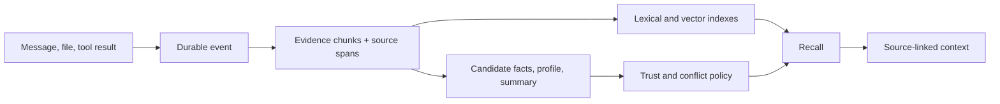

## Intent

Keep the material from which a memory was derived. Treat compact facts, profiles, summaries, and graph relations as interpretations that can be inspected and recomputed.

## The problem

Extraction is lossy. A short claim can omit qualifiers, invert who said what, flatten uncertainty, or preserve a model hallucination. If the source event is discarded, correction becomes guesswork and a new extractor cannot repair old state.

## The pattern

Write evidence first, then derive memory:

Evidence needs stable identity, scope, actor, timestamp, source location, and content hash. Derived records reference evidence IDs rather than copying an unattributed excerpt into a mutable field.

Retrieval should retain a direct path to evidence. Derived structures may boost or organize evidence, but should not make the original unreachable.

## Why it works

- Wrong memories can be explained and corrected.
- Extractors and embedding models can be upgraded without losing the corpus.
- Multiple interpretations can coexist over one source event.
- Users can distinguish “the source said this” from “the system inferred this.”
- Deletion can enumerate raw and derived artifacts explicitly.

## Tradeoffs

Raw evidence increases storage, privacy exposure, and retrieval noise. Evidence retention needs access control, retention windows, source-aware deletion, and bounded context assembly. Keeping a source is not the same as proving it is true; provenance answers “where did this come from?”, not “should I believe it?”

## Seen in the atlas

[MemPalace](../../systems/mempalace/) makes verbatim drawers the retrieval floor and treats extracted structures as navigation aids. [Graphiti](../../systems/graphiti/) preserves episodes behind temporal graph facts. [Hindsight](../../systems/hindsight/) retains documents/chunks and carries source-memory IDs into consolidated observations. [Basic Memory](../../systems/basic-memory/) makes Markdown notes canonical and treats graph/search state as rebuildable projection. [TencentDB Agent Memory](../../systems/tencentdb-agent-memory/) retains L0 conversation JSONL and raw offloaded tool outputs beneath L1 records, scenes, persona, and symbolic maps. [agentmemory](../../systems/agentmemory/) links consolidated memory to source observation IDs, though its explicit remember path can still create claims without a verification state. [Mastra Observational Memory](../../systems/mastra-observational-memory/) binds summaries to exact covered message ranges. [Honcho](../../systems/honcho/) keeps message streams and derives peer representations. [RainBox](../../systems/rainbox/) separates claims from evidence rows. [Verel](../../systems/verel/) carries provenance through its trust model. [Swafra](../../systems/swafra/) preserves chunk text, but its source metadata is thin.

## Implementation checklist

- Store the event before starting asynchronous extraction.
- Give chunks deterministic IDs and precise source spans.
- Link every derived memory to one or more evidence IDs.
- Record extractor, prompt/schema version, and embedder identity.
- Return source references with recalled claims.
- Cascade delete through chunks, embeddings, summaries, and graph edges.
- Define when evidence expires and whether derived memory may outlive it.

## Tests to require

- Rebuild derived memory from retained evidence.
- Trace every injected claim back to a source.
- Delete a source and prove no derived artifact survives unintentionally.
- Retry a failed extraction without duplicating evidence.
- Verify access rules on both evidence and derived records.

## Related patterns

- [Trust-state machine](../trust-state-machine/)
- [Recoverable background work](../recoverable-background-work/)
- [Append-only memory audit](../append-only-memory-audit/)
