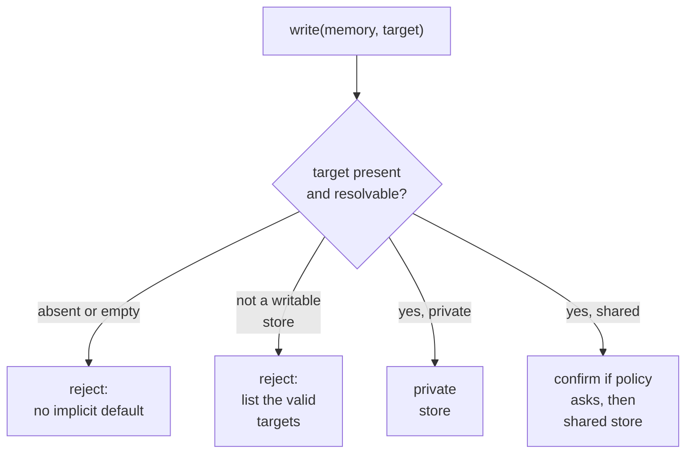

## Intent

Make *where does this memory go* a decision the caller states on every write, so
that no default — and no inherited read context — chooses a destination for it.

## The problem

Once memory has more than one store — private and shared, personal and team,
user and repository — a write that omits its destination still lands somewhere.
Whatever supplies that somewhere is a default nobody chose at the moment of
writing: a config value, the store the last read came from, the top search
result. The write succeeds, in the wrong place, and a private observation is now
shared.

Keeping read scopes apart from the write scope is part of
[scope as a first-class key](../scope-as-a-first-class-key/). This page is about
the rule that separation leaves open: what a write that names no destination
does.

## The pattern

```text
write(memory, target)            # target is required
    target absent or empty  -> reject; there is no implicit default
    target not writable     -> reject; list the valid targets
    target resolved         -> exactly one store
```

A mutation names exactly one destination. The write API resolves it against the
stores the caller may write, and an absent, empty or unrecognized destination is
an error, never a fallback. A default belongs only on a path where a human has
already chosen — a file importer — and never on the interactive or model-driven
path. The resolved destination then becomes part of identity, provenance, access
control and the mutation audit.

Agent tools should carry the target in their arguments, and the refusal should
name the valid targets, so a model learns the vocabulary from its first mistake.
Shared writes often deserve confirmation on top.



## Why it works

A default is the one destination nobody chose. Refusing the write moves the
decision to the moment the caller knows what the memory is. It also makes a
misrouted write attributable: the destination is in the arguments, so the audit
shows who chose it rather than which configuration value did.

## Tradeoffs

Explicit targets add friction. Agents may choose poorly, and users may not
understand the scope names. A promotion flow is needed when a private insight
becomes shared knowledge. Moving a memory between stores must preserve
provenance without leaving stale copies or broken links.

The rule protects only the paths that pass through it. A library call, an
importer or a background consolidator that writes directly can still create a
record with no destination, and whatever the read path does with such a record
becomes the effective default.

Do not infer a write target from the top search result. Relevance and ownership
are different decisions.

## Cost to adopt

**Build:** a required destination argument on the write API and a default that is
absent rather than convenient.

**Forces elsewhere:** every caller must decide, and the tool description or
prompt must make the decision legible to a model, which is where this usually
fails — a model that cannot tell private from shared will pick one anyway.

**Ongoing:** destinations proliferate; without a policy about who may write
where, the model is making an access-control decision on every turn.

**Skip it if** there is no shared store. This pattern exists to stop private
material reaching a shared one.

## Seen in the atlas

The atlas argues for this rule rather than reporting it as common practice. The
systems below refuse an absent destination on their write path.

[llm-wiki-memory](../../systems/llm-wiki-memory/) — `parseTarget` in
`scripts/lib/context/target.mjs` throws when a write or mutate `target` is
empty, with the reason *"target is REQUIRED and must be explicit … (there is no
implicit default)"*, and throws again for any value that is not an active context
level rather than falling back to the private brain. Reads fan out across the
private brain and the repository wikis; each write names one. The server enforces
the explicit target; asking before a shared-repository write is policy, not code.

[Memory Engine](../../systems/memory-engine/) — `memory.create` and `batchCreate`
require a `tree`, and the protocol schema rejects an empty one
(`treePathSchema.min(1, "tree path is required")`), so callers choose `share`
versus `~` on every interactive write. A default exists only on the file
importers, which file a tree-less record under `share` — a path where a human
already chose the source.

[Membrane](../../systems/membrane/) — the gRPC write boundary,
`allowsWriteRecord`, refuses a record whose scope is empty and one outside the
principal's `write_scopes`, under a comment stating the rule: *"every network
mutation must name an explicitly permitted non-empty scope"*. Its limit is the one
the tradeoffs above predict. The in-process library and the consolidators do not
pass through that boundary and can create unscoped records, which the read path
treats as visible from every context.

The counterexamples show what the rule replaces.
[MateClaw](../../systems/mateclaw/) carries the destination on its provider
contract as an `ownerKey`, beside unscoped overloads that remain callable, so the
destination is opt-in per call site; its recall ledger does drop a
personal-scope write with no resolved owner rather than recording it, which is
the rule applied to one table. [CowAgent](../../systems/cowagent/)'s `chunks.scope` column defaults to
`'shared'`, and [agentmemory](../../systems/agentmemory/) shares agent scope
unless isolation is switched on — in both, the omitted destination resolves to
the widest one, and the safe value is the one somebody has to remember to set.

## Implementation checklist

- Make the destination a required argument of every write and mutate call, and
  reject an empty one.
- Reject a destination that is not one of the caller's writable stores, and list
  the valid ones in the error.
- Resolve and authorize the target before mutation.
- Put a default, if any, only on paths where a human chose the source, never on
  the model-facing tool.
- Route every writer — library, importer, background consolidator — through the
  same check, or record which ones bypass it and what they default to.
- Include target scope in dedupe, conflict, and tombstone checks.
- Record promotions and moves as relations or audit events.
- Require stronger confirmation for shared or organization-wide writes.

## Tests to require

- Omitted, empty and unknown write targets fail with an error, and nothing is
  persisted.
- Private capture never appears in shared stores.
- Read federation does not affect write routing.
- Each writer outside the request path is either behind the same check or tested
  for what it writes when given no destination.
- Promotion preserves provenance and removes or links the predecessor.
- Concurrent moves cannot create two active owners.
- Shared targets enforce authorization independently of the agent tool.

## Related patterns

- [Scope as a first-class key](../scope-as-a-first-class-key/)
- [Governed write gateway](../governed-write-gateway/)
- [Append-only memory audit](../append-only-memory-audit/)
