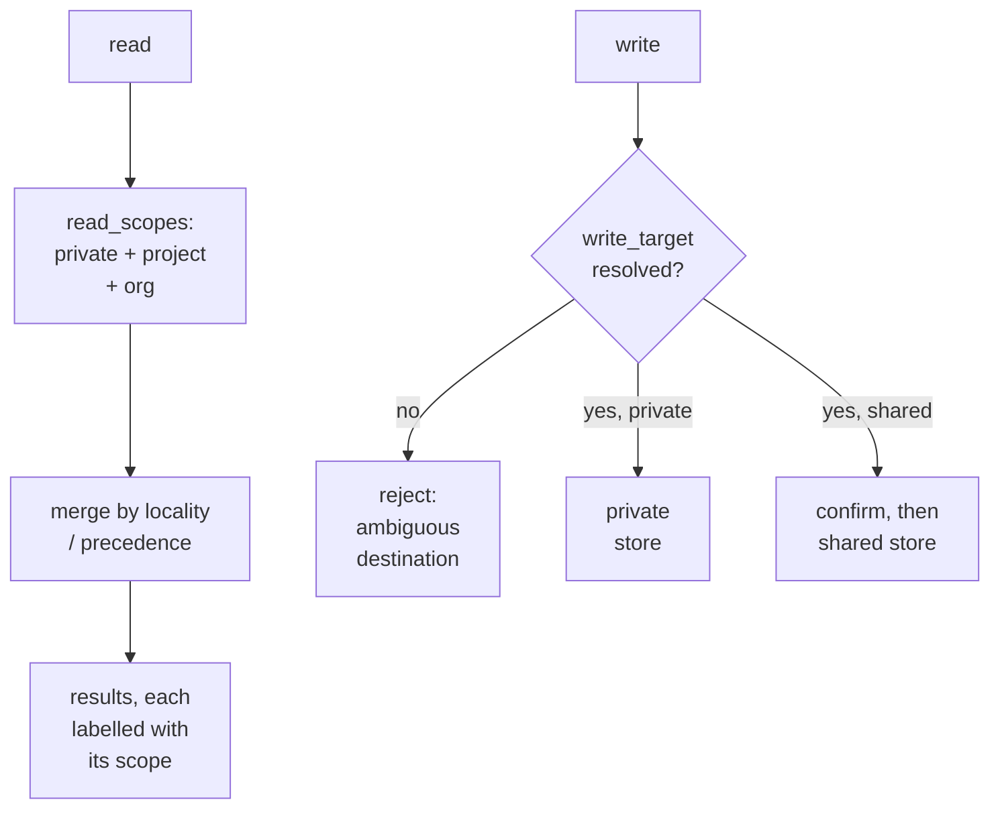

## Intent

Support layered memory—personal, project, repository, team, or organization—without letting a broad read context silently determine where new information is written.

## The problem

Federated retrieval may merge several stores into one result list. If a subsequent “remember this” operation inherits that blended context, a private observation can leak into a shared repository or a team lesson can land in one developer’s private memory.

## The pattern

Separate read scope from write target:

```text
read_scopes = [private, project, organization]
write_target = project
```

Reads may fan out according to access policy and merge with locality or precedence rules. Writes accept exactly one resolved destination and reject ambiguous requests. The destination becomes part of identity, provenance, access control, and the mutation audit.

Agent tools should make the target visible in their arguments. Defaults are acceptable only when they are safe, obvious, and surfaced to the user; shared writes often deserve confirmation.



Reads fan out; writes converge on exactly one named destination, and an
unresolved destination is an error rather than a default.

## Why it works

The pattern prevents accidental publication and makes ownership inspectable. It also allows independent storage, sync, retention, and review policy for each layer.

## Tradeoffs

Explicit targets add friction. Agents may choose poorly, and users may not understand the scope names. A promotion flow is needed when a private insight becomes shared knowledge. Moving a memory between stores must preserve provenance without leaving stale copies or broken links.

Do not infer a write target from the top search result. Relevance and ownership are different decisions.

## Cost to adopt

**Build:** a required destination argument on the write API and a default that is
absent rather than convenient.

**Forces elsewhere:** every caller must decide, and the tool description or
prompt must make the decision legible to a model, which is where this usually
fails — a model that cannot tell private from shared will pick one anyway.

**Ongoing:** destinations proliferate; without a policy about who may write
where, the model is making an access-control decision on every turn.

**Skip it if** there is no shared store. This pattern exists to stop private
material reaching a shared one.

## Seen in the atlas

[llm-wiki-memory](../../systems/llm-wiki-memory/) remains the clearest case:
reads fan out across private and repository wikis while every mutation must name
a concrete target, so a shared read scope never becomes a shared write.

[OpenViking](../../systems/openviking/) enforces the same discipline
structurally. `MemoryIsolationHandler` resolves the write target **before**
anything is persisted, and `peer_user_space()` returns `user_space` for the
sentinel `__self` and `user_space/peers/<peer_id>` otherwise — so memory *about*
a third party is physically separated from memory about the user, by path, at
write time.

[Magic Context](../../systems/magic-context/) pairs a `project | ecosystem |
universe` scope with a `shareable` flag, making "may this cross a boundary?" a
property of the record rather than a property of the caller.
[MateClaw](../../systems/mateclaw/) puts the destination on the provider contract
itself as an `ownerKey`, and its `MemoryScope` marks `TEAM` and `GLOBAL` as the
shared values with an `isShared()` helper — the sharing decision is explicit and
centrally testable.

[CowAgent](../../systems/cowagent/) is the counterexample, and a common one: its
`chunks.scope` column defaults to `'shared'`. A default that shares is a default
that leaks, because the safe value is the one nobody has to remember to set —
the same hazard the atlas flags in [agentmemory](../../systems/agentmemory/),
whose strictest isolation requires opting in.

[Moltis](../../systems/moltis/) shows what happens without the discipline at all:
sanitized session transcripts are exported into the same Markdown corpus as
curated notes, sharing one index and one rank, with nothing marking which is
which.

## Implementation checklist

- Give every store a stable, human-readable destination ID.
- Resolve and authorize the target before mutation.
- Include target scope in dedupe, conflict, and tombstone checks.
- Record promotions and moves as relations or audit events.
- Require stronger confirmation for shared or organization-wide writes.
- Keep private automatic capture separate from shared publication.

[Memory Engine](../../systems/memory-engine/) is the strongest instance found:
`memory.create` and `batchCreate` **require** an explicit `tree`, because callers
should "choose `share` vs `~` deliberately". The default is not safe-and-surfaced
— it is *absent* on the interactive path, and exists only for file importers,
where a human already chose the source.

## Tests to require

- Omitted and ambiguous write targets fail safely.
- Private capture never appears in shared stores.
- Read federation does not affect write routing.
- Promotion preserves provenance and removes or links the predecessor.
- Concurrent moves cannot create two active owners.
- Shared targets enforce authorization independently of the agent tool.

## Related patterns

- [Scope as a first-class key](../scope-as-a-first-class-key/)
- [Governed write gateway](../governed-write-gateway/)
- [Append-only memory audit](../append-only-memory-audit/)
