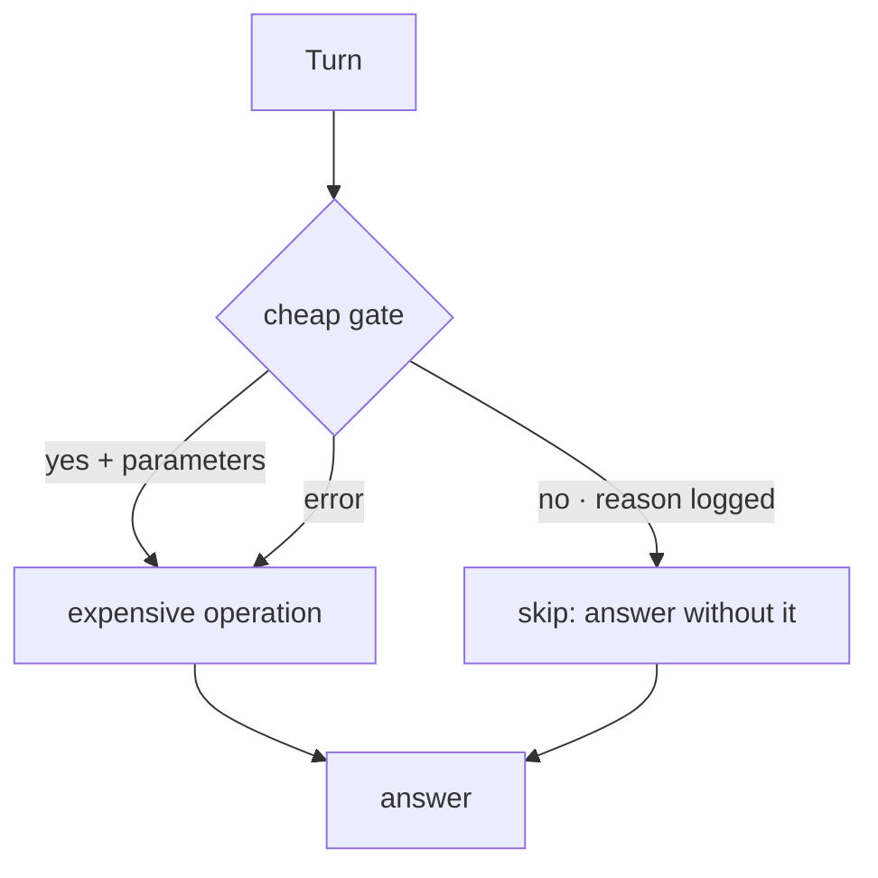

## Intent

Put a cheap decision in front of an expensive one. Before searching the store,
running a summarizer, or loading a body of text into the prompt, spend a little
to decide whether the expensive step is worth taking at all.

## The problem

Memory operations are usually written as unconditional. Every turn searches.
Every message triggers consolidation. Every skill is in the prompt because it
might be needed. Each of these is defensible alone and expensive in aggregate.

Cost is the obvious objection and the weaker one. The stronger objection is
**quality**:

- Retrieval that runs every turn returns something every turn, and irrelevant
  memory in the prompt does not sit inertly — it bends the answer.
- A summarizer invoked after a single exchange has nothing to summarize and
  emits noise that then becomes durable.
- Context spent on skills or facts that this turn will not use is context the
  turn needed for something else.

An unconditional pipeline has no way to express "nothing here is worth doing."

## The pattern

Insert a decision cheap enough that running it always is affordable, and let it
skip the step that is not:

```text
turn/message
   → cheap decision: is the expensive step warranted?
        no  → skip it entirely
        yes → run it, ideally using parameters the decision already produced
```

Three invariants:

1. **The gate must be much cheaper than what it guards.** A small model, a
   regex, a token count, a modification timestamp — if the gate costs what the
   operation costs, it is just the operation with extra steps.
2. **The gate must fail open.** A gate exists to skip work; a broken gate must
   degrade to doing the work, not to silently skipping it. Failing closed turns
   an outage into invisible memory loss.
3. **The gate should record its reason.** A skipped operation with no trace is
   indistinguishable from a bug.

Where possible, have the gate produce the parameters the guarded step needs, so
one call does two jobs.



## Why it works

It converts a fixed cost into a conditional one, and — more importantly — it
gives the system a way to say *nothing*. A retrieval layer that must always
return its top-k will return five weak matches for "what is 2+2". Abstention is
a capability, and an unconditional pipeline does not have it.

It also concentrates a judgement that was previously implicit. "Is this turn
about the user's history?" was always being answered — by the ranker, badly,
after the search. A gate answers it once, explicitly, before spending anything.

## Tradeoffs

- **A false negative is invisible.** A wrongly skipped retrieval produces a
  confident answer missing context nobody knows was missing. False positives
  merely cost a search. The asymmetry means gates need measuring, and almost
  nobody measures them.
- **The gate is a new dependency on the critical path.** A model-based gate adds
  latency and a failure mode to every turn in order to remove work from some.
  Whether that trades well depends on the ratio of turns that need the operation.
- **Gates drift.** A heuristic tuned when the corpus was small, or a prompt
  tuned against one model, silently mis-fires later.
- **Layered gates compound.** Three independent gates in series, each right 95%
  of the time, pass only about 86% of what they should (0.95³ ≈ 0.857), so
  about one warranted operation in seven is skipped.
- **A gate is a policy in disguise.** "Does this need memory?" encodes a view of
  what memory is for, in a prompt or a regex nobody reviews as policy.

Do not gate an operation you have not measured. If you cannot say what the
expensive step costs and how often it helps, a gate is a guess with a latency
penalty.

## Cost to adopt

**Build:** a decision cheap enough to run always, a fail-open error path, and a
recorded reason for every skip.

**Forces elsewhere:** a model-based gate adds latency and a failure mode to
every turn in order to remove work from some, so the trade depends on the
fraction of turns that need the operation. Gates also encode policy — "does this
need memory?" is a view about what memory is for, living in a prompt nobody
reviews as policy.

**Ongoing:** the false-negative rate is invisible by construction and needs
deliberate measurement. Waku's labelled accuracy test has no committed run, so
even that gate's rate is unknown.

**Skip it if** you have not measured what the expensive step costs and how often
it helps. A gate without that is a guess with a latency penalty.

## Seen in the atlas

[Waku Agent](../../systems/waku-agent/) is the clearest case, and it gates at
three levels. `retrieval_gate.py` asks a small model, per turn, whether memory
is needed at all — returning `{"retrieve", "query", "reason"}`, so the same call
that decides also supplies the search query. Consolidation batches rather than
running per message, justified on quality as well as cost: batching "gives the
summarizer enough context to extract facts worth keeping." Skills load by
progressive disclosure — frontmatter always, body on match, referenced files on
demand.

Waku also demonstrates the fail-open invariant and states it in the code: "Fails
open: if the gate itself errors, we retrieve — a stale memory beats a lost one."
Its exception path returns `(True, message, "gate failed open (...)")`, and a
separate branch treats a reply containing no JSON the same way — a defence added
after reasoning models began emitting a thinking block before their answer.

[Atomic Agent](../../systems/atomic-agent/) gates the same class of work one step
later: its v2.5 query rewriter is heuristic-gated, so the rewrite runs only when
a heuristic says it is worth the call. Its consolidator is bounded by a stated
invariant — at most one LLM call per cluster, even when that call must produce
both a lesson and a procedure.

The cheapest gate is a parser, not a model: [Gini](../../systems/gini-agent/)'s
temporal recall channel, described under
[hybrid retrieval fusion](../hybrid-retrieval-fusion/#seen-in-the-atlas).

[Daimon](../../systems/daimon/) runs the same idea with no model in either gate,
and with the fail direction reversed. Its proactive-recall gate is three lexical
tests, each defaulting to silence: an unknown project, a prompt with fewer than
two salient terms, or a candidate session sharing fewer than two *distinct*
terms all return nothing. Its world-check pass runs under one aggregate
`BUDGET_SECONDS = 0.8` and one `MAX_PROBES = 5`, the cap allocated in checkpoint
order so a burst of `gh` claims cannot starve the local probes, and an exhausted
budget skips the remaining probes.

Both skip rather than run, and the reason is that they guard different things
than Waku's gate does. A missing *suggestion* costs a reminder; a missing
*memory* costs the answer. Which way a gate should fail is a property of what
sits behind it, not a house style.

[Redis Agent Memory Server](../../systems/redis-agent-memory-server/) gates
extraction with a trailing-edge debounce, so a burst of messages produces one
extraction rather than many. [MetaClaw](../../systems/metaclaw/) gates in the
other direction — its policy optimizer short-circuits when volume is low,
declining to tune weights before there is enough data to tune on.

Two neighbours share the cost argument without a runtime gate in front of an
expensive step. [GenericAgent](../../systems/genericagent/) applies an explicit
cost model — `ROI = (error probability × cost) / per-turn word cost` — as a
written rule for what may occupy permanent context, and
[Hermes Agent](../../systems/hermes-agent/) refuses a write that would exceed its
character cap, which is a capacity limit rather than a decision to skip work.

Waku's gate has a measurement harness:
`evals/judge/test_retrieval_gate_accuracy.py` scores its decisions against twelve
labelled cases and reports both error directions separately; its own docstring
says it measures and does not gate, it skips without a provider key, and no run
is committed. For Atomic Agent's rewriter heuristic and Gini's temporal parser,
their reports record no accuracy measurement at all. The false-negative rate —
the one that matters — is unknown in every case.

## Tests to require

- Feed the gate turns that plainly need memory and turns that plainly do not,
  and measure both error rates separately. The false-negative rate is the one
  that matters.
- Break the gate — make it throw, time out, and return malformed output — and
  assert the system does the expensive work anyway in every case.
- Assert every skip is logged with a reason a human can read.
- Run a turn that needs memory with the gate forced closed, and confirm the
  resulting answer is detectably worse; if it is not, the guarded operation may
  not be earning its place either.
- Measure the gate's own cost against the work it avoids, in latency and tokens,
  on realistic traffic rather than on a benchmark of memory-heavy questions.
- Where several gates compose, test them together — the compound skip rate is
  not the product of the individual ones.

## Related patterns

- [Zero-LLM capture](../zero-llm-capture/)
- [Source-diverse context](../source-diverse-context/)
- [Decay and reinforcement](../decay-and-reinforcement/)
- [Skills as procedural memory](../skills-as-procedural-memory/)
