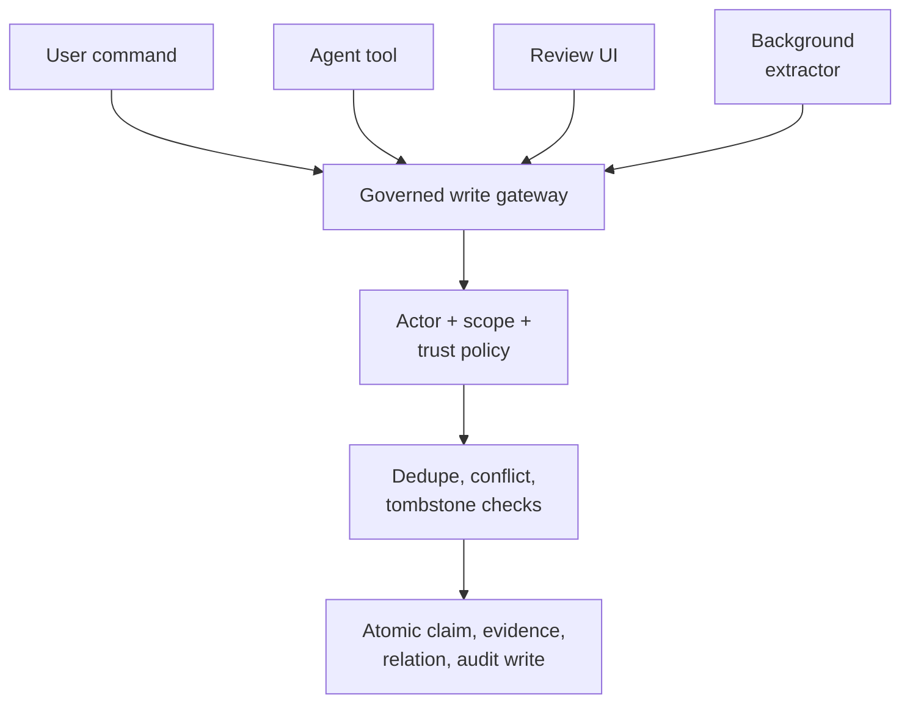

## Intent

Make one backend operation responsible for the invariants of durable memory, regardless of whether a write originates from chat, an agent tool, an API, a review screen, or background extraction.

## The problem

Memory systems often grow several write paths. One creates evidence, another checks duplicates, a third allows an assistant to overwrite an active fact, and a background worker bypasses all three. Policy then depends on which interface happened to receive the write.

## The pattern

Expose narrow adapters but converge on one governed command:

The gateway accepts an explicit actor, scope, candidate value, evidence, source, and intent. Inside one transaction it:

1. Normalizes identity and value.
2. Checks authorization and sensitivity.
3. Searches same-key and near-duplicate memory.
4. Checks rejected-value tombstones.
5. Chooses create, corroborate, conflict, supersede, or refuse.
6. Assigns trust state according to actor and evidence.
7. Writes provenance and audit events.

Correction should use the same invariants and atomically supersede the old claim while creating or activating the replacement.

## Why it works

One gateway makes policy auditable and testable. New integrations inherit existing safeguards instead of reimplementing them. Atomicity prevents half-corrections such as superseding an old claim without successfully creating its replacement.

## Tradeoffs

The gateway can become a monolith. Keep storage, normalization, and policy components separate behind the command boundary. High-contention keys may need locks or serializable transactions. Not every note deserves belief governance; distinguish low-risk archival capture from claims that influence behavior.

## Cost to adopt

**Build:** one transactional path all mutations pass through, plus enforcement
that they cannot bypass it — a private store, a lint rule, or a type that only
the gateway can construct.

**Forces elsewhere:** the gateway becomes a bottleneck for feature work, and
every new write path is a negotiation with it. Its failure mode is a design
decision, not an accident: fail-closed loses writes during an outage, fail-open
admits ungoverned ones.

**Ongoing:** policy lives here and needs review as policy, not as code.

**Skip it if** there is exactly one writer. A gateway in front of a single
caller is ceremony.

## Seen in the atlas

[RainBox](../../systems/rainbox/) remains the reference: `record_belief` is the
single path, taken under a Postgres advisory lock, running dedupe, tombstone
checks, lattice-aware conflict detection, and actor-based trust in one
transaction, with `correct_belief` as its atomic correction counterpart.

Later systems show the gateway idea applied to different things.

[MetaClaw](../../systems/metaclaw/) governs the *policy* rather than the claim.
A candidate retrieval policy is replayed against real past turns and promoted
only if it does not regress on eight measured deltas over at least ten samples,
with an explicit cap on additional zero-retrieval cases. It is the same shape —
one gate, several checks, an auditable decision — applied one level up.

[Atomic Agent](../../systems/atomic-agent/) governs by **stated invariant**: its
schema comments cite numbered cross-phase rules back into a design document
(never auto-execute a procedure; at most one LLM call per consolidator cluster;
keep the vote prompt off the main KV cache). Rules that are cited can be reviewed
as rules; rules that are merely implemented are indistinguishable from accidents.

[MateClaw](../../systems/mateclaw/) gets a chokepoint from framework
conventions rather than a lock: turn lifecycle events flow through a `MemoryLifecycleMediator`
to every registered provider, so the write path is observable in one place. Its
decorators (`MetricsMemoryProvider`, `RetryableMemoryProvider`) add resilience
and instrumentation to every backend without per-plugin code.

[Magic Context](../../systems/magic-context/) enforces the negative form —
**fail-closed**: if persistent storage is unavailable, the plugin refuses to
register rather than running without it.

[Hermes Agent](../../systems/hermes-agent/) routes memory mutations through a
staged write-approval gate that can allow, block, or hold a write for human
approval — but the gate **fails open** if its module cannot be imported, which is
documented in the code and worth noticing: a gateway's failure mode is part of
its design.

[Memora](../../systems/memora/) applies the idea to a bulk mutation rather than a
single write: its supersession sweep takes `dry_run: bool = True`, so the pass
that would hide superseded memories reports its proposals by default and mutates
only when explicitly asked. A gateway concentrates writes so they can be
governed; a dry-run default lets them be *reviewed* first, which is the one
control this pattern otherwise lacks for operations whose blast radius is
unknowable in advance.

[OpenSRE](../../systems/opensre/) is the smallest complete instance here, and it
is worth reading for what it puts in the gate rather than for the gate itself.
Two writers — an agent tool and an automatic post-turn extractor — reach one
`save_memory`, which takes a directory lock, preserves `created_at`, writes
through a temp file and an atomic replace. The policy in front of it is what
distinguishes it: a closed type vocabulary, a **model-free grounding check**
requiring an extracted infrastructure or incident claim to share distinctive
tokens with text the user typed, a refusal of anything extracted from a
transcript containing the product's own demo scenarios, and a secret filter whose
rejection names the rule rather than echoing the value. Only the proposal step is
a language model; every gate after it is deterministic and testable, which is
what makes the committed negative cases possible.

[PLUR1BUS](../../systems/plur1bus/) shows what a gate can demand of a correction
and what happens when it demands too much. `lib/safe-update.js` refuses a content
change with no `updateSource` and no `updateEvidence`, refuses new text with no
new embedding, deduplicates on a hash of the change rather than of the row, and
appends the outcome to a reconsolidation event log — five checks in one function,
each of which a caller cannot skip. The sixth is a **semantic drift gate**: the
correction is rejected outright if the new embedding sits more than 0.45 cosine
from the old, on the reasoning that a replacement meaning something else is
corruption rather than correction. It is the only instance of that check in this
atlas, and the only caller in the tree passes `skipDriftGate: true` — with the
reasoning at the call site: a nonce-confirmed user correction is exactly the case
where large drift is intended, the confirmation dialog shows the old and new text
in full, and the gate throws rather than warns. The drift is still recorded on
the audit event. Both halves are worth carrying: a gate can meaningfully refuse a
correction on semantic grounds, and a gate that is right for automated callers
and wrong for the one human caller it has ends up with no live consumer at all.

[Verel](../../systems/verel/) gates promotion rather than writing;
[engram](../../systems/engram/) surfaces conflict candidates for judgment.

[Midas](../../systems/midas/) applies the same idea one step later — a gateway on
*use* rather than on write. `decide_memory_use` crosses a four-value provenance
vocabulary with a four-value intended-use vocabulary: planning may rest on
anything, an answer may not rest on an internal plan, and an external or
destructive action requires `user_confirmation` and nothing else. Two refinements
are worth lifting whole. A `forbidden_action` rule is stamped user-confirmed and
would therefore be valid authorizing evidence, so it is explicitly excluded from
the supporting set — "a prohibition is a gate, not an authorization" — and a live
prohibition in the same evidence set *vetoes* any confirmation beside it, closing
the approve-around attack. Currency is re-checked at the gate rather than trusted
from recall, because, in the code's words, the guard "verifies currency itself
rather than trusting recall to have filtered the stale record".

[Memory Palace](../../systems/memory-palace/) shows the write-side version with a
degradation rule most gateways lack. `write_guard` runs a semantic and a lexical
search before a write and returns `ADD`, `UPDATE` or `NOOP` — and when the
embedding provider has degraded to a hash fallback, it returns `NOOP` with the
reason instead of a decision. A duplicate gate that falls through to "not a
duplicate" whenever its evidence is bad is the failure this avoids.

[ClawMem](../../systems/clawmem/) gates the *destructive* branch on the quality of
the classifier that would select it: `resolveEffectiveContradictionPolicy`
downgrades a configured `supersede` policy to a non-deactivating `link` whenever
no audited judge is configured, warns once per process, and emits a
`merge_supersede_blocked` audit event per occurrence. The comment gives the
reason — "an unaudited heuristic whose number-mismatch score sits exactly at the
default action threshold must never select deactivation".

[Hestia](../../systems/hestia/) declines the gateway for one adapter on purpose.
The diagram above routes background extraction into the same governed command as
every other caller; Hestia routes it somewhere else. `brain/note_taker.py`
extracts durable facts from conversation and they *"land in a review inbox
(`memory/inbox/*.md`), NOT straight into the live memory store"* — the queue is
deduplicated against both live memory and its own pending entries, and
`review_notes.py` is where a person promotes, edits or drops each one. The
bypass is present and defaults off (`HESTIA_NOTETAKER_AUTOWRITE` reads `"0"`).
The direct write path still goes through one governed function with a `type`
whitelist that raises rather than coercing, and returns the error text to the
model so it can retry. So this is not a system without a gateway; it is one that
decided the *least* trustworthy adapter should not have a machine-decided verdict
at all. Worth weighing against the cost: the queue defers the judgement rather
than deciding it, and nothing downstream can mark a promoted fact wrong.

### The gateway that is not yours

Every gateway on this page is inside the memory system it governs. Two projects
in the token-cost corpus put one *outside*, in front of the agent, and between
them they cover both directions of the same threat — which is worth naming
because neither is a memory system and neither gets a report here.

[AEGIS](https://github.com/Justin0504/Aegis), MIT, examined on 2026-08-09 at
[`82b7501cf3491a105362a10a059e33d0e949d4d3`](https://github.com/Justin0504/Aegis/commit/82b7501cf3491a105362a10a059e33d0e949d4d3),
is an MCP gateway with a pre-execution detector chain, and one of its built-ins is
`memory-poison-detector.ts`. Its threat model is stated exactly as this atlas
would state it: *"an adversary tricks the agent into persisting attacker-
controlled instructions into long-term storage that subsequent sessions retrieve
and treat as authoritative."*

The interesting part is how it finds the write path it is supposed to gate.
Sitting outside every memory system, it cannot know which tool is a memory write,
so it pattern-matches the *tool name* — `^(write|save|store|put|append|persist|remember|memorize)_?(memory|state|context|note|fact|scratchpad)`,
`^(upsert|insert)_?(vector|embedding|document|memory|fact|chunk)`, `^memory_(set|store|write|put|append|add)`,
and two more — then inspects the payload for imperatives, role overrides and known
jailbreak phrasing. It calls itself *"heuristic, not perfect — a determined
adversary can paraphrase"* and pairs itself with a request-side injection
classifier and cross-agent detectors.

That naming convention is the whole trick and the whole weakness. A gateway
outside the system can only recognise a write it can name, so **a memory system
whose write tool is called something else is ungoverned by construction** — and
several in this atlas are. The lesson runs the other way for a builder: if you
want an external policy layer to be able to protect your memory, name your write
tool the boring, guessable thing.

[ruflo](../../systems/ruflo/) is the read-side half of the same idea and the one
that does have a report: `agentdb-retrieval-guard.ts` screens chunks *coming out*
of the store before they are assembled into context. Write-side screening catches
the payload as it lands; read-side screening also catches whatever was already in
the store when you turned the guard on. They are not substitutes, and a system
with a governed write gateway of its own has the better version of the first
half — because it knows which writes are writes.

## Tests to require

- Exercise every adapter against the same invariant suite.
- Race two conflicting writes and verify one coherent outcome.
- Prove model-originated writes cannot acquire human authority.
- Roll back the entire correction if replacement creation fails.
- Verify tombstone and scope checks cannot be bypassed.
- Confirm audit events and evidence commit atomically with the claim.

## Related patterns

- [Rejected-value tombstone](../rejected-value-tombstone/)
- [Trust-state machine](../trust-state-machine/)
- [Append-only memory audit](../append-only-memory-audit/)
