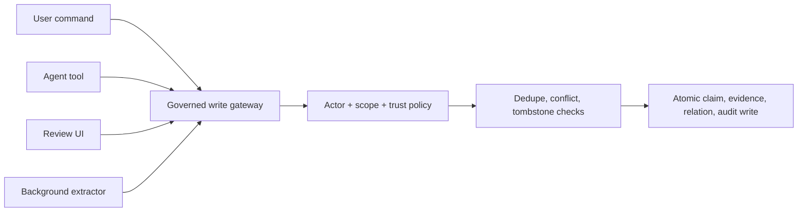

## Intent

Make one backend operation responsible for the invariants of durable memory, regardless of whether a write originates from chat, an agent tool, an API, a review screen, or background extraction.

## The problem

Memory systems often grow several write paths. One creates evidence, another checks duplicates, a third allows an assistant to overwrite an active fact, and a background worker bypasses all three. Policy then depends on which interface happened to receive the write.

## The pattern

Expose narrow adapters but converge on one governed command:

The gateway accepts an explicit actor, scope, candidate value, evidence, source, and intent. Inside one transaction it:

1. Normalizes identity and value.
2. Checks authorization and sensitivity.
3. Searches same-key and near-duplicate memory.
4. Checks rejected-value tombstones.
5. Chooses create, corroborate, conflict, supersede, or refuse.
6. Assigns trust state according to actor and evidence.
7. Writes provenance and audit events.

Correction should use the same invariants and atomically supersede the old claim while creating or activating the replacement.

## Why it works

One gateway makes policy auditable and testable. New integrations inherit existing safeguards instead of reimplementing them. Atomicity prevents half-corrections such as superseding an old claim without successfully creating its replacement.

## Tradeoffs

The gateway can become a monolith. Keep storage, normalization, and policy components separate behind the command boundary. High-contention keys may need locks or serializable transactions. Not every note deserves belief governance; distinguish low-risk archival capture from claims that influence behavior.

## Cost to adopt

**Build:** one transactional path all mutations pass through, plus enforcement
that they cannot bypass it — a private store, a lint rule, or a type that only
the gateway can construct.

**Forces elsewhere:** the gateway becomes a bottleneck for feature work, and
every new write path is a negotiation with it. Its failure mode is a design
decision, not an accident: fail-closed loses writes during an outage, fail-open
admits ungoverned ones.

**Ongoing:** policy lives here and needs review as policy, not as code.

**Skip it if** there is exactly one writer. A gateway in front of a single
caller is ceremony.

## Seen in the atlas

[RainBox](../../systems/rainbox/) remains the reference: `record_belief` is the
single path, taken under a Postgres advisory lock, running dedupe, tombstone
checks, lattice-aware conflict detection, and actor-based trust in one
transaction, with `correct_belief` as its atomic correction counterpart.

Later systems show the gateway idea applied to different things.

[MetaClaw](../../systems/metaclaw/) governs the *policy* rather than the claim.
A candidate retrieval policy is replayed against real past turns and promoted
only if it does not regress on eight measured deltas over at least ten samples,
with an explicit cap on additional zero-retrieval cases. It is the same shape —
one gate, several checks, an auditable decision — applied one level up.

[Atomic Agent](../../systems/atomic-agent/) governs by **stated invariant**: its
schema comments cite numbered cross-phase rules back into a design document
(never auto-execute a procedure; at most one LLM call per consolidator cluster;
keep the vote prompt off the main KV cache). Rules that are cited can be reviewed
as rules; rules that are merely implemented are indistinguishable from accidents.

[MateClaw](../../systems/mateclaw/) gets a chokepoint from framework
conventions rather than a lock: turn lifecycle events flow through a `MemoryLifecycleMediator`
to every registered provider, so the write path is observable in one place. Its
decorators (`MetricsMemoryProvider`, `RetryableMemoryProvider`) add resilience
and instrumentation to every backend without per-plugin code.

[Magic Context](../../systems/magic-context/) enforces the negative form —
**fail-closed**: if persistent storage is unavailable, the plugin refuses to
register rather than running without it.

[Hermes Agent](../../systems/hermes-agent/) routes memory mutations through a
staged write-approval gate that can allow, block, or hold a write for human
approval — but the gate **fails open** if its module cannot be imported, which is
documented in the code and worth noticing: a gateway's failure mode is part of
its design.

[Memora](../../systems/memora/) applies the idea to a bulk mutation rather than a
single write: its supersession sweep takes `dry_run: bool = True`, so the pass
that would hide superseded memories reports its proposals by default and mutates
only when explicitly asked. A gateway concentrates writes so they can be
governed; a dry-run default lets them be *reviewed* first, which is the one
control this pattern otherwise lacks for operations whose blast radius is
unknowable in advance.

[Verel](../../systems/verel/) gates promotion rather than writing;
[engram](../../systems/engram/) surfaces conflict candidates for judgment.

## Tests to require

- Exercise every adapter against the same invariant suite.
- Race two conflicting writes and verify one coherent outcome.
- Prove model-originated writes cannot acquire human authority.
- Roll back the entire correction if replacement creation fails.
- Verify tombstone and scope checks cannot be bypassed.
- Confirm audit events and evidence commit atomically with the claim.

## Related patterns

- [Rejected-value tombstone](../rejected-value-tombstone/)
- [Trust-state machine](../trust-state-machine/)
- [Append-only memory audit](../append-only-memory-audit/)
