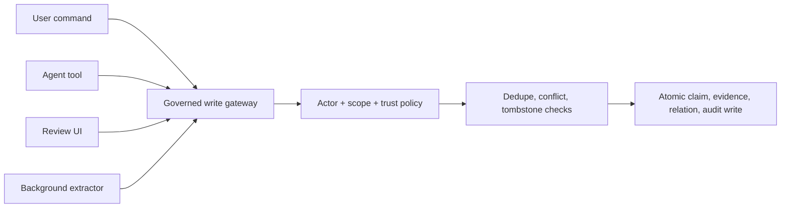

## Intent

Make one backend operation responsible for the invariants of durable memory, regardless of whether a write originates from chat, an agent tool, an API, a review screen, or background extraction.

## The problem

Memory systems often grow several write paths. One creates evidence, another checks duplicates, a third allows an assistant to overwrite an active fact, and a background worker bypasses all three. Policy then depends on which interface happened to receive the write.

## The pattern

Expose narrow adapters but converge on one governed command:

The gateway accepts an explicit actor, scope, candidate value, evidence, source, and intent. Inside one transaction it:

1. Normalizes identity and value.
2. Checks authorization and sensitivity.
3. Searches same-key and near-duplicate memory.
4. Checks rejected-value tombstones.
5. Chooses create, corroborate, conflict, supersede, or refuse.
6. Assigns trust state according to actor and evidence.
7. Writes provenance and audit events.

Correction should use the same invariants and atomically supersede the old claim while creating or activating the replacement.

## Why it works

One gateway makes policy auditable and testable. New integrations inherit existing safeguards instead of reimplementing them. Atomicity prevents half-corrections such as superseding an old claim without successfully creating its replacement.

## Tradeoffs

The gateway can become a monolith. Keep storage, normalization, and policy components separate behind the command boundary. High-contention keys may need locks or serializable transactions. Not every note deserves belief governance; distinguish low-risk archival capture from claims that influence behavior.

## Seen in the atlas

[RainBox](../../systems/rainbox/) is the strongest product example: `record_belief` centralizes writes, actor types determine active versus candidate state, and `correct_belief` performs governed correction with conflict and tombstone handling. [Verel](../../systems/verel/) similarly routes promotion and rejection through explicit trust machinery. [LangMem](../../systems/langmem/) provides clean store tools but intentionally leaves the governing policy to the application.

## Tests to require

- Exercise every adapter against the same invariant suite.
- Race two conflicting writes and verify one coherent outcome.
- Prove model-originated writes cannot acquire human authority.
- Roll back the entire correction if replacement creation fails.
- Verify tombstone and scope checks cannot be bypassed.
- Confirm audit events and evidence commit atomically with the claim.

## Related patterns

- [Rejected-value tombstone](../rejected-value-tombstone/)
- [Trust-state machine](../trust-state-machine/)
- [Append-only memory audit](../append-only-memory-audit/)
