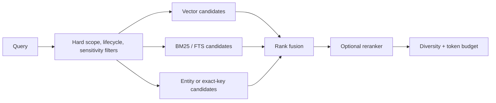

## Intent

Retrieve both conceptually related memory and exact facts, while enforcing scope and lifecycle constraints before results reach the agent.

## The problem

Vector search is good at paraphrase and topical similarity but weak on exact names, identifiers, dates, paths, and negation. Lexical search catches exact strings but misses paraphrase. Either signal alone produces avoidable blind spots.

## The pattern

Apply hard filters first, retrieve candidates through independent channels, normalize or rank their outputs, then fuse and cap the final context:

Reciprocal-rank fusion is a useful baseline because it combines rankings without pretending incomparable scores share a calibrated scale. Weighted score fusion can work when every component has measured, bounded behavior.

## Why it works

The channels fail differently. Semantic search recalls meaning; lexical search protects exactness; metadata enforces boundaries; entity or key lookup handles structured identity. A reranker can resolve close candidates after cheaper retrieval has narrowed the set.

## Tradeoffs

- More channels add latency and operational complexity.
- Ad hoc score normalization makes rankings hard to explain.
- Heuristic bonuses can dominate if they are not bounded.
- Reranking without evaluation adds cost without known benefit.
- The final result and token limit must be enforced after fusion.

Do not call retrieval “hybrid” merely because two backends exist. The important behavior is intentional candidate fusion under one measured cutoff.

## Seen in the atlas

[Hindsight](../../systems/hindsight/) runs semantic, BM25, graph, and temporal arms, caps each arm, uses reciprocal-rank fusion for recall, and switches to interleaving when dedup needs semantic rank one to survive. [Graphiti](../../systems/graphiti/) searches edges, nodes, episodes, and communities through BM25, cosine, and BFS with configurable fusion/reranking. [Cognee](../../systems/cognee/) offers chunk, lexical, vector, graph, summary, triplet, and hybrid strategies; because the strategies return different shapes, each configured path needs its own cutoff and quality evaluation. [Basic Memory](../../systems/basic-memory/) fuses FTS5 or `tsvector` with optional semantic chunks. [agentmemory](../../systems/agentmemory/) combines BM25, vector, and graph arms with weighted RRF, then applies per-session diversity. [TencentDB Agent Memory](../../systems/tencentdb-agent-memory/) fuses FTS and vector rankings with RRF or delegates to native Tencent VectorDB hybrid search. [MemOS](../../systems/memos/) composes vector, graph, BM25, reranker, and optional reasoning channels per cube. [Mem0](../../systems/mem0/), [MemPalace](../../systems/mempalace/), and [RainBox](../../systems/rainbox/) provide other strong variants. [Claude-Mem](../../systems/claude-mem/) is a naming counterexample: ordinary text search selects Chroma rather than fusing it with FTS, and its `HybridSearchStrategy` is limited to file lookup. [A-MEM](../../systems/a-mem/) also labels vector-only code as hybrid. [Swafra](../../systems/swafra/) is a compact warning about unbounded heuristics and result-count drift. [Engram](../../systems/engram/) shows that reliable FTS and exact keys can be the right local baseline.

## Tests to require

- Exact identifiers, paraphrases, dates, negation, and typo cases.
- Scope leakage and lifecycle filtering before ranking.
- Ablations for each retrieval channel.
- Hard assertions that `@k` evaluates exactly the first `k` results.
- Token-volume and latency reporting.
- Stable tie-breaking and bounded heuristic contributions.

## Related patterns

- [Scope as a first-class key](../scope-as-a-first-class-key/)
- [Source-diverse context](../source-diverse-context/)
- [Evidence before belief](../evidence-before-belief/)
