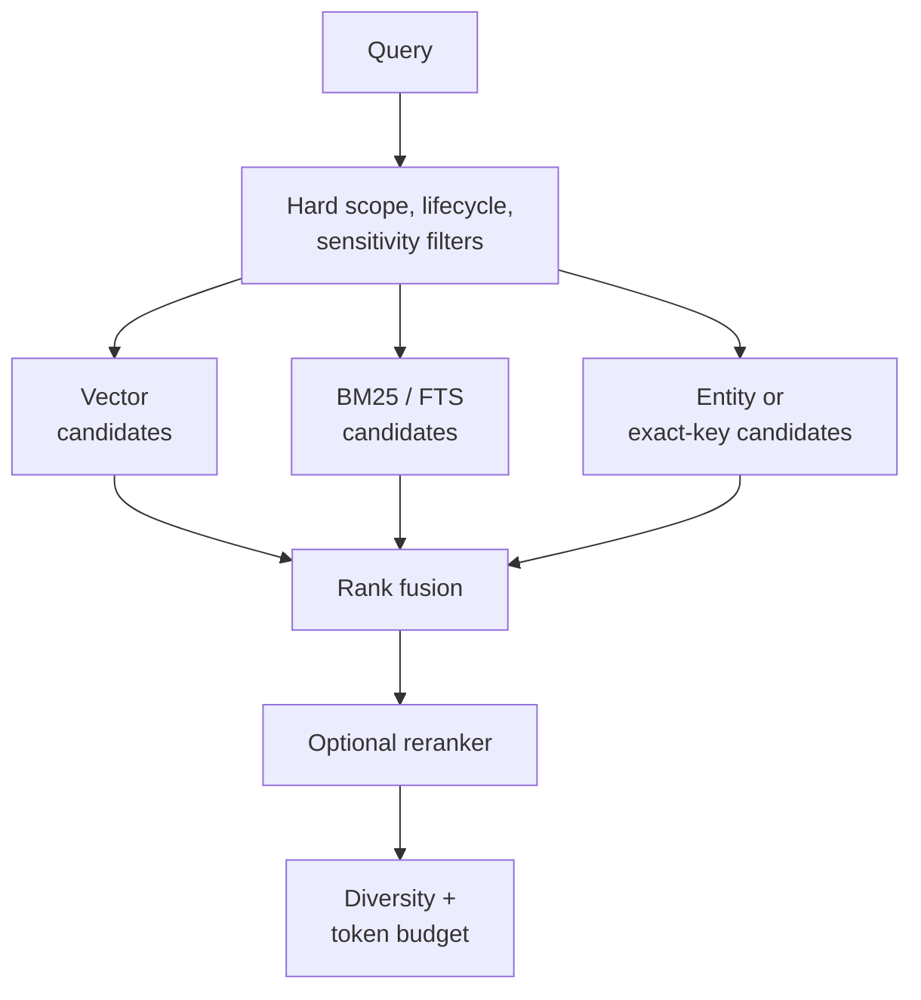

## Intent

Retrieve both conceptually related memory and exact facts, while enforcing scope and lifecycle constraints before results reach the agent.

## The problem

Vector search is good at paraphrase and topical similarity but weak on exact names, identifiers, dates, paths, and negation. Lexical search catches exact strings but misses paraphrase. Either signal alone produces avoidable blind spots.

The size of that blind spot is measurable. On LIMIT, a benchmark built to expose single-vector retrieval, BM25 reaches Recall@20 of 0.9490 where Contriever reaches 0.0265 ([Clavié et al., *Latent Terms*, arXiv:2605.29384](https://arxiv.org/abs/2605.29384), 28 May 2026). That paper also shows some of the gap is recoverable from the dense model — but recovering it is a second index, not a better read of the first. It trains a new sparse autoencoder on the retriever's frozen final-layer **token** activations and scores the resulting features with BM25 over an inverted index; the pooled embedding is never rescored. The recovery is partial (Contriever 0.0265 → 0.5100, still 0.44 short of BM25) and it does not hold everywhere — on a multi-vector model it loses ground on both LIMIT and BEIR. Read it as evidence that lexical structure exists in token-level activations and needs its own scoring machinery to be usable, which is an argument for keeping a lexical arm rather than for expecting an embedding to grow one.

## The pattern

Apply hard filters first, retrieve candidates through independent channels, normalize or rank their outputs, then fuse and cap the final context:

Reciprocal-rank fusion is a useful baseline because it combines rankings without pretending incomparable scores share a calibrated scale — the property its authors claim for it, "without regard to the arbitrary scores returned by particular ranking methods" ([Cormack, Clarke and Büttcher, SIGIR '09](https://dl.acm.org/doi/10.1145/1571941.1572114)). Weighted score fusion can work when every component has measured, bounded behavior.

**The constant is a default, not a measurement.** `k = 60` was fixed in a pilot that fused *thirty* configurations of a single search engine, over a curve flat from 30 to 100; the paper's own words are that 60 "was near-optimal, but that the choice was not critical", and 80 scored fractionally higher in the table it comes from.

What `k` controls is how much of an arm's rank ordering survives fusion. Within one arm, `k = 60` compresses the whole top 60 into a factor of 1.967× — so a first-place hit is worth barely more than a sixtieth-place one, and cross-arm agreement dominates rank position. How much agreement is worth is *not* a fixed factor: a document at rank `a` in one arm gains `1 + (k+a)/(k+b)` by also appearing at rank `b` in the other, which reaches 2× only when the two ranks coincide and falls to 1.06× for `a = 1, b = 1000`. Two more things the arithmetic alone will not tell you: how deep each arm's candidate list runs, since a document missing from an arm's top-*k* has no defined rank and is usually approximated over the union of the lists; and how correlated the arms are, since agreement between two views of the same corpus is much weaker evidence than agreement among many independently built systems.

Fusing rank-only also discards the score distribution, and the literature has measured what that costs. [Bruch, Gai and Ingber, *An Analysis of Fusion Functions for Hybrid Retrieval*, TOIS 2023 (arXiv:2210.11934)](https://arxiv.org/abs/2210.11934) sweeps a separate constant per arm over 1–100 across nine datasets, and finds NDCG "swings wildly" with them. Their reframing is worth the detour: allow one constant per arm and RRF has *m* parameters against a convex combination's *m*−1, so the fusion usually chosen for being parameter-free has one parameter more than the one it is chosen over. Three results worth carrying:

- A **convex combination** of normalized scores, with one tuned weight, beat RRF `(60,60)` on NDCG on **all nine** datasets, in-domain and zero-shot, and needs only a small tuning sample. Normalization choice barely mattered.
- **Symmetrically lowering the constant transferred.** RRF `(5,5)` matched or beat `(60,60)` on all nine.
- **Asymmetric tuning did not transfer.** `(10,4)`, tuned in-domain, improved MS MARCO 0.425 → 0.451 and then cost HotpotQA 0.675 → 0.621 and FEVER 0.721 → 0.649. In-domain the tuning discounts the lexical arm; out-of-domain that reverses.

[Akarsu et al. (arXiv:2604.01733)](https://arxiv.org/abs/2604.01733), 2 April 2026, agrees in one domain on two arms: convex combination at α = 0.5 reaches Recall@5 0.726, RRF `k = 10` 0.716, RRF `k = 60` 0.695.

So: keep 60 if you have nothing to tune against, and do not defend it as measured. If you can normalize scores and tune one weight on a small in-domain sample, that is the better-evidenced fusion. And if you tune per-arm constants, tune them on your own traffic and expect them not to survive a domain change.

## Why it works

The channels fail differently. Semantic search recalls meaning; lexical search protects exactness; metadata enforces boundaries; entity or key lookup handles structured identity. A reranker can resolve close candidates after cheaper retrieval has narrowed the set.

## Tradeoffs

- More channels add latency and operational complexity.
- Ad hoc score normalization makes rankings hard to explain.
- Heuristic bonuses can dominate if they are not bounded.
- Reranking without evaluation adds cost without known benefit.
- The final result and token limit must be enforced after fusion.

Do not call retrieval “hybrid” merely because two backends exist. The important behavior is intentional candidate fusion under one measured cutoff.

## Cost to adopt

**Build:** a second retrieval arm, a fusion step, and a way to inspect which arm
contributed each result. RRF is a dozen lines; the inspection is what makes it
maintainable.

**Forces elsewhere:** each arm needs its own index kept in sync with writes, and
a backend that silently lacks one of them degrades to single-arm search while
still reporting itself as hybrid — a failure this atlas has found more than once.

**Ongoing:** fusion weights are tuning surface, and nothing tells you they have
drifted except a benchmark you probably do not have.

**Skip it if** your corpus is small enough that exact search alone answers well.
Boring FTS over a few thousand records outperforms an untuned hybrid stack.

## Seen in the atlas

[Gini](../../systems/gini-agent/) is the most legible implementation, because it
documents its channels and their provenance in a header comment: semantic cosine,
BM25 over FTS5, graph spreading activation seeded from the top semantic hits with
decay δ=0.5, and a temporal range match — fused with reciprocal rank fusion and
reranked. The temporal arm **only participates when the query contains a temporal
expression**, which is a small idea worth copying: a channel that cannot
contribute should not dilute the fusion.

[HippoRAG](../../systems/hipporag/) is the instructive alternative — it does not
fuse at all. It seeds a personalization vector from query-linked entities plus a
weak dense prior (passage nodes at 0.05) and reads relevance off a Personalized
PageRank diffusion. Multi-hop association becomes a property of the diffusion
rather than of a traversal policy or a weighted sum.

[LlamaIndex](../../systems/llamaindex/) composes instead of fusing: each memory
block contributes independently under its own share of a token budget, and each
truncates itself when over. The assembled context is easier to reason about than
a single fused ranking, because every contributor's share is separately visible.

[Hindsight](../../systems/hindsight/) runs four arms with task-specific fusion and
cross-encoder reranking; [MemPalace](../../systems/mempalace/) contributes the
reusable rule that extracted indexes *boost* drawer ranking but never gate direct
evidence retrieval; [mem0](../../systems/mem0/), [Honcho](../../systems/honcho/),
[Basic Memory](../../systems/basic-memory/), [agentmemory](../../systems/agentmemory/),
[CowAgent](../../systems/cowagent/), [Magic Context](../../systems/magic-context/),
and [OpenViking](../../systems/openviking/) all fuse lexical and semantic signals.

Two cautions have strengthened with evidence. **Naming is not fusing** —
[Claude-Mem](../../systems/claude-mem/)'s ordinary text search selects semantic
rather than combining it with FTS, and [A-MEM](../../systems/a-mem/)'s "hybrid"
path is vector-only. And **silent degradation is worse than no fusion**:
[Holographic](../../systems/holographic/) redistributes its weights to
lexical-only when NumPy is missing while `is_available()` still returns `True`,
where [Moltis](../../systems/moltis/) makes the same situation explicit with a
`keyword_only()` constructor and a `has_embeddings()` predicate callers can
branch on.

Nobody has shown their weights are right. [MetaClaw](../../systems/metaclaw/) is
the only system in the atlas that could — it replays candidate policies against
past turns and promotes one only on non-regression across eight metrics.
Everyone else, including [Generative Agents](../../systems/generative-agents/)
with its hand-tuned `gw = [0.5, 3, 2]`, ships constants nobody has defended —
starting with the fusion constant itself, which no report in this atlas records a
system sweeping.

[Helm](../../systems/helm/) is the smallest correct instance — both arms and the
fusion are about sixty lines of JavaScript over rows already in memory, with no
FTS extension and no vector store — and it is the clearest place in the atlas to
see that **fusion quality is bounded by candidate generation, not by the fusion
rule.** Its RRF is textbook (k=60, no score normalization, which is the right
refusal when you have no relevance data to calibrate against), and its belief
weight is applied as a multiplier rather than a filter so a low-confidence row is
penalized instead of excluded. Then every arm runs over
`SELECT … WHERE expired_at IS NULL ORDER BY updated DESC LIMIT 500` — a hard
window ordered by **recency**. Past a few hundred active facts, the memories that
stop being candidates are the ones nothing has touched lately, which is precisely
the set of long-lived preferences the store worked hardest to establish. A
perfect ranker over the wrong 500 rows is still wrong, and no amount of fusion
tuning recovers a candidate that was never scored.

Helm is also the atlas's plainest example of **silent tier degradation**. The
semantic arm is a cached MiniLM embedding if the model is on disk, TF-IDF cosine
if it is not, and nothing at all if the import throws — three materially
different retrieval qualities behind one output shape, one `catch {}`, and no
signal to the caller. If a channel can degrade, the result should say which
channel ran.

**[Qwen MM Plugins](../../systems/qwen-mm-plugins/) closes a failure mode this
page has otherwise only described in its degradation form: the two arms can also
disagree about *what the vectors mean*.** Its dense arm reads an `embeddings.npz`
written at build time, its sparse arm is a BM25 index built over the same nodes,
and both are fused by RRF in the usual way. What is uncommon is
`check_dimension_compatibility`, which compares the stored matrix's width against
the embedding backend now answering queries and raises with a message naming the
likely cause — a memory "built with a different model than the current query
backend". Every system on this page persists an index and embeds queries at read
time, and in every one of them those are two artifacts that can drift apart with
no exception, no crash and no empty result: the dense arm keeps returning
neighbours, they are simply neighbours in a space the query never entered, and
RRF dutifully fuses that garbage with a sparse arm that is working correctly.
Fusion makes this *harder* to notice than a single-arm retriever would, because
the lexical hits keep the result list looking plausible. A width comparison at
load is a one-line check against the highest-cost silent failure in the pattern.

The same system also shows why fusion earns its keep on content nobody wrote
prose for. Its two arms are searched over a video's extracted events, and the
lexical side reaches material the dense side systematically blurs — a name, a
score, a caption, a slide title, captured verbatim into an `OnScreenText` record.
The argument for hybrid here is not that one arm is better tuned; it is that
proper nouns and short strings on screen have no useful embedding neighbourhood
at all.

[Muninn](../../systems/muninn/) contributes the placement question this page has
not asked: **where does the access filter go?** Its fusion is one Postgres
statement — an FTS CTE ranked by `ts_rank`, a vector CTE ranked by
`embedding <=> $3`, each `LIMIT 30`, joined `FULL OUTER` on id and scored
`1.0/(60 + f.rank) + 1.0/(60 + v.rank)` — and the scope predicate
`bot_name = $5 AND ((scope = 'personal' AND user_id = $1) OR scope = 'shared')`
is written into **both** CTEs rather than wrapped around the join.

The difference is not correctness, it is recall, and it falls on the caller with
the fewest permissions. Filter after the fusion and each arm still spends its 30
candidate slots on whatever ranks highest globally, including rows the caller may
not see; the survivors are whatever is left. Filter inside each arm and both
budgets are spent within the boundary. A reader comparing two systems cannot see
this in a benchmark — the post-filtered version returns fewer, worse results only
for the narrowest-scoped users, which is exactly the population least likely to
be in the golden set.

Muninn also shows the degradation worth having: the vector CTE carries
`embedding IS NOT NULL`, so a row saved when the embedding model was unavailable
is excluded from that arm and stays reachable through FTS, with
`getMemoriesWithoutEmbeddings` available to backfill it. One arm failing costs one
arm, not the query.

[repowise](../../systems/repowise/) supplies the failure this page's degradation
advice exists to prevent, measured. Its vector leg was bounded at a hardcoded
8-second timeout **inside `contextlib.suppress`**, while a cold index costs
*"6.3s + 13.4s ... where a warm query takes 0.19s"* — so, in the fix's own words,
*"the first query of every process expired, the leg returned `[]`, and search
silently degraded to full-text with nothing logged and `embedder_degraded` still
false."*

Three things compose into an unobservable outage, and each is worth checking
separately in any fused retriever. The budget was set from warm-path timings, so
it could never clear a cold start. The suppression made the expiry
indistinguishable from an empty result set — a fused query cannot tell "the
vector arm found nothing" from "the vector arm never ran". And the health flag
that exists to report exactly this stayed `false` throughout, so the one field an
operator would query to detect the degradation reported health. The remedy is the
shape to copy as much as the number: one shared budget rather than a constant at
each call site, an override for slow disks, and an unusable override that warns
and keeps the default *"rather than disabling the leg"*.

**Test that an arm's failure is distinguishable from an arm's empty result.** No
fused implementation in this atlas has that fixture, and it is the difference
between a retriever that degrades and one that degrades silently.

## Tests to require

- Exact identifiers, paraphrases, dates, negation, and typo cases.
- Scope leakage and lifecycle filtering before ranking.
- Ablations for each retrieval channel.
- A sweep of the fusion constant on *your* corpus and arm count, not the paper's — and a check that whatever you pick still holds on data you did not tune against, because per-arm tuning is the setting that has been measured failing to transfer.
- Hard assertions that `@k` evaluates exactly the first `k` results.
- Token-volume and latency reporting.
- Stable tie-breaking and bounded heuristic contributions.

## Related patterns

- [Scope as a first-class key](../scope-as-a-first-class-key/)
- [Source-diverse context](../source-diverse-context/)
- [Evidence before belief](../evidence-before-belief/)
