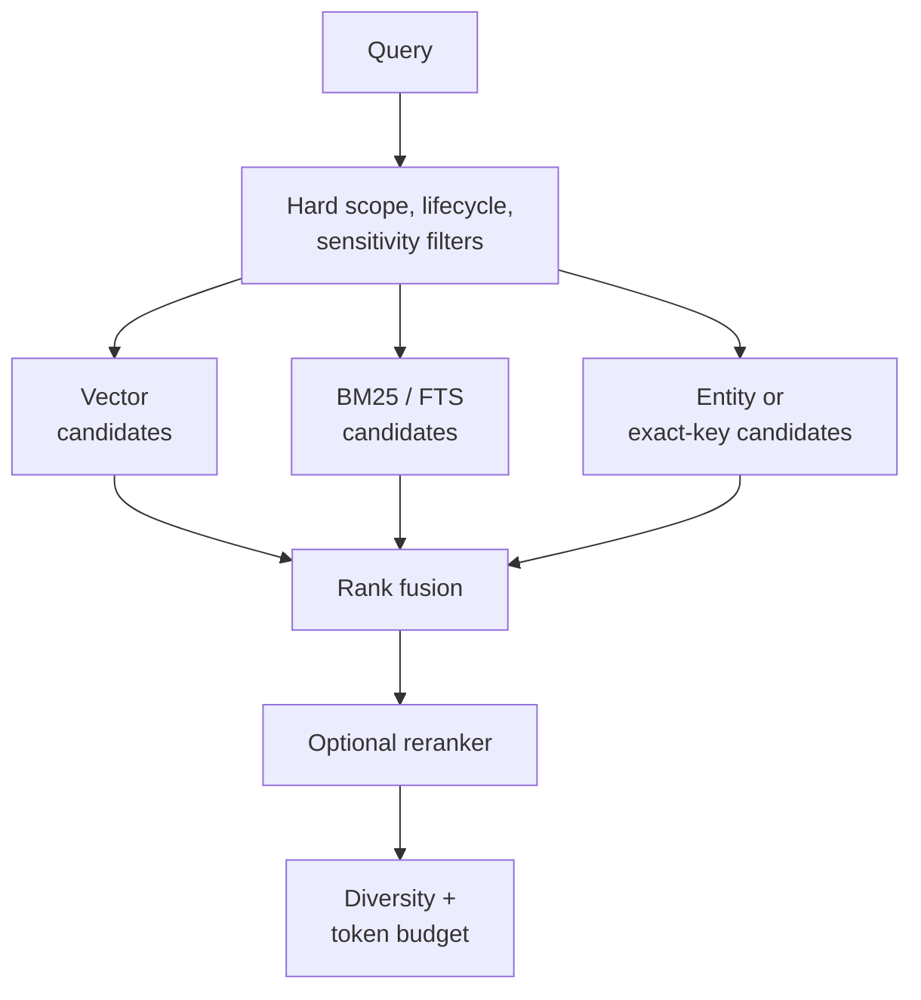

## Intent

Retrieve both conceptually related memory and exact facts, while enforcing scope and lifecycle constraints before results reach the agent.

## The problem

Vector search is good at paraphrase and topical similarity but weak on exact names, identifiers, dates, paths, and negation. Lexical search catches exact strings but misses paraphrase. Either signal alone produces avoidable blind spots.

## The pattern

Apply hard filters first, retrieve candidates through independent channels, normalize or rank their outputs, then fuse and cap the final context:

Reciprocal-rank fusion is a useful baseline because it combines rankings without pretending incomparable scores share a calibrated scale. Weighted score fusion can work when every component has measured, bounded behavior.

## Why it works

The channels fail differently. Semantic search recalls meaning; lexical search protects exactness; metadata enforces boundaries; entity or key lookup handles structured identity. A reranker can resolve close candidates after cheaper retrieval has narrowed the set.

## Tradeoffs

- More channels add latency and operational complexity.
- Ad hoc score normalization makes rankings hard to explain.
- Heuristic bonuses can dominate if they are not bounded.
- Reranking without evaluation adds cost without known benefit.
- The final result and token limit must be enforced after fusion.

Do not call retrieval “hybrid” merely because two backends exist. The important behavior is intentional candidate fusion under one measured cutoff.

## Cost to adopt

**Build:** a second retrieval arm, a fusion step, and a way to inspect which arm
contributed each result. RRF is a dozen lines; the inspection is what makes it
maintainable.

**Forces elsewhere:** each arm needs its own index kept in sync with writes, and
a backend that silently lacks one of them degrades to single-arm search while
still reporting itself as hybrid — a failure this atlas has found more than once.

**Ongoing:** fusion weights are tuning surface, and nothing tells you they have
drifted except a benchmark you probably do not have.

**Skip it if** your corpus is small enough that exact search alone answers well.
Boring FTS over a few thousand records outperforms an untuned hybrid stack.

## Seen in the atlas

[Gini](../../systems/gini-agent/) is the most legible implementation, because it
documents its channels and their provenance in a header comment: semantic cosine,
BM25 over FTS5, graph spreading activation seeded from the top semantic hits with
decay δ=0.5, and a temporal range match — fused with reciprocal rank fusion and
reranked. The temporal arm **only participates when the query contains a temporal
expression**, which is a small idea worth copying: a channel that cannot
contribute should not dilute the fusion.

[HippoRAG](../../systems/hipporag/) is the instructive alternative — it does not
fuse at all. It seeds a personalization vector from query-linked entities plus a
weak dense prior (passage nodes at 0.05) and reads relevance off a Personalized
PageRank diffusion. Multi-hop association becomes a property of the diffusion
rather than of a traversal policy or a weighted sum.

[LlamaIndex](../../systems/llamaindex/) composes instead of fusing: each memory
block contributes independently under its own share of a token budget, and each
truncates itself when over. The assembled context is easier to reason about than
a single fused ranking, because every contributor's share is separately visible.

[Hindsight](../../systems/hindsight/) runs four arms with task-specific fusion and
cross-encoder reranking; [MemPalace](../../systems/mempalace/) contributes the
reusable rule that extracted indexes *boost* drawer ranking but never gate direct
evidence retrieval; [mem0](../../systems/mem0/), [Honcho](../../systems/honcho/),
[Basic Memory](../../systems/basic-memory/), [agentmemory](../../systems/agentmemory/),
[CowAgent](../../systems/cowagent/), [Magic Context](../../systems/magic-context/),
and [OpenViking](../../systems/openviking/) all fuse lexical and semantic signals.

Two cautions have strengthened with evidence. **Naming is not fusing** —
[Claude-Mem](../../systems/claude-mem/)'s ordinary text search selects semantic
rather than combining it with FTS, and [A-MEM](../../systems/a-mem/)'s "hybrid"
path is vector-only. And **silent degradation is worse than no fusion**:
[Holographic](../../systems/holographic/) redistributes its weights to
lexical-only when NumPy is missing while `is_available()` still returns `True`,
where [Moltis](../../systems/moltis/) makes the same situation explicit with a
`keyword_only()` constructor and a `has_embeddings()` predicate callers can
branch on.

Nobody has shown their weights are right. [MetaClaw](../../systems/metaclaw/) is
the only system in the atlas that could — it replays candidate policies against
past turns and promotes one only on non-regression across eight metrics.
Everyone else, including [Generative Agents](../../systems/generative-agents/)
with its hand-tuned `gw = [0.5, 3, 2]`, ships constants nobody has defended.

[Helm](../../systems/helm/) is the smallest correct instance — both arms and the
fusion are about sixty lines of JavaScript over rows already in memory, with no
FTS extension and no vector store — and it is the clearest place in the atlas to
see that **fusion quality is bounded by candidate generation, not by the fusion
rule.** Its RRF is textbook (k=60, no score normalization, which is the right
refusal when you have no relevance data to calibrate against), and its belief
weight is applied as a multiplier rather than a filter so a low-confidence row is
penalized instead of excluded. Then every arm runs over
`SELECT … WHERE expired_at IS NULL ORDER BY updated DESC LIMIT 500` — a hard
window ordered by **recency**. Past a few hundred active facts, the memories that
stop being candidates are the ones nothing has touched lately, which is precisely
the set of long-lived preferences the store worked hardest to establish. A
perfect ranker over the wrong 500 rows is still wrong, and no amount of fusion
tuning recovers a candidate that was never scored.

Helm is also the atlas's plainest example of **silent tier degradation**. The
semantic arm is a cached MiniLM embedding if the model is on disk, TF-IDF cosine
if it is not, and nothing at all if the import throws — three materially
different retrieval qualities behind one output shape, one `catch {}`, and no
signal to the caller. If a channel can degrade, the result should say which
channel ran.

## Tests to require

- Exact identifiers, paraphrases, dates, negation, and typo cases.
- Scope leakage and lifecycle filtering before ranking.
- Ablations for each retrieval channel.
- Hard assertions that `@k` evaluates exactly the first `k` results.
- Token-volume and latency reporting.
- Stable tie-breaking and bounded heuristic contributions.

## Related patterns

- [Scope as a first-class key](../scope-as-a-first-class-key/)
- [Source-diverse context](../source-diverse-context/)
- [Evidence before belief](../evidence-before-belief/)
