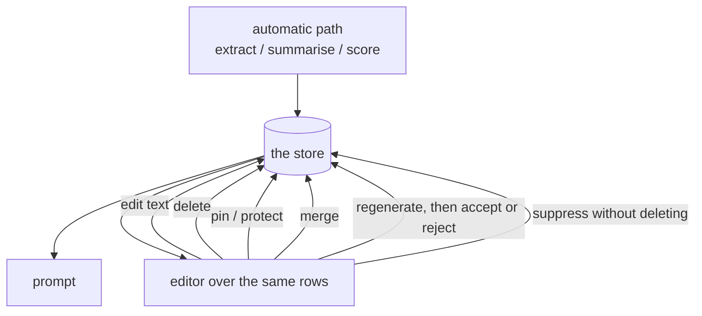

## Intent

Make the memory a user can *change* the same object the model reads. Not a
viewer, not an export, not a support ticket — an editor whose writes are
authoritative.

## The problem

Every automatic memory system is wrong sometimes. Extraction misreads a joke as a
preference, a summary drops the thing that mattered, a consolidation pass merges
two people into one. The corpus in this atlas shows this is not rare, and shows
something sharper: **most systems have no path from a user noticing to the store
changing.** Correction, where it exists, means telling the model in conversation
and hoping the next extraction pass agrees.

The usual response is a memory dashboard. A dashboard that only displays is worse
than none, because it shows the user a wrong fact they cannot fix and teaches
them the memory is not theirs.

There is a second, less obvious cost. A system whose memory cannot be edited must
be *right*, so it accumulates machinery — trust scores, confidence thresholds,
verification passes — to approximate a judgement a person could have made in one
click.

## The pattern

Give the store an editor, and make every verb the automatic path has available to
a person too:

Five verbs distinguish an editor from a viewer:

1. **Edit the text** in place — the stored value, not a note attached to it.
2. **Delete**, and have the deletion hold against the next automatic pass.
3. **Pin**, so a unit is exempt from eviction, decay, or budget pressure.
4. **Merge**, because the automatic path over-splits.
5. **Regenerate with a preview** — run the model again on one unit and accept or
   reject the result *before* it replaces anything.

The fifth is what separates a good editor from a dangerous one, and it
generalises: any lossy rewrite a system performs automatically is safer as a
previewed action a person triggers.

A sixth verb is worth having where it fits: **suppress without deleting**, a
third state between present and gone, for material you want kept and not
surfaced.

## Why it works

- It is the cheapest correction mechanism that exists. One click beats a trust
  state machine at fixing one wrong fact, and needs no model.
- It puts the authority where the knowledge is. The user knows whether the fact
  is right; the extractor is guessing.
- It changes what the automatic path has to achieve. Recall can be aggressive if
  a person can prune, so the write path does not have to be conservative.
- It makes the store legible, which is how users come to trust it — and trust is
  why they tolerate an imperfect memory rather than switching.

## Tradeoffs

It does not scale past what a person will maintain. This is the pattern's real
boundary, and it is why systems that must *learn* cannot rely on it alone.

**An edit with no history is a new failure mode.** Overwriting in place loses what
was there, and a deletion with no record can be re-derived by the next extraction
pass from the same source material — so the editor appears to work and quietly
does not. Pair it with the
[rejected-value tombstone](../rejected-value-tombstone/) or an
[append-only audit](../append-only-memory-audit/); an editor over a store with
neither is a correction that does not hold.

Editing is a write path, and it needs the same scope checks as any other. A
shared memory with an unauthenticated editor is worse than no editor.

## In the analyzed systems

**[SillyTavern](../../systems/sillytavern/)** is the extreme case: the editor is
the *only* write path. Nothing extracts, so there is no automatic path to
correct — a person authors entries, keys and activation settings directly. It
carries no rubric mechanism in this atlas and is plausibly the most-exercised
memory implementation in existence, and those two facts are the same fact. Users
tolerate hand-authoring because it means the memory is exactly what they decided.

**[RisuAI](../../systems/risuai/)**'s HypaV3 modal is the most complete editor
over *machine-written* memory here, and carries all five verbs: edit text,
delete-from-here, merge with a union of source ids, pin via `isImportant`, and
bulk re-summarise **with the result previewed before it is accepted**. That last
one is the same operation its 2023 generation performed silently on a threshold,
which is the clearest before-and-after of this pattern in the corpus.

**[Soul of Waifu](../../systems/soul-of-waifu/)** is the cautionary version. The
API is right — `restore_backup` even takes a backup of the current state before
overwriting, so a restore is itself undoable — and **nothing in the application
calls it.** `list_backups`, `list_topic_files` and `get_memory_stats` have no
callers either. Five good backups sit on disk with no way to reach them, which
shows this pattern is a product property rather than an architectural one:
unreachable correctness is not correctness.

**[Skales](../../systems/skales/)** shows partial adoption, which is worse than
none. Two of its three stores delete correctly from the memory page; the third
answers a delete request by telling the user to "ask in chat", and no such verb
exists. One page, three stores, inconsistent authority.

**[Logseq](../../systems/logseq/)** inverts the framing usefully: it is an editor
that acquired an agent, rather than an agent that acquired an editor. Its
conflict handling is last-write-wins by editing, which is what happens when the
human path is assumed to be the only one.

Elsewhere in the atlas, `human_review` is held by a minority of systems, and most
of those are approval of a queue rather than editing of the store — a reviewer
says yes or no to what the extractor proposed and cannot rewrite it.

**One sighting outside the corpus takes the pattern to its limit: an editing
surface with nothing behind it.** Cline's **Memory Bank** — six markdown files in
the user's own repository, read at the start of a session and rewritten at the
end — carries every verb on this page for free. A person edits the file, and
that edit *is* the memory; the model's write goes through the same file with the
same tools; a diff shows what changed; a PR review catches a bad one; git holds
the history. There is no store to fall out of sync with the editor because there
is no store. It gets no report — [recorded as an
exclusion](../../compare/#known-limitations) — for the reason that makes it
useful here: grepping the checkout for the mechanism returns two files and both
are documentation, so what implements it is a prompt plus the agent's ordinary
file tools.

Read against the systems above, it isolates what the pattern is actually buying.
SillyTavern is hand-authored and needs no correction path; RisuAI built a real
editor over machine-written memory and it took a modal with five verbs; Soul of
Waifu wrote the API and never wired it up. Memory Bank skips all of that by
making the memory a document in the first place — and pays for it in the one
place a document cannot help: **nothing consults the file before a write.** A
deletion holds until the next update pass re-derives the same paragraph from the
same conversation, because no record survives saying it was removed on purpose.
That is the [rejected-value tombstone](../rejected-value-tombstone/) gap, arrived
at from the direction of having no database at all, and it is the argument that
editability and negative memory are separate properties rather than two views of
one.

## Tests to write first

- Edit a unit, then run the automatic pass, and assert the edit survives.
- Delete a unit, re-feed the source material that produced it, and assert it does
  not come back. This distinguishes an editor from a suggestion box, and almost
  nothing in this atlas has it.
- Assert a pinned unit survives eviction, decay and budget pressure.
- Merge two units and assert provenance is the union, not the newer one.
- Reject a previewed regeneration and assert the store is byte-identical.
- Assert every editor verb is reachable from the shipped UI. A test that the
  function exists is not the same as a person being able to reach it — which is
  exactly the gap in Soul of Waifu.

## Related

- [Rejected-value tombstone](../rejected-value-tombstone/) — what makes a user's
  deletion hold against re-extraction.
- [Append-only memory audit](../append-only-memory-audit/) — what makes an edit
  recoverable.
- [Retrieval hysteresis](../retrieval-hysteresis/) — the per-unit knobs an editor
  usually exposes.
- [Trust-state machine](../trust-state-machine/) — the machinery this pattern
  partly substitutes for, and partly needs.
