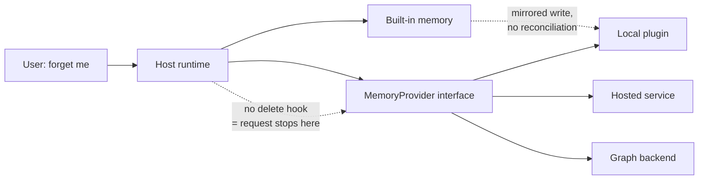

## Intent

Let an agent runtime treat memory as a replaceable component: one interface, many backends, chosen by configuration. Then answer the question the interface makes urgent — when memory lives in someone else's store, who is responsible for forgetting?

## The problem

A host runtime that hard-codes its memory model forces every user into one set of trade-offs. A local Markdown store cannot do cross-session user modelling; a hosted graph service is overkill for a single developer's laptop. So mature runtimes make memory pluggable.

The moment they do, memory stops being one system and becomes two: the **host**, which owns the conversation, the prompt, the user relationship, and any built-in memory of its own; and the **provider**, which owns durable storage, extraction, and retrieval.

Responsibilities that were implicit in a single system now have to cross a boundary:

- The user tells the host to forget something. Does that reach the provider?
- The provider extracts a claim the host never reviewed. Whose trust model applies?
- The host has its own built-in memory *and* a provider is mounted. Which wins, and are they deduplicated?
- The host wraps messages in scaffolding. Does the provider know to strip it?
- The host is multi-tenant. Does the interface even carry a scope?

Interfaces built around the happy path — write, read, prefetch — answer none of these.

## The pattern

Define a lifecycle contract the host calls at known points, and make the ownership questions explicit parts of it rather than leaving them to each plugin.

A workable contract has four groups:

```text
Lifecycle    initialize / shutdown / on_session_start / on_session_end
Read         prefetch(query, scope) -> context block
             system_prompt_block() -> static text
Write        sync_turn(user, assistant, scope)
             on_memory_write(action, target, content)   # mirror host writes
Governance   forget(scope | id) -> result               # <-- usually missing
             scope on EVERY call                        # <-- usually missing
             capabilities() -> what this provider actually supports
```



The dotted edges are where real implementations break.

## Why it works

A narrow interface at a real seam lets the host own conversation, prompt assembly, and policy while the provider owns storage and retrieval. Users pick a backend matching their privacy and scale needs without the host reimplementing five memory architectures. Providers reach many hosts by implementing one contract.

It also concentrates governance in one place: if the interface requires scope on every call and defines a deletion path, every backend inherits those properties whether or not its author thought about them.

## Tradeoffs

- **Deletion is the hard one.** Without a `forget` hook, a host-level erasure request has nowhere to go. The host can delete its own copy and still leave the content in a hosted provider indefinitely.
- **Trust state does not survive the boundary.** A host with candidate/verified semantics cannot express them to a provider that stores flat facts, and vice versa.
- **Mirroring creates duplicates.** Copying host writes into the provider is the obvious way to keep them in sync, and it silently creates two records with independent lifecycles unless removals mirror too.
- **Capabilities vary wildly.** One provider does hybrid retrieval and bi-temporal validity; another does vector-only lookup. If the interface cannot report capabilities, the host must assume the weakest.
- **One provider at a time** is the usual limit, chosen to avoid tool-schema bloat and conflicting backends — which means no composition, and switching backends usually means abandoning accumulated memory.
- **The host's scaffolding leaks.** Providers receive whatever text the host passes; if that includes context markers, reply headers, or compaction summaries, it becomes memory.

Do not adopt this pattern to postpone deciding on a memory model. It relocates the decision; it does not remove it.

## Seen in the atlas

[Hermes Agent](../../systems/hermes-agent/) has the most explicit contract: a `MemoryProvider` ABC with roughly seventeen lifecycle members covering initialization, prompt blocks, prefetch, per-turn sync, tool schemas and dispatch, session end and switch, pre-compression extraction, delegation observation, config, and backup paths, with a `MemoryManager` that mounts exactly one external provider. First-party adapters ship in-tree for Honcho, Mem0, Hindsight, Supermemory, OpenViking, ByteRover, RetainDB, and the built-in Holographic plugin — so the adapters are reviewable even when a backing service is not. The contract has **no deletion hook and no scope parameter**.

[OpenClaw](../../systems/openclaw/) reaches the same shape from the other direction: `memory-core` defines the plugin contract and CLI while `memory-lancedb` is merely the reference backend, with third-party Redis, Mem0, and Supermemory plugins implementing the same surface. Its store layer shows the discipline the interface itself lacks — `scopedPredicate` composes agent scope and user filter into one predicate "so scope cannot be lost", and deletes are scoped too.

[Holographic](../../systems/holographic/) demonstrates the mirroring hazard concretely. Its `on_memory_write` copies the host's built-in memory additions into its own SQLite store, but implements only the `add` action — so removing an entry from the host's `MEMORY.md` leaves the mirrored fact in place, with no reconciliation path.

[Pi](../../systems/pi/) is the strongest form of the argument, because it has no memory contract at all. Its `ExtensionAPI` exposes more than twenty lifecycle events — `session_start`, `session_before_fork`, `session_before_compact`, `context` with a result type, and more — which is ample *mechanism*, and none of it is memory-shaped. A plugin can capture, inject, and consolidate; it cannot be handed a scope or told to forget, because nothing in the host knows memory exists. [Magic Context](../../systems/magic-context/) consequently rebuilds message indexing, FTS, embeddings, and scope from scratch on top of those events, and has to decide for itself what a forked session inherits.

[TencentDB Agent Memory](../../systems/tencentdb-agent-memory/) is the atlas's other plugin-shaped system, targeting both OpenClaw and Hermes, and it also lacks a first-class user-facing forget operation — the same gap arriving from the provider side rather than the host side.

Two providers in this ecosystem — [Redis Agent Memory Server](../../systems/redis-agent-memory-server/) and [OpenViking](../../systems/openviking/) — have far richer internal scope and lifecycle models than the interfaces mounting them can express, which is the clearest evidence that the contract, not the backend, is the limiting factor.

## Tests to require

- Delete a memory through the host and prove it is gone from the mounted provider, not just from the host's own store.
- Mirror a host write into a provider, remove it at the host, and assert the mirrored copy is removed or explicitly marked orphaned.
- Switch providers and verify the host does not silently serve stale context from the previous backend.
- Issue a request under one scope and assert no provider call can return another scope's memory.
- Feed the provider a message carrying the host's own envelope markers or compaction summaries and assert none of it becomes durable memory.
- Mount a provider that fails or times out, and assert the agent degrades rather than blocking or losing the turn.
- Fork or branch a session and assert the memory each branch sees is what you intended — an untested question wherever the host supports branching.
- Assert that a provider advertising a capability it lacks is detected — for example, one reporting "hybrid" retrieval while running vector-only.
- Run the host's built-in memory and a provider together, and assert the same fact is not injected twice.

## Related patterns

- [Explicit write destination](../explicit-write-destination/)
- [Scope as a first-class key](../scope-as-a-first-class-key/)
- [Governed write gateway](../governed-write-gateway/)
- [Rejected-value tombstone](../rejected-value-tombstone/)
