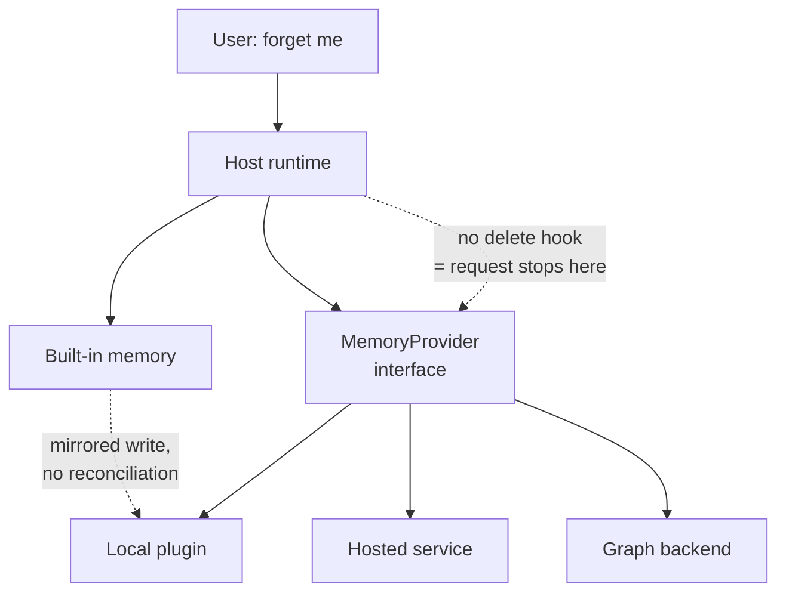

## Intent

Let an agent runtime treat memory as a replaceable component: one interface, many backends, chosen by configuration. Then answer the question the interface makes urgent — when memory lives in someone else's store, who is responsible for forgetting?

## The problem

A host runtime that hard-codes its memory model forces every user into one set of trade-offs. A local Markdown store cannot do cross-session user modelling; a hosted graph service is overkill for a single developer's laptop. So mature runtimes make memory pluggable.

The moment they do, memory stops being one system and becomes two: the **host**, which owns the conversation, the prompt, the user relationship, and any built-in memory of its own; and the **provider**, which owns durable storage, extraction, and retrieval.

Responsibilities that were implicit in a single system now have to cross a boundary:

- The user tells the host to forget something. Does that reach the provider?
- The provider extracts a claim the host never reviewed. Whose trust model applies?
- The host has its own built-in memory *and* a provider is mounted. Which wins, and are they deduplicated?
- The host wraps messages in scaffolding. Does the provider know to strip it?
- The host is multi-tenant. Does the interface even carry a scope?

Interfaces built around the happy path — write, read, prefetch — answer none of these.

## The pattern

Define a lifecycle contract the host calls at known points, and make the ownership questions explicit parts of it rather than leaving them to each plugin.

A workable contract has four groups:

```text
Lifecycle    initialize / shutdown / on_session_start / on_session_end
Read         prefetch(query, scope) -> context block
             system_prompt_block() -> static text
Write        sync_turn(user, assistant, scope)
             on_memory_write(action, target, content)   # mirror host writes
Governance   forget(scope | id) -> result               # <-- usually missing
             scope on EVERY call                        # <-- usually missing
             capabilities() -> what this provider actually supports
```



The dotted edges are where real implementations break.

## Why it works

A narrow interface at a real seam lets the host own conversation, prompt assembly, and policy while the provider owns storage and retrieval. Users pick a backend matching their privacy and scale needs without the host reimplementing five memory architectures. Providers reach many hosts by implementing one contract.

It also concentrates governance in one place: if the interface requires scope on every call and defines a deletion path, every backend inherits those properties whether or not its author thought about them.

## Tradeoffs

- **Deletion is the hard one.** Without a `forget` hook, a host-level erasure request has nowhere to go. The host can delete its own copy and still leave the content in a hosted provider indefinitely.
- **Trust state does not survive the boundary.** A host with candidate/verified semantics cannot express them to a provider that stores flat facts, and vice versa.
- **Mirroring creates duplicates.** Copying host writes into the provider is the obvious way to keep them in sync, and it silently creates two records with independent lifecycles unless removals mirror too.
- **Capabilities vary wildly.** One provider does hybrid retrieval and bi-temporal validity; another does vector-only lookup. If the interface cannot report capabilities, the host must assume the weakest.
- **One provider at a time** is the usual limit, chosen to avoid tool-schema bloat and conflicting backends — which means no composition, and switching backends usually means abandoning accumulated memory.
- **The host's scaffolding leaks.** Providers receive whatever text the host passes; if that includes context markers, reply headers, or compaction summaries, it becomes memory.

Do not adopt this pattern to postpone deciding on a memory model. It relocates the decision; it does not remove it.

## Cost to adopt

**Build:** an interface, a lifecycle for mounting providers, and — the part most
implementations skip — scope and deletion in the contract itself.

**Forces elsewhere:** the contract is the ceiling on every backend's
capabilities. Anything absent from it (deletion, scope, trust state) is
unreachable no matter what the backend supports, and widening a published
contract breaks implementers.

**Ongoing:** every provider needs its own tests, and cross-cutting concerns like
retry and metrics belong in decorators rather than in each backend.

**Skip it if** you will only ever run one backend. An interface with one
implementation is a guess about the future.

## Seen in the atlas

[Hermes Agent](../../systems/hermes-agent/) has the most explicit contract: a `MemoryProvider` ABC with roughly seventeen lifecycle members covering initialization, prompt blocks, prefetch, per-turn sync, tool schemas and dispatch, session end and switch, pre-compression extraction, delegation observation, config, and backup paths, with a `MemoryManager` that mounts exactly one external provider. First-party adapters ship in-tree for Honcho, Mem0, Hindsight, Supermemory, OpenViking, ByteRover, RetainDB, and the built-in Holographic plugin — so the adapters are reviewable even when a backing service is not. The contract has **no deletion hook and no scope parameter**.

[OpenClaw](../../systems/openclaw/) reaches the same shape from the other direction: `memory-core` defines the plugin contract and CLI while `memory-lancedb` is merely the reference backend, with third-party Redis, Mem0, and Supermemory plugins implementing the same surface. Its store layer shows the discipline the interface itself lacks — `scopedPredicate` composes agent scope and user filter into one predicate "so scope cannot be lost", and deletes are scoped too.

[Holographic](../../systems/holographic/) demonstrates the mirroring hazard concretely. Its `on_memory_write` copies the host's built-in memory additions into its own SQLite store, but implements only the `add` action — so removing an entry from the host's `MEMORY.md` leaves the mirrored fact in place, with no reconciliation path.

[Pi](../../systems/pi/) is the strongest form of the argument, because it has no memory contract at all. Its `ExtensionAPI` exposes more than twenty lifecycle events — `session_start`, `session_before_fork`, `session_before_compact`, `context` with a result type, and more — which is ample *mechanism*, and none of it is memory-shaped. A plugin can capture, inject, and consolidate; it cannot be handed a scope or told to forget, because nothing in the host knows memory exists. [Magic Context](../../systems/magic-context/) consequently rebuilds message indexing, FTS, embeddings, and scope from scratch on top of those events, and has to decide for itself what a forked session inherits.

[TencentDB Agent Memory](../../systems/tencentdb-agent-memory/) is the atlas's other plugin-shaped system, targeting both OpenClaw and Hermes, and it also lacks a first-class user-facing forget operation — the same gap arriving from the provider side rather than the host side.

[MateClaw](../../systems/mateclaw/) is the counterexample that shows the gap is a choice, not an inevitability. Its `MemoryProvider` SPI declares paired overloads — `prefetch(agentId, query)` and `prefetch(agentId, query, ownerKey)`, `syncTurn(...)` with and without `ownerKey` — so scope crosses the boundary. It also handles the resilience question the other contracts leave to each plugin: `spi/decorator/` wraps any provider in `MetricsMemoryProvider` and `RetryableMemoryProvider`, so retry and instrumentation are solved once for every backend rather than reimplemented per plugin. Default interface methods give implicit capability negotiation — a provider implements what it supports.

MateClaw still has **no deletion hook**, so it closes half the governance gap and leaves the other half open.

**The count on this page and the one in the comparative report were counting different sets, and both are restated here.** Nine contracts have now been read — Hermes, OpenClaw, Pi (which has none), MateClaw, ADK, AutoGen, Agno's `LearningStore`, Microsoft's `ContextProvider`, and the Pydantic AI Harness's `MemoryStore`, with CAMEL's `AgentMemory` a tenth if you count `clear` as removal. Two declare scope: ADK by required keyword argument, MateClaw by paired overloads. **One declares targeted deletion, and only one** — the Pydantic AI Harness, whose Protocol is `read`, `get_operation`, `write`, `delete`, `list_paths`. Everything else offers `clear()`, or nothing.

[Agno](../../systems/agno/) is the fifth, and it separates two things the other four conflate. Its `LearningStore` Protocol declares six methods — `recall`, `process`, `build_context`, `instructions`, `get_tools`, `learning_type` — and every one of them takes `**kwargs`. So the contract expresses **neither scope nor deletion**, and both exist anyway: `recall(user_id)` returns `None` when the key is missing, `retire_fact` keeps a superseded row, `forget` archives an entity. The reason is that Agno writes the contract *and* six implementations behind it, so what the interface fails to require, the same team supplies. That is worth naming because it inverts the finding above — the contract is the limiting factor when the contract author is not the implementer, and a permissive interface is survivable exactly when they are the same people. It is also fragile in the predictable way: a third-party store satisfying that Protocol can ignore `user_id` entirely and nothing detects it. Agno's own `_filter_store_kwargs` exists to keep narrow third-party stores working when the framework adds context kwargs, which is thoughtful, and which also means a store that quietly drops the scope key is indistinguishable from one that never wanted it.

**[Cosmonapse](../../systems/cosmonapse/)'s `Engram` is the only contract here with a failure vocabulary, and the omission is glaring once you have seen one.** Every other interface on this page models the happy path: write, read, prefetch. This one ships five typed errors — `EngramTimeout` for an elapsed deadline, `EngramCancelled` for a task killed mid-call, `EngramNotBound` for storage nobody wired, and `EngramOverloaded` for a backend that **shed load** — and two methods that follow from taking failure seriously. `can_serve(query) -> bool` lets a backend decline (the docstring's example is a BM25 engram asked for vector search, and the hosting Dendrite then skips responding), which is the only place in this atlas where "retrieval can return nothing" is a capability the contract can express. `compensate(trace_id)` reverses every journaled write for a trace, replaying inverses LIFO so nested overwrites unwind, with `commit(trace_id)` discarding the journal at the workflow's commit point.

Two limits are documented rather than left to be found, which is the right way to ship a rollback: compensation is best-effort, so a failing inverse is logged and the rest still run, and only Engram state is reversed — external side effects are explicitly out of scope. The limit that is *not* documented is where the journal lives: `self._saga_journal` is a dictionary on the instance, so in a protocol whose transports include NATS and Kafka precisely because workers are disposable, the rollback guarantee lasts exactly as long as the process. It also carries **no scope parameter**, which makes four contracts on this page with that gap.

[LightAgent](https://github.com/wanxingai/LightAgent) shows the pattern at its smallest — a 196-line `shared_memory.py` with swappable adapters shipped as examples (`clawmem_memory_adapter.py`, `vector_memory_adapter.py`). The shape survives the scale reduction; so does the missing deletion path.

Two providers in this ecosystem — [Redis Agent Memory Server](../../systems/redis-agent-memory-server/) and [OpenViking](../../systems/openviking/) — have far richer internal scope and lifecycle models than the interfaces mounting them can express, which is the clearest evidence that the contract, not the backend, is the limiting factor.

### The vendor-neutral contract nobody signed up for

Every interface above is a host's, and each was designed by people who had to make one runtime work. There is now one that is not: OpenTelemetry's [GenAI semantic conventions](https://github.com/open-telemetry/semantic-conventions-genai) define, at `46d43c8949afb53765a202e89f4534eeb75ca3fa`, a `gen_ai.operation.name` enum containing seven memory operations — `create_memory`, `search_memory`, `update_memory`, `upsert_memory`, `delete_memory`, `create_memory_store`, `delete_memory_store` — all at development stability. It stores nothing and is not a memory system, so it gets no report here; it is an observability vocabulary, which makes it the closest thing the field has to an agreed answer about what operations memory *has*.

Read against this page's own tally, two things stand out.

**It names deletion, twice, and at both granularities.** Of the ten host contracts read here, exactly one declares targeted deletion. The vocabulary written by nobody's runtime declares `delete_memory` for records and `delete_memory_store` for the whole store, and gives `gen_ai.memory.record.count` an explicit meaning for a delete — *"the number of memory records the operation attempted to delete"*. It also names `upsert_memory` separately from create and update, defined as create-or-update *"without the caller choosing which"*, which is the operation most of these systems actually implement and almost none of them name.

**It declares no scope at all.** There is no tenant, user, project or agent attribute on a memory operation — only `gen_ai.memory.store.id`, with the note that each component *"SHOULD document what `gen_ai.memory.store.id` maps to"*. Isolation is left as an implementation detail of the store id, which is the same gap four host contracts on this page have, arriving from a fifth direction.

The record schema is the sharper version of the same point. `model/gen-ai/gen-ai-memory-records.json` defines a `MemoryRecord` as `content` (the only required field), `id`, `score`, and an opaque `metadata` object. No validity interval, no trust state, no provenance, no supersession pointer — every mechanism the [tombstone](../rejected-value-tombstone/), [bi-temporal validity](../bi-temporal-fact-validity/) and [trust state machine](../trust-state-machine/) pages are about falls into `metadata`, where it is by construction not comparable across implementations. That is not a criticism of a development-stage spec, which is right to standardise the common shape first. It is a statement about what the common shape currently is: **a scored string with an id**.

## Tests to require

- Delete a memory through the host and prove it is gone from the mounted provider, not just from the host's own store.
- Mirror a host write into a provider, remove it at the host, and assert the mirrored copy is removed or explicitly marked orphaned.
- Switch providers and verify the host does not silently serve stale context from the previous backend.
- Issue a request under one scope and assert no provider call can return another scope's memory.
- Feed the provider a message carrying the host's own envelope markers or compaction summaries and assert none of it becomes durable memory.
- Mount a provider that fails or times out, and assert the agent degrades rather than blocking or losing the turn.
- Fork or branch a session and assert the memory each branch sees is what you intended — an untested question wherever the host supports branching.
- Wrap a deliberately failing provider in the host's resilience layer and assert the turn degrades rather than stalling — and that the failure is visible in metrics, not just logged.
- Assert that a provider advertising a capability it lacks is detected — for example, one reporting "hybrid" retrieval while running vector-only.
- Run the host's built-in memory and a provider together, and assert the same fact is not injected twice.

## Related patterns

- [Explicit write destination](../explicit-write-destination/)
- [Scope as a first-class key](../scope-as-a-first-class-key/)
- [Governed write gateway](../governed-write-gateway/)
- [Rejected-value tombstone](../rejected-value-tombstone/)
