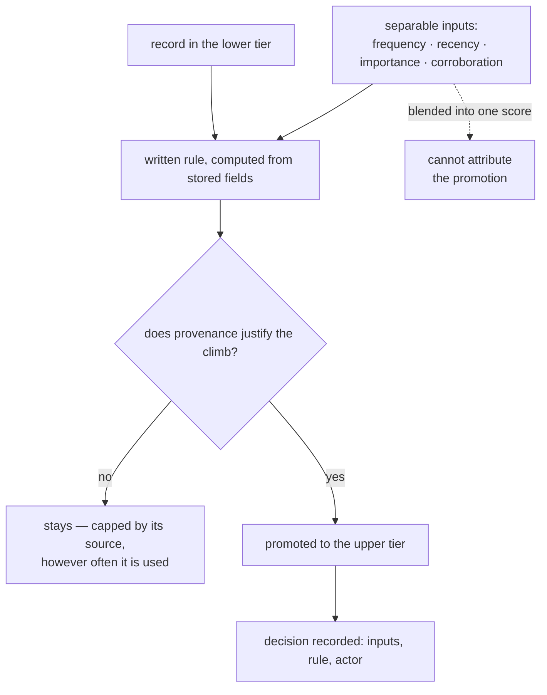

## Intent

If memory has storage tiers, name the rule that promotes between them, make it
computable, and be able to say why any given record is in the tier it is in.

The page makes two kinds of claim. A computable rule for moving a memory between
storage tiers — working to episodic, short- to mid- to long-term, a live store to
a durable file — is reported practice:
[MemoryOS](../../systems/memoryos/), [MemOS](../../systems/memos/),
[dsh-ai-memory](../../systems/dsh-ai-memory/) and
[cortexgraph](../../systems/cortexgraph/) each ship one. That the rule's inputs
stay separate, that provenance caps it, and that each promotion is recorded with
its reasons is argued, from partial instances named below.

The line with [trust-state machine](../trust-state-machine/) runs between *where
a memory is stored* and *what is believed about it*: a status that decides
whether a memory may be acted on — a corroboration threshold, an outcome-counted
ladder, a provenance cap on a `verified` label — belongs there, and this page is
about the move from one store to another.

## The problem

Tiering is a common structure in agent memory: short-term and long-term, hot
and archival, working and durable, core and recall. It is almost free to
describe, which is why so many systems have it.

What varies is the answer to **what moves a memory up**. The usual shapes:

- **No rule at all.** A summarizer runs every *N* turns and whatever it emits is
  now long-term. The tier boundary is a schedule, not a judgement.
- **A rule inside a prompt.** An LLM is asked to decide what is worth keeping,
  with the criteria in prose that nobody reviews as policy.
- **A rule nobody validated.** A formula with named coefficients, shipped at
  their defaults, with no ablation.

All three produce the same failure, and it is quiet: **the long-term store fills
with whatever the promotion path happened to favour**, and because the path is
unstated nobody can say what that was. Memory does not break; it slowly stops
being about the right things, and the only symptom is answers getting less useful
in ways nobody can attribute.

A second failure follows from the first. If promotion is unexplained, so is its
inverse — a record that never promotes is invisible, and *not* promoting is the
decision with no error message.

## The pattern

```text
tier boundary
   │
   ├─ a written rule, computable from stored fields
   ├─ inputs that are separately meaningful, not one blended score
   ├─ a ceiling: what a record's provenance forbids, regardless of use
   └─ a record of why this one promoted, queryable later
```



Four requirements:

1. **Write the rule down**, as something a program computes rather than a
   sentence a model interprets. A formula with named coefficients can be
   ablated; a prompt cannot.
2. **Keep the inputs separable.** Frequency, recency, importance and corroboration
   answer different questions, and a single blended scalar cannot say which one
   promoted a record.
3. **Give provenance a veto.** Use should be able to raise a record's standing
   and never past what its source justifies — otherwise a guess that got popular
   becomes canon.
4. **Record the decision**, so "why is this in long-term memory" is a lookup.

## Why it works

It converts a boundary that everything crosses into a decision that can be
examined. Once the rule is computable you can ablate it, once the inputs are
separable you can attribute a promotion, and once provenance caps the ladder the
worst failure — a popular error becoming permanent — is structurally unavailable
rather than merely unlikely.

## Tradeoffs

- **A written rule invites false confidence.** A formula looks principled at a
  glance; unvalidated coefficients are a prompt with extra steps.
- **Separable inputs cost schema.** Four fields where one would do, each needing
  a definition and a writer.
- **A ceiling can be wrong.** If provenance is asserted rather than verified, the
  cap inherits the honesty of whatever set it.
- **Promotion is one-way in most implementations.** Demotion is rarer and harder,
  and a monotonic ladder means an early mistake is permanent unless correction
  lives on a different axis.

## Cost to adopt

**Build:** the fields the rule reads, the rule itself, and a place to record why
a promotion happened.

**Forces elsewhere:** retrieval must respect tiers or they are decoration, and
the background pass that promotes needs the same recoverability as any other —
a promotion pass that dies halfway leaves the boundary in an undefined state.

**Ongoing:** the coefficients are a tuning surface with no natural feedback. If
nothing measures promotion quality, the rule is frozen at whatever its author
guessed.

**Skip it if** you have one tier. Two tiers with no rule is worse than one tier,
because it implies a judgement that is not being made.

## Seen in the atlas

### The computable rule — reported

[MemoryOS](../../systems/memoryos/) writes the rule down, which is the right
instinct and shows the trap: `alpha·N_visit + beta·L_interaction + gamma·R_recency`
with all three coefficients left at 1 and no ablation. Because the terms are
summed, `L_interaction` means **a long conversation scores like a
frequently-revisited one** — verbosity is indistinguishable from importance, and
long-term memory is built from what wins. It also keeps a *second* access counter
for LFU eviction, so the number that decides what is hot and the number that
decides what is deleted can disagree about the same segment.

[MemOS](../../systems/memos/) has the same shape one step further out. On a
timed trigger its scheduler sorts working memories by an importance score
weighting list position, a keyword score and a recording count
`[0.9, 0.05, 0.05]`, and copies the top slice into activation memory as KV-cache
items — one blended scalar, so which input moved a memory is not recoverable.

[cortexgraph](../../systems/cortexgraph/) promotes out of its live store into a
Markdown vault a person reads: a memory above a strength threshold and with
enough use is written out, and `promoted_at` and `promoted_to` are set on the
row.

[dsh-ai-memory](../../systems/dsh-ai-memory/) shows both ways a tier rule fails
without any model involved. Working notes move to episodic after an age, and
episodic notes to an untimed `profile` tier after an age once `access_count`
reaches a minimum of two. Its `chat` preset expires a working note at the same
age it would promote it, and `consolidate` checks the TTL first, so under the
preset the plugin ships an unpinned working note is deleted rather than promoted
— pinned notes skip expiry and can promote — while the type's own doc comment
says to set retention longer than the promote delay. And `access_count` is
incremented for every hit the per-prompt prefetch returns, 128 of them with no
floor, so being injected twice is being accessed twice and the profile tier fills
with whatever lasted a week.

Other systems tier with no rule over stored fields at all.
[Letta](../../systems/letta/)'s core, archival and recall tiers are written by
the agent's own tool calls, so the rule is whatever the model decides — the
rule-inside-a-prompt shape. [LoongFlow](../../systems/loongflow/)'s stm, mtm and
ltm pass material through a `Compressor`. [Mercury](../../systems/mercury-agent/)
keeps a `subconscious` tier below active recall, and its report found nothing that
states what moves a memory into or out of it.
[Redis Agent Memory Server](../../systems/redis-agent-memory-server/) works the
other end of the lifecycle: its forgetting policy combines TTL, inactivity,
pinning, per-type allowlists and budget pruning, and what it selects is deleted
rather than moved to a lower tier.

### Separate inputs, a ceiling, a recorded decision — argued

No system cited here has all three on a storage-tier move; each has part.

**Separate inputs.** [NOOA Memory](../../systems/nooa-memory/) keeps
`importance`, `salience`, `confidence` and a spaced-repetition `strength`
apart, and retrieval moves only the last. Its paper adds the detail that closes
the loop: "injected memories are not reinforced, so what the harness surfaces
does not distort the usage signal" — the fix for dsh-ai-memory's prefetch.

**A ceiling.** [Core Memory](../../systems/core-memory/) caps a ladder by its
source. Grounding — `observed`, `extracted`, `inferred`, `speculative` — bounds
the C/B/A `confidence_class` a bead can reach: a speculative bead "cannot reach
canonical status", explicitly "not via recall, not even via promotion", and
committed cases assert it across an index rebuild. The ladder it caps ranks and
sets assembly depth rather than moving a bead between stores, so this is the
ceiling shown on a confidence ladder; a status cap of the same kind is on
[trust-state machine](../trust-state-machine/).

**A recorded decision.** [CSM](../../systems/csm/) promotes from a candidate
queue into durable memory through five gates — confidence, reinforcement,
zero contradictions, evidence references and distinct source sessions — and
every decision carries a `thresholdChecks` object with actual against required
for each, so a promotion report explains its own refusals. It ships disabled
and dry-run by default, and `minSessions` defaults to 1, which makes the
session-diversity gate a no-op until an operator raises it.
[OmniIntelligence](../../systems/omniintelligence/) records the same thing on a
status ladder: every transition writes a row with a `gate_snapshot` of the gate
conditions at transition time, under a foreign key that refuses deletion.

[Cambium](../../systems/cambium/) names the inputs that must not qualify. Its
status standard says *"A status MUST NOT be upgraded directly because the file
exists, its length reaches a threshold, or automated checks pass"*, and its
deterministic scripts emit only `fail` and `candidate`, so the tooling can
nominate work and has no outcome that promotes. It governs status axes on wiki
pages rather than storage tiers, and nothing in the repository enforces the
prohibition; the list of cheap signals — an age, a size, a passing check —
applies to a storage-tier rule unchanged.

The measured warning comes from NOOA Memory's paper, and it applies to whatever
promotion produces: reflection records are "22% of rows yet ~1% of both read
channels". A fifth of that store is distilled material that retrieval almost
never surfaces. Promotion succeeded; usefulness did not follow.

## Tests to require

- State the rule, then compute it by hand for ten promoted records and ten that
  were not. If you cannot, it is not a rule.
- Ablate each term. If removing one does not change which records promote, it is
  not doing work.
- Feed the system a long, low-value exchange and a short, decisive one, and
  check which promotes.
- Assert a low-provenance record cannot reach the top tier by any amount of
  retrieval.
- Measure what fraction of promoted records are ever read back. If the top tier
  is not being retrieved, promotion is a cost with no return.
- Kill the promotion pass halfway and assert the tier boundary is still
  well-defined.
- Check that retrieval actually respects the tiers, rather than ranking across
  all of them and rendering the boundary decorative.

## Related patterns

- [Decay and reinforcement](../decay-and-reinforcement/)
- [Trust-state machine](../trust-state-machine/)
- [Evidence before belief](../evidence-before-belief/)
- [Gate the expensive path](../gate-the-expensive-path/)
