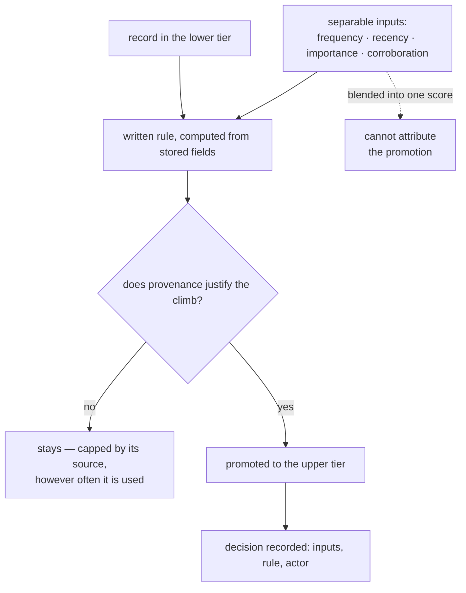

## Intent

If memory has tiers, name the rule that promotes between them, make it
computable, and be able to say why any given record is in the tier it is in.

## The problem

Tiering is the most common structure in agent memory: short-term and long-term,
hot and archival, working and durable, core and recall. It is close to universal
and almost free to describe, which is why nearly every system has it.

What is not universal is an answer to **what moves a memory up**. The usual
shapes:

- **No rule at all.** A summarizer runs every *N* turns and whatever it emits is
  now long-term. The tier boundary is a schedule, not a judgement.
- **A rule inside a prompt.** An LLM is asked to decide what is worth keeping,
  with the criteria in prose that nobody reviews as policy.
- **A rule nobody validated.** A formula with named coefficients, shipped at
  their defaults, with no ablation.

All three produce the same failure, and it is quiet: **the long-term store fills
with whatever the promotion path happened to favour**, and because the path is
unstated nobody can say what that was. Memory does not break; it slowly stops
being about the right things, and the only symptom is answers getting less useful
in ways nobody can attribute.

A second failure follows from the first. If promotion is unexplained, so is its
inverse — a record that never promotes is invisible, and *not* promoting is the
decision with no error message.

## The pattern

```text
tier boundary
   │
   ├─ a written rule, computable from stored fields
   ├─ inputs that are separately meaningful, not one blended score
   ├─ a ceiling: what a record's provenance forbids, regardless of use
   └─ a record of why this one promoted, queryable later
```



Four requirements:

1. **Write the rule down**, as something a program computes rather than a
   sentence a model interprets. A formula with named coefficients can be
   ablated; a prompt cannot.
2. **Keep the inputs separable.** Frequency, recency, importance and corroboration
   answer different questions, and a single blended scalar cannot say which one
   promoted a record.
3. **Give provenance a veto.** Use should be able to raise a record's standing
   and never past what its source justifies — otherwise a guess that got popular
   becomes canon.
4. **Record the decision**, so "why is this in long-term memory" is a lookup.

## Why it works

It converts a boundary that everything crosses into a decision that can be
examined. Once the rule is computable you can ablate it, once the inputs are
separable you can attribute a promotion, and once provenance caps the ladder the
worst failure — a popular error becoming permanent — is structurally unavailable
rather than merely unlikely.

## Tradeoffs

- **A written rule invites false confidence.** A formula looks principled at a
  glance; unvalidated coefficients are a prompt with extra steps.
- **Separable inputs cost schema.** Four fields where one would do, each needing
  a definition and a writer.
- **A ceiling can be wrong.** If provenance is asserted rather than verified, the
  cap inherits the honesty of whatever set it.
- **Promotion is one-way in most implementations.** Demotion is rarer and harder,
  and a monotonic ladder means an early mistake is permanent unless correction
  lives on a different axis.

## Cost to adopt

**Build:** the fields the rule reads, the rule itself, and a place to record why
a promotion happened.

**Forces elsewhere:** retrieval must respect tiers or they are decoration, and
the background pass that promotes needs the same recoverability as any other —
a promotion pass that dies halfway leaves the boundary in an undefined state.

**Ongoing:** the coefficients are a tuning surface with no natural feedback. If
nothing measures promotion quality, the rule is frozen at whatever its author
guessed.

**Skip it if** you have one tier. Two tiers with no rule is worse than one tier,
because it implies a judgement that is not being made.

## Seen in the atlas

Tiering is everywhere; the rule is not.

[MemoryOS](../../systems/memoryos/) writes the rule down, which is the right
instinct and shows the trap: `alpha·N_visit + beta·L_interaction + gamma·R_recency`
with all three coefficients left at 1 and no ablation. Because the terms are
summed, `L_interaction` means **a long conversation scores like a
frequently-revisited one** — verbosity is indistinguishable from importance, and
long-term memory is built from what wins. It also keeps a *second* access counter
for LFU eviction, so the number that decides what is hot and the number that
decides what is deleted can disagree about the same segment.

[Core Memory](../../systems/core-memory/) has the most developed answer, and it is
a ceiling rather than a score. Grounding — `observed`, `extracted`, `inferred`,
`speculative` — caps how far a record can climb: a speculative bead "cannot reach
canonical status", explicitly "not via recall, not even via promotion". Use
raises standing; it cannot raise it past what the source justifies. The class is
also monotonic, with correction handled on a separate axis, so superseding a
class-A claim preserves the record of how carefully it was established.

[NOOA Memory](../../systems/nooa-memory/) separates the inputs properly —
`importance`, `salience`, `confidence` and a spaced-repetition `strength`, where
retrieval moves only the last. Its paper adds the detail that closes the loop:
"injected memories are not reinforced, so what the harness surfaces does not
distort the usage signal."

[Mercury](../../systems/mercury-agent/) grades confidence, importance and
durability separately and keeps a subconscious tier below active recall.
[Redis Agent Memory Server](../../systems/redis-agent-memory-server/) has the
inverse — the atlas's most developed *demotion* policy, combining TTL,
inactivity, pinning, per-type allowlists and budget pruning.

The larger group tiers without a stated rule: [Letta](../../systems/letta/)'s
core, archival and recall; [MemOS](../../systems/memos/), whose promotion varies
by cube; [LoongFlow](../../systems/loongflow/)'s stm/mtm/ltm with auto-compress.
The tiers are real; what crosses them is a schedule.

The measured warning comes from NOOA Memory's paper, and it applies to whatever
promotion produces: reflection records are "22% of rows yet ~1% of both read
channels". A fifth of that store is distilled material that retrieval essentially
never surfaces. Promotion succeeded; usefulness did not follow.

## Tests to require

- State the rule, then compute it by hand for ten promoted records and ten that
  were not. If you cannot, it is not a rule.
- Ablate each term. If removing one does not change which records promote, it is
  not doing work.
- Feed the system a long, low-value exchange and a short, decisive one, and
  check which promotes.
- Assert a low-provenance record cannot reach the top tier by any amount of
  retrieval.
- Measure what fraction of promoted records are ever read back. If the top tier
  is not being retrieved, promotion is a cost with no return.
- Kill the promotion pass halfway and assert the tier boundary is still
  well-defined.
- Check that retrieval actually respects the tiers, rather than ranking across
  all of them and rendering the boundary decorative.

## Related patterns

- [Decay and reinforcement](../decay-and-reinforcement/)
- [Trust-state machine](../trust-state-machine/)
- [Evidence before belief](../evidence-before-belief/)
- [Gate the expensive path](../gate-the-expensive-path/)
