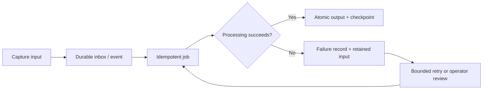

## Intent

Move expensive memory processing out of the interaction path without losing the information when a worker, model provider, parser, or write fails.

## The problem

Automatic memory capture is often asynchronous. The interactive request succeeds, but a later extraction call times out or a worker crashes between writing chunks and updating indexes. If the raw input or job state is ephemeral, the session appears remembered while its durable memory is incomplete.

## The pattern

Persist work before acknowledging it:

Jobs carry stable IDs, input hashes, processor versions, attempt counts, and checkpoints. Outputs use deterministic identities or transactional upserts so retrying cannot duplicate memories. Poison inputs move to a reviewable dead-letter state rather than retrying forever.

For lossy extraction, retain a fenced raw fallback that can be redistilled after the provider or schema is repaired.

## Why it works

The interaction path stays responsive while the system gains at-least-once processing without accepting duplicate durable state. Operators can distinguish delayed memory from lost memory and can replay work after model or embedding upgrades.

## Tradeoffs

Queues and checkpoints add operational machinery and eventual consistency. Retained inputs may contain sensitive transcripts. Retry storms can amplify provider failures. Idempotency is difficult when one job writes several stores that lack a shared transaction.

Expose freshness to callers; do not make asynchronous derivation look immediately consistent.

## Seen in the atlas

[Claude-Mem](../../systems/claude-mem/) is the clearest durable hook-queue example: provider authentication and quota failures return claimed work to pending, canonical SQLite storage precedes acknowledgement, and Chroma synchronization is a best-effort projection. [Cognee](../../systems/cognee/) stamps cognify artifacts with pipeline provenance, rolls failed runs back, and recovers sufficiently old non-terminal runs at startup. [llm-wiki-memory](../../systems/llm-wiki-memory/) retains failed inputs and uses redistillation to turn provider failure into delayed work. [Hindsight](../../systems/hindsight/) gives consolidation indefinite capped retries, deterministic-error filtering, and per-bank deduplication. [Mastra Observational Memory](../../systems/mastra-observational-memory/) persists early observation/reflection buffers with durable range markers before activation. [TencentDB Agent Memory](../../systems/tencentdb-agent-memory/) checkpoints capture, persists L0 before deferred embeddings, and drains registered tasks at shutdown, but its JSONL/store update path is not atomic. [agentmemory](../../systems/agentmemory/) keeps synchronous capture cheap and makes indexing/consolidation repairable projections. [Basic Memory](../../systems/basic-memory/) can rebuild file-derived graph/search projections through startup reconciliation. [Honcho](../../systems/honcho/) uses derivation queues; [MemPalace](../../systems/mempalace/) includes repair and reindex paths.

## Tests to require

- Crash before, during, and after each state mutation.
- Retry the same job and prove outputs are not duplicated.
- Preserve failed inputs and processor-version metadata.
- Enforce retry limits and dead-letter review.
- Delete a source while its jobs are queued.
- Report derivation freshness and partial failure accurately.

## Related patterns

- [Evidence before belief](../evidence-before-belief/)
- [Append-only memory audit](../append-only-memory-audit/)
- [Governed write gateway](../governed-write-gateway/)
- [Zero-LLM capture](../zero-llm-capture/)
