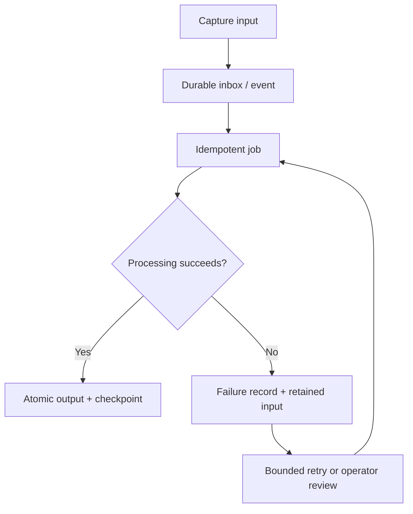

## Intent

Move expensive memory processing out of the interaction path without losing the information when a worker, model provider, parser, or write fails.

## The problem

Automatic memory capture is often asynchronous. The interactive request succeeds, but a later extraction call times out or a worker crashes between writing chunks and updating indexes. If the raw input or job state is ephemeral, the session appears remembered while its durable memory is incomplete.

## The pattern

Persist work before acknowledging it:

Jobs carry stable IDs, input hashes, processor versions, attempt counts, and checkpoints. Outputs use deterministic identities or transactional upserts so retrying cannot duplicate memories. Poison inputs move to a reviewable dead-letter state rather than retrying forever.

For lossy extraction, retain a fenced raw fallback that can be redistilled after the provider or schema is repaired.

## Why it works

The interaction path stays responsive while the system gains at-least-once processing without accepting duplicate durable state. Operators can distinguish delayed memory from lost memory and can replay work after model or embedding upgrades.

## Tradeoffs

Queues and checkpoints add operational machinery and eventual consistency. Retained inputs may contain sensitive transcripts. Retry storms can amplify provider failures. Idempotency is difficult when one job writes several stores that lack a shared transaction.

Expose freshness to callers; do not make asynchronous derivation look immediately consistent.

## Cost to adopt

**Build:** durable input records, an explicit job state, idempotent processing,
and a dead-letter path with something that actually looks at it.

**Forces elsewhere:** idempotency is the expensive requirement — every extractor
and consolidator needs a stable key so a retry does not duplicate. Retrofitting
that is harder than building it in.

**Ongoing:** a queue is an operational surface. It needs monitoring, and a
dead-letter path nobody reads is the same as no dead-letter path.

**Skip it if** capture is synchronous and cheap. The pattern exists to protect
work that happens away from the user.

## Seen in the atlas

[nanobot](../../systems/nanobot/) contributes the cheapest correct mechanism in
the atlas, and it is worth trying before any retry queue. Its `Dream`
consolidation runs against an append-only archive tracked by a **consumption
cursor**, and `DreamRunProgress` watches for tool events with `phase == "error"`.
A run that nominally completed but hit tool errors **does not advance the
cursor** — so the material is simply reprocessed next time. No retry queue, no
dead-letter table, no partial state to reconcile: the work is not recorded as
done, so it is not done.

The producer/consumer split is what makes this safe. `.cursor` marks how far the
Consolidator has written; `.dream_cursor` marks how far Dream has read. A slow or
failing consumer never blocks the producer and never silently skips material.

[Magic Context](../../systems/magic-context/) reached the same conclusion from
the opposite direction, and its code records the lesson: an earlier version used
a **global commit watermark with all-or-nothing coverage**, reworked to
per-memory `verified_at` so that "partial progress STICKS: a timed-out verify
banks the memories it checked; the next run skips them and continues (the
cold-start trap is gone)." Global watermarks make partial progress worthless.

[Claude-Mem](../../systems/claude-mem/) is the durable hook-queue example:
failures return claimed work to pending, canonical SQLite precedes
acknowledgement, and Chroma sync is a best-effort projection.

[Daimon](../../systems/daimon/) adds the part this pattern usually leaves to the
operator: a **classifier over the capture log, and a command that shows it**.
Every spawn and every result line is appended to one log, and a fold reduces it
per session into outstanding failures, hung children, and retry-exhausted cases —
which `daimon status` reports honestly, including crashes, and `daimon heal`
re-drives. Liveness is decided by a heartbeat the child touches at every chunk
and merge rather than by wall-clock, so a genuinely slow extraction is not
mistaken for a dead one. Retries are capped at one per session with an explicit
`--force` override, and the reasoning is recorded: the cap bounds token burn on
a permanently bad transcript.

Its recovery unit is the interesting choice. Chunk extractions are cached by
content under an explicit version key, so a heal, a merge failure, or simply a
transcript that grew re-pays only for the chunks that changed. The cache key is
deliberately separate from the prompt version — wording edits keep the cache
warm, semantic changes rotate it — which is the distinction between versioning
your *output format* and versioning your *unit of work*.
[Cognee](../../systems/cognee/) stamps artifacts with pipeline provenance, rolls
failed runs back, and recovers stale non-terminal runs at startup.
[llm-wiki-memory](../../systems/llm-wiki-memory/) retains failed inputs for
redistillation. [Hindsight](../../systems/hindsight/) gives consolidation capped
retries with deterministic-error filtering.
[Redis Agent Memory Server](../../systems/redis-agent-memory-server/) debounces
and defers extraction, so a failure delays work rather than losing it.
[Mastra](../../systems/mastra-observational-memory/) persists buffers with
durable range markers before activation.
[TencentDB](../../systems/tencentdb-agent-memory/) checkpoints capture, but its
JSONL/store update path is not atomic.
[Basic Memory](../../systems/basic-memory/) rebuilds projections through startup
reconciliation.

## Tests to require

- Crash before, during, and after each state mutation.
- Retry the same job and prove outputs are not duplicated.
- Preserve failed inputs and processor-version metadata.
- Enforce retry limits and dead-letter review.
- Delete a source while its jobs are queued.
- Report derivation freshness and partial failure accurately.

## Related patterns

- [Evidence before belief](../evidence-before-belief/)
- [Append-only memory audit](../append-only-memory-audit/)
- [Governed write gateway](../governed-write-gateway/)
- [Zero-LLM capture](../zero-llm-capture/)
