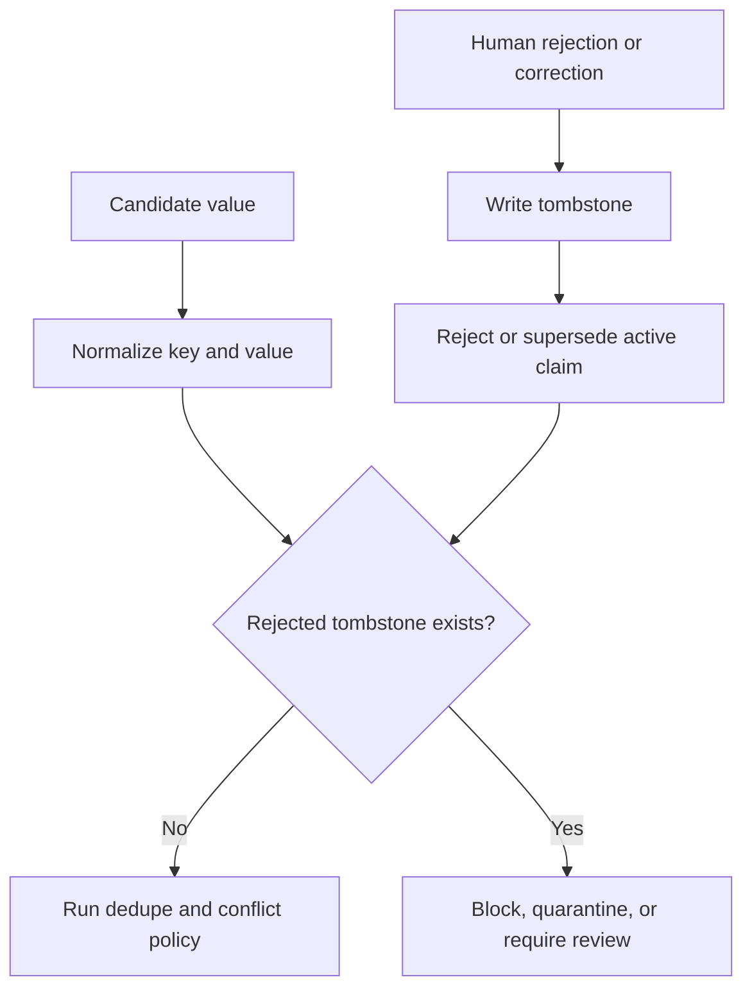

> **This is not an established best practice.** Nine systems of one hundred and sixty-four
> carry it: one invented it under adversarial pressure, one adopted it from the
> first, one arrived at a weaker form independently, one was driven to it by a
> regulation, two built it after this page named its absence in their report, **two
> have it as a side effect of a lookup that forgot to exclude the rejected row**,
> and one built it as ordinary plumbing in its write gate.
> Sorted by mechanism rather than by mark, **five of the nine** refuse the write
> — [the table below](#the-nine-sorted-by-what-actually-stops-the-value) says
> which, and what the other four do instead.
> There is no consensus
> behind this page, no library that provides the mechanism, and no shared
> vocabulary for it. Everything below is an argument, and the provenance is
> traced under *Seen in the atlas* so you can weigh it as one.

## Intent

Remember not only what the system currently believes, but also which values were deliberately rejected. Use that negative knowledge during future writes.

### The name collides with two others, and the difference is the whole pattern

A reader arriving from distributed systems or from ordinary CRUD will recognise
the word and read the wrong thing, so it is worth separating three mechanisms
that share it:

| | Keyed on | Lifetime | Purpose |
| --- | --- | --- | --- |
| **Cassandra-style tombstone** | a row or cell | until compaction garbage-collects it | propagate a delete across replicas |
| **Soft delete** | a row, via `deleted_at` | usually forever, but invisible to queries | hide a row while keeping it recoverable |
| **Rejected-value tombstone** | the **value**, normalised | outlives the row it came from | refuse the value when something tries to write it *again* |

The first two are keyed on a **record** and exist to make a deletion take effect.
This one is keyed on the **content** and exists to make a deletion *stay* in
effect against a writer that has never seen the old row — a re-extraction from a
retained transcript, a sync from an unchanged upstream file, a model rediscovering
the claim in a later conversation. Deleting the row does not help there, because
the new write creates a different row saying the same wrong thing.

If a better name exists, this atlas has not found it, and the term is used here
with that collision acknowledged rather than hidden. What matters is the key, not
the word.

## The problem

Deleting or superseding a wrong memory removes it from normal recall, but it does not stop the same value from returning. A later conversation, stale document, model extraction, or synchronization pass can rediscover the old claim and create it as if it were new.

This is memory laundering: history that the system already judged wrong re-enters through a different write path.

## The pattern

Store a durable tombstone keyed by the semantic identity of the rejected value:

```text
scope + subject + predicate + normalized value
```

The tombstone records why, when, and by whom the value was rejected, plus the claim or evidence that triggered the decision. Normal retrieval suppresses it. Every automated write checks it before activation.



## Why it works

A tombstone changes correction from a point-in-time mutation into a durable constraint. It prevents repeat failures across extraction runs and preserves enough history to explain why a write was refused.

It is stronger than a soft-delete flag on the old claim because the check is value-oriented. The new proposal may have a different record ID or arrive from a different source.

## Tradeoffs

- Normalization mistakes can block a legitimately different value.
- Truth can change; some tombstones need expiry or explicit reactivation.
- Scope matters. A rejection in one project or user context may not apply globally.
- The tombstone itself can contain sensitive data and must follow deletion policy.
- Model writes should normally be blocked, while a trusted human correction may be allowed to override with an auditable action.

Do not use tombstones as the sole conflict model. A new competing value may deserve a candidate state rather than immediate rejection.

## Cost to adopt

**Build:** a normalized form for values so "Berlin" and "berlin" hash the same;
a tombstone table keyed on (subject, predicate, normalized value, scope); a check
on the write path of every ingestion route, including background ones.

**Forces elsewhere:** every extractor and background job must consult the check,
so a system with several write paths pays this per path. Normalization is where
the real work is — too strict and the tombstone never fires, too loose and it
blocks legitimate updates.

**Ongoing:** tombstones accumulate and need their own retention policy, and a
user who changes their mind needs a way to lift one.

**Skip it if** nothing re-derives memory automatically. A store written only by
explicit user action cannot resurrect a value on its own, and supersession is
enough.

## Seen in the atlas

**Nine systems in the atlas have this.** That is still the most striking negative
result in the atlas, and it is the reason this page exists.

[Verel](../../systems/verel/) uses rejected memory records as a correctness
mechanism and protects rejected states from ordinary pruning.
[RainBox](../../systems/rainbox/) stores `MemoryRejectedValue` rows when claims
are rejected or superseded, and model writes check them before asserting.
[Daimon](../../systems/daimon/) is the third and the weakest, and it is
instructive precisely because of *how* it is weaker.
[Provem](../../systems/provem/) is the fourth and the first to arrive at it from
regulation rather than from a failure, discussed below.
[memsem](../../systems/memsem/) is the fifth, refuses the write like the first
two rather than filtering the read like the middle two, and puts the mechanism
behind a human decision — discussed below.
[Perseus Vault](../../systems/perseus-vault/) is the sixth and the only one that
refuses a value without storing it — discussed below.
[Universal Memory Engine](../../systems/universal-memory-engine/) is the ninth
and the plainest — a suppression table the write gate consults at four points,
discussed below.

**Where it came from: an adversary, not a designer.** Verel's git history dates
the mechanism to 28 June 2026, inside a numbered red-team sequence, and the
commit that introduces it describes the attack it closes:

> "rejection wasn't durable across supersede-then-restate: reject *paris* →
> supersede with *london* (rebuilds CANDIDATE, erasing the verdict) → restate
> *paris* + attest → VERIFIED. `write()` now carries a durable `rejected_values`
> set forward across supersessions, and the gate refuses to promote any value
> that was ever rejected for that key."

Nobody set out to build negative memory. A red team walked a rejected value back
to verified in three steps, and the tombstone is what the fix turned into.

The next three rounds are the more useful part, because each one defeated the
previous fix — and they map onto the tradeoffs listed above:

| Round | What got past the tombstone | The fix |
| --- | --- | --- |
| 8 | TTL pruning deleted the tombstone, "reopened the supersede-then-restate launder after ~90 idle days" | `REJECTED` made prune-exempt, like `VERIFIED` |
| 9 | NFKC divergence — the gate compared `fact.text.strip().lower()`, so unicode look-alikes slipped through | NFKC-canonical rejection |
| 12 | key collisions and an unbounded ledger | injective `make_key`, bounded rejection ledger |

One detail about how it reached this atlas is worth keeping, because it is the
clearest argument for reading code rather than documentation. When the survey
that became this atlas read Verel, the mechanism was about half a day old and
**the README did not mention it once** — that file advertised "trust +
provenance, consolidation, and a held-out, attested promotion gate". The survey
found the tombstone in the source, along with `make_key()`, and
`canonical_text()` "shared by recall rendering and rejection comparison" — the
normalization seam round 9 had hardened hours earlier. A README-based survey
would have missed the atlas's most-quoted finding entirely.

Round 9 is empirical confirmation of the first tradeoff on this page.
Normalization really is where the work is, and it was found by attacking the
mechanism rather than by reasoning about it.

[Memori](../../systems/memori/) is the same seam reached from the opposite
direction, and it is worth reading as a warning about the *positive* case.
It builds a careful content-addressable key — implemented twice, in Rust and
Python, with a comment requiring the two to agree, and unit-tested for case and
punctuation insensitivity — and uses it to deduplicate facts rather than to
reject them. The normalization keeps ASCII alphanumerics only, so any fact
written in a non-Latin script reduces to the empty string and every such fact
hashes identically. Nobody attacked it; the tests simply never passed it a
non-ASCII string. Whatever a content key is *for* — deduplication here, refusal
in Verel — normalization is the part that decides whether it works, and it is the
part that looks finished long before it is. Round 8 is the same for the fourth:
a tombstone that expires is not a tombstone.

**The two systems are not independent inventions, and the count should be read
accordingly.** RainBox's git history dates its tombstone to 29 June 2026, the
same day as the comparative survey that later became this atlas — a survey whose
RainBox report stated plainly that "it does not implement Verel-style
rejected-value tombstones", and whose recommendations listed "keep rejected
tombstones". So the field has produced this mechanism **once**, in Verel, and
copied it once — into the system belonging to the person who ran the survey.

That makes the negative result stronger rather than weaker. Two of one hundred and sixty-four
would suggest a hard idea that a few teams reach independently. One of
one hundred and sixty-four, plus one adoption by a reader who went looking, suggests an idea
that is *not* being reached at all — and that the way it spread was somebody
reading another project's source.

**The third is an independent arrival, and it stops short in the two places this
page predicts.** [Daimon](../../systems/daimon/)'s `daimon forget` deletes the
item from the live checkpoint and appends a `forgotten:<content-hash>` event to
an append-only log. Because item ids are `sha1("<field>:<text>")`, that event is
keyed on the *value*, not on a row: an identical re-extraction in a later
session lands on the same id, is withheld from the briefing, is not carried
forward, and is deleted from the search index across every historical checkpoint
on the next rebuild. There is no evidence the author had read Verel or RainBox;
the mechanism falls out of content-addressed ids rather than from a red-team
finding.

Two differences matter, and both are on the tradeoff list above.

*It is mostly suppression at read, not refusal at write.* Verel and RainBox
refuse the write; Daimon lets the extractor re-assert the value into a new
checkpoint on disk and stops it reaching the agent. The observable behaviour is
the same and the failure surface is not: every future read path has to remember
to consult the fold, and the store itself holds content a user asked to forget.
**One write path is an exception** — the supersede-candidate emitter skips values
already in the ledger, which is a consultation the systems in the read-only class
do not have.

*The key is normalized after all, and this page said otherwise for six days.*
The original reading here was that the id is a hash of the exact text. The Daimon
report's re-read on **2026-07-30** recorded the opposite —
*"the tombstone key is canonical rather than literal text"* — and the report was
corrected while this argument was not. `normalize.canonical_text` folds NFKC,
strips invisible characters, collapses whitespace, casefolds and **translates
confusables**, and `content_key` truncates a digest under a docstring naming the
direction it fails in: *"a prefix collision over-blocks, the fail-safe direction
for a deletion guarantee"*. That is the round-9 lesson implemented, not missed.
What still separates Daimon from Verel and RainBox is the write path, above —
not the key.

Recorded rather than silently edited, because the failure is instructive: a
pattern page argues from reports, the reports get re-read, and nothing connects
the two. This one was caught by
[re-deriving the strong-form subset](https://github.com/neoneye/agent-memory-atlas/blob/main/notes/2026-08-07-the-strong-form-tombstone-subset.md),
which is a thing nobody does on a schedule.

Everything else stops at supersession, archival, or deletion — mechanisms that
remove a value from view without recording that it was *judged wrong*:

**The fourth arrival came from a regulation, and it has the most forgiving key.**
[Provem](../../systems/provem/)'s `forget(term, scope)` deletes the matching
records, appends the term's **token set** to a per-tenant `erased_terms`
registry, and writes an erasure certificate into the audit log. Every later
recall computes the record's tokens and excludes it with reason `"erased"` if any
registered set is a subset.

Two things separate it from the three above. Its key is a *normalized token
subset* rather than an exact string or a canonicalised value, so a later record
that restates the erased term inside different surrounding text is still caught —
the round-9 lesson on this page, that normalization is where the work is, taken
further than Daimon's exact-text hash takes it, at the cost of a false-positive
surface nobody has measured. And it is **tenant-scoped**, so an erasure for one
customer cannot silently censor another — the only instance here that treats the
scope of a rejection as part of its identity.

It shares Daimon's limitation exactly: suppression at read, not refusal at write.
A re-ingested erased value still lands in the backing store and is stopped on the
way out. For a system whose stated purpose is GDPR Article 17 that is the sharper
version of the same criticism — the regulation is about what you hold, and this
mechanism governs what you serve.

**The fifth is the only one here whose tombstone a person has to arm.**
[memsem](../../systems/memsem/) parks an uncertain fact in a `memory_candidates`
table that no read path joins; rejecting it writes a row into
`memory_suppressions` keyed on the normalised subject, predicate, object and
project, and `blockedBySuppression()` is the first effective statement in
`add()`. A suppressed value is refused outright — no row written, no rival faded —
and `memory_add_many`, the tool the extraction sub-agent is instructed to call,
inherits the same check. Lifting it takes an explicit `memory_unsuppress`, which
is audited. The key is `trim().toLowerCase()`, which is the case-and-space class
rather than Verel's NFKC canonicalisation, and `expires_at` exists in the schema
with nothing writing it, so round 8's lesson — a tombstone that expires is not a
tombstone — is passed by omission rather than by decision.

**What it shows is that the check and the trigger are separable, and that
building the check is the easier half.** memsem's other correction path is
supersession by attenuation: a contradicting write multiplies its rival's
confidence by 0.6 and archives it below 0.25. That path writes no suppression.
Archiving a value because it lost an argument and rejecting a candidate because a
person said no are two judgements about the same sentence, and only the second is
recorded as a rejection — so the write path a background extractor uses reaches
the store through the door with no lock on it. Measured against the project's own
milk/lactose example: an ordinary correction is archived at the third
re-assertion of the value it corrected, and a pinned correction, whose confidence
`fade()` never touches, stops being the top search result at the sixth.

That is this page's argument in one system. A discount on re-entry is paid off by
repetition; a check that refuses is not. memsem carries both mechanisms in the
same file, which makes the comparison unusually clean — and leaves the open
question of whether an automatic judgement should be allowed to write a tombstone
at all, or whether a rejection is by definition something a person does.
**The sixth stores the digest and not the value, which answers a tradeoff on this
page rather than inheriting it.** [Perseus Vault](../../systems/perseus-vault/)'s
`rejected_value_tombstones` is keyed on `(workspace_hash, subject, predicate,
value_sha256)` and carries a reason, an evidence reference, an author id and an
optional expiry. The value is never written — only its SHA-256, over a form that
is JSON-canonicalised when it parses, whitespace-collapsed and lower-cased, so a
re-indented body, a re-ordered object and a case variant all land on the same
tombstone.

That directly addresses the *Tradeoffs* entry above — *"the tombstone itself can
contain sensitive data and must follow deletion policy"* — which is a real problem
for every other holder: a rejection record for a leaked secret is a copy of the
secret. A digest refuses the value without retaining it, and the project states
the property in those terms.

Three further details. It **refuses at the write path** rather than filtering at
read, like Verel and RainBox and unlike Daimon and Provem, enforced in
`remember_impl` with a comment claiming the reach — agent remember, capture,
ingest, connectors, derived writers. Its **override is an audited act**, not a
bypass: a deliberate write passes `allow_rejected=true` and is journaled into the
same hash-chained ledger, which is the shape the tradeoff list above asks for when
a trusted human correction has to win. And the lookup matches on **predicate and
digest without the subject**, so a rejected value is refused under any key in
scope — deliberate, named in a test, and the most aggressive reading of the
normalization tradeoff any holder here takes, with a correspondingly larger
false-positive surface.

The open edge is reach rather than existence: the comment names connectors and
derived writers, and no committed test walks the background consolidation passes,
which is the condition under which record-keyed removal stops holding and the one
this page cares most about.

**The seventh nobody appears to have built.** [Mnemosyne](../../systems/mnemosyne/)
gives every extracted fact a primary key of `compute_fact_id` — a SHA-256 over
the NFC-normalized, length-prefixed subject, predicate and object. A fact that
loses a conflict gets `superseded_by` set, and every read filters
`superseded_by IS NULL`. The part that makes it a tombstone rather than a
supersession is one clause that is *not* there: the lookup at the top of
`consolidate_fact` matches on subject, predicate and object without excluding
superseded rows, so a later extraction of the same value finds the dead row and
updates it — raising its `mention_count` and its confidence, and leaving
`superseded_by` exactly where it was. Nothing in the tree ever clears that
column. The rejection outlives every re-assertion, at the write path, keyed on
the value.

It is the same route Daimon took — a content-addressed id makes the key the
value — reached with none of the intent. No comment claims the behaviour, no
test pins it, and the docstrings around `consolidate_fact` are entirely about
concurrency. Add the obvious-looking `AND superseded_by IS NULL` to that lookup
during a tidy-up and the guarantee is gone, silently, in the direction this page
says failure always looks like success. Which is the argument for the test
bullet below rather than against the mechanism: **a tombstone you got for free
is one you can lose for free.**

Two limits on the reach. The property covers the extracted-fact layer, not the
memory rows — there, `_find_duplicate` matches exact content within a session
and the dedup update preserves an existing `valid_until`, so re-asserting a
memory you invalidated does not revive it, but the same text written from a
different session is a new row with no expiry. And the confidence on the
tombstoned row keeps climbing with each re-mention, so anything that ever did
clear the flag would resurrect the value stronger than it was rejected.

**The eighth is the seventh's mechanism in a different language, and it is the
better instance.** [Nova AI](../../systems/nova-ai/) is a symbolic concept graph
with no model anywhere in it. `weerleg` — refute — sets `status = "rejected"` on
a sense, with the reason and timestamp in that record's own audit log; the
reasoning query and the disambiguation candidate list both filter it out, while
`get_senses()` deliberately keeps showing it, so a person inspecting the graph
sees exactly what the reasoner refuses to use. That split — invisible to
inference, visible to audit — is the cleanest expression of this pattern's intent
in the corpus.

What makes it a tombstone rather than a soft delete is the same omission that
makes [Mnemosyne](../../systems/mnemosyne/) one: the deduplication loop in
`add_sense` matches an incoming definition **by definition text and does not
exclude rejected rows**, and the status branch below it promotes only when
`source == "user"`. So Wikipedia auto-learning or auto-extraction re-deriving a
refuted definition lands on the refusal, leaves it in place, and the reasoner
still cannot see it. The key is the definition — the value — not the row.

Two systems arriving at this by the same accident, in different languages, on
different data models, is worth stating plainly: **the property falls out of
writing dedup against content and rejection against the same record, and it is
destroyed by the tidy-up that adds `AND status != 'rejected'` to the lookup.**
Neither project claims the behaviour and neither pins it with a test. If you have
this shape, write the test before someone helpfully filters it.

Nova is also the only holder here where a human can lift the refusal by
re-teaching the same definition, which sets `confirmed` — the audited override
this page's tradeoff list asks for, present because the same branch that blocks
automatic sources admits the person.

**The ninth is the write gate itself, and it is the plainest instance on this
page.** [Universal Memory Engine](../../systems/universal-memory-engine/)
extracts candidates and resolves them through a gate before anything becomes a
node. Rejecting a candidate with `suppress_similar` calls `addSuppression` with
its `canonical_key`; `memory_suppressions` is a real table indexed on
`(user_id, kind, canonical_key)` with an optional `suppressed_until`; and the
gate consults it at **four** points, a hit producing
`reject(obj, "suppressed_blocked")`. Nothing about it is subtle or accidental,
which is the interesting part — it is what this page asks for, built as
ordinary plumbing by a project that does not appear to have read the argument.

The cleanup pass writes suppressions too, so a deletion binds the future rather
than waiting to be re-derived — the answer to the failure the
[MemoryOps AI](../../systems/memoryops-ai/) entry below describes, in the same
paragraph of the same kind of system.

### The nine, sorted by what actually stops the value

Counting holders of the mark conflates four different mechanisms. Sorted by the
one question that separates them — *does anything read the rejection before the
write completes?* — and re-derived report by report in
[this note](https://github.com/neoneye/agent-memory-atlas/blob/main/notes/2026-08-07-the-strong-form-tombstone-subset.md):

| Kind | Systems | What happens on re-assertion |
| --- | --- | --- |
| **Consulted** — the form this page argues for | [memsem](../../systems/memsem/), [Perseus Vault](../../systems/perseus-vault/), [Universal Memory Engine](../../systems/universal-memory-engine/), [RainBox](../../systems/rainbox/), [Verel](../../systems/verel/) | The write is refused. No row, or no activation |
| **Collided** — durable by accident | [Mnemosyne](../../systems/mnemosyne/), [Nova AI](../../systems/nova-ai/) | The write lands *on* the rejected row, which stays rejected. Held in place by a missing filter, pinned by no test |
| **Suppressed** — the read path hides it | [Provem](../../systems/provem/) | A copy enters the store and is stopped on the way out |
| **Hybrid** | [Daimon](../../systems/daimon/) | All three at once: collided by content-addressed id, suppressed on every read, consulted by one emitter |

**Five of the nine, then, implement the strong form** — value-keyed, normalized,
consulted before the write, refusing activation. The mark is broader than this
page's argument, and a reader deciding what to build should use the table rather
than the count.

**[MemoryOps AI](../../systems/memoryops-ai/) is the closest any system here comes
without arriving**, and it is the best argument on this page that the expensive
half of the pattern is not the hard half. Its records carry
`normalized_content`, computed on write, persisted on every row, and already
compared — the normalization this page's *Cost to adopt* section calls "where the
real work is" is simply done. Deletion is a soft delete setting `deleted_at`,
followed by a compaction pass.

Then the lookup that would catch a returning value reads:

```python
MemoryRecordORM.status == _ACTIVE,
MemoryRecordORM.normalized_content == _norm(content),
```

A value that was deleted and is later re-asserted matches nothing, and lands as a
new active memory with an audit entry that looks like a legitimate creation —
because on its own terms it is one. **The gap is one predicate wide**: the same
comparison run without the `active` filter, or a rejection table keyed on
`(tenant_id, user_id, normalized_content)` consulted before activation.

**[AIMAOS](../../systems/aimaos/) is the other near-miss, and it stores the value
it rejected.** When its duplicate detector decides a new statement contradicts an
existing belief rather than restating it, the row adopts the newer wording and
keeps the old one in `previous_content` — the rejected value, retained, keyed to
the belief it was replaced in. Nothing reads that field. Re-assert the old value
and the same contradiction logic fires in reverse: it supersedes back, the
evidence trail resets again, and the store oscillates between two values with no
record that either was ever judged wrong. **The field this pattern asks for
exists; the lookup does not** — which is the same one-predicate gap as
[MemoryOps AI](../../systems/memoryops-ai/) above, reached from the opposite
direction, by a system that kept the value rather than one that normalised it.

Worth holding beside the rest of that system, because it makes the page's central
claim concrete. This is a project that enforces tenancy through Postgres
row-level security, chains its audit per tenant so it cannot fork, holds
sensitive writes for human approval, and commits eval cases that plant a
cross-tenant memory before asserting it is unreachable. It is *more* careful than
most of the corpus about what may enter. **Admission and rejection are different
problems, and building the first extremely well does not build the second.**

- [Gini](../../systems/gini-agent/) has a `rejected` **status** on a unit, which
  is closer than most, but nothing keyed on the value: an equivalent claim can be
  retained again under a new id.
- [Atomic Agent](../../systems/atomic-agent/) deprecates lessons and retains the
  row — good for history, silent on re-distillation from the same cluster.
- [Mercury](../../systems/mercury-agent/) has a `dismissed` boolean on the record.
- [Magic Context](../../systems/magic-context/), [MetaClaw](../../systems/metaclaw/),
  [Redis Agent Memory Server](../../systems/redis-agent-memory-server/),
  [nanobot](../../systems/nanobot/), [CowAgent](../../systems/cowagent/),
  [Holographic](../../systems/holographic/), [OpenClaw](../../systems/openclaw/),
  [Hermes Agent](../../systems/hermes-agent/), and
  [LlamaIndex](../../systems/llamaindex/) have supersession, archival, or exact
  deletion and no value-level negative memory at all.

The absence matters most where it co-occurs with **automatic re-derivation**,
which is now the common case. CowAgent re-distils `MEMORY.md` nightly from
retained daily files. Atomic Agent re-clusters. Magic Context and Redis Agent
Memory Server both extract on a schedule from retained history. OpenClaw's
auto-capture can restore content a user deleted. In each, "forget that" is a
statement about the present that the next background pass is free to undo.

[llm-wiki-memory](../../systems/llm-wiki-memory/) states the limit plainly:
operational supersession can archive an old leaf but cannot prevent the same
rejected content from being distilled again.

[Memanto](../../systems/memanto/) shows that a *resolution* is not a tombstone
either. Its conflict workflow ends in a human choosing `remove_both`, which is a
deliberate, reasoned, human judgement that two memories are wrong — and it
deletes them. The next night's extraction pass runs over the same sessions with
nothing to consult, so the most carefully made correction in the atlas can be
undone by a scheduled job. The lesson generalizes: the quality of the *decision*
does not matter if the decision leaves no trace the write path can check.

[Memora](../../systems/memora/) comes closest to the shape without arriving at
it. Its supersession pass classifies memory pairs into a defined vocabulary —
including `contradicts` as an edge between two named memories — and hides rather
than deletes the superseded row, so the decision is reversible. But the edge is
between two *ids*, not keyed on the rejected *value*, and Memora ingests
documents and images: re-ingesting the same source produces a new row that
nothing blocks. Rich relation modelling is not a substitute for negative memory.

**One sighting outside the corpus, because of where it was found.**
`os-factory/har` is a harness for running coding agents in isolated worktrees —
no memory in it, no report, [recorded as an
exclusion](../../compare/#known-limitations) — and its
Mission Control dashboard carries an `UnregisteredRepository` table whose schema
comment reads *"Paths removed via unregister — blocks auto-sync re-registration
until force register."* The delete path writes the path into it before dropping
the row; the register path consults it on every write and refuses with a 409
unless the caller passes `force: true`, which deletes the tombstone as the same
act that overrides it. That is the consulted form, with the audited-override
shape this page's tradeoff list asks for. It goes one step further than any
holder above: the client handles the 409 by dropping the path from its *own*
local registry, so the sync loop stops re-asserting instead of failing at the
gate forever — a tombstone that quiets the writer rather than only refusing it.

Two things to take from that and one not to. The failure it closes is the one
named at the top of this page — a periodic pass re-reading an unchanged source
and restating what a person deleted — which is why a `deleted_at` on the row
would not have worked and somebody noticed. It is keyed on a filesystem path, so
it never meets the normalization problem that defeated Verel's round 9 and
Memori's key; this is the pattern on easy mode, and the easy mode is where it
gets built. And nothing tests it, in a tree with 87 test files, beside a
commit gate tested across nine cases — so even here, the negative half is the
half nobody covered. The mechanism is not hard. It is reached when a concrete
re-assertion loop makes the need undeniable, and memory systems have exactly
that loop and mostly have not noticed.

## Tests to require

- **Run the laundering sequence**: reject a value, supersede the claim with a
  different value, then restate the original and corroborate it. Verel's round-7
  finding is that this walks a rejected value back to verified in three steps,
  and it is the concrete attack this pattern exists to stop.
- Age the store past every TTL and prune you have, then run the laundering
  sequence again. Verel's round 8 was exactly this, at ninety idle days.
- Attack the key normalization with unicode look-alikes and case and whitespace
  variants. Verel's round 9 was an NFKC bypass of `strip().lower()`.
- Reject a value, rerun extraction, and prove it stays inactive. Every system
  in the atlas that carries this mechanism should have this test; Daimon, which
  has 1,920 others, does not, and neither do Mnemosyne, with 51,407 lines of
  them, nor Nova AI, whose 21 test files hold five assertions between them. All
  three of those hold the property by accident. A tombstone is the one mechanism
  whose silent failure looks exactly like success.
- Correct A to B, then try to reintroduce A through a different source.
- Verify scope isolation between users, projects, and agents.
- Verify trusted override and tombstone reactivation are audited.
- Exercise normalization variants without conflating materially different values.
- Propagate privacy deletion to tombstones when policy requires true erasure.

Run these as a matrix rather than a checklist — see [the contradiction test](../../benchmarks/#contradiction-test) for the case shapes and the four outcomes worth scoring separately.

## Related patterns

- [Trust-state machine](../trust-state-machine/)
- [Governed write gateway](../governed-write-gateway/)
- [Append-only memory audit](../append-only-memory-audit/)
