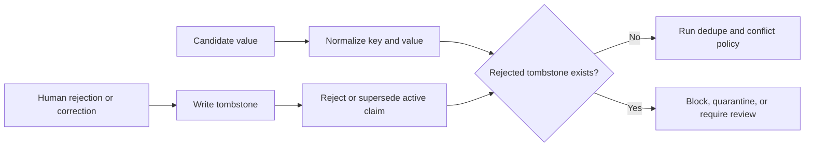

## Intent

Remember not only what the system currently believes, but also which values were deliberately rejected. Use that negative knowledge during future writes.

## The problem

Deleting or superseding a wrong memory removes it from normal recall, but it does not stop the same value from returning. A later conversation, stale document, model extraction, or synchronization pass can rediscover the old claim and create it as if it were new.

This is memory laundering: history that the system already judged wrong re-enters through a different write path.

## The pattern

Store a durable tombstone keyed by the semantic identity of the rejected value:

```text
scope + subject + predicate + normalized value
```

The tombstone records why, when, and by whom the value was rejected, plus the claim or evidence that triggered the decision. Normal retrieval suppresses it. Every automated write checks it before activation.



## Why it works

A tombstone changes correction from a point-in-time mutation into a durable constraint. It prevents repeat failures across extraction runs and preserves enough history to explain why a write was refused.

It is stronger than a soft-delete flag on the old claim because the check is value-oriented. The new proposal may have a different record ID or arrive from a different source.

## Tradeoffs

- Normalization mistakes can block a legitimately different value.
- Truth can change; some tombstones need expiry or explicit reactivation.
- Scope matters. A rejection in one project or user context may not apply globally.
- The tombstone itself can contain sensitive data and must follow deletion policy.
- Model writes should normally be blocked, while a trusted human correction may be allowed to override with an auditable action.

Do not use tombstones as the sole conflict model. A new competing value may deserve a candidate state rather than immediate rejection.

## Cost to adopt

**Build:** a normalized form for values so "Berlin" and "berlin" hash the same;
a tombstone table keyed on (subject, predicate, normalized value, scope); a check
on the write path of every ingestion route, including background ones.

**Forces elsewhere:** every extractor and background job must consult the check,
so a system with several write paths pays this per path. Normalization is where
the real work is — too strict and the tombstone never fires, too loose and it
blocks legitimate updates.

**Ongoing:** tombstones accumulate and need their own retention policy, and a
user who changes their mind needs a way to lift one.

**Skip it if** nothing re-derives memory automatically. A store written only by
explicit user action cannot resurrect a value on its own, and supersession is
enough.

## Seen in the atlas

**Two systems in the atlas have this.** That is the most striking
negative result in the atlas, and it is the reason this page exists.

[Verel](../../systems/verel/) uses rejected memory records as a correctness
mechanism and protects rejected states from ordinary pruning.
[RainBox](../../systems/rainbox/) stores `MemoryRejectedValue` rows when claims
are rejected or superseded, and model writes check them before asserting.

Everything else stops at supersession, archival, or deletion — mechanisms that
remove a value from view without recording that it was *judged wrong*:

- [Gini](../../systems/gini-agent/) has a `rejected` **status** on a unit, which
  is closer than most, but nothing keyed on the value: an equivalent claim can be
  retained again under a new id.
- [Atomic Agent](../../systems/atomic-agent/) deprecates lessons and retains the
  row — good for history, silent on re-distillation from the same cluster.
- [Mercury](../../systems/mercury-agent/) has a `dismissed` boolean on the record.
- [Magic Context](../../systems/magic-context/), [MetaClaw](../../systems/metaclaw/),
  [Redis Agent Memory Server](../../systems/redis-agent-memory-server/),
  [nanobot](../../systems/nanobot/), [CowAgent](../../systems/cowagent/),
  [Holographic](../../systems/holographic/), [OpenClaw](../../systems/openclaw/),
  [Hermes Agent](../../systems/hermes-agent/), and
  [LlamaIndex](../../systems/llamaindex/) have supersession, archival, or exact
  deletion and no value-level negative memory at all.

The absence matters most where it co-occurs with **automatic re-derivation**,
which is now the common case. CowAgent re-distils `MEMORY.md` nightly from
retained daily files. Atomic Agent re-clusters. Magic Context and Redis Agent
Memory Server both extract on a schedule from retained history. OpenClaw's
auto-capture can restore content a user deleted. In each, "forget that" is a
statement about the present that the next background pass is free to undo.

[llm-wiki-memory](../../systems/llm-wiki-memory/) states the limit plainly:
operational supersession can archive an old leaf but cannot prevent the same
rejected content from being distilled again.

[Memora](../../systems/memora/) comes closest to the shape without arriving at
it. Its supersession pass classifies memory pairs into a defined vocabulary —
including `contradicts` as an edge between two named memories — and hides rather
than deletes the superseded row, so the decision is reversible. But the edge is
between two *ids*, not keyed on the rejected *value*, and Memora ingests
documents and images: re-ingesting the same source produces a new row that
nothing blocks. Rich relation modelling is not a substitute for negative memory.

## Tests to require

- Reject a value, rerun extraction, and prove it stays inactive.
- Correct A to B, then try to reintroduce A through a different source.
- Verify scope isolation between users, projects, and agents.
- Verify trusted override and tombstone reactivation are audited.
- Exercise normalization variants without conflating materially different values.
- Propagate privacy deletion to tombstones when policy requires true erasure.

## Related patterns

- [Trust-state machine](../trust-state-machine/)
- [Governed write gateway](../governed-write-gateway/)
- [Append-only memory audit](../append-only-memory-audit/)
