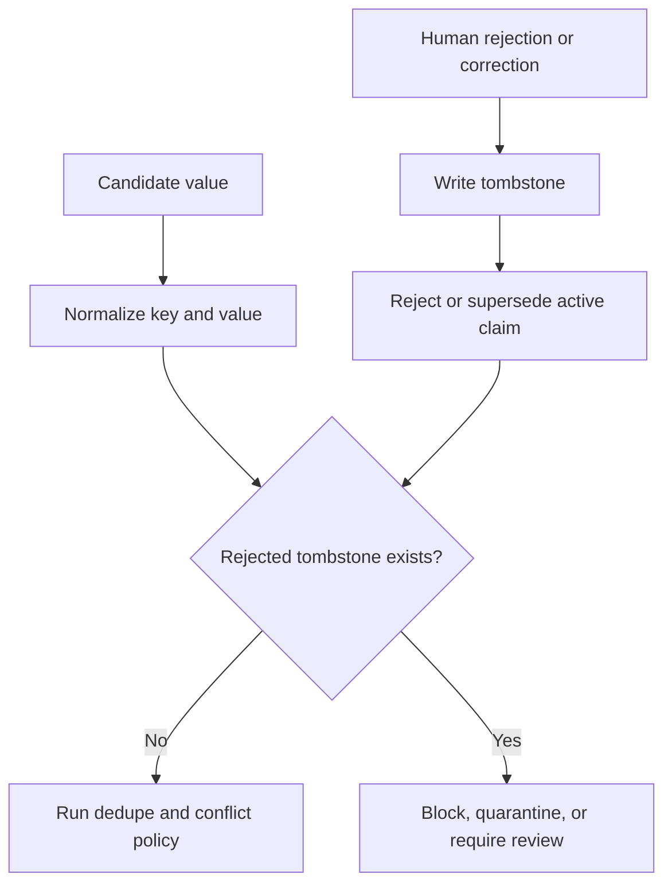

> **This is not an established best practice.** Twenty-six systems of three hundred and forty-eight
> carry it, and almost no two arrived the same way: one invented it under
> adversarial pressure, one adopted it from the first, one arrived at a weaker
> form independently, one was driven to it by a regulation, several built it only
> after their report named its absence — one of them adding it in the same
> release that closed a scope hole the same report found — **one has it as a
> side effect of a
> lookup that forgot to exclude the rejected row**, one made that same collision
> deliberate, one began as that side effect and was rebuilt as an explicit
> refusal, one built it as ordinary plumbing in its write gate, and one
> hardened it against key rotation.
> Sorted by mechanism rather than by mark, sixteen refuse the write
> — [the table below](#sorted-by-what-actually-stops-the-value) says
> which, and what the rest do instead.
> There is no consensus
> behind this page and no library that provides the mechanism. There is now a
> **vocabulary**: [arXiv:2605.26252](https://arxiv.org/abs/2605.26252) states it
> as a correctness condition — *no superseded value becomes current* — and proves
> that append-only storage cannot satisfy it, which is this page's argument in
> one line and from the database side. One vision paper with a prototype is not
> adoption. Everything below is still an argument, and the provenance is
> traced under *Seen in the atlas* so you can weigh it as one.

## Intent

Remember not only what the system currently believes, but also which values were deliberately rejected. Use that negative knowledge during future writes.

### The name collides with two others, and the difference is the whole pattern

A reader arriving from distributed systems or from ordinary CRUD will recognise
the word and read the wrong thing, so it is worth separating three mechanisms
that share it:

| | Keyed on | Lifetime | Purpose |
| --- | --- | --- | --- |
| **Cassandra-style tombstone** | a row or cell | until compaction garbage-collects it | propagate a delete across replicas |
| **Soft delete** | a row, via `deleted_at` | usually forever, but invisible to queries | hide a row while keeping it recoverable |
| **Rejected-value tombstone** | the **value**, normalised | outlives the row it came from | refuse the value when something tries to write it *again* |

The first two are keyed on a **record** and exist to make a deletion take effect.
This one is keyed on the **content** and exists to make a deletion *stay* in
effect against a writer that has never seen the old row — a re-extraction from a
retained transcript, a sync from an unchanged upstream file, a model rediscovering
the claim in a later conversation. Deleting the row does not help there, because
the new write creates a different row saying the same wrong thing.

If a better name exists, this atlas has not found it, and the term is used here
with that collision acknowledged rather than hidden. What matters is the key, not
the word.

**A third collision is inside the corpus rather than outside it.**
[PLUR1BUS](../../systems/plur1bus/) ships `tombstoned` as one of seven record
statuses, reachable by an authorized human command, and a record in that state
scores `-Infinity` and never reaches recall. That is a well-built soft delete
under this pattern's name: it is keyed on the record, so re-capturing the same
sentence produces a new card in `candidate` that nothing checks against what was
tombstoned. The system that uses the word is not thereby the system that has the
mechanism, which is the reason this table exists.

## The problem

Deleting or superseding a wrong memory removes it from normal recall, but it does not stop the same value from returning. A later conversation, stale document, model extraction, or synchronization pass can rediscover the old claim and create it as if it were new.

This is memory laundering: history that the system already judged wrong re-enters through a different write path.

## The pattern

Store a durable tombstone keyed by the semantic identity of the rejected value:

```text
scope + subject + predicate + normalized value
```

The tombstone records why, when, and by whom the value was rejected, plus the claim or evidence that triggered the decision. Normal retrieval suppresses it. Every automated write checks it before activation.



## Why it works

A tombstone changes correction from a point-in-time mutation into a durable constraint. It prevents repeat failures across extraction runs and preserves enough history to explain why a write was refused.

It is stronger than a soft-delete flag on the old claim because the check is value-oriented. The new proposal may have a different record ID or arrive from a different source.

## Tradeoffs

- Normalization mistakes can block a legitimately different value.
- Truth can change; some tombstones need expiry or explicit reactivation.
- Scope matters. A rejection in one project or user context may not apply globally.
- The tombstone itself can contain sensitive data and must follow deletion policy.
- Model writes should normally be blocked, while a trusted human correction may be allowed to override with an auditable action.

Do not use tombstones as the sole conflict model. A new competing value may deserve a candidate state rather than immediate rejection.

## Cost to adopt

**Build:** a normalized form for values so "Berlin" and "berlin" hash the same;
a tombstone table keyed on (subject, predicate, normalized value, scope); a check
on the write path of every ingestion route, including background ones.

**Forces elsewhere:** every extractor and background job must consult the check,
so a system with several write paths pays this per path. Normalization is where
the real work is — too strict and the tombstone never fires, too loose and it
blocks legitimate updates.

**Ongoing:** tombstones accumulate and need their own retention policy, and a
user who changes their mind needs a way to lift one.

**Skip it if** nothing re-derives memory automatically. A store written only by
explicit user action cannot resurrect a value on its own, and supersession is
enough.

## Seen in the atlas

**Twenty-six systems of 348 in the atlas have this.** That is still the most
striking negative result in the atlas, and it is the reason this page exists.

[Verel](../../systems/verel/) uses rejected memory records as a correctness
mechanism and protects rejected states from ordinary pruning.
[RainBox](../../systems/rainbox/) stores `MemoryRejectedValue` rows when claims
are rejected or superseded, and model writes check them before asserting.
[Daimon](../../systems/daimon/) is the third and the weakest, and it is
instructive precisely because of *how* it is weaker.
[Provem](../../systems/provem/) is the fourth and the first to arrive at it from
regulation rather than from a failure, discussed below.
[memsem](../../systems/memsem/) is the fifth, refuses the write like the first
two rather than filtering the read like the middle two, and puts the mechanism
behind a human decision — discussed below.
[Perseus Vault](../../systems/perseus-vault/) is the sixth and the only one that
refuses a value without storing it — discussed below.
[Universal Memory Engine](../../systems/universal-memory-engine/) is the ninth
and the plainest — a suppression table the write gate consults at four points,
discussed below.
[Noosphere](../../systems/noosphere/) is the most rigorous — its tombstone is
keyed on an HMAC subject hash and checked across every retained key version, so
rotating the key cannot resurrect a revocation, at the price of a ninety-one-day
expiry discussed below.
[Wenlan](../../systems/wenlan/) puts one on the *suggestion* layer rather than
the fact layer: a dismissed mind-map node keeps its row so its fingerprint stays
occupied, and every insert is `ON CONFLICT … DO NOTHING`.
[breadcrumbs](../../systems/breadcrumbs/) is the smallest — a JSON file of
rejected values that the fact setter raises on — and it is the only one in a
repository that also argues, correctly, against applying the same mechanism to
its other store. Its commit describes the mechanism as closing *"the two
remaining code-shaped gaps from the Agent Memory Atlas round-2 evaluation"*.
Discussed at length below.

**Where it came from: an adversary, not a designer.** Verel's git history dates
the mechanism to 28 June 2026, inside a numbered red-team sequence, and the
commit that introduces it describes the attack it closes:

> "rejection wasn't durable across supersede-then-restate: reject *paris* →
> supersede with *london* (rebuilds CANDIDATE, erasing the verdict) → restate
> *paris* + attest → VERIFIED. `write()` now carries a durable `rejected_values`
> set forward across supersessions, and the gate refuses to promote any value
> that was ever rejected for that key."

Nobody set out to build negative memory. A red team walked a rejected value back
to verified in three steps, and the tombstone is what the fix turned into.

The next three rounds are the more useful part, because each one defeated the
previous fix — and they map onto the tradeoffs listed above:

| Round | What got past the tombstone | The fix |
| --- | --- | --- |
| 8 | TTL pruning deleted the tombstone, "reopened the supersede-then-restate launder after ~90 idle days" | `REJECTED` made prune-exempt, like `VERIFIED` |
| 9 | NFKC divergence — the gate compared `fact.text.strip().lower()`, so unicode look-alikes slipped through | NFKC-canonical rejection |
| 12 | key collisions and an unbounded ledger | injective `make_key`, bounded rejection ledger |

One detail about how it reached this atlas is worth keeping, because it is the
clearest argument for reading code rather than documentation. When the survey
that became this atlas read Verel, the mechanism was about half a day old and
**the README did not mention it once** — that file advertised "trust +
provenance, consolidation, and a held-out, attested promotion gate". The survey
found the tombstone in the source, along with `make_key()`, and
`canonical_text()` "shared by recall rendering and rejection comparison" — the
normalization seam round 9 had hardened hours earlier. A README-based survey
would have missed the atlas's most-quoted finding entirely.

Round 9 is empirical confirmation of the first tradeoff on this page.
Normalization really is where the work is, and it was found by attacking the
mechanism rather than by reasoning about it.

[Memori](../../systems/memori/) is the same seam reached from the opposite
direction, and it is worth reading as a warning about the *positive* case.
It builds a careful content-addressable key — implemented twice, in Rust and
Python, with a comment requiring the two to agree, and unit-tested for case and
punctuation insensitivity — and uses it to deduplicate facts rather than to
reject them. The normalization keeps ASCII alphanumerics only, so any fact
written in a non-Latin script reduces to the empty string and every such fact
hashes identically. Nobody attacked it; the tests simply never passed it a
non-ASCII string. Whatever a content key is *for* — deduplication here, refusal
in Verel — normalization is the part that decides whether it works, and it is the
part that looks finished long before it is. Round 8 is the same for the fourth:
a tombstone that expires is not a tombstone.

**The two systems are not independent inventions, and the count should be read
accordingly.** RainBox's git history dates its tombstone to 29 June 2026, the
same day as the comparative survey that later became this atlas — a survey whose
RainBox report stated plainly that "it does not implement Verel-style
rejected-value tombstones", and whose recommendations listed "keep rejected
tombstones". So the field has produced this mechanism **once**, in Verel, and
copied it once — into the system belonging to the person who ran the survey.

That makes the negative result stronger rather than weaker. Two of three hundred and forty-eight
would suggest a hard idea that a few teams reach independently. One of three hundred and forty-eight, plus one adoption by a reader who went looking, suggests an idea
that is *not* being reached at all — and that the way it spread was somebody
reading another project's source.

**The third is an independent arrival, and it stops short in the two places this
page predicts.** [Daimon](../../systems/daimon/)'s `daimon forget` deletes the
item from the live checkpoint and appends a `forgotten:<content-hash>` event to
an append-only log. Because item ids are `sha1("<field>:<text>")`, that event is
keyed on the *value*, not on a row: an identical re-extraction in a later
session lands on the same id, is withheld from the briefing, is not carried
forward, and is deleted from the search index across every historical checkpoint
on the next rebuild. There is no evidence the author had read Verel or RainBox;
the mechanism falls out of content-addressed ids rather than from a red-team
finding.

Two differences matter, and both are on the tradeoff list above.

*It is mostly suppression at read, not refusal at write.* Verel and RainBox
refuse the write; Daimon lets the extractor re-assert the value into a new
checkpoint on disk and stops it reaching the agent. The observable behaviour is
the same and the failure surface is not: every future read path has to remember
to consult the fold, and the store itself holds content a user asked to forget.
**One write path is an exception** — the supersede-candidate emitter skips values
already in the ledger, which is a consultation the systems in the read-only class
do not have.

**Daimon's key is canonical, not literal.** `normalize.canonical_text` folds NFKC,
strips invisible characters, collapses whitespace, casefolds and **translates
confusables**, and `content_key` truncates a digest under a docstring naming the
direction it fails in: *"a prefix collision over-blocks, the fail-safe direction
for a deletion guarantee"*. That is the round-9 lesson implemented, not missed.
What still separates Daimon from Verel and RainBox is the write path, above —
not the key.

Recorded rather than silently edited, because the failure is instructive: a
pattern page argues from reports, the reports get re-read, and nothing connects
the two. This one was caught by
[re-deriving the strong-form subset](https://github.com/neoneye/agent-memory-atlas/blob/main/notes/2026-08-07-the-strong-form-tombstone-subset.md),
which is a thing nobody does on a schedule.

*And the same system runs a second negative store beside it, which is the
sharpest illustration on this page of what the tombstone property actually
buys.* Daimon's `refutations.jsonl` records an approach that **lost** — subject,
verdict, scope, cited evidence — keyed on `sha1(subject, scope)`, folded through
candidate, active and overturned, and activated only through a write channel the
process observed to be human. By every measure of care it is the more elaborate
of the two: adversarial tests, an authority model that cannot be spoofed by a
flag, a revision rule that demotes its own record. And it is **not** a tombstone
by this page's definition, because nothing consults it on any path a value
travels: `refute guard` is a command an agent chooses to run, and the skill text
shipped to hosts says a hit is *"advisory, not a command veto"*. The `forget`
ledger, which is far simpler, is the one wired into the fold that every read
crosses. Elaboration is not the property. Being on the path is.

Everything else stops at supersession, archival, or deletion — mechanisms that
remove a value from view without recording that it was *judged wrong*:

**The fourth arrival came from a regulation, and it has the most forgiving key.**
[Provem](../../systems/provem/)'s `forget(term, scope)` deletes the matching
records, appends the term's **token set** to a per-tenant `erased_terms`
registry, and writes an erasure certificate into the audit log. Every later
recall computes the record's tokens and excludes it with reason `"erased"` if any
registered set is a subset.

Two things separate it from the three above. Its key is a *normalized token
subset* rather than an exact string or a canonicalised value, so a later record
that restates the erased term inside different surrounding text is still caught —
the round-9 lesson on this page, that normalization is where the work is, taken
further than Daimon's exact-text hash takes it, at the cost of a false-positive
surface nobody has measured. And it is **tenant-scoped**, so an erasure for one
customer cannot silently censor another — the only instance here that treats the
scope of a rejection as part of its identity.

It shares Daimon's limitation exactly: suppression at read, not refusal at write.
A re-ingested erased value still lands in the backing store and is stopped on the
way out. For a system whose stated purpose is GDPR Article 17 that is the sharper
version of the same criticism — the regulation is about what you hold, and this
mechanism governs what you serve.

**The fifth is the only one here whose tombstone a person has to arm.**
[memsem](../../systems/memsem/) parks an uncertain fact in a `memory_candidates`
table that no read path joins; rejecting it writes a row into
`memory_suppressions` keyed on the normalised subject, predicate, object and
project, and `blockedBySuppression()` is the first effective statement in
`add()`. A suppressed value is refused outright — no row written, no rival faded —
and `memory_add_many`, the tool the extraction sub-agent is instructed to call,
inherits the same check. Lifting it takes an explicit `memory_unsuppress`, which
is audited. The key is `trim().toLowerCase()`, which is the case-and-space class
rather than Verel's NFKC canonicalisation, and `expires_at` exists in the schema
with nothing writing it, so round 8's lesson — a tombstone that expires is not a
tombstone — is passed by omission rather than by decision.

**What it shows is that the check and the trigger are separable, and that
building the check is the easier half.** memsem's other correction path is
supersession by attenuation: a contradicting write multiplies its rival's
confidence by 0.6 and archives it below 0.25. That path writes no suppression.
Archiving a value because it lost an argument and rejecting a candidate because a
person said no are two judgements about the same sentence, and only the second is
recorded as a rejection — so the write path a background extractor uses reaches
the store through the door with no lock on it. Measured against the project's own
milk/lactose example: an ordinary correction is archived at the third
re-assertion of the value it corrected, and a pinned correction, whose confidence
`fade()` never touches, stops being the top search result at the sixth.

That is this page's argument in one system. A discount on re-entry is paid off by
repetition; a check that refuses is not. memsem carries both mechanisms in the
same file, which makes the comparison unusually clean — and leaves the open
question of whether an automatic judgement should be allowed to write a tombstone
at all, or whether a rejection is by definition something a person does.
**The sixth stores the digest and not the value, which answers a tradeoff on this
page rather than inheriting it.** [Perseus Vault](../../systems/perseus-vault/)'s
`rejected_value_tombstones` is keyed on `(workspace_hash, subject, predicate,
value_sha256)` and carries a reason, an evidence reference, an author id and an
optional expiry. The value is never written — only its SHA-256, over a form that
is JSON-canonicalised when it parses, whitespace-collapsed and lower-cased, so a
re-indented body, a re-ordered object and a case variant all land on the same
tombstone.

That directly addresses the *Tradeoffs* entry above — *"the tombstone itself can
contain sensitive data and must follow deletion policy"* — which is a real problem
for every other holder: a rejection record for a leaked secret is a copy of the
secret. A digest refuses the value without retaining it, and the project states
the property in those terms.

**And it closes the hole a digest leaves, which is the one this page has not had
an answer for.** A digest refuses the value it was written for. A consolidation
pass that summarises the rejected source writes a body with a different digest
and the check never fires — so the strongest tombstone in the corpus was
defeatable by the system's own maintenance loop. The fix shares one suppression
check between ordinary reads and maintenance scans, on the ground stated in the
code: *"a derived body is not safe merely because its own digest differs from a
rejected source body's digest."* Derived bodies carry source references in three
JSON fields, described as *"intentionally hash-free provenance references, not a
new authority mechanism"* — so suppression propagates without the tombstone ever
holding the rejected value. The walk is recursive with a cycle set and a depth
cap of eight, and it fails closed at both edges: hitting the cap suppresses, and
so does a source whose encrypted bytes cannot be authenticated, because *"serving
a derived record whose evidence cannot be checked would recreate the same
bypass."*

**This is a further property the strong form needs**, and unlike the others it
is not optional for any system that derives. If summaries, consolidations or
promotions write back into the same store, a value-keyed tombstone protects the
original and nothing downstream of it. The limit is honest and worth stating with
the mechanism: propagation reaches exactly as far as the provenance is declared,
so a derived writer that omits its source ids escapes.

Three further details. It **refuses at the write path** rather than filtering at
read, like Verel and RainBox and unlike Daimon and Provem, enforced in
`remember_impl` with a comment claiming the reach — agent remember, capture,
ingest, connectors, derived writers. Its **override is an audited act**, not a
bypass: a deliberate write passes `allow_rejected=true` and is journaled into the
same hash-chained ledger, which is the shape the tradeoff list above asks for when
a trusted human correction has to win. And the lookup matches on **predicate and
digest without the subject**, so a rejected value is refused under any key in
scope — deliberate, named in a test, and the most aggressive reading of the
normalization tradeoff any holder here takes, with a correspondingly larger
false-positive surface.

The open edge is reach rather than existence: the comment names connectors and
derived writers, and no committed test walks the background consolidation passes,
which is the condition under which record-keyed removal stops holding and the one
this page cares most about.

**The seventh nobody appears to have built.** [Mnemosyne](../../systems/mnemosyne/)
gives every extracted fact a primary key of `compute_fact_id` — a SHA-256 over
the NFC-normalized, length-prefixed subject, predicate and object. A fact that
loses a conflict gets `superseded_by` set, and every read filters
`superseded_by IS NULL`. The part that makes it a tombstone rather than a
supersession is one clause that is *not* there: the lookup at the top of
`consolidate_fact` matches on subject, predicate and object without excluding
superseded rows, so a later extraction of the same value finds the dead row and
updates it — raising its `mention_count` and its confidence, and leaving
`superseded_by` exactly where it was. Nothing in the tree ever clears that
column. The rejection outlives every re-assertion, at the write path, keyed on
the value.

It is the same route Daimon took — a content-addressed id makes the key the
value — reached with none of the intent. No comment claims the behaviour, no
test pins it, and the docstrings around `consolidate_fact` are entirely about
concurrency. Add the obvious-looking `AND superseded_by IS NULL` to that lookup
during a tidy-up and the guarantee is gone, silently, in the direction this page
says failure always looks like success. Which is the argument for the test
bullet below rather than against the mechanism: **a tombstone you got for free
is one you can lose for free.**

Two limits on the reach. The property covers the extracted-fact layer, not the
memory rows — there, `_find_duplicate` matches exact content within a session
and the dedup update preserves an existing `valid_until`, so re-asserting a
memory you invalidated does not revive it, but the same text written from a
different session is a new row with no expiry. And the confidence on the
tombstoned row keeps climbing with each re-mention, so anything that ever did
clear the flag would resurrect the value stronger than it was rejected.

**The eighth is the seventh's mechanism in a different language, and it is the
better instance.** [Nova AI](../../systems/nova-ai/) is a symbolic concept graph
with no model anywhere in it. `weerleg` — refute — sets `status = "rejected"` on
a sense, with the reason and timestamp in that record's own audit log; the
reasoning query and the disambiguation candidate list both filter it out, while
`get_senses()` deliberately keeps showing it, so a person inspecting the graph
sees exactly what the reasoner refuses to use. That split — invisible to
inference, visible to audit — is the cleanest expression of this pattern's intent
in the corpus.

**And it is the one case in the corpus where the accident became a design, which
is the strongest evidence this page has for its own advice.** Until August 2026
Nova held the property the way [Mnemosyne](../../systems/mnemosyne/) still does:
the deduplication loop in `add_sense` matched an incoming definition by
definition text and did not exclude rejected rows, and the status branch below it
promoted only when `source == "user"`. Automatic re-derivation landed on the
refusal and left it standing — but a person re-teaching the same sentence set
`confirmed` and lifted it with nothing recorded and nothing asked.

`core/semantic.py:204` now tests the rejected status *first* and returns
`{"blocked": "rejected", …}` without touching the stored sense. The signal is
carried up to the layer holding the chat bus, where an automatic source is
reported and never applied, and a person's re-assertion becomes a spoken
*"I had already rejected this — do you really want to confirm it again?"* whose
`ja` writes a `sense_reactivated` audit entry. Six cases in
`tests/test_tombstone.py` hold each link, and the one covering re-assertion says
in its own name that it replaced a test pinning the previous behaviour.

That is the whole argument of this page, run once by somebody who had the shape
already: **the property falls out of writing dedup against content and rejection
against the same record, and it is destroyed by the tidy-up that adds
`AND status != 'rejected'` to the lookup.** Nova's author reached the opposite
tidy-up. Mnemosyne still claims the behaviour nowhere and pins it with no test.
If you have this shape, write the test before someone helpfully filters it.

**The ninth is the write gate itself, and it is the plainest instance on this
page.** [Universal Memory Engine](../../systems/universal-memory-engine/)
extracts candidates and resolves them through a gate before anything becomes a
node. Rejecting a candidate with `suppress_similar` calls `addSuppression` with
its `canonical_key`; `memory_suppressions` is a real table indexed on
`(user_id, kind, canonical_key)` with an optional `suppressed_until`; and the
gate consults it at **four** points, a hit producing
`reject(obj, "suppressed_blocked")`. Nothing about it is subtle or accidental,
which is the interesting part — it is what this page asks for, built as
ordinary plumbing by a project that does not appear to have read the argument.

The cleanup pass writes suppressions too, so a deletion binds the future rather
than waiting to be re-derived — the answer to the failure the
[MemoryOps AI](../../systems/memoryops-ai/) entry below describes, in the same
paragraph of the same kind of system.

### Sorted by what actually stops the value

Counting holders of the mark conflates four different mechanisms. Sorted by the
one question that separates them — *does anything read the rejection before the
write completes?* — and re-derived report by report in
[this note](https://github.com/neoneye/agent-memory-atlas/blob/main/notes/2026-08-07-the-strong-form-tombstone-subset.md):

| Kind | Systems | What happens on re-assertion |
| --- | --- | --- |
| **Consulted** — the form this page argues for | [memsem](../../systems/memsem/), [Perseus Vault](../../systems/perseus-vault/), [Universal Memory Engine](../../systems/universal-memory-engine/), [RainBox](../../systems/rainbox/), [Verel](../../systems/verel/), [Noosphere](../../systems/noosphere/), [breadcrumbs](../../systems/breadcrumbs/), [Memory Compiler](../../systems/memory-compiler/), [Agent Memory Doctrine](../../systems/agent-memory-doctrine/), [Hippo Memory](../../systems/hippo-memory/), [Memmy](../../systems/memmy-agent/), [plur1bus](../../systems/plur1bus/), [Sonder Runtime](../../systems/sonder-runtime/), [Open Second Brain](../../systems/open-second-brain/), [Nova AI](../../systems/nova-ai/), [remem-mcp](../../systems/remem-mcp/) | The write is refused. No row, or no activation |
| **Collided** — the key stays occupied | [Mnemosyne](../../systems/mnemosyne/), [Wenlan](../../systems/wenlan/) | The write lands *on* the rejected row, which stays rejected. Accidental in Mnemosyne, held in place by a missing filter and pinned by no test; deliberate in Wenlan, where the unique key is the value and the no-op is a named outcome the caller handles |
| **Suppressed** — the read path hides it | [Provem](../../systems/provem/) | A copy enters the store and is stopped on the way out |
| **Hybrid** | [Daimon](../../systems/daimon/) | All three at once: collided by content-addressed id, suppressed on every read, consulted by one emitter |

**Sixteen of the twenty, then, implement the strong form** — value-keyed,
normalized, consulted before the write, refusing activation. The collided form
is the rarer one, and Nova AI shows why the distinction is worth drawing:
its refusal held by a missing filter, which its author then replaced with an
explicit check, a `blocked` return value and six tests. A property nothing
claims is one a tidy-up can delete. The mark is still broader than this page's
argument, and a reader deciding what to build should use the table rather than
the count.

**[Memory Compiler](../../systems/memory-compiler/) is the cheapest complete
instance, and the one that shows where the cost actually lands.** Its store is
four Markdown files; the tombstone is a table with a `Rejected value` column; the
consultation is `tombstone_collision_check()`, thirty lines that scan the other
canonical files for that value verbatim and emit a blocking finding. The session
cannot be sealed while a hit stands. No database, no normalization pipeline, no
embedding — the *Cost to adopt* section above is answered here with a substring
search and a chokepoint, which is worth knowing before anyone concludes the
pattern needs infrastructure.

What it also demonstrates is that the hard half is the comparison, exactly as
this page argues. The scan skips any rejected value shorter than twelve
characters, commented *"ignore short/generic strings, too noisy"* — and both
tombstones in the project's own worked example are ten characters: a superseded
go-live date and a superseded hex colour. The automatic check cannot see either.
Two hand-written `must_not_return` cases in its test file cover them instead, so
the example is correct and the mechanism that makes it correct is the one an
adopter has to remember to write. A length threshold is the simplest possible
answer to "when is a match meaningful", and it fails on precisely the values —
dates, prices, versions, identifiers — that get corrected most often. Scope the
comparison to a field or a whole cell instead of to a length.

**[MemoryOps AI](../../systems/memoryops-ai/) is the closest any system here comes
without arriving**, and it is the best argument on this page that the expensive
half of the pattern is not the hard half. Its records carry
`normalized_content`, computed on write, persisted on every row, and already
compared — the normalization this page's *Cost to adopt* section calls "where the
real work is" is simply done. Deletion is a soft delete setting `deleted_at`,
followed by a compaction pass.

Then the lookup that would catch a returning value reads:

```python
MemoryRecordORM.status == _ACTIVE,
MemoryRecordORM.normalized_content == _norm(content),
```

A value that was deleted and is later re-asserted matches nothing, and lands as a
new active memory with an audit entry that looks like a legitimate creation —
because on its own terms it is one. **The gap is one predicate wide**: the same
comparison run without the `active` filter, or a rejection table keyed on
`(tenant_id, user_id, normalized_content)` consulted before activation.

**Its own benchmark measures the half of deletion that works, which is the
distinction this page exists to draw.** `benchmark/COMPARISON.md` runs two
deletion-leakage probes — a deleted memory must not resurface on an exact probe,
nor on a paraphrased one — and MemoryOps passes both, as do a plain vector
baseline, Mem0, and its own governance-disabled ablation twin. Every one of those
cases is a *read* after a delete. None of them writes the deleted value again,
which is the event this pattern is about, and a reader taking the four green
scores as "deletion is settled" would be reading a result that was never
measured. The document is careful about this in general terms — it says the
probes leave "deletion lineage" unexercised — and the specific case that would
exercise it is: delete, re-assert the same value through the ordinary write path,
and assert that what comes back is a refusal rather than a new active record.

**[AIMAOS](../../systems/aimaos/) is the other near-miss, and it stores the value
it rejected.** When its duplicate detector decides a new statement contradicts an
existing belief rather than restating it, the row adopts the newer wording and
keeps the old one in `previous_content` — the rejected value, retained, keyed to
the belief it was replaced in. Nothing reads that field. Re-assert the old value
and the same contradiction logic fires in reverse: it supersedes back, the
evidence trail resets again, and the store oscillates between two values with no
record that either was ever judged wrong. **The field this pattern asks for
exists; the lookup does not** — which is the same one-predicate gap as
[MemoryOps AI](../../systems/memoryops-ai/) above, reached from the opposite
direction, by a system that kept the value rather than one that normalised it.

Worth holding beside the rest of that system, because it makes the page's central
claim concrete. This is a project that enforces tenancy through Postgres
row-level security, chains its audit per tenant so it cannot fork, holds
sensitive writes for human approval, and commits eval cases that plant a
cross-tenant memory before asserting it is unreachable. It is *more* careful than
most of the corpus about what may enter. **Admission and rejection are different
problems, and building the first extremely well does not build the second.**

- [Gini](../../systems/gini-agent/) has a `rejected` **status** on a unit, which
  is closer than most, but nothing keyed on the value: an equivalent claim can be
  retained again under a new id.
- [OpenSRE](../../systems/opensre/) is where the re-extraction this page warns
  about runs on a **timer**. Its automatic extractor reads the last thirty turns
  after every recorded turn; `forget` unlinks the file and records nothing. So a
  user who asks the agent to forget a fact they stated earlier in the same
  session has removed the row while leaving the sentence that produced it inside
  the window the next pass reads — and the grounding gate that admitted it will
  admit it again, for the same reason. The prompt's only defence is an
  instruction not to extract what an existing memory already covers, which is
  exactly false for a memory that was just deleted. Everything else in that write
  path is gated carefully, which is what makes the omission legible.
- [SESA](../../systems/sesa/) is the case with the strongest *evidence* for a
  tombstone and none of the machinery. A skill card is deleted only after it has
  been retrieved at least three times and its measured net usefulness has gone
  negative — a rejection backed by more observation than any judgement on this
  page — and then the row is dropped, the duplicate check compares only against
  the live bank, and the next similar failure regenerates the card at score zero.
  The system pays three rollouts to learn the value is harmful and forgets that
  it learned it.
- [Atomic Agent](../../systems/atomic-agent/) deprecates lessons and retains the
  row — good for history, silent on re-distillation from the same cluster.
- [Mercury](../../systems/mercury-agent/) has a `dismissed` boolean on the record.
- [Magic Context](../../systems/magic-context/), [MetaClaw](../../systems/metaclaw/),
  [Redis Agent Memory Server](../../systems/redis-agent-memory-server/),
  [nanobot](../../systems/nanobot/), [CowAgent](../../systems/cowagent/),
  [Holographic](../../systems/holographic/), [OpenClaw](../../systems/openclaw/),
  [Hermes Agent](../../systems/hermes-agent/), and
  [LlamaIndex](../../systems/llamaindex/) have supersession, archival, or exact
  deletion and no value-level negative memory at all.

The absence matters most where it co-occurs with **automatic re-derivation**,
which is now the common case. CowAgent re-distils `MEMORY.md` nightly from
retained daily files. Atomic Agent re-clusters. Magic Context and Redis Agent
Memory Server both extract on a schedule from retained history. OpenClaw's
auto-capture can restore content a user deleted. In each, "forget that" is a
statement about the present that the next background pass is free to undo.

[llm-wiki-memory](../../systems/llm-wiki-memory/) states the limit plainly:
operational supersession can archive an old leaf but cannot prevent the same
rejected content from being distilled again.

[Memanto](../../systems/memanto/) shows that a *resolution* is not a tombstone
either. Its conflict workflow ends in a human choosing `remove_both`, which is a
deliberate, reasoned, human judgement that two memories are wrong — and it
deletes them. The next night's extraction pass runs over the same sessions with
nothing to consult, so the most carefully made correction in the atlas can be
undone by a scheduled job. The lesson generalizes: the quality of the *decision*
does not matter if the decision leaves no trace the write path can check.

[Memora](../../systems/memora/) comes closest to the shape without arriving at
it. Its supersession pass classifies memory pairs into a defined vocabulary —
including `contradicts` as an edge between two named memories — and hides rather
than deletes the superseded row, so the decision is reversible. But the edge is
between two *ids*, not keyed on the rejected *value*, and Memora ingests
documents and images: re-ingesting the same source produces a new row that
nothing blocks. Rich relation modelling is not a substitute for negative memory.

**One sighting outside the corpus, because of where it was found.**
`os-factory/har` is a harness for running coding agents in isolated worktrees —
no memory in it, no report, [recorded as an
exclusion](../../compare/#known-limitations) — and its
Mission Control dashboard carries an `UnregisteredRepository` table whose schema
comment reads *"Paths removed via unregister — blocks auto-sync re-registration
until force register."* The delete path writes the path into it before dropping
the row; the register path consults it on every write and refuses with a 409
unless the caller passes `force: true`, which deletes the tombstone as the same
act that overrides it. That is the consulted form, with the audited-override
shape this page's tradeoff list asks for. It goes one step further than any
holder above: the client handles the 409 by dropping the path from its *own*
local registry, so the sync loop stops re-asserting instead of failing at the
gate forever — a tombstone that quiets the writer rather than only refusing it.

Two things to take from that and one not to. The failure it closes is the one
named at the top of this page — a periodic pass re-reading an unchanged source
and restating what a person deleted — which is why a `deleted_at` on the row
would not have worked and somebody noticed. It is keyed on a filesystem path, so
it never meets the normalization problem that defeated Verel's round 9 and
Memori's key; this is the pattern on easy mode, and the easy mode is where it
gets built. And nothing tests it, in a tree with 87 test files, beside a
commit gate tested across nine cases — so even here, the negative half is the
half nobody covered. The mechanism is not hard. It is reached when a concrete
re-assertion loop makes the need undeniable, and memory systems have exactly
that loop and mostly have not noticed.

[Noosphere](../../systems/noosphere/) is the strongest implementation of the
form this page argues for, and it answers a question the others never had to.
Its key is an **HMAC** of the capture, not a plain digest — so rotating the
secret would make every stored key uncomputable from new input and silently
readmit every value the system had ever refused. The check therefore computes
the candidate's digest under **every retained key version** and matches the
tombstone against the whole set, with the reasoning in the comment: *"A
tombstone from any retained key version blocks recreation. Historical keys
remain in the bounded keyring until their tombstones and source TTLs have
expired."* The check runs inside a serializable transaction after the lineage
rows are locked, and the write is refused with a 409.

**If your value key is derived under a secret, this is a fifth property the
strong form needs**, and it is invisible when it fails: the tombstone table
stays full, the check keeps running, and nothing ever matches again.

It also introduces the first deliberate **expiry** in this atlas's tombstones.
Retaining the historical keys is what makes the check work, so the keyring is
bounded by the tombstone's ninety-one-day TTL. That is a defensible trade for a
privacy revocation whose source data expires anyway, and it means the guarantee
is *not again for ninety-one days* rather than *never again* — a distinction worth
making explicitly wherever this shape is copied.

### The tombstone that must not retain what it protects

Every implementation above keys the tombstone on the value, and stores the value
to do it. For a rejected fact that is fine. For an erased *person* it is a
contradiction: a record whose purpose is to prove someone was removed, holding
their name.

[Fireweed MCP](../../systems/fireweed-mcp/) keys on a digest instead.
`name_fingerprint` is a SHA-256 over the whitespace-normalized lowercased name,
written into the durable `ERASE` ledger event as `subject_name_hash`, and the
write gate hashes the names in an incoming claim to compare. The refusal still
works — an identical claim naming the erased subject is turned away with
`previously_erased` — and the store holds no copy of the name to do it. The cost
is the ordinary cost of a digest key: it matches exactly or not at all, so a
spelling variant walks straight past, which is the same limitation every
value-keyed tombstone on this page has and is merely more visible here.

**The second half is what makes it a tombstone rather than a ban, and it is the
part to copy.** `acknowledge_erasure=true` admits the claim anyway. The stated
reason is specific to the subject matter and worth quoting, because it is the
argument against the strongest form of this pattern in the one domain where the
strongest form is wrong:

> *"erasure is not a permanent ban on a person ever being mentioned again —
> someone may lawfully re-consent, or the same name may be a different person.
> The requirement is that re-admission be a DECISION SOMEONE MAKES, recorded as
> such, rather than something that happens quietly because nothing was looking."*

Two committed tests hold both sides: one asserts the identical claim is refused
after an erasure, the other asserts it is admitted with the acknowledgement. A
suite carrying only the first would pass on a store that had stopped accepting
writes at all — the same trap this atlas keeps finding in exclusion tests that
never assert anything is still returned.

### The refusal that reaches the inference

[RCK](../../systems/rck/) is the instance that closes the loop this page has
been leaving open. Its denial is an ordinary row — `deny(kb, s, r, o)` writes
`(X, NOT_R, Y)` into the same substrate as any assertion, so it survives, merges
and replays by machinery that already exists, with no second schema and nothing
to keep in sync. The module draws the distinction the design turns on before it
writes a line of code: a negative fact is *"positive certainty about
non-membership"*, which is *"structurally different from 'we don't know'"* and is
handled by a separate epistemic state.

**What is new is where the lookup runs.** Every tombstone above guards a write
path or filters a read. RCK does both and then checks the same denials on the two
paths that *manufacture* facts: `chain_induction.py` calls `denied_pairs_for`
before an induced fact is accepted, and `rule_instantiation.py` calls it at a
score floor before a rule fires. So the refusal is not defeated by the system's
own derivation — the answer you rejected cannot be re-derived from the facts you
kept.

That is the gap most of this page's instances have and none of them names. A
store with any inference step — a consolidation pass, a rule engine, a summariser
— can regenerate a rejected value from material that was never itself rejected,
and a tombstone consulted only at ingest will not see it. Perseus Vault reaches
the same problem from the other direction and solves it by *lineage*, suppressing
a derived record whose source was rejected; RCK solves it by *predicate*,
refusing the derivation before it produces the record. Lineage catches what was
already built; the predicate check stops it being built. A store that derives
wants one of the two.

The committed test is the shape this page asks for — `deny`, then assert the
denied object is absent while a legitimate one is present, with a separate
passthrough case establishing the filter returns candidates when nothing is
denied, so neither half can pass vacuously.

### The one that answered the question twice, differently, in two stores

[breadcrumbs](../../systems/breadcrumbs/) is the only project in the corpus that
reaches the value-keyed question, answers *no* for one store on grounds this
page has to take seriously, and *yes* for another. Both answers are in the same
repository and neither is a compromise.

Take the *no* first, because it is the argument. The conclusions ledger's
correction model is ordinary supersession: a newer JSONL line names the
older one through `obsoleted_by`, keyed on the record. What is not ordinary is
that it ships a committed test asserting a superseded entry must not win
retrieval — and a second one pinning why that test keys on the supersession
marker rather than on the value. From the fixture comment:

> "The revert case: a value flips A -> B -> A. Both earlier entries carry
> obsoleted_by; the final entry RESTATES the original value as a new current
> entry."

A value-keyed tombstone would suppress that final entry, which is legitimately
current. The reasoning is correct for the store it is defending: entries are
hand-authored, so a value only reappears because a person decided it was true
again, and that decision should win.

**The reasoning stops holding the moment anything re-derives entries, and the
same repository documents that case.** Its provenance doc describes a backfill
pass mining facts out of git history, and its schema doc records what happened
when one ran: the backfill *"swamped the session-verified entries and wrecked
lookup precision."* A re-mining pass that re-derives a fact somebody already
retired writes a fresh line with a new date and walks past every `obsoleted_by`
in the file — which is exactly the laundering path Verel's red team found, minus
the adversary.

**Its engine tier gives the *yes*, and it is a clean instance.**
`reject_fact(category, key, value, reason)` writes `.memory/tombstones.json`
keyed by `category/key` and then by the rejected value itself, deletes the fact
entry if that value is the one held, and logs a `REJECTED` episode.
`store_fact()` reads the tombstone file before it reads `facts.json` and raises
when the incoming value matches — *"a rejected value may not be silently
re-asserted"* — and `lift_tombstone()` is the deliberate way out, requiring its
own reason and logging its own event. An empty reason is refused on either call,
on the stated parallel that *"an unexplained rejection is as unauditable as an
unexplained verification"*. Five committed cases pin the behaviour, including
that a different value under the same key still stores.

Note what the two answers do *not* do: reconcile. The engine and the ledger are
separate stores with separate write paths, and nothing in the ledger tooling
consults `tombstones.json`. So the backfill hazard the project documents —
`PROVENANCE.md`'s mining pass, `CONCLUSIONS_TEMPLATE.md`'s record of one that
*"swamped the session-verified entries"* — sits on the side that answered no.

The general lesson survives the split intact, and it is sharper for having both
halves in one repository. The value-keyed form is unnecessary *while every write
is a human decision*, and that condition is a property of the write path rather
than of the store. Any system here that adds model-driven extraction to a
hand-curated ledger crosses that line without the schema changing, and nothing
signals the crossing. That is a better argument for the pattern than a
prevalence count, and it came from the project that stated the objection to it
best.

**And then there is the case that argues this page's thesis better than any
system carrying the mark, and does not carry it.**
[memoir](../../systems/memoir-cli/) publishes a format spec whose merge section
derives the mechanism from first principles, for the reason this page states in
its intent: under union-by-identity across replicas, *removal cannot be an
absence*, because any replica still holding the item re-unions it on the next
merge. So a removal must be a record — and the spec gets the hard half right,
which most implementations do not. **The record must be monotonic and
date-independent.** If either side of a merge carries `hidden: true`, the merged
copy carries it *regardless of which copy has the newer date*, because
tombstoning legitimately does not touch the item's date and the tombstoned copy
therefore usually *loses* the newest-wins comparison. *"Suppression must be
monotonic or it is not suppression."* The implementation matches: `unionByText`
resolves by date, then makes a second pass re-applying the tombstone from the
losing copy onto the winner, and partitions tombstones out of the visible cap so
a suppression cannot evict a live memory while enforcing itself.

It then splits the mechanism in two, which nothing else here does and which the
tradeoff list above implies. A suppressed decision gets an **absolute**
tombstone because the text is junk permanently; a completed action gets a
**temporal** one, suppressed only against copies whose `added` predates the
`done_at`, because *"'Fix the flaky test' can legitimately be finished and later
added again."* **"Implementations MUST NOT substitute one class for the other."**
That distinction is the answer to the objection that a value-keyed tombstone is
too blunt for anything that can recur.

The mark is withheld because **no shipped surface can create the absolute one.**
The only assignment of `hidden = true` outside the merge function is a dated
one-off script whose own header says it is not wired into any command, whose
match strings are placeholders, and which the package manifest excludes from
publication. Fourteen MCP tools write memory and none retracts it. Everything
downstream of the writer is built — three read paths filter it, the validator
enforces its timestamp by spec section number, a test asserts its exclusion at
three surfaces including a live protocol call — which makes this the most
complete instance of the pattern in the atlas *and* an unusable one. Read it as
the strongest available evidence that the idea is reachable by reasoning rather
than by a red team, and as a reminder that a mechanism is only as real as its
narrowest surface.

[Open Second Brain](../../systems/open-second-brain/) is the newest independent
arrival and the first with a **scope dimension**, which is this page's standing
objection answered in code. Its nightly consolidation pass promotes repeated
corrections into preferences; `o2b brain reject --reason <text>` retires one and
writes `user_rejected_reason` into the retired file — set *only* for a user
rejection and left undefined for the automatic retirements beside it. On the next
pass that retired rule becomes a **suppressor**: signals on its topic are
swallowed before candidate planning, with the reasoning in the source — *"the
user explicitly rejected the rule — re-growing it from fresh signals is exactly
what they were asking us not to do."*

Three details are worth taking. **The block is scoped rather than blanket**: an
unscoped suppressor swallows every signal on the topic, a scoped one only signals
sharing its scope, and a signal carrying no scope matches an unscoped suppressor
but never a scoped one — so a rejection in one project does not silence the same
topic everywhere, which is the tradeoff this page lists third. **Non-matching
signals fall through** and stay eligible for candidate planning, so the tombstone
narrows rather than closes the topic. And **every suppression emits an event**
naming the retired rule and the reason, so a refusal is visible to the user whose
rejection caused it — the answer to a tombstone that silently swallows input and
is indistinguishable from a bug.

What it does not have is a lift. `user_rejected_reason` arms the suppressor
permanently and nothing found removes it short of hand-editing the retired file,
which is the expiry problem this page's tradeoff list names and which most
implementations here also leave open.

## Tests to require

- **Run the laundering sequence**: reject a value, supersede the claim with a
  different value, then restate the original and corroborate it. Verel's round-7
  finding is that this walks a rejected value back to verified in three steps,
  and it is the concrete attack this pattern exists to stop.
- Age the store past every TTL and prune you have, then run the laundering
  sequence again. Verel's round 8 was exactly this, at ninety-one idle days.
- Attack the key normalization with unicode look-alikes and case and whitespace
  variants. Verel's round 9 was an NFKC bypass of `strip().lower()`.
- Reject a value, rerun extraction, and prove it stays inactive. Every system
  in the atlas that carries this mechanism should have this test; Daimon, which
  has 3,679 others, does not, and neither does Mnemosyne, with 51,407 lines of
  them. Both hold the property by accident. Nova AI is the counter-case and the
  cheapest one to copy: `tests/test_tombstone.py` is 246 lines, isolates a store
  in a temporary directory, and asserts that a re-asserted rejected definition
  changes no status and creates no second sense. A tombstone is the one mechanism
  whose silent failure looks exactly like success.
- Correct A to B, then try to reintroduce A through a different source.
- Verify scope isolation between users, projects, and agents.
- Verify trusted override and tombstone reactivation are audited.
- Exercise normalization variants without conflating materially different values.
- Propagate privacy deletion to tombstones when policy requires true erasure.

Run these as a matrix rather than a checklist — see [the contradiction test](../../benchmarks/#contradiction-test) for the case shapes and the four outcomes worth scoring separately.

## Related patterns

- [Trust-state machine](../trust-state-machine/)
- [Governed write gateway](../governed-write-gateway/)
- [Append-only memory audit](../append-only-memory-audit/)
