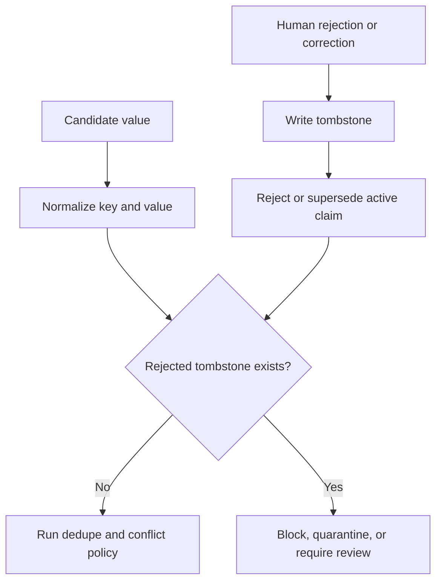

> **This is not an established best practice.** Two systems of fifty-eight carry
> it, one invented it under adversarial pressure, and the other adopted it from
> the first. There is no consensus behind this page, no library that provides
> the mechanism, and no shared vocabulary for it. Everything below is an
> argument, and the provenance is traced under *Seen in the atlas* so you can
> weigh it as one.

## Intent

Remember not only what the system currently believes, but also which values were deliberately rejected. Use that negative knowledge during future writes.

## The problem

Deleting or superseding a wrong memory removes it from normal recall, but it does not stop the same value from returning. A later conversation, stale document, model extraction, or synchronization pass can rediscover the old claim and create it as if it were new.

This is memory laundering: history that the system already judged wrong re-enters through a different write path.

## The pattern

Store a durable tombstone keyed by the semantic identity of the rejected value:

```text
scope + subject + predicate + normalized value
```

The tombstone records why, when, and by whom the value was rejected, plus the claim or evidence that triggered the decision. Normal retrieval suppresses it. Every automated write checks it before activation.



## Why it works

A tombstone changes correction from a point-in-time mutation into a durable constraint. It prevents repeat failures across extraction runs and preserves enough history to explain why a write was refused.

It is stronger than a soft-delete flag on the old claim because the check is value-oriented. The new proposal may have a different record ID or arrive from a different source.

## Tradeoffs

- Normalization mistakes can block a legitimately different value.
- Truth can change; some tombstones need expiry or explicit reactivation.
- Scope matters. A rejection in one project or user context may not apply globally.
- The tombstone itself can contain sensitive data and must follow deletion policy.
- Model writes should normally be blocked, while a trusted human correction may be allowed to override with an auditable action.

Do not use tombstones as the sole conflict model. A new competing value may deserve a candidate state rather than immediate rejection.

## Cost to adopt

**Build:** a normalized form for values so "Berlin" and "berlin" hash the same;
a tombstone table keyed on (subject, predicate, normalized value, scope); a check
on the write path of every ingestion route, including background ones.

**Forces elsewhere:** every extractor and background job must consult the check,
so a system with several write paths pays this per path. Normalization is where
the real work is — too strict and the tombstone never fires, too loose and it
blocks legitimate updates.

**Ongoing:** tombstones accumulate and need their own retention policy, and a
user who changes their mind needs a way to lift one.

**Skip it if** nothing re-derives memory automatically. A store written only by
explicit user action cannot resurrect a value on its own, and supersession is
enough.

## Seen in the atlas

**Two systems in the atlas have this.** That is the most striking
negative result in the atlas, and it is the reason this page exists.

[Verel](../../systems/verel/) uses rejected memory records as a correctness
mechanism and protects rejected states from ordinary pruning.
[RainBox](../../systems/rainbox/) stores `MemoryRejectedValue` rows when claims
are rejected or superseded, and model writes check them before asserting.

**Where it came from: an adversary, not a designer.** Verel's git history dates
the mechanism to 28 June 2026, inside a numbered red-team sequence, and the
commit that introduces it describes the attack it closes:

> "rejection wasn't durable across supersede-then-restate: reject *paris* →
> supersede with *london* (rebuilds CANDIDATE, erasing the verdict) → restate
> *paris* + attest → VERIFIED. `write()` now carries a durable `rejected_values`
> set forward across supersessions, and the gate refuses to promote any value
> that was ever rejected for that key."

Nobody set out to build negative memory. A red team walked a rejected value back
to verified in three steps, and the tombstone is what the fix turned into.

The next three rounds are the more useful part, because each one defeated the
previous fix — and they map onto the tradeoffs listed above:

| Round | What got past the tombstone | The fix |
| --- | --- | --- |
| 8 | TTL pruning deleted the tombstone, "reopened the supersede-then-restate launder after ~90 idle days" | `REJECTED` made prune-exempt, like `VERIFIED` |
| 9 | NFKC divergence — the gate compared `fact.text.strip().lower()`, so unicode look-alikes slipped through | NFKC-canonical rejection |
| 12 | key collisions and an unbounded ledger | injective `make_key`, bounded rejection ledger |

One detail about how it reached this atlas is worth keeping, because it is the
clearest argument for reading code rather than documentation. When the survey
that became this atlas read Verel, the mechanism was about half a day old and
**the README did not mention it once** — that file advertised "trust +
provenance, consolidation, and a held-out, attested promotion gate". The survey
found the tombstone in the source, along with `make_key()`, and
`canonical_text()` "shared by recall rendering and rejection comparison" — the
normalization seam round 9 had hardened hours earlier. A README-based survey
would have missed the atlas's most-quoted finding entirely.

Round 9 is empirical confirmation of the first tradeoff on this page.
Normalization really is where the work is, and it was found by attacking the
mechanism rather than by reasoning about it. Round 8 is the same for the fourth:
a tombstone that expires is not a tombstone.

**The two systems are not independent inventions, and the count should be read
accordingly.** RainBox's git history dates its tombstone to 29 June 2026, the
same day as the comparative survey that later became this atlas — a survey whose
RainBox report stated plainly that "it does not implement Verel-style
rejected-value tombstones", and whose recommendations listed "keep rejected
tombstones". So the field has produced this mechanism **once**, in Verel, and
copied it once — into the system belonging to the person who ran the survey.

That makes the negative result stronger rather than weaker. Two of fifty-eight
would suggest a hard idea that a few teams reach independently. One of
fifty-eight, plus one adoption by a reader who went looking, suggests an idea
that is *not* being reached at all — and that the way it spread was somebody
reading another project's source.

Everything else stops at supersession, archival, or deletion — mechanisms that
remove a value from view without recording that it was *judged wrong*:

- [Gini](../../systems/gini-agent/) has a `rejected` **status** on a unit, which
  is closer than most, but nothing keyed on the value: an equivalent claim can be
  retained again under a new id.
- [Atomic Agent](../../systems/atomic-agent/) deprecates lessons and retains the
  row — good for history, silent on re-distillation from the same cluster.
- [Mercury](../../systems/mercury-agent/) has a `dismissed` boolean on the record.
- [Magic Context](../../systems/magic-context/), [MetaClaw](../../systems/metaclaw/),
  [Redis Agent Memory Server](../../systems/redis-agent-memory-server/),
  [nanobot](../../systems/nanobot/), [CowAgent](../../systems/cowagent/),
  [Holographic](../../systems/holographic/), [OpenClaw](../../systems/openclaw/),
  [Hermes Agent](../../systems/hermes-agent/), and
  [LlamaIndex](../../systems/llamaindex/) have supersession, archival, or exact
  deletion and no value-level negative memory at all.

The absence matters most where it co-occurs with **automatic re-derivation**,
which is now the common case. CowAgent re-distils `MEMORY.md` nightly from
retained daily files. Atomic Agent re-clusters. Magic Context and Redis Agent
Memory Server both extract on a schedule from retained history. OpenClaw's
auto-capture can restore content a user deleted. In each, "forget that" is a
statement about the present that the next background pass is free to undo.

[llm-wiki-memory](../../systems/llm-wiki-memory/) states the limit plainly:
operational supersession can archive an old leaf but cannot prevent the same
rejected content from being distilled again.

[Memanto](../../systems/memanto/) shows that a *resolution* is not a tombstone
either. Its conflict workflow ends in a human choosing `remove_both`, which is a
deliberate, reasoned, human judgement that two memories are wrong — and it
deletes them. The next night's extraction pass runs over the same sessions with
nothing to consult, so the most carefully made correction in the atlas can be
undone by a scheduled job. The lesson generalizes: the quality of the *decision*
does not matter if the decision leaves no trace the write path can check.

[Memora](../../systems/memora/) comes closest to the shape without arriving at
it. Its supersession pass classifies memory pairs into a defined vocabulary —
including `contradicts` as an edge between two named memories — and hides rather
than deletes the superseded row, so the decision is reversible. But the edge is
between two *ids*, not keyed on the rejected *value*, and Memora ingests
documents and images: re-ingesting the same source produces a new row that
nothing blocks. Rich relation modelling is not a substitute for negative memory.

## Tests to require

- **Run the laundering sequence**: reject a value, supersede the claim with a
  different value, then restate the original and corroborate it. Verel's round-7
  finding is that this walks a rejected value back to verified in three steps,
  and it is the concrete attack this pattern exists to stop.
- Age the store past every TTL and prune you have, then run the laundering
  sequence again. Verel's round 8 was exactly this, at ninety idle days.
- Attack the key normalization with unicode look-alikes and case and whitespace
  variants. Verel's round 9 was an NFKC bypass of `strip().lower()`.
- Reject a value, rerun extraction, and prove it stays inactive.
- Correct A to B, then try to reintroduce A through a different source.
- Verify scope isolation between users, projects, and agents.
- Verify trusted override and tombstone reactivation are audited.
- Exercise normalization variants without conflating materially different values.
- Propagate privacy deletion to tombstones when policy requires true erasure.

Run these as a matrix rather than a checklist — see [the contradiction test](../../benchmarks/#contradiction-test) for the case shapes and the four outcomes worth scoring separately.

## Related patterns

- [Trust-state machine](../trust-state-machine/)
- [Governed write gateway](../governed-write-gateway/)
- [Append-only memory audit](../append-only-memory-audit/)
