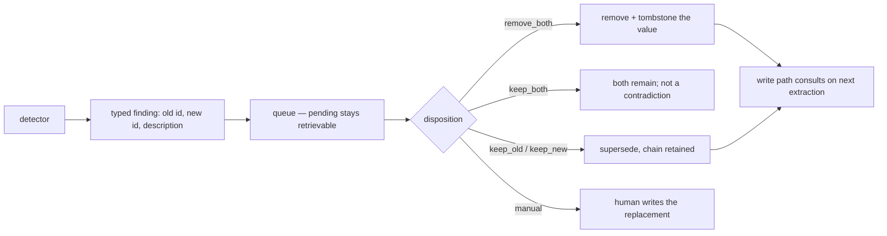

## Intent

Every contradiction a memory system finds must end in a **disposition**: a named
outcome, chosen by someone, recorded where the write path can see it. Detection
without a disposition adds a status field and a growing backlog.

## The problem

Contradiction detection is the easy half and the half everyone builds. Across the
systems reviewed here, the same shape recurs: a detector runs, a memory gets a
flag, and nothing in the codebase says what clears it.

The failure is not that the flag is wrong. It is that a flagged memory is still
*retrievable* and now also *ambiguous* — the system knows two things disagree and
still hands both to the model, which is strictly worse than not knowing, because
the cost of detection was paid and none of the benefit collected.

Three specific traps:

- **A binary resolver forces wrong answers.** "I work at Acme" and "I work at
  Globex" conflict only if you assume one employer. Systems that can only
  supersede or reject cannot say *both are true*, so someone eventually resolves
  a non-conflict incorrectly, or leaves it forever.
- **A blocking queue makes memory useless.** Quarantining every flagged memory
  until a human clears it means the store degrades whenever nobody is looking.
- **A resolution that deletes gets undone.** If the pipeline that produced the
  contradiction runs again — nightly extraction, re-ingestion, re-clustering —
  and the resolution left no trace it can consult, the next pass recreates what
  was just decided against.

## The pattern

```text
detect ──▶ typed finding ──▶ queue (non-blocking) ──▶ disposition ──▶ record
             contradiction        pending items          keep_old        so the
             update               stay retrievable       keep_new        write path
             duplicate                                   keep_both       can consult
             conflict                                    remove_both     it later
                                                         manual(content)
```

Five requirements:

1. **Type the finding.** "Contradiction", "update", "duplicate" and "semantic
   conflict" deserve different dispositions; collapsing them into one flag
   discards the information the detector just produced.
2. **Offer a non-binary disposition set**, including *both are valid* and *a
   human writes the replacement*.
3. **Keep pending findings retrievable.** The flag is a signal, not a gate. Only
   a disposition removes.
4. **Name the actor and the reason.** A resolution with neither is
   indistinguishable from a bug.
5. **Record it where the write path looks.** Otherwise the next extraction pass
   undoes it — see [rejected-value tombstone](../rejected-value-tombstone/).

Keep the detector's *recommendation* vocabulary narrower than the resolver's
*action* vocabulary, so the model's framing does not bound the operator's
options.



## Why it works

It converts a standing ambiguity into a decision with an owner. Retrieval stops
handing the model two conflicting memories and hoping; the store gains a record
of *why* it believes what it believes; and the detector's precision becomes
measurable, because kept-versus-dismissed is now data.

The `keep_both` option carries more weight than it looks. Most detected
"contradictions" are two true statements about different times, scopes, or
aspects, and a resolver that cannot express that will either corrupt the store or
stall.

## Tradeoffs

- **It needs a human, or a policy that stands in for one.** A queue with no
  drain rate is a slower version of the original problem.
- **The detector's false-negative rate stays invisible.** Nothing that never
  reaches the queue can be counted, and no system here measures this.
- **Dispositions can be wrong**, and unless the finding and its resolution are
  both retained, a bad resolution is unreviewable.
- **It is only as durable as its record.** A carefully reasoned `remove_both`
  that leaves no tombstone is undone by the next scheduled extraction.

## Cost to adopt

**Build:** a typed finding record, a queue with a non-blocking read semantic, a
disposition enum, and one surface — CLI or UI — where a person acts on it.

**Forces elsewhere:** retrieval must know what a pending finding means, and the
write path must consult resolutions or they decay. Bounding the detection scan
matters too: comparing everything against everything re-surfaces settled pairs
forever.

**Ongoing:** somebody has to drain the queue, and the detector needs its
precision watched or the queue fills with noise and stops being read.

**Skip it if** nothing automatically writes memory. A store only a human edits
resolves conflicts at the keyboard.

## Seen in the atlas

[Memanto](../../systems/memanto/) is the only complete instance. A scheduled
local LLM pass writes a dated JSON report typed as
`contradiction | update | duplicate | conflict` with old and new ids, and a
person resolves each entry through the CLI or web UI as `keep_old`, `keep_new`,
`keep_both`, `remove_both`, or `manual` with content they write themselves — a
model validator refuses `manual` without it. The detection prompt requires at
least one side to be new, keeping the pass linear and stopping the queue
refilling with pairs someone already dismissed. What it lacks is requirement 5:
`remove_both` deletes without a tombstone, so the next night's extraction may
restore it.

[Core Memory](../../systems/core-memory/) has the governance half. Its approval
workflow states the non-blocking rule explicitly — "pending beads stay
retrievable… rejection is the only state that removes" — distinguishes *rejected*
(not memory-worthy, excluded unconditionally, retained with rejecter and reason)
from *superseded* (once true, surfaced on request), and makes a reason mandatory
on every governance action. It is aimed at review rather than at contradiction
specifically.

The absence is the more common finding, and four reports arrived at it
independently. [Gini](../../systems/gini-agent/) has `rejected` and `conflicted`
as states with no operator-facing resolution.
[MateClaw](../../systems/mateclaw/) ships a dedicated `ContradictionDetector` and
no resolution workflow, review queue, or supersession behind it.
[Magic Context](../../systems/magic-context/)'s `flagged` "marks a problem
without an operator surface". [OpenViking](../../systems/openviking/) has merge
operations but "no operator-facing review queue for contradictions".
[Holographic](../../systems/holographic/) surfaces contradictions as an ordinary
query and only reports them.

[Memora](../../systems/memora/) sits between the two groups: it classifies pairs
into a defined vocabulary including `contradicts` as an edge between two named
memories, and its correction pass defaults to a dry run — a report a human reads
— but the dispositions available are supersede or nothing.

## Tests to require

- Detect a contradiction, resolve it every available way, and assert retrieval
  changes correspondingly for each.
- Resolve, then re-run the pipeline that produced the finding, and assert the
  resolution survives.
- Assert a pending finding is still retrievable and a resolved one is not
  ambiguous.
- Feed the detector known non-conflicts (same fact, different phrasing; two facts
  about different periods) and count false positives.
- Assert every resolution records an actor and a reason.
- Leave a finding unresolved for the retention period and assert something
  sensible happens.
- Measure kept-versus-dismissed over a real queue; that ratio is the detector's
  precision and nothing else reports it.

## Related patterns

- [Rejected-value tombstone](../rejected-value-tombstone/)
- [Trust-state machine](../trust-state-machine/)
- [Governed write gateway](../governed-write-gateway/)
- [Bi-temporal fact validity](../bi-temporal-fact-validity/)
