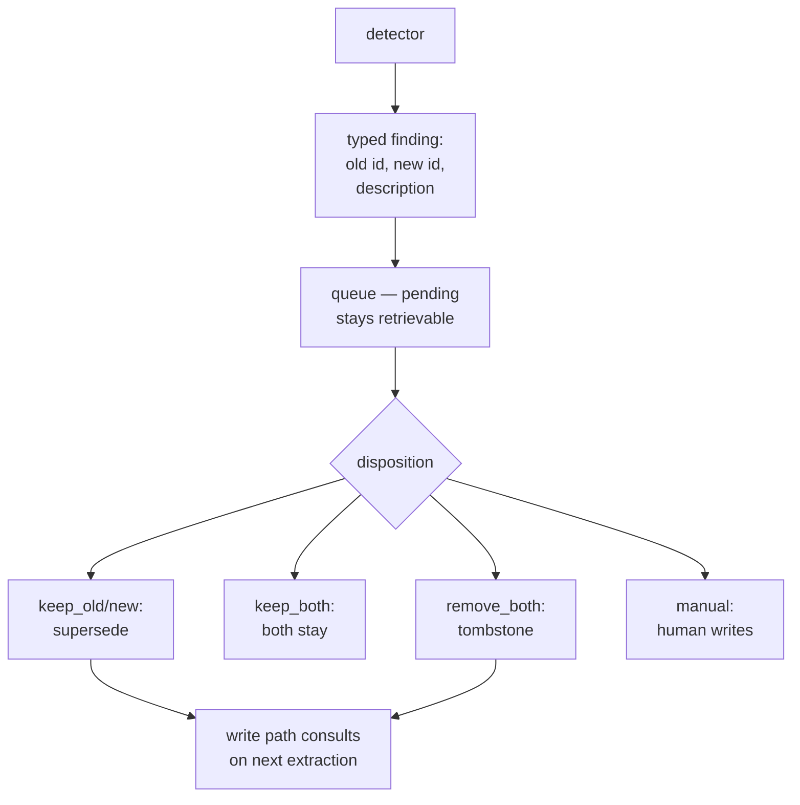

## Intent

Every contradiction a memory system finds must end in a **disposition**: a named
outcome, chosen by someone, recorded where the write path can see it. Detection
without a disposition adds a status field and a growing backlog.

## The problem

Contradiction detection is the easy half and the half everyone builds. Across the
systems reviewed here, the same shape recurs: a detector runs, a memory gets a
flag, and nothing in the codebase says what clears it.

The failure is not that the flag is wrong. It is that a flagged memory is still
*retrievable* and now also *ambiguous* — the system knows two things disagree and
still hands both to the model, which is strictly worse than not knowing, because
the cost of detection was paid and none of the benefit collected.

Three specific traps:

- **A binary resolver forces wrong answers.** "I work at Acme" and "I work at
  Globex" conflict only if you assume one employer. Systems that can only
  supersede or reject cannot say *both are true*, so someone eventually resolves
  a non-conflict incorrectly, or leaves it forever.
- **A blocking queue makes memory useless.** Quarantining every flagged memory
  until a human clears it means the store degrades whenever nobody is looking.
- **A resolution that deletes gets undone.** If the pipeline that produced the
  contradiction runs again — nightly extraction, re-ingestion, re-clustering —
  and the resolution left no trace it can consult, the next pass recreates what
  was just decided against.

## The pattern

```text
detect ──▶ typed finding ──▶ queue (non-blocking) ──▶ disposition ──▶ record
             contradiction        pending items          keep_old        so the
             update               stay retrievable       keep_new        write path
             duplicate                                   keep_both       can consult
             conflict                                    remove_both     it later
                                                         manual(content)
```

Five requirements:

1. **Type the finding.** "Contradiction", "update", "duplicate" and "semantic
   conflict" deserve different dispositions; collapsing them into one flag
   discards the information the detector just produced.
2. **Offer a non-binary disposition set**, including *both are valid* and *a
   human writes the replacement*.
3. **Keep pending findings retrievable.** The flag is a signal, not a gate. Only
   a disposition removes.
4. **Name the actor and the reason.** A resolution with neither is
   indistinguishable from a bug.
5. **Record it where the write path looks.** Otherwise the next extraction pass
   undoes it — see [rejected-value tombstone](../rejected-value-tombstone/).

Keep the detector's *recommendation* vocabulary narrower than the resolver's
*action* vocabulary, so the model's framing does not bound the operator's
options.


```mermaid
%% caption: a detected conflict becomes a typed finding in a queue that stays retrievable while pending, and every disposition writes something the next extraction consults
flowchart TD
    D["detector"] --> F["typed finding:<br/>old id, new id,<br/>description"]
    F --> Q["queue — pending<br/>stays retrievable"]
    Q --> R{"disposition"}
    R --> S["keep_old/new:<br/>supersede"]
    R --> B["keep_both:<br/>both stay"]
    R --> T["remove_both:<br/>tombstone"]
    R --> H["manual:<br/>human writes"]
    S --> W["write path consults<br/>on next extraction"]
    T --> W
```

## Why it works

It converts a standing ambiguity into a decision with an owner. Retrieval stops
handing the model two conflicting memories and hoping; the store gains a record
of *why* it believes what it believes; and the detector's precision becomes
measurable, because kept-versus-dismissed is now data.

The `keep_both` option carries more weight than it looks. Most detected
"contradictions" are two true statements about different times, scopes, or
aspects, and a resolver that cannot express that will either corrupt the store or
stall.

## Tradeoffs

- **It needs a human, or a policy that stands in for one.** A queue with no
  drain rate is a slower version of the original problem.
- **The detector's false-negative rate stays invisible.** Nothing that never
  reaches the queue can be counted, and no system here measures this.
- **Dispositions can be wrong**, and unless the finding and its resolution are
  both retained, a bad resolution is unreviewable.
- **It is only as durable as its record.** A carefully reasoned `remove_both`
  that leaves no tombstone is undone by the next scheduled extraction.

## Cost to adopt

**Build:** a typed finding record, a queue with a non-blocking read semantic, a
disposition enum, and one surface — CLI or UI — where a person acts on it.

**Forces elsewhere:** retrieval must know what a pending finding means, and the
write path must consult resolutions or they decay. Bounding the detection scan
matters too: comparing everything against everything re-surfaces settled pairs
forever.

**Ongoing:** somebody has to drain the queue, and the detector needs its
precision watched or the queue fills with noise and stops being read.

**Skip it if** nothing automatically writes memory. A store only a human edits
resolves conflicts at the keyboard.

## Seen in the atlas

[Memanto](../../systems/memanto/) types the finding and offers a non-binary
disposition set. A scheduled local LLM pass writes a dated JSON report typed as
`contradiction | update | duplicate | conflict` with old and new ids, and a
person resolves each entry through the CLI or web UI as `keep_old`, `keep_new`,
`keep_both`, `remove_both`, `manual` with content they write themselves — a
model validator refuses `manual` without it — or `expire_old`, `expire_new`,
`expire_both`, which retire the losing memory reversibly where the others
delete it. The detection prompt requires at
least one side to be new, keeping the pass linear and stopping the queue
refilling with pairs someone already dismissed. What it lacks is requirement 5:
`remove_both` deletes permanently and leaves no tombstone, so the next night's
extraction may restore it.

[Core Memory](../../systems/core-memory/) has the governance half. Its approval
workflow states the non-blocking rule explicitly — "pending beads stay
retrievable… rejection is the only state that removes" — distinguishes *rejected*
(not memory-worthy, excluded unconditionally, retained with rejecter and reason)
from *superseded* (once true, surfaced on request), and makes a reason mandatory
on every governance action. It is aimed at review rather than at contradiction
specifically, and its approve and reject verbs are also MCP tools the writing
agent holds, recording the approver as a string rather than verifying it.

[Daimon](../../systems/daimon/) solves requirement 5, which Memanto misses, while
placing the decision somewhere neither of the others does: **inside the artifact the user is already reading**. A
detected supersession renders in the next briefing as a flagged item with the
confirm and reject commands printed beside it, so the disposition is chosen at
the moment the stale claim is encountered rather than in a queue nobody opens.
Confirming appends a resolution that withholds the item from later briefings while search ranks it down; the
`forget` path appends a content-keyed tombstone, which is the trace Memanto's
`remove_both` lacks.

[breadcrumbs](../../systems/breadcrumbs/) contributes the requirement none of
the three above states, and it is the one that goes wrong after everything above
is built correctly: **the resolution has to reach the read path, and something has
to check that it did.** Its supersession is ordinary — a newer JSONL line names
the older one through `obsoleted_by` — and its schema doc tells adopters their
boot matcher *should* exclude a superseded entry from current knowledge. What is
unusual is `run_forbidden_check()` in `templates/ledger-tools/retrieval_exam.py`,
which replays a configurable model of that matcher against simulated
session-start conditions and names any superseded entry that still wins an
injection slot, naming the probe that surfaced it, with `--fail-on-forbidden`
turning a hit into a red exit. The docstring is the argument: *"Correction that
stops at the ledger row and never reaches the retrieval lane is not correction;
the descent has to complete."* A store can fail exactly that way on its main
retrieval path with no test that would catch it.

The check is also careful about its own negative result: when every superseded
entry is unreachable it reports `unexercised` rather than clean, because a lane
that never had the chance to make the mistake proves nothing. Other suites here
defend against a vacuous pass by designing the fixture so it cannot pass
vacuously; this one puts the distinction in the verdict vocabulary, where a
later fixture edit cannot quietly remove it.

Three rules make Daimon's briefing surface safe, and all three are transferable. A machine
suggestion is **live by construction** — the liveness fold refuses to let a
`supersede-candidate` suppress anything, so a wrong guess costs a line of noise
and never a memory. **Rejecting a guess needs no evidence, re-opening a resolved
item does**, because overruling a machine suggestion is not the same act as
vouching for a claim, and the code refuses the second without either a live code
anchor or an explicit `--evidence` string. And a human verdict **silences
re-detection permanently**, so the queue cannot refill with something a person
has already answered.

The absence is the more common finding, reached independently in several
reports. [Gini](../../systems/gini-agent/) declares `rejected` and `conflicted`
as states that no native code path writes, so there is nothing to resolve.
[Magic Context](../../systems/magic-context/)'s `flagged` "marks a problem
without an operator surface". [OpenViking](../../systems/openviking/) has merge
operations but "no operator-facing review queue for contradictions".
[Holographic](../../systems/holographic/) surfaces contradictions as an ordinary
query and only reports them.

[MateClaw](../../systems/mateclaw/) stops one step later: it has the queue and
the actor without the effect. A `ContradictionDetector` fills a queue of
unresolved contradictions, and `POST /contradictions/{id}/resolve`, gated on a
workspace `member` role, records `KEEP_A`, `KEEP_B`, `MERGE` or `IGNORE` with
`resolvedAt` and a `resolvedBy` read from the authenticated principal. No code
path reads the verdict to retire, merge or down-trust a fact, so recall returns
both sides before the verdict and after it — a disposition with an owner and a
record, and no consequence.

[Nova AI](../../systems/nova-ai/) answers detection without a queue.
`find_contradictions` checks a word's `is_a` parents against three hardcoded
incompatible category groups and returns a reason per conflict, and
`modules/knowledge/contradiction_checker.py` calls it from a periodic sweep on
the background loop, raising each conflict with the user with a concrete
`weerleg:` proposal, so the refusal is one typed line away. A
`contradiction_state.json` keyed on the word plus its sorted conflict list
remembers what has already been raised, so an unresolved conflict is mentioned
once rather than every cycle — the bounded scan this page's *Cost to adopt*
asks for. The disposition is the refutation itself: `weerleg` sets
`status = "rejected"` with the old status in the concept's audit log (the
`reason` parameter has no caller that fills it), reasoning
filters it out, and `add_sense` refuses to re-add a refuted definition, which is
requirement 5 met by the
[rejected-value tombstone](../rejected-value-tombstone/) rather than by a
separate resolution record.

[Memora](../../systems/memora/) sits between the two groups: it classifies pairs
into a defined vocabulary including `contradicts` as an edge between two named
memories, and its correction pass defaults to a dry run, though `dry_run` is a
parameter on an MCP tool the model calls — and the dispositions available are
supersede or nothing.

[AIMAOS](../../systems/aimaos/) resolves rather than flags, and shows that
resolution alone is not the whole of the pattern either. Its detector is
deterministic and unusually cheap — a phrasing-skeleton match where the value
tokens swap — and the disposition is fixed: the newer statement wins, the
evidence trail restarts, and the replaced wording is kept on the row. Nobody
chooses, nothing records that a conflict occurred beyond the overwritten field,
and no write path consults the outcome. So the same value can be re-asserted and
win the reverse decision immediately. **A disposition that is always the same one
and is never written where a later write can see it leaves the store in the state
this page's first group ends in** — ambiguity resolved, and nothing durable to
show for it.

[Ouroboros](../../systems/ouroboros-agent-os/) is the version where the
disposition ladder is complete, and it is worth reading even though its subject
is a specification rather than a knowledge store. `resolve_conflict` on a
same-key contradiction returns one of five outcomes: identical normalized values
are `SAME_VALUE` and not a conflict at all; a blocked entry is a human-decision
surface in both directions; otherwise a **fixed ten-entry source-priority
ladder** decides, then confidence, and `CONFLICTING` is returned only on an exact
tie of both. No model is consulted anywhere in that function. The outcome is then
written where the next write can see it — the loser's status becomes `WEAK` and
its `rationale` field gains a sentence naming the reason, so the store carries
both the surviving value and why the other one lost. The residual decision
is the exact-tie case, which the ladder is designed to make rare, and it blocks
the interview driver rather than sitting in a queue — an interview
`ouroboros_pm_interview` answers from its parameters as readily as a person at a terminal. Two properties this page
argues for and rarely finds together: **the automatic disposition is
deterministic and free**, so it does not degrade when nobody is looking, and **a
blocker is retirable** — an earlier transient block is cleared by a later
non-blocked same-key answer rather than needing a human to remember it exists.

**[Claude Self-Reflect](../../systems/claude-self-reflect/) has four of the five requirements and deliberately declines the fifth.** Its `csr_resolve` tool writes `resolved`, `still_open` or `regressed` into an append-only `resolution_ledger` with mandatory cited evidence, latest row wins, and a later `regressed` row re-opens a settled chunk — a named disposition, an actor, a reason and a durable record. The schema comment even reasons about who may write: task-derived candidates land in `resolution_proposals`, invisible to search and annotation, because *"automatic writes to `resolution_ledger` would be indistinguishable from human verdicts at read time"*. Two gaps follow. The `source` column that would record that distinction has one production writer, passing the literal `"agent"`. And the disposition never removes anything: resolved chunks are sorted to the tail of the page and annotated, so the verdict is advice to the reading model rather than a state that withholds a memory.

[Resonant Mind](../../systems/resonant-mind/) resolves at write time with one fixed disposition. Each `mind_write` observation looks up same-entity neighbours, discards candidates between 0.80 and 0.85 cosine unreported, and retires anything at 0.85 or more as keep-new by setting `valid_until` and `superseded_by`, with no type, no actor, no reason, and a reply that names neither row. The disposition then reaches two of seven read paths: `mind_search` and `graph_look` hide the retired row, while the dream pools, the wake ritual's orphan pick and the HTTP search return it. It misses requirements 1, 2 and 4 by construction, and shows a failure the list does not name: a disposition stored as a per-query predicate holds only on the queries that remember to apply it.

[Kagura Memory Cloud](../../systems/kagura-memory-cloud/) gives a detected supersession a disposition and keeps the queue from refilling. At embedding time the nearest same-context memory at cosine 0.85 or more is stored in a server-only `supersede_candidate` column and surfaced on every recall until the agent accepts it with a `supersedes` edge or rejects it with `update_memory(dismiss_supersede_candidate=true)`. The rejection records the similarity it was made at, and the detector re-proposes the pair only when a recomputed score moves by 0.02, so a mechanical reindex stays suppressed while a content edit earns a new judgement. The actor on both sides is the agent, and the disposition set is binary: nothing records a reason.

[Octop Memory](../../systems/octop-memory/) is the counterexample for having a disposition in three places. Its rule-only promotion worker parks a candidate whose negation polarity flips against a live atom as `conflict`, and three surfaces resolve the queue: the JSON-RPC approve supersedes the contradicted atom, the CLI approve writes the new atom and leaves the old one live, and the source dashboard's approve sets the status column and writes no atom at all. A separate fallback pass promotes anything left in `needs_review` for seven days, including values it re-queued because they had been rejected twice. One resolver function called by every surface would have closed all three gaps.

[Dynamics-memory](../../systems/dynamics-memory/) meets requirements 1 and 3
and shows a disposition that does not reach the read path. Near-duplicates at
write and suppressed pairs at read enter a tension backlog that an LLM judge
resolves after 20 turns as `synonym`, `update`, `contradiction` or `collision`;
until then the rival is injected beside the selected memory as a conflict line.
But an `update` only moves the loser to an archive pool that retrieval still
scores at a penalty, every contradiction becomes an aggregate flagged
`pending_review` that no code path clears, no verdict records an actor or a
reason, and a re-extracted old value is compared only with visible rows, so it
returns as a new candidate. [breadcrumbs](../../systems/breadcrumbs/)'s
forbidden-item check is the test that would catch the first of these.

[Lint-AI](../../systems/lint-ai/) detects conflicts automatically and gives
them nowhere to go. At every refresh a regex claim chain marks a document
`Conflicted` when a newer claim on the same subject disagrees without a
correction cue or a same-source date, and whenever an inferred replacement hits
a document holding more than that one claim. The status is recomputed from
content, so no actor can resolve it; it clears only when a later document or an
explicit `supersedes_id` changes the chain. MCP search returns it per hit, while
the hook that injects memories automatically drops it, so the flagged record
reaches the model unmarked.

[CTX Cognitive Version Control](../../systems/ctx-open/) shows detection with the disposition decided before anyone looks. Its branch merge compares every entity present on both sides, records a `DivergentChange` for each difference, and then keeps the incoming copy of every shared id and saves the merged working context before returning the list, whose summary calls the conflicts *"requiring review"*. There is no keep-current, keep-both or refuse outcome, and goals are merged without a conflict check at all. The comparison is C# record equality over list-valued fields, so after a round-trip to disk it should also flag entities that did not change — a queue that is both pre-drained and over-filled.

[Counterparts](../../systems/counterparts/) meets requirements 1, 3 and 4 and misses 5. A pair a dream flags or a write notices stays live with an *"Unsettled — may be out of date"* label, and a settle picks `changed`, `corrected` or `open`, each with its own effect on the losing memory, an actor, a reason and an exact undo on the `contradiction_settles` trail. What the settle does not do is reach the write path: a `corrected` memory is archived by id, so the same claim written again in other words mints a new live row, and the write-time neighbour check leaves archived rows out.

## Tests to require

- Detect a contradiction, resolve it every available way, and assert retrieval
  changes correspondingly for each.
- Resolve, then re-run the pipeline that produced the finding, and assert the
  resolution survives.
- Assert a pending finding is still retrievable and a resolved one is not
  ambiguous.
- Feed the detector known non-conflicts (same fact, different phrasing; two facts
  about different periods) and count false positives.
- Assert every resolution records an actor and a reason.
- Leave a finding unresolved for the retention period and assert something
  sensible happens.
- Measure kept-versus-dismissed over a real queue; that ratio is the detector's
  precision and nothing else reports it.

## Related patterns

- [Rejected-value tombstone](../rejected-value-tombstone/)
- [Trust-state machine](../trust-state-machine/)
- [Governed write gateway](../governed-write-gateway/)
- [Bi-temporal fact validity](../bi-temporal-fact-validity/)
