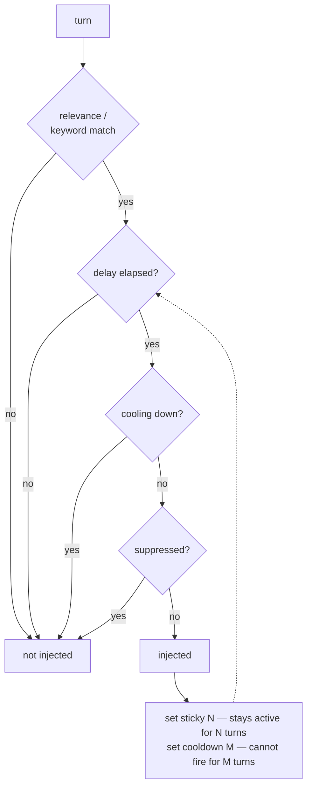

## Intent

Stop a relevance function from being the only thing that decides whether a
memory is in the prompt. Give the unit a small amount of state about its own
recent activation, so surfacing it once changes whether it surfaces again.

The page makes two kinds of claim. Holding back a unit that was surfaced
recently — for a few turns, for a span of time, or for the rest of the session —
and suppressing a unit regardless of match are reported practice, in roleplay
clients, companion apps and coding-agent memory alike. The full set of timed
knobs on one unit — sticky, cooldown and delay, with a stated precedence
between them — is argued, and rests on one system,
[SillyTavern](../../systems/sillytavern/).

## The problem

Ranking is stateless. A retriever asked the same question on consecutive turns
returns the same top hit, and the model says the same thing again — which reads
as obsession to a user and, worse, feeds the model its own last output as fresh
context. The inverse failure is just as common: a thread the conversation is
still working on drops out of the window the moment a slightly better match
appears.

Neither is a scoring bug. Both are the consequence of computing relevance from
the query alone and nothing from what was already said.

The first half is often treated as a tuning problem — raise the threshold,
lower `k`, add a dedup pass over the returned set. Those act on one turn at a
time and cannot express "not again for a while." That needs state that outlives
the turn.

## The pattern

Attach activation state to the unit, and let firing mutate it:

Four independent knobs, each one integer or one flag per unit:

- **Sticky** — having fired, remain active for the next N turns regardless of
  match. Keeps a thread alive.
- **Cooldown** — having fired, refuse to fire for M turns. This is the
  anti-repetition half, and it is the one nothing else replaces.
- **Delay** — refuse to fire until the conversation is N turns old, so
  background material does not arrive before it makes sense.
- **Suppression** — a flag or a durable directive that withholds the unit
  irrespective of match.

Sticky and cooldown together are the hysteresis: the condition for staying in is
not the condition for getting in.

## Why it works

- Repetition becomes expressible. "Relevant, but I just said it" is a state, not
  a threshold to tune.
- It closes a feedback loop cheaply. When the agent's own prior output
  contributes to the next query, a fired-recently marker stops the loop without
  any model call.
- It is authorable. An integer per entry can be set by a person who noticed the
  character repeating itself, which no embedding parameter can be.
- It costs nothing at query time — a comparison against a counter.

## Tradeoffs

Activation stops being a pure function of the query, so the same conversation
state can produce different context depending on history. That is the point, and
it makes behaviour harder to reproduce in a test.

Cross-turn state has to live somewhere. If it is held in memory rather than
persisted, a reload silently resets every cooldown — which is what
[AIPass](../../systems/aipass/)'s per-session state dict does.

Four interacting knobs plus recursion and a budget is a lot of surface. In
[SillyTavern](../../systems/sillytavern/) it is seven interacting mechanisms with
no fixture asserting what fires, which is the predictable end state.

**And there is a result from a neighbouring field arguing that some of the
flipping this page damps is worth keeping.** *The Phenomenon of Policy Churn*,
Schaul, Barreto, Quan and Ostrovski,
[arXiv:2206.00730](https://arxiv.org/abs/2206.00730), v1 1 June 2022, is about
value-based reinforcement learning and not about memory: it finds that the greedy
policy — the argmax over a learned value function — changes its chosen action in
a large fraction of states within *a handful of gradient updates*, and concludes
that this churn is *"a beneficial but overlooked form of implicit exploration"*,
with ε-noise playing *"a much smaller role than expected"*.

The mapping to retrieval is an analogy, and worth stating as one: a top-*k* over
near-tied similarity scores is also an argmax over a learned function, and it
also flips when that function moves — a re-embedding, a new model version, one
more stored item. The transferable part is not a mechanism but a question this
page does not otherwise ask. **How stable is your ranking under changes you did
not intend?** Nobody in this atlas measures it, and it is cheap to measure:
re-run the same queries after a re-index and count how many top-*k* sets changed.
The churn paper's uncomfortable half is that the answer being "a lot" may not be
a defect where recall feeds exploration — see
[sample instead of rank](../../overview/#sample-instead-of-rank-when-recall-feeds-exploration) — while it plainly is one where recall
feeds an answer about a person. Sticky and cooldown damp the flip either way, and
a system that adopts them should know which of those two it is.

## In the analyzed systems

### Holding back what was just surfaced — reported

**[AIPass](../../systems/aipass/)** makes surfacing a rate question with state.
`should_surface(item_id, relevance_score, state, config)` refuses a memory that
cleared the relevance threshold when five have already surfaced this session,
when fewer than ten messages have passed, or when 300 seconds have not elapsed,
and its `surfaced_ids` list keeps an item from surfacing twice in one session.
Every refusal returns a reason; none is logged. The state starts at zero in
`new_state()` and is not persisted, so a restart resets the cooldown and the
list.

**[qwen-code](../../systems/qwen-code/)** excludes auto-memory documents already
surfaced in the session before selection (`excludedFilePaths`, fed from the
client's `surfacedRelevantAutoMemoryPaths`), and a committed case asserts that
such a memory is not selected again. **[memory-ts](../../systems/memory-ts/)**
keeps an `injected_memories` set per session and filters candidates against it;
its test of that dedup asserts only that the third result is no larger than the
second, so it passes when the dedup does nothing.
**[Deja-vu](../../systems/deja-vu/)** runs a novelty tracker that remembers which
ids were already injected, so the same memory is not served twice into one
session. All three are a cooldown whose span is the rest of the session.

**[Project N.E.K.O.](../../systems/neko/)** arrives at suppression from the
correction side rather than the authoring side: a ban-topic directive keyed on
`(kind, term.casefold())` goes into the system prompt and drops any proactive
draft that names the term, expires three days after it was last said scaled by
repetition up to thirty, and a hard filter drops disputed reflections before any
ranker scores them. Its anti-repeat module attacks the same repetition problem
from the generation end, with a BM25 corpus over the agent's own prior output.

**[mini-AGI](../../systems/mini-agi/)** carries the moves on a unit that is not
text at all. Its working set is 32 expert weight files chosen per chunk, and
`choose_by_demand` refuses to swap unless a candidate beats the weakest resident
by `margin` (0.10), while `dwell_chars` (2,048) makes a newly admitted expert
immune to eviction for a fixed span — a displacement threshold and a sticky
window, under those names, for the same reason the prompt-side implementations
have them: *"on text that has not changed, this settles to no movement at all."*
It adds the piece RisuAI supplies separately, as a terminating version: a
cold-start sweep admits one never-resident expert per chunk, in index order,
until every expert has had one turn, then stops for good — because an expert that
has never been resident has never trained, so its router row is noise and pure
relevance would never elect it. The reasoning generalises directly to a memory
that ranks on learned signals, and the termination is the part to copy.

**[RisuAI](../../systems/risuai/)** reserves a random band of its token budget
so old material resurfaces at some rate — the opposite intervention, aimed at
the same failure of recency-plus-similarity being the only signal.

**[Z-Waif](../../systems/z-waif/)** shows the mechanism as a fossil. A
commented-out `lorebook_check` implements a real cross-turn lockout — fire, set
the counter to 9, decrement per turn — and the live `lorebook_gather` resets
every counter at the start of each call, leaving the field as a within-pass
dedup flag. Separately, its retrieval caps the character's own words at two of
six query terms and weights them `0.97`, which is the feedback loop closed by
weighting rather than by state.

### Sticky, cooldown and delay with a stated precedence — argued

**[SillyTavern](../../systems/sillytavern/)** is the complete version and the
one system on this page with all four knobs. `WorldInfoTimedEffects` tracks
sticky, cooldown and delay per entry across chat messages; `@@dont_activate`
supplies suppression; and `NOT_ANY`/`NOT_ALL` key logic lets an entry declare
conditions under which it must not fire at all. The precedence between sticky
and cooldown is written in the code: the callback that runs when a sticky entry
ends puts the entry on cooldown immediately if it has one, so an entry holds for
its sticky span and then goes quiet for its cooldown. What it lacks is the
fixture that would pin any of it.

## Tests to write first

- Fire an entry, advance one turn, assert it does not fire again while cooling.
- Fire a sticky entry, then present a turn it does not match, and assert it is
  still injected.
- Assert a delayed entry cannot fire before its turn threshold.
- Assert suppression beats a positive match, including a forced-activation path
  if one exists.
- Set sticky and cooldown on the same unit and assert the precedence the code
  states — in SillyTavern, cooldown starts when sticky ends.
- Reload the session and assert cooldowns survive, or document that they do not.

Both are cheap fixtures, and SillyTavern has neither.

## Related

- [Decay and reinforcement](../decay-and-reinforcement/) moves a *score* over
  time; this moves *activation* and is orthogonal — a unit can be highly
  reinforced and still cooling down.
- [Rejected-value tombstone](../rejected-value-tombstone/) is durable
  suppression keyed on a value rather than a timed flag on a unit.
- [Memory as an editing surface](../memory-as-an-editing-surface/) is where these
  integers usually get set, because a person noticed the behaviour.
