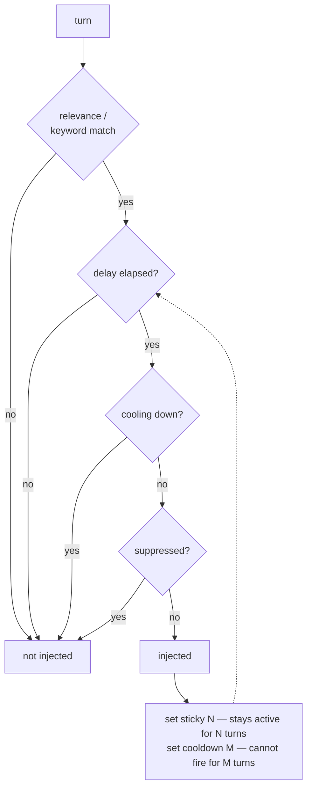

## Intent

Stop a relevance function from being the only thing that decides whether a
memory is in the prompt. Give the unit a small amount of state about its own
recent activation, so surfacing it once changes whether it surfaces again.

## The problem

Ranking is stateless. A retriever asked the same question on consecutive turns
returns the same top hit, and the model says the same thing again — which reads
as obsession to a user and, worse, feeds the model its own last output as fresh
context. The inverse failure is just as common: a thread the conversation is
still working on drops out of the window the moment a slightly better match
appears.

Neither is a scoring bug. Both are the consequence of computing relevance from
the query alone and nothing from what was already said.

Most systems in this atlas notice the first half and treat it as a tuning
problem — raise the threshold, lower `k`, add a dedup pass over the returned
set. Those act on one turn at a time and cannot express "not again for a while."

## The pattern

Attach activation state to the unit, and let firing mutate it:

Four independent knobs, each one integer or one flag per unit:

- **Sticky** — having fired, remain active for the next N turns regardless of
  match. Keeps a thread alive.
- **Cooldown** — having fired, refuse to fire for M turns. This is the
  anti-repetition half, and it is the one nothing else replaces.
- **Delay** — refuse to fire until the conversation is N turns old, so
  background material does not arrive before it makes sense.
- **Suppression** — a flag or a durable directive that withholds the unit
  irrespective of match.

Sticky and cooldown together are the hysteresis: the condition for staying in is
not the condition for getting in.

## Why it works

- Repetition becomes expressible. "Relevant, but I just said it" is a state, not
  a threshold to tune.
- It closes a feedback loop cheaply. When the agent's own prior output
  contributes to the next query, a fired-recently marker stops the loop without
  any model call.
- It is authorable. An integer per entry can be set by a person who noticed the
  character repeating itself, which no embedding parameter can be.
- It costs nothing at query time — a comparison against a counter.

## Tradeoffs

Activation stops being a pure function of the query, so the same conversation
state can produce different context depending on history. That is the point, and
it makes behaviour harder to reproduce in a test — which is exactly why the
implementations below have almost no tests.

Cross-turn state has to live somewhere. If it is held in memory rather than
persisted, a reload silently resets every cooldown.

Four interacting knobs plus recursion and a budget is a lot of surface. In
[SillyTavern](../../systems/sillytavern/) it is seven interacting mechanisms with
no fixture asserting what fires, which is the predictable end state.

## In the analyzed systems

**[SillyTavern](../../systems/sillytavern/)** is the complete version.
`WorldInfoTimedEffects` tracks sticky, cooldown and delay per entry across chat
messages; `@@dont_activate` supplies suppression; and `NOT_ANY`/`NOT_ALL` key
logic lets an entry declare conditions under which it must not fire at all. It
is the only implementation in the atlas with all four.

**[Project N.E.K.O.](../../systems/neko/)** arrives at suppression from the
correction side rather than the authoring side: a ban-topic directive keyed on
`(kind, term.casefold())` withholds a term from recall, and a hard filter drops
disputed entries before the rerank. Its anti-repeat module attacks the same
repetition problem from the generation end, with a BM25 corpus over the agent's
own prior output.

**[Z-Waif](../../systems/z-waif/)** shows the mechanism as a fossil, which is
instructive. A commented-out `lorebook_check` implements a real cross-turn
lockout — fire, set the counter to 9, decrement per turn — and the live
`lorebook_gather` resets every counter at the start of each call, leaving the
field as a within-pass dedup flag. The cooldown was implemented and then
neutered. Separately, its retrieval caps the character's own words at two of six
query terms and weights them `0.97`, which is the feedback loop closed by
weighting rather than by state.

**[RisuAI](../../systems/risuai/)** reserves a random band of its token budget
so old material resurfaces at some rate — the opposite intervention, aimed at
the same failure of recency-plus-similarity being the only signal.

Absent everywhere else. No extraction-based system in this atlas carries per-unit
activation state, and several describe the repetition it prevents as a known
annoyance.

## Tests to write first

- Fire an entry, advance one turn, assert it does not fire again while cooling.
- Fire a sticky entry, then present a turn it does not match, and assert it is
  still injected.
- Assert a delayed entry cannot fire before its turn threshold.
- Assert suppression beats a positive match, including a forced-activation path
  if one exists.
- Set sticky and cooldown on the same unit and assert the documented precedence —
  no implementation in this atlas states which wins.
- Reload the session and assert cooldowns survive, or document that they do not.

The last two are where these implementations are actually weak, and both are
cheap fixtures.

## Related

- [Decay and reinforcement](../decay-and-reinforcement/) moves a *score* over
  time; this moves *activation* and is orthogonal — a unit can be highly
  reinforced and still cooling down.
- [Rejected-value tombstone](../rejected-value-tombstone/) is durable
  suppression keyed on a value rather than a timed flag on a unit.
- [Memory as an editing surface](../memory-as-an-editing-surface/) is where these
  integers usually get set, because a person noticed the behaviour.
