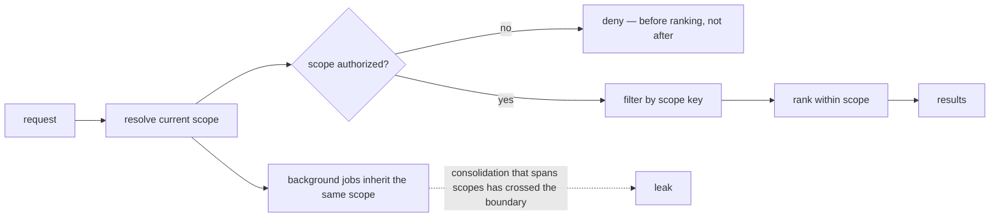

## Intent

Prevent one user, agent, project, room, or session from reading or mutating memory that belongs to another context.

## The problem

A highly relevant memory from the wrong scope is still a severe failure. Adding a `project` field after the storage and retrieval model is built rarely fixes the problem: uniqueness, conflicts, indexes, access checks, inheritance, and deletion may still be global.

## The pattern

Define scope as part of the memory key and every operation:

```text
tenant / user / agent / project / session / memory-key
```

The exact lattice varies. Some systems need a strict hierarchy; others need namespaces or an allow-list of readable scopes. In every case:

- Writes name an owning scope.
- Reads state which scopes are visible.
- Dedupe and conflict checks run within intentional scope boundaries.
- Storage indexes begin with scope.
- Cache and embedding identifiers cannot collide across scopes.
- Authorization is checked independently of relevance.

Put scope first in the physical layout, not just in the predicate:

```sql
CREATE TABLE memory (
  tenant_id  TEXT NOT NULL,
  project_id TEXT NOT NULL,
  id         TEXT NOT NULL,
  body       TEXT NOT NULL,
  PRIMARY KEY (tenant_id, project_id, id)
);

-- Scope leads every index, so a query that forgets it cannot use one.
CREATE INDEX memory_recent ON memory (tenant_id, project_id, created_at DESC);
```

The embedding cache key needs the same treatment — `hash(scope, model, body)`,
never `hash(body)` — or two tenants share a vector and a deletion in one leaks
into the other.



## Why it works

The system can reason about visibility before ranking. Scope-aware identity prevents unrelated memories from overwriting or corroborating each other. It also makes migration, export, retention, and deletion tractable.

## Tradeoffs

Users often expect some memories to inherit: a project may read global preferences, while a private session may not write back globally. Hierarchies introduce precedence and conflict questions. Duplicating memories across scopes creates drift; sharing references creates access and lifecycle coupling.

Scope is not a substitute for authorization. A row tagged `user_id` is unsafe if callers can choose arbitrary IDs.

## Cost to adopt

**Build:** the key in the schema, in every write, and in the read filter — and
resolution logic for what the current scope *is*, which is usually the harder
half.

**Forces elsewhere:** background jobs must carry scope too. Consolidation that
summarizes across two projects has crossed a boundary the retriever would have
enforced, and this is the most common way scope leaks after it is "done".

**Ongoing:** every new memory kind and every new integration is a chance to
forget the key. Composing it into an identity or a storage prefix costs more up
front and survives refactoring; a filter parameter does not.

**Skip it if** the system genuinely has one scope forever. Retrofitting is
painful, so be honest about whether that is true.

## Seen in the atlas

[OpenClaw](../../systems/openclaw/) has the strongest enforcement, and the idea
is one line:

```typescript
function scopedPredicate(agentId: string, filter?: MemoryQueryFilter): string {
  const scope = memoryAgentPredicate(agentId);
  return filter ? `(${scope}) AND (${formatQueryFilter(filter)})` : scope;
}
```

Every `query`, `list`, and `delete` builds its WHERE clause through this helper,
with the comment stating the intent: scope and user filter are composed into one
predicate **so scope cannot be lost**. An unscoped read is not expressible, and
deletes are scoped the same way. Most systems apply scope as a filter somewhere
in the read path; making it structurally inseparable survives refactoring.

[MateClaw](../../systems/mateclaw/) extends the idea across a plugin boundary:
its `MemoryProvider` SPI declares `prefetch(agentId, query, ownerKey)` and
`syncTurn(..., ownerKey)`, so scope crosses into third-party backends. It is the
only one of four host contracts in the atlas that carries scope at all — see
[pluggable memory provider](../pluggable-memory-provider/).

[Gini](../../systems/gini-agent/) applies `agent_id` across all four recall
channels and the HTTP API, and documents the decision as an ADR naming the bug it
fixed: a coding agent's pinned memories were polluting a research agent's recall.
[Magic Context](../../systems/magic-context/) has a `project | ecosystem | universe`
lattice plus a `shareable` flag, with project identity resolved to the git root
and a rekey map for repositories that move.
[Honcho](../../systems/honcho/) and [OpenViking](../../systems/openviking/) carry
tenant and peer boundaries into retrieval itself, OpenViking separating memory
*about* a peer under `peers/<peer_id>`.

The counterexamples are as instructive as the implementations.
[Holographic](../../systems/holographic/) describes itself as a "single-user
memory store" and has no scope column at all; `category` partitions banks, not
access. [CowAgent](../../systems/cowagent/) defaults `scope` to `'shared'`, the
same hazard the atlas flags in [agentmemory](../../systems/agentmemory/) — the
safe value should be the one nobody has to remember to set.
[nanobot](../../systems/nanobot/) is one workspace, one memory, while its UI lets
users switch projects — an invitation to assume isolation that does not exist.
[Moltis](../../systems/moltis/) scopes only by indexed directory, and
[A-MEM](../../systems/a-mem/) and [Swafra](../../systems/swafra/) remain global
corpora.

## Tests to require

- Cross-user, cross-agent, and cross-project leakage.
- Dedupe and conflict behavior for identical keys in different scopes.
- Inheritance and precedence across parent/child scopes.
- Unauthorized caller-supplied scope IDs.
- Cache, embedding, and background-job isolation.
- Export and deletion of exactly one scope.

## Related patterns

- [Explicit write destination](../explicit-write-destination/)
- [Governed write gateway](../governed-write-gateway/)
- [Hybrid retrieval fusion](../hybrid-retrieval-fusion/)
