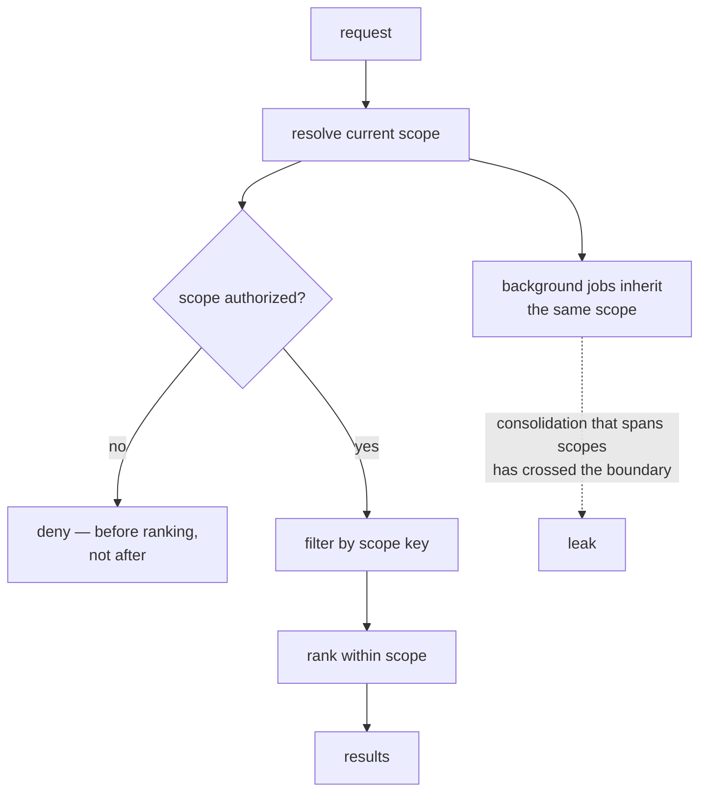

## Intent

Prevent one user, agent, project, room, or session from reading or mutating memory that belongs to another context.

## The problem

A highly relevant memory from the wrong scope is still a severe failure. Adding a `project` field after the storage and retrieval model is built rarely fixes the problem: uniqueness, conflicts, indexes, access checks, inheritance, and deletion may still be global.

## The pattern

Define scope as part of the memory key and every operation:

```text
tenant / user / agent / project / session / memory-key
```

The exact lattice varies. Some systems need a strict hierarchy; others need namespaces or an allow-list of readable scopes. In every case:

- Writes name an owning scope.
- Reads state which scopes are visible.
- Dedupe and conflict checks run within intentional scope boundaries.
- Storage indexes begin with scope.
- Cache and embedding identifiers cannot collide across scopes.
- Authorization is checked independently of relevance.

Put scope first in the physical layout, not just in the predicate:

```sql
CREATE TABLE memory (
  tenant_id  TEXT NOT NULL,
  project_id TEXT NOT NULL,
  id         TEXT NOT NULL,
  body       TEXT NOT NULL,
  PRIMARY KEY (tenant_id, project_id, id)
);

-- Scope leads every index, so a query that forgets it cannot use one.
CREATE INDEX memory_recent ON memory (tenant_id, project_id, created_at DESC);
```

The embedding cache key needs the same treatment — `hash(scope, model, body)`,
never `hash(body)` — or two tenants share a vector and a deletion in one leaks
into the other.



## Why it works

The system can reason about visibility before ranking. Scope-aware identity prevents unrelated memories from overwriting or corroborating each other. It also makes migration, export, retention, and deletion tractable.

## Tradeoffs

Users often expect some memories to inherit: a project may read global preferences, while a private session may not write back globally. Hierarchies introduce precedence and conflict questions. Duplicating memories across scopes creates drift; sharing references creates access and lifecycle coupling.

Scope is not a substitute for authorization. A row tagged `user_id` is unsafe if callers can choose arbitrary IDs.

## Cost to adopt

**Build:** the key in the schema, in every write, and in the read filter — and
resolution logic for what the current scope *is*, which is usually the harder
half.

**Forces elsewhere:** background jobs must carry scope too. Consolidation that
summarizes across two projects has crossed a boundary the retriever would have
enforced, and this is the most common way scope leaks after it is "done".

**Ongoing:** every new memory kind and every new integration is a chance to
forget the key. Composing it into an identity or a storage prefix costs more up
front and survives refactoring; a filter parameter does not.

**Skip it if** the system genuinely has one scope forever. Retrofitting is
painful, so be honest about whether that is true.

## Seen in the atlas

**[Pydantic AI Harness](../../systems/pydantic-ai-harness/) adds the step the
rest of this list is missing: it checks that the filter worked.** Two mechanisms,
both small. The namespace is `str | Callable[[RunContext], str]`, resolved by
application code and documented as *"never exposed as a tool argument"* — so a
model given `write_memory` and `search_memory` has no parameter in which to name
another tenant, and prompt injection cannot ask for one. Then `list_subfiles`
verifies every path the backend returned against the prefix it requested and
raises `RuntimeError('memory backend returned a path outside the requested
scope')` on a mismatch.

That second line is what nothing else here has. Every system on this page
composes a scope into a query and trusts the store to have honoured it; the
`MemoryStore` Protocol is public and third-party implementations are expected,
so this one treats its own backend as untrusted and re-checks the boundary on the
way back. A custom store that forgets the prefix produces a loud crash instead of
a cross-tenant read. The cost is a prefix comparison per returned path, and it
converts the most expensive silent failure in this atlas into the cheapest loud
one.

**[CAMEL](../../systems/camel/) is the cleanest counterexample in the atlas, and
it is what this pattern's failure looks like when nothing is obviously wrong.**
`MemoryRecord` carries an `agent_id`. `AgentMemory` exposes it as a property with
a setter, `ChatAgent` propagates it down, `write_records` stamps it onto every
record, `to_dict` and `from_dict` round-trip it, and `__repr__` prints it. Then
`ChatHistoryBlock.retrieve` calls `self.storage.load()` and returns the store,
and `VectorDBBlock.retrieve` issues `VectorDBQuery(query_vector=..., top_k=limit)`
with no filter. The key is correct, present on every record, and read by nothing.

What supplies isolation instead is *construction*: each agent is normally handed
its own storage object — a separate JSON file, a separate Qdrant collection — so
the boundary holds as long as nobody shares a backend. That is a convention
enforced by nothing, and the stored key makes it harder to notice, because a
reader auditing the code finds `agent_id` everywhere and reasonably concludes the
scoping is done.

**[CrewAI](../../systems/crewai/) is the only system here that makes scope a
path, and it is worth copying if your tenancy is hierarchical.** A record's
scope is `/company/team/user`, matching is by prefix, and the caller holds a
`MemoryScope` — a view of the store rooted at a subtree, with `subscope()` to
descend and a `read_only` flag — rather than passing a key on every call. That
inverts the usual failure: a scope you must remember to pass is a scope you can
forget to pass, and a view you hold cannot be forgotten. `MemorySlice` covers
the case a flat key handles badly, a caller who legitimately spans several
scopes at once.

A second axis rides on top, and the two are genuinely orthogonal: a `source`
records which user or session wrote a memory, and `private` marks it visible
only to that source, filtered in recall as `if not r.private or r.source ==
self.state.source`. Path answers *whose tree is this*; source answers *who wrote
it*. Systems that collapse them cannot express a memory that lives in a shared
team scope and is still nobody else's business.

[OpenClaw](../../systems/openclaw/) has the strongest enforcement in SQL, and the
idea is one line:

```typescript
function scopedPredicate(agentId: string, filter?: MemoryQueryFilter): string {
  const scope = memoryAgentPredicate(agentId);
  return filter ? `(${scope}) AND (${formatQueryFilter(filter)})` : scope;
}
```

Every `query`, `list`, and `delete` builds its WHERE clause through this helper,
with the comment stating the intent: scope and user filter are composed into one
predicate **so scope cannot be lost**. An unscoped read is not expressible, and
deletes are scoped the same way. Most systems apply scope as a filter somewhere
in the read path; making it structurally inseparable survives refactoring.

**[Membase](../../systems/membase/) is the only system here whose scope key is
authenticated rather than asserted.** Every other scope on this page is a string
the caller supplies and the store believes. Membase's account key is an Ethereum
address, every call to its remote hub carries a secp256k1 signature over a
timestamped digest, and the client will not file a memory under any owner but the
one that signature recovers to:

```python
signer = signer_address()
if owner and owner.lower() != signer.lower():
    logging.warning(
        "membase hub: overriding owner=%r with signer wallet %s ...", owner, signer)
```

The override is only half of it — the warning is what tells a caller relying on
the old arbitrary-owner behaviour that it stopped working, instead of letting
writes succeed against the wrong account. This is the *boundary* level of the
three the [comparison](../../compare/) distinguishes in its reading notes —
tag, filter, boundary — and it costs an operator a key rather than an identity
service. It is worth separating from the rest of that
implementation, whose read path is the weakest the atlas has catalogued.

[MateClaw](../../systems/mateclaw/) extends the idea across a plugin boundary:
its `MemoryProvider` SPI declares `prefetch(agentId, query, ownerKey)` and
`syncTurn(..., ownerKey)`, so scope crosses into third-party backends. It is the
only one of four host contracts in the atlas that carries scope at all — see
[pluggable memory provider](../pluggable-memory-provider/).

[Gini](../../systems/gini-agent/) applies `agent_id` across all four recall
channels and the HTTP API, and documents the decision as an ADR naming the bug it
fixed: a coding agent's pinned memories were polluting a research agent's recall.
[Magic Context](../../systems/magic-context/) has a `project | ecosystem | universe`
lattice plus a `shareable` flag, with project identity resolved to the git root
and a rekey map for repositories that move.
[Honcho](../../systems/honcho/) and [OpenViking](../../systems/openviking/) carry
tenant and peer boundaries into retrieval itself, OpenViking separating memory
*about* a peer under `peers/<peer_id>`.

[Memobase](../../systems/memobase/) takes the enforcement one level lower than
anything else here — into the schema. Every memory table declares
`PrimaryKeyConstraint("id", "project_id")` with composite
`ForeignKeyConstraint(["user_id", "project_id"], ...)`, so the tenant key is part
of the row's identity rather than a column a query has to remember. OpenClaw makes
an unscoped read inexpressible in application code; Memobase makes it a schema
error. It also gets a correct cascade delete for free, which is the part most
implementations discover they are missing when someone asks to remove a tenant.

[MIRIX](../../systems/mirix/) is the instance that covers the *whole* read path
rather than the obvious query. It carries four levels — `organization_id`,
`user_id`, `client_id`, and a `filter_tags.scope` — and passes `user_id` and
`organization_id` into every Redis search call as arguments
(`search_recent`, `search_vector`, `search_text`), so the cache path cannot be
looser than the database path. That is the failure this pattern's cost section
warns about, closed. MIRIX also separates `read_scopes` (a list) from
`write_scope` (one value) on the client, which makes "may read everything, may
write only here" a single field rather than a policy document.

MIRIX is additionally the only system in the atlas that **tests** the boundary the
way this pattern's first required test asks: `tests/test_filter_tags_db.py` creates
a memory under one scope, searches under another, and asserts the id is absent —
which is why it carries the atlas's rarest capability mark.

The counterexamples are as instructive as the implementations.
[Holographic](../../systems/holographic/) describes itself as a "single-user
memory store" and has no scope column at all; `category` partitions banks, not
access. [CowAgent](../../systems/cowagent/) defaults `scope` to `'shared'`, the
same hazard the atlas flags in [agentmemory](../../systems/agentmemory/) — the
safe value should be the one nobody has to remember to set.
[nanobot](../../systems/nanobot/) is one workspace, one memory, while its UI lets
users switch projects — an invitation to assume isolation that does not exist.
[Moltis](../../systems/moltis/) scopes only by indexed directory, and
[A-MEM](../../systems/a-mem/) and [Swafra](../../systems/swafra/) remain global
corpora.

[Memory Engine](../../systems/memory-engine/) is the only system in the atlas
that makes the **agent** a scope principal rather than a process borrowing the
user's authority. Grants are `(space, principal, ltree path, level)`, and
delegation is safe because `agent_tree_access` clamps an agent to
`least(agent, owner)` at every path — so a member can grant their own agents
freely and an over-grant clamps down rather than escalating. It also evaluates
authorization *inside* the ranking query rather than as a post-filter, which is
what keeps `LIMIT` meaning the same thing for a caller with narrow grants and
one with wide ones. Its design notes record that row-level security was tried
and rejected on performance, with the benchmark retained — a negative result
this atlas would like to see more often.

[Daimon](../../systems/daimon/) contributes the distinction the others leave
implicit: **scope strictness should depend on what the caller does with the
result.** Its store exposes one read with a `fallback` flag, and the rule is that
callers which *display* what they read may fall back to another project's
pointer, while callers which *persist* what they read may not — so the code path
that folds prior state into a new durable checkpoint always reads with the
fallback off. A leak into a rendering is a confusing screen; a leak into the
write path is a permanent cross-project memory.

Its handling of the permitted fallback is the second idea. Rather than printing
a foreign project's briefing under a warning line, the body is suppressed and
only an orientation header appears, on the reasoning that one warning line above
a hundred foreign lines does not read as a warning. The same instinct governs
its MCP surface, which refuses the fallback outright and returns a message
naming the explicit command instead — an agent tool result carrying another
project's memory is contamination, not convenience.

[CSM](../../systems/csm/) contributes two moves and one warning. The first move
is that **the scope is not an argument**: every public memory tool is
constructed with its `projectId` bound at registration and the parameter is
absent from the tool's argument schema, so the model has no way to express a
cross-project read — verified by a committed test asserting the tool passes its
bound project and `searchMode: 'project'`. The second is that the read path
**fails closed**: project mode with no project id appends the predicate `1=0`
rather than dropping the filter, with a test asserting the empty result and the
message *"project mode without a project ID must fail closed"*. Both are cheap,
and together they close the two failure modes this pattern most often leaves
open — a caller widening its own scope, and a refactor that turns a missing
scope into a table scan.

The warning is about **derived** state. CSM's `memories` table is scoped
rigorously; its `self_model_capabilities` table has no `project_id` at all, and
the updater that fills it reads `experience_packets` with no project filter. So
capability confidence learned in one repository is computed from every
repository and injected into all of them. Scoping the store is the visible half
of the work; scoping everything the store is projected into is the half that
gets skipped, and a derived table is exactly where nobody looks for a leak.

[LoreKit](../../systems/lorekit/) is the instance to read if you are building
for more than one person, because it separates the two things this pattern
routinely conflates. The **scope key** is a validated string with four canonical
forms — `global`, `project::{name}`, `repo::{owner}/{repo}`,
`branch::{owner}/{repo}::{branch}` — normalised to lowercase, rejecting the
single-colon mistake with an error that prints the corrected form, and applied
as an equality filter on every read. The **tenancy boundary** is something else
entirely: row-level security policies gating each read on `auth.uid()` or a
matching `org_id` JWT claim. One says *which* memories are relevant; the other
says *whose* they are, and it holds even against a caller that constructs its own
query.

Then a third layer joins them, which is the part worth stealing.
`org_scope_bindings` maps a scope string to an organisation, and the write RPC
consults it: a write to a bound scope is routed to the org rather than to the
writer, provided `lorekit_org_can(user, org, 'write')` passes. So "this repo's
lessons belong to the team" is a row rather than a convention, and a personal
write into a shared scope becomes a shared memory automatically instead of
silently staying private.

[OpenSRE](../../systems/opensre/) contributes the failure mode nobody else on
this page has hit, because it is the one an *ambient* scope key creates. The
scope is a `ContextVar` bound for the duration of a turn, and every path to the
store funnels through one `memory_dir()`, so no call site can forget to pass a
key — which is the strongest form of this pattern and its own trap. **A
background thread does not inherit a `ContextVar`.** The session-end extractor
runs on a daemon worker, and without `contextvars.copy_context()` the worker
sees no scope and resolves to the org root, filing one user's extracted facts
where their own in-scope turns will never read them. The repository names the bug
in a comment, fixes it with a context copy, and pins it with a test whose
docstring calls itself a regression guard. If your scope key is implicit rather
than a parameter, every thread, task, and executor boundary is a place it can be
dropped silently — and the read path will keep working, which is why it is worth
a test rather than a review.

The same system shows what it costs to be honest about an incomplete boundary:
memory is **off by default** on Slack and Telegram, because Slack storage is
per-user while Telegram is still host-global. Disabling the feature where the key
does not yet reach is a third option beside enforcing and leaking, and it is
rarely taken.

The counterweight, and the reason LoreKit is not simply the best entry here: the
scope *hierarchy* is not enforced anywhere. LoreKit's own README describes agents
reading branch, then repo, then global and merging — and `memory.list` filters on
one exact scope. The ladder is three separate calls a skill file instructs the
agent to make. A validated, RLS-backed, org-routed key whose hierarchy exists
only in prose is a good reminder that a scope *format* and a scope *resolution
order* are different pieces of work, and the second one is easy to assume you
have done.

## Tests to require

- Cross-user, cross-agent, and cross-project leakage.
- Dedupe and conflict behavior for identical keys in different scopes.
- Inheritance and precedence across parent/child scopes.
- Unauthorized caller-supplied scope IDs.
- Cache, embedding, and background-job isolation.
- Export and deletion of exactly one scope.

## Related patterns

- [Explicit write destination](../explicit-write-destination/)
- [Governed write gateway](../governed-write-gateway/)
- [Hybrid retrieval fusion](../hybrid-retrieval-fusion/)
