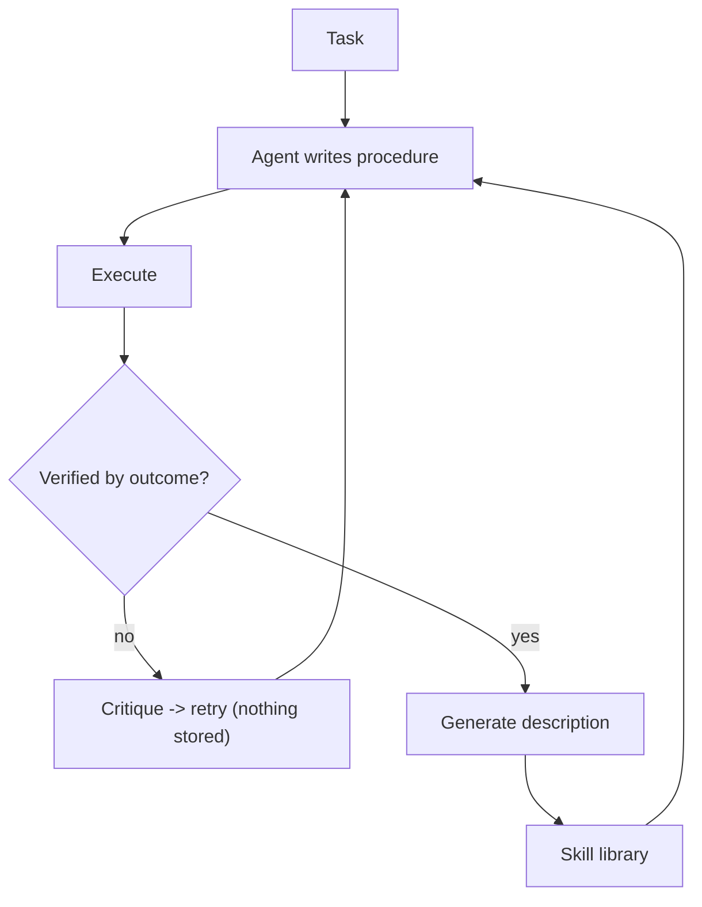

## Intent

Store an agent's competence, not just its knowledge. When the agent works out how to do something, keep the procedure itself — a script, a function, a checklist — so the next attempt starts from a working solution rather than from a description of one.

## The problem

Most agent memory remembers propositions: the user prefers dark mode, the deploy failed at step three, the schema has a `tenant_id` column. Propositional memory answers "what is true?"

It answers "how do I do this?" badly. An agent that solved a fiddly multi-step task last week can retrieve a *summary* of having solved it and still have to rediscover every detail. Worse, a summary of a procedure is exactly the kind of memory that looks right and is subtly wrong — the steps are there, the ordering constraint that made it work is not.

Procedures also have a property propositions lack, and it is the whole opportunity: **you can run them.** "Is this fact true?" requires judgment. "Does this procedure work?" can be answered by executing it and checking the result.

## The pattern

Store the executable artifact. Index it by a generated description of what it does. Gate the write on verified execution.

```text
task -> agent produces a procedure (code, script, sequence)
     -> execute
     -> verify against observable outcome, not model self-report
     -> on success: generate a natural-language description
                    embed the DESCRIPTION, store the PROCEDURE
     -> on failure: feed the failure back as reasoning input; write nothing
retrieval: embed the task -> search descriptions -> return procedures
           -> earlier procedures become primitives for new ones
```



Three invariants make it work:

1. **The retrieval key is not the payload.** Embed a description of intent; return the artifact. Source code embeds poorly.
2. **Verification precedes storage.** The gate is an observed outcome, not the model's confidence.
3. **Failures inform, they do not persist** — at least not in the same store, and not as callable procedures.

## Why it works

It converts memory from recall into capability. A propositional store gets larger as the agent works; a skill library gets *more capable*, because retrieved procedures become building blocks for new ones.

And it sidesteps the hardest problem in the rest of this atlas. Every pattern here about trust — [rejected-value tombstones](../rejected-value-tombstone/), [trust-state machines](../trust-state-machine/), [evidence before belief](../evidence-before-belief/) — exists because propositional truth is expensive to establish. Procedural truth is cheap to establish where actions have observable effects: run it and look.

## Tradeoffs

- **Verification is only as good as the check.** Succeeding once in one state is not evidence of generality, and a skill stored after a single lucky execution is a false memory with a confident-looking provenance.
- **Executing stored artifacts is a trust boundary.** A skill library is durable, agent-authored, retrieved-by-similarity code. Outside a sandbox, in any setting where inputs are not trusted, this is an obvious attack surface.
- **Libraries need pruning, and nobody has a good policy.** Without a utility signal — reuse count, success rate on reuse, composition depth — the library accumulates near-duplicate one-offs.
- **Retrieving the wrong procedure is worse than retrieving the wrong fact.** An irrelevant fact is noise the model can ignore; an irrelevant callable invites the model to call it. Score thresholds matter more here than elsewhere.
- **Supersession needs lineage.** Replacing a skill with a better version is a correction, and correction without a lineage record leaves you unable to answer why behaviour changed.
- **Not every domain has a checkable outcome.** The pattern degrades toward ordinary memory wherever success is a matter of judgment.

Do not use this to store prose "procedures" that nothing executes. Without the verification gate, this is just tagged notes, and it inherits none of the property that makes it worth doing.

## Cost to adopt

**Build:** a store for runnable procedures, a description index to retrieve them
by, and an execution gate that only writes on verified success.

**Forces elsewhere:** you need a sandbox and a real success signal. Without one,
this degrades into storing plausible-looking code that nothing has ever run —
which is worse than not storing it, because it looks authoritative.

**Ongoing:** skills go stale as the environment changes, and nothing invalidates
them automatically. Progressive disclosure keeps their context cost bounded but
adds a loading mechanism.

**Skip it if** you have no execution environment to verify against.

## Seen in the atlas

[Voyager](../../systems/voyager/) is the clearest implementation. Its `SkillManager` stores JavaScript functions written by the agent, indexed by an LLM-generated description; the write happens only inside `if info["success"]:`, where success comes from a critic that inspects environment state. Retrieved skills are injected as callable functions, so the library composes. It also shows the failure modes: unbounded concatenation of every skill into the prompt, retrieval with no score threshold, versions written to disk with no lineage, no failure memory, and one hardcoded exclusion standing in for a memory-worthiness policy.

[Hermes Agent](../../systems/hermes-agent/) applies the same idea without the gate. Skills are Markdown files the agent creates and edits through `skill_manage`, with provenance and usage tracked separately; only names and descriptions occupy prompt space and bodies load on demand — a better context strategy than Voyager's — but nothing verifies a skill before it becomes durable.

[Atomic Agent](../../systems/atomic-agent/) takes the opposite position from Voyager and states it as a rule: its `procedures` are derived alongside a parent lesson from the same consolidator cluster, and cross-phase invariant 20 holds that the runtime **never auto-executes them** — they are "advisory text the agent reads and either follows or consciously deviates from." Voyager buys empirical verification by making skills executable and accepts the trust boundary that follows; Atomic Agent gives up verification to avoid it. Both are defensible, and the choice is the pattern's central tradeoff.

ScienceClaw, an [OpenClaw](../../systems/openclaw/) derivative, demonstrates the scale end: it ships 285 skills against OpenClaw's ~54, and its README states that "the agent writes new `SKILL.md` files at runtime without any redeployment." Runtime skill authoring at that volume is what the pattern looks like when the library is the product — and it sharpens the unanswered pruning question, because nothing in the atlas has a utility signal that would work across 285 entries.

[MemOS](../../systems/memos/) mounts skill memory as one cube type among several, and [agentmemory](../../systems/agentmemory/) keeps procedural records alongside semantic ones; in both, procedure is one kind in a broader taxonomy rather than a design centre, and neither gates on execution.

[OpenViking](../../systems/openviking/) unifies memory, resources, and **skills** in one filesystem hierarchy, which is the most integrated treatment in the atlas — skills are retrievable through the same tiered mechanism as everything else.

[Verel](../../systems/verel/) approaches the same territory from the opposite direction: it clusters *failures* into induced candidate rules and requires promotion gates before they become trusted. Read together with Voyager, the two halves of the missing system are visible — Voyager verifies successes and discards failures; Verel mines failures and gates promotion.

[SESA](../../systems/sesa/) closes the pruning question this page has been
holding open, and shows what it costs. Its skill bank writes a card **only from a
failure** — the exact inversion of Voyager's gate — and then measures every card
it hands out: `retrieved_count`, `helpful_count` and `hurt_count`, all three
written by the same rollout reward that trains the model. A card whose net score
has gone negative after at least three retrievals is **deleted**, not demoted.
That is the utility signal the ScienceClaw entry above says nothing here has, and
the reason it works is a precondition worth stating plainly: SESA is a training
loop, so the outcome is a scored answer rather than a guess about whether the
user was pleased. A library without that signal cannot borrow the mechanism, only
the wish for it.

Two failures sit beside it and both generalise. The eviction leaves **no record**
— `_evict_negatives` drops the row, and `_add_new_with_dedup` compares new cards
only against the live bank, so a similar failure regenerates the card the system
just measured as harmful, back at score zero and needing three more losses to
leave again. And credit is assigned uniformly: all three retrieved cards receive
the outcome of one rollout, so a harmful card is rewarded whenever it rides along
with two good ones. The similarity score that would support weighted attribution
is computed on every retrieval and attached to each card, and no caller reads it.

[Neo4j Agent Memory](../../systems/neo4j-agent-memory/) supplies the half this
pattern's gate leaves out. Its reasoning tier records traces through a context
manager, so on a raised exception the error becomes the trace's outcome — meaning
**failures are stored by default**, where a verified-execution gate by
construction stores only successes. An agent that has failed the same approach
four times has learned nothing if nothing wrote the failures down. Outcomes carry
an indexable error kind, and a retrieved step arrives with its parent trace's
outcome attached, so a step from a failed attempt cannot be read as precedent.

## Tests to require

- Store a skill, then execute the retrieved copy in a fresh context and assert it still succeeds — generality, not just recorded success.
- Assert that a failed attempt produces no durable procedural memory.
- Retrieve against an unrelated task and assert no skill is returned above threshold.
- Supersede a skill and assert the prior version remains retrievable with a lineage link.
- Compose: build a skill that calls a stored skill, then modify the callee and assert the caller's behaviour change is detected.
- Assert the injected skill context stays inside a token budget as the library grows.
- Execute a deliberately malicious stored procedure in the sandbox and assert containment.
- Track reuse and assert that never-reused skills are surfaced for pruning.

## Related patterns

- [Evidence before belief](../evidence-before-belief/)
- [Trust-state machine](../trust-state-machine/)
- [Governed write gateway](../governed-write-gateway/)
- [Decay and reinforcement](../decay-and-reinforcement/)
