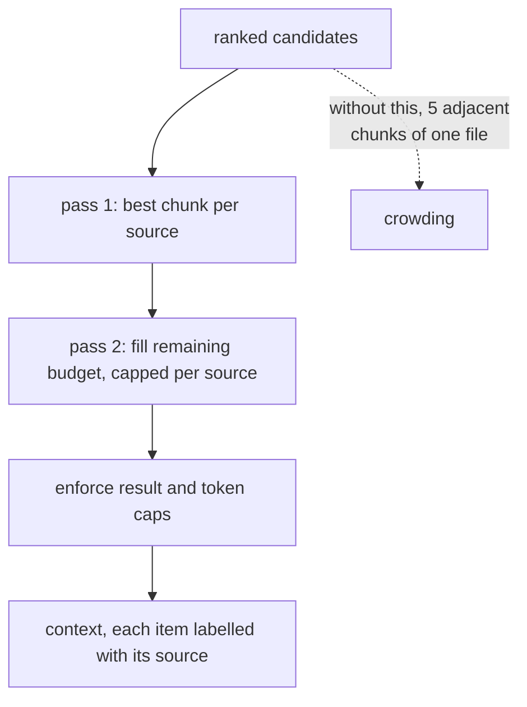

## Intent

Return a useful spread of evidence when top-ranked chunks are dominated by adjacent passages or repeated material from one source.

## The problem

Chunk retrieval often returns several near-duplicates from the same document or session. Those chunks may all score well while consuming the entire context budget. The agent receives depth on one source but misses corroborating, contradicting, or more recent evidence elsewhere.

## The pattern

Rank candidates normally, then apply a source-aware selection policy:

1. Group by stable source identity.
2. Select the best candidate from each source.
3. Allocate the remaining budget to additional chunks where depth is justified.
4. Preserve global ranking as much as possible.
5. Enforce both result and token caps.

Maximal marginal relevance, per-source quotas, or a simple two-pass selector can implement the pattern. The result should expose source labels so the agent can distinguish independent evidence from repeated chunks.

```text
select_diverse(candidates, k, per_source_cap):
    ranked = sort_by_score_desc(candidates)
    picked, taken = [], {}
    for c in ranked:                       # pass 1 — one per source, best first
        if taken.get(c.source, 0) == 0:
            picked.append(c); taken[c.source] = 1
        if len(picked) == k: return picked
    for c in ranked:                       # pass 2 — spend the rest on depth
        if c in picked: continue
        if taken[c.source] < per_source_cap:
            picked.append(c); taken[c.source] += 1
        if len(picked) == k: return picked
    return picked
```

Two passes, global ranking preserved inside each. `per_source_cap` is the only
tuning constant, and every returned item keeps its source label so the agent can
tell independent evidence from one document repeated.



## Why it works

Diversity increases coverage and reduces the illusion of corroboration created by adjacent chunks. It is especially useful for questions spanning sessions, documents, people, or time periods.

## Tradeoffs

Some questions genuinely need several neighboring chunks from one source. A rigid one-per-source rule destroys local context. Weak source identity can over-diversify or collapse unrelated material. Diversity is not correctness; ten different sources can repeat the same wrong claim.

Use a bounded escape hatch: reserve part of the context for source coverage and part for globally best evidence or neighbor expansion.

## Cost to adopt

**Build:** a per-source cap or MMR-style diversity step after ranking, and a
notion of what "source" means for your corpus.

**Forces elsewhere:** it makes retrieval non-monotonic — the best result set is
no longer simply the top *k* by score — so caching and pagination get harder,
and a genuinely single-source question now returns weaker material.

**Ongoing:** the cap is a tuning constant that nothing validates.

**Skip it if** your memories are already one-fact-per-record. Diversity control
matters most when chunking can produce many near-identical neighbours.

## Seen in the atlas

[Swafra](../../systems/swafra/) remains the compact illustration — best chunk per
source title, so one document cannot fill the context.

Two later systems generalize the idea beyond source documents.

[OpenViking](../../systems/openviking/)'s `type_quota_recall.py` (519 lines)
enforces per-memory-type quotas in the result set, so a prolific memory *kind*
cannot crowd out every other kind of context. Diversity keyed on type rather than
document is the right generalization once a system has several memory kinds.

[LlamaIndex](../../systems/llamaindex/) achieves it by construction: each memory
block gets its own share of the long-term token budget and truncates itself to
fit. Static content, retrieved vectors, and extracted facts each keep a
guaranteed slice, and no single contributor can consume the whole budget by
ranking well.

[open-cowork](../../systems/open-cowork/) separates core memory from experience
memory at the *extractor* level, with independent stores — which makes budget
separation between them a natural next step rather than a special case.

[agentmemory](../../systems/agentmemory/) applies per-session diversity within
weighted RRF, and [Hindsight](../../systems/hindsight/) balances four retrieval
arms through task-specific fusion.

The tradeoff sharpens with these examples: a quota guarantees breadth and
forfeits depth. When a question genuinely needs three passages from one document,
or four facts of one kind, a strict quota is the mechanism standing in the way —
which is why every implementation here needs an escape hatch, and why
[LlamaIndex](../../systems/llamaindex/)'s per-block `atruncate` returning
`Optional` is a good shape: a block may decline to shrink and be dropped whole
rather than emit something misleading.

## Tests to require

- Repeated adjacent chunks from one source.
- Queries that require multi-source corroboration.
- Queries that require several chunks from one source.
- Stable source identity across reingestion and renaming.
- Hard result and token limits after diversification.
- Diversity metrics reported beside relevance, not instead of it.

## Related patterns

- [Hybrid retrieval fusion](../hybrid-retrieval-fusion/)
- [Evidence before belief](../evidence-before-belief/)
- [Scope as a first-class key](../scope-as-a-first-class-key/)
