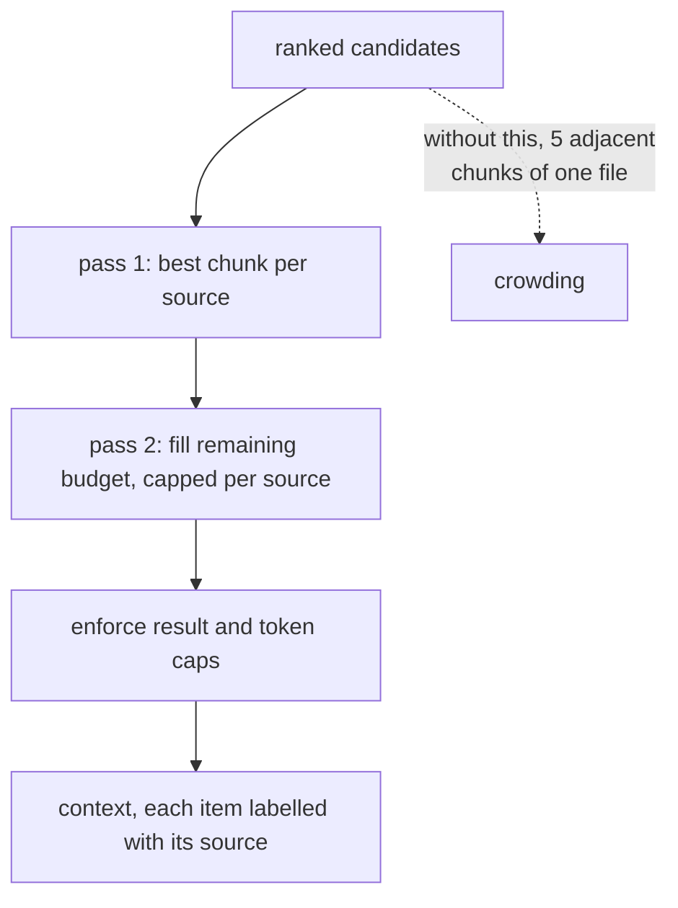

## Intent

Return a useful spread of evidence when top-ranked chunks are dominated by adjacent passages or repeated material from one source.

## The problem

Chunk retrieval often returns several near-duplicates from the same document or session. Those chunks may all score well while consuming the entire context budget. The agent receives depth on one source but misses corroborating, contradicting, or more recent evidence elsewhere.

## The pattern

Rank candidates normally, then apply a source-aware selection policy:

1. Group by stable source identity.
2. Select the best candidate from each source.
3. Allocate the remaining budget to additional chunks where depth is justified.
4. Preserve global ranking as much as possible.
5. Enforce both result and token caps.

Maximal marginal relevance, per-source quotas, or a simple two-pass selector can implement the pattern. The result should expose source labels so the agent can distinguish independent evidence from repeated chunks.

```text
select_diverse(candidates, k, per_source_cap):
    ranked = sort_by_score_desc(candidates)
    picked, taken = [], {}
    for c in ranked:                       # pass 1 — one per source, best first
        if taken.get(c.source, 0) == 0:
            picked.append(c); taken[c.source] = 1
        if len(picked) == k: return picked
    for c in ranked:                       # pass 2 — spend the rest on depth
        if c in picked: continue
        if taken[c.source] < per_source_cap:
            picked.append(c); taken[c.source] += 1
        if len(picked) == k: return picked
    return picked
```

Two passes, global ranking preserved inside each. `per_source_cap` is the only
tuning constant, and every returned item keeps its source label so the agent can
tell independent evidence from one document repeated.



## Why it works

Diversity increases coverage and reduces the illusion of corroboration created by adjacent chunks. It is especially useful for questions spanning sessions, documents, people, or time periods.

## Tradeoffs

Some questions genuinely need several neighboring chunks from one source. A rigid one-per-source rule destroys local context. Weak source identity can over-diversify or collapse unrelated material. Diversity is not correctness; ten different sources can repeat the same wrong claim.

Use a bounded escape hatch: reserve part of the context for source coverage and part for globally best evidence or neighbor expansion.

## Cost to adopt

**Build:** a per-source cap or MMR-style diversity step after ranking, and a
notion of what "source" means for your corpus.

**Forces elsewhere:** it makes retrieval non-monotonic — the best result set is
no longer simply the top *k* by score — so caching and pagination get harder,
and a genuinely single-source question now returns weaker material.

**Ongoing:** the cap is a tuning constant that nothing validates.

**Skip it if** your memories are already one-fact-per-record. Diversity control
matters most when chunking can produce many near-identical neighbours.

## Seen in the atlas

[Swafra](../../systems/swafra/) is the compact illustration: after ranking and a
graph walk it keeps the best chunk per source title and orders sources by that
chunk's score, so one document cannot fill the context. It has no second pass,
so depth is never bought back.

[agentmemory](../../systems/agentmemory/) caps results at three per session inside
its weighted-RRF hybrid search — a per-source cap with the session as the source.

[OpenViking](../../systems/openviking/) keys the quota on memory category rather
than document: its context assembler (`retrieve/context_assembler/gather.py`) runs
one search per bucket — events, entities, preferences, experiences, resources,
skills — and cuts each to its quota before merging, so a prolific memory *kind*
cannot crowd out the rest. The quotas apply only when a caller or a purpose preset
supplies them; otherwise retrieval is one flat top-*k*. Diversity keyed on category
rather than document is the right generalization once a system has several memory
kinds.

[Hindsight](../../systems/hindsight/) applies the same idea one level earlier, by
retrieval arm: per-arm caps keep graph fan-out from monopolizing the candidate pool.

The common form in the corpus is maximal marginal relevance, which diversifies by
content similarity rather than by source identity —
[ClawMem](../../systems/clawmem/) (`src/mmr.ts`),
[Second Brain](../../systems/second-brain-cloudflare/) (λ = 0.7),
[Sonder Runtime](../../systems/sonder-runtime/) (λ = 0.5),
[total-agent-memory](../../systems/claude-total-memory/) and
[Hippo](../../systems/hippo-memory/) all rerank with it. MMR penalizes adjacent
chunks of one file only as far as they resemble what is already picked; a
per-source cap catches them by identity whatever they say.

The tradeoff sharpens with these examples: a quota guarantees breadth and
forfeits depth. When a question needs three passages from one document, or four
facts of one kind, a strict quota is the mechanism standing in the way — which is
why a quota needs an escape hatch, and why Swafra's one-per-source rule, which has
none, is the illustration rather than the model.
[LlamaIndex](../../systems/llamaindex/)'s `atruncate` returning `Optional` is a
good shape for the hatch on the budget side: a block may shrink itself, or return
`None` and be dropped whole rather than emit something misleading. The shape has
no implementation behind it — none of the shipped blocks overrides the default,
blocks are shed lowest-priority first rather than given a share each, and the
default priority of 0 means never truncated, so with default blocks nothing is
cut at all.

## Tests to require

- Repeated adjacent chunks from one source.
- Queries that require multi-source corroboration.
- Queries that require several chunks from one source.
- Stable source identity across reingestion and renaming.
- Hard result and token limits after diversification.
- Diversity metrics reported beside relevance, not instead of it.

## Related patterns

- [Hybrid retrieval fusion](../hybrid-retrieval-fusion/)
- [Evidence before belief](../evidence-before-belief/)
- [Scope as a first-class key](../scope-as-a-first-class-key/)
