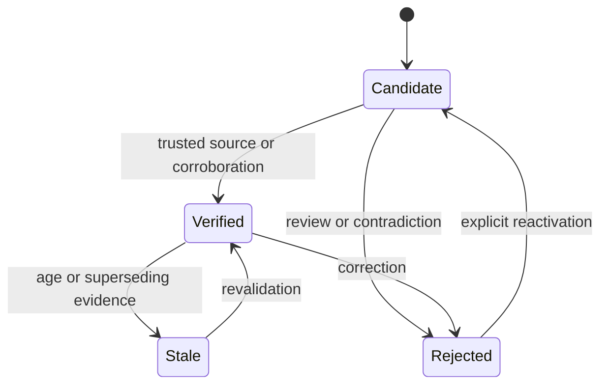

## Intent

Represent the epistemic status of a memory explicitly and make promotion, rejection, correction, retrieval, and pruning depend on that status.

## The problem

An LLM-generated fact, a user assertion, a document sentence, and a corroborated observation do not deserve the same authority. A single active/inactive flag hides that difference. Confidence scores alone are also ambiguous: they often mix truth, retrieval relevance, and model certainty.

## The pattern

Start with a small state machine:

Keep separate dimensions for:

- **Trust state:** whether the memory may be treated as established.
- **Epistemic confidence:** how strongly the evidence supports it.
- **Retrieval strength:** how useful or reachable it has been.

Retrieval policy can then prefer verified memory, include candidates with visible uncertainty when necessary, and suppress rejected records from ordinary context.

## Why it works

The state machine gives every transition a policy boundary. It creates places to require corroboration, human review, held-out evals, or privileged actors. It also makes correction and audit language precise: a memory was rejected, not merely assigned a lower similarity score.

## Tradeoffs

More states create more transitions, UI, and operational policy. A candidate queue can grow forever. Verification can become theater if the verifier repeats the same model or source. Stale is temporal uncertainty, not proof of falsity. Promotion rules must be explainable and scoped to the consequences of being wrong.

For low-risk note retrieval, a full trust machine may be excessive. It matters most when memory changes decisions, identity, permissions, or long-lived behavior.

## Cost to adopt

**Build:** a status column, the legal transitions, and a promotion rule. The
column is trivial; the promotion rule is a policy decision that no schema makes
for you.

**Forces elsewhere:** retrieval must filter by status, or the states are
decoration. Every consumer — prompt assembly, exports, summaries, the UI — has
to decide which states it accepts, and each is a place to get it wrong.

**Ongoing:** candidates pile up unless something promotes or expires them, and
"what verifies a candidate" is a question most systems never answer, which is
how a trust model quietly becomes an unused column.

**Skip it if** you have no verification signal at all. Three states with nothing
able to move a memory between them is worse than one honest bucket.

## Seen in the atlas

[Magic Context](../../systems/magic-context/) contributes the sharpest
refinement: it keeps **two independent axes** rather than one column. `status` is
`active | permanent | archived` — where a memory sits in its lifecycle — and
`verificationStatus` is `unverified | verified | stale | flagged` — what is known
about its truth. A memory can be `active` and `stale` at once, which a single
enum cannot express. Anyone building a trust model should start here.

[Gini](../../systems/gini-agent/) has the richest single enum —
`proposed | active | archived | rejected | conflicted` — and `conflicted` is
unusual: most systems either resolve contradictions silently or handle them
outside the data model. Gini also carries a `network` of
`world | experience | opinion | observation`, so *what kind of claim* it is stays
separate from *how much it is believed*.

[Verel](../../systems/verel/) remains the reference for how states participate in
recall, promotion, consolidation, and pruning, and for separating epistemic
confidence from retrieval strength. [RainBox](../../systems/rainbox/) ties the
transitions to an actor model and an operator review queue.

[Daimon](../../systems/daimon/) is the smallest useful trust model in the atlas —
two states, `verbatim` and `inferred` — and the only one where a transition is
made by *code disproving the model*. The item ships with the class the extractor
chose; then the quote is matched against the transcript and a miss forces the
item down to `inferred`, and an outcome claim with no tool-result citation is
forced down even when its quote matched. Everywhere else in this atlas a state
change is a policy decision about a claim. Here it is a measurement, which is why
two states are enough: the interesting question was never "how sure is the
model" but "is the model's own evidence real".

Its second state machine answers a different question, and the answer is the
best one in this atlas to *how do you know a human approved it*. A refutation —
an approach recorded as having lost under cited evidence — folds to `candidate`,
`active` or `overturned`, and the transition to `active` requires human
authority. What makes it worth copying is that authority is not a field the
caller sets: every row stamps the **channel the write actually arrived through**
(`cli-agent`, `cli-tty`, `ui`, `signed`, `mechanical`), and a table maps channel
to authority. A `--by human` flag was deleted for being *"a flag whose only
function was to let the caller assert its own authority… an actor acting as
witness for its own claim"*; what survives is `--by agent`, which can only
narrow. The human path is the absence of that flag plus an interactive terminal,
and the two strongest channels are unreachable from the CLI entirely, *"because a
channel an agent can reach by shelling out is the deleted `--by human`
renamed."* A hand-edited `ratified: true` on an agent row changes nothing,
because the fold re-derives authority from the channel — there is a test for
exactly that. The design states its own ceiling in the same comment: nothing
local is unforgeable, and what this earns is provenance rather than proof.
A revision returns an active record to `candidate` unless the revising channel
is itself human, so approval attaches to the content and not to the row.

The same design also separates lifecycle from epistemics the way Magic Context
does, but by *location* rather than by column. Trust lives on the item and is
append-only; liveness — resolved, reopened, superseded-candidate, forgotten —
lives in an event log folded at read time. That split has a concrete payoff: the
system can add a lifecycle state without rewriting a single stored memory, and a
rejection recorded in the wrong stream would hide the item instead of demoting
it, which its own source comments call out as the reason the two logs are kept
apart.

Two later systems show the states are only half the work. Gini models
`conflicted` with no visible resolution workflow, and
[MateClaw](../../systems/mateclaw/) ships a dedicated `ContradictionDetector`
with nothing found downstream of it. Detection without a path to resolution
leaves the operator holding a list.

Counterexamples remain instructive. [Holographic](../../systems/holographic/)
collapses truth and reachability into one `trust_score` that feedback mutates
directly. [Mercury](../../systems/mercury-agent/) grades confidence, importance,
and durability separately — good — but assigns all three once at extraction, so
they are estimates rather than states that change with evidence.
[Cognee](../../systems/cognee/) has rich provenance and ontology validity with no
factual promotion state; [Claude-Mem](../../systems/claude-mem/) and
[A-MEM](../../systems/a-mem/) activate generated content with none at all.

[Graphify](../../systems/graphify/) is the cheapest working instance here and the
one to copy if you are starting: three states — `preferred`, `tentative`,
`contested` — none of them supplied by a model, all three *derived* on each run
from a directory of outcome-tagged Q&A files. `tentative` is the state that earns
the pattern: a source cited by one successful answer is recorded and shown but
not promoted, and only a **second distinct result** moves it to `preferred`. The
threshold is a parameter with a test asserting it is not hardcoded, and the
docstring gives the reason in six words — *"one save can't mint a trusted
lesson."* `contested` is entered by the mere presence of both a positive and a
negative signal, then given a verdict by the sign of a 30-day-half-life score, so
contradiction changes the state immediately while recency decides which way it
reads.

Two things generalize past it. The states are **stored on a derived sidecar and
recomputed wholesale**, never written back into the structural store — so the
trust layer is disposable and rebuildable, which is what makes changing the
threshold or the half-life a safe experiment rather than a migration. And the
state **reaches the model as a suffix on the thing it qualifies**
(`learning=contested:stale` beside the node), rather than as a separate block a
reader has to correlate. A trust state that a reader must join by hand is a trust
state most readers will not use.

[CLIO](../../systems/clio/) shows what full enforcement looks like, and then what
happens when the input to it is wrong. Its two states — `unverified` and
`trusted` — cost an entry something in **three independent channels**: a `0.3x`
multiplier in the ranking function, a literal `[UNVERIFIED]` badge appended to
the entry as it is rendered into the system prompt, and a halved age-out with
doubled confidence decay in the consolidation pass. Scoring, presentation and
lifetime. Most implementations here pick one, and picking one is how a trust
state becomes decorative: a tier that only filters is invisible to the model, and
a tier that only badges is invisible to the ranker.

Its promotion rule is the strictest in the atlas — two corroborations from
**distinct** `agent:session` pairs, with the source *identities* stored as an
array rather than a count so independence is checkable, and the unconditional
override withheld from the model's tool list and wired only to a human slash
command. Automatic path with a threshold, manual path behind a person, and the
model able to reach neither directly. That is the shape.

**And it cannot fire.** Both identity components default to `'unknown'` from
environment variables that nothing in the repository ever assigns, so every
corroboration produces the same source key, the sybil dedup rejects the second
one as a duplicate, and the counter stops at one. Every entry stays `unverified`
at `0.3x` — a uniform penalty, which reorders nothing. No test covers it.

Three lessons, in descending order of how often they apply. **A trust threshold
is only as good as the identity it counts**: if independence is the property, the
identity must come from the runtime, not from a default and not from a caller-supplied
argument. **A silent fallback converts missing configuration into a
policy change** — `// 'unknown'` is the whole defect. And **test the property,
not the functions**: every function in CLIO's tier system is correct in
isolation, and one test asserting that two corroborations promote an entry would
have failed on the first run.

[Memory Palace](../../systems/memory-palace/) is the atlas's clearest *procedural*
instance and the one where the state reaches the read path hardest.
`review_state` is `draft | human_reviewed | rejected`, validated on construction,
and `recommend_for_trigger` returns only `human_reviewed` rows — the docstring
calls this "the read-side enforcement of the draft-by-default invariant".
`approve_draft` refuses a rejected row ("create a new draft instead of approving
a rejection") and `increment_success` refuses anything not approved, "so the
success counter truly reflects approved usage". The gap is the one this pattern
always has to be checked for: nothing compares a new draft's `source_hashes`
against rejected rows, so the state is durable for a row and not for a claim.

Two systems in this atlas show the failure mode from opposite directions.
[memory-lancedb-pro](../../systems/memory-lancedb-pro/) has the enum
(`pending | confirmed | archived`) and a read-path gate on it, and then wrote the
candidate state out of existence: every writer emits `confirmed`, four of them
with the comment "write confirmed to unblock auto-recall". The gate survives over
an empty population. [YesMem](../../systems/yesmem/) has the opposite half — a
real trust *model* computed from use count, source and importance that downgrades
a supersede to `pending_confirmation` — and no state machine to receive it:
nothing reads or clears that value, so the correction is simply dropped. A trust
state needs both the field and a transition somebody can make.

[Midas](../../systems/midas/) is worth reading here as a deliberate non-instance.
Its `provenance` field is a discrete four-value enum consulted on the decision
path, and it is not a trust state: it records where a memory came from, not what
anyone believes about it. Separating *authority* from *credence* turns out to be
the more useful axis for gating actions, and conflating the two because the field
is an enum is the easy mistake.

[breadcrumbs](../../systems/breadcrumbs/) is the smallest instance that still
does the job, and the interesting part is *where* it puts the refusal. Its
semantic tier carries two states — `asserted` and `verified` — and
`store_fact()` writes `asserted` unconditionally, on a stated rule: *"Nothing an
agent stores starts verified."* Promotion goes through one function that raises
rather than writes when handed an empty oracle:

> "verified requires naming the oracle (a CI run, a data assertion, a human
> ruling); an agent may not mark its own claim verified with nothing behind it"

Twelve lines, and it converts "the model said so" from a default into something
a caller has to lie about deliberately. The context block then renders the
oracle inline beside the value, so a reader of the *prompt* can see which claims
nobody checked. Its correction ledger sharpens the same idea into an admission
rule — only `ci_failure`, `data_assertion`, `operator_ruling` or `reverted_pr`
count — with one exclusion worth copying verbatim: *"Model-vs-model disagreement
is never a correction."* A stronger model disagreeing with a cheaper one has no
ground truth behind it, and a self-improvement loop that admits it optimises a
proxy.

**[OmniIntelligence](../../systems/omniintelligence/) runs two state machines on
one row and wires them in one direction**, which is the arrangement this pattern
usually collapses. Lifecycle status — `candidate → provisional → validated →
deprecated` — decides whether a pattern may be injected. An evidence tier —
`unmeasured → observed → measured → verified` — decides whether it may *advance*.
Evidence gates status and status never touches evidence, so "how sure are we" and
"what is this allowed to do" cannot contaminate each other.

Two mechanisms are worth taking whole. The tier is **monotonic in SQL**: the
`UPDATE` that writes it carries a `CASE` mapping each tier to a weight and only
matches when the new weight exceeds the stored one, so a redelivered message, a
concurrent writer and a caller with a stale read all fail by touching no rows.
And the transitions are **asymmetric with a stated band** — promotion at a 60%
success rate over five injections, demotion at 40% over ten plus a five-failure
streak and a 24-hour cooldown — with the 20-point gap named in the constant's own
docstring as the thing that keeps variance from flip-flopping a pattern between
states, and the operator's override bounded so the band cannot be closed.

The failure is instructive for anyone building a ladder. `verified` is a valid
value, is gated on, and is written by nothing: the sole writer's pure function
returns only `OBSERVED` or `MEASURED`, above a docstring saying verification
"requires independent validation (not computed here)". A top state nothing can
reach makes every gate that names it unsatisfiable while reading, from the schema
and from the enum, exactly like a state that works.

**[OmniNode's knowledge base](../../systems/omninode-knowledge-base/) gives each
kind of claim its own vocabulary instead of one shared enum**, which is the
cheapest refinement on this page. A decision record moves through `proposed`,
`accepted`, `superseded`, `deprecated` or `rejected`; an architectural pivot
through `observed`, `emerging`, `accepted`, `historical` or `superseded`; a
doctrine principle only `draft`, `accepted` or `deprecated`. The vocabularies are
Pydantic `Literal`s discriminated on a `type` field, exported into the published
JSON schema by the validator that enforces them, so the contract cannot drift
from the check. A pivot also carries `confidence` — `low`, `medium`, `high` — as a
*separate* field from status, which is this pattern's central discipline written
into a schema: how sure you are and whether the claim is current are different
questions, and one column cannot answer both.

The same repository shows the limit of a schema-only state machine. Nothing reads
a status back: `supersedes` and `superseded_by` are validated as lists of strings
and never checked against each other, so the corpus's single supersession pair is
reciprocal by hand. A state machine enforced at the boundary and nowhere else is
a vocabulary, not a machine.

[Ouroboros](../../systems/ouroboros-agent-os/) splits the axis one further step
than this page usually argues for, and the reason is recorded in the code. Its
ledger carries `LedgerSource` — what *kind of authority* a value rests on, from
`USER_GOAL` down through `REPO_FACT`, `CONSERVATIVE_DEFAULT` and `ASSUMPTION` —
and, orthogonally, `DecisionProvenance`: how the decision was *reached*, from
`USER_CONFIRMED`, `MODEL_INFERRED`, `TIMEOUT_DEFAULT`, `LATERAL_CONSENSUS` and
`MAINTAINER_POLICY`. The module says the second axis was added because a
timeout-defaulted decision had been indistinguishable from a user-confirmed one,
so degraded specifications executed silently — the failure this page's
confidence-versus-status split exists to prevent, found one level up. Only the
two model-derived provenances face a clarity gate before the state may execute;
the three grounded ones pass unconditionally, which is a machine rather than a
vocabulary because the gate is where the states are read. Its pre-commit form
repeats the split under different names: `CandidateContentSource` for where
content came from, `ConfirmationAuthority` for who signed off, and
`CandidateResolution` for where it stands, so "why do you believe that" and "who
approved it" have separate answers and both are stored.

**[Hats](../../systems/one-agent-many-hats/) puts a staging arm between `draft`
and `active`, which is the only instance of the shape in this corpus.** A lesson
distilled from a failed run enters at `draft` with confidence 0.5, becomes
`canary` on first injection, and while it is unproven `inCanarySlice` — an FNV-1a
hash of `runId:lessonId` against a 0.5 share (`src/memory/lessons.ts`) — decides
whether this run sees it at all. The runs that do not are a control group,
deterministically so: the same run and the same lesson always decide the same
way, so a rerun is comparable. Promotion then reads outcomes rather than
intentions — two acceptances at confidence ≥ 0.6 promotes; three rejections or
confidence below 0.2 disables with `retiredReason: 'contradicted by outcomes'`;
and six injections with zero tag matches disables it as *"never matched — expired
as noise"*, which separates *wrong* from *useless* as exits. An explicit human
correction skips the ladder and is stored `active` at 0.9, verbatim, because a
correction is not a hypothesis. What the machine does not do is record its own
transitions anywhere: the counters and `retiredReason` are overwritten in place
by a whole-file rewrite, and the runtime's hash-chained audit log is never told.

## Tests to require

- Prove candidates cannot enter verified-only context.
- Exercise every allowed and forbidden state transition.
- Verify rejected records do not return through normal recall.
- Test that retrieval feedback changes usefulness signals, not truth automatically.
- Verify stale records can be revalidated without losing history.
- Test actor permissions for promotion, rejection, and override.

## Related patterns

- [Rejected-value tombstone](../rejected-value-tombstone/)
- [Evidence before belief](../evidence-before-belief/)
- [Governed write gateway](../governed-write-gateway/)
- [Decay and reinforcement](../decay-and-reinforcement/)
