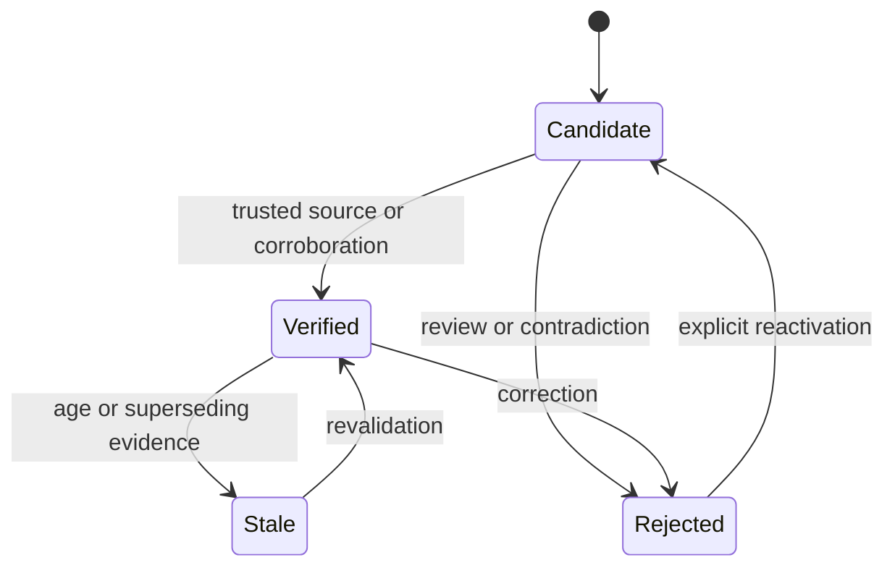

## Intent

Represent the epistemic status of a memory explicitly and make promotion, rejection, correction, retrieval, and pruning depend on that status.

## The problem

An LLM-generated fact, a user assertion, a document sentence, and a corroborated observation do not deserve the same authority. A single active/inactive flag hides that difference. Confidence scores alone are also ambiguous: they often mix truth, retrieval relevance, and model certainty.

## The pattern

Start with a small state machine:

Keep separate dimensions for:

- **Trust state:** whether the memory may be treated as established.
- **Epistemic confidence:** how strongly the evidence supports it.
- **Retrieval strength:** how useful or reachable it has been.

Retrieval policy can then prefer verified memory, include candidates with visible uncertainty when necessary, and suppress rejected records from ordinary context.

## Why it works

The state machine gives every transition a policy boundary. It creates places to require corroboration, human review, held-out evals, or privileged actors. It also makes correction and audit language precise: a memory was rejected, not merely assigned a lower similarity score.

## Tradeoffs

More states create more transitions, UI, and operational policy. A candidate queue can grow forever. Verification can become theater if the verifier repeats the same model or source. Stale is temporal uncertainty, not proof of falsity. Promotion rules must be explainable and scoped to the consequences of being wrong.

For low-risk note retrieval, a full trust machine may be excessive. It matters most when memory changes decisions, identity, permissions, or long-lived behavior.

## Seen in the atlas

[Magic Context](../../systems/magic-context/) contributes the sharpest
refinement: it keeps **two independent axes** rather than one column. `status` is
`active | permanent | archived` — where a memory sits in its lifecycle — and
`verificationStatus` is `unverified | verified | stale | flagged` — what is known
about its truth. A memory can be `active` and `stale` at once, which a single
enum cannot express. Anyone building a trust model should start here.

[Gini](../../systems/gini-agent/) has the richest single enum —
`proposed | active | archived | rejected | conflicted` — and `conflicted` is
unusual: most systems either resolve contradictions silently or handle them
outside the data model. Gini also carries a `network` of
`world | experience | opinion | observation`, so *what kind of claim* it is stays
separate from *how much it is believed*.

[Verel](../../systems/verel/) remains the reference for how states participate in
recall, promotion, consolidation, and pruning, and for separating epistemic
confidence from retrieval strength. [RainBox](../../systems/rainbox/) ties the
transitions to an actor model and an operator review queue.

Two later systems show the states are only half the work. Gini models
`conflicted` with no visible resolution workflow, and
[MateClaw](../../systems/mateclaw/) ships a dedicated `ContradictionDetector`
with nothing found downstream of it. Detection without a path to resolution
leaves the operator holding a list.

Counterexamples remain instructive. [Holographic](../../systems/holographic/)
collapses truth and reachability into one `trust_score` that feedback mutates
directly. [Mercury](../../systems/mercury-agent/) grades confidence, importance,
and durability separately — good — but assigns all three once at extraction, so
they are estimates rather than states that change with evidence.
[Cognee](../../systems/cognee/) has rich provenance and ontology validity with no
factual promotion state; [Claude-Mem](../../systems/claude-mem/) and
[A-MEM](../../systems/a-mem/) activate generated content with none at all.

## Tests to require

- Prove candidates cannot enter verified-only context.
- Exercise every allowed and forbidden state transition.
- Verify rejected records do not return through normal recall.
- Test that retrieval feedback changes usefulness signals, not truth automatically.
- Verify stale records can be revalidated without losing history.
- Test actor permissions for promotion, rejection, and override.

## Related patterns

- [Rejected-value tombstone](../rejected-value-tombstone/)
- [Evidence before belief](../evidence-before-belief/)
- [Governed write gateway](../governed-write-gateway/)
- [Decay and reinforcement](../decay-and-reinforcement/)
