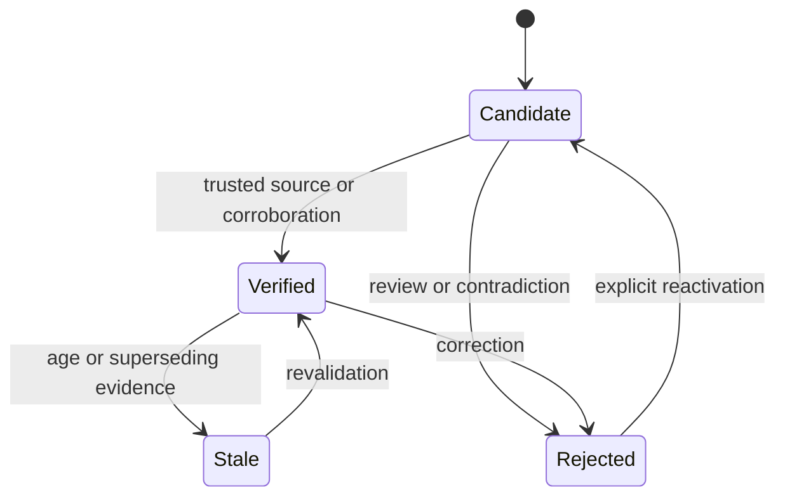

## Intent

Represent the epistemic status of a memory explicitly and make promotion, rejection, correction, retrieval, and pruning depend on that status.

## The problem

An LLM-generated fact, a user assertion, a document sentence, and a corroborated observation do not deserve the same authority. A single active/inactive flag hides that difference. Confidence scores alone are also ambiguous: they often mix truth, retrieval relevance, and model certainty.

## The pattern

Start with a small state machine:

Keep separate dimensions for:

- **Trust state:** whether the memory may be treated as established.
- **Epistemic confidence:** how strongly the evidence supports it.
- **Retrieval strength:** how useful or reachable it has been.

Retrieval policy can then prefer verified memory, include candidates with visible uncertainty when necessary, and suppress rejected records from ordinary context.

## Why it works

The state machine gives every transition a policy boundary. It creates places to require corroboration, human review, held-out evals, or privileged actors. It also makes correction and audit language precise: a memory was rejected, not merely assigned a lower similarity score.

## Tradeoffs

More states create more transitions, UI, and operational policy. A candidate queue can grow forever. Verification can become theater if the verifier repeats the same model or source. Stale is temporal uncertainty, not proof of falsity. Promotion rules must be explainable and scoped to the consequences of being wrong.

For low-risk note retrieval, a full trust machine may be excessive. It matters most when memory changes decisions, identity, permissions, or long-lived behavior.

## Cost to adopt

**Build:** a status column, the legal transitions, and a promotion rule. The
column is trivial; the promotion rule is a policy decision that no schema makes
for you.

**Forces elsewhere:** retrieval must filter by status, or the states are
decoration. Every consumer — prompt assembly, exports, summaries, the UI — has
to decide which states it accepts, and each is a place to get it wrong.

**Ongoing:** candidates pile up unless something promotes or expires them, and
"what verifies a candidate" is a question most systems never answer, which is
how a trust model quietly becomes an unused column.

**Skip it if** you have no verification signal at all. Three states with nothing
able to move a memory between them is worse than one honest bucket.

## Seen in the atlas

[Magic Context](../../systems/magic-context/) contributes the sharpest
refinement: it keeps **two independent axes** rather than one column. `status` is
`active | permanent | archived` — where a memory sits in its lifecycle — and
`verificationStatus` is `unverified | verified | stale | flagged` — what is known
about its truth. A memory can be `active` and `stale` at once, which a single
enum cannot express. Anyone building a trust model should start here.

[Gini](../../systems/gini-agent/) has the richest single enum —
`proposed | active | archived | rejected | conflicted` — and `conflicted` is
unusual: most systems either resolve contradictions silently or handle them
outside the data model. Gini also carries a `network` of
`world | experience | opinion | observation`, so *what kind of claim* it is stays
separate from *how much it is believed*.

[Verel](../../systems/verel/) remains the reference for how states participate in
recall, promotion, consolidation, and pruning, and for separating epistemic
confidence from retrieval strength. [RainBox](../../systems/rainbox/) ties the
transitions to an actor model and an operator review queue.

[Daimon](../../systems/daimon/) is the smallest useful trust model in the atlas —
two states, `verbatim` and `inferred` — and the only one where a transition is
made by *code disproving the model*. The item ships with the class the extractor
chose; then the quote is matched against the transcript and a miss forces the
item down to `inferred`, and an outcome claim with no tool-result citation is
forced down even when its quote matched. Everywhere else in this atlas a state
change is a policy decision about a claim. Here it is a measurement, which is why
two states are enough: the interesting question was never "how sure is the
model" but "is the model's own evidence real".

The same design also separates lifecycle from epistemics the way Magic Context
does, but by *location* rather than by column. Trust lives on the item and is
append-only; liveness — resolved, reopened, superseded-candidate, forgotten —
lives in an event log folded at read time. That split has a concrete payoff: the
system can add a lifecycle state without rewriting a single stored memory, and a
rejection recorded in the wrong stream would hide the item instead of demoting
it, which its own source comments call out as the reason the two logs are kept
apart.

Two later systems show the states are only half the work. Gini models
`conflicted` with no visible resolution workflow, and
[MateClaw](../../systems/mateclaw/) ships a dedicated `ContradictionDetector`
with nothing found downstream of it. Detection without a path to resolution
leaves the operator holding a list.

Counterexamples remain instructive. [Holographic](../../systems/holographic/)
collapses truth and reachability into one `trust_score` that feedback mutates
directly. [Mercury](../../systems/mercury-agent/) grades confidence, importance,
and durability separately — good — but assigns all three once at extraction, so
they are estimates rather than states that change with evidence.
[Cognee](../../systems/cognee/) has rich provenance and ontology validity with no
factual promotion state; [Claude-Mem](../../systems/claude-mem/) and
[A-MEM](../../systems/a-mem/) activate generated content with none at all.

[Graphify](../../systems/graphify/) is the cheapest working instance here and the
one to copy if you are starting: three states — `preferred`, `tentative`,
`contested` — none of them supplied by a model, all three *derived* on each run
from a directory of outcome-tagged Q&A files. `tentative` is the state that earns
the pattern: a source cited by one successful answer is recorded and shown but
not promoted, and only a **second distinct result** moves it to `preferred`. The
threshold is a parameter with a test asserting it is not hardcoded, and the
docstring gives the reason in six words — *"one save can't mint a trusted
lesson."* `contested` is entered by the mere presence of both a positive and a
negative signal, then given a verdict by the sign of a 30-day-half-life score, so
contradiction changes the state immediately while recency decides which way it
reads.

Two things generalize past it. The states are **stored on a derived sidecar and
recomputed wholesale**, never written back into the structural store — so the
trust layer is disposable and rebuildable, which is what makes changing the
threshold or the half-life a safe experiment rather than a migration. And the
state **reaches the model as a suffix on the thing it qualifies**
(`learning=contested:stale` beside the node), rather than as a separate block a
reader has to correlate. A trust state that a reader must join by hand is a trust
state most readers will not use.

[CLIO](../../systems/clio/) shows what full enforcement looks like, and then what
happens when the input to it is wrong. Its two states — `unverified` and
`trusted` — cost an entry something in **three independent channels**: a `0.3x`
multiplier in the ranking function, a literal `[UNVERIFIED]` badge appended to
the entry as it is rendered into the system prompt, and a halved age-out with
doubled confidence decay in the consolidation pass. Scoring, presentation and
lifetime. Most implementations here pick one, and picking one is how a trust
state becomes decorative: a tier that only filters is invisible to the model, and
a tier that only badges is invisible to the ranker.

Its promotion rule is the strictest in the atlas — two corroborations from
**distinct** `agent:session` pairs, with the source *identities* stored as an
array rather than a count so independence is checkable, and the unconditional
override withheld from the model's tool list and wired only to a human slash
command. Automatic path with a threshold, manual path behind a person, and the
model able to reach neither directly. That is the shape.

**And it cannot fire.** Both identity components default to `'unknown'` from
environment variables that nothing in the repository ever assigns, so every
corroboration produces the same source key, the sybil dedup rejects the second
one as a duplicate, and the counter stops at one. Every entry stays `unverified`
at `0.3x` — a uniform penalty, which reorders nothing. No test covers it.

Three lessons, in descending order of how often they apply. **A trust threshold
is only as good as the identity it counts**: if independence is the property, the
identity must come from the runtime, not from a default and not from a caller-supplied
argument. **A silent fallback converts missing configuration into a
policy change** — `// 'unknown'` is the whole defect. And **test the property,
not the functions**: every function in CLIO's tier system is correct in
isolation, and one test asserting that two corroborations promote an entry would
have failed on the first run.

## Tests to require

- Prove candidates cannot enter verified-only context.
- Exercise every allowed and forbidden state transition.
- Verify rejected records do not return through normal recall.
- Test that retrieval feedback changes usefulness signals, not truth automatically.
- Verify stale records can be revalidated without losing history.
- Test actor permissions for promotion, rejection, and override.

## Related patterns

- [Rejected-value tombstone](../rejected-value-tombstone/)
- [Evidence before belief](../evidence-before-belief/)
- [Governed write gateway](../governed-write-gateway/)
- [Decay and reinforcement](../decay-and-reinforcement/)
