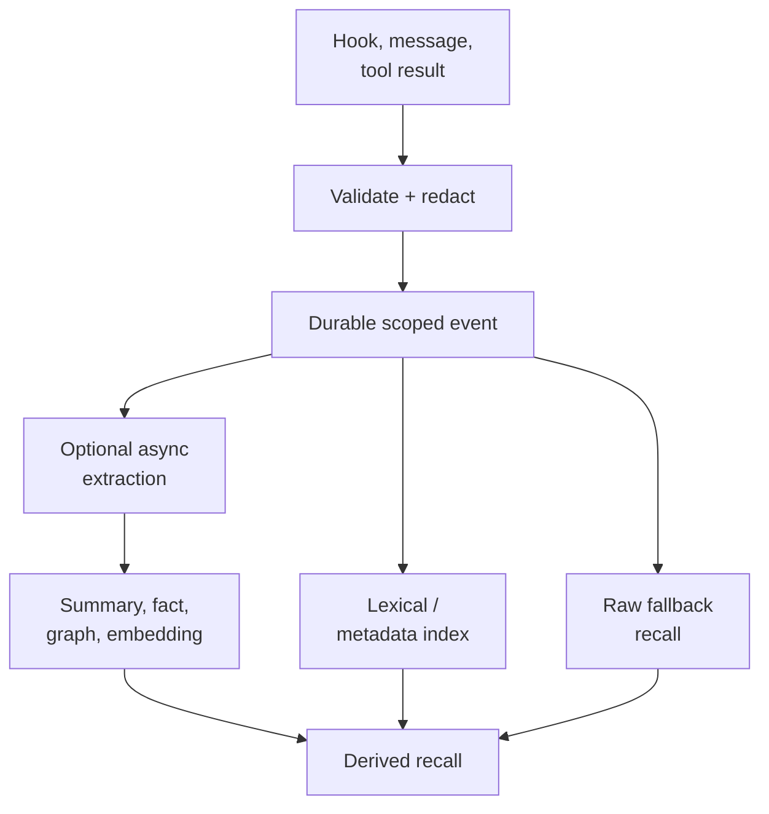

## Intent

Make capture cheap, deterministic, and available even when an extraction model
is slow, unavailable, rate-limited, or unnecessary.

## The problem

If every hook, message, or tool result must pass through an LLM before it can be
stored, memory inherits provider latency and failure. A transient outage can
erase a session from memory, and high-volume agent traces can make capture
prohibitively expensive.

Skipping all processing has its own cost: raw events are noisy, private, and
hard to retrieve. The pattern is therefore not “never use an LLM.” It is “do
not require one to preserve the event.”

**Which means the name overstates it**, and the more standard term for the shape
is *asynchronous enrichment* or a *decoupled write path*. The reason this page
keeps a narrower name is that the standard terms describe a *scheduling* choice —
do the expensive work later — while the load-bearing property here is an
*availability* one: the durable write must be able to complete when no model is
reachable at all. A system with async enrichment that still needs one model call
before anything is persisted has adopted the scheduling and not the guarantee,
which is the failure this page exists to prevent. Read the name as "zero LLM on
the path that must not fail".

## The pattern

Write a deterministic event envelope first:

The synchronous path may compute IDs, hashes, timestamps, scope, file paths,
and a lexical index, but it makes no model call. Expensive compression,
embedding, graph extraction, and consolidation run later and remain optional.

The raw event is useful before enrichment and remains a fallback afterward.
Derived records reference the event ID, and callers can observe whether
enrichment is pending, failed, or complete.

## Why it works

- Capture latency and availability no longer depend on a model provider.
- Provider outages become delayed enrichment rather than lost memory.
- Low-value events can remain raw instead of incurring extraction cost.
- New extractors can reprocess the retained corpus.
- Deterministic lexical and metadata search provides a useful baseline.

## Tradeoffs

Raw capture can retain secrets, huge tool outputs, and irrelevant noise.
Redaction, size limits, retention, and explicit scope still belong on the
synchronous path. Lexical-only recall misses paraphrases, while deferred
enrichment creates a freshness window. A zero-LLM capture claim is misleading
if the system cannot retrieve or inspect the event until later processing
finishes.

## Cost to adopt

**Build:** a synchronous write path with no model dependency, and an enrichment
stage that runs later against the same records.

**Forces elsewhere:** you now store material that has not been structured yet,
so retrieval must handle both enriched and raw records, and the enrichment lag
becomes user-visible — something said is not yet recallable in the enriched
form.

**Ongoing:** two representations of the same memory drift unless enrichment is
idempotent and re-runnable.

**Skip it if** capture volume is low and the model call is reliable. The pattern
buys resilience, and resilience you do not need is complexity.

## Seen in the atlas

[OpenClaw](../../systems/openclaw/) captures with no model call at all, and
spends its effort on a problem model-based capture never has to face: 567 lines in
`memory-capture-sanitization.ts` stripping its own message envelope — media
notes, `⟦openclaw:ctx⟧` markers, reply headers, sender prefixes, timestamps —
with `looksLikeEnvelopeSludge()` rejecting whatever is still mostly wrapper.

[Redis Agent Memory Server](../../systems/redis-agent-memory-server/) shows the
scheduling version: messages land in TTL-scoped working memory immediately, and
`should_extract_session_thread` plus `schedule_trailing_extraction` defer the
model call behind a trailing-edge debounce. The message is durable before
anything expensive happens.

[Magic Context](../../systems/magic-context/) applies the same ordering inside a
single write: `promoteSessionFactsDurable` persists synchronously and
`embedPromotedFacts` runs as a best-effort async pass. Durable first, enriched
after.

[Holographic](../../systems/holographic/) is the minimal version — six regexes
over user turns (`I prefer|like|use`, `we decided/agreed/chose`) storing the raw
matching message. It also demonstrates the cost: what is stored is conversational
prose rather than a normalized claim, which then degrades the contradiction
detection built on top of it.

[Moltis](../../systems/moltis/) exports sanitized session transcripts into its
Markdown corpus; [GenericAgent](../../systems/genericagent/) archives raw sessions
to an L4 layer on a 12-hour cron; [agentmemory](../../systems/agentmemory/) keeps
a synthetic observation path on the hot loop; [Claude-Mem](../../systems/claude-mem/)
queues hook events durably before its observer runs; and
[engram](../../systems/engram/) remains the small no-extraction baseline.

[Daimon](../../systems/daimon/) is the variant worth studying if you have already
decided you need an LLM. Its extraction is a model call and cannot be anything
else — but every mechanism that *guards* that call is stdlib code: quote
verification by string match, outcome grounding by lexicon, redaction by regex,
carry and dedup by term overlap, code anchors by `ast.dump` hashing, external
checks by a `gh` subprocess under a 0.8-second budget.

Two of its zero-LLM passes go further and add memory the model did not produce.
`pin_imperatives` scans user turns for hard imperatives — must, never, don't,
always, forbidden — and force-pins any the model paraphrased away, on the
reasoning that a "never" softened into summary prose leaves nothing to verify
later. And the opt-in scar harvester drafts negative-knowledge candidates from a
session by regex, dropping any hit with no real file path in its own span, on
the stated principle that a scar system dies from noise rather than from a
missed lesson. Both are cheap, both are auditable, and neither can hallucinate.

**The recurring hazard is capturing your own output.** Five systems independently
built guards against it: OpenClaw's envelope sanitizer, Holographic excluding
compaction handoff summaries that were being stored as facts on every context
rollover, nanobot filtering its own `cron:` and `dream:` sessions, Moltis
sanitizing before export, and CowAgent's distillation rules. If you capture
without a model, capture cheaply enough that everything flows in — which means
something must decide what does not.

[Helm](../../systems/helm/) is the smallest instance and demonstrates a second
failure mode: the problem is not only *what* you capture without a
model, it is *what you key it on*. One regex on the reply path — `remember that`,
`note that`, `for the record`, `fyi` — lifts the following span into a durable
fact with no model call and no latency on the turn. The key is
`'note-' + Date.now().toString(36)`.

Because every capture mints a new key, three mechanisms that exist in the same
file never fire: the unique index over `(kind, key)` never matches, supersession
can never trigger, and the evidence counter never increments. Saying "remember
that I prefer X" twice with different values leaves two live, equally-confident,
mutually contradictory facts. Worse, those rows are uncorroborated by
construction, and the nightly pass prunes uncorroborated rows below a confidence
floor — so the one thing the user stated *explicitly* is on the fastest path to
silent deletion.

A model-based extractor gets keying for free by being asked for a subject. A
zero-LLM path has to choose one deterministically, and a timestamp is not a
choice — it is the absence of one. Normalizing the captured span into a slug, or
routing the write through an existing key when one matches, is the work this
pattern skips at its peril.

[CSM](../../systems/csm/) is the pattern held at a scale nothing else here
approaches — 46 tables and 55,000 lines in which the only outbound call is an
embedding request — and it gets the keying right where Helm got it wrong: a
partial unique index on pending candidates over `(candidate_type, dedup_key)`, a
unique index on `(session_id, metadata->>'messageId')` for transcript rows with a
unique-violation handler that returns the existing row rather than failing the
capture, and an `md5(compressed)` index on distilled summaries.

Its failure is the one *after* keying: **naming**. The operational ledger
declares twenty-six event types and its single writer is a switch on the tool
name that can produce seven, so `decision`, `blocker_identified`,
`verification_evidence` and `goal_achieved` are schema no code path emits, and
everything unrecognised becomes `note` with the first 200 characters of tool
output as its summary. The repository's own committed front page shows the
result: 5,111 events, 49 sessions, and a current-state projection reporting no
goal, no phase and no blockers. Determinism buys you a capture path that cannot
hallucinate; it does not decide what is worth capturing, and a classifier with a
catch-all bucket will record volume in place of state. If your event vocabulary
is richer than your emitters, shrink the vocabulary or write the emitters —
leaving the gap open produces a store that looks well-designed and answers
nothing.

[Midas](../../systems/midas/) is the strongest form here, because it removes the
model from *both* ends: nothing is extracted at ingest and nothing is rewritten
at query. Recall returns the verbatim source turn, which is what makes its
`recall@k` computable against gold supporting turns at all — a metric a system
returning LLM-rewritten facts cannot report. It also publishes the cost of the
bet rather than hiding it: whole-conversation aggregation and summarisation are
listed as out of scope by design, "because top-k retrieval can't cover it".

**[Context Mode](../../systems/context-mode/) is the widest deployment of the
idea in this atlas**, and it shows what the ceiling costs. `src/session/extract.ts`
is 2,960 lines of parsers over hook payloads from seventeen different harnesses,
turning a `PostToolUse` into typed events — `file_read`, `error_tool`,
`git_branch`, `decision`, `task`, the plan-mode transitions — with no model
consulted anywhere and no extraction prompt in the tree. Capture is therefore free
and complete, and the entire quality of the memory is the quality of those
parsers: a harness whose payload shape drifts stops producing events, and nothing
notices, because there is no downstream signal that a session was thin.

It is also the clearest case of the pattern's other consequence. Because nothing
judged the material on the way in, nothing can judge it later either — there is no
`UPDATE` on the event table and no confidence to revise. A zero-LLM capture path
tends to arrive with a zero-correction store, and the two are the same decision
seen twice.

**[memoir](../../systems/memoir-cli/) shows what the pattern costs when the
input is prose rather than a typed hook payload, and it is the best-documented
instance of paying that cost.** Its capture pass parses Claude Code's own JSONL
transcripts and mints decisions from seven regexes over the conversation, behind
a nine-rule quality gate — reject under 15 or over 200 characters, containing a
pipe (a table cell), under three words, opening with a pronoun or filler,
containing a question mark, with unbalanced brackets, or 140+ characters not
ending in terminal punctuation. Every rule cites the junk that caused it. The
last two are **truncation signatures**: a capture cut off by a length cap ends
mid-thought, so an unbalanced closing paren means *"the opening '(' was in the
text BEFORE the capture started"*. The refinements to the patterns themselves
carry the same evidence — `going` was dropped from a bare alternation because
*"going on Monday to the office"* minted a decision, with the live store's
`"going on PostDash"` quoted as proof, and the explicit remember-this pattern was
anchored to message start after a phrase like "note that" matched mid-paragraph
inside a long pasted spec.

Two transfers. **Anchor an instruction pattern to the start of a message, and
scope it to the first few hundred characters** — a genuine "remember that X"
opens a turn, while the same words deep inside pasted content were never an
instruction. And **run the quality gate once, before every persistence sink**:
this codebase had two sinks filtering independently, so junk reached one of them
after the other was fixed.

What it does not do is the thing this page's other instances also miss, and here
the fix was one field. The extractor computes a `type` for every match —
`user-note` for the explicit instruction path, `rename`/`tech`/`design`/`stack`
for the inferential ones — and discards it at the write, encoding provenance
instead as the string `auto-captured:` prefixed onto the entry's prose rationale.
The inferential patterns also run over the assistant's text joined with the
user's, so the model's own suggestion can mint a durable decision. A zero-LLM
extractor is cheap enough to run on everything, which is exactly why it needs to
record *whose sentence* each memory came from.

## Implementation checklist

- Assign a stable event ID before acknowledging capture.
- Validate scope, actor, timestamp, and source deterministically.
- Redact private blocks and cap oversized payloads before persistence.
- Make raw events searchable through metadata, exact keys, or FTS.
- Record enrichment state and processor version separately.
- Link every derived record back to the event.
- Keep the enrichment queue idempotent and replayable.
- Define retention for raw evidence independently of derived memory.

## Tests to require

- Capture succeeds with every model provider disabled.
- A crash immediately after acknowledgement does not lose the event.
- Duplicate hooks produce one stable event or an explicit duplicate relation.
- Private and oversized payload policy runs before the durable write.
- Raw recall works while enrichment is pending or failed.
- Replaying enrichment does not duplicate derived memory.
- Deleting an event handles queued and derived artifacts safely.

## Related patterns

- [Evidence before belief](../evidence-before-belief/)
- [Recoverable background work](../recoverable-background-work/)
- [Scope as a first-class key](../scope-as-a-first-class-key/)
- [Hybrid retrieval fusion](../hybrid-retrieval-fusion/)
