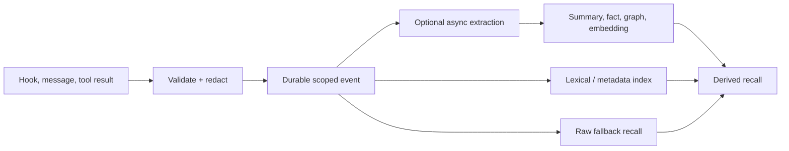

## Intent

Make capture cheap, deterministic, and available even when an extraction model
is slow, unavailable, rate-limited, or unnecessary.

## The problem

If every hook, message, or tool result must pass through an LLM before it can be
stored, memory inherits provider latency and failure. A transient outage can
erase a session from memory, and high-volume agent traces can make capture
prohibitively expensive.

Skipping all processing has its own cost: raw events are noisy, private, and
hard to retrieve. The pattern is therefore not “never use an LLM.” It is “do
not require one to preserve the event.”

## The pattern

Write a deterministic event envelope first:

The synchronous path may compute IDs, hashes, timestamps, scope, file paths,
and a lexical index, but it makes no model call. Expensive compression,
embedding, graph extraction, and consolidation run later and remain optional.

The raw event is useful before enrichment and remains a fallback afterward.
Derived records reference the event ID, and callers can observe whether
enrichment is pending, failed, or complete.

## Why it works

- Capture latency and availability no longer depend on a model provider.
- Provider outages become delayed enrichment rather than lost memory.
- Low-value events can remain raw instead of incurring extraction cost.
- New extractors can reprocess the retained corpus.
- Deterministic lexical and metadata search provides a useful baseline.

## Tradeoffs

Raw capture can retain secrets, huge tool outputs, and irrelevant noise.
Redaction, size limits, retention, and explicit scope still belong on the
synchronous path. Lexical-only recall misses paraphrases, while deferred
enrichment creates a freshness window. A zero-LLM capture claim is misleading
if the system cannot retrieve or inspect the event until later processing
finishes.

## Seen in the atlas

[agentmemory](../../systems/agentmemory/) captures hooks and creates a synthetic
structured observation without an LLM by default, then optionally compresses
and consolidates later. [Claude-Mem](../../systems/claude-mem/) durably queues
hook events before observer generation, so provider and parser failures need
not block the coding agent. [llm-wiki-memory](../../systems/llm-wiki-memory/)
retains transcripts and failed capture inputs before map/reduce distillation.
[TencentDB Agent Memory](../../systems/tencentdb-agent-memory/) stores L0
conversation JSONL and raw offloaded tool output beneath later extracted
layers. [Honcho](../../systems/honcho/) preserves ordinary message streams
before deriving representations. [Engram](../../systems/engram/) demonstrates
the value of a compact SQLite/FTS baseline when extraction is not required.

## Implementation checklist

- Assign a stable event ID before acknowledging capture.
- Validate scope, actor, timestamp, and source deterministically.
- Redact private blocks and cap oversized payloads before persistence.
- Make raw events searchable through metadata, exact keys, or FTS.
- Record enrichment state and processor version separately.
- Link every derived record back to the event.
- Keep the enrichment queue idempotent and replayable.
- Define retention for raw evidence independently of derived memory.

## Tests to require

- Capture succeeds with every model provider disabled.
- A crash immediately after acknowledgement does not lose the event.
- Duplicate hooks produce one stable event or an explicit duplicate relation.
- Private and oversized payload policy runs before the durable write.
- Raw recall works while enrichment is pending or failed.
- Replaying enrichment does not duplicate derived memory.
- Deleting an event handles queued and derived artifacts safely.

## Related patterns

- [Evidence before belief](../evidence-before-belief/)
- [Recoverable background work](../recoverable-background-work/)
- [Scope as a first-class key](../scope-as-a-first-class-key/)
- [Hybrid retrieval fusion](../hybrid-retrieval-fusion/)
