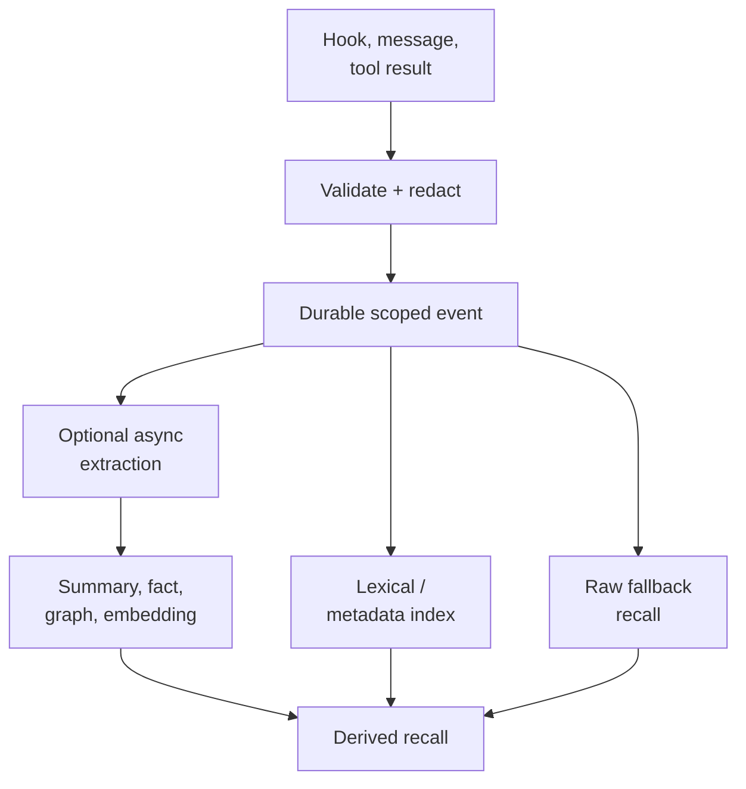

## Intent

Make capture cheap, deterministic, and available even when an extraction model
is slow, unavailable, rate-limited, or unnecessary.

## The problem

If every hook, message, or tool result must pass through an LLM before it can be
stored, memory inherits provider latency and failure. A transient outage can
erase a session from memory, and high-volume agent traces can make capture
prohibitively expensive.

Skipping all processing has its own cost: raw events are noisy, private, and
hard to retrieve. The pattern is therefore not “never use an LLM.” It is “do
not require one to preserve the event.”

## The pattern

Write a deterministic event envelope first:

The synchronous path may compute IDs, hashes, timestamps, scope, file paths,
and a lexical index, but it makes no model call. Expensive compression,
embedding, graph extraction, and consolidation run later and remain optional.

The raw event is useful before enrichment and remains a fallback afterward.
Derived records reference the event ID, and callers can observe whether
enrichment is pending, failed, or complete.

## Why it works

- Capture latency and availability no longer depend on a model provider.
- Provider outages become delayed enrichment rather than lost memory.
- Low-value events can remain raw instead of incurring extraction cost.
- New extractors can reprocess the retained corpus.
- Deterministic lexical and metadata search provides a useful baseline.

## Tradeoffs

Raw capture can retain secrets, huge tool outputs, and irrelevant noise.
Redaction, size limits, retention, and explicit scope still belong on the
synchronous path. Lexical-only recall misses paraphrases, while deferred
enrichment creates a freshness window. A zero-LLM capture claim is misleading
if the system cannot retrieve or inspect the event until later processing
finishes.

## Cost to adopt

**Build:** a synchronous write path with no model dependency, and an enrichment
stage that runs later against the same records.

**Forces elsewhere:** you now store material that has not been structured yet,
so retrieval must handle both enriched and raw records, and the enrichment lag
becomes user-visible — something said is not yet recallable in the enriched
form.

**Ongoing:** two representations of the same memory drift unless enrichment is
idempotent and re-runnable.

**Skip it if** capture volume is low and the model call is reliable. The pattern
buys resilience, and resilience you do not need is complexity.

## Seen in the atlas

[OpenClaw](../../systems/openclaw/) captures with no model call at all, and
spends its effort on a problem model-based capture never has to face: 567 lines in
`memory-capture-sanitization.ts` stripping its own message envelope — media
notes, `⟦openclaw:ctx⟧` markers, reply headers, sender prefixes, timestamps —
with `looksLikeEnvelopeSludge()` rejecting whatever is still mostly wrapper.

[Redis Agent Memory Server](../../systems/redis-agent-memory-server/) shows the
scheduling version: messages land in TTL-scoped working memory immediately, and
`should_extract_session_thread` plus `schedule_trailing_extraction` defer the
model call behind a trailing-edge debounce. The message is durable before
anything expensive happens.

[Magic Context](../../systems/magic-context/) applies the same ordering inside a
single write: `promoteSessionFactsDurable` persists synchronously and
`embedPromotedFacts` runs as a best-effort async pass. Durable first, enriched
after.

[Holographic](../../systems/holographic/) is the minimal version — six regexes
over user turns (`I prefer|like|use`, `we decided/agreed/chose`) storing the raw
matching message. It also demonstrates the cost: what is stored is conversational
prose rather than a normalized claim, which then degrades the contradiction
detection built on top of it.

[Moltis](../../systems/moltis/) exports sanitized session transcripts into its
Markdown corpus; [GenericAgent](../../systems/genericagent/) archives raw sessions
to an L4 layer on a 12-hour cron; [agentmemory](../../systems/agentmemory/) keeps
a synthetic observation path on the hot loop; [Claude-Mem](../../systems/claude-mem/)
queues hook events durably before its observer runs; and
[engram](../../systems/engram/) remains the small no-extraction baseline.

[Daimon](../../systems/daimon/) is the variant worth studying if you have already
decided you need an LLM. Its extraction is a model call and cannot be anything
else — but every mechanism that *guards* that call is stdlib code: quote
verification by string match, outcome grounding by lexicon, redaction by regex,
carry and dedup by term overlap, code anchors by `ast.dump` hashing, external
checks by a `gh` subprocess under a 0.8-second budget.

Two of its zero-LLM passes go further and add memory the model did not produce.
`pin_imperatives` scans user turns for hard imperatives — must, never, don't,
always, forbidden — and force-pins any the model paraphrased away, on the
reasoning that a "never" softened into summary prose leaves nothing to verify
later. And the opt-in scar harvester drafts negative-knowledge candidates from a
session by regex, dropping any hit with no real file path in its own span, on
the stated principle that a scar system dies from noise rather than from a
missed lesson. Both are cheap, both are auditable, and neither can hallucinate.

**The recurring hazard is capturing your own output.** Five systems independently
built guards against it: OpenClaw's envelope sanitizer, Holographic excluding
compaction handoff summaries that were being stored as facts on every context
rollover, nanobot filtering its own `cron:` and `dream:` sessions, Moltis
sanitizing before export, and CowAgent's distillation rules. If you capture
without a model, capture cheaply enough that everything flows in — which means
something must decide what does not.

## Implementation checklist

- Assign a stable event ID before acknowledging capture.
- Validate scope, actor, timestamp, and source deterministically.
- Redact private blocks and cap oversized payloads before persistence.
- Make raw events searchable through metadata, exact keys, or FTS.
- Record enrichment state and processor version separately.
- Link every derived record back to the event.
- Keep the enrichment queue idempotent and replayable.
- Define retention for raw evidence independently of derived memory.

## Tests to require

- Capture succeeds with every model provider disabled.
- A crash immediately after acknowledgement does not lose the event.
- Duplicate hooks produce one stable event or an explicit duplicate relation.
- Private and oversized payload policy runs before the durable write.
- Raw recall works while enrichment is pending or failed.
- Replaying enrichment does not duplicate derived memory.
- Deleting an event handles queued and derived artifacts safely.

## Related patterns

- [Evidence before belief](../evidence-before-belief/)
- [Recoverable background work](../recoverable-background-work/)
- [Scope as a first-class key](../scope-as-a-first-class-key/)
- [Hybrid retrieval fusion](../hybrid-retrieval-fusion/)
